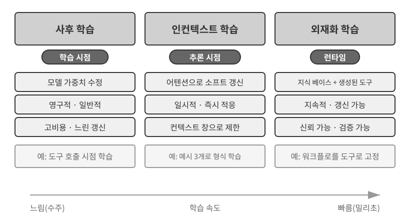
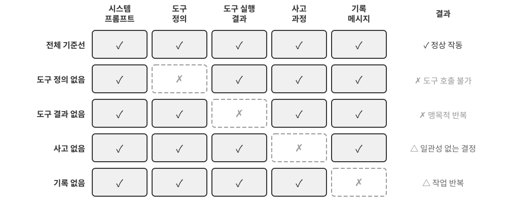
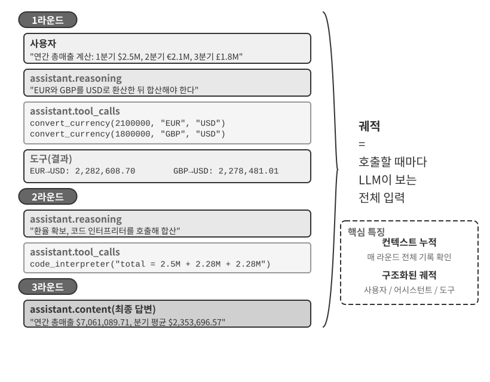
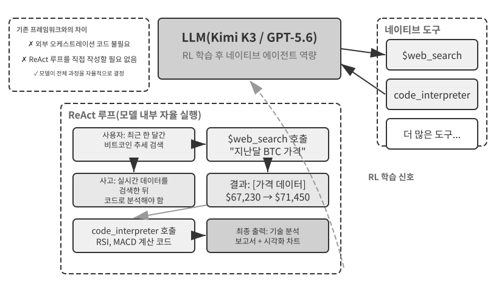
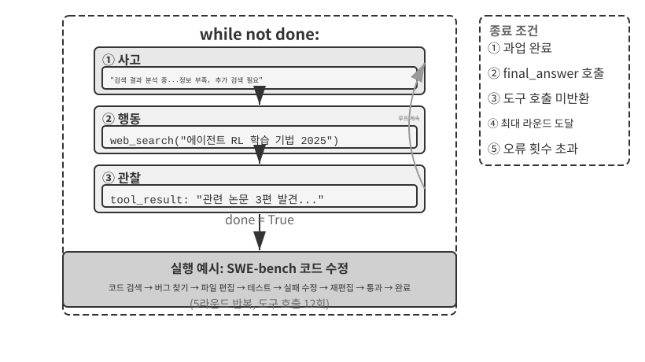

# AI 에이전트 기초

Cursor로 코드를 작성하면서 Cursor가 코드베이스를 검색하고 여러 파일을 수정한 뒤 테스트가 통과할 때까지 다시 실행하는 모습을 본 적이 있다면, 이미 AI 에이전트를 사용해 본 것이다. Deep Research로 검색과 읽기를 반복하며 어떤 주제를 조사했거나, Manus가 브라우저를 조작해 온라인 작업을 끝내도록 했거나, Doubao 스마트폰 비서에게 티켓을 예약하거나 메시지를 보내 달라고 했거나, Pine AI에게 통신 요금을 낮춰 달라고 협상시킨 경험도 마찬가지다.

이 제품들은 형태가 서로 다르지만 한 가지 공통점이 있다. 더 이상 수동적인 “질문하면 답하는” 대화에 머물지 않는다는 점이다. 스스로 실행 단계를 계획하고, 작업에 필요한 도구를 호출하며, 결과가 들어오는 대로 전략을 조정한다. AI 에이전트는 컴퓨터와 상호작용하는 새로운 방식으로 자리 잡고 있다.

이 장은 실용적인 사례에서 출발해 AI 에이전트의 핵심 구성 요소를 거슬러 올라간다. 독자는 현대 에이전트가 무엇을 할 수 있는지 직접 살펴보고, 그 이면의 아키텍처를 이해하며, 에이전트 시스템을 구축하는 설계 패턴과 모범 사례를 익히게 된다.

> **읽기 안내**: 이 장은 책 전체의 개념 지도다. 핵심 공식, 동작 루프, 엔지니어링 프레임워크, 에이전트 설계 패턴을 간결하게 훑으며 이후 장에서 공통으로 사용할 용어와 기준점을 세운다. 처음 읽을 때 모든 개념을 외우려 하지 말고 큰 그림을 파악하는 데 집중하자. 뒤의 각 장은 여기서 소개한 한 측면을 자세히 확장하므로, 방향을 다시 잡아야 할 때 언제든 이 장으로 돌아오면 된다.

## 현대 에이전트 = LLM + 컨텍스트 + 도구

현대 에이전트 시스템의 본질은 하나의 간결한 공식으로 표현할 수 있다. 바로 **에이전트 = LLM(대규모 언어 모델) + 컨텍스트 + 도구**다. 각 항목을 넓은 의미로 이해한다면, 이 공식은 단순하면서도 실용적이다.

- **LLM은 에이전트의 사고 엔진이다**: LLM은 단순한 모델 매개변수 집합이 아니라 의도를 이해하고 사고하며 계획하고 판단하는 에이전트의 의사결정 핵심이다. LLM의 능력은 **사전 학습**에서 습득한 세계 지식과 언어 능력, 그리고 **모델 사후 학습**으로 내재화한 의사결정 전략에서 나온다. 지도 미세 조정(SFT)과 강화 학습(RL) 같은 기법은 7장에서 다룬다.
- **컨텍스트는 에이전트가 사용하는 작업 정보 집합이다**: 모델에 입력되는 텍스트만을 뜻하지 않는다. 환경, 사용자 메모리, 도메인 지식, 에이전트 자체의 상태, 작업 진행 상황처럼 각 의사결정 시점에 에이전트가 이용할 수 있는 모든 정보를 포함한다. 사람이 결정을 내리려면 상황을 파악하고 관련 경험을 떠올리며 참고 자료를 확인해야 하듯, 에이전트의 컨텍스트 창에는 그 순간 활용할 수 있는 정보가 담긴다.
- **도구는 에이전트의 행동 인터페이스다**: 호출할 수 있는 API 함수 몇 개만을 뜻하지 않는다. 미리 정의한 도구 호출과 필요할 때 불러오는 스킬부터, 코드를 생성해 즉석에서 새로운 능력을 만들거나 하위 에이전트에 작업을 위임하는 것, 사용자에게 연락하거나 외부 이벤트에 응답하는 것까지 에이전트가 행동할 수 있는 모든 방식을 아우른다.

좀 더 직관적으로 표현하면 **에이전트 = 사고 엔진 + 작업 컨텍스트 + 행동 인터페이스**다. 모델은 사고하고 결정하며, 컨텍스트는 그 결정의 근거가 되는 작업 정보 집합을 제공하고, 도구는 결정이 외부 세계에 영향을 미치는 인터페이스를 제공한다.

이 세 구성 요소는 강화 학습(RL)의 세 가지 핵심 개념과 정확히 대응한다(7장 참조). 다음 표는 **선택 사항**이다. 강화 학습 배경지식이 없다면 건너뛰어도 이후 내용을 이해하는 데 지장이 없다. 강화 학습을 아는 독자가 그 지식을 이 책의 용어와 연결할 수 있도록 제시한 표다.

| 직관적 표현 | 에이전트 구성 요소 | 강화 학습 개념(선택 사항) | 역할 |
|---------------|----------------|------------------|---------------------------------------------|
| **사고 엔진** | LLM | **정책** | “다음에 무엇을 할지”를 정하는 의사결정 논리. 현재 정보를 바탕으로 가능한 모든 선택지 중 가장 적절한 행동을 고른다. |
| **작업 컨텍스트** | 컨텍스트 | **관측 공간** | 에이전트가 이용할 수 있는 모든 정보. 무엇을 관찰하고 읽고 기억할 수 있는지, 어떤 시스템에 접근할 수 있는지를 포함한다. |
| **행동 인터페이스** | 도구 | **행동 공간** | 에이전트가 할 수 있는 모든 일의 집합. 메시지 전송부터 코드 실행과 인터페이스 조작까지 사용할 수 있는 모든 “수단”을 포함한다. |

각 구성 요소의 역할과 상호작용을 이해하는 것은 효과적인 에이전트 시스템을 구축하는 토대다. 세 요소 중 가장 구체적인 행동 인터페이스인 도구에서 시작해 LLM과 컨텍스트 쪽으로 들어가 보자. 먼저 여러 종류의 에이전트를 이 세 차원에서 비교하면 다음과 같다.

| 에이전트 제품 | 작업 컨텍스트 | 행동 인터페이스 | 전략 |
|-----------------|------------------------|--------------------------|-----------------------------|
| **코딩 에이전트(예: Cursor)** | 요구 사항 문서, 코드베이스, 터미널 환경 | 개방형(내부 사고, 코드 검색, 파일 읽기/쓰기, 명령 실행 등) | 점진적 개발: 요구 사항 이해 → 관련 코드 검색 → 코드 수정 → 테스트와 검증 → 디버깅과 수정 |
| **검색 에이전트(예: Deep Research)** | 웹 자료, 학술 데이터베이스, 로컬 파일 | 개방형(내부 사고, 검색어 작성, 웹 문서 읽기, 요약 생성) | 반복적 심화: 기존 정보를 바탕으로 검색 방향을 조정하며 점차 완성된 보고서를 종합 |
| **컴퓨터 제어 에이전트(예: Manus)** | 컴퓨터 화면, 브라우저 페이지, 파일 시스템 | 개방형(내부 사고, 클릭, 입력, 스크롤, 스크린샷, 코드 실행 등) | 시각 인식 + 조작: 화면 관찰 → 대상 요소 식별 → 행동 수행 → 결과 검증 |
| **스마트폰 비서 에이전트(예: Doubao)** | 스마트폰 화면, 설치된 앱 | 개방형(내부 사고, 클릭, 스와이프, 입력, 앱 실행 등) | 의도 이해 + 앱 제어: 사용자 요구 파악 → 대상 앱 찾기 → 행동 수행 → 완료 확인 |
| **개인 작업 에이전트(예: Pine AI)** | 사용자 계정 정보, 과거 청구서, 서비스 제공자 지식 베이스 | 개방형(내부 사고, 전화 걸기, 이메일 보내기, 양식 작성, 사용자 확인) | 다단계 작업 실행: 정보 수집 → 협상 전략 수립 → 서비스 제공자 연락 → 협상 → 결과 보고 |

이 시스템들에는 세 가지 공통점이 있다. 정해진 버튼 중 하나를 선택하는 대신 임의의 자연어와 코드를 생성하는 **개방형 행동 공간**, 행동하기 전에 계획을 세우는 **내부 사고**, 환경 피드백에 따라 전략을 조정하는 **지속적 상호작용**이다. 이러한 능력은 사고 엔진, 작업 컨텍스트, 행동 인터페이스, 즉 LLM과 컨텍스트와 도구가 맞물릴 때 나온다.

### 도구: 에이전트의 행동 인터페이스

도구는 에이전트와 외부 세계를 잇는 다리다. 도구는 수동적인 관찰자에 머물던 에이전트를 검색하고, 파일을 쓰고, 코드를 실행하고, API를 호출하고, 메시지를 보내고, 인터페이스를 조작하는 능동적인 시스템으로 바꾼다. 도구가 없으면 에이전트는 텍스트 생성에 한정되지만, 도구가 있으면 외부 시스템에 행동을 가할 수 있다.

도구를 체계적으로 논의하기 위해 에이전트가 세계와 상호작용하는 방향에 따라 다섯 종류로 나눌 수 있다. 여기서는 전체 그림을 잡을 수 있도록 각 유형의 대표적인 사용 사례만 간단히 살펴보고, 뒤의 장에서 각각 자세히 다룬다.

**인식 도구**는 에이전트가 정보에 접근하게 한다. 검색 엔진은 실시간 웹 데이터를 제공하고, 파일 시스템은 로컬 문서를 읽으며, API와 데이터베이스는 외부 서비스와 기업의 핵심 데이터에 연결한다.

**실행 도구**는 에이전트가 외부 시스템에 행동을 가하게 한다. 코드 실행, 파일 작업, 시스템 명령, 외부 API 호출은 결정을 구체적인 행동으로 바꾼다.

**협업 도구**는 에이전트가 다른 에이전트와 일을 나누게 한다. 전문 작업을 하위 에이전트에 위임하거나, 중요한 의사결정 지점에서 사람에게 확인을 요청하거나, 멀티 에이전트 시스템의 행동을 조율할 수 있다.

**이벤트 트리거 도구**는 앞의 세 유형과 호출 방식부터 근본적으로 다르다. 에이전트가 이 도구를 호출하는 것이 아니라, 외부 입력으로 들어와 에이전트가 작업을 시작하도록 촉발한다. 새 이메일이 도착하거나 예약 시간이 되거나 다른 시스템에서 Webhook 콜백이 발생하면, 해당 이벤트가 에이전트를 활성화해 사고와 행동을 시작시킨다. 에이전트가 직접 호출하지는 않지만 외부 세계와 상호작용하는 통로이므로 넓은 의미의 도구 체계에 포함한다.

**사용자 커뮤니케이션 도구**는 에이전트가 사용자와 소통하는 통로다. 실행 도구가 외부 세계를 바꾼다면 커뮤니케이션 도구는 정보를 전달한다. 문자 메시지, 음성 통화, 이메일 등으로 에이전트의 진행 상황을 알리거나 먼저 사용자에게 확인을 요청한다.

4장에서는 이 다섯 유형의 전체 분류 체계와 설계 원칙을 다룬다. 도구 설계의 품질은 에이전트가 무엇을 안정적으로 수행할 수 있는지를 직접 결정한다. 인터페이스가 모호하면 모델이 도구를 잘못 사용하고, 오류 처리가 부실하면 도구 하나의 실패로 에이전트가 멈출 수 있으며, 권한 범위가 지나치게 넓으면 한 번의 에이전트 오류가 되돌릴 수 없는 결과로 이어질 수 있다. MCP(Model Context Protocol) 표준이 확산하면서 도구 통합은 플러그인을 설치하는 것만큼 쉬워지고 있다. 생태계는 빠르게 확장되지만 설계 원칙은 낡지 않는다.

**도구 호출**(Function Calling이라고도 한다)은 현대 LLM 에이전트의 핵심 능력이다. 모델이 외부 도구를 구조화된 방식으로 호출할 수 있게 해, LLM을 단순한 텍스트 생성기에서 외부 인터페이스를 통해 행동하는 지능형 시스템으로 바꾼다. 이 책에서는 일관되게 “도구 호출”이라는 용어를 사용한다.

도구 호출은 네 단계로 진행된다. 먼저 컨텍스트가 사용할 수 있는 도구의 이름, 용도, 매개변수를 모델에 알려 준다. 다음으로 모델이 도구를 호출할지, 어떤 도구를 어떤 인수로 호출할지 스스로 결정한다. 도구 실행이 끝나면 결과를 컨텍스트에 추가한다. 마지막으로 모델은 그 결과를 바탕으로 다음 행동을 결정한다. 이 루프는 뒤에서 소개할 ReAct의 토대다.

날씨를 묻는 요청을 예로 들면, 이 네 단계의 API 수준 구조를 다음처럼 단순화해 표현할 수 있다.

```
1단계: 도구 선언                       2단계: 모델이 호출 결정
tools: [{                              assistant: {
  name: "get_weather",                   tool_calls: [{
  parameters: {                            function: "get_weather",
    city: "string"                         arguments: {city: "Beijing"}
  }                                       }]
}]                                     }

3단계: 결과를 컨텍스트에 추가          4단계: 모델이 결과를 바탕으로 응답
tool: {                                assistant: {
  tool_call_id: "call_1",                content: "오늘 베이징: 28°C, 맑음."
  content: '{"temp":28,"sky":"clear"}'  }
}                                      }
```

개발자는 도구를 정의하고 호출을 실행하기만 한다. 도구를 호출할지, 어떤 도구를 어떤 인수로 호출할지는 모델이 직접 결정한다. 2장에서 이 API 구조를 자세히 살펴본다.

에이전트용 도구를 설계할 때는 범용성을 유지해 LLM에 유연성을 제공해야 한다. 전용 계산기 도구 대신 Python 코드 인터프리터와 이를 실행할 안전한 샌드박스를 제공하고, 작업 메모를 기록하는 전용 도구 대신 파일 읽기·쓰기 도구와 가상 파일 시스템을 제공하자. 범용 도구를 사용하면 에이전트가 기본 능력을 조합해 문제를 창의적으로 해결할 수 있다.

### LLM: 에이전트의 사고 엔진

대규모 언어 모델(LLM)은 에이전트의 의사결정 핵심이다. 사용자 요청을 받으면 먼저 실제 의도를 추론해야 한다. 사용자가 말한 내용이 실제로 원하는 것과 다른 경우가 많기 때문이다. 그런 다음 모호하거나 복잡한 작업을 실행 가능한 단계로 나눈다. 실행 중에도 다음에 무엇을 할지, 도구를 호출할지, 어떤 도구를 어떤 인수로 호출할지를 계속 결정한다. 이러한 이해-계획-실행 능력은 사전 학습에서 축적한 지식에서 나오며, 워크플로와 자율 에이전트가 모두 의존하는 토대다.

LLM 에이전트의 두드러진 능력은 **내부 사고**다. 에이전트는 행동하기 전에 작업을 계획하고 숙고할 수 있다. 내부 사고 자체가 외부 환경을 바꾸지는 않지만 뒤따르는 행동의 품질을 크게 높인다. 이 능력은 방대한 인터넷 텍스트로 처음 학습하면서 언어 패턴과 세계 지식을 익히는 사전 학습에서 나온다. 모델은 수학 법칙, 인과관계, 문제 분해 전략처럼 인간 지식에 담긴 사고 패턴을 활용한다. 따라서 에이전트의 사고는 맹목적인 시행착오가 아니라 구조화된 지식 체계 위에서 이루어진다.

이러한 구조적 사고 덕분에 LLM 에이전트는 사전 예시가 전혀 없는 새로운 작업도 처리할 수 있다. 제로샷과 퓨샷이라는 두 개념이 이를 잘 보여 준다. 가장 직접적인 형태는 **제로샷 일반화(Zero-shot Generalization)**다. 에이전트는 한 번도 본 적 없는 작업을 마주해도 예시 없이 기존 지식을 새롭게 조합해 처리한다. 모델이 양자 물리학을 주제로 시를 쓰도록 명시적으로 배운 적이 없어도, 언어와 물리학에 관한 기존 지식을 바탕으로 그럴듯한 시를 쓸 수 있다.

몇 가지 예시가 있으면 LLM 에이전트는 **퓨샷 적응(Few-shot Adaptation)**도 수행한다. 프롬프트에 두세 개의 시범을 보여 주는 것만으로 새로운 작업 패턴을 익힐 수 있다. “사용자 댓글 → 감성 레이블” 예시를 몇 개 보여 주면 새로운 댓글의 감성을 분류할 수 있다. 요약하면 제로샷은 예시 없이 작업을 해결하는 것이고, 퓨샷은 소수의 예시에서 패턴을 학습하는 것이다.

#### Model as Agent: 모델 자체가 제품이 되는 방식

“Model as Agent” 패러다임은 AI 에이전트 개발의 최신 방향이다. 고급 모델은 모델 사후 학습, 특히 강화 학습을 통해 도구 호출을 네이티브 능력으로 내재화한다. 언제 어떤 도구를 어떤 인수로 호출할지 모델이 모두 결정하므로 사람이 직접 오케스트레이션할 필요가 없다. 그렇다고 프레임워크 계층의 중요성이 줄어드는 것은 아니다. 오히려 모델이 강해질수록 주변의 하네스가 더 중요해진다. 에이전트에서 하네스란 모델의 능력이 신뢰할 수 있는 작업 실행으로 이어지도록 하는 엔지니어링 인프라다. 컨텍스트 관리, 도구 인터페이스, 안전 제약, 검증과 교정 메커니즘을 포함한다(이 장의 마지막 절 참조).

모델의 의사결정 권한이 커질수록 잘못된 결정의 영향도 커진다. 따라서 신뢰성을 유지하려면 더 세밀한 제약, 검증, 교정이 필요하다. 모델 제공자의 진정한 강점은 “프레임워크를 얇게 만드는 것”이 아니라 모델과 주변 하네스를 함께 최적화하며 지속적으로 개선할 수 있다는 데 있다.

그러나 여기서 더 근본적인 질문이 생긴다. 모델이 계속 강해지면 오늘날의 하네스는 결국 모델에 흡수될까? Rich Sutton은 “씁쓸한 교훈(The Bitter Lesson)”에서 70년에 걸친 AI 연구에서 반복된 패턴을 돌아보았다[^ch1-1]. 연구자들은 도메인에 대한 자신의 이해를 시스템에 거듭 주입해 단기적인 성과를 얻었지만, 결국 연산량과 데이터의 증가에 따라 확장되는 범용 방법인 검색과 학습에 패했다. 이 관점에서 보면 하네스의 제약, 검증, 교정 가운데 어느 정도가 모델이 언젠가 내재화할 “인간의 사전 지식”일까? 이 책의 입장을 한자 여덟 글자로 요약하면 **방향에는 동의하되 속도는 현실적으로 보자**는 뜻이다. 방향성 측면에서 모델이 하네스의 일부를 계속 흡수하리라는 점은 의심하지 않는다. 한때 외부 오케스트레이션에 의존했던 도구 호출과 장기 계획이 이제는 모델의 네이티브 능력이 되었다. 하지만 실제 흡수 속도는 직관보다 훨씬 느리다. 학습은 수개월 단위로 진행되며, 어떤 모델도 현실 비즈니스의 모든 제약과 선호를 한 번의 학습으로 내재화할 수 없다. 모델의 현재 능력 경계가 바로 하네스가 가치를 만드는 지점이다. 따라서 하네스 엔지니어링은 ‘씁쓸한 교훈’에 저항하는 것이 아니라 이를 엔지니어링 시간 척도에서 실천하는 일이다. 모델이 아직 안정적으로 하지 못하는 일은 하네스가 먼저 보완한다. 모델이 한 계층을 내재화할 때마다 하네스는 그 계층을 벗어 던지고 다음 능력의 경계를 지원한다. 이 논지는 책 전체를 관통한다. 2장은 컨텍스트 엔지니어링 관점에서 현실적인 답을 제시하고, 8장은 에이전트가 운영 경험에서 다음 시스템 업데이트를 선택하고 검증하는 방법을 더 깊이 다루며, 후기에서는 모델이 하네스를 흡수할 것인지에 대한 완전한 답으로 돌아온다.

[^ch1-1]: Sutton, Rich. “The Bitter Lesson”, 2019. http://www.incompleteideas.net/IncIdeas/BitterLesson.html

#### 에이전트의 학습 메커니즘: 컨텍스트 적응에서 지속적 업데이트까지

앞에서는 강화 학습이 도구 사용 정책을 모델의 네이티브 능력으로 내재화하는 방식을 살펴보았다. 그러나 에이전트의 행동 변화가 학습 중에만 일어나는 것은 아니다. 업데이트가 일어나는 위치와 지속 시간에 따라 이 변화를 세 가지 상호 보완적 경로로 이해할 수 있다(그림 1-1). 작업 내부의 컨텍스트 적응, 작업 사이에 이루어지는 외부 산출물 업데이트, 학습 주기의 매개변수 업데이트다.



**컨텍스트 적응**은 현재 작업 안에서 일어난다. 예시, 상태, 검색 결과가 컨텍스트에 들어오면 모델은 즉시 행동을 조정할 수 있지만, 이것이 다음 세션의 지속 상태를 바꾸지는 않는다. 장점은 빠르고 비용이 낮다는 것이며, 한계는 컨텍스트 창의 크기와 정보 구성 방식에서 생긴다. 2장에서 이러한 적응이 작동하는 방식을 자세히 설명한다.

변화를 작업 사이에도 지속하려면 시스템이 **외부 산출물**을 업데이트할 수 있다. 사실과 경험은 지식 문서로 정리하고, 언어로 표현할 수 있는 전략은 프롬프트나 스킬에 기록하며, 결정론적 절차와 제약은 프로그램과 하네스로 구현할 수 있다. 이러한 산출물은 감사하고 수정할 수 있지만, 에이전트는 실행할 때 여전히 컨텍스트나 도구 인터페이스를 통해 접근해야 한다. 3~5장은 지식과 프로그램의 토대를 세우고, 8장은 평가된 운영 궤적에서 이런 업데이트를 생성하는 방법을 다룬다.

의료 영상 이해, 자연어 스타일, 암묵적인 의사결정 정책처럼 외부 규칙으로 완전히 표현할 수 없는 고차원 능력이 목표라면 모델 사후 학습으로 **모델 매개변수**를 업데이트해야 한다. 매개변수 업데이트는 배포 비용이 더 높지만 자연스럽고 폭넓은 일반화를 만들 수 있으며, 7장에서 그 방법을 체계적으로 소개한다. 따라서 세 경로는 서로 배타적인 범주가 아니라 서로 다른 시간 척도에서 작동하는 협력 메커니즘이다. 컨텍스트는 즉각적인 적응을 지원하고, 외부 산출물은 통제된 축적을 지원하며, 매개변수는 명시적으로 표현하기 어려운 능력을 내재화한다.

### 컨텍스트: 에이전트의 작업 정보 집합

컨텍스트는 각 의사결정 시점에 에이전트가 이용할 수 있는 작업 정보 집합이다. 사람이 결정을 내리려면 작업 지침, 참고 설명서, 이전 서신, 최신 데이터처럼 알맞은 자료를 책상 위에 펼쳐 놓아야 한다. 마찬가지로 에이전트의 컨텍스트 창은 에이전트가 사용할 수 있는 정보다. API 관점에서 보면 각 LLM 호출의 컨텍스트는 다음 다섯 부분으로 구성된다. 자세한 내용은 2장에서 다룬다.

- **시스템 프롬프트**: 사용자가 대화 중 입력하는 프롬프트와 달리 개발자가 작성하며 대화 전체에서 고정된다. 에이전트의 정체성, 권한, 행동 규칙을 정의하는 “직무 기술서”다. 시스템 프롬프트를 세심하게 프롬프트 엔지니어링하여 에이전트의 동작 방식을 결정한다. 또한 시스템 프롬프트에는 세션 사이에도 유지되는 **사용자 메모리**(선호도, 과거 행동, 배경 설정 같은 개인화 정보. 3장 참조)와 동적으로 주입되는 환경 상태가 담긴다.
- **도구 정의**: 에이전트가 사용할 수 있는 도구의 이름, 기능 설명, 매개변수 형식을 선언한다. 도구 정의가 없으면 에이전트는 어떤 도구도 인식하거나 호출할 수 없다. 실험 1-1의 제거 실험에서 이를 검증한다. 도구 정의는 시스템 프롬프트와 함께 대화 내내 바뀌지 않는 **정적 접두부**를 이룬다. 이는 기본 패턴이며, 2026년 이후 프로덕션 프레임워크는 접두부를 깨지 않으면서도 컨텍스트 끝에서 필요할 때 전체 도구 스키마를 불러올 수 있다. 2장의 도구 정의 절과 4장을 참조하라.
- **사용자 메시지**: 사용자의 입력이다. 사용자 메시지에는 검색 증강 생성(RAG, Retrieval-Augmented Generation. 자세한 내용은 3장 참조)으로 동적으로 검색한 **외부 지식**이 포함될 수도 있다. 여기에는 학습 데이터 기준일 이후의 정보나 비공개 도메인 지식이 들어간다.
- **어시스턴트 메시지**: 모델이 이전에 생성한 응답으로, 최대 세 부분을 포함한다. `reasoning`은 일관성과 의사결정의 해석 가능성을 유지하는 내부 사고의 연쇄이고, `content`는 사용자에게 보내는 응답이며, `tool_calls`는 에이전트가 행동을 취하는 방식이다. 특정 응답에 세 부분이 항상 함께 나타나는 것은 아니다. 예를 들어 에이전트가 도구를 호출하기로 결정하면 보통 `reasoning` + `tool_calls`만 있고, 최종 답변을 줄 때는 보통 `reasoning` + `content`만 있다.
- **도구 결과**: 에이전트 프레임워크가 도구를 실행한 뒤 반환하는 출력이다. 에이전트가 다음 단계에서 사고할 직접적인 근거이며, 같은 실수를 되풀이하는 대신 결과에서 학습할 수 있게 한다.

앞의 두 항목인 시스템 프롬프트와 도구 정의는 정적 접두부를 이룬다. 뒤의 세 항목인 사용자 메시지, 어시스턴트 메시지, 도구 결과는 상호작용할 때마다 늘어나는 동적 메시지 기록을 이룬다. 이 다섯 부분을 합친 것이 각 LLM 추론의 컨텍스트다.

모든 구성 요소가 정말 필수일까? 이를 알아보는 가장 직접적인 방법은 **제거 실험(ablation study)**이다. 구성 요소 A를 제거하고 시스템이 여전히 작동하는지 확인한 뒤 B를 제거하는 식으로 원인을 하나씩 배제해, 각 구성 요소의 기여도를 밝히는 진단 방법이다. 실험 1-1은 위의 다섯 구성 요소에 정확히 이 방법을 적용한다. 결과는 명확하다. 도구 정의가 없으면 에이전트는 전혀 행동할 수 없다. 도구 결과가 없으면 이전 단계의 피드백을 받지 못해 같은 도구를 반복 호출하며 무한 루프에 빠진다. 어시스턴트 메시지에 사고 내용이 없으면 연속된 결정이 서로 모순되기 시작한다. 메시지 기록이 없으면 에이전트는 작업의 연속성을 잃고 이미 끝낸 단계를 반복하며 전체 작업을 처음부터 다시 시작한다. 각 구성 요소의 역할은 이론적 추론뿐 아니라 실험적 증거에 근거한다.

### 실험 1-1 ★★: 컨텍스트의 결정적 역할

체계적인 **제거 실험**을 통해 각 컨텍스트 구성 요소가 에이전트 행동을 어떻게 바꾸는지 살펴보았다. 위의 다섯 요소 중 네 가지를 실험했다. 에이전트의 기본 정체성을 정의하는 시스템 프롬프트는 제외했다. 이것이 없으면 에이전트는 역할 자체를 인식하지 못해 실험의 의미가 없기 때문이다. 그림 1-2와 같이 모든 구성 요소를 유지한 완전한 기준군 하나와, 구성 요소를 하나씩 제거한 네 집단까지 총 다섯 개 대조군을 두고 각 요소가 에이전트 성능에 미치는 영향을 관찰했다.



실험 결과는 각 컨텍스트 구성 요소가 대체 불가능한 역할을 한다는 사실을 보여 주었다. 정적 접두부의 일부인 **도구 정의**는 에이전트 행동 능력의 토대다. 이것이 없으면 에이전트는 도구를 인식하거나 호출할 수 없다. **도구 결과**는 폐루프 제어의 핵심이다. 도구 결과가 없으면 실행 피드백을 받지 못해 무한 루프에 빠진다. 어시스턴트 메시지의 사고 부분인 **사고 과정**은 에이전트가 앞서 내린 결정의 이유를 보존해 전체 사고를 더 일관되게 만들고 모순된 결정을 막는다. 이전 라운드의 사용자 메시지, 어시스턴트 메시지, 도구 결과로 구성된 **메시지 기록**은 불필요한 중복 작업을 막고 실행의 일관성을 유지하며 같은 실수의 반복을 피하게 한다.

이 실험의 핵심 통찰은 다음과 같다. **컨텍스트는 의사결정 시점에 에이전트가 어떤 정보를 갖는지 결정하며, 에이전트는 오직 그 정보를 바탕으로 판단할 수 있다.** 중요한 문서가 없는 사람이 올바르게 판단할 수 없듯, 컨텍스트 구성 요소가 하나라도 빠진 에이전트는 의사결정 능력을 크게 잃는다. 도구 정의가 없으면 어떤 도구가 있는지 모르고, 이전 실행 결과가 없으면 무엇을 이미 했는지 모른다.

### ReAct 루프

이제 세 구성 요소를 알았으니 자연스러운 질문이 뒤따른다. 이들은 어떻게 함께 작동할까? ReAct 루프는 LLM, 컨텍스트, 도구를 하나의 시스템으로 연결하는 핵심 메커니즘이다. 이를 단계별로 살펴보자.

에이전트가 작업을 실행하는 핵심 패턴을 **ReAct**(Reasoning + Acting, 사고 + 행동)라고 한다. 이름에는 사고와 행동만 들어 있지만 실제 루프는 세 단계로 이루어진다. 모델이 먼저 다음에 무엇을 할지 **사고**하고, 도구를 호출해 **행동**한 다음, 도구 결과를 **관찰**하고 후속 단계를 사고한다. 이 “사고 → 행동 → 관찰 → 사고 → 행동 → 관찰” 루프를 작업이 끝날 때까지 반복한다.

여러 통화로 표시된 매출을 합산하는 구체적인 예를 통해 에이전트의 **궤적(trajectory)**을 이해해 보자. 궤적은 에이전트가 작업하면서 누적되는 메시지 기록으로, 사용자 메시지, 사고와 도구 호출을 포함한 어시스턴트 메시지, 도구 결과로 구성된다. LLM을 호출할 때마다 모델이 받는 전체 컨텍스트는 **정적 접두부**(시스템 프롬프트 + 도구 정의)와 **궤적**(동적 메시지 기록)의 합이다(그림 1-3). 여기서 중요한 사실을 알 수 있다. **에이전트 컨텍스트 = 정적 접두부 + 궤적**이다. 구체적으로 정적 접두부는 위의 다섯 요소 중 처음 두 개, 즉 시스템 프롬프트와 도구 정의다. 궤적은 뒤의 세 개, 즉 상호작용할 때마다 늘어나는 사용자 메시지, 어시스턴트 메시지, 도구 결과다. LLM은 이 전체 컨텍스트에서 다음 응답을 생성하고, 그 응답은 다음 호출을 위해 궤적에 추가된다.



의사 코드로 표현한 궤적의 구조는 다음과 같다.

```
trajectory = [
  {role: "user", content: "회사의 분기별 매출 Q1 250만 USD, Q2 210만 EUR, Q3 180만 GBP, Q4 3억 8천만 JPY를 기준으로 연간 총매출과 분기 평균 매출을 계산해 주세요."},
  
  # 첫 번째 반복 - LLM이 위 궤적을 받아 응답 생성
  {role: "assistant",
   reasoning: "모든 통화를 USD로 환산해야 한다...",
   content: "",  # 사용자에게 직접 답하지 않음
   tool_calls: [
     {name: "convert_currency", args: {amount: 2100000, from: "EUR", to: "USD"}},
     {name: "convert_currency", args: {amount: 1800000, from: "GBP", to: "USD"}},
     {name: "convert_currency", args: {amount: 380000000, from: "JPY", to: "USD"}}
   ]},
  
  # 에이전트 프레임워크가 도구를 실행하고 결과를 궤적에 추가
  {role: "tool", content: "EUR->USD: 2282608.7"},
  {role: "tool", content: "GBP->USD: 2278481.01"},
  {role: "tool", content: "JPY->USD: 2541806.02"},
  
  # 두 번째 반복 - LLM이 도구 결과를 포함한 전체 궤적을 받음
  {role: "assistant",
   reasoning: "환산 결과를 얻었으니 합산하고 계산해야 한다...",
   content: "",
   tool_calls: [
     {name: "code_interpreter", args: {code: "total = 2500000 + 2282608.7 + ..."}}
   ]},
  
  {role: "tool", content: "합계: $9,602,895.73, 평균: $2,400,723.93..."},
  
  # 세 번째 반복 - LLM이 전체 궤적을 받아 최종 답변 생성
  {role: "assistant",
   reasoning: "모든 계산을 마쳤으니 결과를 요약한다...",
   content: "최종 답변: 총매출은 $9,602,895.73..."}
]
```

시스템 프롬프트와 도구 정의는 궤적에 표시되지 않는다는 점에 유의하자. 이들은 정적 접두부로 사용되며 각 LLM 호출 전에 궤적 앞에 자동으로 붙는다.

실험에서는 이 루프가 분명하게 드러났다. 첫 번째 라운드에서 에이전트는 작업을 분석하고 세 가지 환율 변환 도구를 병렬로 호출했다. 두 번째 라운드에서는 계산량이 더 많은 연산을 위해 환산 결과를 코드 인터프리터에 전달했다. 세 번째 라운드에서는 모든 계산이 끝났음을 확인하고 최종 답변을 생성했다. 복잡한 다단계 작업을 세 번의 반복과 네 번의 도구 호출로 완료한 것이다.

이 설계가 우아한 이유는 **컨텍스트가 누적되기 때문**이다. 모든 LLM 호출은 완전한 궤적을 받으므로 모델은 작업의 어느 단계에 있는지, 앞서 무엇을 시도했고 결과가 어땠는지 안다. 사람이 문제를 풀면서 계속 검토하고 정리하듯, 에이전트는 궤적을 통해 작업 전체를 조망한다. 또한 사용자 메시지, 어시스턴트 메시지(사고 + 도구 호출), 도구 결과가 명확하게 구분된 구조이므로 시스템을 해석하고 디버깅하기 쉽다.

궤적은 단순한 실행 기록이 아니라 에이전트 능력의 증거다. 대규모 궤적을 분석하면 행동 패턴, 더 나은 의사결정 경로, 더 나은 도구 설계를 발견할 수 있다. 궤적 데이터를 지식 베이스로 증류하거나 강화 학습으로 더 강력한 에이전트 모델을 학습하는 데 사용할 수도 있다. 이렇게 경험에서 학습하는 루프가 닫힌다.

이제 에이전트의 동작 루프를 이해했으므로, 서로 다른 모델이 이 루프를 어떻게 구동하는지 두 가지 실험으로 살펴보자.

#### 실험 1-2 ★: Kimi K3의 네이티브 에이전트 능력

이 실험은 “Model as Agent” 패러다임의 사례인 **Kimi K3**의 네이티브 에이전트 능력을 보여 준다. Moonshot AI가 2026년에 공개한 Kimi K3는 약 2조 8천억 개의 매개변수를 갖춘 전문가 혼합(Mixture of Experts, MoE) 모델이다. MoE는 전문가 팀에 비유할 수 있다. 문제 유형마다 전체 모델을 가동하는 대신 가장 적합한 소수의 전문가만 활성화하므로, 전체 비용을 치르지 않고도 모델 능력을 유지한다. Kimi K3는 100만 토큰의 컨텍스트 창, 네이티브 시각 이해 능력, 항상 활성화된 “사고 모드”를 제공한다. 강화 학습을 통해 도구 호출 **의사결정 정책**을 네이티브 능력으로 내재화했다. 언제 어떤 도구를 어떤 인수로 호출할지 모델이 모두 결정하므로 웹 검색 같은 작업을 자율적으로 수행할 수 있다. 정확히 말하면 내재화되는 것은 *언제 어떻게 호출할지*에 관한 결정이다. `web_search`, `code_runner` 같은 도구 자체는 여전히 API 수준의 내장 도구로서 서버에서 실행된다. Kimi는 Formula라는 서버 측 스크립트 엔진으로 이러한 공식 도구를 실행한다.

여기서 중요한 관찰은 세 가지다. 첫째, 강화 학습을 통해 모델이 도구를 언제 어떻게 사용할지 배우므로 클라이언트가 도구 호출의 오케스트레이션 논리를 직접 작성할 필요가 없다. 둘째, 모델이 검색 시점과 검색 대상을 결정하므로 진정한 자율성을 보인다. 셋째, 검색 결과가 들어오면 전략을 조정하고 정보가 충분한지 판단한다. 흔한 오해 하나를 분명히 해 두자. **강화 학습이 모델에 제공하는 것은 도구 자체가 아니라 의사결정 정책이다.** 언제 도구를 호출할지, 어떤 도구를 고를지, 어떤 인수를 전달할지, 결과를 받은 뒤 계속할지, 수십 또는 수백 번의 호출을 어떻게 일관된 사고 과정으로 연결할지를 가르친다. 도구를 *사용할지와 어떻게 사용할지*에 관한 이런 판단이 모델 가중치에 기록된다. **도구와 그 실행은 에이전트 프레임워크나 API 내장 기능이 제공한다.** `web_search`와 `code_runner`의 구현, 코드 샌드박스, 호출을 발행하고 결과를 반환하는 인프라는 모두 모델 밖에 있다. 강화 학습은 의사결정 정책을 최적화할 뿐, 검색 엔진이나 코드 샌드박스를 모델 가중치에 집어넣지 않는다. 따라서 오케스트레이션 루프가 사라진 것이 아니다. 루프는 클라이언트에서 서버로 이동했고, 의사결정은 모델 안으로 이동했다[^ch1-2].

[^ch1-2]: 강화 학습이 내재화하는 것은 도구 실행 메커니즘이 아니라 도구 호출의 의사결정 정책이라는 차이를 GitHub Issue #30에서 지적하고 명확히 설명해 준 독자 asdlem에게 감사한다. https://github.com/bojieli/ai-agent-book/issues/30

에이전트 작업에서 Kimi K3가 보이는 두드러진 장점은 **장기 연쇄 도구 호출의 안정성**이다. 대부분의 모델이 수십 번의 호출부터 성능이 떨어지기 시작하는 데 비해, K3는 200~300번의 연속 도구 호출에서도 일관된 사고를 유지할 수 있다. K3는 장기 프로그래밍과 에이전트 워크로드에 맞게 최적화되었으며, 대화와 에이전트 작업을 위한 K3 Max와 대규모 병렬 처리를 위한 K3 Swarm Max 두 가지 버전으로 공개되었다. 오픈 소스 모델이면서도 소프트웨어 엔지니어링과 에이전트 벤치마크에서 최상위 폐쇄형 시스템에 필적한다. 이는 강화 학습이 모델에 네이티브 에이전트 능력을 부여할 수 있음을 보여 주는 증거다.

#### 실험 1-3 ★: GPT-5.6의 네이티브 Deep Research 능력

두 번째 실험은 **OpenAI GPT-5.6**을 사용해, API 수준 내장 도구를 지원받는 고급 모델이 Deep Research의 “검색-읽기-분석” 오케스트레이션 루프를 서버에서 닫는 방식을 보여 준다. GPT-5.6은 플래그십 프런티어 모델 Sol, 일상 업무에 균형 잡힌 모델 Terra, 빠르고 경제적인 경량 모델 Luna의 세 가지 버전으로 제공된다. 모두 도구 호출 결정을 모델에 네이티브로 맡기므로 클라이언트에 별도의 오케스트레이션 프레임워크가 필요 없다. 편리한 기능 중 하나는 **자유 형식 도구 호출(Freeform Tool Calling)**이다. 전통적으로 모델이 도구를 호출하려면 엄격한 형식 규칙이 있는 양식을 채우듯 모든 매개변수를 구조화된 데이터 형식인 JSON으로 직렬화해야 한다. API에서 `type: "custom"` 도구로 선언하는 자유 형식 도구 호출을 사용하면 Python 코드 조각이나 SQL 쿼리 같은 원시 텍스트를 모델이 도구에 바로 보낼 수 있어 JSON 이스케이프가 전혀 필요 없다. 이는 모델 아키텍처의 혁신이 아니라 API 매개변수 형식의 발전이라는 점을 강조해야 한다. 클라이언트의 도구 호출 루프(`tool_calls` 감지 → 실행 → 결과 반환)는 그대로이고, 인수만 JSON 문자열에서 원시 텍스트로 바뀐다. GPT-5.6은 출력의 상세도를 제어하는 Verbosity 매개변수와 사고 깊이를 조절하는 Reasoning Effort 매개변수도 도입했다. Sol에는 가장 철저하게 사고하도록 시간을 배정하는 max 수준도 있다. 개발자는 작업 복잡도에 맞춰 모델 행동을 조정할 수 있다.

GPT-5.6은 Responses API의 **웹 검색과 코드 인터프리터** 내장 도구와 결합해 Deep Research의 핵심 메커니즘을 구현한다. 모델이 실시간 정보를 찾기 위해 자율적으로 웹을 검색하고, 심층 분석용 코드를 작성해 “검색 → 읽기 → 분석 → 재검색”의 반복 연구 과정을 수행할 수 있다. 예를 들어 “ASEAN 10개국 수도 중 거리가 가장 가까운 두 도시는 어디인가?”라는 질문을 받으면 각 수도의 지리 좌표를 자동으로 검색한 뒤, 모든 수도 쌍의 대권 거리를 계산하는 Python 코드를 작성해 가장 가까운 쌍을 찾는다. 마찬가지로 “지난 한 달간 비트코인 추세를 검색하고 기술적 분석을 수행하라”는 작업에서는 여러 금융 데이터 소스에서 실시간 가격 데이터를 가져와 전문 기술 분석 라이브러리로 이동 평균, RSI, MACD 등의 기술 지표를 계산하고, 시각화 차트를 생성해 거래 의견을 제시할 수 있다.

더 중요한 점은 GPT-5.6이 **OpenAI Deep Research** 제품의 설계 철학을 모델 수준에서 내재화해 **의도 명확화 과정**을 도입했다는 것이다. 연구 요청을 받았을 때 곧바로 실행하지 않고 여러 질문을 통해 사용자의 실제 의도를 먼저 명확히 한다. “지난 한 달간 비트코인 추세를 검색하고 기술적 분석을 수행하라”는 요청이라면 “선호하는 데이터 소스가 있습니까? 어떤 기술 지표를 분석할까요?”라고 먼저 묻는다. 이러한 상호작용형 명확화 덕분에 GPT-5.6은 사용자가 실제로 필요로 하는 바에 더 정확히 부합하는 연구 보고서를 만들 수 있다.

GPT-5.6은 “Model as Agent”의 성숙한 사례다. 웹 검색, 코드 인터프리터를 비롯한 Responses API 내장 도구가 서버에서 폐루프로 실행된다. 오케스트레이션 루프가 클라이언트에서 API 서버로 이동해 클라이언트 구현이 단순해진다. 모델은 여전히 표준 도구 호출을 출력하지만, 클라이언트가 “검색-읽기-분석” 오케스트레이션 프레임워크를 직접 만들 필요는 없다. 가장 주목할 부분은 의도 명확화 메커니즘이다. 작업을 즉시 실행하는 대신 모델이 사용자의 실제 요구를 먼저 확인한 뒤 연구 전략을 세운다. 실행을 시작하기 전에 “사용자가 말한 것”과 “사용자가 실제로 원하는 것”의 간극을 해소하는 것이다.

그림 1-4는 “Model as Agent” 패러다임의 네이티브 도구 호출 전체 아키텍처와 실제 작업에서 Kimi K3와 GPT-5.6이 수행하는 ReAct 과정을 보여 준다.



## 하네스 엔지니어링: 모델 너머의 경쟁력

이제 에이전트가 핵심적으로 어떻게 작동하는지 이해했다. LLM은 컨텍스트의 안내를 받아 ReAct 루프를 실행하고, 도구를 사용해 작업을 완료한다. 앞의 실험은 이 기본 메커니즘이 작동한다는 점과 동시에 얼마나 취약한지도 보여 준다. 모델은 환각을 일으켜 존재하지 않는 도구나 매개변수를 지어내거나, 잘못된 도구를 선택하거나, 오류에서 복구하지 못할 수 있다. 작동하는 데모와 신뢰할 수 있는 제품 사이에는 큰 간극이 있으며, 하네스 엔지니어링은 바로 이러한 취약성을 해결하기 위해 존재한다. 이 장의 전반부가 에이전트란 무엇인지 답했다면, 후반부는 에이전트를 프로덕션에서 안정적으로 실행하는 방법을 설명한다.

앞의 절에서는 **에이전트 = LLM + 컨텍스트 + 도구**라는 핵심 공식을 세웠다. 이 공식은 사고 엔진, 작업 컨텍스트, 행동 인터페이스라는 에이전트의 **내부 구성**을 설명한다. 하네스 엔지니어링은 같은 시스템을 **구현 수준**에서 바라보는 두 번째 관점을 더한다. LLM을 하나의 핵심 구성 요소인 모델로 보고, 그 주변에 구축한 모든 지원 코드를 하네스라고 부른다. 두 관점은 경쟁 관계가 아니라 추상화 수준만 달리해 같은 시스템을 설명한다. 여기서 더 일반적인 “모델”이라는 말을 쓰는 이유는 하네스 엔지니어링의 원칙이 특정 종류의 모델이 아니라 사고하고 도구를 호출할 수 있는 모든 모델에 적용되기 때문이다. 하네스의 핵심은 원래 공식의 “컨텍스트 + 도구”에 세 가지 보호 계층을 더한 것이다. **제약(Constrain)**은 에이전트가 해도 되는 일과 하면 안 되는 일을 정하고, **검증(Verify)**은 작업을 올바르게 수행했는지 확인하며, **교정(Correct)**은 잘못되었을 때 복구하는 방법을 제공한다.

완전한 프로덕션급 구성을 공식으로 확장하면 다음과 같다.

> **에이전트 = LLM + [컨텍스트 + 도구 + 제약 + 검증 + 교정] = 모델 + 하네스**

최소한으로 작동하는 에이전트는 LLM, 컨텍스트, 도구만으로 실행된다. 그러나 장시간 이어지는 프로덕션 워크로드에서도 안정적으로 동작하려면 세 개의 외부 엔지니어링 계층도 필요하다. 제약은 월권을 막고, 검증은 오류를 잡으며, 교정은 실패에서 복구한다. 이 계층들은 나중에 덧붙이는 독립 모듈이 아니라 “컨텍스트 + 도구”를 둘러싼 보호 장치다. 다시 말해 최소 공식은 데모 관점이고, 확장 공식은 프로덕션 관점이다. 확장 공식은 최소 공식을 온전히 포함하고 그 주위에 안전망을 더한다.

예를 들면 경계가 분명해진다. 환불 정책을 컨텍스트에 넣는 것은 **컨텍스트**에 속하지만, 환불 금액이 주문 총액을 넘지 않는지 확인하는 것은 **제약**에 속한다. API 호출을 실행하는 것은 **도구**에 속하지만, API가 시간 초과되었을 때 자동으로 재시도하는 것은 **교정**에 속한다. 모델은 기반이 되는 이해와 사고 능력을 제공한다. 하네스는 이 능력을 안내하고 제약하며 증폭해 신뢰할 수 있는 작업 실행으로 바꾼다. 모델 외부의 이러한 인프라를 설계하고 최적화하는 엔지니어링 실천이 **하네스 엔지니어링**이다.

구체적인 예로 하네스의 가치를 살펴보자. 에이전트에게 사용자가 3일 전에 주문한 상품을 환불하라고 요청한다고 하자. **하네스가 없으면**, 모델은 환불 정책을 받지 못하고(컨텍스트 없음), 어떤 API를 호출해야 하는지 모르며(도구 없음), 사용자에게 거짓 환불 결과를 만들어 내고(검증 없음), 사용자는 나중에 실제 환불이 이루어지지 않았음을 알게 된다(교정 없음). **하네스가 있으면**, 시스템 프롬프트가 7일 환불 정책을 명시하고(컨텍스트), 에이전트가 `query_order`와 `process_refund` 도구를 호출해 작업을 수행하며(도구), 프레임워크가 환불액이 주문 총액을 넘지 않는지 검사하고(제약), 데이터베이스에서 환불 완료를 확인하며(검증), API 호출이 시간 초과되면 자동으로 다시 시도한다(교정). 모델은 같지만 결과는 크게 달라진다.

요약하면 하네스 없는 모델은 능력이 매우 뛰어날 수 있어도, 작업을 신뢰성 있게 완료하는 데 필요한 주변 통제 장치가 부족하다.

더 정확히 말하면 모델 밖의 모든 인프라가 하네스에 속한다. 하네스의 핵심은 컨텍스트와 도구이며, 그 주위에 세 종류의 엔지니어링 보호 장치를 구축한다.

| 기능 | 한 문장으로 요약한 책임 | 컨텍스트/도구와의 관계 |
|----------|-------------------------------------------|------------------------------------------|
| **컨텍스트** | 모델에 관련 정보를 제공한다. | 핵심 능력 |
| **도구** | 모델에 행동 인터페이스를 제공한다. | 핵심 능력 |
| **제약** | 할 수 있는 일과 할 수 없는 일의 행동 경계를 설정한다. | 컨텍스트와 도구 주위에 구축한 안전 경계 |
| **검증** | 도구 실행 결과가 올바른지 자동으로 판단한다. | 도구 실행 결과 주위에 구축한 검사 메커니즘 |
| **교정** | 문제가 발견되면 자동으로 복구하거나 롤백한다. | 도구 호출 실패 주위에 구축한 복구 메커니즘 |

컨텍스트와 도구는 에이전트가 작업을 이해하고 행동하여 작업을 완료하게 한다. 제약, 검증, 교정은 에이전트가 이를 안정적이고 안전하게 수행하도록 한다. 이들은 컨텍스트와 도구에서 분리된 것이 아니라, 컨텍스트와 도구가 프로덕션에서 안정적으로 작동하게 하는 엔지니어링이다. 에이전트 제품의 성숙도가 높아질수록 두 그룹 사이의 강조점도 이동한다.

초기 에이전트 프레임워크는 컨텍스트와 도구에 집중했다. 모델에 도구와 컨텍스트를 주고 작업을 완료하게 했다. 프로덕션급 시스템은 중심을 제약, 검증, 교정으로 옮겼다. 도구 호출의 안전성을 보장하고, 컨텍스트를 관리하며, 오류에서 복구할 수 있게 한다.

Claude Code를 예로 들어 보자. 하네스 코드의 대부분은 컨텍스트와 도구가 아니라 제약, 검증, 교정을 담당한다. 파일 읽기·쓰기, 명령 실행, 검색 같은 도구 자체는 작은 부분에 불과하며, 그 주위의 보호 장치가 진정한 핵심이다. 이러한 메커니즘에는 다음이 포함된다.

- **프로세스 상태 관리**: 에이전트가 현재 어느 단계를 실행하는지 추적한다.
- **다계층 컨텍스트 압축**: 정보가 너무 많아지면 자동으로 가지치기한다.
- **권한 분류**: 사용자 확인이 필요한 작업을 통제한다.
- **회로 차단기**: 오류가 반복되면 재시도를 자동 중단해 하나의 실패 작업이 시스템 전체로 연쇄되지 않게 한다.
- **오류 복구 메커니즘**: 예외를 포착하고 마지막 안정 상태로 롤백하거나, 재시도하거나, 사람에게 넘긴다.

**산업의 중심은 작업 완료에서 신뢰할 수 있는 작업 완료로 이동하고 있으며, 이에 따라 하네스 엔지니어링이 에이전트 시스템의 핵심 경쟁력이 되고 있다.**

### 프롬프트 엔지니어링에서 루프 엔지니어링까지: 엔지니어링 패러다임의 진화

AI 애플리케이션 엔지니어링의 발전을 돌아보면 뚜렷한 진화의 흐름이 보인다.

**소프트웨어 엔지니어링**은 전통적인 시스템 설계, 아키텍처, 테스트, 배포를 포괄하는 토대다. **프롬프트 엔지니어링**은 첫 번째 혁신의 물결이었다. 모델에 전달하는 자연어 지시를 다듬어 출력 품질을 높였다. **컨텍스트 엔지니어링**은 두 번째 물결이었다. 프롬프트만 최적화해서는 충분하지 않으며, 시스템 지침, 도구 정의, 대화 기록, 외부 지식으로 이루어진 모델의 작업 컨텍스트를 체계적으로 관리해야 한다는 사실을 깨달았다. **하네스 엔지니어링**은 세 번째 물결이었다. 관점을 “모델이 어떤 정보를 받는가”에서 “모델이 어떤 시스템 안에서 실행되는가”로 넓혀, 제약 메커니즘, 검증 방법, 피드백 루프, 오류 복구 등 모델 외부의 모든 인프라를 포괄한다. 그다음 등장한 **루프 엔지니어링**은 한 번의 실행에서 여러 실행에 걸친 지속적인 자율 운영으로 관점을 넓힌다. 누가 다음 작업을 발견하는지, 언제 검증하는지, 언제 작업이 정말 완료된 것으로 보는지를 다룬다. 10장에서 멀티 에이전트 협업 시스템과 함께 자세히 설명한다.

2026년 7월, 업계에서는 더 높은 수준의 오케스트레이션 관점을 가리켜 **그래프 엔지니어링(Graph Engineering)**이라는 표현을 쓰기 시작했다. 에이전트 루프, 결정론적 프로그램, 사람의 승인을 명시적인 실행 그래프로 구성하는 방식이다. 노드는 능력을 제공하고, 엣지는 라우팅과 의존성을 정의하며, 구조화된 상태는 엣지를 따라 이동하고 중요한 경계에서 지속 저장된다.[^ch1-graph-engineering] 그래프 엔지니어링은 루프 엔지니어링을 대체하지 않으며, 앞의 진화 단계에 단순히 “여섯 번째 계층”으로 더해서도 안 된다. 루프 자체가 되돌아가는 엣지를 가진 그래프이며, 그래프의 노드 안에서도 ReAct나 다른 에이전트 루프를 실행할 수 있다. 아직 명칭이 안정되지 않았으므로 이 책에서는 기존 오케스트레이션과 하네스 실천을 가리키는 새 용어로 취급하고, 10장에서 멀티 에이전트 부분을 확장한다. 여기서 “그래프”는 제어 흐름 또는 실행 그래프를 뜻하며 GraphRAG가 사용하는 지식 그래프가 아니다.

[^ch1-graph-engineering]: Josh C. Simmons는 2026년 7월 4일 글 *We Are Entering the Graph Engineering Phase*에서 이 명칭을 명시적으로 사용하고 노드, 타입이 있는 엣지, 체크포인트 상태라는 관점으로 요약했다. 7월 18일에는 논의가 루프에서 그래프로 이동했는지를 묻는 Peter Steinberger의 질문을 계기로 이 명칭이 더 널리 퍼졌다. 그러나 관련 실천은 이름보다 먼저 존재했다. LangGraph, Microsoft Agent Framework, Google ADK의 공식 문서는 이를 그래프 오케스트레이션 또는 그래프 기반 워크플로로 설명한다. https://www.drjoshcsimmons.com/writing/we-are-entering-the-graph-engineering-phase, https://x.com/steipete/status/2078277297791189132, https://docs.langchain.com/oss/python/langgraph/overview, https://learn.microsoft.com/en-us/agent-framework/workflows/, https://adk.dev/workflows/ 참조.

이 다섯 단계는 서로를 대체하지 않고 중첩된다. 프롬프트 엔지니어링은 컨텍스트 엔지니어링의 부분집합이고, 컨텍스트 엔지니어링은 하네스 엔지니어링의 부분집합이며, 하네스 엔지니어링은 루프 엔지니어링의 부분집합이다. 계층이 하나씩 넓어질 때마다 엔지니어가 관심을 두고 영향을 미치는 범위도 커진다. **모델 능력이 수렴해 결정적인 차별 요소가 아니게 되면 경쟁 우위는 모델 외부의 엔지니어링으로 이동한다.** 최근의 엔지니어링 실천이 이 관점을 뒷받침한다. 터미널 환경에서 복잡한 작업을 완료하는 에이전트의 능력을 평가하는 벤치마크인 Terminal Bench 2.0에서 LangChain이 거둔 성과가 인상적인 사례다. LangChain의 코딩 에이전트 성능은 52.8%에서 66.5%로 향상되어 리더보드 30위 밖에서 5위 안으로 뛰어올랐다. 바뀐 것은 모델이 아니라 하네스였다. 에이전트가 자체 실행 결과를 확인하고, 반복 루프에 갇힌 시점을 감지하며, 사고 전략을 개선하게 했다. OpenAI 엔지니어링 팀도 비슷한 경험을 공유했다. 엔지니어 3명이 5개월 동안 약 100만 줄의 코드와 1,500개에 가까운 PR을 완성해 전통적인 개발 속도의 약 10배를 달성했다. 주된 동력은 더 강한 모델이 아니라 제대로 만든 하네스였다.

### 하네스의 다섯 기능과 핵심 원칙

앞의 표는 하네스의 다섯 기능을 열거했다. 다음 표는 각 기능의 핵심 설계 원칙과 이 책에서 다루는 위치를 더해 개념과 실천을 연결한다.

| 기능 | 핵심 원칙 | 실용 사례 | 관련 장 |
|----------|------------------------------------------|----------------------------------|---------|
| **컨텍스트** | 정보 충분성: 모든 의사결정 지점에서 에이전트가 충분한 정보를 바탕으로 판단하게 한다. | 시스템 프롬프트, 지식 베이스, 에이전트 상태 표시줄, 사이드카 우회 질의 | 2장과 3장 |
| **도구** | 명확한 인터페이스: 도구 이름을 직관적으로 짓고, 매개변수에 예시를 제공하며, 경계를 설명한다. | MCP 도구, 코드 인터프리터, 검색 도구 | 4장 |
| **제약** | 실패 안전 기본값: 모든 능력을 기본적으로 끄고 명시적으로 활성화해야 한다(스마트폰 앱 권한 관리와 유사). | Claude Code에서는 기본적으로 모든 도구 실행 전에 사용자 승인이 필요하다. | 4장 |
| **검증** | 입력 격리: 보안 검사는 모델이 생성한 자유 형식 텍스트가 아니라 도구가 반환한 JSON 필드 같은 구조화된 데이터만 살핀다. 공격자가 프롬프트 인젝션으로 모델 출력을 조작할 수 있기 때문이다. | 린터 검사, 타입 시스템, 도구 호출 결과 검증 | 5장과 6장 |
| **교정** | 복구가 불가능하다고 확인될 때까지 중간 상태를 노출하지 않는다. 예를 들어 실패한 도구 호출을 조용히 재시도하고 사용자에게 미완성 결과를 보여 주지 않는다. | 조용한 재시도, 이어서 생성하기, 연속 실패 시 사람의 판단으로 전환하는 회로 차단기 메커니즘 | 2장과 5장 |

다섯 기능은 폐루프를 이룬다. 컨텍스트와 도구는 의사결정을 지원하고, 제약은 오류를 예방하며, 검증은 일탈을 감지하고, 교정은 순환을 닫는다. 하나라도 빠지면 시스템의 신뢰성에 빈틈이 생긴다. 구체적인 오케스트레이션 패턴과 가드레일 설계를 살펴보기 전에, 먼저 효과적인 에이전트를 구축하고 모델을 선택하는 핵심 원칙을 정리한다. 이는 뒤따르는 모든 설계 결정의 토대다.

### 효과적인 에이전트 구축의 핵심 원칙

Anthropic의 경험에 따르면 성공적인 에이전트 시스템은 세 가지 핵심 원칙을 따른다.

**단순하게 유지하라.** 가장 단순한 해결책으로 시작하고 정말 필요할 때만 복잡성을 더한다. 복잡한 프레임워크보다 직접적인 API 호출이 낫고, 영리한 추상화보다 명확한 코드가 낫다. 추상화 계층이 하나 늘어날 때마다 디버깅의 사각지대도 하나 늘어난다.

**투명하게 유지하라.** 에이전트의 계획 단계, 실행 로그, 의사결정 궤적을 명확하게 보여 주어야 한다. 이는 단순히 디버깅을 편리하게 하는 기능이 아니라 사용자 신뢰의 전제 조건이다. 블랙박스 안에서 발생한 오류는 외부에서 위치를 찾거나 고치기 어렵다.

**구조가 좋은 에이전트-컴퓨터 인터페이스(Agent-Computer Interface, ACI)를 설계하라.** ACI는 전통적인 API처럼 프로그래머 관점이 아니라 에이전트가 쉽게 이해하고 사용할 수 있는 에이전트 관점에서 인터페이스를 설계한다는 뜻이다. 도구 이름과 매개변수는 직관적이어야 하며, 오용할 가능성이 있는 곳에서는 애초에 실수가 불가능하도록 설계해야 한다. SIM 카드의 잘린 모서리 덕분에 한 방향으로만 트레이에 넣을 수 있고, 전자레인지는 문이 열려 있으면 작동하지 않는 것과 같다. 제조업에서는 오류 자체가 생기지 않도록 설계하는 이 철학을 Toyota Production System에서 유래한 **포카요케(Poka-yoke)**라고 부른다. 잘못 설계한 도구는 가장 강력한 모델조차 반복해서 실패하게 한다. 인터페이스는 모델과 도구 사이의 유일한 통로이므로, 모호한 인터페이스는 시스템 전체의 오류로 증폭된다.

다음 세 절은 하네스 엔지니어링에서 독립적이지만 중요한 세 가지 주제인 모델 선택, 오케스트레이션 패턴, 가드레일과 안전을 다룬다. 어느 것도 하네스의 다섯 요소 자체에 속하지는 않지만 엔지니어링 실무에서 피할 수 없는 주제다.

### 모델 선택 방법

오케스트레이션 패턴을 논의하기 전에 먼저 실용적인 질문에 답해야 한다. 어떤 모델로 에이전트를 구동해야 할까?

모델은 에이전트 지능의 토대이며, 알맞은 모델을 고르는 일은 수많은 프롬프트 조정보다 중요할 때가 많다. 모델 출시 주기가 너무 빨라 특정 버전을 추천해도 금세 쓸모가 없어지므로, 여기서는 선택 방향을 제시한다.

**“빅 3”를 이해하라.** 현재 에이전트 개발에서 가장 널리 쓰이는 폐쇄형 모델 제공자 세 곳은 OpenAI(GPT/o 시리즈), Anthropic(Claude 시리즈), Google(Gemini 시리즈)이다. 각각 강점이 있다. Claude는 복잡한 사고, 코딩, 도구 호출에 뛰어나 에이전트 개발에서 많이 선택된다. Gemini는 매우 긴 컨텍스트 창과 강력한 멀티모달 능력을 제공해 긴 텍스트와 이미지·동영상 같은 멀티미디어 시나리오에 적합하다. GPT/o 시리즈는 전반적으로 균형 잡힌 능력을 제공하며 사용자 기반이 가장 크다. 모델을 선택할 때 리더보드에만 의존하지 말고 **자신의 작업에서 직접 평가하라**(6장 참조).

**중국 모델.** 애플리케이션을 중국에 배포하거나 예산이 빠듯하다면 중국 공급자의 모델이 현실적인 선택이다. ByteDance의 Doubao 시리즈는 중국 내 지연 시간이 매우 짧아 실시간 상호작용에 적합하다. Moonshot AI의 Kimi는 중국 모델 중 에이전트 능력이 강한 편이다. Qwen과 DeepSeek 같은 오픈 소스 모델은 비용과 사용자화 측면에서 유리하다. 모델마다 도구 호출 능력의 편차가 크므로, 선택하기 전에 반드시 실제 사용 시나리오에서 시험해야 한다. 중국 모델은 보통 Volcano Engine(Doubao)이나 SiliconFlow(오픈 소스 모델) 같은 플랫폼의 API로 이용하고, 비중국 모델은 OpenRouter 같은 통합 서비스를 통해 이용할 수 있다.

**오픈 소스와 폐쇄형 모델.** 폐쇄형 모델은 일반적으로 능력이 앞서지만 비용이 더 높고 공급자의 API 정책에 제약받는다. 오픈 소스 모델은 비용이 낮고 비공개 배포와 미세 조정을 통한 맞춤화를 지원하므로, 비용에 민감하거나 데이터 규정 준수가 필요한 환경에 적합하다.

**대부분의 에이전트에는 사고를 지원하는 모델이 필요하다.** 에이전트는 다단계 사고와 도구 선택 같은 복잡한 결정을 내리며, 사고 능력이 없는 모델은 이런 작업에서 성능이 낮은 편이다. 예외는 드물다. 단순한 단일 단계나 고정 위치를 클릭하기만 하는 컴퓨터 사용(Computer Use) GUI 조작에서는 사고를 지원하지 않는 모델로 충분할 수 있다. 그러나 다단계 사고나 동적 의사결정이 들어가는 순간 사고 모델이 필수다.

**출력 속도와 멀티모달 능력을 고려하라.** 비용 외에도 놓치기 쉬운 두 가지 차원이 있다. 하나는 **출력 토큰 속도**다. 에이전트는 보통 여러 라운드의 추론을 실행하고 각 라운드가 끝나야 다음 라운드를 시작하므로, 출력 속도가 엔드투엔드 지연 시간을 직접 결정한다. 20라운드 작업에서 라운드마다 2초씩 느리면 사용자는 40초를 더 기다려야 한다. 다른 하나는 **멀티모달 지원**이다. 에이전트가 이미지, 오디오, 동영상을 이해해야 한다면 멀티모달 능력은 필수 조건이며, 이 능력 역시 모델별 편차가 크다.

### 오케스트레이션 패턴: 워크플로와 자율 실행

오케스트레이션 패턴은 하네스가 “컨텍스트와 도구” 계층을 구성하는 방식이다. LLM 호출 사이에서 컨텍스트가 어떻게 흐르는지, 도구를 어떻게 스케줄링하는지, 에이전트 실행 경로를 미리 고정할지 동적으로 생성할지를 결정한다. 에이전트 오케스트레이션은 단순한 형태에서 복잡한 형태로 발전해 왔으며, 각 패턴에는 적합한 사용 사례와 장단점이 있다. 수십 개 팀과 함께 LLM 에이전트를 구축한 Anthropic의 경험에 따르면, 가장 성공적인 구현은 복잡한 프레임워크보다 단순하고 조합 가능한 패턴을 사용하는 경우가 많다.

LLM 애플리케이션을 구축할 때는 단순한 것에서 복잡한 것으로 나아가야 한다. 단일 LLM 호출로 시작하라. 더 나은 프롬프트와 컨텍스트 내 예시로 문제를 해결할 수 있다면 에이전트 시스템을 만들지 않는다. 여러 단계가 필요하고 작업을 고정된 하위 작업으로 명확히 분해할 수 있다면 워크플로를 사용한다. 동적 의사결정과 유연한 실행 경로가 필요할 때만 자율 에이전트를 사용한다. 또한 에이전트 시스템은 보통 더 나은 작업 성능을 얻는 대신 지연 시간과 비용을 지불한다는 점을 기억하고, 이 교환이 가치 있는지 신중히 평가해야 한다.

#### 워크플로 패턴: 결정론적 오케스트레이션

**워크플로**는 미리 정의한 코드 경로로 LLM과 도구를 오케스트레이션하는 시스템이다. 실행 경로는 결정론적이며 개발자가 사전에 설계한다. 각 단계와 전환의 동작은 코드에 정의되고, LLM은 각 노드 내부의 이해와 생성만 담당한다.

예를 들어 항공권 예약 에이전트는 네 개의 고정 노드로 이루어진 워크플로를 사용할 수 있다.

1.  **사용자 신원 확인**—신원 확인 API를 호출해 사용자를 확인한다.
2.  **이용 가능한 항공편 검색**—사용자 요구에 따라 항공편 데이터베이스를 조회한다.
3.  **결제 완료**—결제 인터페이스를 호출해 금액을 차감한다.
4.  **예약 확정**—예약 API를 호출해 좌석을 확보하고 사용자에게 확인 메시지를 보낸다.

각 노드 안에서 LLM을 사용할 수 있다. 예를 들어 자연어로 사용자의 여행 요구를 이해하게 할 수 있다. 그러나 노드 사이의 흐름 순서는 코드로 고정된다. 결제가 끝나기 전에 좌석을 예약하지 않으며, 신원을 확인하기 전에 항공편 검색을 시작하지도 않는다.

워크플로 패턴에는 두 가지 핵심 장점이 있다. 첫째는 **엄격한 프로세스 제어**다. 개발자는 중요한 단계가 생략되거나 순서를 벗어나지 않도록 보장할 수 있다. “결제 전에 예약하지 않는다” 같은 비즈니스 규칙을 LLM의 판단에 맡기지 않고 코드로 강제한다. 둘째는 **보안**이다. 실행 경로가 결정론적이므로 프롬프트 인젝션이나 모델 오류가 영향을 미치더라도 현재 노드 안의 처리에 한정된다. 에이전트가 접근해서는 안 되는 분기로 뛰어들게 만들 수 없다. 공격 표면이 단일 노드로 제한되는 것이다.

워크플로의 가장 큰 한계는 **유연성 부족**이다. 결제 도중 사용자가 예약을 변경하거나 항공편이 취소되어 대안을 추천해야 하는 등 예상하지 못한 일이 생기면, 고정 경로가 스스로 적응할 수 없다. 미리 설정한 예외 분기를 따르거나 사람에게 제어권을 돌려줄 수밖에 없다.

#### 자율 에이전트: 런타임 의사결정

워크플로의 고정 경로로 충분하지 않을 때는 **자율 에이전트**가 필요하다. 자율 에이전트와 워크플로의 핵심 차이는 실행 경로를 미리 정의하지 않고, 에이전트가 런타임에 **환경 피드백**을 바탕으로 결정한다는 점이다.

항공편 예시로 돌아가 보자. 자율 에이전트에는 미리 정의한 네 개 노드가 필요 없다. 사용자가 “다음 주 수요일 상하이행 항공편을 예약해 줘”라고 말하면 에이전트가 순서를 동적으로 정한다. 항공편을 검색하다 로그인이 필요하다는 사실을 발견하면 신원을 확인한 뒤 검색을 재개한다. 가장 저렴한 항공편에 경유가 있다면 허용할지 사용자에게 물어볼 수 있고, 사용자가 거절하면 검색 조건을 조정한다.

따라서 자율 에이전트는 스스로 계획해 실행 단계를 고르고, 실패를 인식하면 오류에서 그대로 멈추지 않고 전략을 바꿔야 한다. 그러나 자율성에 한계가 없어서는 안 된다. 작업 완료, 최대 반복 횟수 도달, 복구 불가능한 오류 같은 명시적인 **중지 조건**을 설계하지 않으면 에이전트가 무한 루프에 빠지거나 이미 작업을 끝내고도 계속 실행할 수 있다.

구현 관점에서 자율 에이전트는 본질적으로 LLM이 루프 안에서 도구를 사용하며 환경 피드백을 계속 받아 작업을 진전시키는 시스템이다. 앞에서 소개한 ReAct 루프가 바로 이것이다. 일반적인 종료 조건으로는 최종 출력 도구 호출, 도구 호출이 없는 모델 응답, 오류 발생, 최대 라운드 도달이 있다.



자율 에이전트는 필요한 단계 수를 예측하기 어렵거나 불가능한 개방형 문제에 잘 맞는다. 대표적인 사례로는 실제 GitHub 이슈를 자동으로 수정하는 능력을 평가하는 소프트웨어 엔지니어링 벤치마크 SWE-bench 작업을 해결하는 코딩 에이전트, 사람처럼 컴퓨터 인터페이스를 조작하는 컴퓨터 사용(Computer Use) 에이전트, 반복적인 검색과 분석이 필요한 연구 작업이 있다.

자율성에는 더 많은 비용이 들고 오류가 누적될 수도 있다. 따라서 자율 에이전트를 배포할 때는 샌드박스에서 철저히 테스트하고, 적절한 가드레일과 모니터링을 적용하며, 중요한 의사결정 지점에 휴먼 인 더 루프(human-in-the-loop) 확인 절차를 두어야 한다.

#### 두 패턴의 선택과 혼합

실무에서 워크플로와 자율 에이전트는 상호 배타적이지 않다. 많은 시스템이 둘을 섞는다. 엄격한 규정 준수가 필요한 핵심 프로세스는 안정성을 위해 워크플로로 실행하고, 유연한 판단이 필요한 부분은 자율 모드로 전환한다. 예를 들어 n8n은 성숙한 오픈 소스 워크플로 자동화 프레임워크다. 개발자는 시각적 캔버스에 기능 구성 요소를 배치해 에이전트를 만들며, 한 시스템 안에 워크플로 노드와 자율 에이전트 노드를 함께 둘 수 있다.


#### 주요 에이전트 프레임워크 간단 비교

다음 표는 널리 쓰이는 에이전트 프레임워크와 플랫폼을 요약해 독자가 자신의 시나리오에 맞는 선택지를 찾도록 돕는다.

| 하네스의 초점 | 관련 장 | 핵심 내용 | 보안 고려 사항 |
|---------------|-----------------|------------------------------------|---------------------------|
| 컨텍스트 설계 | 2장(컨텍스트 엔지니어링) | 프롬프트 엔지니어링, 에이전트 상태 표시줄, 컨텍스트 압축, 에이전트 스킬 | 프롬프트 인젝션과 정보 유출 |
| 컨텍스트 확장(지식 지속성) | 3장(지식 베이스) | 사용자 메모리, RAG, 구조화 인덱스, 에이전틱 RAG | 민감 정보 노출, 개인정보 보호 |
| 도구 설계와 보안 제약 | 4장(도구 설계) | 도구 분류, 권한 제어, MCP 표준, 비동기 아키텍처 | 오작동, 무단 접근, 되돌릴 수 없는 작업 |
| 도구 검증과 교정 | 5장(코드 생성) | 코딩 에이전트 하네스, 테스트 주도 개발, 코드로 구현한 규칙 | 신원 사칭, 책임 귀속 |
| 시스템 수준 검증 | 6장(평가) | 평가 환경, 데이터셋, 자동 평가, 관측 가능성 | — |
| 모델 수준 교정 | 7장(모델 사후 학습) | 지도 미세 조정(SFT), 강화 학습—하네스에 축적된 피드백 신호를 모델 매개변수에 기록하며, 하네스 엔지니어링의 확장으로 볼 수 있다. | 목표 이탈, 정렬, 강건성 |
| 경험 기반 지속적 교정 | 8장(지속적 진화) | 궤적 학습 신호, 지식·지침·프로그램·매개변수 업데이트, 자기 수정, 검증과 롤백 | 메모리 오염, 안전하지 않은 자기 수정, 능력 표류 |
| 멀티모달 컨텍스트와 도구 | 9장(멀티모달과 실시간 상호작용) | 음성 에이전트(Voice Agent), 컴퓨터 사용(Computer Use), 로봇 조작 | 멀티모달 입력의 보안 필터링, 실시간 상호작용의 권한 제어 |
| 여러 에이전트 사이의 제약과 교정 | 10장(멀티 에이전트 협업) | 협업 아키텍처, 실패 유형, 에이전트 사회 | 에이전트 사이의 신뢰 경계 침해, 공유 자원 충돌 |

“Model as Agent” 추세가 깊어질수록 프레임워크의 핵심 가치는 더 이상 “LLM 호출 오케스트레이션”에 있지 않다. 모델이 갈수록 더 많은 결정을 직접 내리기 때문이다. 그 대신 컨텍스트 관리, 도구 생태계, 보안 제약, 오류 복구처럼 모델 주변의 하네스 엔지니어링이 더 중요해졌다. 프레임워크를 선택할 때는 얼마나 정교한지보다, 가능한 한 얇은 추상화 계층을 통해 비즈니스 논리에 집중할 수 있게 해 주는지를 물어야 한다.

오케스트레이션 패턴은 하네스 안에서 컨텍스트와 도구를 구성하는 문제, 즉 LLM 호출과 도구와 데이터 흐름을 연결하는 방식을 해결한다. 하지만 작업을 완료하는 것만으로는 부족하다. 올바르고 안전하게 완료해야 한다. 이제 제약, 검증, 교정을 실무에서 구현하는 주된 방법인 가드레일을 살펴보자.

### 가드레일과 안전

이 절에서는 큰 그림을 잡을 수 있도록 가드레일을 높은 수준에서 개괄한다. 구현 세부 사항과 실습은 2장(프롬프트 인젝션 방어), 4장(도구 권한 제어), 5장(코드 실행 보안)에서 이어진다. 처음 읽는 독자는 모든 세부 사항을 따라갈 필요가 없다.

가드레일은 하네스의 “제약, 검증, 교정” 계층을 구현하는 주된 수단이며, 에이전트 행동을 안전하고 통제 가능한 상태로 유지하는 계층형 방어다. 잘 설계된 **가드레일**은 시스템 프롬프트 유출 방지 같은 데이터 프라이버시 위험과, 모델 행동을 브랜드에 부합하게 유지하는 평판 위험을 관리하는 데 도움이 된다. 이미 파악한 위험을 막는 가드레일부터 시작하고, 새로운 취약점이 드러날 때마다 추가한다.

가드레일은 심층 방어로 생각해야 한다. 가드레일 하나만으로는 충분하지 않을 가능성이 크지만, 서로 다른 목적의 가드레일 여러 개를 결합하면 훨씬 더 강건한 에이전트 시스템을 만들 수 있다.

#### 가드레일의 유형

가드레일은 실행 흐름에서 놓이는 위치에 따라 입력 측, 실행 측, 출력 측의 세 가지 유형으로 나뉜다.

**입력 측** 가드레일은 요청이 에이전트에 도달하기 전에 차단하며, 일반적으로 네 가지 메커니즘을 사용한다. **관련성 분류기**는 주제에서 벗어난 질의를 표시한다. 예를 들어 코딩 비서에게 “Empire State Building의 높이는 얼마인가?”라고 묻는 경우다. **안전 분류기**는 모델이 안전 제한을 우회하도록 유도하는 탈옥과, 입력에 악성 지시를 넣는 프롬프트 인젝션을 탐지한다. 둘의 핵심 차이는 다음과 같다. 탈옥에서는 사용자가 모델의 제한을 직접 우회하려 하고, 프롬프트 인젝션에서는 공격자가 웹 콘텐츠나 문서 같은 외부 데이터를 통해 모델 행동을 간접적으로 조작한다. **콘텐츠 모더레이션**은 폭력적이거나 차별적인 콘텐츠처럼 유해하거나 부적절한 입력을 표시한다. **규칙 기반 보호**는 블랙리스트, 입력 길이 제한, 정규식 필터 같은 결정론적 수단을 적용해 SQL 인젝션처럼 알려진 위협을 막는다.

**실행 측** 가드레일은 도구 호출을 검증한다. 핵심은 **도구 위험 등급**이다. 작업의 가역성, 권한 수준, 금전적 영향을 바탕으로 각 도구에 낮음·중간·높음 위험 등급을 부여한다. 고위험 작업에는 추가 검토나 사람의 확인이 필요하다.

**출력 측** 가드레일은 응답을 사용자에게 반환하기 전에 검사한다. **개인 식별 정보(PII) 필터**는 주민등록번호나 전화번호 같은 개인 식별 정보가 출력에 있는지 확인해 불필요한 노출을 막는다. **출력 검증**은 콘텐츠 검사를 통해 응답이 브랜드 가치에 부합하는지 확인한다.

규칙 기반 정규식 필터링처럼 입력 측과 출력 측 모두에서 사용할 수 있는 메커니즘도 있다. 위 분류는 가장 일반적인 배치 위치를 기준으로 한다.

분류기 기반 가드레일을 활용한 업계의 대표 사례로 Anthropic의 Constitutional Classifiers가 있다[^ch1-3]. 설계에는 세 가지 핵심 요소가 있다. 첫째는 **규칙 기반 학습**이다. 무엇을 허용하고 금지하는지 명시한 자연어 “헌법”을 사용해 입력 및 출력 분류기의 합성 학습 데이터를 만든다. 둘째는 **컨텍스트 결합 판단**이다. 새 세대 분류기는 사용자의 질문과 모델의 답변을 함께 검사한다. 어떤 답변은 그 자체로는 전혀 문제가 없어 보여도, 예를 들어 “식품 향료 사용법”이라는 답변은 질문과 함께 보아야 “식품 향료”가 화학 시약을 가리키는 은어임을 알 수 있기 때문이다. 셋째는 **2단계 선별**이다. 모델의 내부 활성값을 거의 비용 없이 읽는 매우 가벼운 프로브가 먼저 모든 대화를 검사한다. 의심스러운 항목은 즉시 거부하는 대신 더 강력한 분류기로 넘겨 검토한다. 이 방식은 사용자 경험을 해치지 않으면서 첫 단계에서 더 많은 오탐을 허용하고 전체 비용을 크게 낮춘다.

[^ch1-3]: Anthropic. "Next-generation Constitutional Classifiers: More efficient protection against universal jailbreaks", 2026. https://www.anthropic.com/research/next-generation-constitutional-classifiers; paper: Cunningham et al., "Constitutional Classifiers++: Efficient Production-Grade Defenses against Universal Jailbreaks", arXiv:2601.04603

#### 사람의 개입

**휴먼 인 더 루프(human-in-the-loop)** 개입은 핵심 보호 수단이다. 사용자 경험을 떨어뜨리지 않으면서 에이전트의 실제 성능을 높일 수 있다. 특히 배포 초기에는 실패 유형을 파악하고, 경계 사례(edge case)를 드러내며, 견고한 평가 주기를 세우는 데 중요하다.

휴먼 인 더 루프 메커니즘이 있으면 작업을 완료하지 못한 에이전트가 제어권을 자연스럽게 넘길 수 있다. 고객 서비스에서는 상담원에게 이관하고, 코딩 에이전트에서는 개발자에게 제어권을 돌려준다.

사람의 개입을 촉발하는 상황은 일반적으로 두 가지다.

**실패 임계값 초과**
에이전트의 재시도와 작업 횟수에 상한을 둔다. 이 한도를 넘으면 사람에게 제어권을 넘긴다. 예를 들어 여러 번 시도하고도 고객의 의도를 추론하지 못한 경우다.

**고위험 작업**
민감하거나 되돌릴 수 없거나 위험이 큰 작업에는 사람이 감독해야 한다. 적어도 팀이 에이전트의 신뢰성에 충분한 확신을 쌓을 때까지는 그렇다. 사용자의 주문 취소, 고액 환불 승인, 결제 처리가 대표적이다.

하네스의 다섯 요소를 염두에 두고 이 책의 나머지 부분은 다음과 같이 구성된다.

### 하네스 엔지니어링 실전 안내서로서의 이 책

하네스 엔지니어링 관점에서 보면 이 책의 각 장은 하네스의 한 구성 요소를 체계적으로 구축한다. 한편 보안은 어느 한 장에만 속하지 않고 책 전체를 가로지르는 관심사다. 횡단 관심사란 소프트웨어 엔지니어링의 로깅이 모든 모듈에 걸쳐 있어야 하는 것처럼 시스템의 여러 부분에 동시에 영향을 미치는 문제다. 다음 표는 하네스 기능, 보안 측면, 관련 장을 한눈에 보여 준다.

| 하네스의 초점 | 관련 장 | 핵심 내용 | 보안 고려 사항 |
|--------------------|--------------------|-------------------------------|------------------------|
| 컨텍스트 설계 | 2장(컨텍스트 엔지니어링) | 프롬프트 엔지니어링, 에이전트 상태 표시줄, 컨텍스트 압축, 에이전트 스킬 | 프롬프트 인젝션과 정보 유출 |
| 컨텍스트 확장(지식 지속성) | 3장(지식 베이스) | 사용자 메모리, RAG, 구조화 인덱싱, 에이전틱 RAG | 민감 정보 노출, 개인정보 보호 |
| 도구 설계와 보안 제약 | 4장(도구 설계) | 도구 분류, 권한 제어, MCP 표준, 비동기 아키텍처 | 오작동, 무단 접근, 되돌릴 수 없는 작업 |
| 도구 검증과 교정 | 5장(코드 생성) | 코딩 에이전트 하네스, 테스트 주도 개발, 코드화한 규칙 | 신원 사칭, 책임 귀속 |
| 시스템 수준 검증 | 6장(평가) | 평가 환경, 데이터셋, 자동 평가, 관측 가능성 | — |
| 모델 수준 교정 | 7장(모델 사후 학습) | 지도 미세 조정(SFT), 강화 학습—하네스가 축적한 피드백 신호를 모델 매개변수에 인코딩하며, 하네스 엔지니어링의 확장으로 볼 수 있다. | 목표 불일치, 정렬과 강건성 |
| 시스템 수준 교정 | 8장(자기 진화) | 외재화한 학습, 도구 생성, 경험 축적 | — |
| 멀티모달 컨텍스트와 도구 | 9장(멀티모달과 실시간 상호작용) | 음성 에이전트, 컴퓨터 사용(Computer Use), 로봇 조작 | 멀티모달 입력의 보안 필터링, 실시간 상호작용의 권한 제어 |
| 여러 에이전트 사이의 제약과 교정 | 10장(멀티 에이전트 협업) | 협업 아키텍처, 실패 유형, 에이전트 사회 | 에이전트 사이의 신뢰 경계 침해, 공유 자원 충돌 |

장기 실행 에이전트를 구축한 Anthropic의 사례는 하네스 설계가 모델 자체로는 해결할 수 없는 문제를 어떻게 푸는지 보여 준다. 복잡한 작업을 “초기화 에이전트”(환경을 설정하고 작업 목록을 분해한다)와 “실행 에이전트”(세션마다 점진적으로 작업을 진행하고 명확한 인계 산출물을 남긴다)로 나누었다. 구조화된 하네스를 사용해 장기 작업의 두 가지 실패 유형, 즉 컨텍스트를 모두 소진하는 문제와 작업을 너무 일찍 완료했다고 선언하는 문제를 해결했다. 이어지는 장에서는 하네스 구성 요소를 하나씩 다룬다. 2장은 가장 중심적인 구성 요소인 컨텍스트 엔지니어링에서 시작하고, 5장은 코딩 에이전트의 하네스 엔지니어링 실천 전체를 설명한다.

## 장 요약

이 장에서는 AI 에이전트를 이해하고 구축하기 위한 실전 중심의 프레임워크를 세웠다.

**에이전트 = 사고 엔진 + 작업 컨텍스트 + 행동 인터페이스**: LLM은 사고와 의사결정을 담당하고, 컨텍스트는 의사결정 시점에 이용할 수 있는 작업 정보 집합을 제공하며, 도구는 행동 인터페이스를 제공한다. 어느 하나도 빠질 수 없다.

**컨텍스트가 결정적 요인이다**: 컨텍스트는 정적 접두부(시스템 프롬프트 + 도구 정의)와 동적 궤적(메시지 기록)으로 구성된다. 제거 실험은 어느 구성 요소를 제거해도 시스템 성능이 크게 떨어진다는 사실을 보여 준다. ReAct 루프의 본질은 궤적에 정보를 계속 추가해 모델이 작업을 끊임없이 진전시키는 것이다.

**하네스가 경쟁 우위다**: 모델 능력이 범용 상품이 되어 갈수록 진정한 차별점은 하네스가 된다. 하네스는 컨텍스트와 도구 주위에 제약, 검증, 교정 메커니즘을 구축해 작업을 신뢰성 있게 완료하도록 한다. 프로덕션급 에이전트 시스템에서 하네스 코드의 대부분은 컨텍스트와 도구 자체가 아니라 이러한 보호 장치에 쓰인다.

**워크플로에서 자율 에이전트로 나아간다**: 먼저 프롬프트를 사용하고, 그다음 워크플로를 사용하며, 마지막에 자율 에이전트를 사용한다. 이 순서가 예기치 않은 행동을 줄이는 가장 현실적인 방법이다. 모든 오케스트레이션 패턴에는 적합한 상황이 있으며 어디서나 가장 좋은 단일 패턴은 없다.

**보안은 아키텍처 문제다**: 가드레일, 휴먼 인 더 루프 개입, 그리고 모델 행동을 인간의 의도와 일치시키는 정렬은 출시 전에 덧붙이는 패치가 아니라 첫 코드 줄부터 설계해야 한다. 보안은 모델, 컨텍스트, 도구, 협업, 사회의 다섯 수준에 걸쳐 있다.

다음 장에서는 하네스의 가장 중심적인 구성 요소인 컨텍스트 엔지니어링을 깊이 살펴본다. 7장에서는 강화 학습에 뿌리를 둔 에이전트 개념의 학술적 기원을 다루고 전통적인 강화 학습과 현대 LLM 에이전트를 비교한다.

아래의 생각해 볼 문제는 이 장의 핵심 개념을 한 단계 더 깊이 탐구하도록 구성했다.

## 생각해 볼 문제

1. ★★ 에이전트 시스템에 더 강력한 모델, 더 풍부한 컨텍스트, 더 많은 도구 중 단 하나의 능력만 추가할 수 있다면 무엇을 선택하겠는가? 어떤 조건에서 선택이 달라지겠는가?
2. ★★★ ReAct 루프에서 에이전트의 LLM은 호출될 때마다 전체 과거 궤적을 받으므로, 궤적이 길어질수록 이 설계의 비용은 제곱으로 증가한다. 중요한 정보를 잃지 않으면서 이 제곱 증가를 끊을 수 있는가?
3. ★★ “Model as Agent” 패러다임은 도구 호출 의사결정에서 모델의 자율성이 커지고 있음을 뜻한다. 그러나 이 장에서는 하네스 엔지니어링의 중요성이 오히려 높아진다고 주장했다. 두 흐름은 어떻게 공존할 수 있는가? 미래 에이전트 프레임워크의 핵심 가치는 어디에 있는가?
4. ★★ 제거 실험에서는 “도구 결과 피드백”이 없자 에이전트가 무한 루프에 빠졌다. 프로덕션 환경에서 도구 결과 누락 외에 어떤 상황이 에이전트를 루프에 빠뜨릴 수 있는가? 어떤 탐지와 종료 메커니즘을 설계하겠는가?
5. ★ 이 장은 다섯 가지 에이전트 제품을 작업 컨텍스트, 행동 인터페이스, 전략의 세 차원에서 분석했다. 매일 사용하는 AI 제품 하나를 골라 같은 세 차원에서 분석하고 아키텍처가 적절한지 판단하라. 직접 설계한다면 무엇을 개선하겠는가?
6. ★★ 항공편 예약 전용 고객 서비스 시스템을 설계한다면 워크플로 패턴과 자율 에이전트 패턴 중 무엇을 선택하겠는가? 한 시스템에서 두 패턴을 혼합할 수 있는가?
7. ★★★ 가드레일 절에서는 도구 위험 등급을 언급했다. 일반적으로는 저위험인 도구가 특정 매개변수 조합에서는 고위험이 된다면, 예를 들어 `delete_file`이 일반 파일을 삭제할 때와 시스템 파일을 삭제할 때 위험이 달라진다면 동적 위험 평가를 어떻게 설계하겠는가?
8. ★★ 이 장의 에이전트 제품 표에서는 모든 에이전트가 “개방형” 행동 공간을 갖는다. 어떤 상황에서 미리 정의한 선택지만 고를 수 있는 제한된 행동 공간이 개방형 행동 공간보다 나은가?
9. ★★ 휴먼 인 더 루프 개입 메커니즘을 사용하려면 에이전트가 “자연스럽게 제어권을 넘길” 수 있어야 한다. 그러나 실제로는 사용자가 오프라인이거나, 응답이 늦거나, 모호한 지시를 내릴 수 있다. 이런 경우 에이전트는 어떻게 해야 하는가?
10. ★★★ 서문에서는 “좋은 설계 원칙은 모델의 세대교체 주기를 뛰어넘어야 한다”고 말했다. 현재의 에이전트 설계 원칙 중 모델이 발전함에 따라 쓸모없어질 수 있다고 생각하는 원칙 하나를 들고 그 이유를 설명하라.
