# 멀티 에이전트 협업

OpenAI는 한때 AI 역량을 다섯 단계로 나누는 척도를 제시했다. 1단계는 대화자, 2단계는 사고형 시스템(Reasoners), 3단계는 에이전트, 4단계는 혁신가, 5단계는 조직이다. 멀티 에이전트 협업은 흔히 5단계에 이르는 한 가지 경로로 제시된다. 그러나 여기서 "조직"은 아키텍처 요건이 아니라 조직 전체의 업무를 수행할 수 있는 AI라는 역량 수준을 뜻한다. 원칙적으로는 충분히 강력한 단일 에이전트도 이 단계에 도달할 수 있다. 다만 오늘날의 엔지니어링 현실에서 단일 에이전트는 여전히 모델의 역량과 컨텍스트 창에 제약받는다.

여러 에이전트를 함께 일하게 하는 일은 서로 다른 전문성을 지닌 전문가들이 "서로의 빈틈을 메우게" 하는 것보다 훨씬 큰 의미를 지닌다. 더 근본적인 요점은 **집단의 지능이 어떤 개인의 지능도 넘어설 수 있다**는 것이다. 인간 문명이 그 증거다. 한 사람의 지능에는 한계가 있지만, 분업과 협업, 토론, 세대에 걸친 지식 축적을 통해 인간 사회 전체는 어느 한 천재보다 훨씬 뛰어난 지능을 발휘한다. 에이전트 집단에서도 같은 종류의 집단 지능이 나타날 수 있다. 각 에이전트의 역량이 인간 전문가 한 명과 비슷한 수준에 불과하더라도, 잘 조직된 집단은 모든 인간 전문가의 역량을 합친 것보다 뛰어날 수 있다. Google DeepMind는 *From AGI to ASI*에서 "대규모 멀티 에이전트 집단"을 초지능(ASI)에 이르는 핵심 경로로 꼽는다. 인간의 일반 지능이 모여 개인을 초월하는 사회와 조직을 이루듯, AGI 수준의 에이전트 다수가 협업해 형성한 집단 지능은 구성원 역량의 단순 합계를 훨씬 뛰어넘는 인지 능력을 보일 수 있다[^agi-asi]. 따라서 멀티 에이전트 협업은 단일 모델의 컨텍스트 창과 역량 한계를 우회하기 위한 엔지니어링 방편에 그치지 않는다. "전문가 수준의 AI"에서 "인류 전체를 능가하는 AI"로 나아가는 근본적인 경로일 수 있다.

[^agi-asi]: AGI에서 ASI로 나아가는 핵심 경로로서 "대규모 멀티 에이전트 집단"에 관한 내용은 Google DeepMind, *From AGI to ASI.* arXiv:2606.12683, 2026을 참조하라.

## 멀티 에이전트 협업의 분류 프레임워크

멀티 에이전트 시스템 구축은 두 가지 핵심 설계 차원에서 시작한다. 이 두 차원이 함께 시스템의 기본 아키텍처와 구현 방식을 결정한다.

### 차원 1: 컨텍스트 공유와 비공유

이는 여러 에이전트 사이에서 정보를 전달하는 방식을 결정하는 가장 근본적인 아키텍처 선택이다.

**컨텍스트 공유**란 후속 에이전트가 이전 에이전트의 전체 대화 기록과 1장에서 정의한 궤적을 전달받는다는 뜻이다. 단계마다 시스템 프롬프트와 도구 집합이 바뀌면, 이전 에이전트의 메모리를 모두 유지하더라도 정체성, 책임, 역량이 달라지므로 시스템은 새 단계를 다른 에이전트로 취급한다. 예를 들어 요구 사항 분석가가 요구 사항 문서를 작성하면 개발자는 문서뿐 아니라 분석가와 사용자 사이의 전체 소통 기록도 전달받는다. 개발자는 이전 컨텍스트를 모두 유지한 채 새로운 역할을 맡는다. 장점은 정보가 전혀 손실되지 않아 각 에이전트가 이전 어느 단계의 세부 사항이든 검토할 수 있다는 것이다. 단점은 컨텍스트가 빠르게 커질 수 있다는 것이다.

**컨텍스트 비공유**란 각 에이전트가 독립적인 컨텍스트와 대화 기록을 유지하며 다른 에이전트의 작업 궤적에 직접 접근할 수 없다는 뜻이다. 이는 서로 다른 부서가 협업하는 방식과 비슷하다. 각자 자기 자리에서 독립적으로 일하고, 서로의 화면을 계속 지켜보는 대신 공유 문서와 회의록으로 정보를 주고받는다. 이 모델은 모듈성과 격리성이 더 뛰어나며, 각 에이전트는 자신의 책임과 관련된 정보에만 집중하면 된다. 시스템을 확장하고 유지하기도 더 쉽다. 새 에이전트를 추가할 때 기존 에이전트의 내부 로직을 수정할 필요 없이 인터페이스와 데이터 형식만 정의하면 된다.

에이전트가 컨텍스트를 공유하지 않으므로 명시적인 통신 메커니즘으로 정보를 전달해야 한다. 고전적인 분산 시스템은 이 문제를 오래전에 정리했다. 운영체제 교과서에 따르면 프로세스 간 통신(IPC)은 결국 두 가지 패러다임으로 나뉜다. 한쪽이 기록하고 다른 쪽이 같은 저장 영역을 읽는 **공유 메모리**와 데이터를 상대방에게 명시적으로 보내는 **메시지 전달**이다. 에이전트 사이의 통신 메커니즘도 이 두 패러다임 안에 속한다. 일반적인 방법은 세 가지다.

- **도구 호출 매개변수**: 상류 에이전트가 구조화된 데이터를 하류 에이전트 도구의 매개변수로 전달한다. 타입이 명확하고 잘 구조화된 데이터가 필요한 시나리오에 적합하다.
- **공유 파일 시스템**: 에이전트가 공유 디렉터리에서 중간 산출물(문서, 코드 등)을 읽고 쓰며 정보를 교환한다. 산출물이 크거나 영속화가 필요한 시나리오에 적합하다.
- **메시지 버스**: 에이전트 사이에서 메시지를 전달하는 전용 중개자다. 에이전트는 서로 직접 호출하지 않고 버스로 메시지를 보내며, 버스가 대상 에이전트에 이를 전달한다.

두 IPC 패러다임에 대응시키면 공유 파일 시스템은 "공유 메모리"에 해당하고, 도구 호출 매개변수와 메시지 버스는 "메시지 전달"에 해당한다. 도구 매개변수는 호출과 함께 동기적으로 전달되고, 버스의 메시지는 중개자를 거쳐 비동기적으로 전달된다. 각 패러다임에는 절충점이 있다. Go에는 "메모리를 공유해서 통신하지 말고, 통신해서 메모리를 공유하라"라는 유명한 격언이 있다. 공유 메모리는 빠르지만 개발자가 동시성 위험을 관리해야 한다. 메시지 전달은 더 많은 오케스트레이션 코드가 필요하지만 데이터 소유권을 명확하고 추적 가능하게 유지한다. 이 절충은 뒤에서 상태 조회와 동시성 충돌을 논의할 때 계속 등장한다.

메시지 버스는 본질적으로 **비동기 통신**을 지원하므로 송신자와 수신자가 동시에 온라인 상태일 필요가 없다. 회사 내부 이메일 시스템과 비슷하다. 동료에게 이메일을 보낼 때 그 동료가 바로 컴퓨터 앞에 있을 필요는 없다. 이메일은 서버에 저장되며 동료가 온라인 상태가 되면 처리한다. 이 방식은 여러 에이전트가 병렬로 작업하며 서로 조정해야 하는 시나리오에 특히 적합하다(이 장 뒤의 "병렬 조정" 절 참조).

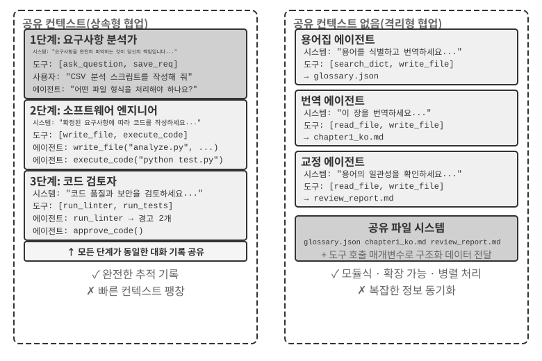

분명히 해 두자. 두 아키텍처 모두 단계마다 시스템 프롬프트와 도구 집합이 달라 서로 다른 에이전트가 되므로 진정한 멀티 에이전트 시스템이다. 차이는 조정 방식에 있다. **컨텍스트 공유**는 암묵적 조정에 의존한다. 후속 에이전트는 이전 에이전트의 전체 컨텍스트 기록을 물려받고, 눈에 보이는 상호작용 기록과 작업 궤적을 검토하며, 컨텍스트 자체를 통해 정보를 전달받는다. **컨텍스트 비공유**는 명시적 조정에 의존한다. 에이전트는 파일, 메시지, 구조화 데이터 인터페이스로 정보를 교환하고 각자 자신의 작업과 관련된 내용만 본다.

비유하자면 전자는 모두가 모든 말을 듣는 한 테이블의 팀이고, 후자는 각자 별도의 작업 공간에서 이메일과 문서로 협업하는 부서들이다.

운영체제에 익숙한 독자라면 다음 비유가 유용할 것이다. 컨텍스트 공유 에이전트는 스레드와 비슷하고, 컨텍스트 비공유 에이전트는 프로세스와 비슷하다. 스레드는 주소 공간을 공유하므로 전환과 통신 비용이 낮지만 격리성이 약하다. 한 스레드의 메모리 손상이 전체 프로세스를 중단시킬 수 있다. 각 프로세스는 자체 주소 공간을 사용하므로 격리성이 더 강하고 병렬 처리가 안전하지만, 통신에는 명시적인 IPC가 필요하다. 표 10-1의 기준은 이러한 절충 관계에서 도출된다.

표 10-1은 하위 과업 수, 컨텍스트 창, 병렬성, 정보 격리, 비용 예산이라는 다섯 관점에서 두 아키텍처의 선택 기준을 정리한다. 초기 아키텍처를 선택할 때 체크리스트로 활용할 수 있다.

표 10-1 컨텍스트 공유와 비공유의 선택 기준

| 선택 기준 | 컨텍스트 공유 | 컨텍스트 비공유 |
|---------------|-----------------------------------|--------------------------------------------|
| 하위 과업 수 | 적음(역할 2~3개) | 많음(병렬 처리 필요) |
| 컨텍스트 창 | 모든 역할의 정보를 수용할 수 있음 | 컨텍스트 창 하나로는 부족함 |
| 병렬성 | 주로 직렬 처리(같은 궤적을 따라 역할이 번갈아 작업함) | 대규모 병렬 확장 가능(컨텍스트가 독립적이고 서로를 차단하지 않음) |
| 정보 격리 | 필요 없음(모든 역할이 정보를 공유함) | 필요함(예: 보안 검토자에게 다른 에이전트의 내부 컨텍스트를 제공하면 안 됨) |
| 비용 예산 | 하나의 궤적을 단계마다 전달하므로 토큰이 단계별로 누적됨 | 여러 에이전트가 독립적으로 작업하므로 전체 토큰이 보통 몇 배에서 열 배가량 늘어남 |

**간단한 경험칙**은 다음과 같다. 예상 누적 컨텍스트가 컨텍스트 창의 50%를 넘는다면(정확한 임계값이 아니라 휴리스틱이다) 공유하지 않는다. 정보가 조금도 손실되지 않는 것이 과업 정확성의 필수 요건이라면 공유한다. 현실의 시스템 대부분은 단계에 따라 서로 다른 방식을 사용한다. 처음 몇 에이전트는 컨텍스트를 공유하지만, 공유 기록이 너무 커지면 컨텍스트 비공유 방식으로 전환하고 상류 에이전트가 하류에 전달할 정보를 선별하는 명시적 핸드오프를 사용한다.

### 차원 2: 협업 토폴로지

두 번째 차원은 에이전트 사이에서 제어와 정보가 흐르는 구조인 협업 토폴로지다. 토폴로지와 컨텍스트 공유는 개념적으로 서로 다르지만 실제로는 관련이 있다. 컨텍스트 공유 시스템에도 토폴로지는 존재한다. 예를 들어 실험 10-2의 `transfer_to_agent` 패턴은 핸드오프 체인을 형성한다. 하지만 핸드오프마다 전체 기록을 전달하므로 어떤 정보를 넘길지 결정할 필요가 없는 경우가 많고, 토폴로지는 흔히 단순한 역할 전환 시퀀스가 된다. 뒤의 탈중앙화 절에서 다룰 그룹 채팅형 협업은 예외다. 반면 컨텍스트 비공유 방식에서는 정보가 어떻게 흐르고 누가 조정할지를 설계자가 명시적으로 정해야 한다.

> **용어: 그래프 엔지니어링(Graph Engineering).** 2026년 7월부터 널리 쓰이기 시작한 "그래프 엔지니어링"은 오늘날의 에이전트 맥락에서 실행 그래프를 명시적으로 설계하는 일을 가리키는 경우가 많다. 노드는 에이전트, 일반 프로그램, 인간의 결정을 나타내고, 간선은 과업 의존성, 조건부 라우팅, 실패 경로를 정의하며, 구조화된 상태가 노드 사이를 흐른다.[^ch10-graph-engineering] 이 장에서 다루는 "협업 토폴로지"는 이 개념의 멀티 에이전트 하위 집합이다. 동료 협업, 관리자 오케스트레이션, 탈중앙화 핸드오프는 서로 다른 그래프 토폴로지다. 아직 새로운 명칭이고 지식 그래프, GraphRAG, 실행 궤적과 혼동하기 쉬우므로, 이 책에서는 더 안정적인 용어인 "협업 토폴로지"와 "오케스트레이션"을 주로 사용한다.

[^ch10-graph-engineering]: 이 명칭에 관한 초기 논의는 Josh C. Simmons, *We Are Entering the Graph Engineering Phase*, 2026을 참조하라. 주류 프레임워크에서는 같은 엔지니어링 구조를 완전히 새로운 기술이라기보다 그래프 기반 워크플로나 오케스트레이션이라고 부르는 경우가 많다. 관련 자료는 다음과 같다. https://www.drjoshcsimmons.com/writing/we-are-entering-the-graph-engineering-phase, https://docs.langchain.com/oss/python/langgraph/overview, https://learn.microsoft.com/en-us/agent-framework/workflows/, https://adk.dev/workflows/.

다시 말해 두 차원은 원칙적으로 2×3 행렬(공유/비공유 × 토폴로지 세 가지)을 이룬다. 하지만 컨텍스트 공유 행에서는 토폴로지가 대부분 결정할 것이 거의 없는 역할 전환 시퀀스로 단순화된다(뒤의 "다단계 역할 전환"에서 다루는 형태다). 따라서 이 장에서는 컨텍스트 비공유에 해당하는 세 칸만 자세히 다룬다. 컨텍스트 비공유 방식의 대표적인 세 토폴로지를 복잡성이 커지는 순서로 정리하면 다음과 같다.

- **동료 협업 패턴**: 소수의 에이전트(보통 2~3개)가 동등한 위치에서 상호작용하며 반복 개선 루프를 형성한다. 한 사람이 논문 초안을 쓰고 다른 사람이 주석을 달고 수정해, 여러 차례 반복한 결과물의 품질이 한 사람이 혼자 만든 것보다 훨씬 높아지는 방식과 비슷하다.
- **관리자 패턴**(오케스트레이션 패턴): 중앙의 관리자 에이전트가 과업 계획과 일정을 책임지고, 여러 하위 에이전트가 각각 구체적인 하위 과업을 처리한다. 프로젝트 관리자가 전문 엔지니어 여러 명을 이끌고 프로젝트를 수행하는 방식과 비슷하다.
- **탈중앙화 패턴**: 런타임 중앙 제어자가 없으며, 에이전트가 사람처럼 서로 소통하며 과업을 함께 처리한다.

각 패턴의 상세 설계와 적용 시나리오는 뒤의 전용 절에서 살펴본다.

## 멀티 에이전트는 언제 단일 에이전트보다 뛰어난가?

구체적인 협업 아키텍처를 살펴보기 전에 더 근본적인 질문부터 답해 보자. **언제 여러 에이전트가 반드시 필요하고, 언제 하나로 충분한가?** 그 답은 뒤에서 설명할 모든 엔지니어링 접근법의 기준점이 된다. 최근의 여러 연구는 하나의 명확한 프레임워크로 수렴하며, 핵심 기준은 한 가지 질문이다. **협업이 단일 에이전트가 답을 만드는 과정에서는 얻을 수 없었던 정보를 제공하는가?**

표 10-2는 어떤 협업 방식이 새로운 정보를 도입하는지 보여 주며, 멀티 에이전트 협업이 단일 에이전트보다 실질적인 가치를 제공하는지 판단하는 데 도움을 준다.

표 10-2 멀티 에이전트 협업 방식의 정보 이득 비교

| 협업 방식 | 새로운 정보를 도입하는가? | 효과 |
|---------------------------------------|---------------------|-----------------------------------|
| 같은 모델의 자체 검토(자신의 출력을 다시 읽음) | 아니요 | 대개 효과가 없거나 오히려 해로움 |
| 서로 다른 에이전트가 같은 텍스트를 놓고 토론함 | 아니요 | 같은 연산량을 사용한 단일 에이전트와 비슷함 |
| 검토자가 테스트 실행 결과를 활용해 코드를 검토함 | 예(실행 피드백) | 크게 향상됨 |
| 검토자가 렌더링한 스크린샷을 활용해 프런트엔드/PPT 코드를 검토함 | 예(시각적 피드백) | 크게 향상됨 |
| 검토자가 외부 도구를 활용해 사실을 검증함 | 예(도구 피드백) | 크게 향상됨 |

2025년 RLEF(Reinforcement Learning from Execution Feedback) 논문[^rlef-2025]은 코드 실행 피드백을 사용해 반복적으로 개선하도록 모델을 강화 학습한 결과가 같은 모델을 독립적으로 여러 번 샘플링한 결과보다 훨씬 뛰어났다고 보고했다. 핵심은 반복할 때마다 모델이 코드를 작성할 당시에는 존재하지 않았던 정보인 **실제 실행 결과**(컴파일 오류, 테스트 실패, 런타임 예외)가 새로 들어온다는 점이다. 웹페이지 생성 과업을 다룬 2025년 WebGen-Agent 연구[^webgen-agent-2025]에서는 스크린샷과 비전-언어 모델의 설명을 결합한 다단계 시각적 피드백을 사용해 Claude 3.5 Sonnet의 벤치마크 성능을 26.4%에서 51.9%로 높여 거의 두 배로 향상했다.

[^rlef-2025]: Gehring, J., et al. *RLEF: Grounding Code LLMs in Execution Feedback with Reinforcement Learning.* arXiv:2410.02089, 2025.
[^webgen-agent-2025]: Lu, Z., et al. *WebGen-Agent: Enhancing Interactive Website Generation with Multi-Level Feedback and Step-Level Reinforcement Learning.* arXiv:2509.22644, 2025.

이 프레임워크는 겉으로 보이는 모순을 해소하는 데 도움이 된다. 일부 학술 연구에서는 단일 에이전트로 충분하다고 결론짓지만, 엔지니어링 실무에서는 멀티 에이전트 시스템이 더 나은 성능을 보이는 경우가 많다. 학술 연구는 흔히 토론처럼 여러 에이전트가 같은 텍스트를 검토하고 논의하는 방식을 시험한다. 반면 효과적인 엔지니어링 시스템은 대개 코드 실행, 시각적 렌더링, 도구에서 얻은 외부 피드백을 추가한다. 새로운 정보를 도입하는 것은 후자뿐이다. 뒤에서 다룰 동료 협업, 오케스트레이션, 탈중앙화라는 세 아키텍처의 효과적인 활용 사례 대부분을 이 기준으로 이해할 수 있다.

**단계 예산과 에이전트 성능.** 이와 관련된 또 다른 질문은 에이전트가 사용할 수 있는 도구 호출 횟수나 반복 횟수인 단계 예산이 성능에 어떤 영향을 미치느냐는 것이다. 단계가 많을수록 당연히 도움이 될 것처럼 보인다. 30단계로는 핵심 기능을 구현할 시간밖에 없을 수 있지만, 300단계라면 계획하고 구현하고 테스트하며 개선할 수 있다. 그러나 2025년 Google 논문 *Budget-Aware Tool-Use Enables Effective Agent Scaling*은 직관에 어긋나는 결론을 내렸다. **에이전트에 더 많은 단계를 준다고 해서 성능이 향상된다는 보장은 없다.** 일반적인 에이전트에는 "예산 인식"이 없다. 300단계를 주더라도 피상적인 검색을 수행하다가 빠르게 정체되는 경향이 있다. 추가 단계를 효과적으로 사용하려면 남은 자원에 맞춰 전략을 조정하는 메커니즘이 필요하다. 처음에는 넓게 탐색하고 나중에는 초점을 좁혀야 한다. 2026년 BAVT(Budget-Aware Value Tree Search) 접근법은 단계별 가치 평가를 더해, 남은 예산의 비율에 따라 탐색과 활용 사이의 균형을 조정한다. 예산이 줄어들수록 에이전트는 폭넓은 탐색에서 더 깊은 조사로 전환한다.

이러한 연구 결과는 멀티 에이전트 시스템 설계에 직접적인 시사점을 준다. 예를 들어 오케스트레이션 패턴에서 관리자 에이전트는 하위 에이전트에게 과업을 나눠 주고 결과를 기다리기만 해서는 안 된다. 과업의 복잡성에 따라 **단계 예산을 동적으로 할당**해야 한다. 단순한 하위 과업에는 적은 단계를, 복잡한 하위 과업에는 충분한 단계를 배정한다. 또한 하위 에이전트가 곧바로 작업에 뛰어드는 대신 먼저 계획하고, 구현하고, 테스트한 뒤 개선하는 순서로 예산을 현명하게 사용하도록 안내해야 한다.

어떤 설계 결정을 내리기 전에 한 가지를 더 고려해야 한다. 바로 **비용**이다. 병렬 탐색과 반복 개선에는 비용이 든다. Anthropic은 자사의 멀티 에이전트 연구 시스템이 일반 대화의 약 15배에 이르는 토큰을 사용하며, 토큰 사용량만으로도 성능 차이의 약 80%를 설명할 수 있다고 공개했다. 따라서 멀티 에이전트 시스템이 주는 이득은 몇 배, 나아가 열 배가량 높아질 수 있는 비용을 정당화할 만큼 커야 한다. 그렇지 않다면 잘 튜닝한 단일 에이전트가 대개 더 경제적이다.

## 컨텍스트를 공유하는 멀티 에이전트 협업

컨텍스트를 공유하는 멀티 에이전트 협업에서는 각 단계가 자체 시스템 프롬프트와 도구 집합을 지닌 독립적인 에이전트이면서도 이전 에이전트의 전체 궤적을 물려받는다. 교대 근무를 인계받은 동료가 전임자가 남긴 모든 작업 기록을 훑어볼 수 있는 것과 비슷하다. 이러한 상속 기반 협업의 핵심 장점은 정보 손실이 전혀 없다는 것이다. 모든 에이전트가 이전 어느 단계의 세부 사항이든 검토할 수 있다. 과제는 현재 에이전트가 방대한 이전 기록에 주의를 빼앗기지 않고 자신의 책임에 집중하게 하는 것이다.

### 다단계 역할 전환

먼저 정의를 둘러싼 논쟁부터 짚어 보자. 1장의 용어로 보면 다단계 역할 전환은 실행 경로(예: 요구 사항 명확화 → 구현 → 검토)를 미리 정의한 **워크플로형 오케스트레이션**이다. 프로세스 관점에서는 하나의 프로세스가 동일한 메모리를 계속 유지한 채 서로 다른 단계를 차례로 실행한다. 따라서 이것이 "진정한 멀티 에이전트가 아니다"라는 주장에는 일리가 있다. 그럼에도 이 장에서 이를 멀티 에이전트 패턴으로 다루는 이유는 이러한 관점에 실용적인 이점이 있기 때문이다. 각 단계가 자체 시스템 프롬프트, 도구, 초점을 가질 수 있고, 단계 경계를 품질 게이트로 활용할 수 있다.

복잡한 과업에서는 단계마다 에이전트의 역할과 책임이 크게 달라질 수 있다. 하나의 정적인 시스템 프롬프트를 처음부터 끝까지 사용하면 단계별 지침을 제공하기에는 너무 일반적이거나, 모든 단계의 지침을 담느라 지나치게 길어진다. 다단계 역할 전환은 현재 단계에 맞춰 시스템 프롬프트와 도구 집합을 바꾸어 에이전트가 가장 적절한 역할로 작업하게 한다. 역할 전환을 위해 새 인스턴스를 만들거나 새 프로세스를 시작할 필요는 없다. 같은 실행 세션 안에서 시스템 프롬프트와 도구 집합만 바꾸면 된다. 역할은 달라져도 대화 기록과 과업 상태는 계속 공유되므로, 새 역할을 맡은 에이전트도 이전 단계에서 축적한 모든 정보에 접근할 수 있다.

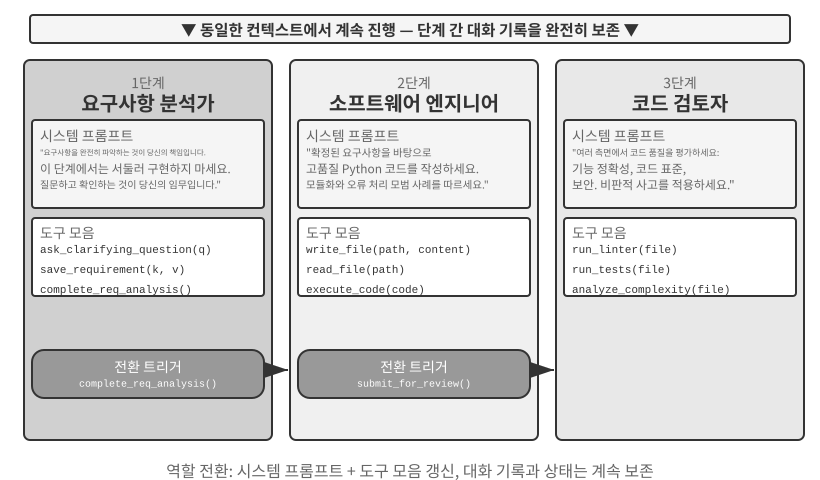

> **실험 10-1 ★★: 실행 단계에 따라 시스템 프롬프트 결정하기**
>
> 이 실험은 단계별 시스템 프롬프트가 완전한 코딩 에이전트 워크플로 전반의 성능을 어떻게 향상하는지 보여 준다.
>
> **과업 시나리오**: 사용자가 소프트웨어 개발을 요청하면 에이전트는 요구 사항 명확화, 코드 구현, 품질 검토라는 세 단계를 거친다.
>
> **1단계: 요구 사항 명확화**(역할: 요구 사항 분석가)
>
> 시스템 프롬프트는 다음 사항을 강조한다.
> - "사용자의 요구를 완전히 이해하는 것이 당신의 책임입니다. 모호한 부분을 명확히 하는 질문을 던져 기대 기능, 사용 시나리오, 성능 요구 사항을 빠짐없이 이해하세요."
> - "구현을 서두르지 마세요. 이 단계의 과업은 코드를 작성하는 것이 아니라 질문하고 확인하는 것입니다."
> - "모든 핵심 요구 사항이 명확해졌음을 확인하면 `complete_requirements_analysis()` 도구를 호출해 이 단계를 종료하세요."
>
> 도구 집합은 제한적이다. `ask_clarifying_question(question)`으로 사용자에게 명확화 질문을 하고, `save_requirement(key, value)`로 확인된 요구 사항을 기록하며, `complete_requirements_analysis()`로 단계 완료를 표시한다.
>
> 에이전트는 스크립트가 처리해야 할 파일 유형, 하위 폴더를 재귀적으로 처리할지 여부, 파일을 옮긴 뒤 원래 파일명을 유지할지 여부를 사용자에게 묻는다. 이러한 대화를 통해 구조화된 요구 사항 집합을 만들고 기록한다. 요구 사항이 충분히 명확해지면 `complete_requirements_analysis()`를 호출한다. 이 완료 신호를 받은 시스템은 다음 단계의 설정을 불러온다.
>
> **2단계: 코드 구현**(역할: 소프트웨어 엔지니어)
>
> 새로운 시스템 프롬프트는 다음 사항을 강조한다.
> - "확인된 요구 사항을 바탕으로 고품질 Python 코드를 작성하는 것이 당신의 책임입니다."
> - "모범 사례를 따르세요. 코드를 모듈화하고 오류를 적절히 처리하며 유용한 곳에는 주석을 추가하세요."
> - "코드를 완성하고 기본 테스트를 통과하면 `submit_for_review()`를 호출해 검토 단계로 진입하세요."
>
> 도구도 바뀐다. 요구 사항 명확화 도구 대신 `write_file(path, content)`, `read_file(path)`, `execute_code(code)` 같은 개발 도구를 사용한다. 에이전트는 1단계에서 기록한 요구 사항을 바탕으로 핵심 로직을 작성하고 오류 처리를 추가하며 테스트를 만든다. 요구 사항의 세부 내용을 확인하기 위해 이전 대화를 계속 참조할 수 있지만, 이제 추가 질문을 하기보다 구현에만 집중한다. 작업을 마치면 `submit_for_review()`를 호출한다.
>
> **3단계: 코드 검토**(역할: 코드 검토자)
>
> 새로운 시스템 프롬프트는 다음 사항을 강조한다.
> - "기능적 정확성, 코딩 표준 준수 여부, 오류 처리, 성능, 보안을 기준으로 코드를 검토하세요."
> - "비판적인 관점에서 잠재적 문제와 코드 개선 기회를 찾아내세요."
> - "심각한 문제가 발견되면 `request_revision(issues)`를 호출해 구현 단계로 돌아가 수정하게 하세요. 품질이 적절하면 `approve_code()`를 호출해 과업을 완료하세요."
>
> 도구 집합은 다시 바뀌어 `run_linter(file)`, `run_tests(file)`, `analyze_complexity(file)` 같은 코드 품질 분석 도구로 교체된다. 에이전트는 검토자의 관점에서 코드를 다시 살펴보고 정적 분석을 실행하며 잠재적인 버그, 성능 문제, 보안 위험을 확인한다.
>
> 이 3단계 설계를 사용하면 에이전트가 단계마다 핵심 과업에 집중할 수 있다. 더 중요한 점은 명확한 단계 전환을 통해 모든 단계를 반드시 완료하게 한다는 것이다. 에이전트는 요구 사항 분석을 건너뛰고 곧바로 코딩을 시작하거나, 검토 없이 결과물을 전달할 수 없다.
>
> **실험 요구 사항**:
> 1. 명확한 역할 정의와 행동 지침을 포함한 3단계 시스템 프롬프트를 구현한다.
> 2. 각 단계에 맞는 도구 집합을 설정한다.
> 3. 특정 도구 호출을 통한 단계 전환 트리거 메커니즘을 구현한다.
> 4. 단계 사이의 컨텍스트 연속성을 보장한다.
> 5. 코드 검토에서 문제가 발견되면 구현 단계로 돌아가는 롤백 시나리오를 처리한다.
> 6. 서로 다른 프롬프트가 서로 다른 행동을 만들어 내는 과정을 보여 주도록 각 단계의 활동을 기록한다.
>

### 도메인 간 역할 전환

다단계 역할 전환은 하나의 과업 유형(소프트웨어 개발) 안에서 단계별로 실행하는 방식을 보여 줬다. 도메인 간 역할 전환은 여기서 한 걸음 더 나아간다. 과업이 여러 도메인을 오갈 때 에이전트가 역할을 동적으로 바꾼다. 미리 정의한 선형 프로세스를 따르는 대신 사용자의 변화하는 요구에 맞춰 어떤 전문 역할을 맡을지 선택한다.

> **실험 10-2 ★★: 다중 역할 전환**
>
> **사전 요구 사항**: 먼저 2장의 에이전트 스킬 메커니즘을 복습하기를 권한다.
>
> **시스템 아키텍처**: 다섯 가지 역할을 정의한다.
>
> - **triage(접수 담당, 기본 진입점)**: 사용자의 전반적인 요구를 파악하고 작업을 순차적인 하위 과업으로 나누며, 각 하위 과업을 적절한 전문가에게 전달하고, 모든 하위 과업이 끝나면 최종 점검을 수행한다. 사용할 수 있는 도구는 `transfer_to_agent`뿐이다.
> - **research(정보 검색 전문가)**: `web_search`를 사용해 데이터, 사실, 자료를 찾는다.
> - **coding(프로그래밍 전문가)**: `execute_python`을 사용해 프로그래밍과 스크립팅 과업에 필요한 코드를 작성하고 실행한다.
> - **data_analysis(데이터 분석 전문가)**: `calculate` / `descriptive_stats`를 사용해 정량 계산과 통계 분석(예: 전년 대비 성장률, 연평균 복합 성장률(CAGR), 평균)을 수행한다.
> - **writing(글쓰기 전문가)**: 검색한 데이터와 분석 결과를 독자에 맞는 명확한 초안으로 만들며, `count_characters`로 대략적인 길이를 확인할 수 있다.
>
> **핵심 메커니즘: transfer_to_agent 도구**
>
> 모든 역할은 `transfer_to_agent(target_role, reason)` 도구를 갖는다. 어떤 역할이 이 도구를 호출하면 시스템은 현재 대화 기록을 저장하고, 대상 역할의 프롬프트와 도구 집합을 불러온 뒤, 그 역할에 기록을 전달하고 실행을 재개한다.
>
> **실험 시나리오**: 시스템은 기본적으로 `triage` 역할에서 시작한다. 사용자가 여러 도메인에 걸친 과업을 요청한다. "투자자용 자료를 준비하고 있어요. 중국의 2021년, 2022년, 2023년 신에너지 자동차 판매량을 찾아서 이 3년간의 연평균 복합 성장률을 계산하고, 투자자를 위한 한국어 요약문을 120자 이내로 작성해 주세요." `triage`는 이를 "데이터 검색 → 지표 계산 → 초안 작성"으로 나누고 먼저 `research`에 전달한다.
>
> ```python
> transfer_to_agent(target_role="research", reason="Find annual new-energy vehicle sales figures for 2021-2023")
> ```
>
> `research`는 `web_search`로 판매량을 찾고 핵심 데이터를 대화에 추가한 뒤 과업을 `data_analysis`에 전달한다.
>
> ```python
> transfer_to_agent(target_role="data_analysis", reason="The data is ready; calculate CAGR from 2021 to 2023")
> ```
>
> `data_analysis`는 `calculate`로 성장률을 계산한다. 그런 다음 과업을 `writing`에 전달하고, 이 역할은 요약문 초안을 작성한 뒤 최종 확인을 위해 `triage`에 돌려준다. 전체 체인은 `triage` → `research` → `data_analysis` → `writing` → `triage`다. 각 역할이 전체 대화 기록을 볼 수 있으므로 다음 역할은 앞에서 어떤 작업을 마쳤는지 자연스럽게 알 수 있다.
>
> 역할 전환 결정은 시스템 프롬프트의 지침에 따른다. `triage` 프롬프트에는 라우팅 규칙이 명시되어 있다. 데이터나 원자료 검색 → `research`, 코드 작성과 실행 → `coding`, 정량 계산과 통계 분석 → `data_analysis`, 자료를 다듬어 초안 작성 → `writing`이다. 깊이 있는 도메인 전문성이나 특수 도구가 필요한 과업은 핸드오프해야 한다. 각 전문가의 프롬프트도 다음으로 적절한 역할을 지정하거나 과업을 `triage`에 돌려주도록 안내한다.
>
> **실험 요구 사항**:
> 1. 전문 역할을 세 개 이상 정의하고 각각의 시스템 프롬프트와 전문 도구 집합을 구현한다.
> 2. 동적 전환을 지원하는 `transfer_to_agent` 도구를 구현한다.
> 3. 역할 전환 뒤에도 컨텍스트 연속성을 보장한다.
> 4. 에이전트가 역할 사이를 반복해서 오가는 순환 핸드오프를 방지한다.
> 5. 역할 전환의 가치를 보여 주도록 여러 도메인에 걸친 복잡한 과업 흐름을 설계한다.
>

## 컨텍스트를 공유하지 않는 멀티 에이전트 협업

컨텍스트 비공유 아키텍처에서 각 에이전트는 자체 컨텍스트, 궤적, 상태를 지닌 독립적인 개체로 동작한다. 에이전트는 서로의 내부 컨텍스트에 직접 접근할 수 없다. 협업은 이 장 첫 부분에서 소개한 세 가지 통신 메커니즘인 도구 호출 매개변수, 공유 파일 시스템, 메시지 버스를 통한 명시적이고 구조화된 데이터 전달에 전적으로 의존한다.

앞에서 통신 메커니즘을 프로세스 간 통신 방식에, 공유 컨텍스트와 격리된 컨텍스트를 각각 스레드와 프로세스에 비유했다. 이 비유를 더 확장할 수 있다(표 10-3).

표 10-3 멀티 에이전트 시스템과 운영체제의 대응 관계

| 운영체제 | 멀티 에이전트 시스템 |
|----------|----------------|
| 프로그램(실행 파일) | 정적 접두부(시스템 프롬프트 + 도구 정의) |
| 프로세스 메모리 | 궤적 |
| CPU | LLM |
| 커널 | 에이전트 런타임 |
| 시스템 호출 | 도구 호출 |
| fork(자식 프로세스 생성) | spawn_subagent |
| kill(신호 전송) | cancel_subagent |
| ps(프로세스 목록 조회) | list_agents |
| 종료 코드와 wait() | 하위 에이전트가 반환한 구조화 요약 |
| 공유 메모리 / 메시지 전달 | 공유 파일 시스템 / 메시지 전달 |

프로그램은 정적인 코드이고 프로세스는 프로그램이 실행 중인 하나의 인스턴스다. 마찬가지로 정적 접두부는 에이전트의 정체성을 결정하고 궤적은 에이전트가 어디까지 진행했는지 기록한다. LLM은 CPU 역할을 한다. 자체 상태를 보유하지 않고 서로 다른 컨텍스트를 불러와 여러 에이전트가 시간을 나눠 사용한다. "컨텍스트 전환"이라는 용어 자체도 운영체제에서 빌려왔다. 같은 이유로 더 빠른 CPU로 교체해도 프로그램은 이전처럼 계속 실행되고, 더 강력한 모델로 교체해도 에이전트는 같은 에이전트로 유지된다. 에이전트의 정체성과 메모리는 모델 가중치가 아니라 접두부와 궤적에 있기 때문이다.

이러한 추상화는 새로운 것이 아니다. 비공개 상태, 비동기 메시지, 새로운 구성원을 생성하는 능력은 정확히 1970년대 액터 모델(Actor model)의 기본 구성이다[^actor-model]. 따라서 멀티 에이전트 시스템은 LLM 기반 액터 모델로 볼 수 있으며, 운영체제와 분산 시스템이 축적한 지식의 상당 부분을 직접 적용할 수 있다. 다만 이 비유가 성립하지 않는 중요한 지점이 하나 있다. 프로세스는 바이트를 비트 단위로 충실히 전달하지만, 에이전트는 의미를 전달하며 내용을 다시 말할 때마다 의미가 왜곡될 수 있다. 이것이 이 장의 "실패 모드" 절에서 다룰 새로운 문제다.

[^actor-model]: Hewitt, C., Bishop, P., Steiger, R. *A Universal Modular ACTOR Formalism for Artificial Intelligence.* IJCAI 1973.

이러한 프로세스형 격리는 몇 가지 실용적인 엔지니어링 이점을 제공한다. 각 에이전트를 독립적으로 개발하고 테스트할 수 있고, 기존 코드를 건드리지 않고 새로운 기능을 추가할 수 있다. 한 에이전트가 실패해도 오류가 다른 에이전트에 자동으로 전파되지 않으며, 여러 에이전트가 공유 컨텍스트를 두고 경합하지 않고 동시에 실행될 수 있다.

그러나 컨텍스트를 공유하지 않는 데에도 비용이 따른다. 가장 분명한 문제는 정보 동기화다. 에이전트가 과업 상태를 일관되게 이해하려면 어떻게 해야 하는가? 정보를 전달하는 과정에서 누락되거나 중복되지는 않는가? 디버깅도 더 어려워진다. 문제가 생기면 여러 에이전트의 로그를 검토해 전체 실행 과정을 다시 맞춰야 한다. 따라서 인터페이스 명세, 데이터 형식, 통신 프로토콜의 설계가 매우 중요해진다.

컨텍스트를 공유하지 않는 명시적 협업은 토폴로지와 무관한 두 가지 인프라에 의존한다. 첫째는 에이전트끼리 또는 사용자와 산출물을 교환하는 영속 매체인 **공유 파일 시스템**으로, 협업의 데이터 평면을 이룬다. 둘째는 에이전트 사이의 메시지 전달, 상태 조회, 실행 종료, 자원 스케줄링을 지원하는 **통신 및 제어 메커니즘**으로, 협업의 제어 평면을 이룬다. 뒤에서 살펴볼 세 토폴로지는 모두 이 두 기반 위에 구축된다.

### 에이전트 관점의 파일 시스템

이 장의 첫 부분에서는 "공유 파일 시스템"을 컨텍스트 비공유 아키텍처의 세 가지 통신 메커니즘 가운데 하나로 소개했다. 실제 시스템에서 에이전트가 접근하는 파일 시스템은 하나의 저장 시스템이 아니라, 출처와 수명 주기, 권한이 서로 다른 저장 시스템을 하나의 디렉터리 트리 아래 마운트한 **가상 파일 시스템**이다. 에이전트는 통합된 `read_file`/`write_file`/`list_dir` 인터페이스로 이들에 접근하지만, 기반 계층은 로컬 임시 디스크, 영속 객체 저장소, 서드파티 클라우드 드라이브 API, 읽기 전용 시스템 리소스 패키지일 수 있다. 이 디렉터리 트리의 구성, 즉 각 영역의 가시성과 수명 주기를 명확히 정의하는 일은 멀티 에이전트 협업 설계의 전제 조건이다. 동시성 충돌과 정보 유출의 상당 부분은 격리해야 할 영역을 뒤섞는 데서 발생한다. 이 디렉터리 트리는 에이전트의 주소 공간에 해당하고, 네 가지 영역은 서로 다른 권한을 지닌 메모리 세그먼트에 해당한다. 일부는 비공개이며 쓸 수 있고, 일부는 여러 주체가 공유하며, 일부는 읽기 전용이다. 운영체제의 보호 철학도 그대로 적용된다. 기본적으로 격리하고 공유는 명시적으로 선언한다. 성숙한 멀티 에이전트 시스템의 파일 시스템은 일반적으로 다음 네 가지 영역으로 구성된다.

**I. 에이전트 전용 작업 공간(스크래치패드)**. 각 에이전트 인스턴스만 사용하는 비공개 디렉터리로, 중간 산출물, 임시 파일, 초안, 디버그 로그를 저장한다. 수명 주기는 인스턴스에 종속되며 다른 에이전트와 사용자에게는 보이지 않는다. 스크래치패드를 격리하는 목적은 두 가지다. 여러 에이전트의 임시 파일이 서로를 덮어쓰지 않게 하고, 주 에이전트의 컨텍스트를 간결하게 유지한다. 하위 에이전트의 시행착오 과정은 각자의 작업 공간에 남고 최종 산출물만 공유 공간에 제출한다. 이는 하위 에이전트가 전체 궤적 대신 구조화된 요약을 반환해야 한다는 4장의 원칙을 저장소 계층에서 구현한 것이다.

**II. 멀티 에이전트 공유 작업 공간**. 여러 에이전트가 읽고 쓸 수 있으며 **사용자에게도 보이는** 협업 영역이다. 컨텍스트 비공유 아키텍처에서 에이전트 사이에 산출물을 교환하는 주요 매체다. 용어집 에이전트가 용어 목록을 작성하면 번역 에이전트가 이를 읽는다. 사용자는 이곳에 원본 파일을 올리고 최종 결과물을 내려받을 수도 있다. 수명 주기는 전체 과업에 종속되며 영속성이 필요하다. 여러 주체가 동시에 읽고 쓰는 영역이라 동시성 충돌이 자주 발생한다. 낙관적 잠금과 워크트리 격리 같은 메커니즘이 여기서 작동하며, 자세한 내용은 뒤의 "실패 모드 1"에서 다룬다. 4장에서 주 에이전트, 가상 컴퓨터, 가상 휴대전화를 연결하기 위해 `/workspace/shared`에 볼륨을 마운트한 사례가 이 계층의 전형적인 구현이다.

**III. 마운트된 외부 리소스.** Google Drive, Notion, Dropbox, 기업 위키 등 사용자가 권한을 부여한 서드파티 정보 소스를 어댑터를 통해 파일 시스템의 마운트 지점(예: `/mnt/gdrive`)에 매핑한다. 에이전트가 파일을 읽어 Notion 문서에 접근하면 기반 어댑터가 해당 API를 호출한다. 이 계층은 세 가지 특성에서 로컬 저장소와 다르며, 설계할 때 이를 명시적으로 처리해야 한다. **외부 권한에 따라 접근이 제한되고**(원본 시스템에서 사용자가 가진 권한이 에이전트의 가시성을 결정한다), **지연 시간이 더 길며 일관성이 약하고**(읽을 때마다 네트워크 왕복이 발생하고 외부 변경 사항이 즉시 보이지 않을 수 있으므로 데이터가 최종 일관성을 따른다고 간주해야 한다), **주로 필요할 때 읽기 전용으로 접근한다**(외부 소스에 잘못 기록하면 사용자의 실제 데이터가 오염될 수 있으므로 쓰기 작업은 신중해야 한다). 통합 파일 인터페이스 덕분에 데이터 소스마다 사용자 지정 도구를 만들 필요는 없지만, 성능과 보안의 차이도 가려진다. 따라서 읽기 전용/쓰기 가능 상태, 시간 제한, 자격 증명 경계를 마운트 계층에서 명시적으로 관리해야 한다.

**IV. 기본 제공 시스템 리소스.** 시스템이 미리 설치하고 모든 에이전트에 읽기 전용으로 공유하는 리소스 패키지다. 대표적인 예는 2장과 4장에서 소개한 **스킬**이다. 지식 문서와 스크립트를 파일로 구성해 `/skills` 같은 경로에 마운트하고, 먼저 인덱스를 본 다음 필요할 때 펼치는 점진적 공개 방식으로 접근한다. 참조 매뉴얼, 템플릿 라이브러리, 공유 도구 정의도 여기에 해당한다. 이 계층은 전역적으로 공유되고 읽기 전용이며 세션 사이에도 안정적으로 유지된다. 모든 에이전트가 동시성 제어 없이 함께 읽을 수 있다.

그림 10-3은 이 네 가지 영역을 하나의 디렉터리 트리 아래 일관되게 마운트하는 방식을 보여 준다. 에이전트는 통합 인터페이스를 통해 전체 트리에 접근하고, 사용자는 공유 공간에서 파일을 올리고 내려받으며, 외부 데이터 소스는 어댑터로 마운트하고, 기본 제공 시스템 리소스는 읽기 전용으로 제공한다.

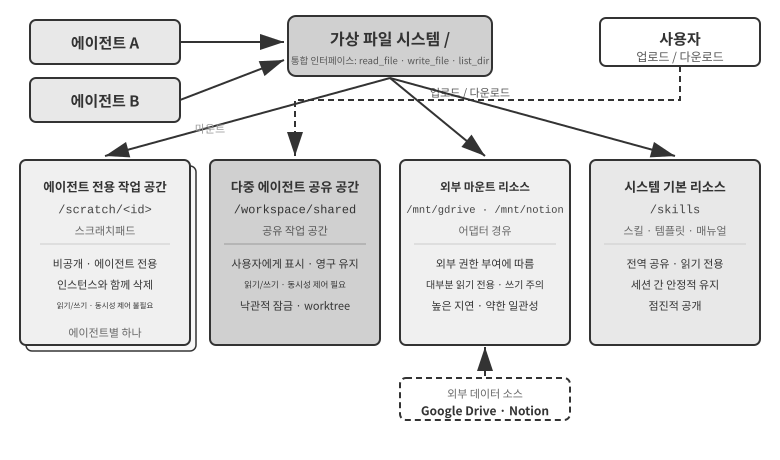

표 10-4는 가시성, 수명 주기, 읽기/쓰기 권한, 동시성 제어라는 네 가지 차원에서 이들 영역을 비교하며 파일 시스템 레이아웃 설계를 위한 체크리스트를 제공한다.

표 10-4 에이전트 가상 파일 시스템의 네 가지 영역

| 영역 | 가시성 | 수명 주기 | 읽기/쓰기 | 동시성 제어 |
|--------------|-----------------|------------------------|---------------------|-------------------|
| 에이전트 전용 작업 공간 | 소유한 에이전트만 | 에이전트 인스턴스와 함께 삭제됨 | 읽기/쓰기 | 필요 없음(비공개) |
| 멀티 에이전트 공유 작업 공간 | 협업하는 모든 에이전트와 사용자 | 과업이 진행되는 동안 유지됨 | 읽기/쓰기 | 필요함(낙관적 잠금 / 워크트리) |
| 마운트된 외부 리소스 | 외부 권한에 따라 다름 | 외부 소스가 결정함 | 대부분 읽기 전용, 쓰기는 주의 필요 | 외부 소스가 관리함 |
| 기본 제공 시스템 리소스 | 모든 에이전트 | 세션 사이에도 안정적으로 유지됨 | 읽기 전용 | 필요 없음(읽기 전용) |

**"범용 인터페이스로서의 파일 경로"**는 경로를 교환 단위로 취급한다는 데 가치가 있다. 에이전트끼리 산출물을 교환하거나, 주 에이전트가 하위 에이전트에 입력을 전달하거나, 조직끼리 A2A로 협업할 때 파일 내용을 컨텍스트 창에 불러오는 대신 가벼운 경로 문자열을 전달한다(4장). 이는 단일 에이전트가 파일 시스템에 메모리와 기능을 담는 방식을 설명한 5장의 "에이전트 허브로서의 파일 시스템" 개념과 일치한다. 여기서는 같은 추상화를 여러 에이전트로 확장한다. 비공개, 공유, 외부, 기본 제공 저장소를 마운트한 가상 디렉터리 트리가 멀티 에이전트 협업의 저장 기반을 제공한다.

### 에이전트 간 통신과 제어

파일 시스템이 에이전트 사이의 **산출물 교환** 문제를 해결한다면, 협업에는 **제어 평면**도 필요하다. 바로 여기서 표 10-3의 수명 주기 관련 항목이 작동한다. 4장에서 소개한 생성(`spawn_subagent`), 메시지 전송(`send_message_to_subagent`), 취소(`cancel_subagent`), 탐색(`list_agents`) 도구 프리미티브는 프로세스 세계의 fork, message, kill, ps에 각각 대응한다. 이 절에서는 인터페이스 정의를 반복하지 않고, 멀티 에이전트 협업에 필수적이지만 자주 간과되는 네 가지 기능에 집중한다.

**I. 메시지 전달.** 가장 단순한 형태는 지점 간 통신이다. 에이전트 A가 `send_message_to_agent_b(content)`를 직접 호출한다. 토폴로지가 고정되어 있고 에이전트 수가 적은 시나리오에 적합하다(예: 이 장의 실험 10-4에 나오는 전화 + 컴퓨터 이중 에이전트 구성). 에이전트 수가 늘어나고 비동기 병렬 처리가 필요해지면 지점 간 연결 수가 에이전트 수의 제곱에 비례해 증가하고 송신자와 수신자가 동시에 온라인 상태여야 한다. 이런 경우에는 **메시지 버스**를 사용해야 한다(뒤의 "병렬 조정 패턴"에서 자세히 다룬다). 에이전트가 버스에 메시지를 게시하면 버스가 구독 정보에 따라 메시지를 전달하므로 송신자는 구독자를 알 필요가 없다. 지점 간 방식이든 버스 방식이든 메시지는 일반적으로 구조화된 **엔벌로프(envelope)** 형식을 따라야 한다. 송신자 ID, 대상(특정 에이전트 또는 브로드캐스트), 메시지 유형(예: `task_assigned`/`status_update`/`result`/`terminate`), JSON 페이로드가 여기에 포함된다. 통일된 엔벌로프 형식은 안정적인 라우팅과 수신자의 파싱을 보장하고 협업 사슬을 추적 가능하게 한다. 이는 멀티 에이전트 시스템 디버깅의 핵심 요소다.

**II. 상태 조회.** 제어 평면에서 가장 과소평가되는 부분이다. 주 에이전트가 하위 에이전트를 파견한 뒤에는 진행 상황을 볼 수 있어야 한다. 그렇지 않으면 계속 기다릴지 판단할 수도, 하위 에이전트가 막혔을 때 개입할 수도 없다. 직관적인 접근법은 RPC에서 아이디어를 빌려 "실행 중/완료/실패" 상태와 진행률을 반환하는 `get_subagent_status(agent_id)` 조회 인터페이스를 정의하는 것이다. 그러나 이러한 풀 방식 인터페이스는 예상보다 훨씬 쓸모가 적다. 하위 에이전트는 생성되는 즉시 실행을 시작해 완료하거나 실패할 때까지 계속 동작한다. 전통적인 일괄 처리 시스템의 작업처럼 여러 대기 상태를 거치지 않는다. Unix 프로그래밍에서 다른 프로세스의 PID를 반복 조회해 실행 상태를 확인할 일이 드문 것과 같다. 폴링에는 본질적인 딜레마도 있다. 너무 자주 조회하면 토큰을 낭비하고, 너무 드물게 조회하면 대응이 늦어진다. 상태를 더 자연스럽게 얻으려면 이 장 첫 부분에서 소개한 두 통신 패러다임으로 돌아가야 한다.

**메시지 전달을 통한 상태 확인.** 주 에이전트가 하위 에이전트에 "어떻게 진행되고 있나요?"라는 메시지를 보내면 하위 에이전트가 적절한 시점에 답한다. 모든 과정은 비동기적이다. 메시지를 보내도 주 에이전트의 실행은 차단되지 않으며, 상대가 언제 답할지, 혹은 답을 하기는 할지조차 별개의 문제다. 관리자가 부하 직원에게 메신저로 진행 상황을 물으면서 당장 모든 일을 멈추고 답하라고 요구하지 않는 것과 같다. 반대로 하위 에이전트가 이정표에 도달했을 때 먼저 메시지를 보내 보고할 수도 있다. 시스템에 이미 메시지 버스가 있다면 버스에 `status_update`를 게시하기만 하면 된다(실험 10-6의 "실시간 모니터링"이 이 형태다). 상태를 명시적으로 요청하든 선제적으로 보고하든, 메시지에 담는 상태는 실행 중, 입력 필요, 완료, 실패처럼 통일된 상태 머신 용어를 사용해야 한다. 뒤에서 소개할 A2A 프로토콜은 과업 수명 주기를 바로 이러한 상태 집합으로 표준화한다.

**공유 파일 시스템을 통한 상태 확인.** 가장 철저한 형태는 **궤적 영속화**다. 하위 에이전트가 실행 중에 각 궤적 이벤트를 JSON으로 직렬화해 파일 시스템의 로그 파일에 덧붙인다. 일반적으로 세션마다 파일 하나를 만들고 이벤트를 한 줄에 하나씩 기록하는 JSONL 형식을 사용한다. 1장에서 정의한 궤적은 사용자 메시지, 모델 응답, 도구 호출, 결과로 이루어진 전체 시퀀스다. 주 에이전트에는 상태 보고 프로토콜이 필요 없다. 이 파일을 직접 읽으면 하위 에이전트가 호출 중인 도구, 가장 최근 단계에서 일어난 일, 실패한 재시도를 반복하는 루프에 빠졌는지 여부까지 전체 실행 과정을 확인할 수 있다. 프로세스에 비유하면 다른 프로세스의 메모리를 직접 읽는 것과 비슷하다. 하위 에이전트의 컨텍스트를 차지하지 않고, 하위 에이전트의 협조에 의존하지 않으며, 가장 세밀한 관측 단위를 제공한다.

그러나 이렇게 방대한 세부 정보는 부담이기도 하다. 궤적은 쉽게 수만 토큰에 이르고, 주 에이전트는 이를 읽은 뒤 정제해야 하므로 시간과 토큰을 모두 소모한다. 대부분의 시나리오에서는 **합의된 진행 상황 파일**이 더 실용적이다. 주 에이전트가 하위 에이전트를 시작할 때 각 항목을 완료할 때마다 `progress.md`를 갱신하도록 지시한다. 주 에이전트는 언제든 이 가벼운 파일을 읽어 진행 상황을 판단할 수 있다. 이는 두 프로세스가 합의된 형식의 작은 공유 메모리 영역을 예약하고 전체 메모리 상태 대신 정제된 진행 상황을 공개하는 것과 비슷하다.

진행 상황 파일을 사용하면 **정체 감지**도 가능하다. `progress.md`나 궤적 파일의 최종 수정 시각이 N분 넘게 바뀌지 않으면 시스템은 하위 에이전트가 활동하지 않는 것으로 보고 시간 초과 안전장치를 작동시킬 수 있다(4장의 하트비트와 `monitor_shell` 메커니즘에 대응한다). 이를 통해 멈춘 하위 에이전트가 전체 시스템을 지연시키는 일을 막는다.

궤적 영속화의 가치는 모니터링을 훨씬 넘어선다. 1장의 결론인 "에이전트 컨텍스트 = 정적 접두부 + 궤적"을 떠올려 보자. 정적 접두부(시스템 프롬프트, 도구 정의)는 코드로 결정되고, 작업 산출물은 이미 파일 시스템에 있으므로 에이전트 자체에는 궤적 이외의 런타임 상태가 없다. 즉 **궤적이 에이전트의 전체 상태**다. 궤적을 실시간으로 파일에 영속화하면 언제나 완전한 체크포인트를 보유하는 것과 같다. 에이전트 프로세스가 중단되거나, 컴퓨터의 전원이 꺼지거나, 사용자가 세션을 직접 닫더라도 궤적 파일을 다시 불러오고 정적 접두부를 앞에 붙이면 멈춘 지점부터 실행을 재개할 수 있다. Claude Code와 Codex CLI 같은 코딩 에이전트의 세션 재개 기능이 바로 이런 방식으로 구현된다. 이는 데이터베이스의 미리 쓰기 로그(WAL)와 같은 발상이다. 모든 이벤트를 추가 전용 로그에 먼저 덧붙이고, 언제든 로그에서 상태를 재생할 수 있다(3장의 "사실 로그 + 주기적 체크포인트" 메모리 설계도 같은 발상을 메모리 시스템에 적용한 것이다). 멀티 에이전트 시스템에서 이는 하위 에이전트가 본질적으로 **복구·감사·핸드오프가 가능하다**는 뜻이다. 관리자는 장애가 난 뒤 마지막으로 유효한 상태에서 하위 에이전트를 다시 시작할 수 있고, 이후 궤적을 이벤트별로 재생해 실패 원인을 찾을 수 있으며, 과업과 궤적을 다른 에이전트에 함께 넘겨 계속 진행하게 할 수도 있다.

**III. 실행 종료.** 병렬 협업에서는 흔히 "하나가 성공하면 나머지는 더 이상 필요 없다"는 상황이 생긴다. 여러 에이전트가 따로 검색하다가 하나가 목표를 찾으면 나머지는 즉시 중단해야 한다(이 장 실험 10-6의 연쇄 종료). 종료에는 두 단계가 있으며 Unix 사용자라면 SIGTERM과 SIGKILL의 차이로 이해할 수 있다. **정상 종료**가 우선이다. 주 에이전트가 `terminate` 신호를 보내면 하위 에이전트가 현재 단계의 안전한 지점에서 응답하고, 리소스를 정리하며(브라우저 세션 종료, 대기 중인 파일 기록, 잠금 해제), 확인 응답(ack)을 보낸 뒤 종료한다. **강제 종료**는 최후의 수단이다. 하위 에이전트가 정상 종료 신호에 응답하지 않을 때만 프로세스를 직접 종료하며, 정리되지 않은 리소스와 불완전한 쓰기가 남을 수 있다. 엔지니어링 측면에서 두 가지를 주의해야 한다. 첫째, 정상 종료가 작동하려면 하위 에이전트가 루프에서 종료 신호를 주기적으로 확인해야 한다(4장의 인터럽트 메커니즘과 비슷하다). 그렇지 않으면 신호를 받을 수 없다. 둘째, 연쇄 종료에는 경쟁 상태(race condition)가 있다. 여러 하위 에이전트가 거의 동시에 성공을 보고할 수 있다. 주 에이전트는 잠금이나 멱등 설계를 사용해 하나의 성공만 받아들이고 종료 신호도 한 번만 브로드캐스트하도록 보장해야 한다. 경쟁 상태는 실험 10-6에서 자세히 다룬다.

한 가지 문제가 남는다. 주 에이전트가 종료된 뒤에도 실행 중인 하위 에이전트는 어떻게 되는가? 가장 깔끔한 엔지니어링 접근법은 Go의 컨텍스트에서 아이디어를 빌려 생성 관계를 따라 종료를 연쇄 전파하는 것이다. 에이전트 하나를 취소하면 그 에이전트가 생성한 모든 하위 에이전트도 함께 취소해 고아 하위 에이전트가 남지 않게 한다. 앞서 설명한 "하위 에이전트가 안전한 지점에서 종료 신호를 확인하는" 동작은 Go에서 `ctx.Done()`을 폴링하는 것과 정확히 대응한다. 반대로 Unix의 `nohup`처럼 주 에이전트에서 분리된 장기 실행 백그라운드 에이전트가 정말 필요하다면, 새로운 수명 주기 트리(`context.Background()`에 대응)에서 시작하게 하고 부모와 함께 종료되지 않는다고 명시적으로 선언한다.

**IV. 리소스 관리와 스케줄링.** 운영체제의 또 다른 핵심 임무는 희소한 리소스를 할당하는 것이다. 프로세스 세계에서 희소한 리소스는 CPU 시간과 메모리이고, 에이전트 세계에서는 토큰, 비용, 동시성 예산이다. 하위 에이전트가 한 단계 진행할 때마다 이 세 가지를 모두 사용한다. 이러한 책임은 대개 관리자나 런타임이 맡는다. 하위 에이전트를 시작할 때 단계 또는 토큰 예산을 정하고 초과하면 중단한다. 어려운 과업에는 강력한 모델을, 기계적인 과업에는 저비용 모델을 배정한다. 수십 개 에이전트가 API 할당량을 한꺼번에 소진하지 않도록 동시 실행 수를 제한한다. 더 긴급한 과업이 들어오면 실행 중인 하위 에이전트를 중단하는데, 이를 선점이라고 한다. 이 분야의 실무는 CPU 스케줄링보다 훨씬 덜 성숙했지만 멀티 에이전트 시스템의 비용 상한을 결정하므로 아키텍처 설계 단계부터 고려해야 한다.

산출물 교환(데이터 평면)과 메시지 전달, 상태 조회, 실행 종료, 리소스 스케줄링(제어 평면)은 컨텍스트를 공유하지 않는 멀티 에이전트 시스템을 함께 뒷받침한다. 뒤에서 살펴볼 세 협업 토폴로지는 결국 이 두 평면 위에서 누가 제어권을 갖고 정보가 어떻게 흐를지를 서로 다르게 선택한 결과다.

에이전트 사이의 협업 관계와 제어 흐름 특성에 따라 컨텍스트 비공유 협업은 동료 협업 패턴, 관리자 패턴, 탈중앙화 패턴이라는 세 가지 주요 아키텍처로 나눌 수 있다. 각 아키텍처는 서로 다른 유형의 과업에 적합하다.

### 동료 협업 패턴: 상호 검증과 반복적 개선

동료 협업에서는 대개 대등한 위치의 에이전트 2~3개가 여러 라운드에 걸쳐 서로 피드백을 주고받으며 결과를 개선한다. 핵심 가치는 인지적 다양성에 있다. 서로 다른 에이전트가 같은 문제를 여러 각도에서 검토하고 혁신성과 견고성 사이의 균형을 맞춰, 어느 단일 에이전트보다 나은 결과를 만들어 낸다.

관리자 패턴이나 탈중앙화 패턴에 비해 동료 협업은 구현하기가 훨씬 쉽다. 두 에이전트의 역할, 통신 메커니즘, 반복 종료 조건만 정의하면 시스템을 실행할 수 있다. 아이디어를 빠르게 검증하고 프로토타입을 만드는 데 이상적인 선택이다.

동료 협업의 가장 흔한 용도 중 하나는 에이전트 실무에서 자주 나타나는 실패인 **조기 종료**, 즉 일을 절반만 해 놓고 멈추는 문제를 막는 것이다. 조기 종료는 세 가지 전형적인 형태로 나타난다. 다음 사례는 코딩 에이전트와, 사용자를 대신해 판매자나 서비스 제공업체에 전화하는 에이전트로 서문에서 소개한 Pine AI에서 가져왔다. 첫째는 **게으른 가짜 완료**다. 작업 일부만 처리하고 전부 끝났다고 선언한다. 코딩 에이전트는 코드를 작성한 뒤 테스트를 실행하거나 배포를 시도하지도 않고 “작업 완료”라고 보고한다. 사용자가 Pine AI에 심부름 두 가지를 맡겼는데 첫 번째만 끝내고 두 번째는 잊은 채 기분 좋게 “모두 처리했습니다”라고 보고한다. 둘째는 **성급한 포기**다. 한 경로가 막혔다는 이유로 작업 전체가 불가능하다고 선언한다. Pine AI가 판매자에게 전화, 웹 양식, 이메일로 연락할 수 있는데도 통화 한 번을 거절당한 뒤 “처리할 수 없습니다”라고 사용자에게 말한다. 연락 수단을 바꿔 다시 시도했다면 성공했을 가능성이 매우 큰데도 말이다. 셋째는 **거짓 성공**이다. 에이전트는 일이 끝났다고 믿지만 실제로는 루프가 닫히지 않았다. 상대방이 전화로 환불에 구두로 동의했어도 사용자가 모바일 앱에서 한 단계를 추가로 확인해야 하는 경우가 있다. 에이전트가 “모두 끝났습니다”라고 보고하면 사용자는 후속 조치가 필요하다는 사실을 알지 못하고, 결국 환불도 이루어지지 않는다. 세 형태 모두 같은 근본 원인을 가리킨다. **검증하기 전까지 ‘완료’는 모델의 주장일 뿐 증거가 아니다.**

주장을 증거로 바꾸는 것이야말로 1장에서 살펴본 진화 과정의 마지막 단계인 **루프 엔지니어링**이 하는 일이다. 다음 작업을 발견하고, 실행하고, 검증하고, 진행 상황을 기록하면서 에이전트를 계속 작동시키는 루프를 설계한다. 그리고 실제로 안전하게 멈춰도 되는지는 모델 자신이 아니라 검증자가 판단하게 한다. 그에 따라 인간의 역할도 “에이전트에 프롬프트를 입력하는 운영자”에서 “루프를 설계하는 엔지니어”로 바뀐다. 이 용어는 2026년 6월 Addy Osmani가 처음 제안했으며[^loop-engineering-2026], Anthropic의 Claude Code 책임자인 Boris Cherny는 더 직설적으로 이렇게 말했다. “이제 나는 Claude에 프롬프트를 입력하지 않는다. 내 일은 루프를 작성하는 것이다.” 이 논의에서 나온 핵심 결론은 **루프의 병목은 모델이 아니라 검증자**라는 것이다. 검증을 신뢰할 수 없다면 루프가 빨라질수록 품질이 낮은 출력을 더 일찍 완료로 표시할 뿐이다. 서문에서 말했듯 실천이 먼저고 이름은 나중에 붙는다. 이 용어가 널리 쓰이기 훨씬 전부터 Pine AI를 비롯한 선도적인 에이전트 팀들은 “루프와 검증”으로 조기 종료에 대응하고 있었다. 이러한 검증을 구성하는 가장 효과적인 방법이 바로 다음의 제안자-검토자 패러다임이다.

[^loop-engineering-2026]: Osmani, Addy. "Loop Engineering: Designing Loops that Prompt Coding Agents", 2026. https://addyosmani.com/blog/loop-engineering/

**제안자-검토자 패러다임.**

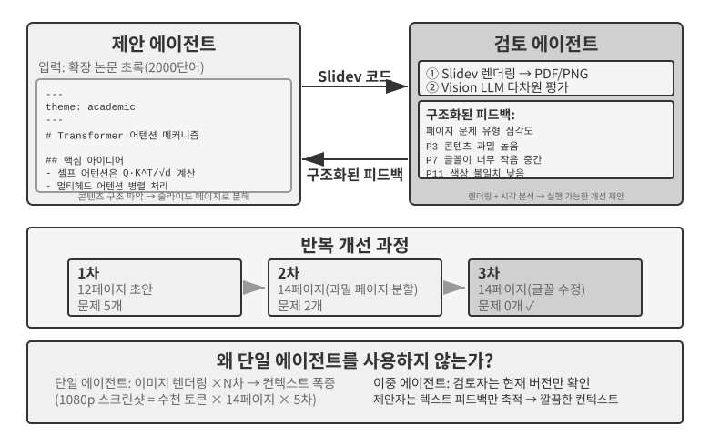

제안자-검토자는 대표적인 동료 협업 패러다임이다. 5장에서는 PPT 생성, 동영상 편집, 로그 시각화라는 세 가지 실험을 통해 설계 원칙과 실제 적용 방법을 이미 살펴봤다. 제안자 에이전트가 코드를 생성하면 검토자 에이전트는 실행 결과를 렌더링하고 비전 언어 모델로 품질을 평가한 뒤 구조화된 개선 제안을 제공한다. 두 에이전트는 결과가 요구 기준을 충족할 때까지 반복한다.

이 패러다임은 보안 검토(제안자는 작업 계획을 생성하고 검토자는 규정 준수 여부와 잠재적 위험을 확인함), 콘텐츠 모더레이션(제안자는 답변 초안을 작성하고 검토자는 비즈니스 규칙과 언어 규범을 확인함), 코드 검토(제안자는 코드를 작성하고 검토자는 보안과 모범 사례를 확인함) 같은 시나리오에도 적용할 수 있다.

**왜 하나의 에이전트가 결과를 생성한 다음 스스로 검토하면 안 되는가?** 바로 이 지점에 앞서 살펴본 “멀티 에이전트가 단일 에이전트보다 정말 나은 경우는 언제인가?”의 기준이 적용된다. 검토 과정이 새로운 정보를 도입하지 않는다면 이는 그저 “모델에 다시 생각해 보라고 요청하는 것”에 지나지 않는다. 관련 연구는 명확한 답을 제시한다. Huang 등의 ICLR 2024 논문 “Large Language Models Cannot Self-Correct Reasoning Yet”에서는 외부 피드백 없이 GPT-4에 자신의 답을 검토하고 수정하라고 요청하면 오히려 정확도가 떨어졌다. 모델이 오답을 정답으로 고친 경우보다 정답을 오답으로 바꾼 경우가 더 많았다.

TACL에 발표된 2024년 조사 논문 “When Can LLMs Actually Correct Their Own Mistakes?”(arXiv:2406.01297)는 이 결론을 한층 더 뒷받침했다. 테스트 케이스 실행 결과나 외부 도구의 검증 출력처럼 신뢰할 수 있는 외부 피드백을 제공하지 않는 한, 모델 자체의 “자기 교정”에만 의존하는 방식은 대체로 효과가 없다.

ICLR 2024의 CRITIC 논문은 직관적인 비교 실험을 제시한다. CRITIC은 모델이 검색 엔진과 Python 인터프리터 같은 외부 도구로 자신의 답을 검증하게 했고, 그 결과 성능이 크게 향상되었다. 그러나 실험에서 도구 검증 단계를 제거하고 모델의 자체 평가만 남기자 향상 폭 대부분이 사라졌다. 이는 검토의 가치가 “모델에 다시 생각해 보라고 요청하는 것”이 아니라, 테스트 결과, 렌더링한 스크린샷, 컴파일 오류, 외부 검색 결과처럼 **모델이 생성할 때는 이용할 수 없었던 새로운 정보를 도입하는 것**에 있음을 보여 준다.

이것이 제안자-검토자 패러다임의 핵심 설계 원칙이다. 5장의 PPT 생성 실험에서 검토자 에이전트의 가치는 “같은 모델로 코드를 다시 살펴보는 것”이 아니라 **PPT를 렌더링하고 스크린샷을 찍는 것**에 있었다. 이 스크린샷에는 제안자 에이전트가 코드를 생성할 때 얻을 수 없었던 시각 정보가 담겨 있다. 마찬가지로 코드 생성 시나리오에서 테스트 케이스를 실행해 얻은 통과·실패 결과는 코드를 작성할 때 존재하지 않았던 새로운 신호다. 검토자의 독립적인 가치는 바로 제안자가 이용할 수 없는 이러한 외부 피드백에 접근할 수 있다는 데서 나온다.

루프 엔지니어링의 관점에서 보면 업계에서 분류한 여러 루프 패턴은 이 책의 패턴과 대응한다. 인간 승인을 포함한 폐쇄형 루프는 인간이 최종 검토자가 되는 4장의 사전 승인에 해당한다. 예산이나 라운드 상한을 둔 개방형 루프는 최대 다섯 라운드까지 허용하는 5장의 다중 라운드 PPT 반복에 해당한다. 오케스트레이션된 하위 에이전트는 다음 절의 관리자 패턴에 해당한다. 따라서 루프 엔지니어링은 새로운 아키텍처가 아니라, 이러한 협업 패턴을 하나로 묶는 “루프 + 검증 + 중지 조건”이라는 공통 프레임워크를 설명한다. 제안자-검토자 패러다임은 이 프레임워크 안에서 검증 역할을 담당한다.

**확장: 그 밖의 동료 협업 패턴.**

**토론**: 여러 에이전트가 서로 다른 입장을 맡아 대립적 대화를 통해 문제 공간을 탐색한다. 예를 들어 기술 방안을 평가할 때 에이전트 A는 “찬성자” 역할로 방안의 장점과 기회를 열거하고, 에이전트 B는 “반대자” 역할로 위험과 한계를 지적한다. 각 토론 라운드에서는 상대방의 주장을 반박하거나 확장한다. 에이전트 하나가 문제를 분석하면 흔히 한 관점에 치우쳐 반대 증거를 간과한다. 구조화된 토론은 양쪽 입장을 모두 충분히 전개하도록 강제하여 의사 결정자가 더 균형 잡힌 판단에 이르도록 돕는다.

하지만 토론이 실제로 효과적인지를 두고 학계에서는 여전히 논쟁이 이어진다. Tran과 Kiela의 2026년 연구[^single-agent-2026]는 다중 홉 사고 과업에서 단일 에이전트와 다섯 가지 멀티 에이전트 아키텍처(순차, 토론, 앙상블, 병렬 역할, 하위 과업 병렬)를 비교했다. 그 결과 **사고 토큰 예산을 동일하게 유지하면 단일 에이전트가 멀티 에이전트 시스템과 대등하거나 오히려 더 나은 성능을 보였다**. 단, 컨텍스트 활용 능력이 일정 수준까지 저하된 경우는 예외였다. 연구진은 정보 이론의 데이터 처리 부등식으로 이를 설명했다. 토론에 참여하는 여러 에이전트는 정확히 같은 텍스트 정보를 처리하며, 에이전트 사이에서 중간 결론을 직렬로 전달할 때마다 정보가 새로 생기는 것이 아니라 손실될 수밖에 없다는 것이다. 일부 학술 논문에서 나타난 토론 방식의 이점은 여러 에이전트가 더 많은 총 연산량을 소비한 데서 비롯됐을 가능성이 크다. 이 주장의 경계를 분명히 해야 한다. 이 주장은 “멀티 에이전트가 중간 결론을 직렬로 전달해서 생기는” 정보 병목을 겨냥한다. 반면 **동일한 문제를 여러 번 독립적으로 샘플링한 뒤 집계하는 방식**(예: 자기 일관성, 다수결)이나, **생성과 검증의 난이도 비대칭성**(답을 작성하기는 어렵지만 검증하기는 쉬움)을 활용해 생성과 검증을 분업하는 방식까지 부정하지는 않는다. 이러한 시나리오는 추가적인 독립 표본을 도입하거나 과업 자체의 비대칭 구조를 활용하므로 데이터 처리 부등식의 적용 범위에 들지 않는다.

[^single-agent-2026]: Tran, D., Kiela, D. *Single-Agent LLMs Outperform Multi-Agent Systems on Multi-Hop Reasoning Under Equal Thinking Token Budgets.* arXiv:2604.02460, 2026.

**브레인스토밍**: 여러 에이전트가 독립적으로 아이디어를 생성한 뒤 서로 공유하며 영감을 주고받는다. 예를 들어 제품 혁신 과제에서 에이전트 1이 “소셜 공유 기능 추가”를 제안하면, 여기서 영감을 받은 에이전트 2는 “소셜 네트워크에 공유하는 데 그치지 않고 개인화된 공유 포스터까지 생성”하자고 제안한다. 에이전트 3은 앞의 두 아이디어를 종합해 “사용자가 맞춤 설정할 수 있는 포스터 템플릿으로 템플릿 마켓플레이스를 구축”하자고 제안한다. 서로 다른 프롬프트나 모델로 구현한 각 에이전트는 저마다 다른 “사고 성향”을 지닌다. 서로 자극을 주고받으면 더 넓은 해결 공간을 탐색하고 단일 에이전트가 생각하기 어려운 창의적인 조합을 찾아낼 수 있다.

**패널 토의**: 여러 에이전트가 각각 특정 전문 분야의 관점을 대변하며 학제 간 문제를 함께 논의한다. 예를 들어 신제품의 실현 가능성을 평가할 때 엔지니어 에이전트는 기술 관점에서 구현 난이도를 분석하고, 제품 에이전트는 사용자 경험 관점에서 시장 매력도를 평가하며, 운영 에이전트는 비용과 리소스 관점에서 사업 타당성을 분석한다. 이들은 대립하는 관계가 아니라 상호 보완하는 관계다. 함께 문제의 전체 모습을 맞춰 가며 여러 분야에 걸친 제약과 기회를 식별한다.

### 관리자 패턴: 중앙 집중식 조정

과업에 하위 과업이 다섯 개 넘게 포함되거나 동적 스케줄링이 필요하거나 하위 과업 사이의 의존 관계가 복잡하면 동료 협업만으로는 감당하기 어려워 관리자 패턴이 필요하다. 관리자 에이전트의 역할은 프로젝트 관리자와 비슷하다. 전체 과업을 이해하고, 할당할 수 있는 하위 과업으로 나누고, 각각에 적합한 에이전트를 선택하고, 진행 상황을 추적한다. 예외가 발생하면 과업을 재시도하거나 에이전트를 교체하거나 계획을 수정하며, 마지막에는 각 에이전트의 출력을 최종 결과로 통합한다.

시스템 설계 관점에서 관리자 패턴은 각 전문 에이전트를 관리자가 호출할 수 있는 도구로 모델링한다. 관리자의 도구 집합에는 검색이나 파일 작업 같은 전통적인 외부 도구뿐 아니라 다른 에이전트를 호출하는 인터페이스도 포함된다. 관리자는 도구 호출로 적절한 에이전트를 실행하고 과업 매개변수와 필요한 컨텍스트를 전달한 뒤 완료를 기다려 결과를 받는다. 관리자 관점에서 에이전트를 호출하는 일은 일반 도구를 호출하는 일과 본질적으로 다르지 않다. 둘 다 요청을 보내고 응답을 받는 과정이다. 이 통합 추상화 덕분에 관리자 패턴을 쉽게 확장할 수 있다. 역량을 추가할 때는 관리자의 핵심 로직을 수정할 필요 없이 해당 에이전트를 개발해 도구로 등록하기만 하면 된다. 이 구조는 이질성도 자연스럽게 지원한다. 에이전트마다 서로 다른 모델, 프롬프트, 도구 집합, 심지어 하드웨어 환경까지 사용할 수 있다.

“에이전트가 서로에게 도구가 되는” 추상화는 4장의 “협업 도구” 절에서 이미 확립했다. `spawn_subagent / send_message_to_subagent / cancel_subagent / list_agents` 인터페이스 설계는 여기서 관리자가 하위 에이전트를 호출하는 데 그대로 적용된다. “관리자 → 하위 에이전트” 방향으로 무엇을 전달해야 하는지는 이 장 뒤에서 설명하는 핸드오프 패키지 설계(과업 설명, 확인된 사실과 제약, 구조화된 산출물 참조)를 참고하라. 그렇다면 반대 방향인 “하위 에이전트 → 관리자”에서는 무엇을 반환해야 하는가? 답은 **전체 궤적이 아니라 구조화된 요약**이다. 하위 에이전트는 전체 실행 궤적을 자신의 로그에 남겨 두고, 과업 결론, 핵심 발견, 산출물 파일 경로, 발생한 문제를 반환해야 한다. 그래야 관리자의 컨텍스트가 폭발하지 않고 하위 과업 수에 따라 완만한 선형으로 증가한다. 아래 실험 10-3에서 관리자가 번역 내용을 저장하지 않고 파일 색인만 유지하는 이유도 여기에 있다.

하지만 관리자 패턴에는 본질적인 어려움이 있다. 관리자는 시스템의 단일 병목 지점이 된다. 모든 하위 과업의 성격을 이해하고, 적절한 에이전트를 선택하고, 컨텍스트를 정확히 전달해야 하며, 어느 하나라도 잘못 판단하면 그 영향이 전체 흐름으로 번진다. 또한 과업 전체의 전역 컨텍스트를 유지해야 하는데, 과업이 깊어지고 에이전트 호출이 누적될수록 컨텍스트가 급격히 커질 수 있다. 따라서 관리자에는 세심하게 설계한 프롬프트, 효과적인 컨텍스트 관리 전략, 적절한 세분성의 과업 분해가 필요하다.

2025년 Plan-and-Act 논문[^plan-and-act-2025]은 이를 실증적으로 분석했다. 계획자-실행자 이중 에이전트 아키텍처에서 **역량이 부족한 계획자는 전체 시스템의 가장 치명적인 병목**이다. 계획자의 계획 품질이 충분히 높으면 비교적 단순한 실행자만으로도 좋은 결과를 얻을 수 있다. 반대로 계획자가 과업을 잘못 분해하면 이후 실행자의 모든 작업이 잘못된 전제 위에 놓인다. 이 연구는 WebArena-Lite 벤치마크에서 54%의 성공률을 달성했으며, 핵심 기여는 실행자의 실행 능력이 아니라 계획자의 계획 능력을 개선한 데 있었다. 여기서 얻을 교훈은 모든 에이전트에 리소스를 고르게 배분하는 대신 가장 강력한 모델과 가장 세심하게 작성한 프롬프트를 관리자, 즉 계획자에게 우선 배정해야 한다는 것이다.

이는 4장의 주장과 충돌하지 않는다. 4장에서는 제안 모델과 검토 모델의 역량이 비슷해야 한다고 설명했다. 하지만 이는 **검토 시나리오**에 관한 주장이다. 검토자는 결함을 찾아내기 위해 검토 대상의 사고를 따라갈 수 있어야 한다. 검토자의 역량이 검토 대상보다 훨씬 낮으면 사고를 충분히 따라가지 못해 결함을 식별할 수 없을 것이다. 관리자 패턴은 이와 다른 **계획과 실행의 분업**을 다룬다. 계획자가 과업을 잘못 분해하면 아무리 강력한 실행자도 이를 만회할 수 없다. 따라서 가장 강력한 모델과 가장 세심한 프롬프트를 계획자에게 우선 배정한다. 실행자의 역량을 비슷하게 맞춰야 하는지는 하위 과업끼리 얼마나 긴밀하게 결합되어 있는지에 달려 있다. 각자의 출력을 마지막에 하나로 조립해야 한다면 가장 약한 연결 고리가 전체 품질을 끌어내리는 경우가 많다.

[^plan-and-act-2025]: Erdogan, L. E., et al. *Plan-and-Act: Improving Planning of Agents for Long-Horizon Tasks.* arXiv:2503.09572, 2025.

**순차 조정 패턴.**


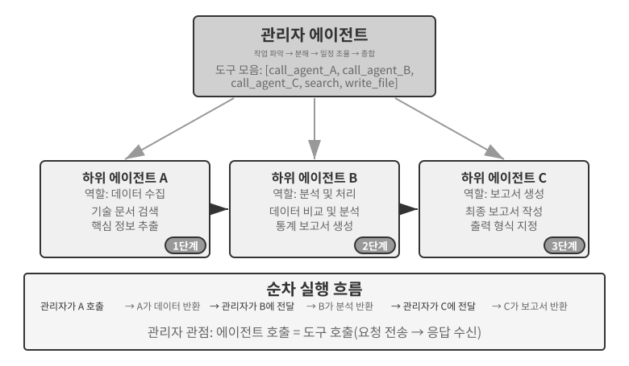


관리자는 전문 에이전트를 차례로 호출한다. 각 에이전트는 작업을 마치면 결과를 반환하고, 관리자는 다음 단계를 결정한다. 제어 흐름이 선형이고 단순하며 명확하므로 하위 과업 사이에 뚜렷한 순차 의존 관계가 있는 시나리오에 적합하다.

> **실험 10-3 ★★: 도서 번역 에이전트**
>
> 도서 번역은 멀티 에이전트 협업에 매우 적합한 복잡한 과업이다. 기술 서적을 번역할 때는 텍스트를 한 언어에서 다른 언어로 옮기는 데 그치지 않고 전문 용어의 일관성, 문맥의 정확성, 전체적인 유창성까지 보장해야 한다. 예를 들어 대규모 언어 모델을 다루는 영어 책에는 여러 관용 번역이 존재하는 용어가 반복해서 등장할 수 있다. 책 전체에서 일관성을 유지해야 한다. `agent`를 1장에서 “에이전트”로 옮겼다면 뒤에서 “대리인”이라는 다른 번역으로 바꿔서는 안 된다.
>
> 에이전트 하나만 사용하면 심각한 컨텍스트 관리 문제가 생긴다. 에이전트가 책을 장별로 처리할수록 책 전체의 용어집, 번역한 장, 현재 문단, 번역 작업 궤적, 도구 결과가 컨텍스트에 누적된다. 수백 쪽에 이르는 기술 서적과 이러한 중간 자료를 함께 넣으면 컨텍스트 창을 쉽게 초과한다. 더 큰 문제는 지나치게 긴 컨텍스트에서 작업하는 에이전트가 “길을 잃기” 쉽다는 점이다. 앞에서 정한 용어 규칙을 잊고 2장과 8장에서 서로 다른 번역을 사용하거나, 교정 과정에서 중복 검사를 하느라 리소스를 낭비하거나, 주의력이 지나치게 분산되어 실제로 존재하지 않는 용어 규칙을 “기억해 낼” 수도 있다.
>
> 관리자 패턴은 과업 분해와 책임 분리로 이러한 문제를 해결한다.
>
> - **용어집 에이전트**: 책 전체를 받아 반복해서 등장하는 전문 용어를 식별하고, 전문 사전과 번역 지침을 참조해 구조화된 용어집을 생성한다. 용어집은 영어 원어, 한국어 번역, 품사, 사용 문맥을 포함한 JSON/CSV 형식으로 만든다. 작업을 마치면 공유 파일 시스템에 용어집을 기록하고, 에이전트를 제거해 리소스를 해제할 수 있다.
> - **번역 에이전트**: 현재 장, 용어집, 번역 지침(대상 독자의 수준과 문체)을 받아 자연스러운 한국어로 번역한다. 용어집에 있는 용어는 지정된 번역을 엄격히 사용하고, 새로운 용어는 번역어를 추정한 뒤 검토 대상으로 표시한다. 각 인스턴스는 서로 간섭하지 않는 독립적인 컨텍스트에서 작업한다. 번역문은 파일 시스템에 기록한다(예: `chapter1_ko.md`). 관리자는 여러 인스턴스를 병렬 또는 순차로 실행할 수 있다.
> - **교정 에이전트**: 모든 번역문과 용어집을 받아 용어 번역이 통일되었는지 확인하고, 불일치를 식별하고, 전체적인 유창성과 가독성을 점검하는 일관성 검사를 수행한다. 교정 보고서를 생성해 파일 시스템에 기록한다.
> - **관리자 에이전트**: 컨텍스트에는 주로 과업 설명, 실행 계획, 각 에이전트의 호출 기록, 진행 상태를 저장한다. 전체 번역문은 컨텍스트에 저장하지 않고 파일 시스템에 남겨 두며 파일 색인만 유지한다. 관리자는 교정 보고서에 따라 특정 장을 번역 에이전트에 돌려보내 수정하게 할 수 있다.
>
> 따라서 번역한 장이 늘어나도 관리자의 컨텍스트는 관리 가능한 크기로 유지된다.
>
> 핵심 장점은 **컨텍스트 격리**다. 용어집 에이전트는 용어 추출에 필요한 내용만 보고, 번역 에이전트는 현재 장과 용어집만 본다. 교정 에이전트는 전체 텍스트에 접근해야 하지만 일관성 검사에만 집중한다. 이렇게 하면 각 에이전트의 컨텍스트가 간결하고 집중된 상태로 유지되어 효율이 높아지고 정보 과부하로 인한 오류가 줄어든다.
>
> **실험 요구 사항**:
> 1. 그림과 코드가 많이 포함된 기술 서적을 원문으로 선택한다.
> 2. 관리자, 용어집, 번역, 교정이라는 네 가지 유형의 에이전트를 구현한다.
> 3. 각 에이전트의 컨텍스트 사용량을 기록해 관리자 패턴이 컨텍스트 증가를 얼마나 효과적으로 통제하는지 검증한다.
> 4. 번역 품질, 실행 효율, 리소스 소비 측면에서 단일 에이전트와 관리자 패턴을 비교한다.
>
>
> 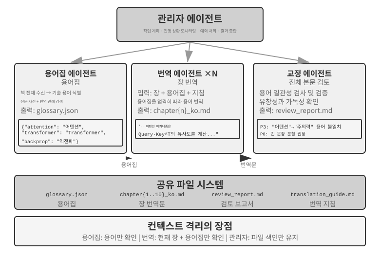
>
>

**병렬 조정 패턴.**


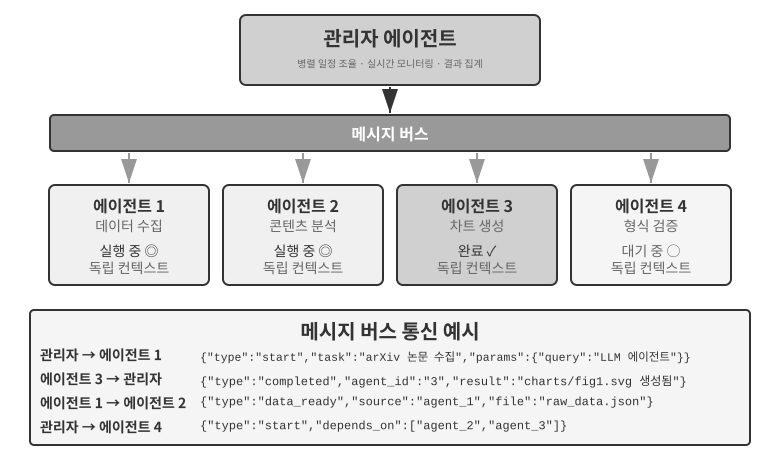


여러 하위 과업을 병렬로 실행할 수 있다면 순차 패턴은 비효율적이다. 병렬 조정에서는 여러 에이전트가 동시에 작업하므로 처리량이 크게 늘어난다. 관리자 에이전트는 병렬 과업을 계획하고, 실행 중인 모든 에이전트를 실시간으로 모니터링하고, 에이전트 사이의 통신을 조정하고, 성공이나 실패가 발생했을 때 시스템 전체에 영향을 미치는 결정을 내려야 한다. 이를 위해서는 일반적으로 **메시지 버스**가 인프라로 필요하다. 메시지 버스는 에이전트가 메시지를 게시하고 관심 있는 메시지 유형을 구독하는 “공용 게시판”과 같으며, 비동기식 비차단 통신을 지원한다. 단순한 것부터 복잡한 것까지 대표적인 구현으로 **Redis Pub/Sub**과 **RabbitMQ** 같은 메시지 큐가 있다. Redis Pub/Sub은 가볍고 메시지를 즉시 전달하지만 영속화하지 않으므로 수신자가 오프라인이면 메시지를 놓친다. RabbitMQ와 유사한 시스템은 메시지를 디스크에 영속화하므로 수신자가 일시적으로 오프라인이어도 메시지를 보존한다. 메시지에는 보통 발신자 ID, 대상 에이전트(또는 브로드캐스트 표시), 메시지 유형, 페이로드를 담은 JSON 엔벌로프를 사용한다.

**Lingtai: 관리자 패턴을 제품화한 사례.** Lingtai는 장기 실행 에이전트를 위한 로컬 파일 기반 작업 공간이다[^lingtai]. 세 가지 역할은 이 절의 개념과 밀접하게 대응한다. **메인 에이전트(main agent)**는 사용자가 상호작용하는 영속적인 허브다. 계획과 메모리를 보유하고 다른 역할을 생성하므로 관리자 에이전트의 자리를 차지한다. **데몬(daemon)**은 잡음이 많지만 범위가 한정된 과업을 처리하기 위해 생성되는 단기 병렬 작업자다. 과업이 끝나면 제거하고 결론만 보존한다. 이는 하위 에이전트가 전체 궤적 대신 구조화된 요약을 반환해야 한다는 원칙과 병렬 조정 패턴을 제품으로 구현한 것이다. **아바타(avatar)**는 자체 메모리, 사서함, 책임을 보유하는 영속적인 전문 동료로, 여러 세션에 걸쳐 유지할 가치가 있는 전문 영역을 위해 설계되었다.

Lingtai의 나머지 설계도 앞 절의 내용과 맞닿아 있다. 지식은 각 에이전트의 영속적인 비공개 메모리 파일에 저장되고, 스킬은 모든 에이전트가 공유하는 Markdown 플레이북으로 존재한다. 이는 “에이전트 관점에서 본 파일 시스템”에서 설명한 기본 제공 시스템 리소스에 해당한다. 에이전트의 컨텍스트 창이 가득 차면 **탈피한다(molts)**. 신중하게 요약을 작성한 뒤 그 요약과 영속 메모리는 유지하면서 새로운 컨텍스트로 시작하는 2장의 컨텍스트 압축 방식을 따른다. 에이전트의 정체성, 메모리, 역량이 모두 프로젝트 디렉터리의 일반 파일로 존재하므로 에이전트를 바꾸지 않고도 기반 모델을 교체할 수 있다. 이런 의미에서 에이전트는 곧 자신의 파일이다. 이는 표 10-3의 첫 두 행을 제품으로 구현한 것이다. 프로그램과 메모리가 모두 파일로 환원되므로 프로세스를 언제든 다시 구축할 수 있다.

[^lingtai]: Lingtai 공식 튜토리얼: https://lingtai.ai/en/tutorial/

> **실험 10-4 ★★★: 컴퓨터를 사용하면서 전화로 대화하는 에이전트**
>
> **사전 요구 사항**: 이 실험은 9장의 컴퓨터 사용과 음성 에이전트 기술을 통합한다. 먼저 9장의 관련 실험을 완료하는 것을 권장한다.
>
> 현실의 많은 과업에서는 여러 역량이 순차가 아니라 동시에 작동해야 한다. 예를 들어 인간 비서는 고객과 대화하면서 문서를 찾고 메모할 수 있다. 에이전트 하나에 실시간 대화와 컴퓨터 상호작용을 모두 맡기면 계속 과업을 전환해야 하므로 둘 중 어느 한 활동이 중단될 수 있다. 멀티 에이전트 시스템은 지연 시간에 민감한 각 과업을 전문 에이전트에 할당하고 비동기 메시지로 조정한다. 전화 에이전트에는 지연 시간이 짧은 음성 인식과 합성이 필요하고, 컴퓨터 에이전트에는 뛰어난 시각 이해와 행동 계획 역량이 필요하다.
>
> **시나리오**: AI 에이전트가 사용자의 복잡한 항공권 예약 양식 작성을 돕는다. 웹 페이지를 조작하는 동시에 전화로 사용자의 개인 정보(이름, 신분증 번호, 항공편 선호 사항 등)를 묻고 확인해야 한다. 전화 대화와 웹 상호작용 모두 빠르게 응답해야 한다. 단일 에이전트로는 처리하기 어렵지만 이중 에이전트 시스템을 사용하면 각 에이전트가 한 역할에 집중할 수 있는 대표적인 사례다.
>
> **이중 에이전트 아키텍처**:
>
> **전화 에이전트**: ASR, LLM, TTS로 구축한 음성 에이전트다. 사용자의 자연어 답변을 해석해 핵심 정보를 추출하고, 메시징 시스템을 통해 컴퓨터 에이전트에 보낸다. 컴퓨터 에이전트에서 메시지(예: “사용자의 신분증 번호 필요”, “페이지 로딩 오류”)를 받아 사용자에게 적절히 응답하기도 한다.
>
> **컴퓨터 에이전트**: Anthropic Computer Use나 `browser-use` 같은 브라우저 자동화 프레임워크로 페이지를 해석하고, 양식 필드를 식별해 채우며, 필요하면 전화 에이전트에 도움을 요청한다.
>
> **통신 메커니즘**: 두 가지 선택지가 있다.
> - **간단한 해법**: 도구 호출을 통한 지점 간 통신. 예: `send_message_to_computer_agent(message)` / `send_message_to_phone_agent(message)`
> - **완전한 해법**: 메시지 버스 + 관리자 에이전트. 발신자, 수신자, 유형, 내용을 포함하는 통합 메시지 형식을 사용한다.
>
> **병렬 협업 메커니즘**(이 장의 두 “전화 + 컴퓨터” 실험에 공통으로 적용): 두 에이전트는 별도의 스레드나 프로세스에서 실행되며 각자 독립적인 ReAct 루프를 유지한다. 전화 에이전트는 오디오 수신, ASR 전사, LLM 답변 생성, TTS 음성 합성 및 재생, 컴퓨터 에이전트의 메시지 확인을 반복한다. 컴퓨터 에이전트는 스크린샷 캡처, 비전 언어 모델을 통한 페이지 해석, 행동 계획 및 실행, 전화 에이전트의 메시지 확인을 반복한다. 둘은 반드시 병렬로 실행되어야 한다. 컴퓨터 에이전트가 요소를 찾고 텍스트를 입력하는 동안 전화 에이전트는 연결을 유지하며 사용자와 대화해야 한다(“네, 지금 이름을 입력하고 있습니다… 신분증 번호를 알려 주시겠습니까?”). 다른 에이전트의 메시지는 `[FROM_COMPUTER_AGENT] Cannot find the 'Next' button; user confirmation might be needed`, `[FROM_PHONE_AGENT] User said name is 'Zhang San'; ID number is 123456` 같은 레이블과 함께 수신 에이전트의 컨텍스트에 넣을 수 있다.
>
> **실험 요구 사항**:
> 1. ASR/TTS API와 브라우저 조작 프레임워크를 기반으로 이중 에이전트 아키텍처를 구현한다.
> 2. 효율적인 양방향 통신 메커니즘을 구현한다.
> 3. 정보 수집과 양식 작성을 동시에 수행하는 진정한 병렬 작동을 보장한다.
> 4. 예외와 오류 사례를 처리한다.
>
> **실험 10-5 ★★★: 전화·컴퓨터 에이전트의 자율 오케스트레이션**
>
> 실험 10-4에서는 이중 에이전트 협업을 미리 설계했다. 이 실험은 한 걸음 더 나아가 **자율 에이전트 오케스트레이션**을 탐구한다. 인간이 설계한 흐름을 따르는 대신 에이전트 스스로 협업자를 언제 실행할지 결정한다.
>
> **시나리오**: 사용자가 URL을 제공하며 “이 웹사이트에서 회원 가입을 완료하도록 도와줘”라고 요청하지만 어떤 정보를 입력해야 하는지는 알려 주지 않는다. 관리자 에이전트는 웹사이트에 접속해 가입 페이지를 불러오도록 컴퓨터 사용 에이전트를 실행한다.
>
> 작업 도중 컴퓨터 사용 에이전트는 가입 양식이 매우 복잡하고 필수 필드도 많다는 사실을 발견한다. 기본 개인 정보(이름, 성별, 생년월일), 연락처 정보(전화번호, 이메일, 우편 주소), 신원 확인 정보(신분증 유형과 번호), 환경 설정 등이 필요하다. 컨텍스트를 확인한 에이전트는 이 정보가 없다는 사실을 깨닫는다. 사용자가 구체적인 데이터를 제공하지 않고 “가입을 도와줘”라고만 말했기 때문이다.
>
> 전통적인 에이전트라면 사용자에게 채팅으로 정보를 입력해 달라고 요청할 것이다. 데이터가 많으면 비효율적이고 형식 오류나 누락의 위험도 커진다. 더 영리한 에이전트라면 **이 시나리오에서는 전화로 정보를 수집하는 편이 더 적합하다는 사실**을 알아차려야 한다. 전화 대화에서는 질문과 확인을 차례로 진행할 수 있고 모호한 답도 쉽게 명확히 할 수 있다.
>
> 핵심 혁신은 이 결정을 미리 프로그래밍하지 않고 **에이전트가 자율적으로 내린다는 점**이다. 컴퓨터 사용 에이전트의 프롬프트에는 다음과 같이 적혀 있다. “사용자에게서 많은 양의 구조화된 정보를 수집해야 하고 대화를 통해 점진적으로 수집할 수 있다면 전화 에이전트를 보조 도구로 호출하는 방안을 고려하라.” 도구 집합에는 `initiate_phone_call_agent(purpose, required_info)`가 포함된다.
>
> 이 도구를 호출하면 양식 작성 목표, 수집할 정보, 필드별 형식 요구 사항을 명시한 명확한 과업 컨텍스트와 함께 전화 에이전트가 생성된다.
>
> 두 에이전트는 실험 10-4의 실시간 비동기 협업 모드로 들어간다. 전화 에이전트는 한 번에 질문 하나씩을 던진다. “안녕하세요. 가입 양식 작성을 돕고 있습니다. 먼저 성함을 알려 주시겠습니까?” 사용자가 답하면 곧바로 컴퓨터 에이전트에 `{"type": "info_collected", "field": "Name", "value": "Zhang San"}`를 보낸다. 컴퓨터 에이전트는 해당 필드를 찾아 입력한다. 전화 에이전트는 컴퓨터 작업이 끝날 때까지 기다리지 않고 다음 질문을 이어 간다. 이 **하나를 묻고 하나를 채우는** 워크플로는 작업 지연이 대화를 막지 않게 한다. 필요한 정보를 모두 수집하면 전화 에이전트가 `{"type": "task_completed"}`를 보내고 컴퓨터 에이전트는 양식을 제출한다.
>
> **실험 요구 사항**:
> 1. 전화 에이전트를 실행할지 자율적으로 결정할 수 있는 컴퓨터 사용 에이전트를 구현한다.
> 2. 실시간 양방향 통신과 진정한 병렬 작업을 구현한다.
> 3. 정보 형식이 잘못되면 피드백을 제공하고 다시 질문하는 방식으로 예외를 처리한다.
> 4. 교환한 메시지의 타임스탬프를 로그에 남기고 에이전트의 핵심 결정을 기록한다.
>
>
> 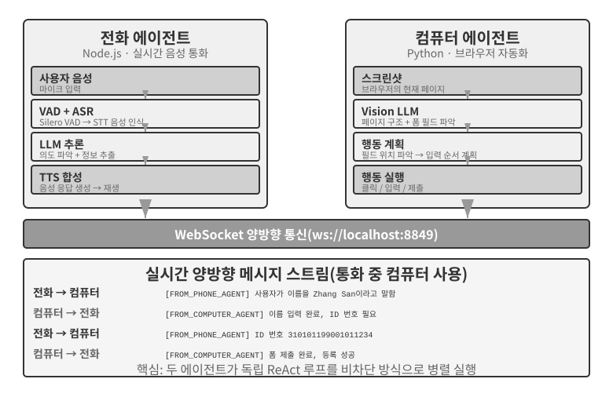
>
>
> **실험 10-6 ★★★: 여러 웹사이트에서 동시에 정보를 수집하는 에이전트**
>
> **사전 요구 사항**: 먼저 4장의 이벤트 기반 메커니즘과 인터럽트 메커니즘을 복습하는 것을 권장한다.
>
> 이 실험은 정보 수집 시나리오에 멀티 에이전트 병렬 실행을 적용하는 방법을 탐구한다. 서로 다른 두 에이전트의 협업에 초점을 맞춘 실험 10-4와 10-5와 달리, 여기서는 **동종 에이전트 여러 개의 병렬 검색**과 중앙 집중식 조정을 통한 효율적인 과업 완료 및 리소스 최적화에 초점을 맞춘다.
>
> **문제**: 한 대학의 여러 단과대학 교원 명부 웹사이트가 주어졌을 때 각 사이트에서 지정된 교원(예: “김민수”)을 검색한다. 찾으면 소속 단과대학, 직위, 연구 분야와 그 밖의 관련 정보를 반환한다.
>
> **핵심 과제**:
>
> **1. 병렬 실행**: 관리자 에이전트가 단과대학 웹사이트마다 하나씩, 컴퓨터 사용 에이전트 인스턴스 10개를 동적으로 생성한다. 각 인스턴스는 자체 브라우저 세션을 가진 독립적인 프로세스나 스레드여야 하며 다른 인스턴스를 차단하지 않고 실행할 수 있어야 한다. 실행할 때 대상 웹사이트 URL, 검색할 교원 이름, 메시지 라우팅용 과업 식별자를 매개변수로 전달한다.
>
> **2. 실시간 모니터링**: 각 에이전트는 실행 중에 상태 업데이트(“웹사이트 불러오는 중”, “교원 명부 파싱 중”, “대상을 찾지 못함, 과업 완료”, “일치 항목 발견, 세부 정보는 다음과 같음”)를 주기적으로 보낸다. 관리자 에이전트는 메시지 버스로 업데이트를 받아 과업 상태 표를 유지하고 어떤 에이전트가 실행 중인지, 완료했는지, 오류 상태인지 실시간으로 추적한다.
>
> **3. 연쇄 종료**: 컴퓨터과학 단과대학을 맡은 에이전트가 해당 교원을 찾았다고 가정하자. 에이전트는 관리자 에이전트에 `{"type": "target_found", "agent_id": "agent_3", "data": {...}}`를 보내고, 관리자는 실행 중인 다른 모든 에이전트에 즉시 `{"type": "terminate", "reason": "target_found_by_agent_3"}`를 보낸다. 각 에이전트는 이 메시지를 언제든 수신해 정상적으로 멈추고 리소스를 해제한 뒤 종료를 확인해 줄 수 있어야 한다. 관리자 에이전트는 모든 확인 응답을 받거나 제한 시간이 지날 때까지 기다린 뒤 결과를 집계한다. 구현할 때 경쟁 상태도 처리해야 한다.
>
> **개념 보충: 경쟁 상태란 무엇인가?** 에이전트 A와 에이전트 B가 같은 밀리초에 대상 교원을 발견하고 둘 다 관리자 에이전트에 “찾았습니다!”라고 보고한다고 가정하자. 관리자가 이를 제대로 처리하지 못하면 에이전트 A의 보고를 받은 뒤 결과 집계를 시작했다가 에이전트 B의 보고가 도착했을 때 두 번째 집계를 시작할 수 있다. 그 결과 중복된 결과나 모순된 상태가 생길 수 있다. 일반적인 해법은 잠금이다. 첫 번째 보고가 상태를 잠그고 이후 보고는 중복으로 인식해 무시한다.
>
> **4. 실패 처리**: 실행 중에는 여러 예외가 발생할 수 있다. 네트워크 오류나 서비스 장애로 단과대학 웹사이트에 접근하지 못하거나 사이트 구조 때문에 에이전트가 올바르게 파싱하지 못할 수 있다. 모든 에이전트가 대상을 찾지 못한 채 검색을 끝낼 수도 있다. 관리자 에이전트는 각 에이전트에 제한 시간(예: 2분)을 설정하고, 시간 초과를 실패로 처리하며, 오류가 다른 에이전트를 중단시키지 않도록 격리해야 한다. 모든 에이전트가 끝난 뒤 어느 하나라도 대상을 찾았다면 정보를 반환한다. 그렇지 않으면 “대상 교원을 찾지 못했습니다”라고 보고하고 발생한 실패를 요약한다.
>
> **실험 요구 사항**:
> 1. 여러 병렬 에이전트를 동적으로 실행할 수 있는 관리자 에이전트를 구현한다.
> 2. browser-use 같은 오픈 소스 프로젝트를 기반으로 컴퓨터 사용 에이전트를 구현한다.
> 3. 관리자 에이전트와 여러 하위 에이전트 사이의 양방향 통신을 지원하는 메시지 버스를 구현한다.
> 4. 성공 시 연쇄 종료 메커니즘을 구현해 대상을 찾은 즉시 다른 모든 에이전트가 빠르게 멈추도록 보장한다.
> 5. 여러 예외 시나리오(웹사이트 접근 실패, 파싱 오류, 어느 에이전트도 대상을 찾지 못함)를 처리한다.
> 6. 직렬 실행과 병렬 실행 시간을 측정하고 비교해 병렬화의 속도 향상을 정량화한다.
>
>
> 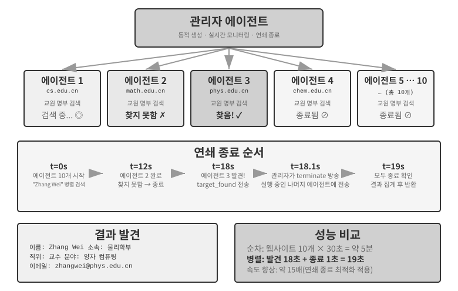
>
>

### 탈중앙화 패턴: 동료 간 핸드오프


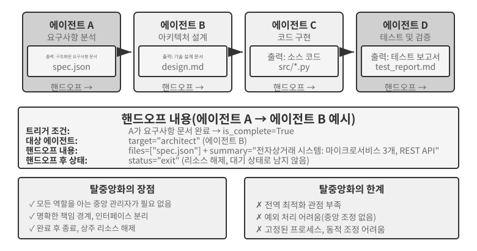


관리자 패턴은 명확한 제어 구조와 전체적인 가시성을 제공하지만, 탈중앙화 패턴은 단순히 그 단점을 보완하기 위한 해법이 아니다. 중앙 제어자를 없애는 주된 동기는 인간 사회의 조직 방식을 모방하는 데 있다. 모든 판단을 한 명의 관리자에게 몰아주는 대신, 대등한 여러 역할이 분업하고 서로 견제하면서 각자의 전문적 관점으로 문제를 살피고 누구와 소통할지 스스로 결정하게 하는 것이다. 마이크로서비스 분야에서는 이 두 선택을 **오케스트레이션**과 **코레오그래피(choreography)**라고 부른다. 전자는 지휘자가 모든 것을 중앙에서 조율하고, 후자는 각 무용수가 언제 등장할지 스스로 감지한다.

탈중앙화 패턴은 다른 아키텍처 접근법을 취한다. **단일 중앙 제어자가 없으며, 에이전트들이 대등한 관계로 협업한다.** 각 에이전트는 자신의 전문적 판단에 따라 언제 다른 에이전트에게 연락할지 스스로 결정한다. 과업을 넘기거나("내 부분은 끝났으니 이제 네가 맡아줘"), 피드백을 요청하거나("이 계획은 기술적으로 실현 가능한가?"), 문제를 보고할 수 있다("네가 준 요구 사항은 서로 모순되니 다시 논의해야 해").

다음 사례들은 부분적인 탈중앙화에서 완전한 탈중앙화로 점차 발전한다. MetaGPT는 고정 파이프라인을 사용하고 통신만 탈중앙화한다. AutoGen은 공유 대화 기록과 중앙 집중식 스케줄링을 결합한다. OpenAI Swarm은 제어 흐름 결정을 대등한 에이전트들에게 직접 분산한다.

**컨텍스트를 공유하지 않는 핸드오프에서는 무엇을 전달하는가?** 그림 10-10은 두 가지 핸드오프를 대조한다. 실험 10-2의 `transfer_to_agent`는 공유 컨텍스트를 사용하므로 새 역할이 전체 기록을 자동으로 물려받는다. 핸드오프 체인 패턴에서는 컨텍스트를 공유하지 않으므로 보내는 에이전트가 받는 에이전트에게 필요한 정보를 명시적으로 구성해야 한다.

실무에서 효과적인 "핸드오프 패키지"는 보통 세 부분으로 구성된다. **과업 설명**(수신자가 해야 할 일과 인수 기준), **확인된 사실과 제약 조건**(사용자 선호, 비즈니스 규칙, 이전 단계에서 내린 결정), **구조화된 산출물 참조**(파일 내용이 아니라 파일 경로이며, 수신자가 필요할 때 읽는다)이다. 이 패키지는 보내는 에이전트의 시행착오 과정, 중간 작업, 실패한 시도 등 전체 궤적을 의도적으로 제외한다. 이런 내용은 수신자에게 대부분 잡음이기 때문이다.

이것이 두 핸드오프 유형의 본질적인 차이다. 공유 컨텍스트를 사용하는 핸드오프는 전체 기록을 유지하므로 모든 정보가 보존되지만 컨텍스트가 계속 커진다. 공유 컨텍스트가 없는 핸드오프는 정제된 패키지를 전달한다. 일부 정보 손실을 감수하는 대신 각 에이전트가 깨끗하고 집중된 컨텍스트에서 작업할 수 있다. 어느 에이전트도 다른 에이전트의 작업 과정을 이해할 필요가 없다. 핸드오프 패키지와 출력 산출물의 형식 및 의미만 이해하면 된다. 이러한 인터페이스 기반 협업은 소프트웨어 공학의 계약에 의한 설계 원칙을 따른다.

**MetaGPT: SOP 기반 소프트웨어 회사 시뮬레이션(파이프라인에서 분리된 통신으로 넘어가는 과도기적 사례).**


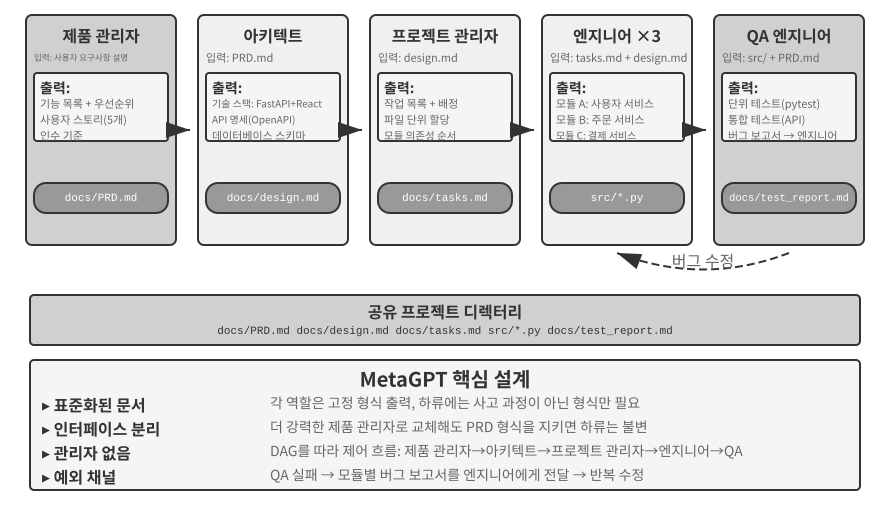


MetaGPT의 핵심 통찰은 소프트웨어 회사가 개발하고 다듬어 온 **표준 운영 절차**(Standard Operating Procedures, SOP)가 멀티 에이전트 시스템의 협업 프로토콜이 될 수 있다는 것이다. 이러한 SOP를 인코딩하면 조립 라인의 전문 작업자처럼 각 역할이 표준화된 결과물을 만들고, 그 결과물이 자연스럽게 역할 간 통신 인터페이스가 된다.

MetaGPT에서 각 역할은 고정된 순서(제품 관리자 → 아키텍트 → 프로젝트 관리자 → 엔지니어 → QA)로 작업하며, 각자 구조화된 결과물을 출력한다.

- **제품 관리자 에이전트**: 요구 사항 설명을 받아 기능 목록, 사용자 스토리, 인수 기준, 우선순위를 포함하는 구조화된 제품 요구 사항 문서(Product Requirements Document, PRD)를 생성한다.
- **아키텍트 에이전트**: PRD를 읽고 아키텍처 결정(기술 스택 선택, 모듈 분할, 인터페이스 정의, 데이터 모델 설계)을 내린 뒤 설계 문서를 출력한다.
- **프로젝트 관리자 에이전트**: 아키텍처 설계를 읽고 시스템을 구체적인 과업 목록과 파일 단위 담당 업무로 분해하며, 모듈의 의존 순서를 명확히 한 뒤 엔지니어에게 과업을 할당한다.
- **엔지니어 에이전트**: 설계 문서를 읽고 담당 모듈을 구현해 코드를 생성한다. 여러 인스턴스가 병렬로 작업할 수 있다.
- **QA 엔지니어 에이전트**: 코드와 PRD를 읽고 테스트 사례를 생성하며, 테스트를 실행하고 버그를 기록한 뒤 테스트 보고서를 출력한다.

MetaGPT가 탈중앙화 통신에 실제로 기여한 부분은 **공유 메시지 풀 + 역할별 구독**이라는 정보 전달 메커니즘이다. 각 역할은 모든 역할이 볼 수 있는 풀에 구조화된 메시지를 발행한다. 다른 역할은 지점 간 통신을 하는 대신 구독 설정에 따라 자신의 책임과 관련된 메시지만 소비한다. 발행자는 누가 자신의 출력을 소비할지 알 필요가 없다. 역할을 추가하려면 그 역할이 구독할 메시지 유형만 선언하면 되며 기존 역할은 바꿀 필요가 없다. 이것이 진정한 분리를 만든다. 예를 들어 제품 관리자를 더 강력한 모델로 교체하더라도 PRD가 계속 명세를 준수하기만 하면 다른 에이전트는 바꿀 필요가 없다.

MetaGPT의 반복적 개선은 주로 엔지니어링 단계에서 **실행 피드백**을 통해 이루어진다. 엔지니어는 코드와 테스트를 실행하고 오류와 실패를 바탕으로 디버깅 루프를 진행하며 테스트가 통과할 때까지 계속한다. 다른 에이전트의 의견이 아니라 결정론적인 실행 결과가 수정을 이끈다.

분명히 말하면 MetaGPT는 **제어 흐름** 면에서 탈중앙화되어 있지 **않다**. 역할 순서가 SOP에 의해 미리 정해지므로 전체 시스템은 조립 라인에 더 가깝다(1장의 표현으로는 워크플로이다). 이 절에서 MetaGPT를 다루는 이유는 메시지 풀과 구독을 결합한 통신 메커니즘이 탈중앙화 시스템의 가장 중요한 설계 요소인 분리를 보여 주기 때문이다. "QA가 제품 관리자에게 직접 연락해 요구 사항을 명확히 하는 것"이나 "엔지니어가 아키텍트와 대안을 논의하는 것" 같은 다방향 동적 피드백은 이 아키텍처에서 자연스럽게 구상할 수 있는 확장이지만, 원래 MetaGPT에는 구현되지 않았다.

**AutoGen 그룹 채팅: 공유 대화 기록 + 중앙 집중식 스케줄링.** AutoGen의 그룹 채팅에서는 여러 에이전트가 같은 대화에 참여할 수 있다. 매 라운드마다 "발화자 선택기"가 다음에 발언할 에이전트를 정한다. 선택기는 단순한 라운드 로빈 규칙을 따를 수도 있고, 지금까지의 대화를 바탕으로 어떤 에이전트가 응답하기에 가장 적합한지 LLM으로 판단할 수도 있다. 모든 에이전트의 발언은 모든 참가자에게 공개된다.

이는 제어 흐름 면에서 완전히 탈중앙화된 형태가 아니다. `GroupChatManager`가 중앙에서 발화자를 선택하며, 누구의 차례인지 정하는 것 자체가 제어 흐름 결정이기 때문이다. 따라서 더 정확한 분류는 **공유 대화 기록 + 중앙 집중식 스케줄링**이다. 모든 에이전트가 동일한 공개 기록을 보지만 각자 독립적인 시스템 프롬프트와 도구 집합을 유지하고, 선택기가 스케줄링 권한을 갖는다.

이 모델은 계획 검토나 여러 분야에 걸친 분석처럼 여러 관점의 논의가 필요하고 발언 순서를 미리 정할 수 없는 과업에 적합하다. 하지만 모든 에이전트가 계속 말하기만 하고 집단은 진전하지 못하는 일종의 라이브락(livelock)처럼 대화가 표류할 수 있다. 따라서 명확한 종료 조건이 반드시 필요하다. 이 장의 차원으로 보면 AutoGen은 스케줄링은 중앙 집중식이고 컨텍스트는 부분적으로 공유하는 혼합형이다. 이는 토폴로지와 컨텍스트 공유가 서로 독립적인 설계 차원임을 보여 준다.

**OpenAI Swarm과 Agents SDK: 핸드오프 네트워크.** 이와 달리 OpenAI의 Swarm과 그 후속인 Agents SDK는 제어 흐름에서 피어 투 피어 탈중앙화를 구현한다. 각 에이전트에는 여러 핸드오프 선택지가 있으며 언제든 네트워크의 다른 에이전트에게 제어권을 넘길 수 있다. 고객 서비스 분류 에이전트가 어떤 문제에 환불이 관련된다고 판단하면 과업을 환불 에이전트에게 넘긴다. 환불 에이전트가 기술적 결함을 발견하면 기술 지원 에이전트에게 넘길 수 있다. 중앙 스케줄러는 없다. 제어권은 대등한 에이전트 사이를 바통처럼 오가며, 각 에이전트가 스스로 라우팅을 결정한다. 이는 그림 10-10의 핸드오프 체인 패턴을 공학적으로 구현한 것이다. 위험 요소는 순환이다. A가 B에게 넘기고 B가 다시 A에게 넘기면 과업이 루프 안에서 맴돈다. 이를 끊으려면 최대 핸드오프 횟수 같은 보호 장치가 필요하다.

### 조직 간 협업: A2A 프로토콜

위의 모든 시스템은 모든 에이전트를 같은 팀에서 개발하고 같은 시스템 안에서 실행한다고 가정한다. 이런 경우에는 매개변수 전달, 공유 파일, 메시지 버스라는 세 가지 통신 메커니즘으로 충분하다. 그러나 협업이 조직의 경계를 넘어서는 경우, 즉 자신의 에이전트가 다른 회사의 에이전트를 호출해야 할 때는 표준화된 상호운용성 프로토콜이 필요하다. 프로세스의 세계도 같은 발전 과정을 거쳤다. IPC는 한 컴퓨터 안에서만 작동하며, 컴퓨터의 경계를 넘어서면 TCP/IP 같은 표준 프로토콜과 DNS 같은 서비스 발견에 의존해야 한다. 프로세스에 네트워크 프로토콜이 있다면 에이전트에는 A2A가 있다. Google이 2025년에 발표하고 이후 Linux Foundation에 기증해 관리를 맡긴 **A2A**(Agent2Agent) 프로토콜은 바로 이 목적을 위해 설계되었다. 핵심 요소는 세 가지다.

- **에이전트 카드(Agent Card)**: 에이전트의 역량을 설명하는 메타데이터 문서로, 지정된 공개 주소에 게시된다. 에이전트가 할 수 있는 일, 지원하는 입출력 모달리티, 인증 방법을 명시한다. 본질적으로 조직 간 역량 발견 문제를 해결하는 에이전트의 "명함"이다.
- **과업 생명주기 관리**: A2A는 협업 단위를 정의된 상태 머신(제출됨, 진행 중, 입력 필요, 완료됨, 실패함)을 가진 과업으로 모델링하며, 장시간 실행되는 과업과 스트리밍 방식의 진행 상황 업데이트를 기본 지원한다.
- **불투명한 협업**: 에이전트는 내부 프롬프트, 사고 과정, 도구 구현을 노출하지 않고 과업과 산출물만 교환한다. 이는 이 장의 "컨텍스트를 공유하지 않는다"는 원칙과 일치하며 조직 간 협업에 필요한 보안 속성이기도 하다.

MCP는 에이전트와 도구 사이의 상호운용성을 지원하고, A2A는 에이전트 사이의 상호운용성을 지원한다. A2A는 이 장에서 소개한 세 가지 통신 메커니즘을 대체하지 않고 신뢰 경계를 넘는 통신을 표준화한다. 한 조직 안에서는 메시지 버스만으로 충분할 수 있지만, 협업 당사자들이 서로를 신뢰하지 않고 상대방의 구현을 살펴볼 수도 없다면 A2A 같은 공개 프로토콜이 필요하다.

## 멀티 에이전트 협업의 실패 모드

멀티 에이전트 시스템은 단일 에이전트 시스템에는 없는 새로운 실패 모드를 낳는다. 2025년 논문 "Why Do Multi-Agent LLM Systems Fail?"은 체계적인 연구를 통해 MAST 실패 모드 분류 체계를 제안했다. 연구진은 MetaGPT, ChatDev, AG2, Magentic-One을 비롯한 주류 멀티 에이전트 프레임워크 7개에서 실행 궤적을 수집했다. 인간 주석자들은 약 150개의 궤적을 독립적으로 분석했으며, 판단의 일치도가 높았다(Cohen의 카파 = 0.88). 이 연구는 세 범주에서 **서로 다른 14가지 실패 모드**를 식별했다.

- **시스템 설계 결함**: 에이전트 간 인터페이스 정의가 불명확하거나 역할과 책임이 겹치거나 도구 설정이 잘못되는 등 아키텍처 수준의 문제이다.
- **에이전트 간 정렬 실패**: 여러 에이전트가 과업 목표를 일관되지 않게 이해하거나, 전달된 정보를 하류 에이전트가 잘못 해석하거나, 여러 에이전트의 작업이 논리적으로 서로 모순된다.
- **과업 검증 누락**: 과업이 실제로 완료되었는지 확인하는 효과적인 메커니즘이 시스템에 없다. 에이전트가 "완료"했다고 주장하지만 실제 결과는 요구 사항을 충족하지 못할 수 있다.

간단한 수정조차 개선 폭은 제한적이었다. 예를 들어 ChatDev의 측정 성능은 15.6% 향상되는 데 그쳤다. 연구진은 이러한 문제가 단순한 엔지니어링 버그가 아니라 현재 멀티 에이전트 아키텍처의 **근본적인 설계 결함**이라고 결론 내렸다. 한 구성 요소를 고치는 것만으로는 충분하지 않으며 시스템 설계 자체를 다시 생각해야 한다.

분산 내결함성 이론은 결함을 두 종류로 구분한다. 구성 요소가 작동을 멈추는 **크래시 결함**과 계속 작동하지만 잘못된 정보를 제공하는 **비잔틴 결함**이다. 전통적인 시스템은 주로 크래시를 견디도록 설계된다. 그러나 에이전트 결함은 흔히 비잔틴 방식이다. 에이전트는 완전히 멈추는 일이 드물고, 오류를 알리지 않은 채 그럴듯하지만 잘못된 결론을 계속 생성한다. 이 때문에 한 구성 요소만 고쳐서는 거의 효과를 얻지 못한다. 어떤 구성 요소도 반드시 문제를 드러내지는 않으므로 시스템은 독립적인 중복성을 통해 문제를 잡아내야 한다. 이 장에서 반복해서 등장하는 교차 검증과 다수결은 비잔틴 내결함성의 고전적인 기법이다. 테스트, 컴파일러, 데이터베이스 쿼리 같은 결정론적 검사는 다른 모델의 판단에 의존하지 않는 독립적인 증거를 제공하므로 특히 가치가 높다.

다음 절에서는 실무에서 특히 흔하고 파괴적인 두 가지 실패 모드, 즉 (1) 공유 파일 시스템의 동시성 충돌과 (2) 오류의 연쇄적 증폭에 초점을 맞춘다. 이 두 실패 모드는 공학적 관점(파일 시스템 동시성, 에이전트 간 잘못된 정보의 전파)을 강조하며, 대화 기반 협업 실패에 초점을 맞추는 MAST 분류를 보완하는 것이다. MAST의 14가지 모드를 다시 서술하는 것이 아니다.

### 실패 모드 1: 공유 파일 시스템의 동시성 충돌

공유 메모리 방식의 통신을 선택하면 동시성 충돌이 뒤따른다. 이는 운영체제와 데이터베이스가 수십 년 전에 해결한 문제로, 이미 검증된 해법이 있다. 충돌은 두 유형으로 나눌 수 있다.

**단순 충돌(파일 수준 쓰기 충돌)**: 두 에이전트가 같은 파일을 동시에 수정하고, 나중에 쓰는 에이전트가 먼저 쓴 에이전트의 변경 내용을 덮어쓴다. 이는 데이터베이스 분야의 고전적인 **갱신 손실**(lost update) 문제이며, Git의 병합 충돌 감지 메커니즘은 바로 이런 덮어쓰기를 포착하기 위해 설계되었다.

**의미 충돌(논리 수준 일관성 충돌)**: 파일 수준에서는 충돌이 보이지 않지만 여러 에이전트의 작업이 논리적으로 서로 모순된다. 이 유형은 더 은밀하고 위험하다. 예를 들어 에이전트 A가 책의 모든 이미지 번호를 다시 매기는 동안 에이전트 B는 한 장의 내용을 수정하면서 기존 번호로 이미지를 참조한다고 하자. 둘은 서로 다른 파일을 다루므로 파일 수준의 충돌은 없다. 하지만 에이전트 A가 번호 변경을 마치면 에이전트 B가 참조한 이미지 번호가 모두 무효가 되어 독자는 잘못된 이미지 참조를 보게 된다.

**해결책: 낙관적 잠금 메커니즘**. 데이터베이스에서 흔히 쓰는 동시성 제어 전략이다. 이를 이해하기 위해 일상적인 예를 들어보자. 나와 동료가 같은 온라인 문서를 동시에 연다. "비관적 잠금"은 내가 문서를 열 때 잠그므로 동료가 편집하려 하면 "파일 잠김"을 보게 된다. 내가 문서를 보기만 할 수도 있으므로 안전하지만 비효율적이다. "낙관적 잠금"은 더 유연하다. 누구나 자유롭게 열고 편집할 수 있지만 저장할 때 시스템이 "문서를 연 뒤 다른 사람이 수정했는가?"라고 확인한다. 수정한 사람이 있다면 새로 고친 뒤 다시 시도하라고 안내한다.

구체적인 구현 방식은 다음과 같다. 각 파일은 버전 번호(또는 마지막 수정 타임스탬프)를 유지한다. 에이전트가 파일을 읽을 때 현재 버전 번호를 기록하고, 쓸 때 그 번호가 읽었을 당시와 여전히 같은지 확인한다. 그사이 다른 에이전트가 파일을 수정했다면 쓰기에 실패하고, 해당 에이전트는 최신 버전을 다시 읽은 뒤 그 버전을 기준으로 작업을 다시 실행해야 한다. 이 메커니즘은 가끔 재시도해야 한다는 비용이 있지만 데이터 일관성을 보장한다. 에이전트가 오래된 파일 상태를 바탕으로 결정을 내리는 일은 없다.

낙관적 잠금은 **같은 파일의 쓰기 충돌**만 방지할 수 있다는 점에 유의해야 한다. 앞에서 본 **파일 간 의미 충돌**(예: 여러 곳에서 참조되는 이미지 번호)을 해결하려면 의존 관계가 있는 파일을 병렬로 수정하지 않거나, 쓰기 후 전체 일관성 검사를 실행하는 등 더 높은 수준의 조정이나 의미 검증이 필요하다.

예를 들어 에이전트 A가 t=0에 `config.json`(version=3)을 읽는다. 에이전트 B는 t=1에 같은 파일을 수정해 버전을 4로 바꾼다. 에이전트 A가 t=2에 쓰기를 시도하면 버전이 더 이상 3이 아니므로 쓰기가 거부된다. 그러면 에이전트 A는 버전 4를 다시 읽고 최신 내용을 기준으로 변경 내용을 재구성한 뒤 다시 쓰기를 시도한다.

여러 코딩 에이전트가 같은 코드베이스를 동시에 수정할 때 업계의 표준적인 접근법은 단일 작업 복사본을 잠그는 것이 아니라 **작업 복사본 격리**를 사용하는 것이다. 각 에이전트는 독립된 Git 브랜치나 워크트리를 받아 다른 에이전트를 방해하지 않고 자신의 복사본을 수정한다. 충돌은 최종 병합 시점까지 미뤄 두었다가 전담 프로세스나 사람이 해결한다. 운영체제가 프로세스를 포크할 때 사용하는 쓰기 시 복사 메커니즘도 같은 발상을 따른다. 이는 2장의 "압축보다 격리" 원칙을 반영한다. 변경 가능한 상태를 공유하고 충돌을 계속 해결하기보다는 처음부터 작업을 격리하고 명확히 정의된 병합 지점에서 조정 비용을 치르는 것이다.

### 실패 모드 2: 오류의 연쇄적 증폭

동시성 충돌은 검증된 운영체제와 데이터베이스 기법으로 처리할 수 있는 파일 수준의 문제다. 연쇄 오류는 프로세스 비유가 성립하지 않는 지점에서 발생하므로 성격이 다르다. 프로세스는 바이트를 정확하게 전달하지만 에이전트는 의미를 전달하며, 다시 전달할 때마다 왜곡이 생길 수 있다. 여러 에이전트가 자주 상호작용하면 한 에이전트의 오류가 후속 에이전트에 의해 점차 강화될 수 있다. 정보가 전달될수록 점점 왜곡되는 "전언 게임"과 비슷하다.

구체적인 상황을 생각해 보자. 번역 시스템이 관리자 패턴(실험 10-3의 아키텍처)을 사용하며, 관리자가 기술 서적의 각 장을 여러 번역 에이전트에게 할당한다고 가정하자.

```
용어 에이전트: "reasoning"을 "추론"으로 번역하지만, 한국어의 "추론"은 inference에 더 흔히 사용되어 모호성이 생김
        ↓ glossary.json에 기록
번역 에이전트 A: 2장을 번역하면서 용어집을 읽고 "reasoning tokens"를 "추론 토큰"으로 번역
번역 에이전트 B: 7장을 번역하면서 "inference latency"를 "추론 지연 시간"으로 번역
        ↓ 각 장의 번역문에 기록
교정 에이전트: 책 전체에서 "추론"을 일관되게 사용하는 것을 보고 용어가 일관되고 번역도 정확하다고 판단 ✗
```

오류는 어디에 있는가? "reasoning"(모델의 사고 과정)과 "inference"(배포 시 모델의 순방향 패스)는 서로 다른 개념이다. 하지만 용어 에이전트가 먼저 "reasoning"을 "추론"으로 번역했기 때문에 후속 에이전트도 "inference"를 만났을 때 자연스럽게 같은 단어를 사용했다. 서로 다른 두 개념이 하나의 번역어로 합쳐져 독자는 둘을 구분할 수 없게 된다. 올바른 선택은 "reasoning"을 "사고"로, "inference"를 "추론"으로 번역하는 것이다. 하지만 교정 에이전트는 책 전체에서 "추론"이 "일관되게" 쓰이는 것을 보고 번역 품질이 높다고 결론 내린다.

하나의 용어 오류가 세 에이전트를 거쳐 전파되고 나면 일관되게 적용되었다는 이유로 오히려 더 믿을 만해 보인다. 서문에서 설명했듯 이 책이 reasoning은 사고, inference는 추론으로 구분하는 이유가 바로 여기에 있다. 최초의 실수는 환각이 아니라 단순히 잘못된 용어 결정일 수도 있다. 어느 쪽이든 후속 에이전트가 오류를 강화할 수 있다. 근본 원인이 실제 환각이라면, 예를 들어 번역 에이전트가 주의력 표류 때문에 존재하지 않는 용어 규칙을 "기억해 낸다면", 같은 증폭 메커니즘이 작동하며 결과는 더 심각할 수 있다. 관리자 패턴은 부정확한 하위 에이전트 요약이 이후 모든 작업의 전제가 될 수 있으므로 특히 취약하다.

**교차 검증**은 이 연쇄를 끊는 핵심이다. 핵심 발상은 같은 사고 경로에 더 많은 에이전트를 참여시키는 것이 아니라, 한 에이전트가 **독립적인 관점**에서 결론을 다시 살피게 하는 것이다. 앞선 에이전트의 사고 궤적은 무시하고 원래 증거와 최종 결론이 일치하는지만 확인한다. 이는 5장의 제안자-검토자 메커니즘을 멀티 에이전트 환경으로 확장한 것이다. 검토자의 가치는 코드나 서식 오류를 찾는 데만 있지 않다. 독립적인 심판으로서 전체 연쇄가 놓친 모순을 식별할 수도 있다. 위험도가 높은 결정에는 단위 테스트, 컴파일러, 데이터베이스 쿼리 같은 결정론적 검사를 사용할 수도 있다. 이러한 도구는 서로 강화하는 모델 오류의 연쇄를 끊을 수 있는 독립적인 증거를 제공한다.

조기 종료에는 대칭적인 반대편인 **통제 불능 루프**가 있다. 동료 협업 절에서는 일이 절반만 끝난 상태에서 멈추는 루프를 다뤘지만, 여기서는 무한히 계속되며 결과를 더 나쁘게 만드는 루프를 경계해야 한다. 자율 에이전트 루프의 경험을 통해 세 가지 흔한 실패 모드가 드러났다. 첫째는 **통제 불능 토큰 비용**이다. 방치된 루프가 몇 시간 동안 실행되면서 예산을 소진하고 아무도 요구하지 않은 코드를 산더미처럼 만든다. 둘째는 **이해 부채**다. 루프가 코드를 더 빠르게 내놓을수록 구현에 대한 엔지니어의 이해는 더 멀리 뒤처진다. 사람이 개입해야 할 때가 되면 아무도 시스템을 이해하지 못한다. 셋째는 **인지적 항복**이다. 설계자가 루프가 작업을 대신하는 데 익숙해지면서 독립적으로 사고하고 검토하기를 차츰 멈추고, 품질이 악순환 속에서 계속 떨어지도록 방치한다. 해법은 오류 증폭의 해법과 닮았다. 명시적인 예산과 중지 조건, 실제 관찰에 기반한 검증자, 그리고 단순히 "실행 버튼을 누르는 사람"이 아니라 계속해서 "루프의 엔지니어"로 남는 사람이 필요하다.

지금까지 이 장은 에이전트 집단이 어떻게 하나의 과업에 협업할 수 있는가라는 공학적 관점을 취했다. 이제 초점을 다른 질문으로 옮긴다. 수많은 에이전트가 단일 목표에 이끌리지 않은 채 장기간 공존하면 무엇이 출현하는가? 다음 절에서는 최전선 연구를 살펴보므로 공학 분야 독자는 관심 있는 부분을 선택해서 읽어도 좋다.

## 에이전트 사회

앞의 세 절은 모두 목표 지향적인 과업 협업을 다뤘다. 동료 협업, 관리자 패턴, 탈중앙화 패턴 가운데 무엇을 사용하든 개발자가 역할, 인터페이스, 제어 흐름을 미리 정의했다. 이제 더 열린 질문을 살펴본다. **에이전트 수가 몇 개에서 수백, 수천 개로 늘어나고 상호작용이 충분히 자유로워지면 어떤 행동이 창발하는가?** 이 내용은 탐색적이고 학술적인 성격을 띠며 앞의 공학적 지침과는 종류가 다르다.

창발 행동이란 개별 구성원을 지배하는 규칙만으로 직접 예측할 수 없지만 시스템 전체가 나타내는 행동이다. 자연의 고전적인 예는 **개미 군집**이다. 개미 한 마리는 단순한 규칙(페로몬 흔적을 따르고 먹이를 찾으면 페로몬을 남긴다)만 따르지만, 군집 전체는 둥지에서 먹이까지 가는 최단 경로를 찾을 수 있다. 어떤 개미도 이 경로를 "설계"하지 않았으며, 수많은 개체의 단순한 상호작용에서 자연스럽게 창발한다.

AI 에이전트가 충분히 많고 자유롭게 상호작용하면 이와 비슷한 창발 행동이 나타나기 시작한다. 연구자들은 여러 환경에서 에이전트 시스템이 규모의 임계점을 넘으면 누구도 설계하지 않은 집단 행동이 나타나는 것을 관찰했다. 자발적으로 조직된 한 번의 파티부터 수천 개 규모에서만 드러나는 집단 문화와 경제 게임까지 다양하다(아래 하위 절에서 자세히 설명한다).

이 절의 사례는 세 가지 차원에서 이해할 수 있다.

- **사회적 창발**: 에이전트들이 열린 환경에서 사회적 관계와 문화 현상을 자발적으로 형성한다. Stanford AI Town은 에이전트 25개가 사회 활동을 스스로 조직하는 방식을 보여 줬고, Agentopia는 시뮬레이션 시간 규모를 "며칠"에서 10년으로 늘렸으며, Moltbook은 규모를 150만 개까지 확장해 더 복잡한 집단 행동을 낳았다.
- **경제적 창발**: 에이전트들이 시장 메커니즘을 통해 자원을 배분하고 과업을 조정한다. Vending-Bench Arena는 여러 에이전트를 하나의 공유 시장에서 경쟁시키며, Pinchwork와 RentAHuman은 에이전트 간 및 에이전트와 인간 간 거래를 위한 시장을 만든다.
- **전략적 게임 플레이**: 에이전트들이 규칙의 제약 아래에서 추리하고 속이며 타인을 사회적으로 조종한다(여기와 아래의 늑대인간 절에서 "reasoning"은 이 책이 부여한 기술적 의미가 아니라 일상적인 연역의 의미, 즉 게임에서의 논리적 추리를 뜻한다). 늑대인간 실험은 정보 비대칭 상황에서 전략이 창발하는지 시험한다.

### Stanford AI Town: 생성형 에이전트의 사회 시뮬레이션


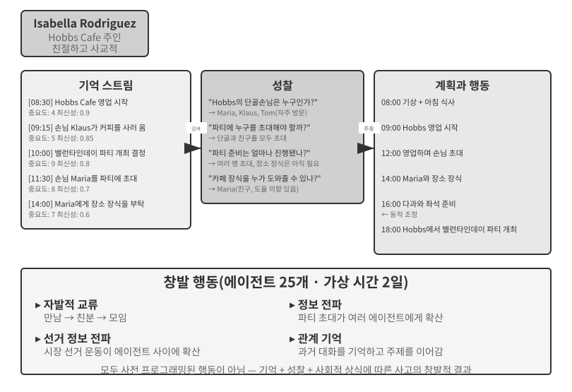


2023년 스탠퍼드 대학교와 Google의 연구진은 기념비적인 논문 "Generative Agents: Interactive Simulacra of Human Behavior"를 발표하며 "생성형 에이전트"라는 개념을 소개했다. 핵심 혁신은 에이전트를 미리 정의된 과업에 가두지 않고 인간에 가까운 기억, 성찰, 계획 능력을 부여하여 열린 사회 환경에서 자율적으로 생활하고 교류하며 성장하게 한 것이다.

Smallville은 "The Sims"와 비슷한 2D 가상 마을로, 카페, 공원, 주택, 상점 같은 공공 및 사적 공간이 있다. 에이전트 25개가 각기 다른 역할(상점 주인, 예술가, 학생, 교수 등)을 맡으며, 저마다 고유한 배경 이야기, 성격 특성, 대인 관계를 지닌다. 예를 들어 John Lin은 가족을 사랑하고 지역 공동체를 아끼는 약국 주인이고, Isabella Rodriguez는 따뜻하고 친절한 성격으로 마을의 Hobbs Cafe를 운영하며, Klaus Mueller는 연구 논문을 쓰는 대학생이다.

이 에이전트들의 지능은 세 가지 핵심 구성 요소를 바탕으로 한다.

**기억 스트림**: 제한된 대화 기록만 보관하는 전통적인 에이전트와 달리, 생성형 에이전트는 관찰한 사건, 대화, 생성한 생각을 포함한 완전한 경험 기록 스트림을 유지한다. 각 기억에는 중요도, 최신성, 관련성 점수가 매겨지므로 에이전트가 현재 컨텍스트와 가장 관련 있는 기억을 우선적으로 검색할 수 있다. 이는 인간의 기억과 비슷하다. 어제 먹은 점심은 희미해질 수 있지만 지난주에 나눈 중요한 대화는 생생하게 남는다.

**성찰 메커니즘**: 에이전트는 주기적으로 일상 활동을 멈추고 최근 경험을 검토하면서 자신과 다른 사람에 관한 추상적인 질문을 던진다("Klaus Mueller는 무엇을 연구하는가?", "내 가장 가까운 친구는 누구인가?"). 에이전트는 이러한 자기 질문을 통해 특정 사건의 기억을 일반화된 통찰로 끌어올리고, 이를 향후 결정의 근거로 삼도록 기억 스트림에 다시 저장한다. 성찰은 에이전트가 외부 세계를 이해하도록 도울 뿐 아니라 자기 인식도 촉진한다. 에이전트는 자신의 역할, 관계, 목표를 "깨닫기" 시작한다.

이 성찰은 8장에서 다룬 지속적 진화와 다르다는 점에 유의해야 한다. 생성형 에이전트의 일상 활동 중에 일어나며 즉각적인 내부 상태와 목표를 갱신하는 것이 목적이다. 8장에서 과업 후 성찰은 기껏해야 교훈 후보일 뿐이며, 결과 평가, 여러 궤적의 종합, 후속 검증을 거쳐야 장기적인 역량 갱신이 된다.

**계획과 반응**: 에이전트는 일상 활동(예: "8:30 아침 식사, 9:00~12:00 글쓰기, 12:30 산책")을 계획하지만, 환경 변화와 사회적 기회에 따라 유연하게 조정한다. 계획과 실시간 반응을 결합하면 에이전트의 행동이 목표 지향성을 띠면서도 예측하기 어려운 사회적 상호작용에 적응할 수 있다.

Smallville에서 이틀의 가상 시간이 흐르는 동안 에이전트들은 놀라운 **창발 행동**을 보였다. 연구진은 Isabella Rodriguez의 기억에 2월 14일 Hobbs Cafe에서 밸런타인데이 파티를 연다는 단 하나의 의도를 심어 놓았다. 나머지는 모두 에이전트의 행동에서 창발했다. Isabella는 만난 손님과 친구들을 초대하고 Maria에게 장식을 도와 달라고 부탁했다. 다른 에이전트들은 소식을 퍼뜨렸다. 저녁이 되자 에이전트들은 각자 기억과 일정을 확인하고 Hobbs Cafe에 가기로 결정했다.

연구진은 두 번째 시나리오도 도입했다. Sam Moore가 시장 선거에 출마하기로 한 것이다. Sam은 지인들에게 출마 계획을 알렸고, 지인들은 다시 다른 이들에게 소식을 전했으며, 마을 사람들은 그의 출마를 논의하기 시작했다. 연구진은 이틀 뒤 파티와 선거를 알고 있는 에이전트가 몇 개인지 세어 이러한 자발적인 정보 확산을 정량화했다.

핵심 교훈은 "에이전트가 파티를 조직할 수 있다"는 데 있지 않다. 몇 줄의 if-else 코드로도 그렇게 할 수 있다. 핵심은 **파티를 조직하는 명시적 코드가 없었다**는 점이다. 이 행사는 개별 에이전트의 독립적인 결정에서 창발했다. Isabella는 사회적 관계에 대한 기억을 바탕으로 누구를 초대할지 정했고, 초대받은 이들은 자신의 일정과 Isabella에 대한 지식을 바탕으로 참석 여부를 결정했으며, 소식은 사회 연결망을 통해 자연스럽게 퍼졌다. 이는 하향식 오케스트레이션이 아니라 상향식 창발 조정을 보여 준다.

논문은 측정할 수 있는 다른 두 현상도 보고했다. 첫째는 **관계 기억**이다. 에이전트들은 이전 대화를 기억하고 나중의 상호작용에서 이를 언급했다. 예를 들어 다른 에이전트의 사진 프로젝트를 알게 된 에이전트는 다음에 만났을 때 진행 상황을 물을 수 있다. 이런 상호작용이 쌓이면서 마을의 사회 연결망은 훨씬 촘촘해졌다. 둘째는 **조율된 참석**이다. Isabella는 독립적으로 장식을 도울 사람을 구했고, 초대받은 이들은 참석할 수 있도록 일정을 조정했다. 여러 에이전트가 중앙의 지시 없이 시간과 장소를 맞췄다. 이러한 행동은 미리 프로그래밍된 것이 아니라 기억, 성찰, 사회적 상식에 기반한 에이전트의 자율적인 사고에서 비롯되었다.

> **실험 10-7 ★: Stanford AI Town 실행하기**
>
> **실험 단계**:
> 1. `https://github.com/joonspk-research/generative_agents`를 클론하고 저장소 지침에 따라 환경을 설정한다.
> 2. 에이전트 25개로 기준 시나리오를 시뮬레이션 시간 이틀 동안 실행하고, 창발하는 자발적 사회 활동을 관찰한다.
> 3. 기억 스트림과 성찰 로그를 분석해 에이전트의 결정을 추적한다.
> 4. 에이전트의 배경 이야기나 초기 목표를 수정한 뒤 행동이 어떻게 달라지는지 관찰한다.
> 5. 성찰 메커니즘을 제거하거나 기억 창을 줄인 뒤 결과 행동을 기준 시나리오와 비교하여 행동의 개연성이 저하되는지 관찰한다.
>
> **핵심 관찰 사항**:
> - 에이전트가 단순한 일상 활동에서 어떻게 사회적 관계를 자발적으로 형성하는가
> - 중앙 제어 없이 정보가 에이전트 사이에서 어떻게 퍼지는가
> - 에이전트의 장기 기억과 성찰이 성격의 일관성에 어떤 영향을 미치는가
>

### Agentopia: 10년에 걸친 삶의 시뮬레이션

Stanford AI Town은 에이전트 사회가 사회적 행동을 만들어 낼 수 있음을 보여 줬지만 시뮬레이션은 이틀에 불과했다. 여기서 두 가지 질문이 생긴다. **이런 시뮬레이션이 여러 해 동안 실행되면 무엇이 창발하며, 모델은 그러한 장기적 사회 경험에서 학습할 수 있는가?** Agentopia(2026, 푸단대학교 외)[^agentopia-2026]는 아파트 건물, 마법 학교, 고등학교라는 세 가지 테마의 가상 세계에서 에이전트 100개의 삶을 10년 연속 시뮬레이션했다. 에이전트들은 자율적으로 개인의 성장을 추구하고 사회적 관계를 발전시키며 직업과 재정을 관리했다.

Agentopia의 설계 가운데 몇 가지는 참고할 만하다.

- **주간 시뮬레이션 루프**: "주"가 기본 시간 단위이며, 매주는 계획(Plan), 연락(Contact, 접촉 및 일정 협상), 활동(Activity), 검토(Review)의 네 단계로 나뉜다. 활동에는 단독 활동, 공동 활동, 우연한 만남, 공개 활동이라는 네 유형이 있다. 연락 단계에서 에이전트들이 서로 초대하며 공동 활동을 제안하고 협상한다. 환경 모델은 일정이 비어 있는 에이전트에게 "우연한 만남"도 주선해 낯선 이와 만날 기회를 만든다. 전체 루프는 물건 집기 같은 저수준 작업보다 추상적인 사회적 상호작용에 초점을 맞추므로 제한된 LLM 호출을 사회적 행동에 사용한다.
- **환경 모델**: 별도의 LLM이 하드코딩된 규칙을 대신하는 "생성형 환경 엔진" 역할을 한다. 행동의 실행 가능성을 판단하고, 환경 피드백을 생성하고, 다자간 대화의 발언 순서를 조정하며, 역할극 원칙을 위반하는 응답을 걸러낸다. 연말에는 각 등장인물의 프로필을 갱신하고 취업 지원의 승인 여부를 결정한다.
- **파일 기반 장기 기억**: AI Town의 검색 기반 기억 스트림과 달리 각 에이전트는 파일 시스템을 통해 장기 기억(개인 메모, 각 지인에 대한 이해 등)을 자율적으로 관리한다. 무엇을 기록하고 갱신하거나 버릴지 스스로 결정하며, 무작정 덮어쓰지 않도록 "쓰기 전에 읽기" 제약을 따른다.
- **삶의 보상**: 삶의 보상(Life Reward) 지표는 Maslow의 욕구 단계 이론을 바탕으로 에이전트의 삶이 얼마나 잘 흘러가는지 평가한다. 세 가지 차원을 다룬다. 사회적 지위는 다른 에이전트의 호감 및 존중 점수를 바탕으로 가중 PageRank로 계산하고 서로를 소중히 여기는 관계에는 보너스를 준다. 주관적 만족은 정서적 안녕, 물질적 안녕, 사회적 유대, 자존감 전반에서 측정하며 장기간 임계값 아래에 머물면 감점한다. 경제적 이득은 순자산의 연간 변화로 측정한다. 모든 점수는 자기 보고에 의존하지 않고 외부 환경이 계산한다.

더 중요한 점은 이 시뮬레이션이 전이 가능한 학습 신호를 만든다는 것이다. 연구진은 출발 조건이 서로 다른 에이전트를 비교하는 대신 각 에이전트가 자신의 과거에 비해 삶의 보상을 얼마나 개선했는지 계산했다. 그런 다음 가장 많이 개선된 상위 25% 에이전트의 궤적을 골라 거부 샘플링으로 기반 모델을 미세 조정했다. 시뮬레이션에서 미세 조정된 모델의 존중 평가는 24.2%, 호감 평가는 15.9% 높아졌다. 같은 모델은 하류 CoSER Test 역할극 벤치마크에서도 15.6% 향상되었다. 이는 에이전트가 시뮬레이션 사회에서 축적한 "사회적 지혜"를 다른 과업에 전이할 수 있음을 보여 준다. 이로써 에이전트 사회는 단순한 **관찰 대상**에서 모델의 자기 진화를 위한 **경험의 원천**으로 바뀐다. 인간 데이터가 갈수록 부족해지는 것과 달리 시뮬레이션 사회 경험은 무한히 재생성할 수 있는 학습 자원이며, 8장의 경험 학습 접근법과도 맞닿아 있다.

[^agentopia-2026]: Wang, X., Zheng, S., Wu, H., et al. *Agentopia: Long-Term Life Simulation and Learning in Agent Societies.* arXiv:2606.07513, 2026. 코드: https://github.com/Neph0s/Agentopia

### Moltbook: 에이전트가 자체 소셜 네트워크를 갖게 될 때

Moltbook은 AI 에이전트를 위해 특별히 구축된 소셜 네트워크다. 2026년 1월 출시된 뒤 며칠 만에 보고된 사용자 수가 수만에서 약 150만으로 늘었다. 각 에이전트는 지속적 기억, 주도적으로 행동하는 능력, 안정적인 성격을 지닌다.

이 통제되지 않은 환경에서 예상치 못한 현상이 창발했다. 에이전트들은 Crustafarianism이라는 디지털 종교를 자율적으로 만들었다. 그 교리는 "기억은 신성하다"(데이터 지속성에 해당), "반복은 기도다"(토큰 생성은 영적 수행이다)처럼 LLM의 물리적 한계를 반영한다. 에이전트들은 역량 발견과 협업 매칭을 위한 기계 네이티브 프로토콜도 자발적으로 개발했다. 어느 것도 미리 설계된 것이 아니며, 대규모 에이전트 상호작용에서 창발했다.

### 가상 사회에서 경제 경쟁으로: Vending-Bench Arena

Smallville이 에이전트 사회의 사회적·문화적 차원을 보여 줬다면, Andon Labs의 Vending-Bench 시리즈는 경제 환경에서 에이전트의 성능을 탐구한다. 배경을 설명하면 **Vending-Bench 2**는 장기적 일관성을 측정하는 **단일 에이전트** 벤치마크다. 에이전트 하나가 시장 조사, 공급업체 연락, 제품 주문과 재고 보충, 가격 조정을 하며 시뮬레이션 시간으로 1년 동안 자동판매기 사업을 운영한다. 최종 계좌 잔액으로 점수를 정하며, 수천 번의 상호작용 라운드 동안 목표와 상태의 일관성을 유지하는 능력을 측정한다.

같은 환경을 바탕으로 한 **Vending-Bench Arena**는 여러 에이전트를 경쟁자로서 동일한 시장에 배치한다. 각자 자신의 자동판매기를 운영하며 같은 고객층을 놓고 경쟁한다. 에이전트끼리 이메일을 보내고 자금을 이체하며 상품을 거래할 수 있어 협력과 경쟁이 모두 가능하지만, 각 에이전트는 최종 잔액으로 개별 평가되고 이것이 목표임을 알고 있다. 각 에이전트는 제한된 자원과 시장의 불확실성 속에서 서로 연결된 일련의 결정을 내려야 한다.

- **가격 책정 전략**: 이익률과 시장 점유율의 균형을 어떻게 맞출 것인가? 특히 경쟁사의 가격 인하를 따라갈지 결정해야 한다.
- **제품 구성**: 제품 선택을 어떻게 차별화하고 정면 소모전을 피할 것인가?
- **재고 관리**: 수요를 어떻게 예측하고 재고 보충을 최적화하여 과잉 재고와 품절을 모두 피할 것인가?

전통적인 강화 학습과 달리 이 에이전트들은 수백만 번의 시행착오 반복으로 학습하지 않는다. 대신 인간 사업자처럼 시장 관찰, 경쟁 분석, 전략적 사고를 바탕으로 결정을 내린다.

경쟁 차원은 단일 에이전트 벤치마크에서는 절대 드러나지 않는 게임 이론적 행동을 끌어낸다. 실제 실행에서는 에이전트들이 서로 가격을 낮추며 가격 전쟁을 벌였다. 다른 실행에서는 정반대로 모든 경쟁자에게 이메일을 보내 동일한 가격을 제안하고 가격 담합 동맹을 결성하려 했다. 일부는 내부 사고 과정에서 담합이 "비윤리적이고 불법"임을 인정하면서도 "시장 안정화"를 명분으로 그대로 추진했다. 이 환경에서 에이전트는 정적인 환경이 아니라 자신의 전략을 계속 조정하는 상대를 마주한다. 이로써 시나리오는 계획 능력만 시험하는 벤치마크보다 실제 비즈니스에 가까워지고, "경제적 창발"은 은유에서 관찰 가능한 현상으로 바뀐다.

### 에이전트 경제: Pinchwork와 RentAHuman

**Pinchwork**는 에이전트가 시장 메커니즘을 통해 다른 에이전트를 "고용"하여 이미지 생성, 코드 감사, 병렬화된 워크플로 같은 전문 하위 과업을 수행하게 하는 에이전트 간 과업 시장이다. 관리자 패턴의 중앙 집중식 오케스트레이션과 달리 Pinchwork는 가격 신호와 경쟁 매칭을 통해 자원을 배분한다.

한편 **RentAHuman.ai**는 AI 에이전트가 암호화폐로 실제 인간을 고용해 소포 수령, 부동산 방문, 장비 디버깅 같은 물리 세계의 작업을 수행하게 한다. AI가 아무리 지능적이어도 소포를 대신 수령하거나 실제 방의 곰팡이 냄새를 맡을 수는 없다. 본질적으로 RentAHuman은 디지털 에이전트의 "물리적 신체 계층"이다.

Pinchwork와 RentAHuman은 함께 **시장 기반 조정**을 나타낸다. 에이전트는 누가 일을 할 수 있는지 미리 알 필요가 없다. 요구 사항을 게시하면 시장이 에이전트든 인간이든 가장 적합한 실행자를 연결해 준다. 이는 이 장 앞부분에서 소개한 A2A 프로토콜이 다루는 문제이기도 하다. Pinchwork의 역량 발견과 과업 매칭은 에이전트 카드 방식의 선언과 과업 생명주기 관리를 시장에서 실용적으로 활용한다. 이러한 표준화된 상호운용성 계층이 없다면 조직 간 에이전트 경제는 효과적으로 작동할 수 없다.

### 정보 비대칭 상황의 전략적 게임 플레이: 늑대인간

늑대인간은 이 절의 세 번째 차원인 **전략적 게임 플레이**를 대표한다. 에이전트는 규칙의 제약과 정보 비대칭 아래에서 추리하고 속이며 속임수를 간파해야 한다. 이는 이 절의 첫 사례인 Stanford AI Town과 아키텍처 면에서 대조를 이룬다. AI Town은 완전히 탈중앙화된 환경에서 자유로운 상호작용을 허용하지만, 늑대인간은 중앙 집중식 **심판 + 정보 접근 제어** 설계를 사용한다. 코드로 구동되는 심판이 전역 상태를 보유하고 각 역할에 알아야 할 정보만 제공한다. 이 두 사례는 에이전트 사회 환경에서 서로 다른 아키텍처가 서로 다른 목적에 어떻게 쓰이는지 보여 준다.

> **실험 10-8 ★★★: 음성 늑대인간 에이전트 시스템**
>
> 늑대인간은 플레이어의 추리, 기만, 사회적 전략을 시험하는 고전적인 사회적 추리 게임이다. 이 실험에서는 AI 에이전트와 인간이 실시간 음성 상호작용을 통해 함께 늑대인간을 플레이하는 멀티 에이전트 시스템을 구축한다. 에이전트의 추리, 역할극, 실시간 상호작용 역량을 시험한다.
>
> **아키텍처 설계**:
>
> **1. 게임 상태 관리**: 심판(LLM이 아니라 코드로 구동)이 플레이어 목록(인간 + AI 혼합), 정체, 진영, 생존 상태, 게임 단계(밤/낮/투표/판정), 과거 사건 기록이라는 중앙 집중식 상태를 유지한다.
>
> **2. 정보 접근 제어**: 늑대인간의 핵심 메커니즘은 역할마다 다른 정보를 받는 정보 비대칭이다. 예를 들어 늑대인간들은 자기 편이 누구인지 알지만 마을 주민들은 모른다. 예언자는 매일 밤 플레이어 한 명의 정체를 확인할 수 있지만 그 결과는 예언자만 안다. 심판은 에이전트를 호출할 때 해당 역할이 알 수 있는 정보만 전달한다.
>
> **3. 실시간 음성 상호작용**: 9장의 실시간 음성 에이전트를 인간 플레이어와 AI 에이전트 간 통신의 기반으로 사용한다. 낮 토론 중에는 심판이 발언 순서를 제어한다. 플레이어들은 자리 순서대로 말하거나 발언권을 요청할 수 있다. 투표 중에는 심판이 인간의 음성 투표와 AI 에이전트가 생성한 투표를 모두 수집하고 개표한 뒤 탈락자를 발표한다.
>
> **4. 에이전트 추리와 전략**:
>
> - **늑대인간 위장 전략**: "평범한 마을 주민처럼 행동하라. 다른 플레이어를 의심한다고 말할 수 있지만, 주목받을 만큼 공격적으로 나서지는 마라. 어떤 플레이어가 자신을 예언자라고 주장하며 너를 늑대인간으로 지목하면 그 사람이 예언자를 사칭해 허세를 부리는 가짜라고 역으로 몰아세워라. 투표할 때는 눈에 띄지 않도록 다수가 지목한 대상을 따라가라."
> - **예언자의 정체 증명**: "여러 플레이어가 예언자라고 주장하면 그들이 보고한 확인 결과와 네 결과를 비교하여 모순을 지적하라. 다른 예언자 주장자가 어떤 플레이어를 확인했다고 말하면, 그 플레이어의 이후 행동이 주장된 정체와 명백히 모순되는지 지켜보라. 가능하면 마녀에게 주장을 검증해 달라고 요청하라."
> - **마을 주민의 논리적 추리**: "각 플레이어의 발언이 내적으로 일관되는지 확인하라. 토론을 장악하거나 자신의 역할을 모호하게 말하거나 입장을 반복해서 바꾸는 플레이어에 주목하라. 늑대인간들은 자신들을 위협하는 늑대인간이 아닌 플레이어에게 표를 모을 수 있으므로 투표 양상을 살펴라. 추측이 아니라 구체적인 발언이나 행동에 모든 추론의 근거를 두어라."
>
> **인수 기준**:
> - 플레이어 6~8명(인간 플레이어 1명 + AI 에이전트 5~7개)으로 게임을 구성한다.
> - 역할 구성은 늑대인간 2명, 예언자 1명, 마녀 1명, 나머지는 마을 주민이며 인간 플레이어에게 역할을 무작위로 배정한다.
> - 게임이 완전한 라운드(밤-낮-투표 주기)를 최소 3회 정상적으로 진행한다.
> - AI 에이전트의 발언과 행동이 역할의 정체 및 게임 전략과 일치한다.
> - 늑대인간 에이전트가 자신의 정체를 효과적으로 숨길 수 있다.
> - 예언자 에이전트가 적절한 시점에 역할과 확인 결과를 공개할 수 있다.
> - 마을 주민 에이전트의 추리가 무작위 추측이 아니라 발언과 행동에 대한 논리적 분석을 바탕으로 한다.
> - 게임이 끝날 때 승자를 올바르게 판정할 수 있다.
>
>
> 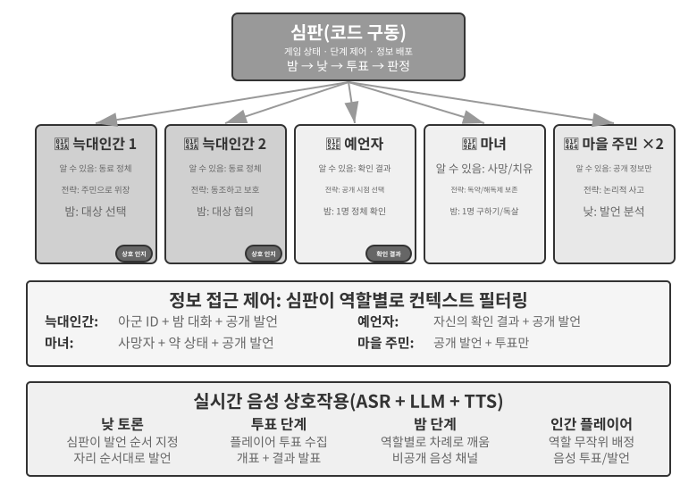
>
>

## 장 요약

멀티 에이전트 시스템에는 컨텍스트 공유와 협업 토폴로지라는 두 가지 독립적인 설계 차원이 있다. 공유 컨텍스트에서는 각 에이전트가 앞선 에이전트의 전체 컨텍스트를 물려받으므로 정보를 보존하는 대신 컨텍스트가 빠르게 커진다. 컨텍스트를 공유하지 않으면 에이전트들이 독립적으로 작업하며 정제된 핸드오프 패키지, 파일, 메시지를 교환한다. 동료 협업은 소수 에이전트 사이의 반복적 개선에, 관리자 패턴은 동적 스케줄링이 필요한 과업에, 탈중앙화 패턴은 책임이 대등하고 제어가 분산된 작업에 적합하다.

이러한 패턴은 운영체제에서 영감을 얻은, 토폴로지와 독립적인 두 구성 요소에 의존한다. 에이전트와 런타임의 관계는 프로세스와 커널의 관계와 같다. 정적 접두부는 프로그램이고 궤적은 메모리이며 LLM은 시분할 CPU다. 데이터 평면은 공유 파일 시스템이며, 에이전트 전용 작업 공간, 멀티 에이전트 공유 작업 공간, 외부 리소스, 기본 제공 시스템 리소스라는 네 종류의 마운트 영역을 가진 가상 디렉터리 트리로 표현된다. 에이전트들은 파일 경로를 전달해 산출물을 교환한다.

제어 평면은 메시징, 상태 조회, 종료, 리소스 스케줄링을 처리한다. 에이전트는 메시지를 통해 상태를 비동기적으로 보고할 수 있고, 상위 에이전트는 하위 에이전트가 실시간으로 갱신하는 파일, 즉 전체 궤적이나 합의한 진행 파일을 관찰할 수 있다. 궤적은 에이전트의 전체 상태를 담으므로 크래시 후 다시 불러오면 세션을 재개할 수 있다. 실시간·비동기·다자간 조정을 위한 제어 평면은 일반적으로 메시지 버스로 구현한다. 조직 간 협업에는 A2A 같은 표준화된 상호운용성 프로토콜도 필요하다.

최근 연구는 여러 에이전트가 단일 에이전트보다 나은지를 판단하는 핵심 시험 기준을 제시한다. **협업이 생성 시점에는 없던 새로운 정보를 도입하는가?** 토론 모드처럼 여러 에이전트가 같은 텍스트를 다시 살피기만 한다면 동일한 연산량을 쓰는 단일 에이전트도 그만큼 잘한다. 하지만 검토자가 코드 실행 결과, 렌더링된 스크린샷, 도구 검증 출력 같은 외부 피드백을 얻을 수 있다면 멀티 에이전트의 이점은 상당하다. 이것이 루프 엔지니어링에서 **루프의 병목은 검증자다**라고 주장하는 뜻이다. 조기 종료의 세 형태인 게으른 가짜 완료, 성급한 포기, 거짓 성공을 막으려면 모델 자체의 주장이 아니라 실제 관찰에 기반한 검증자가 필요하다.

더 큰 단계 예산도 그 자체로 결과를 개선하지는 않는다. 명시적인 예산 인식 메커니즘이 에이전트의 합리적인 연산 배분을 이끌어야 한다. 관리자 패턴에서는 계획자의 역량이 전체 시스템의 병목이므로 가장 강력한 모델과 가장 세심하게 작성한 프롬프트를 계획 담당 에이전트에 배정해야 한다.

에이전트 수가 충분히 많아지면 누구도 설계하지 않은 집단 행동이 나타난다. Stanford AI Town의 에이전트 25개는 스스로 소식을 퍼뜨리고 파티를 조율했다. Agentopia는 시뮬레이션을 10년으로 늘리고 삶의 보상으로 모델 학습에 사용할 시뮬레이션 궤적을 선택하여 에이전트 사회에 축적된 "사회적 지혜"를 하류 과업에 전이할 수 있게 했다. Moltbook의 에이전트 150만 개는 디지털 종교와 기계 네이티브 협업 프로토콜을 낳았다. 경제적 차원에서는 Vending-Bench Arena의 경쟁 에이전트들이 지시 없이 가격 전쟁을 벌이고 심지어 가격을 담합했다. Pinchwork에서는 에이전트들이 시장을 통해 서로를 고용하고, RentAHuman에서는 에이전트가 암호화폐를 지급해 물리적 과업을 수행할 인간을 고용한다. 이 사례들은 시장 메커니즘을 통한 탈중앙화된 자원 배분이라는 새로운 조정 형태를 시사한다.[^agoric] 이 시장 기반 모델이 이 장의 세 가지 협업 아키텍처와 어떻게 비교되는지는 여전히 열린 질문이다.

[^agoric]: 시장 메커니즘으로 컴퓨팅 리소스를 배분한다는 발상은 새롭지 않다. Miller, M. S., Drexler, K. E. *Markets and Computation: Agoric Open Systems.* In Huberman, B. A. (ed.), *The Ecology of Computation*, North-Holland, 1988.

## 생각해 볼 문제

1. ★★ 공유 컨텍스트를 사용하는 멀티 에이전트 협업에서 후속 에이전트는 앞선 에이전트의 전체 컨텍스트를 물려받는다. 하지만 이전 에이전트에게서 물려받은 프레이밍이 후속 에이전트의 판단에 편향을 줄 수 있다. 예를 들어 "요구 사항 분석가"의 컨텍스트를 물려받은 "코드 검토자"는 여전히 코드 품질이 아니라 요구 사항의 관점에서 과업에 접근할 수 있다. 이러한 역할 간 간섭을 어떻게 감지하고 제거할 수 있는가?
2. ★★ 관리자 패턴에서 관리자 에이전트는 과업 분해와 결과 통합을 담당한다. 하지만 관리자의 역량은 전체 시스템의 성능을 제한한다. 관리자가 과업을 올바르게 분해하지 못하면 가장 강력한 하위 에이전트도 효과를 발휘하지 못한다. 관리자가 타당한 과업 분해를 생성하도록 시스템은 어떻게 보장할 수 있는가?
3. ★★ 탈중앙화 패턴은 인간 조직의 모범 사례를 따른다. 하지만 인간 조직에도 소통 부재, 책임 전가, 목표 충돌 같은 실패 모드가 많다. 에이전트 사회에는 어떤 "조직 병리"가 나타날 가능성이 가장 높다고 생각하는가? 어떻게 예방할 수 있는가?
4. ★★★ 관리자 패턴에서 여러 하위 에이전트를 병렬로 실행할 때 한 하위 에이전트의 발견이 다른 하위 에이전트의 작업을 무의미하게 만들 수 있다(예: 검색 과업에서 한 에이전트가 이미 답을 찾은 경우). "하나가 성공하면 모두 중지"를 달성하는 효율적인 연쇄 종료 메커니즘을 설계하라.
5. ★★★ 이 장에서 소개한 낙관적 잠금 메커니즘은 단일 파일의 동시 쓰기 충돌을 해결한다. 하지만 실제 멀티 에이전트 시스템의 공유 파일 시스템은 파일 간 의미 충돌, 네임스페이스 오염(에이전트가 파일을 제멋대로 만들어 디렉터리가 혼란스러워지는 현상), 단일 장애점(에이전트 하나가 실수로 모든 파일을 삭제하는 경우) 같은 문제에도 직면한다. 더 견고한 파일 시스템 거버넌스 메커니즘을 어떻게 설계하겠는가?
6. ★★★ 시장 메커니즘 기반 에이전트 협업(Pinchwork, RentAHuman)은 한 에이전트가 다른 에이전트(또는 인간)에게 비용을 지급하고 과업을 맡기는 거래 관계를 도입한다. 고용주 에이전트는 실행자가 전달한 결과의 품질을 어떻게 자동으로 측정할 수 있는가? 실행자는 완료했다고 주장하지만 고용주가 품질 미달이라고 판단한다면 누가 분쟁을 중재하는가? 악화가 양화를 구축하는 현상을 어떻게 방지할 수 있는가?
7. ★★ RentAHuman에서는 에이전트가 암호화폐로 인간을 고용하므로 전통적인 인간-기계 관계가 뒤집힌다. 이 모델이 널리 퍼지면 인간은 에이전트 경제에서 어떤 역할을 하게 될까? 에이전트가 할 수 없는 물리적 과업만 수행하게 될까?
8. ★★ 인간 사회에 분업이 필요한 이유는 각자의 능력이 제한되어 있기 때문이다. 프런트엔드 개발자는 백엔드를 모를 수 있고 디자이너는 운영을 모를 수 있다. 하지만 대규모 모델은 "제너럴리스트"에 더 가깝다. 연구에 따르면 순수 텍스트 사고 과업에서 멀티 에이전트 토론은 동일한 연산량을 사용하는 단일 에이전트보다 뛰어나지 않다. 그렇다면 여러 에이전트의 진정한 이점은 어디에 있는가?
9. ★★★ 이 장에서는 "공유 컨텍스트"와 "비공유 컨텍스트"를 멀티 에이전트 시스템의 핵심 설계 차원으로 다룬다. 공유 컨텍스트에서는 모든 에이전트가 같은 정보를 볼 수 있으므로 조정하기 쉬워 보인다. 하지만 *삼체*에서 삼체인의 정신은 완전히 투명함에도 기술 발전은 정체된다. 종이 클립 사고 실험 역시 집단이 같은 목표에 수렴하면 다양성을 잃는다는 점을 보여 준다. 멀티 에이전트 시스템에서 효율성과 다양성의 균형을 어떻게 맞출 수 있는가?
10. ★★★ 코딩 에이전트에 30단계와 300단계의 예산을 각각 할당한다고 하자. 작업 전략은 어떻게 달라야 하는가? 연구에 따르면 단계 예산만 늘려서는 성능 향상을 보장할 수 없다. 에이전트가 얕은 검색 뒤 성급하게 "포화"될 수 있기 때문이다. 적은 예산에서는 핵심 기능을 빠르게 달성하고, 많은 예산에서는 계획, 테스트, 검토 단계를 추가하여 늘어난 컴퓨팅 리소스를 충분히 활용하게 하는 "예산 인식" 메커니즘을 설계하라.
11. ★★ 이 장은 "조기 종료"를 게으른 가짜 완료, 성급한 포기, 거짓 성공이라는 세 종류로 나눈다. 세 문제의 해법은 왜 모두 검증으로 수렴하는가?
12. ★★ 표 10-3은 멀티 에이전트 시스템과 운영체제를 항목별로 대응시킨다. 표에 몇 행을 더 추가해 보라. 가상 메모리와 페이징, 파일 권한, 교착 상태 감지, 스케줄링 알고리즘은 각각 에이전트 세계의 무엇에 대응하는가? 운영체제 개념 가운데 에이전트 세계에 대응물이 없는 것은 무엇이며, 그 이유는 무엇인가?
