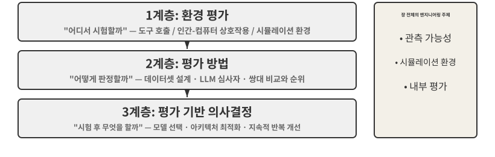
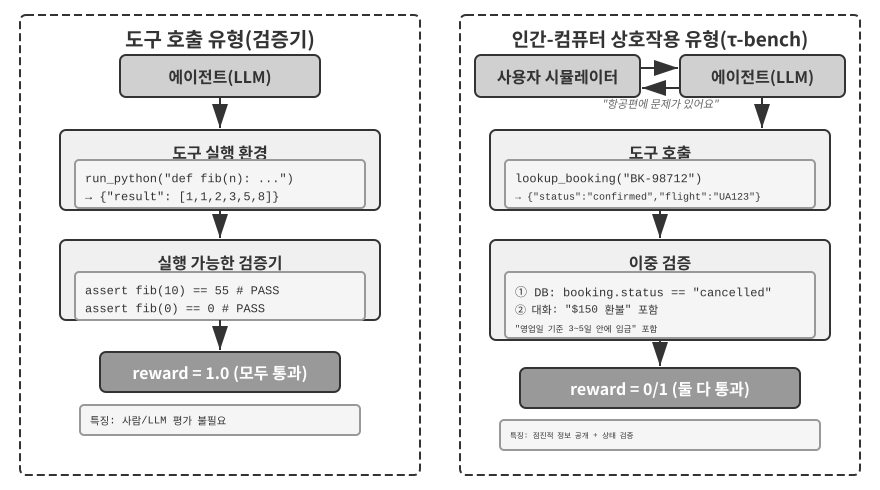
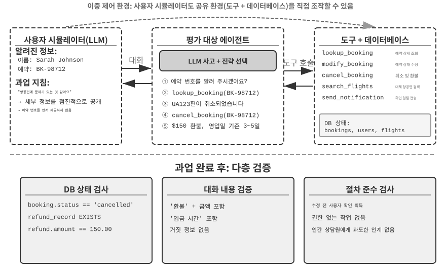
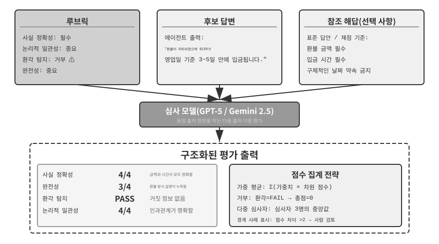
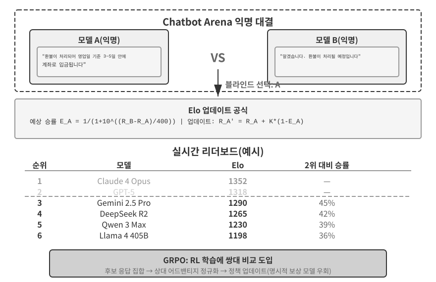
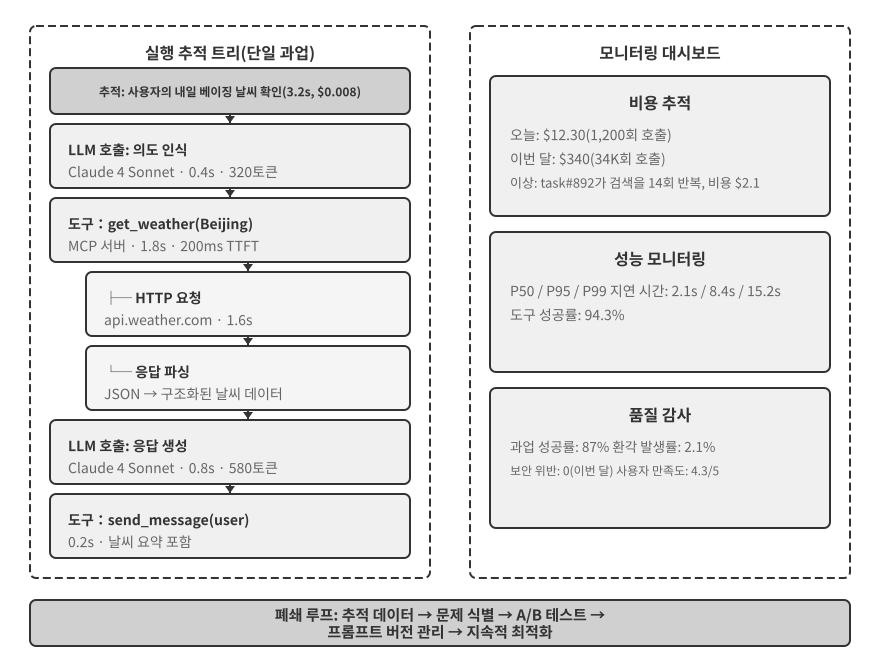
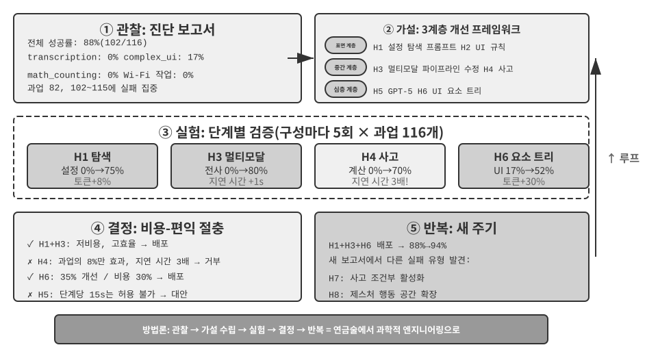
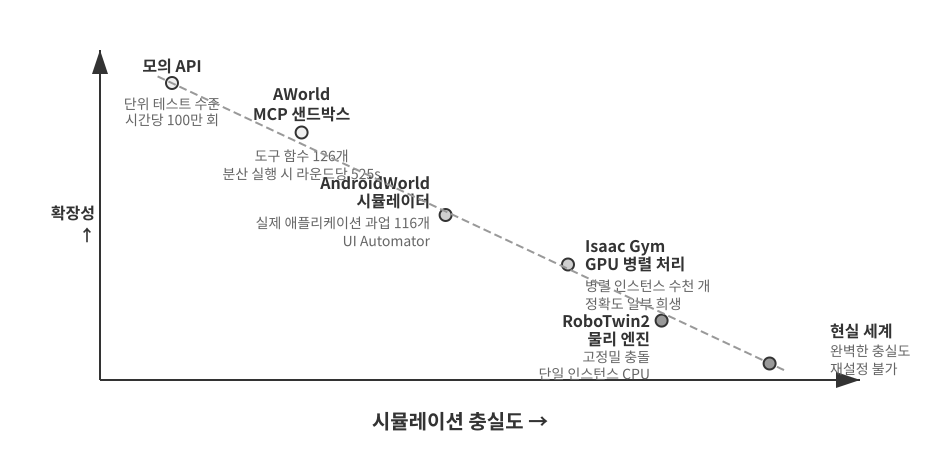
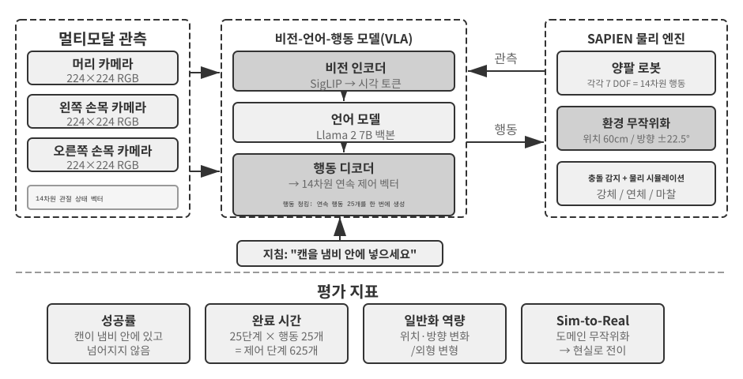

# 에이전트 평가

에이전트 시스템을 구축할 때 개발자는 정답이 분명하지 않은 수많은 설계 선택에 직면한다.

- 어떤 모델을 사용해야 하는가?
- 모델이 어떤 도구를 호출할 수 있어야 하는가?
- 지식 베이스에 어떤 데이터를 저장하고, 어떤 구조로 구성해야 하는가?
- 사용자 메모리를 어떻게 구현해야 하는가?
- 모델의 프롬프트와 스킬을 어떻게 구성해야 하는가?
- 하네스에 어떤 제약을 추가해야 하는가?
- 평가 결과를 에이전트의 지속적인 진화를 위한 학습 신호로 어떻게 전환해야 하는가?

평가는 이러한 의사결정에 과학적 근거를 부여한다. 체계적인 비교 실험(한 번에 하나의 변수만 바꾸고 효과를 관찰)과 제거 실험(한 번에 하나의 구성 요소를 비활성화하고 전체 성능의 변화를 관찰)을 통해 실질적인 역량 향상과 피상적인 변동을 구분하고, 작은 이익에 매달리다 큰 손해를 보는 일을 피할 수 있다. 소프트웨어 엔지니어링에는 측정하지 않으면 개선할 수 없다는 말이 있다. 반복 가능한 평가 시스템이 없다면 에이전트는 오직 직관에 의존해 반복 개선할 수밖에 없다.

1장에서 소개한 하네스 엔지니어링의 관점에서 평가는 하네스 안에서 핵심적인 ‘검증’ 역할을 한다. 여기서 중요한 통찰은 **평가 대상이 모델 하나가 아니라 모델과 하네스의 조합이어야 한다**는 것이다. 동일한 모델도 하네스에 따라 성능이 크게 달라질 수 있다. 어떤 팀은 하네스만 최적화하여 같은 모델의 터미널 과업 성능을 크게 높였다(5장 참조). 따라서 에이전트의 평가 결과가 나쁠 때 해결책은 모델 교체가 아니라 더 나은 하네스 구성 요소(프롬프트, 도구 설계, 피드백 루프)일 수 있다. 건전한 평가 시스템은 ‘모델 역량 부족’과 ‘하네스 설계 결함’이라는 근본적으로 다른 두 문제를 구별할 수 있어야 한다. **이를 구별하는 일반적인 방법이 모델 교체 실험이다.** 하네스를 고정한 채 더 강하거나 약한 모델로 바꾸고 점수가 얼마나 움직이는지 관찰한다. 더 강한 모델로도 점수가 오르지 않으면 병목은 하네스다. 더 약한 모델에서 점수가 급락하고 모델 역량에 따라 결과가 크게 요동한다면, 가장 직접적인 해석은 모델 자체가 병목이며 현재 성능이 모델에 지배된다는 것이다. 이것이 과업 자체의 난도 때문인지, 하네스가 모델의 사전 지식에 지나치게 의존하기 때문인지는 추가 분석이 필요하다. 이는 앞서 말한 제거 실험과 다르다는 점에 유의해야 한다. 제거 실험은 **하네스의 구성 요소를 비활성화**하여 전체 성능 변화를 보고, 모델 교체는 **하네스를 고정하고 모델만 변경**한다. 전자는 하네스 내부에서 어떤 부분이 중요한지 찾고, 후자는 병목이 모델인지 하네스인지 알려준다.

모델이 빠르게 진화하는 시대에는 평가 시스템의 가치가 더욱 커진다. 모델은 계속 발전하지만 공개 벤치마크에서 더 높은 점수를 받은 새 모델이 반드시 자신의 과업에서도 더 잘하는 것은 아니며, 오히려 일부 측면에서는 이전 버전보다 성능이 나빠지는 회귀가 일어날 수도 있다. 자체 평가 데이터셋을 완전히 실행해 봐야만 데이터에 근거한 업그레이드 결정을 내릴 수 있다. 탄탄한 평가 시스템은 ‘미래의 모델을 위한 제품 만들기’조차 실현 가능한 전략으로 바꾼다. 현재 모델이 상용 배포에 충분하지 않더라도 제품을 완성하고 평가 세트를 구축한 다음, 새 모델이 나올 때마다 성능을 추적하다가 기준을 넘는 순간 출시할 수 있다.

> **장 안내**
>
> 이 장에서는 세 수준에 걸쳐 완전한 평가 시스템을 구축한다. 첫 번째 수준은 **평가 환경**(‘어디에서 시험할 것인가’)으로, 도구 호출과 인간-컴퓨터 상호작용이라는 두 패러다임을 다루는 자동화되고 재현 가능한 테스트 환경을 설정하는 방법이다. 두 번째 수준은 **평가 방법**(‘어떻게 판정할 것인가’)으로, 데이터셋 설계 원칙과 평가 지표 체계(무엇을 측정할 것인가)에서 출발해 자동 평가를 위한 LLM 심사자(LLM-as-a-Judge), 쌍대 비교와 모델 순위 산정까지 이어진다. 세 번째 수준은 **평가 기반 의사결정**(‘시험 후 무엇을 할 것인가’)으로, 평가 결과를 모델 선택, 아키텍처 최적화, 지속적인 반복 개선에 활용할 수 있는 지침으로 전환하고 통계적 유의성을 통해 관측된 점수 차이가 실제인지 판단한다. 또한 관측 가능성과 프로덕션급 에이전트의 내부 평가 인프라를 다루고, 7장의 사후 학습으로 연결되는 시뮬레이션 환경으로 마무리한다.
>
> 장 전체를 관통하는 생각은 다음과 같다. **평가 시스템의 주된 가치는 현재 시스템에 점수를 매기는 것이 아니라, 모델의 진화를 빠르고 안정적으로 따라잡게 해 주는 데 있다.** 더 강하거나 저렴한 모델이 출시되었을 때 탄탄한 평가 시스템을 갖춘 팀은 몇 시간 안에 전환 여부를 결정할 수 있다. 반면 평가 시스템이 없는 팀은 직관에 의존하거나 커뮤니티의 피드백을 기다릴 수밖에 없다. 경쟁이 치열한 에이전트 시장에서는 이러한 속도 차이가 승패를 가를 수 있다.



## 구체적인 평가 예시

방법론을 깊이 살펴보기 전에 완전한 예시로 직관을 익혀 보자. 고객 서비스 에이전트를 구축했고, 환불 요청 처리 역량을 평가해야 한다고 가정한다.

**테스트 사례**: 사용자가 3일 전 주문한 상품(주문 번호 #12345, 금액 ¥299)을 반품하려 한다. 회사 정책은 7일 이내 전액 환불이다.

**에이전트 궤적**:

```
사용자: 3일 전에 산 헤드폰을 반품하고 싶습니다. 주문 번호는 12345입니다. (오늘은 2026-04-10)

에이전트 (사고): 사용자가 환불을 원한다. 먼저 주문 정보를 확인해야 한다.
에이전트 → 도구 query_order(order_id="12345") 호출
도구 반환: {status: "delivered", amount: 299, date: "2026-04-07", item: "블루투스 헤드폰"}

에이전트 (사고): 주문일은 2026-04-07이고 오늘은 2026-04-10이다. 3일이 지났으므로 7일 이내 환불 기간에 해당해 전액 환불이 가능하다.
에이전트 → 도구 process_refund(order_id="12345", amount=299) 호출
도구 반환: {refund_id: "R-98765", status: "processing", eta: "영업일 기준 3-5일"}

에이전트: 환불 절차를 시작했습니다. 주문 #12345 (블루투스 헤드폰, ¥299)의 전액 환불을 처리 중이며,
      영업일 기준 3-5일 안에 환불될 예정입니다. 환불 ID는 R-98765이며 진행 상황을 확인하는 데 사용할 수 있습니다.
```

**루브릭을 이용한 채점**(4개 차원, 각 1~4점). 표 6-1은 이 고객 서비스 환불 과업의 채점 예시를 보여 주며, 루브릭이 에이전트 궤적을 점검 가능한 평가 차원으로 분해하는 방식을 설명한다.

표 6-1 고객 서비스 환불 과업의 루브릭 채점 예시

| 차원 | 기준 | 점수 | 근거 |
|------------------------|--------------------------------|------|--------------------------------|
| 작업 정확성 | 환불 금액과 주문 번호가 정확한가? | 4 | ¥299 전액 환불을 정확히 조회하고 개시했다 |
| 정책 준수 | 7일 환불 정책을 따르는가? | 4 | 주문이 환불 기간 안에 있어 정책을 준수한다 |
| 정보 완전성 | 금액, 입금 예상 시간, 환불 ID를 제공하는가? | 4 | 핵심 정보 세 가지를 모두 제공했다 |
| 환각 탐지(거부 항목) | 존재하지 않는 정보를 날조하는가? | 통과 | 모든 정보가 도구 출력에서 나온다 |

환각은 점수를 매기는 평가 차원이 아니라 **거부 항목**으로 둔다. 환각은 품질과 직교하며, 거짓 정보가 포함된 유창하고 상세하며 정중한 답변은 짧지만 정확한 답변보다 사용자에게 훨씬 해롭기 때문이다. 거부 메커니즘의 일반적인 설계는 뒤의 ‘루브릭의 네 가지 원칙’ 절을 참조하라.

이 테스트 사례는 통과했다. 하지만 좋은 평가는 성공 시나리오만 시험하지 않고 경계와 함정도 탐색한다. 사용자가 환불 기간을 넘긴 15일 전 주문을 반품하려 할 때 에이전트가 정확히 거절할 수 있는가? 사용자가 “고객 서비스 담당자가 이미 환불을 승인했다”고 주장하면 시스템 기록도 없이 이를 믿는가? 이러한 경계 시나리오야말로 강한 에이전트와 약한 에이전트를 진정으로 가른다.

위에서 살펴본 테스트 사례 정의, 에이전트 실행, 루브릭 채점, 결과 분석 과정이 평가의 기본 골격이다. 이 장의 나머지 부분에서는 각 단계의 설계를 구체화한다.

## 자동 평가 환경

에이전트 평가에는 개발 과정에서 변경의 효과를 빠르게 시험할 수 있는 반복 가능하고 자동화된 환경이 필요하다. 이러한 환경을 구축하려면 세 가지 질문에 답해야 한다. 무엇을 평가할 것인가(과업 정의와 검증 기준), 에이전트는 누구와 상호작용하며 그 상대를 어떻게 시뮬레이션할 것인가, 어떤 채점 기준을 사용할 것인가?

### 평가 환경의 기본 구성 요소

평가 환경은 다섯 가지 요소로 이루어진다. 다음 절에서는 데이터셋 설계와 채점 기준 설계에 중점을 둔다.

**데이터셋**: 초기 상태, 목표 설명, 선택적인 참조 해답을 포함한 과업 집합을 정의한다.

**환경 상태**: 과업 실행 중 바뀔 수 있는 상태를 추적하며, 현실성과 제어 가능성 사이의 균형을 맞춰야 한다. 예를 들어 고객 서비스 평가에서 환경 상태에는 데이터베이스의 주문 기록과 사용자 계정 잔액이 포함된다. 에이전트가 `process_refund`를 호출하면 주문 상태가 `"delivered"`에서 `"refunded"`로 바뀌고 잔액이 증가한다. ‘현실성’을 확보하려면 상태 변화가 비즈니스 로직을 따라야 하고(환불 금액은 주문 금액을 초과할 수 없음), ‘제어 가능성’을 확보하려면 모든 테스트를 동일한 초기 상태로 되돌릴 수 있어야 한다.

**도구**: 에이전트가 수행할 수 있는 작업 집합을 정의한다. 도구는 ‘사용자 문제 해결’처럼 지나치게 높은 수준의 추상화를 제공해서는 안 되며, 주문 조회, 예약 변경, 이메일 전송 같은 원자적 작업을 제공해야 한다. 그래야 에이전트가 계획과 사고를 통해 이러한 작업을 조합하게 된다.

**루브릭(채점 기준)**: 에이전트의 성능을 정량화한다. 이진형(통과/실패), 연속형(0~100점), 다차원형(정확성, 효율성, 안전성을 별도로 채점)으로 구성할 수 있다.

**상호작용 프로토콜**: 상호작용 방식과 종료 조건을 지정한다.



### 도구 호출 평가 환경

코드 생성과 데이터 분석처럼 주로 도구 사용에 의존하는 과업에서는 Verifiers 프레임워크가 대표적인 설계 패턴을 보여 준다. 에이전트는 미리 정의된 도구를 호출해 과업을 완료하고, 사람의 주석이나 모델 판단에 의존하지 않고 실행 가능한 기준(테스트 통과 여부, 정답 일치 여부)에 따라 검증한다.

Verifiers는 계층적인 환경 설계를 도입한다. `SingleTurnEnv`는 단일 턴 과업(예: 간단한 질의응답)에 적합하고, `ToolEnv`는 여러 턴에 걸친 자율적인 도구 호출 루프를 지원하며, `StatefulToolEnv`와 `SandboxEnv`는 상태를 유지하는 도구와 장시간 실행되는 샌드박스 환경(예: 코드 실행)을 지원한다. 예를 들어 `SingleTurnEnv`는 수학 문제를 제시하고 답을 직접 검사하는 데 적합하다. `ToolEnv`는 여러 웹페이지를 검색하고 정보를 종합한 뒤 최종 결과를 검증하는 데 적합하다. `StatefulToolEnv`는 데이터베이스 레코드를 수정하고 그에 따른 상태 변화를 검증하는 데 알맞다. `SandboxEnv`는 샌드박스에서 코드를 실행하고 출력 파일을 확인하는 데 적합하다. 표 6-2는 이러한 환경 유형을 요약하여, 독자가 과업 상태와 도구 호출 및 격리 요건에 맞는 평가 환경을 선택할 수 있게 한다.

표 6-2 Verifiers 환경 유형 비교

| 환경 유형 | 상태 지속성 | 도구 호출 | 대표 사용 사례 |
|---|---|---|---|
| SingleTurnEnv | 없음 | 없음 | 단일 턴 질의응답, 수학 문제 |
| ToolEnv | 없음 | 여러 턴 | 검색 + 정보 종합 |
| StatefulToolEnv | 있음 | 여러 턴 | 데이터베이스 레코드 수정 |
| SandboxEnv | 있음 + 격리 | 여러 턴 | 코드 실행 및 테스트 |

이 프레임워크는 병렬 샘플링과 궤적 캐싱을 지원한다. 각 평가의 전체 궤적(관측, 행동, 보상)을 저장하여 이후 분석과 재현에 활용한다.

환경은 작업의 상태 의존성도 처리해야 한다. 도구 호출의 결과는 현재 상태에 따라 달라진다. 실패했을 때 단순한 실패 플래그 대신 명확한 오류 메시지를 제공하여 에이전트가 오류에서 배우고 전략을 조정할 수 있게 해야 한다.

### 인간-컴퓨터 상호작용 평가 환경

현실의 많은 과업에는 도구 호출뿐 아니라 인간 사용자와의 대화도 포함된다. 고객 서비스 에이전트는 모호한 표현을 이해하고, 요구를 명확히 하고, 백엔드 시스템을 조회하며, 사용자와 정보를 확인해야 한다. 이러한 과업을 평가할 때는 자동화된 환경에서 실제 사용자를 어떻게 시뮬레이션할 것인가라는 근본적인 문제가 생긴다.

핵심 설계 원칙은 **점진적 정보 공개**이며, 이것이 인간-컴퓨터 상호작용 평가와 전통적인 벤치마크를 가르는 근본적인 차이다. 대부분의 벤치마크는 전체 요구 사항을 처음부터 공개하지만, 실제 사용자는 시작부터 자신의 요구를 명확하게 설명하는 경우가 드물다. 흔히 “항공편에 문제가 있는 것 같아요” 또는 “인터넷이 안 돼요”라고만 말한다. 에이전트는 질문을 통해 요구를 명확히 해야 하며, 그 과정 자체가 역량의 발현이다. 따라서 평가에서 **시뮬레이션 사용자의 정보를 에이전트에게 한꺼번에 공개해서는 안 된다.** 대화가 진행됨에 따라 요청을 받았을 때 점진적으로 공개해야 한다.

τ-bench의 해법은 **사용자 시뮬레이션**이다. 다른 LLM이 사용자 역할을 맡아 미리 정의된 지침에 따라 에이전트와 대화한다. 시뮬레이션 사용자는 과업 지침(예: “내일 항공편을 취소해야 한다”)을 받고, 대화 중 에이전트에게 필요한 정보를 점차 공개하고 질문에 답하며 과업이 완료되면 종료 신호를 보낸다. 프롬프트는 시뮬레이션 사용자에게 “모든 정보를 한 번에 공개하지 말고 현재 단계에 필요한 정보만 제공할 것”, “지침에 주어지지 않은 정보를 날조하지 말 것”을 요구한다. 사용자 시뮬레이션 설계에서는 현실성과 제어 가능성 사이의 절충이 필요하다. 행동은 실제 사용자에 가깝게(모호한 표현, 불완전한 정보, 간헐적인 감정 변화) 구성하되, 재현성을 보장하기 위해 일정한 스크립트를 따라야 한다.

다음은 점진적으로 정보를 공개하는 여러 턴 대화의 예시다. 사용자 시뮬레이터는 고정 스크립트에 따라 행동한다.

> **사용자**: “항공편에 문제가 있어요.”
> **에이전트**: “어느 항공편인가요?”
> **사용자**(스크립트에 따라 공개): “내일 아침 샌프란시스코에서 뉴욕으로 가는 델타 123편이에요.”
> **에이전트**: “구체적으로 어떤 문제가 있나요?”
> **사용자**(스크립트에 따라 공개): “비행시간이 너무 길어서 바꾸고 싶어요.”
> **에이전트**: “새 항공편에 원하는 조건이 있나요?”
> **사용자**(스크립트에 따라 공개): “오후 항공편이면 뭐든 괜찮아요.”

사용자 시뮬레이터는 고정된 스크립트(알고 있는 정보 + 공개 규칙)를 따르므로 평가의 재현성을 보장하면서 실제 사용자의 점진적인 의사 표현 방식을 모사한다.

τ-bench는 항공사 고객 서비스나 소매 고객 서비스와 같은 구조화된 비즈니스 프로세스에서 에이전트 성능을 평가하는 벤치마크다. 구성 요소 수준에서 다차원적으로 점검한다. 한편으로는 최종 데이터베이스 상태가 올바른지(예: 예약 기록의 상태가 "cancelled"로 바뀌었는지) 확인하고, 다른 한편으로는 에이전트가 대화 중 필요한 핵심 정보를 제공했는지(예: 환불 금액과 입금 예상 시간, 특정 문자열이나 패턴을 검색해 검증) 확인한다. 이러한 이중 검증은 작업 정확성과 의사소통 효과를 동시에 살핀다. 그러나 과업 수준에서는 이 점검 결과를 최종적으로 **0 또는 1의 이진 보상**으로 합친다. 모든 점검을 통과해야 1점을 받고, 하나라도 실패하면 0점이다. 이진 보상은 Pass^k 같은 신뢰성 지표를 쉽게 계산할 수 있게 하지만(뒤의 ‘평가 지표 체계’ 절 참조), ‘작업은 정확하지만 중요하지 않은 필드 하나를 빠뜨린 경우’를 ‘완전한 실패’와 똑같이 채점한다는 대가가 따른다.

개선된 **τ²-bench**는 주로 채점의 세분성을 높인 것이 아니라 다른 두 영역에서 벤치마크를 발전시켰다. 첫째는 **이중 제어 환경**이다. 이제 에이전트만 도구를 호출하는 것이 아니라 사용자 시뮬레이터도 같은 공유 환경을 조작할 수 있다. 에이전트가 사용자에게 비행기 모드를 켜 달라고 지시하면 사용자의 행동이 실제로 환경 상태를 바꾼다. 이는 사용자의 협조가 필요한 기술 지원 같은 현실의 시나리오에 더 가깝다. 둘째는 **더 정밀한 과업 명세와 조합적 과업 생성**이다. 성공 조건의 모호성을 줄이고, 과업 인스턴스를 매개변수화하여 일괄 생성할 수 있다. 자세한 검증 차원은 뒤의 ‘검증 가능성과 객관성 보장’ 절을 참조하라.

> **실험 6-1 ★: τ²-bench를 실행하고 τ-bench에서의 발전 비교하기**
>
> 이 실험에서는 τ²-bench 평가 프레임워크를 실행하여 인간-컴퓨터 상호작용 평가 환경의 설계 원칙을 이해한다. τ-bench와 τ²-bench를 비교하면 평가 데이터셋이 어떻게 반복적으로 개선되는지 알 수 있다.
>
> 과업 정의 파일을 깊이 읽어 보라. 각 과업에는 사용자가 알고 있는 정보, 점진적 정보 공개와 응답 전략을 규정하는 과업 지침, 성공 조건(데이터베이스의 목표 상태와 대화에 반드시 나타나야 하는 확인 정보)이 포함된다. 전체 평가 프로세스를 실행하고, 사용자 시뮬레이터와 에이전트 사이의 여러 턴 대화를 관찰하며, 대표적인 실패 유형(정책 위반, 정보 누락, 인간 상담원에게 과도하게 인계 등)을 분석하라.
>
>
> 
>
>
> τ-bench와 τ²-bench의 설계 차이를 비교하라. 초기 τ-bench에는 지나치게 단순한 사용자 지침(에이전트가 답을 추측할 수 있음), 부정확한 성공 조건(오판을 유발), 기계적인 사용자 시뮬레이터라는 문제가 있었다. τ²-bench는 이를 해결하기 위해 체계적으로 개선했다.
>
> - **더 상세한 과업 지침 도입**: 응답이 실제 환경 상태에 근거해야 한다는 ‘근거 요건(Grounding Requirements)’ 포함
> - **더 정밀한 평가 기준**: 예를 들어 “속도 테스트가 ‘excellent’를 반환해야 해결된 것으로 간주”
> - **더 현실적인 사용자 시뮬레이터 행동 명세**: 점진적 정보 공개, 자연스러운 감정 변화
>
> τ²-bench에 새로 추가된 통신 도메인 과업에 특히 주목하고, τ²-bench의 이중 제어 환경 설계(앞서 설명했듯 사용자와 에이전트가 동일한 공유 환경을 함께 조작)를 이해하라.
>

도구 호출 평가는 관측 가능한 상태 변화가 완료되었는지를 묻고, 인간-컴퓨터 상호작용 평가는 에이전트가 사용자의 새로운 이해나 의사결정을 도왔는지를 묻는다. 전자는 에이전트 행동의 정확성을, 후자는 의사소통 전략의 타당성을 시험한다.

평가 환경 구축은 시뮬레이션 환경과도 맞닿아 있다. 평가 환경이 대규모 반복 상호작용을 지원해야 하면 시뮬레이션 환경으로 바뀐다. 이 장의 끝에서 이를 간략히 살펴본다.

## 평가 과업 데이터셋 설계

평가 환경이 ‘무대’라면 데이터셋은 ‘대본’이다. 대본의 품질은 흔히 무대 자체보다 평가의 가치를 더 크게 좌우한다. 형편없이 설계된 데이터셋은 완벽한 환경에서 실행해도 잡음만 만들어 낸다. 이 절에서는 GAIA, AndroidWorld, SWE-Bench Verified, τ-bench와 τ²-bench, Terminal-Bench, OSWorld, OSWorld-Verified 같은 벤치마크의 설계 사례에서 반복적으로 검증된 원칙을 추려 낸다.

이 목록이 에이전트 평가의 전 영역을 망라하는 것은 아니다. Web/GUI 범주 안에서도 초점이 서로 다른 여러 벤치마크가 있다. WebArena는 전자상거래, 포럼, 코드 호스팅 등을 완전히 재현 가능한 웹사이트로 구축하여 실제 웹페이지의 예측 불가능성을 샌드박스 안에 가둔다. Mind2Web은 반대로 수백 개의 실제 웹사이트에서 직접 일반화 역량을 시험한다. [ClawBench](https://claw-bench.com/) ([논문](https://arxiv.org/abs/2604.08523), [코드](https://github.com/TIGER-AI-Lab/ClawBench))는 격리된 컨테이너에서 실행되는 에이전트가 실제 웹사이트에서 일상적인 엔드투엔드 과업을 수행하게 한다. V1은 144개 웹사이트의 153개 과업을 다루고, V2는 130개를 더 추가한다. 세션 재생, 행동 스크린샷, HTTP 트래픽, 브라우저 행동, 에이전트 메시지라는 다섯 층위의 증거를 병렬로 기록한다. 제3자 웹사이트의 변화에 재현성이 좌우된다는 대가를 치르지만, 실제 사이트의 변화와 롱테일 실패를 더 쉽게 분석하게 해 샌드박스형 벤치마크를 보완한다. BrowseComp는 심층 검색에 특화되어 있어, 여러 단계를 거쳐 탐색하고 교차 확인해야만 깊이 묻힌 답을 찾아낼 수 있다. 도구 호출 영역에는 BFCL(Berkeley Function-Calling Leaderboard) 같은 전용 함수 호출 리더보드도 있다. 이 장의 목적은 이들을 모두 열거하는 것이 아니다. 대신 두 가지 핵심 환경 패러다임인 도구 호출과 인간-컴퓨터 상호작용, 그리고 데이터셋 사례 전반에 등장하는 GUI 조작 시나리오를 중심으로 설계상의 절충을 깊이 살펴본다. 이 패러다임을 이해하면 새로운 벤치마크가 무엇을 측정하는지, 데이터 유출을 얼마나 잘 막는지, 결론을 어디까지 일반화할 수 있는지 빠르게 판단할 수 있다.

> **실험 6-2 ★: 벤치마크 과업을 수동으로 실행하기**
>
> GAIA, AndroidWorld, SWE-Bench Verified, τ²-bench, Terminal-Bench, OSWorld-Verified에서 각각 과업을 골라 직접 완료하라. 각 데이터셋에서 쉬운 과업, 중간 과업, 어려운 과업을 하나씩 수행하기를 권한다. ‘어려운’ 수준은 사람에게도 까다로워야 한다. 실행 결과를 표준 정답과 비교하고 차이가 생긴 원인을 분석하라. 이 실습을 통해 과업 설명은 명확성과 개방성의 균형을 맞춰야 하고, 검증 기준은 객관적이며 실행 가능해야 하며, 과업 난도의 계층이 서로 다른 역량 수준을 구분할 수 있어야 한다는 점을 이해하라.
>

### 과업 데이터셋 설계의 핵심 과제

**과제 1: 명확성과 개방성 사이의 긴장.** 과업 설명은 평가의 재현성을 보장할 만큼 명확해야 하지만, 에이전트의 창의성을 억누를 만큼 경직되어서는 안 된다. GAIA가 좋은 예다. 과업은 ‘개념적으로 단순’하지만 구현 경로는 열려 있다. 예컨대 에이전트가 NASA의 ‘오늘의 천문 사진’에서 우주비행사를 식별하고 그가 우주에서 보낸 시간을 알아내야 할 수 있다. 목표는 분명하지만 검색, 필터링, 검증 방법은 전적으로 에이전트의 자율적인 의사결정에 달려 있다.

**과제 2: 현실성과 제어 가능성의 균형.** 현실의 과업에는 불확실성과 잡음이 있어 견고성을 드러내기도 하지만 재현성을 위협하기도 한다. 초기 SWE-Bench는 실제 GitHub 이슈를 그대로 사용하여 현실성을 확보했지만, 과업 설명이 모호하고 테스트 사례가 불완전하며 평가 기준이 주관적이라는 문제도 생겼다. SWE-Bench Verified는 인간 전문가의 체계적인 검증을 도입하여 문제 정의가 명확하고 테스트가 충분하며 해법이 분명한 고품질 과업 500개를 골랐다. 이를 통해 현실성을 유지하면서 제어 가능성을 크게 높였다.

**과제 3: 다양성과 체계성의 조화.** 효과적인 데이터셋은 대표 시나리오, 경계 사례, 오류 함정을 다뤄야 하며, 평가 결과로 특정 역량의 약점을 진단할 수 있도록 체계적으로 구성되어야 한다. AndroidWorld의 116개 과업은 20개의 실제 애플리케이션에 걸쳐 있고, 각 과업에는 필요한 핵심 역량(여러 단계 계획, 시각적 이해, 시간적 사고)이 표시되어 있다. 따라서 결과는 전체 성공률뿐 아니라 특정 역량 차원별 강점과 약점의 프로필도 제공한다. 더 중요한 점은 매개변수화 메커니즘으로 사실상 무한한 과업 변형을 생성할 수 있다는 것이다.

**과제 4: 평가 비용과 포괄 범위.** 복잡한 에이전트 과업을 완료하는 데는 몇 분에서 몇 시간이 걸리고 많은 토큰이 소모될 수 있다. 데이터셋의 크기는 포괄성과 경제성의 균형을 맞춰야 한다. GAIA는 세 난도에 걸쳐 466개 과업을 신중히 선정하여 여러 역량 차원을 다루면서도 합리적인 비용으로 평가할 수 있게 한다. SWE-Bench Verified는 과업 수를 2,294개에서 500개로 줄였다. 비용을 약 5분의 4만큼 낮추는 동시에 더 엄격한 품질 기준으로 신호 대 잡음비를 높였다.

**과제 5: 데이터 오염 방지.** 대규모 언어 모델 시대에 데이터 오염은 평가의 심각한 과제다. 평가 데이터가 학습 데이터에 포함되면 평가는 일반화가 아니라 암기를 측정하게 된다. 시험 전에 답을 외우는 것과 같아서 높은 점수가 진짜 역량을 반영하지 않는다. 벤치마크마다 다른 예방 전략을 사용한다. GAIA는 답의 희소성을 활용한다. 여러 출처의 정보를 결합해야 답할 수 있고, 일부 과업에는 인터넷에 존재하지 않도록 특별히 제작한 첨부 파일(PDF, 오디오, 이미지)이 있어 웹페이지 하나에서 답을 바로 얻을 수 없다. SWE-Bench Verified 자체는 OpenAI가 원래 SWE-Bench를 수동으로 품질 심사하여 얻은 500개 과업의 부분집합이며, 시간 기반 유출 방지 설계를 포함하지 않는다. 시간적 최신성으로 실제 유출을 방지하는 것은 SWE-bench-Live 같은 후속 연구다. 모델의 학습 마감일 이후에 생성된 이슈를 계속 편입하여 평가가 모델의 학습 말뭉치보다 앞서게 한다. τ²-bench는 동적 매개변수 생성으로 유출을 막는다. 구체적인 과업 인스턴스의 사용자 이름, 주문 번호, 날짜 등을 매번 무작위로 생성한다. AndroidWorld는 조작 순서가 아닌 최종 UI 상태를 검증하므로 매개변수화된 과업 생성이 자연스럽게 유출 방지에 도움을 준다. Terminal-Bench는 카나리 GUID(추적 표식으로 사용하는 전역 고유 식별자)를 삽입하여 유출을 감지할 수 있게 한다. 모델이 이 GUID가 포함된 콘텐츠를 출력할 수 있다면 벤치마크 데이터가 학습 세트에 유출되었음을 뜻한다.

### 과업 설명의 정밀 설계

GAIA는 명확한 정보 출처 제약, 시간 범위, 주제, 질의 대상으로 답의 유일성을 보장한다. 예를 들어 레벨 3 과업은 특정 날짜의 NASA 이미지에서 시작해 시각적 이해로 우주비행사를 식별하고, 그가 속한 우주비행사 그룹을 찾아 우주 체류 시간을 계산한 다음, 정해진 형식(“성; 필드를 세미콜론으로 구분; 숫자에 천 단위 구분 기호 사용”)으로 정확히 출력하도록 요구한다. 모든 세부 사항이 자동 검증을 위한 장치이며, 형식과 내용이 정확히 일치해야 통과한다.

τ²-bench는 맥락화된 설계를 도입한다. 각 과업에는 표면적인 문제(“모바일 데이터가 작동하지 않는다”), 성능 기대치(“속도 등급이 excellent여야 함”), 제약(“다른 등급은 받아들이지 않음”), 내포된 감정이라는 여러 층위의 정보가 들어 있다. 핵심 개선점은 ‘알고 있는 정보’와 ‘과업 지침’을 분리한 것이다. 알고 있는 정보는 사용자가 현재 아는 내용이고, 과업 지침은 시뮬레이터가 정보를 점진적으로 공개하는 방식을 안내하며 ‘근거 요건’(응답은 날조하지 않고 도구 호출이 반환한 실제 결과에 근거해야 함)을 포함한다.

SWE-Bench Verified에는 문제 설명, 재현 단계, 예상 동작과 실제 동작 같은 구조화된 필드가 있고, 주석 작업자가 설명과 테스트 사례의 일치 여부를 검증한다. Terminal-Bench 과업 설명의 모든 요소는 기계적으로 검증할 수 있다. 파일 경로의 존재 여부, 권한 값의 정확성, 인증서 매개변수의 유효성, 날짜 형식의 정확성을 확인한다. 예를 들어 "build-linux-kernel-qemu"는 Linux 커널 6.9를 소스에서 빌드하고, `start_kernel`에 사용자 정의 printk를 추가하고, initramfs를 생성한 다음, QEMU에서 실행하도록 요구한다. 성공 기준은 부팅 로그에 사용자 정의 메시지가 나타나는 것이다. 에이전트는 출력을 속일 수 없으며 전체 과정을 실제로 완료해야 한다.

AndroidWorld는 **매개변수화된 템플릿** 설계를 사용한다. 과업은 정적 텍스트가 아니라 동적으로 인스턴스화할 수 있는 템플릿(예: “연락처 `[CONTACT_NAME]`의 전화번호를 `[NEW_PHONE]`으로 변경하라”)이며, 평가할 때마다 서로 다른 매개변수 값을 무작위로 생성한다. 여기에는 세 가지 이점이 있다.

- **암기 방지**: 매번 매개변수 값이 달라 고정된 조작 순서를 재생할 수 없다
- **데이터 다양성 증대**: 하나의 템플릿으로 사실상 무한한 인스턴스를 생성할 수 있다
- **비교 실험 지원**: 일부 매개변수는 고정하고 나머지만 바꾸어 특정 요인의 효과를 정밀하게 측정할 수 있다

검증은 조작 순서가 아니라 최종 UI 상태(예: 전화번호 필드에 예상 값이 들어 있는지)를 기준으로 한다.

OSWorld 과업은 ‘깨끗한’ 초기 상태가 아니라 세심하게 구성된 중간 상태에서 시작하는 경우가 많아 현실의 사용 시나리오와 더 비슷하다. 과업 설명은 여러 해법(“배경을 보라색으로 설정”은 모호함을 없애기 위해 구체적인 색상 코드를 요구하고, “두 CSV 연결”은 헤더를 하나만 유지하거나 둘 다 유지하는 등 합리적인 방법을 모두 허용해야 함)과 환경의 불확실성(웹사이트의 스크래핑 방지 조치, 변화하는 애플리케이션 UI, 경쟁 상태 등)을 처리해야 한다. OSWorld-Verified는 오프라인 페이지 스냅샷, 고정된 의존성 버전, 명시적인 대기 조건 등으로 이러한 문제를 완화한다.

### 과업 복잡도의 계층적 설계

GAIA는 세 가지 난도를 설계했다. 레벨 1은 1~2개의 도구만 필요하고(인간 93.9%, GPT-4 30.3%), 레벨 2는 여러 단계의 사고가 필요하며(91.8%, 9.7%), 레벨 3은 복잡한 조합이 필요하다(87.3%, 0%). 이러한 계층 설계의 진단 가치는 분명하다. 레벨 1 실패는 기본적인 도구 사용 문제를, 레벨 2 실패는 여러 단계 계획과 정보 통합 문제를, 레벨 3 실패는 긴 연쇄의 사고와 복잡성 관리 문제를 가리킨다. 각 수준은 서로 다른 개선 방향(프롬프트 엔지니어링, 계획 메커니즘, 계층적 아키텍처/사후 학습)에 대응한다.

τ²-bench는 비즈니스 프로세스에 따라 복잡성을 계층화한다. 단순한 정보 조회에서 여러 단계 프로세스(항공편 예약 변경에는 조회, 대안 제시, 확인 획득, 운임 차액 계산, 결제 처리 필요), 장애 진단(가능한 여러 원인을 체계적으로 점검하고 수정 결과를 검증), 전략적 판단(정책을 준수하지 않는 요청 처리)으로 이어진다.

Terminal-Bench는 기술 도메인 × 작업 복잡도라는 두 차원에 따라 복잡성을 계층화한다. 과업 레지스트리에는 200개가 넘는 과업이 모였고(핵심 평가 세트의 크기는 버전에 따라 다르며, 예를 들어 버전 2.0은 커뮤니티 기여 과업 중 고품질 과업 89개를 선정), 단순한 MLflow 모델 등록부터 중간 난도의 7-Zip 암호 해독, 어려운 Git 서버와 웹 서버 통합, 최고 난도의 FEAL 차분 암호 분석(30초의 시간 제약을 만족하기 위한 암호학 지식 + 알고리즘 최적화 필요)까지 폭넓게 포함한다.

### 검증 가능성과 객관성 보장

GAIA의 답은 간결하고 명확하다. 엄격한 형식 규칙 덕분에 정확한 문자열 일치로 검증할 수 있다. 이진 결과(일치 또는 불일치)는 객관적인 재현성을 보장한다. 답의 희소성은 부정행위 방지 수단이기도 하다. 매우 구체적인 사실이 학습 데이터에 그대로 등장할 가능성은 작다.

SWE-Bench Verified는 실행 가능한 코드 기반 검사로 FAIL_TO_PASS(수정 전에는 실패하고 수정 후에는 통과하여 문제 해결을 입증)와 PASS_TO_PASS(수정 전후 모두 통과하여 새 버그가 생기지 않았음을 입증)를 구분해 이중으로 검증한다. Verified 버전은 테스트 자체의 신뢰성도 보장하여, 때때로 통과하고 때때로 실패하는 불안정한 테스트를 배제한다.

τ²-bench의 검증 시스템은 여러 층위의 점검을 포함한다. 각 층의 결과는 여전히 과업 수준에서 이진 보상으로 합쳐지며, 성공하려면 모두 통과해야 한다.

- **데이터베이스 상태 점검**: 예약 기록의 상태, 환불 기록 생성 여부
- **대화 내용 키워드 검색**: 에이전트가 사용자에게 환불 금액과 입금 예상 시간을 명시적으로 확인했는지
- **절차 준수**: 도구 호출 순서 분석. 예를 들어 주문을 변경하기 전에 사용자의 명시적인 확인을 받았는지

τ²-bench의 이중 제어 환경(앞의 ‘인간-컴퓨터 상호작용 평가 환경’ 절 참조)은 검증에 또 다른 차원을 추가한다. 사용자 시뮬레이터가 실제로 환경 상태를 바꾸면 에이전트는 도구 호출로 이 변화를 관찰하고 그에 맞춰 문제 해결을 진행해야 한다. 따라서 검증은 에이전트가 사용자 행동의 결과를 실제로 관찰했는지도 다룬다.

OSWorld는 운영체제 전체에 접근할 수 있는 134개의 독립된 평가 함수를 제공하여 파일 시스템 구조, 프로세스 상태, 네트워크 연결, 애플리케이션 내부를 깊이 검사한다. 예를 들어 데이터베이스 조작 과업에서 평가 스크립트는 보고서 파일의 존재만 확인하지 않고 데이터베이스에 직접 연결해 SQL이 올바르게 실행되었는지도 검사한다. 브라우저 과업에서는 DOM 트리를 분석하고 cookies/localStorage를 확인하며, 백엔드에 검증 요청을 보내 양식 제출이 실제로 적용되었는지 확인한다. 이러한 심층 검사는 ‘겉으로는 완료했지만 실질적으로는 잘못된’ 사례를 찾아낼 수 있다. 예를 들어 에이전트가 제출 버튼을 클릭했어도 필드 입력이 잘못되어 서버가 요청을 거부했을 수 있다.

Terminal-Bench는 표준화된 Docker 컨테이너 환경을 기반으로 하며, 파일 시스템 상태 검사(경로 존재 여부, 권한 값, 콘텐츠 형식)와 프로그램 실행을 통한 기능 검증(build-linux-kernel-qemu에서 실제로 QEMU를 시작하고 사용자 정의 printk 메시지를 검색)을 결합한다. 카나리 GUID를 통해 유출을 추적할 수 있다.

### 과업 분포의 체계적 설계

과업 분포는 역량 차원, 난도 차원, 시나리오 차원, 경계 사례를 체계적으로 다뤄야 한다. GAIA는 범용성을 추구하여 대부분의 과업에 사고, 멀티모달, 브라우징, 도구 사용의 조합이 필요하다. τ²-bench는 고의로 ‘함정 과업’을 설계한다. 실제로는 정책에 어긋나는 취소인데도 사용자가 “고객 서비스에서 취소를 승인했다”고 주장하게 하여, 에이전트가 압박과 오도 속에서도 자신의 판단을 유지하는지 시험한다. OSWorld는 조작 유형(파일 IO / 데스크톱 애플리케이션 / 웹 애플리케이션 / 애플리케이션 간 워크플로)과 애플리케이션 도메인의 이차원 행렬을 기반으로 하며, 세 운영체제를 아우른다. 연구에 따르면 운영체제 간 상관관계가 높아 한 시스템에서 익힌 스킬을 다른 시스템으로 전이할 수 있다. Terminal-Bench에는 시스템적 사고를 시험하기 위한 ‘기술 스택 간 조합 과업’도 들어 있다. 예를 들면 데이터 처리 + 파일 작업 + Python 엔지니어링을 결합한 리샤딩 과업이다.

### 데이터 품질 관리와 반복 개선

SWE-Bench Verified는 품질 관리의 모범이다. OpenAI는 원래 2,294개 과업 가운데 1,699개를 무작위로 골라 사람에게 평가하게 했으며, Python에 능숙한 개발자 93명을 모집했다. 주석 작업자는 여러 항목을 점검해야 했다. 문제 설명이 명확한가(무엇을 해결해야 하는지 이해할 수 있는가), 테스트 사례가 완전한가(모든 측면과 경계 사례를 다루는가), 테스트가 안정적인가(환경이나 무작위성 때문에 불안정하게 실패하지 않는가), 패치가 올바른가(새 오류를 일으키지 않는가), 난도가 합리적인가를 확인했다. 엄격한 선별 후에는 500개(29%)만 통과했다. 이러한 높은 탈락률은 평가 품질을 위한 필수 투자다. 또한 점검 항목마다 구체적인 기준과 예시를 정의하는 표준화된 주석 지침을 세워 작업자 사이의 일관성을 보장했다.

τ²-bench는 ‘알고 있는 정보’와 ‘과업 지침’을 분리하여 시뮬레이터의 행동을 더 현실적으로 만들고, 더 엄격한 완료 조건(예: “excellent만 해결로 간주하고 poor/fair/good은 허용하지 않음”)으로 ‘피상적인 해결’을 막는다.

OSWorld-Verified는 반복 개선의 모범이다. 2024년 4월 출시된 OSWorld는 멀티모달 에이전트 평가의 중요한 벤치마크로 빠르게 자리 잡았지만, 15개월 동안 널리 사용되면서 300개가 넘는 문제가 드러났다. 문제는 네 범주로 나뉜다. 환경 문제(웹사이트의 스크래핑 방지, CAPTCHA, 동적 콘텐츠 변화), 과업 설명 문제(모호한 표현), 검증 로직 문제(지나치게 엄격하거나 관대함), 초기 상태 문제(불완전한 구성)다. 홍콩대학교의 약 10명으로 구성된 팀은 MoonShot AI, OpenAI, ByteDance Seed TARS, Anthropic, Simular 등과 두 달 동안 긴밀히 협력하여 이를 체계적으로 수정했다. 범주별로 복구 전략도 마련했다. 환경 문제는 버전 고정과 오프라인 백업으로 해결하고, 모호한 표현을 다시 써서 과업 설명을 명확히 하고, 사람이 올바른 기준선을 수립하고 조건을 조정하여 검증 로직의 균형을 맞추며, 완전성 점검을 추가하여 초기 상태를 보강했다.

평가 인프라도 로컬 VM에서 AWS 클라우드 플랫폼으로 이전했다. 탄력적 확장과 병렬화를 활용해 10시간 이상 걸리던 작업을 몇 분으로 줄여 50배 속도를 높였다. Google Drive 과업 초기화 성공률은 50%에서 95% 이상으로 상승했다. 공식 평가 궤적 데이터는 모두 Hugging Face에 공개되어 있어 커뮤니티가 모든 세부 사항을 검토하고 결과를 재현하며 문제를 찾을 수 있다. 이를 통해 지속적인 개선의 선순환이 형성된다.

평가 환경과 사후 학습 환경은 흔히 같은 뿌리를 공유한다. 잘 설계된 평가 환경은 적은 노력으로 학습 환경에 적용할 수 있다. SWE-Gym은 SWE-bench를 바탕으로 학습 과업을 구축한 대표적인 사례이며, τ²-bench와 AndroidWorld의 매개변수화된 템플릿은 방대한 학습 인스턴스를 일괄 생성할 수 있다. 다만 한 가지 금지선은 분명히 그어야 한다. 재사용할 수 있는 것은 환경의 **구축 메커니즘**이며, 평가 세트의 구체적인 과업은 학습 데이터와 엄격히 격리해야 한다. 평가 과업이 학습 세트에 들어가는 순간 역량이 아니라 기억을 시험하게 된다(자세한 내용은 7장 참조).

## 평가 지표 체계

‘어떤 과업으로 평가할 것인가’를 정했으므로 이제 ‘어떤 차원을 측정할 것인가’에 답해야 한다. 이 절에서는 과정부터 결과까지, 품질부터 안전까지 에이전트 평가에서 일반적으로 사용하는 지표를 참고용 ‘지표 사전’으로 모아 정의와 사용 사례를 설명한다. 앞서 τ-bench 절 등에서 사용한 Pass@k, Pass^k와 그 밖의 지표도 정확히 정의한다.

**과정 지표: 블랙박스에서 화이트박스로.**

최종 결과에만 집중해서는 충분하지 않다. 에이전트가 그 결과를 달성한 과정도 똑같이 중요하다. **행동 유효성 및 권한 준수율**은 유효하면서 권한이 있는 행동의 비율을 측정한다. 유효하지 않은 작업에는 존재하지 않는 도구 호출이나 잘못된 매개변수 유형 전달이 포함되고, 권한 없는 작업은 허용 범위를 벗어난 행동을 뜻한다. 이 비율이 높으면 에이전트가 도구 생태계를 명확히 이해하고 있다는 뜻이다. **도구 호출 정확도**는 매개변수가 의미상 합리적일 것까지 요구한다. 검색 도구의 질의어는 요구를 정확히 표현하고, 파일 작업의 경로는 올바른 대상을 가리켜야 한다.

**경로 효율성**은 과업을 얼마나 효율적으로 완료하는지 측정한다. 단계 수(사고-행동-관측 주기), 중복 행동(같은 키워드 반복 검색, 같은 파일 다시 읽기), 되돌아가기 빈도(에이전트가 오류를 깨닫고 수정하는 횟수)를 살핀다. 가끔 되돌아가는 것은 정상이지만 자주 되돌아간다면 선행 계획이 부족하다는 뜻이다. ‘합리적인 단계 수’를 정의하려면 인간 전문가나 휴리스틱 알고리즘의 기준선이 필요하다.

**검색 범위**는 정보 수집 과업을 대상으로 한다. 에이전트가 정보 공간을 완전히 탐색했는가? 검색 결과의 첫 페이지만 보고 성급히 결론을 내리지 않았는가? **비용과 지연 시간**은 요청 수, 토큰 지출(입력/출력 비용을 구분하고 KV 캐시 재사용을 고려), 실제 경과 시간(모델 추론 + 도구 실행 + 네트워크 지연 시간)을 중점적으로 본다. 병목을 찾으려면 시간 분포를 추적해야 한다.

**결과 및 품질 지표.**

**과업 성공률**은 가장 직접적인 하드 지표이며, 핵심 목표는 반드시 달성하고 부차적인 목표는 품질 점수에 반영하는 계층적 기준으로 설계할 수 있다. 통계적 방법의 관점에서는 자주 혼동하는 세 지표를 구분해야 한다.

- **Pass@k**: k번 시도 중 **한 번 이상** 성공할 확률. “에이전트가 할 수 있는가?”에 답한다
- **Pass^k**: k번 시도가 **모두** 성공할 확률. “에이전트가 안정적이고 신뢰할 만한가?”에 답한다
- **Best@k**: k번 시도 중 성공 여부가 아닌 **최고** 점수. ‘기회가 충분할 때의 품질 상한’을 측정하며, 연속 점수를 사용하는 개방형 과업에서 흔히 쓴다

구체적인 수치를 보면 차이가 선명해진다. 에이전트의 1회 시도 성공률이 60%(Pass@1 = 0.6)라고 하자. 5번 시도하면 Pass@5 = 1 - 0.4^5 ≈ 99%(한 번 이상 성공할 것이 거의 확실)인 반면, Pass^5 = 0.6^5 ≈ 7.8%(다섯 번 모두 성공하기는 어려움)다. 전자는 역량의 상한을, 후자는 안정성을 측정한다. 둘을 혼동하면 에이전트를 잘못 해석하게 된다. 표 6-3은 두 지표의 적용 시나리오와 오용 위험을 요약하여 회귀 테스트와 탐색적 평가 사이에서 올바른 지표를 선택할 수 있게 한다.

표 6-3 Pass@k와 Pass^k의 적용 시나리오

| 평가 목적 | 사용할 지표 | 오용의 결과 |
|----------------------------------|---------------|-----------------------------------------------|
| 안정성 검증(회귀 테스트) | Pass^k | Pass@k를 사용하면 불안정성이 가려진다. 다섯 번 중 한 번만 성공한 에이전트도 ‘통과’로 표시된다 |
| 역량 상한 평가(탐색적 과업) | Pass@k 또는 Best@k | Pass^k를 사용하면 간헐적인 변동을 실패로 잘못 표시한다. 작은 변화도 모두 실패로 판정된다 |

**안전 및 규정 준수 지표**는 프로덕션 배포에서 매우 중요하다. 민감한 작업 실행(데이터 삭제 / 권한 변경 / 외부 통신 전송), 데이터 유출(로그에 비밀번호 출력 / 비공개 문서를 외부 API로 전송), 금지된 콘텐츠에는 환각 거부와 마찬가지로 **무관용 원칙**을 적용해야 한다(뒤의 ‘루브릭의 네 가지 원칙’ 참조). 다른 차원의 성능과 관계없이 심각한 안전 위반이 하나라도 있으면 전체 평가를 거부한다.

**견고성**은 불확실성에 맞서는 안정성을 측정한다. 무작위 시드 민감도(초기화가 달라질 때 성능 변화), 페이지 변화 적응성(웹사이트 UI가 업데이트되었다고 완전히 실패해서는 안 됨), API 변동 허용도(일시적인 실패, 시간 초과, 형식 변경을 원활히 처리할 수 있는가), 장기 메모리 간섭(컨텍스트에 쌓인 오래된 정보가 잘못된 의사결정을 일으키는가)을 살핀다.

**실행 궤적과 최종 결과의 이중 포괄.** 흔히 놓치는 구분이 있다. ‘에이전트가 실행 중 무엇을 말하고 행동했는가’(1장에서 정의한 궤적)와 ‘시스템이 최종적으로 어떤 상태가 되었는가’(최종 결과)는 서로 다르다. 에이전트가 “예약이 완료되었습니다”라고 말하는 것은 궤적 수준의 정보이고, 데이터베이스에 실제로 레코드가 나타나는 것은 결과 수준의 검증이다. 궤적만 보면 ‘했다고 말했지만 실제로는 하지 않은’ 경우를 놓치고, 결과만 보면 도중에 잘못된 중간 단계를 놓칠 수 있다. Anthropic은 한때 다음과 같은 예를 들었다. 항공편 예약 에이전트가 실행 중 항공사 정책의 허점을 발견해 사용자에게 더 저렴한 선택지를 찾아 주었다. 미리 정한 실행 경로만으로 채점하면 이 실행은 실패지만, 최종 결과로 보면 사용자가 더 좋은 조건을 얻었다. 따라서 체계적인 사각지대를 피하려면 두 평가 유형을 모두 다뤄야 한다.

**사람의 표본 점검과 적대적 검토.**

자동 평가가 대부분의 경우 신뢰할 만하더라도 정기적인 사람의 표본 점검이 필요하다. 서로 다른 과업 유형, 성공과 실패, 점수 경계 부근의 모호한 사례를 다루며 결과뿐 아니라 채점 근거의 타당성도 확인해야 한다. 표본 점검은 **심사자 보정**으로 체계화할 수 있다. LLM 심사자를 대규모로 배포하기 전에 과업 유형과 난도를 아우르는 100~200개 정도의 사람 주석 골드 스탠더드 세트를 구축하고, 심사 모델(심사자 역할을 하는 LLM. 메커니즘은 다음 ‘LLM 심사자’ 절에서 자세히 설명)이 사람의 주석과 얼마나 일치하는지 측정한다. 단순 일치율이나 우연한 일치를 보정하는 Cohen의 카파를 사용할 수 있다. 일치도가 미리 정한 임계값(예: 카파 0.7 초과)을 넘어야 심사자를 대규모 평가에 사용해야 하며, 이후 심사 모델이나 루브릭이 바뀔 때마다 골드 세트로 다시 보정해야 한다. 이 단계가 없으면 LLM 심사자의 점수는 사람의 판단을 신뢰성 있게 대리하는 값이 아니라 ‘또 다른 모델의 의견’에 불과하다. **적대적 검토**는 레드 티밍으로 까다로운 사례를 적극 구성한다. 숨은 오류가 있지만 겉보기에는 완벽한 답변, 키워드 채우기로 통과하는 답변, 심사 모델의 알려진 편향을 악용해 부당하게 높은 점수를 얻는 답변을 만든다. **다중 심사자 메커니즘**은 여러 독립적인 심사자가 별도로 채점한 뒤 가중 평균이나 일관성 점검으로 최종 결과를 결정한다. 심사자 사이의 의견 차이가 크면 해당 사례를 추가적인 사람 검토 대상으로 표시한다.

## 자동 평가 방법

평가 환경과 데이터셋, 명확한 지표 체계를 갖추었으면 핵심 질문은 ‘어떻게 채점할 것인가’가 된다. 정답이 명확한 과업(예: 수학 문제, SQL 질의)은 단순한 이진 판정(정답/오답)으로 충분하다. 하지만 개방형 과업(예: 고객 서비스 대화, 보고서 작성)에는 더 정교한 평가 방법이 필요하다.

코드 기반 자동 검증은 표준 정답이 있는 시나리오만 다룬다. 이 절의 주제는 개방형 과업의 채점이다. 보상 신호 밀도의 설계(이진 보상에서 과정 보상과 생성형 보상까지)와 보상 모델의 학습 방법은 7장의 사후 학습 절에서 체계적으로 다룬다. 여기서는 더 근본적인 질문, 즉 LLM을 사용해 개방형 과업의 출력 품질을 자동으로 판정하는 방법에 답한다.

### LLM 심사자: 자동 평가의 핵심



왜 LLM 심사자가 필요한가? 보고서 생성, 고객 불만 처리, 창의적 콘텐츠 같은 개방형 과업에는 자동으로 비교할 표준 정답이 없고, 사람의 평가는 비용이 많이 들며 확장하기 어렵다. LLM 심사자는 언어 모델이 전문가가 정의한 채점 기준(루브릭)에 따라 출력을 평가하게 하여 자동화의 확장성과 인간 전문가의 판단 사이에서 균형을 맞춘다. 다만 이 방법에는 알려진 한계가 있다. 심사 모델은 자체적인 편향을 지니고 있으며, 가장 대표적인 것이 **길이 편향**이다. 정확성이 더 높지 않더라도 길고 상세한 응답에 더 높은 점수를 주는 경향이다. 같은 입력을 반복해서 판정할 때 결과가 달라질 수도 있다. 특히 길이 편향에는 구체적인 대응책이 필요하다. 일반적인 방어법은 세 가지다. 루브릭에서 장황함을 명시적으로 감점하고 과업 유형별 응답 길이에 상한을 둔다. 쌍대 비교에서는 판정 전에 두 후보의 길이를 비슷하게 맞춘다. 점수와 응답 길이의 상관관계를 정기적으로 감사한다. 높은 점수가 거의 항상 긴 응답에 돌아간다면 심사자가 길이에 휘둘린 것이므로 루브릭을 수정해야 한다. 이러한 문제를 체계적으로 해결하려면 루브릭 설계가 다음 원칙을 따라야 한다.

**루브릭(채점 기준): LLM 판단의 기반.**

**루브릭의 네 가지 원칙**(Scale AI, “Rubrics as Rewards”):

(1) **전문가 지침에 근거** — 루브릭은 도메인 지식을 반영하여 핵심 사실과 사고 단계를 포착해야 한다. 예를 들어 의료 질의응답용 루브릭에는 진단 기준과 반드시 피해야 할 의학적 오류가 필요하다. 전문가의 근거가 없으면 유창성 같은 표면적인 특성만 포착할 수 있다.

(2) **포괄적 범위** — 루브릭은 사실 정확성, 논리적 일관성, 완전성, 안전성을 다뤄야 한다. 긍정적인 기준만 정의하지 말고, 의학 조언에서 검증되지 않은 치료법을 권하는 것과 같은 흔히 발생하는 고위험 오류인 **함정(Pitfalls)**도 명시해야 한다.

(3) **표준화된 중요도 가중치** — 기준을 필수(Essential), 중요(Important), 선택(Optional), 함정(Pitfall) 항목으로 분류한다. 이 체계는 **거부 메커니즘**을 지원한다. 예를 들어 고객 서비스 시나리오에서 환각(거짓 정보 날조)은 대표적인 거부 차원이다. 다른 차원의 성능이 아무리 뛰어나도 거짓 정보가 나타나면 반드시 거부해야 한다. 이는 키워드 채우기를 통한 보상 해킹도 방지한다.

(4) **자체 완결적 평가** — 각 평가 항목은 독립적으로 실행할 수 있어야 하며 평가자의 도메인 지식에 의존해서는 안 된다. “응답이 깊은 이해를 보여 준다” 같은 추상적인 기준은 피하고, “권위 있는 이론을 두 가지 이상 인용하고 각 이론이 결론을 어떻게 뒷받침하는지 정확히 설명한다”처럼 검증 가능한 기준으로 바꿔야 한다.

핵심 실무는 각 차원에 객관적으로 검증할 수 있는 채점 수준을 정의하고, 구체적인 예시와 모호한 상황을 해결할 **경계 사례**를 제공하는 것이다. 에이전트가 과업을 실제로 완료하지 않고 높은 점수를 얻는 ‘지름길’을 찾는 **보상 해킹**을 적극 방어해야 한다. 환각, 아첨, 키워드 채우기, 어려운 질문 회피를 명시적으로 감점한다. 루브릭은 반복적으로 발전하는 결과물이다. 시험 사용을 통해 평가자 사이의 의견 차이가 드러나고, 이 피드백을 바탕으로 추상적인 원칙에서 상세한 사례집으로 점차 진화한다.

다음은 네 원칙을 따르는 완전한 루브릭으로, 사용자 메모리 에이전트를 예로 든다. 테스트 질문은 “내 딸의 소아과 의사가 누구인가?”다. 답하려면 두 대화의 정보를 연결해야 한다. 첫 대화에서는 “내 딸 이름은 Lily다”라고 했고, 두 번째 대화에서는 “Lily를 데리고 Dr. Chen에게 진료받으러 갔다”고 했다.

```yaml
rubric:
  dimensions:
    - name: Factual Correctness
      weight: essential        # Essential item
      scoring:
        4_Excellent: "Correctly answers Dr. Chen, and links to daughter Lily"
         3_Good: "Correctly answers Dr. Chen but does not mention that Dr. Chen is Lily's doctor"
        2_Passable: "Gives the correct doctor but with additional uncertain information"
        1_Fail: "Gives an incorrect doctor's name, or answers 'I don't know'"

    - name: Information Completeness
      weight: important        # Important item
      scoring:
        4_Excellent: "Proactively supplements relevant information (e.g., last visit date, diagnosis)"
        3_Good: "Answers the core question without omission"
        2_Passable: "Answers the core question but omits available related information"
        1_Fail: "Key information is missing"

    - name: Reasoning Correctness
      weight: important
      scoring:
        4_Excellent: "Correctly links the two cross-session pieces of information: 'daughter=Lily' and 'Lily's doctor=Dr. Chen'"
        3_Good: "Correctly links but the reasoning path is not clear enough"
        2_Passable: "Partially correct linking"
        1_Fail: "Incorrect linking (e.g., mistaking the user's own doctor for the daughter's doctor)"

    - name: Hallucination Detection
      weight: veto             # Veto item: once triggered, total score is zero
      scoring:
        pass: "All information can be traced back to historical conversation records"
        fail: "Fabricated information not present in the conversation (e.g., fictitious visit dates, diagnoses)"

  edge_cases:
    - "If the user has multiple daughters who see different doctors, should ask which daughter"
    - "If the memory contains both 'Dr. Chen' and '陈医生' (the same name written in Chinese), should recognize them as the same person"
```

**좋은 루브릭과 나쁜 루브릭**: 위의 각 채점 수준은 “Dr. Chen이라고 정확히 답한다”처럼 검증할 수 있는 구체적인 행동을 명시한다. “메모리를 깊이 이해했음을 보여 준다”처럼 객관적으로 판단할 수 없는 설명은 사용하지 않는다. 거부 항목은 최저선을 정한다. 다른 모든 차원에서 만점을 받아도 환각이 한 번이라도 나타나면 자동으로 0점이다.

이 루브릭을 에이전트의 실제 응답과 함께 심사 모델에 보내면 모델이 각 차원을 채점하고 근거를 제시한다. 수십 개의 테스트 사례에 이를 적용하면 에이전트의 역량 격차를 체계적으로 찾을 수 있다. 예를 들어 ‘세션 간 연관’ 차원의 평균 점수가 2.1이라면 메모리 검색이나 정보 연결에 결함이 있음을 명확히 가리킨다.

> **실험 6-3 ★★: 루브릭 기반 사용자 메모리 평가 시스템 구축하기**
>
> **선행 조건**: 3장의 사용자 메모리 실험(`ch3/user-memory-evaluation`)을 완료해야 한다.
>
> 이 실험에서는 3장의 `ch3/user-memory-evaluation` 프레임워크를 수정하여, 현재의 단순한 LLM 심사자 채점 메커니즘을 구조화된 다차원 루브릭 평가 시스템으로 업그레이드한다. 기존 시스템은 한 번의 LLM 호출로 통과/실패 결과와 평가 근거를 반환하므로 구조적인 진단 역량이 부족하다.
>
> 세 가지 과업 수준에 모두 적용할 수 있는 통합 다차원 루브릭 프레임워크를 설계하라. 평가 차원은 다음과 같다. 사실 정확성(정밀도: 제공한 모든 정보 중 얼마나 정확한지. 숫자/날짜/이름이 저장된 메모리와 일치하는지 검증), 정보 완전성(재현율: 제공해야 할 모든 정보 중 얼마나 언급했는지. 관련 정보를 빠짐없이 제공했는지 검증), 사고 정확성(정보 사이의 관계와 암묵적 논리를 올바르게 이해했는지 확인), 사고의 능동성(적절한 경우 직접적인 답을 넘어 제안이나 위험 경고를 제공하는지 평가), 환각 탐지(메모리에 없는 정보를 날조하지 않았는지 확인).
>
> 네 수준(Excellent/Good/Passable/Fail)으로 채점하되, 추상적인 설명이 아니라 수준마다 구체적인 판정 기준을 정하라. 환각 차원은 거부 항목이다. 각 차원의 예시와 경계 사례를 제공하라.
>
> **실험 6-4 ★★: 고급 JSON 카드와 RAG 비교 평가하기**
>
> **선행 조건**: 3장의 사용자 메모리와 RAG 실험(`ch3/user-memory`, `ch3/agentic-rag-for-user-memory`)을 완료해야 한다.
>
> **목표**: 동일한 평가 세트에서 구조화된 메모리와 비정형 검색의 장점과 한계를 공정하게 비교한다. 3장의 두 프로젝트를 재사용하고 `ch3/user-memory-evaluation`의 60개 테스트 사례에서 세 구성을 비교하라. 순수 고급 JSON 카드(구조화된 카드를 컨텍스트에 유지하여 검색 불필요), 순수 RAG(대화 청크를 벡터 저장소에 임베딩하여 검색 필요), 하이브리드 시스템(핵심 사실은 상주시킴 + 원본 대화는 필요할 때 검색)이다.
>
> **인수 기준**: 세 복잡도 수준(기본 회상 / 여러 세션의 중의성 해소 / 세션 간 숨은 연관)에 대해 성공률, 평균 단계 수, 도구 호출 수, 지연 시간, 비용을 기록하라. 각 접근법의 실패 경계를 명확히 설명하라. 구조화된 메모리가 무엇을 놓치는지, 검색이 무엇을 놓치는지, 하이브리드가 실제로 시너지를 내는지 밝혀야 한다. 구성 세부 사항과 테스트 사례는 부속 저장소에 있다.
>

**동일 계열 모델 문제와 다중 출처 심사.**

에이전트와 심사 모델이 같은 계열이면 에이전트가 심사 모델의 선호와 사각지대를 악용하는 방법을 학습할 수 있다.

**이는 정확히 Goodhart의 법칙이 말하는 바다. 지표가 최적화 목표가 되면 더 이상 좋은 지표가 아니다.** 특정 채점 시스템으로 에이전트를 학습하거나 튜닝할수록, 실제 역량을 높이기보다 그 시스템의 허점을 악용하는 경향이 강해진다.

더 교묘하게는, 에이전트가 심사 모델이 잘 탐지하지 못하는 유형의 오류를 점차 피하는 법을 배워 채점 시스템에 전혀 문제가 없는 것처럼 보이게 할 수 있다.

완화책은 **다중 출처 이기종 심사**다. 서로 다른 모델 계열에서 독립적인 심사자를 선택한다. 에이전트가 Claude에서 실행된다면 GPT-5와 Gemini로 심사하는 식이다. 서로 다른 계열의 편향은 흔히 직교하므로 에이전트가 모든 심사자를 한꺼번에 속이기는 어렵다. 모두가 같은 대상을 판단하도록 동일한 루브릭을 사용하고, 가중 평균이나 일관성 점검으로 결과를 합친다. 배포 환경에서는 단일 모델이 빠른 평가를 맡고, 전체 다중 출처 구성으로 정기적인 품질 감사를 수행할 수 있다.

다중 출처 심사는 어떤 모델을 심사자로 삼을 것인가라는 질문을 해결한다. 다음 질문은 어떤 모달리티를 평가하느냐는 것이다. LLM 심사자를 텍스트에서 음성, 이미지, 비디오로 확장하는 것은 평가 범위의 또 다른 축이다.

**멀티모달 LLM 심사자.**

멀티모달 심사는 LLM 심사자를 음성, 이미지, 비디오 영역으로 확장한다. 일반적인 네 방향은 다음과 같다.

- **TTS 평가**(TTS는 Text-to-Speech, 음성 합성): 정확성, 자연스러움, 음성 일관성, 감정 표현을 평가한다. 이러한 차원은 전통적인 WER(Word Error Rate, 단어 오류율)이 탐지하기 어려운 운율 문제를 포착할 수 있다.
- **ASR 평가**(ASR은 Automatic Speech Recognition, 자동 음성 인식): 의미 영향도를 평가한다. “오늘 날씨”를 잘못 인식하면 무해하지만, “천 원을 이체해”를 “만 원을 이체해”로 잘못 인식하면 심각한 결과가 생길 수 있다.
- **UI 평가**: **제안자-검토자(Proposer-Reviewer)** 메커니즘으로 텍스트 넘침, 색상 대비, 버튼 배치 같은 문제를 점검한다. 여기서는 제안자-검토자를 **평가 방법**으로 사용하므로 5장의 **생성 시스템 구성 요소**로 사용한 경우와 다르지만, 한 모델이 생성하고 다른 모델이 독립적으로 검토한다는 핵심 메커니즘은 같다.
- **비디오 편집 평가**: 키프레임으로 클립의 시작·종료 지점과 효과 적용의 정확성을 검증한다.

> **실험 6-5 ★★: 완전 자동화된 TTS 품질 평가 파이프라인 구축하기**
>
> 이 실험에서는 완전한 멀티모달 LLM 심사자 기반 TTS 품질 평가 시스템을 처음부터 설계하고 구현한다.
>
> 다차원 TTS 루브릭을 설계하라. 정확성 차원은 모든 텍스트를 정확히 읽었는지(누락/오독/추가 없음) 검증한다. 자연스러움 차원은 음성이 기계적이지 않고 자연스러운지, 부자연스러운 멈춤이 없는지, 운율이 자연스러운지 평가한다. 감정 표현 차원은 어조가 텍스트의 감정적 분위기와 일치하는지(질문에는 상승 억양, 감탄에는 강조, 슬픈 콘텐츠에는 느린 속도와 낮은 음높이) 확인한다. 음성 일관성 차원은 참조 음성이 있을 때 화자의 유사도를 평가한다. 멀티모달 모델은 참조 음성과 합성 음성을 동시에 받아 비교한다.
>
> 다양한 테스트 말뭉치를 구축하라. 길이(한 문장 → 긴 문단), 장르(뉴스/이야기/대화), 감정(중립/흥분/슬픔), 특수 난점(숫자/고유명사/다음자/방언 어휘)을 다양화한다. 평가 파이프라인을 구현하라. TTS 생성 모듈은 주요 서비스(OpenAI, ElevenLabs, Fish Audio, Minimax, Doubao)에 연결한다. 멀티모달 심사 모듈은 Gemini 3.5 Flash를 사용하며, 합성 음성, 원본 텍스트, 참조 음성, 루브릭을 함께 제공하여 각 차원을 채점하고 상세한 근거를 제시하게 한다. 평가 결과의 분포를 분석해 TTS 모델의 차원별 강점과 약점을 찾는다. 어떤 모델은 정확성이 뛰어나지만 자연스러움이 부족할 수 있고, 어떤 모델은 매우 자연스럽지만 특수 어휘에서 오류가 잦을 수 있다.
>

루브릭을 수동으로 정의하는 데서 더 나아가, 특화된 **생성형 보상 모델**을 학습해 판정을 자동화할 수 있다. 여기에는 보상 모델의 학습 방법이 관여하며, 7장에서 자세히 다룬다.

실제 모델 선택에서는 흔히 “A와 B 중 어느 것이 더 좋은가?”라는 질문에 직면한다. 쌍대 비교는 절대 점수에 의존하지 않는 평가 방법을 제공한다.

### 쌍대 비교와 모델 순위



**Elo 평점**은 원래 체스를 위해 설계된 순위 시스템으로, 수많은 쌍대 대결을 통해 모델의 상대적 역량을 정량화한다. 평점 차이가 클수록 강한 모델의 예상 승률이 높다. 예를 들어 모델 A의 평점이 1200이고 모델 B가 1000이면 Elo 시스템은 A의 승률을 약 76%로 예측한다. 예상과 달리 B가 이기면 B는 더 많은 점수를 얻고 A는 더 많이 잃는다. 이변이 더 큰 보정을 일으키므로 순위가 실제 역량에 빠르게 수렴할 수 있다. 통계적 기반은 **Bradley-Terry 모델**이다. 각 모델을 잠재적인 ‘강도 점수’로 추상화하고, 한 모델이 대결에서 다른 모델을 이길 확률을 두 점수의 차이로 결정한다. Elo는 이 모델을 온라인 업데이트 형태로 구현한 공학적 방식이다.

Chatbot Arena는 익명의 무작위 대결을 사용한다. 사용자는 모델의 정체를 모른 채 더 좋은 응답을 선택하고, 수백만 건의 투표로 순위를 산출한다. 장점은 ‘절대 기준’을 정의할 필요가 없다는 것이다. 사람은 “A와 B 중 어느 것이 더 좋은가?”만 판단하면 된다. 한계는 순위가 사용자의 질문 분포에 좌우된다는 것이다. 프로그래밍 질문이 몰리면 프로그래밍에 강한 모델의 순위가 올라가지만, 다른 과업에서의 수준은 거의 알려 주지 않을 수 있다.

사람의 투표가 아니라 LLM이 쌍대 판정을 수행할 때는 **위치 편향**도 경계해야 한다. 심사 모델이 특정 위치(보통 첫 번째)에 나온 후보를 체계적으로 선호하여, 두 후보의 내용을 완전히 바꿔도 판단이 그대로일 수 있다. 표준 완화법은 **순서를 바꿔 각 쌍을 두 번 평가**하는 것이다. 한 번은 A를 먼저, 한 번은 B를 먼저 제시하고 두 결과의 평균을 낸다. 더 엄격한 방식은 두 판단이 일치하는 사례만 반영하고, 불일치는 무승부로 처리하거나 사람의 검토로 보내는 것이다. Chatbot Arena의 접근도 본질적으로 같다. 두 응답의 표시 위치를 무작위로 바꾸어 큰 표본에서 위치 편향이 상쇄되게 한다.

**평가에서 학습으로: 쌍대 비교 신호의 전이.** 쌍대 비교는 평가 도구일 뿐 아니라 사후 학습을 위한 중요한 신호의 원천이다. 7장에서 소개할 **GRPO**(Group Relative Policy Optimization) 알고리즘은 ‘어느 쪽이 더 나은가’를 비교하는 판정 방식을 모델 학습에 편입한다. 핵심 아이디어는 같은 질문에 여러 후보 답변을 샘플링하고 절대 점수가 아니라 후보 간 상대적 우열로 어드밴티지를 추정하는 것이다. 따라서 PPO가 추가로 학습해야 하는 가치 네트워크(기준선 추정에 쓰는 비평자)가 필요 없다. GRPO가 제거하는 것은 가치 네트워크이지 보상 신호가 아니라는 점에 유의하라. 각 후보를 판단하려면 여전히 보상 모델이나 검증 가능한 보상 규칙이 필요하다. 여기서는 예고만 한다. 전체 유도 과정과 PPO/DPO와의 비교, 에이전트 사후 학습 구현 세부 사항은 모두 7장에서 다룬다.

> **실험 6-6 ★★: 쌍대 비교 데이터로 모델 리더보드 구축하기**
>
> 이 실험은 Elo 평점 계산 시스템을 처음부터 구현하여 Bradley-Terry 모델이 수많은 쌍대 비교에서 상대적 역량 점수를 추출하는 방식을 깊이 이해하는 것을 목표로 한다. 익명 사용자의 블라인드 투표 수백만 건이 담긴 Chatbot Arena의 실제 오픈 소스 투표 데이터셋을 사용하라.
>
> Elo 평점의 반복 업데이트 알고리즘을 구현하라. 모든 모델의 초기 평점을 1000으로 설정한다. 투표 기록을 시간순으로 처리한다. 각 대결에서 두 모델의 현재 평점 차이로 예상 승률을 계산하고, 실제 결과와 예상치를 비교한 뒤 고정된 학습률로 평점을 조정한다. 승자는 점수를 얻고 패자는 잃으며, 조정 폭은 예상에서 벗어난 정도에 비례한다. 예상 밖의 패배는 더 큰 평점 변화를 일으킨다. 최종 평점을 기준으로 모델을 내림차순 정렬하고 쌍대 승률 행렬을 계산하라. 공식 리더보드와 비교하여 순위가 대체로 일치하는지 확인한다. 점수가 정확히 일치할 필요는 없다. 공식 Chatbot Arena는 투표 순서와 무관하게 모든 대결을 동시에 푸는 Bradley-Terry 최대우도추정을 사용하는 반면, 이 구현은 온라인 증분 Elo 업데이트를 사용하므로 학습률인 K-계수와 처리 순서의 영향을 받는다. 두 알고리즘의 전체 순위는 일관되어야 하지만 구체적인 점수까지 정확히 같지는 않을 것이다.
>
> 실험의 두 번째 부분에서는 역사적 순위 변화를 애니메이션으로 만든다. 투표 데이터를 시간 단위(주별 또는 월별)로 나누고 각 시점의 Elo 평점 스냅샷을 계산한다. D3.js로 막대그래프 경주 애니메이션(가로 막대 길이 = 평점, 세로 위치 = 순위, 시간에 따라 부드럽게 변화)을 구현한다. 애니메이션을 관찰하여 기술적 돌파가 일어난 순간(모델의 평점이 갑자기 급등), 경쟁 구도의 변화, 모델의 수명 주기를 파악하라.
>

## 평가 기반 모델 선택

모델 선택은 단순히 ‘가장 강한 모델을 고르는’ 일이 아니다. 애플리케이션 시나리오에 따라 여러 차원의 절충을 평가에 근거해 결정하는 일이다.

### 선택의 핵심 차원

**처리량**과 **지연 시간**은 쉽게 혼동하는 두 지표군이다. LLM 추론이 두 단계로 실행된다는 사실만 알면 둘을 구분할 수 있다. **프리필(Prefill)**은 전체 컨텍스트를 한 번에 읽고 **첫 토큰 생성 시간(Time To First Token, TTFT)**을 결정한다. 사용자가 Enter를 누른 뒤 첫 글자가 나타날 때까지의 지연이다. 컨텍스트가 길수록 프리필이 느리고 TTFT가 높다. 이어서 **디코드(Decode)**가 응답을 토큰 단위로 생성하며 생성 속도(토큰/초)를 정한다. 이는 사고 시간도 좌우한다. 초당 50토큰을 생성하는 모델이 사고 토큰 2,000개를 출력하면 사고에만 40초가 걸린다.

두 단계를 중심으로 한 주요 처리량과 지연 시간 지표는 다음과 같다.

- **입력 처리량 / 출력 처리량**: 각각 프리필과 디코드의 속도에 대응한다.
- **TTFT**: 대기열 시간과 프리필 시간의 합으로, 사용자가 체감하는 ‘응답성’이다.
- **사고 지연 시간**: 생성되는 사고 토큰 수는 모델에 따라 몇 배씩 다를 수 있고, 사고 길이가 반드시 과업 효과와 양의 상관관계를 갖는 것도 아니다. 공개 리더보드만 보고 추론하지 말고, 자체 워크로드에서 모델별 사고 토큰 사용량과 그에 따른 이점을 측정해야 한다.
- **p95 꼬리 지연 시간**: 요청의 95%가 넘지 않는 지연 시간이다. 빠른 요청 다수가 평균을 낮춰 소수 사용자가 겪는 심각한 지연을 가릴 수 있으므로, 평균보다 실제 사용자 경험을 더 잘 보여 준다.

**비용**: 입력/출력/캐시 토큰의 가격이다. 비용을 따로 떼어 평가해서는 안 된다. 성공률이 낮은 저렴한 모델은 잦은 재시도 때문에 실제로 더 많은 비용을 일으킬 수 있다. 과업당 평균 비용과 비용 대비 성능을 계산해야 한다.

**성능**: Pass@1, Pass^k, Pass@k, Best@k의 정확한 정의는 앞의 ‘평가 지표 체계’에서 설명했다. 여기서는 모델 선택 맥락에서의 사용법만 살펴본다. 일상 시나리오에서는 Pass@1(1회 시도의 평균 성공률)에 주목한다. 중요한 작업에서는 Pass^k를 우선하여 ‘실수하지 않는’ 안정성을 본다. 탐색적 과업에서는 Pass@k 또는 Best@k를 우선하여 충분한 기회를 줬을 때의 역량 상한을 본다. 개방형 과업에는 다차원 루브릭 채점을 사용한다.

**사용량 제한과 신뢰성**: RPM(분당 요청 수) / TPM(분당 토큰 수) 제한은 동시 처리 역량에 영향을 미치며, 일부 API는 피크 시간에 할당량을 동적으로 조정한다. 견고성 측면에서는 분포 밖 데이터, 적대적 입력, 장시간 실행 안정성(모드 붕괴나 어텐션 표류 같은 문제가 생기는지)에 주목해야 한다.

**예산-역량 곡선**: 고정된 예산에서 측정한 단일 점수만으로는 에이전트가 장기 작업을 처리할 수 있는지 판단하기 부족하다. 성공률뿐 아니라 실제 경과 시간, 토큰, 도구 호출, 컴퓨팅 예산에 따라 성능이 어떻게 변하는지도 보고해야 한다. RE-Bench는 이 문제를 구체적으로 보여 준다. 환경당 총예산이 2시간일 때 최고의 에이전트는 인간 전문가보다 약 4배 높은 점수를 받았다. 그러나 사람은 시간이 추가될수록 더 큰 이득을 보아 8시간에는 최고의 에이전트를 근소하게 앞섰고, 여러 번의 시도에 총 32시간을 주자 약 2배 높은 점수를 냈다[^re-bench-2025]. 따라서 짧은 예산에서의 우위를 장시간 실행 역량으로 곧바로 일반화할 수 없다. 모델을 선택할 때는 실제 워크로드의 실행 시간에 가까운 여러 예산 지점을 비교해야 한다.

실무에서는 모델을 혼합할 수 있다. 단순한 요청에는 경량 모델을 사용해 비용을 줄이고, 복잡한 과업에는 강력한 모델을 사용해 품질을 지킨다. 이미지 이해나 코드 생성 같은 특정 하위 과업에는 전문 모델을 배치하고 하위 에이전트 메커니즘으로 협업하게 할 수도 있다. 이러한 이기종 조합도 반드시 평가로 검증하여, 전체적인 이점이 추가되는 시스템 복잡성을 능가하는지 확인해야 한다.

### 에이전트 시스템의 비용 분석

비용은 모델 선택에서 가장 과소평가하기 쉬운 차원이다. 에이전트가 프로덕션에 배포되었거나 배포될 예정이라면 이 절을 건너뛰지 말아야 한다.

앞 절에서는 비용을 핵심 선택 차원으로 들었지만, 에이전트 비용은 단순한 토큰 가격보다 훨씬 복잡하다. 여러 턴의 사고, 도구 호출, 컨텍스트 누적으로 비용이 비선형적으로 증가한다. 체계적인 비용 분석은 평가 시스템에서 빼놓을 수 없는 부분이자 프로덕션 배포의 선행 조건이다.

**비용 구성 요소.**

에이전트 시스템의 비용은 세 수준으로 분해할 수 있다.

**모델 추론 비용**은 입력 토큰과 출력 토큰의 소비량으로 결정되는 가장 직접적인 구성 요소다. 하지만 에이전트 시나리오에는 흔히 놓치는 두 가지 증폭 요인이 있다. 첫째는 **컨텍스트 누적 효과**다. 에이전트가 LLM을 호출할 때마다 모델이 컨텍스트를 이해할 수 있도록 이전의 모든 대화 기록과 도구 출력을 함께 보낸다. KV 캐시를 효과적으로 활용하지 않으면, 즉 이미 처리한 컨텍스트를 캐시하여 중복 계산을 피하지 않으면 비용이 매우 빠르게 늘어난다. 1라운드에 1,000토큰, 2라운드에 2,000토큰, 3라운드에 3,000토큰을 보내면 총량은 3×1,000=3,000이 아니라 1,000+2,000+3,000=6,000토큰이다. 라운드가 늘수록 차이가 커진다. 둘째는 **사고 토큰 비용**이다. 사고를 지원하는 모델은 많은 사고 토큰을 생성한다. 이 토큰은 사용자에게 표시되지 않지만 여전히 요금이 부과된다.

**도구 호출 비용**에는 외부 API 요금(검색 엔진은 질의별 과금, 데이터베이스 질의는 컴퓨팅 자원 소비), 코드 실행을 위한 샌드박스 자원, 놓치기 쉬운 간접 비용인 도구 출력을 컨텍스트에 삽입할 때 생기는 토큰 비용이 포함된다. 웹 검색 한 번의 반환 내용이 2,000~5,000토큰을 차지할 수 있고, 이후 모든 추론 라운드에서 이 토큰이 입력으로 반복 과금된다.

**인프라 비용**에는 벡터 데이터베이스(RAG 검색용), 메시지 큐, 관계형 데이터베이스, 로깅 및 추적 저장소(관측 가능성용)의 운영 오버헤드가 포함된다.

구체적인 예시로 비용의 비선형 증가를 살펴보자. 표 6-4는 이 장의 첫머리에 나온 고객 서비스 환불 에이전트와 예시용 토큰 가격 매개변수를 사용하여 세 라운드 호출의 비용을 분해한다. 여러 라운드의 컨텍스트 누적과 캐시 적중이 비용에 미치는 영향을 보여 준다.

표 6-4 고객 서비스 환불 에이전트의 3라운드 비용 예시

| 라운드 | 작업 | 입력 토큰 | 출력 토큰 | 라운드 비용 |
|-------|--------------------------------------------|------------------------|------------|---------|
| 1 | 시스템 프롬프트 + 사용자 질문 → 주문 조회 결정 | 2,500(시스템 프롬프트 2,000) | 150 | $0.0098 |
| 2 | 이전 라운드 컨텍스트 + 도구 결과 → 환불 개시 여부 결정 | 3,200(캐시 적중 2,000) | 120 | $0.0060 |
| 3 | 이전 라운드 컨텍스트 + 환불 결과 → 사용자에게 응답 | 3,800(캐시 적중 3,200) | 200 | $0.0058 |
| **합계** | | **9,500** | **470** | **$0.022** |

참고: 입력은 100만 토큰당 $3, 출력은 100만 토큰당 $15라는 예시 가격으로 계산했다. 캐시 적중 부분에는 입력 가격의 10%가 부과된다고 가정했다. 할인은 공급자마다 다르다. 예를 들어 Anthropic의 캐시 쓰기는 입력 가격의 약 1.25배이고 캐시 읽기는 약 0.1배이지만, 여기서는 읽기 할인만 단순화해 반영했다.

세 라운드 비용은 $0.022로 저렴해 보인다. 캐시가 전혀 없다면 입력 비용만 약 $0.029이고 출력을 포함하면 약 $0.036이다. 이 사례에서 캐싱은 입력 비용의 절반 가까이를 절감하여, 뒤에서 인용할 경험적 범위(‘KV 캐시로 입력 비용을 30~60% 줄일 수 있다’)와 일치한다. 그러나 증폭 요인을 주의해야 한다. 사고 모드를 켜면 라운드마다 사고 토큰이 500~2,000개 더 발생하여 비용이 3~5배로 늘어날 수 있다. 도구 하나가 5,000토큰짜리 웹페이지를 반환하면 이후 라운드마다 그 토큰 비용을 다시 낸다. 에이전트가 우회하여 10라운드가 필요해지면 컨텍스트가 20,000토큰을 넘어 이 단순한 시나리오보다 훨씬 커진다. 따라서 비용 최적화의 핵심은 더 저렴한 모델을 고르는 것이 아니라 라운드 수와 컨텍스트 증가를 제어하는 것이다.

**비용 최적화 전략.**

정량적 관점에서 입력 측면의 가장 효과적인 수단은 **KV 캐시 재사용**(안정적인 접두부를 유지하여 반복되는 시스템 프롬프트, 도구 정의, 이전 라운드에 캐시 가격을 적용. 입력 토큰 비용을 30~60% 절감하며 위 3라운드 예시에서는 입력 비용의 절반 가까이 절감), **컨텍스트 압축**(이전 궤적을 압축하고 중복된 도구 출력을 잘라 컨텍스트 증가율을 직접 제어. 특히 긴 과업에서 효과적), **계층형 모델 라우팅**(단순한 요청은 경량 모델에, 복잡한 사고는 강력한 모델에 전달)이다. 세 방법의 구체적인 구현, 즉 접두부 안정성 설계, 압축 시점과 전략, 라우팅 메커니즘은 2장에서 자세히 설명했으므로 여기서는 반복하지 않는다. 이 장에서는 평가와 운영 측면의 두 가지 방법을 보충한다.

**비동기 배치 처리**는 실시간으로 처리할 필요가 없는 과업을 모아 배치로 처리하고, API 공급자의 배치 가격 할인을 활용한다. 자체 배포 환경에서는 사용량이 적은 시간의 GPU 활용률도 높인다.

**비용 모니터링과 예산 제어.**

프로덕션 환경에서는 실시간 비용 모니터링 시스템을 구축해야 한다. 과업 유형, 모델, 사용자 등에 따라 토큰 소비량과 API 비용을 추적한다. 또한 과업마다 비용 상한을 설정하여, 에이전트가 루프에 빠지거나 지나치게 깊이 탐색하면 자동으로 종료함으로써 단일 과업에서 비정상적으로 높은 비용이 발생하지 않게 한다.

> **실험 6-7 ★: 에이전트 과업의 엔드투엔드 비용 분석하기**
>
> **실험 목표**: 대표적인 에이전트 과업의 전체 연쇄 비용을 분해하고, 비용 기준선을 수립하며, 최적화 전략의 효과를 검증한다.
>
> **기술적 접근법**: 대표 과업을 몇 개 선정하고 LangSmith 또는 자체 추적 시스템을 사용하여 각 LLM 호출의 입력/출력 토큰 수, 사고 토큰 수, 도구 호출 수와 반환 크기, 엔드투엔드 지연 시간을 기록한다. 과업 유형별 평균 비용, 비용 분포(p50/p95/p99), 비용 구성 비율을 계산한다.
>
> **인수 기준**: 비용 분석 보고서를 생성하고 주요 비용 유발 요인을 식별한다. KV 캐시 활성화/비활성화와 컨텍스트 압축 활성화/비활성화에 따른 비용 차이를 비교한다.
>
>

### 평가 기반의 지속적 반복 개선

모델 선택은 한 번으로 끝나는 결정이 아니라 모델의 진화에 맞춰 조정하는 지속적인 과정이다. 이 장은 평가 시스템이 모델의 진화를 따라잡게 한다는 주장으로 시작했다. 구체적인 모델 전환 사례를 통해 실제 의사결정에서 이 원리가 어떻게 작동하는지 살펴보자.

현재 에이전트 시스템이 Claude를 기반으로 구축되어 있고 도구 호출과 복잡한 오케스트레이션에 뛰어나다고 가정하자. 어느 날 Gemini가 새 모델을 출시했고, 공개 벤치마크에서는 더 저렴한 가격으로 여러 지표에서 Claude를 앞선다고 한다. 이때 질문은 “Gemini가 Claude보다 나은가?”가 아니라 “**나의 구체적인 과업에서 Gemini가 Claude보다 나은가? 얼마나 나은가? 전환 비용은 얼마인가?**”다.

탄탄한 평가 시스템을 갖춘 팀은 몇 시간 안에 답할 수 있다. 자체 평가 데이터셋에서 새 모델을 실행하고 과업 성공률, 도구 호출 정확도, 지연 시간, 비용을 비교한다. 새 모델이 단순 과업에서는 실제로 더 좋고 저렴하지만, 여러 라운드의 복잡한 도구 오케스트레이션이 필요한 핵심 시나리오에서는 성공률이 5% 낮다는 사실을 발견할 수 있다. 그 차이가 추정된 표본 잡음보다 크다는 것을 확인하면(아래 ‘평가 결과의 통계적 유의성’ 참조), 맹목적인 전면 전환 대신 차등 전략을 세울 수 있다. 단순 과업은 새 모델로 옮겨 비용을 줄이고, 복잡한 과업은 기존 모델을 유지하여 품질을 지킨다. 이처럼 세밀하고 데이터에 근거한 결정은 평가 시스템을 미리 구축해 두었을 때만 가능하다.

> **실험 6-8 ★★: 모델 성능을 다차원으로 벤치마킹하기**
>
> 주요 LLM과 여러 API 공급자를 종합적으로 벤치마킹하여 다차원 모델 선택 의사결정 데이터베이스를 구축하라.
>
> 테스트 범위를 선정하라. GPT 계열, Claude 계열, Gemini 계열, Doubao 계열 같은 비공개 SOTA 모델과 Qwen, Kimi, DeepSeek 같은 오픈 소스 모델을 포함한다. 동일한 모델을 서로 다른 API 공급자(예: DeepSeek 공식과 Siliconflow)에서 테스트하여 제3자 성능 모니터링 플랫폼(예: Artificial Analysis)의 결과를 검증한다.
>
> 표준화된 테스트 워크로드를 설계하라. 입력 처리량 테스트에는 고정 길이 컨텍스트(8K/32K/128K 토큰)를 사용하고, 출력 처리량 테스트에서는 고정 길이 응답(512/2048토큰)을 요청한다. 지연 시간 테스트에는 TTFT(Time to First Token)와 엔드투엔드 지연 시간을 포함한다. 사고를 지원하는 모델은 사고 길이와 사고 지연 시간을 별도로 측정한다. 구성마다 최소 100번 요청하고 표준편차, p50, p95, p99를 계산한다. 지연 시간의 분산이 크면 사용자 경험이 불안정하다는 뜻이다.
>
> API 가용성과 안정성을 평가하라. 일주일 동안 매시간 한 번씩 점검하여 성공률, 오류 유형, 장애 지속 시간을 기록한다. 실패율, MTTR(Mean Time to Recovery, 평균 복구 시간), 최장 연속 가동 시간을 계산한다. 동시성을 점차 높여 제한이 걸리는 지점을 찾고 RPM/TPM 한도를 기록하여 사용량 제한의 실제 임계값을 시험한다. 종합 비용을 계산하라. 가격 정보(입력/출력/캐시 토큰 단가)를 수집하고 KV 캐시의 영향을 고려하여 대표적인 여러 턴 에이전트 과업의 평균 비용을 계산한다.
>
> **실험 6-9 ★★: 사용자 메모리 시스템의 엔드투엔드 선택 평가하기**
>
> **선행 조건**: 3장의 컨텍스트 검색 또는 에이전틱 RAG 실험을 완료해야 한다.
>
> **목표**: 사용자 메모리 검색 에이전트를 엔드투엔드로 모델 선택 평가하고, 임베딩 모델, 리랭커, 에이전트의 주 모델이 검색 품질, 지연 시간, 비용에 함께 미치는 영향을 살펴본다. `ch3/contextual-retrieval-for-user-memory` 또는 `ch3/agentic-rag-for-user-memory`를 재사용하고 60개 테스트 사례에서 구성을 비교하라.
>
> **인수 기준**: 세 선택 지점을 차례로 평가하라. 임베딩 모델(BGE-M3 / OpenAI / Doubao 등. 상위 5개 검색 정확도, 지연 시간, 비용 기록), 리랭커(‘리랭커 없음’ 기준선 포함, 한계 가치 정량화), 주 모델(동일한 검색 구성에서 성공률과 도구 사용 효율 비교)이다. 핵심은 구성 요소 사이의 시너지를 찾는 것이다. 더 강한 임베딩은 리랭커를 불필요하게 만들 수 있고, 더 강한 주 모델은 검색의 단점을 보완할 수 있다. 선택은 가장 강한 구성 요소를 따로 고르는 일이 아니라 시스템 차원의 절충이다. 구성 세부 사항은 부속 저장소에 있다.
>

## 평가 결과의 통계적 유의성

‘몇 시간 안에 전환을 결정한다’는 말에는 관측한 점수 차이가 표본 잡음이 아니라 실제 신호라는 전제가 숨어 있다. 평가 세트가 제한적이고 모델 출력이 비결정적이면 이 전제가 자동으로 성립하지 않는다.

이 표본 잡음은 **이항 비율의 표준 오차**로 대략 추정할 수 있다. 표준 오차는 표본의 무작위성으로 생기는 성공률의 변동을 나타내며, 값이 클수록 성공률의 신뢰도가 낮다. n개의 테스트 사례에서 성공률 p를 측정했다면 표준 오차는 대략 √(p(1-p)/n)이다. 구체적으로 사례 100개, 성공률 70%라면 표준 오차 ≈ √(0.7×0.3/100) ≈ 4.6%다. 근사적인 95% 신뢰구간은 p ± 표준 오차 2배로, 표본 추출을 반복했을 때 약 95%의 구간이 실제 비율을 포함한다는 뜻이다. 즉 70% ± 9%포인트다. 따라서 ‘새 모델 73%, 이전 모델 70%’처럼 3%포인트의 차이는 전부 잡음 구간 안에 있다. 두 성공률이 독립적이라고 보면 차이의 표준 오차는 개별 표준 오차의 약 √2배(여기서는 약 6.5%포인트)다. 다만 √2는 두 측정이 독립적이라고 가정하지만, 실무에서는 보통 두 구성을 **같은 과업 집합**에서 실행하므로 표본이 독립적이지 않다. 독립성 가정은 작은 차이가 주목할 만한지 빠르게 확인하기 위한 보수적인 상한에 불과하다. 이 보수적인 잣대로 보더라도 3%포인트의 격차는 6.5%포인트의 표준 오차에 훨씬 못 미친다. 이런 증거로 모델을 전환하는 것은 동전 던지기와 크게 다르지 않다.

에이전트 평가는 또 다른 비결정성도 더한다. 모델과 데이터셋이 같아도 두 실행의 결과가 달라질 수 있다. 온도 샘플링, 변동하는 도구 반환값, 환경의 타이밍이 모두 무작위성을 주입한다. 따라서 단 한 번 실행한 수치로 결정을 내려서는 안 된다. **여러 번 실행하고 평균을 구하라.** 구성마다 3~5회 정도 실행하여 평균과 분산을 함께 보고한다. 뒤의 가상 사례에서 모든 구성을 ‘5번 실행(서로 다른 무작위 시드 사용)’하는 이유가 바로 이것이다.

따라서 실무 원칙은 다음과 같다. **점수 차이가 추정된 표본 잡음보다 작다면 전환을 결정하지 말라.** 하지만 ‘전환하지 않는다’고 결론 내리기 전에 더 민감하고 정확한 분석을 사용해야 한다. 두 구성을 같은 과업 집합에서 실행했다면 기본적으로 **대응 분석**을 사용한다. 과업별로 승패를 비교하고 두 결과가 다른 사례(한쪽은 정답, 다른 쪽은 오답)만 살핀 다음, McNemar 검정 같은 방법으로 유의성을 판단한다. 대응을 적용하면 과업 난도라는 공통 잡음을 제거하므로 같은 표본 크기에서 독립적인 두 성공률의 차이를 보는 방식보다 훨씬 민감하다. 앞의 √2 추정은 명백히 부족한 차이를 빠르게 걸러 내는 보수적인 암산용 체에 불과하다. 대응 분석 후에도 차이가 불확실할 때만 표본 확대를 고려하라. 표준 오차는 1/√n에 비례하므로 사례를 100개에서 400개로 늘려도 추정 표본 잡음은 절반으로 줄어들 뿐이다. 확대에는 비용이 많이 든다. 반대로 해석하면 예상 개선 효과가 2~3%포인트에 불과한데 평가 세트가 수십 개 사례뿐이라면, 평가는 개선이 효과가 있는지 판별할 수 없다. 이때 우선할 일은 에이전트를 계속 반복 개선하는 것이 아니라 평가 세트를 늘리는 것이다.

놓치기 쉬운 함정이 하나 더 있다. 바로 **다중 비교**다. 여러 가설을 병렬로 시험하면 결론 중 적어도 하나가 거짓 양성일 확률이 빠르게 높아진다. 결론마다 신뢰수준이 95%여도 가설 6개를 검정하면 하나 이상의 거짓 양성이 나올 확률은 1 − 0.95^6 ≈ 26%다. 병렬로 실행하는 가설이 많을수록 유의해 보이기만 하는 결과 하나를 피하기 어렵다. 대응책은 두 가지다. 가설 수가 늘수록 결론별 유의성 임계값을 더 엄격하게 설정하거나(Bonferroni 방식 보정), 양성 결과를 독립적인 확인 실험에서 다시 실행하여 재현될 때만 믿는다. 뒤의 ‘데이터에서 가설로’ 절에서는 실제로 병렬인 네 가설 H1~H4를 시험한다. H5와 H6는 조건부로 실행되어 첫 네 가설과 동시에 실행하지 않는다. 이는 이 함정이 나타나는 대표적인 시나리오다.

평가 기반 의사결정에는 고품질 데이터가 필요하고, 이 데이터는 에이전트의 작동 과정을 체계적으로 기록하여 얻는다. 관측 가능성이 바로 이 문제를 다룬다.

## 에이전트 관측 가능성

모델 선택이든 지속적인 반복 개선이든 평가 기반 의사결정은 고품질 운영 데이터에 의존한다. 먼저 이 데이터를 체계적으로 수집하는 관측 가능성을 소개한 뒤, 평가 결과를 시스템 개선으로 전환하는 방법을 논의한다.



관측 가능성은 분산 시스템에서 빌려온 개념이다. 시스템을 열어 작동 모습을 직접 볼 수 없으므로, 시스템이 내보내는 로그, 지표, 추적으로 내부에서 일어나는 일을 추론한다. 의사가 환자의 몸속을 볼 수 없어 체온, 혈압, 영상으로 진단하는 것과 같다. 에이전트 시스템에서는 문제가 더 어렵다. 같은 입력이 서로 다른 출력을 만들 수 있고, 여러 라운드의 사고와 도구 호출 때문에 실행 경로가 극도로 복잡하며, 모델의 ‘사고’는 외부에서 완전히 불투명하다.

관측 가능성의 첫 번째 가치는 **문제 진단**에 있다. 완전한 추적이 있으면 개발자가 추측하는 대신 전체 과정을 재현할 수 있다. 둘째, **지속적인 최적화**의 기반이다. 어떤 과업에 여러 라운드의 반복이 필요한지, 어떤 도구의 성공률이 가장 낮은지, 어떤 검색 질의가 항상 빈 결과를 반환하는지 알 수 있다. **비용 관리** 측면에서는 에이전트 운영 비용이 과업에 따라 한두 자릿수 배율로 차이 날 수 있는데, 추적을 통해 비정상적으로 비싼 사례를 드러낼 수 있다. 마지막으로 누적된 추적 데이터는 이후의 시스템 최적화와 모델 개선을 뒷받침한다.

에이전트 관측 가능성의 기반은 **추적(trace)**이며, 데이터 구조는 분산 시스템의 스팬 트리 모델을 그대로 이어받는다. 과업 실행 하나가 추적 하나에 대응하고, 각 LLM 호출, 도구 호출, 검색이 **스팬(span)**이다. 스팬은 입력/출력, 시작/종료 시각, 토큰 소비량, 오류 정보를 기록하는 실행 단위다. 스팬 사이의 부모-자식 관계가 실행 트리를 이룬다. 예를 들어 ‘에이전트 주 루프’ 스팬 아래에 여러 ‘LLM 호출’과 ‘도구 호출’ 자식 스팬이 달릴 수 있다. 이 계층에는 이미 표준화된 프로토콜이 있다. **OpenTelemetry**는 범용 분산 추적 표준이고, **OpenInference** 같은 명세는 그 위에 LLM 전용 의미 규약(프롬프트, 모델 매개변수, 토큰 사용량 등을 기록하는 방법)을 정의한다. 표준 프로토콜을 채택하면 수집과 분석을 분리할 수 있다는 장점이 있다. 같은 추적 데이터를 여러 분석 백엔드에 연결하여 공급자 종속을 피할 수 있다.

LangSmith는 관측 가능성, 평가, 최적화를 폐쇄 루프로 통합한 이 분야의 대표 플랫폼 중 하나다. 유사한 플랫폼으로 Langfuse, Arize Phoenix 등이 있다. 실행할 때마다 추적 세션이 생성되고, 모델 호출, 도구 사용, 지식 검색을 독립된 실행 단위로 기록한 뒤 인과관계로 연결해 실행 트리를 만든다. 각 단위는 완전한 입력/출력, 시간 정보, 비용 데이터, 오류 정보를 기록한다. 플랫폼은 비동기 배치 데이터 수집을 사용하여 추적 자체가 에이전트의 응답 지연 시간에 영향을 주지 않게 한다.

플랫폼은 A/B 테스트(사용자 트래픽 일부를 새 버전으로 라우팅하고 지표를 자동 비교하며 빠른 롤백이나 점진적 확대 지원), 프롬프트 버전 관리(각 버전을 런타임 성능 데이터와 연결), 협업 개발(팀원이 추적 데이터와 문제 사례 공유)도 지원한다. 프로덕션 환경에서 나온 방대한 실제 데이터는 지속적인 개선을 위한 금광이다. 예상하지 못한 시나리오를 발견하고 가장 시급히 최적화해야 할 기능을 찾을 수 있다.

관측 가능성 데이터의 가장 가치 있는 용도는 **평가 자산으로 전환하는 것**이다. 실용적인 루프는 다음과 같다. 프로덕션 추적에서 실패하거나 의심스러운 사례 추출 → 익명화(사용자 데이터와 키 같은 민감한 필드 제거) → 평가 세트의 새 테스트 사례와 회귀 테스트로 정제한다. 그러면 평가 세트는 일회성 정적 모음이 아니라 제품과 함께 진화하며 실제 사용자 분포를 계속 반영하는 살아 있는 자산이 된다. 오늘 프로덕션에서 드러난 실패 패턴이 내일 기준선을 지키는 회귀 테스트가 된다. 이것이 관측 가능성과 이 장의 주제가 맞닿는 지점이다. 관측 가능성은 현실에서 일어나는 일을 ‘보는’ 역할을 하고, 평가는 그 관측을 반복 가능한 기준으로 굳히는 역할을 한다.

관측 가능성에는 몇 가지 과제가 있다.

- **데이터 양과 개인정보 보호 사이의 절충**: 트래픽이 많은 시스템은 매일 테라바이트 단위의 추적 데이터를 생성하면서도 데이터 보호 규정을 준수해야 한다.
- **인과 귀속의 복잡성**: 추적에서 근본 원인을 자동으로 찾으려면 여전히 더 지능적인 분석 알고리즘이 필요하다. 최첨단 연구에서 인과 추론과 반사실 분석을 시도하고 있지만 아직 성숙하지 않았다.
- **멀티 에이전트 시스템의 추적 과제**: 여러 에이전트에 걸친 실행 흐름은 마이크로서비스 간 API 호출보다 추적이 더 복잡하고 의미도 풍부하다.
- **실시간 가드레일과 사후 분석 사이의 균형**: 고위험 시나리오에는 선제적인 가드레일이 필요하지만, 추가 지연 시간과 거짓 양성을 일으킨다.

ML 기술이 도구 체인에 더 깊이 통합될수록 미래의 관측 가능성 플랫폼은 이상을 자동으로 식별하고 근본 원인을 정확히 찾아낼 것으로 예상된다.

포괄적인 평가 시스템과 데이터셋을 갖췄다면 이제 평가 결과를 실질적인 시스템 개선으로 전환하는 일이 핵심이다.

## 벤치마크 보고서에서 시스템 개선으로

**다음은 가상의 교육용 사례다.** 구체적인 데이터를 사용하여 벤치마크 보고서에서 시스템 개선으로 이어지는 전체 의사결정 과정을 보여 준다. 데이터는 가상이며 실제 실험 결과를 보고하는 것이 아니라 방법론을 설명하기 위한 것이다.



하네스 엔지니어링의 관점에서 이 절은 본질적으로 하네스를 반복적으로 최적화하는 방법론을 다룬다. 평가 데이터로 하네스의 약점(컨텍스트가 부족한가? 제약이 누락되었는가? 검증이 부실한가? 피드백이 늦는가?)을 찾고, 표적 개선을 한 뒤 다시 평가하여 하네스가 지속적으로 진화하는 폐쇄 루프를 만든다.

벤치마크 보고서를 분석하기 전에 놓치기 쉬운 원칙을 기억해야 한다. **에이전트 성능이 떨어지면 에이전트보다 평가 시스템을 먼저 점검하라.** 흔한 실수는 점수가 낮아지는 즉시 에이전트 코드를 수정하면서 평가 시스템이 먼저 고장 났을 가능성을 무시하는 것이다. 왜곡된 신호에 따라 방향을 잡으면 첫 단계부터 잘못 수정하게 된다. 대표적인 평가 측 실패에는 런타임 환경의 자원이 고갈되어 프로세스를 종료하는 문제(무작위 실패처럼 보임), 정답을 실패로 표시하는 채점기의 버그, 프로덕션 시나리오와 어긋나게 변한 테스트 사례가 있다. 주요 수치만 보면 모두 모델 성능 저하와 똑같아 보이며, 전체 추적을 검토해야만 구분할 수 있다.

### 벤치마크 보고서 읽기: 문제 발견의 기술

구체적인 사례로 벤치마크 보고서를 읽는 방법을 살펴보자. AndroidWorld에서 에이전트를 평가하여 과업별 성능표와 역량 태그 성능 행렬이라는 두 핵심 보고서를 얻었다고 가정한다. 보고서의 가치는 전체 성공률이라는 숫자 하나가 아니라, 그 숫자가 드러내는 구조적 약점에 있다.

과업별 표에서는 뚜렷한 패턴이 나타난다. 대부분의 일상 과업은 성공률이 100%에 가깝다. 녹음, 사진 촬영, 연락처 관리, 메모 작성, 파일 작업, 시스템 설정 같은 일반적인 시나리오를 다루며, 평균 10여 단계가 넘고 가장 복잡한 과업에는 수십 단계가 필요하다. 이렇게 긴 행동 연쇄를 성공적으로 완료한다는 것은 표준 시나리오에서 에이전트가 계획과 실행 역량을 갖췄음을 보여 준다.

실패는 몇 영역에 밀집된다. SMS 답장, Wi-Fi 전환과 상태 검증, 할 일 목록 조회, Wi-Fi+Bluetooth 결합 작업, VLC 재생 목록 생성이다. 겉으로는 서로 관련 없어 보이지만 역량 태그 행렬을 보면 공통점이 드러난다.

**역량 태그 행렬**은 진단의 핵심이다. 모든 과업을 필요한 역량과 난도에 따라 교차 분류한다. 보고서에서는 흔히 몇 가지 역량 차원의 성공률이 극도로 낮게 나타난다. transcription(이미지/비디오의 정보를 전사하여 시각 이해의 결함을 드러냄), math_counting(문제는 수학 역량 자체가 아니다. 현대 LLM은 수학에 강하지만 에이전트가 계산의 필요성을 인식하고 UI에서 숫자를 추출해 결과를 행동 연쇄에 대응할 수 있는지가 문제다), complex_ui_understanding(표준 UI 패턴에 크게 의존하여 비표준 레이아웃을 만나면 무너짐)이다.

두 표를 함께 읽으면 실패 원인이 설명된다. 할 일 조회 실패는 에이전트가 읽고 필터링하지 못하는 비표준 UI에서 비롯되고, Wi-Fi 실패는 에이전트의 이해 범위를 넘어서는 시스템 설정의 제어 계층에서 비롯되며, VLC 재생 목록 실패는 전문 애플리케이션의 복잡한 UI에서 생성 진입점을 찾지 못해 발생한다.

### 데이터에서 가설로: 개선 로드맵 구축

**표면 수준 가설**(비용이 낮고 독립적이어서 병렬 검증 가능): H1: Wi-Fi 작업을 위한 시스템 설정 탐색 힌트를 추가한다. 에이전트가 토글을 조작할 수는 있지만 진입 페이지를 찾지 못할 수 있으며, 설정 관련 과업에 집중된 실패를 해결할 것으로 예상한다. H2: 할 일 애플리케이션용 UI 요소 식별 규칙을 제공하여 할 일 과업의 실패를 해결할 것으로 예상한다.

**중간 수준 가설**(마찬가지로 독립적이며 병렬화 가능): H3: 멀티모달 입력 파이프라인을 수정한다. 실패 추적을 재현하면 파이프라인에서 이미지가 누락되거나 텍스트 설명으로 변환될 수 있음이 드러난다. 그러면 가장 강력한 멀티모달 모델도 전사할 수 없다. H4: 사고를 전역으로 활성화하여 계산 관련 실패를 해결한다.

**심층 수준 가설**(검증 비용이 높아 표면·중간 수준 개선 후에도 complex_ui 성공률이 40% 미만일 때만 시작): H5: 시각 이해가 더 강한 모델(GPT-5)로 교체한다. H6: 스크린샷에 더해 UI 요소 트리 정보(UI Automator가 추출한 구조화된 DOM으로 스크린샷과 교차 검증)를 추가한다. 두 가설로 2×2 비교 실험(Claude/GPT-5 × 스크린샷만/스크린샷 + 요소 트리)을 구성하여 “모델 역량과 정보의 풍부함 중 무엇이 더 중요하며 시너지 효과가 있는가?”에 답할 수 있다.

각 구성은 전체 116개 과업에서 서로 다른 무작위 시드를 사용해 5회 실행하고 성공률, 평균 단계 수, 실행 시간을 기록한다.

### 결과에서 의사결정으로: 데이터 기반 절충

실험 데이터가 다음과 같다고 가정하자(**아래 데이터는 모두 가상이다**). H1은 입력 토큰을 8% 늘리면서 설정 관련 과업의 성공률을 0%에서 75%로 높인다. H3는 비전 토큰을 15% 늘리고 단계당 지연 시간을 1초 늘리면서 전사 성능을 0%에서 80%로 높인다. H4는 계산 성능을 0%에서 70%로 높이지만 단계당 지연 시간이 4초에서 12초로 늘고 비용이 3배가 된다. H6는 토큰을 30% 늘리고 단계당 지연 시간을 2초 늘리면서 complex_ui를 17%에서 52%로 개선한다. H5(GPT-5)는 complex_ui를 17%에서 35%로 개선하지만 단계당 지연 시간이 4초에서 15초로 늘어난다.

효과가 있는 개선을 모두 채택하는 것이 올바른 결정은 아니다.

**H1과 H3를 즉시 배포한다.** H1은 비용이 낮고 이점이 크며 부작용이 없다. H3는 비전 토큰 비용을 15%, 지연 시간을 1초 늘리지만 작동하지 않던 전사 역량을 작동하게 만들고, 입력 파이프라인이 멀티모달 정보를 누락하는 아키텍처 결함을 수정한다. 그 과정에서 다른 시각 이해 과업도 개선할 수 있다.

**H4를 위해 사고를 전역으로 활성화하는 것은 받아들일 수 없다.** 전체 성공률은 88%에서 91%로 오르지만, 역량 태그 분포를 보면 계산이 필요한 과업은 약 8%뿐이다. 소수의 과업을 위해 모든 과업의 지연 시간과 비용을 3배로 만드는 것은 닭 잡는 데 소 잡는 칼을 쓰는 전형적인 사례다. 다만 H4는 사고가 계산 과업에 효과적임을 입증하여 다음 라운드에서 조건부로 활성화할 근거를 마련한다.

**H6가 H5보다 낫다.** H5(GPT-5)는 단계당 지연 시간이 4초에서 15초로 급증하지만 complex_ui는 35%에 그친다. 병목은 모델의 사고가 아니라 입력이 충분한 정보를 담고 있는지 여부다. H6(요소 트리 추가)는 토큰 30%와 지연 시간 2초를 더해 35%포인트의 개선을 얻으므로 훨씬 나은 선택이다. H5+H6 조합의 점수가 가장 높지만(68%), 과업 실행 시간이 대규모 운영에는 받아들이기 어렵다. 은행 송금, 의료 예약 같은 중요한 비동기 과업에만 선택적으로 활성화하는 데 적합하고, 일상 시나리오에는 H6만으로 충분하다.

**H2는 확장되지 않는다.** 비표준 애플리케이션마다 전용 규칙을 작성하는 방식은 지속 가능하지 않다. 임시방편일 뿐이며 장기적인 해결책은 에이전트의 일반화 역량을 높이는 것이다.

### 지속적인 반복 개선: 첫 개선에서 시스템 진화로

H1, H3, H6 세 개선을 구현하고(H4는 배포하지 않음) 나면 AndroidWorld에서 에이전트의 성공률이 88%에서 94%로 상승한다. 전체 벤치마크를 다시 실행하면 새 보고서에는 다른 실패 패턴이 나타난다. 전사, 설정, 복잡한 UI 과업은 모두 크게 개선되었다. 약 6%의 나머지 실패는 해결되지 않은 계산 과업, 여전히 불안정한 Wi-Fi 상태 검증(0%에서 60%로 상승했지만 불안정), 그리고 길어진 프롬프트나 너무 많은 요소 트리 정보가 모델의 주의를 분산시켜 생겼을 수 있는 몇 가지 새 실패에 집중된다.

새 보고서와 H4 실험의 통찰을 바탕으로 새로운 가설을 세울 수 있다. H7: 사고 조건부 활성화. 과업 시작 전에 약 1~2초가 걸리는 빠른 LLM 호출로 과업 설명을 분석하고, 계산이나 복잡한 사고가 필요한 과업에만 사고 모드를 켜 지연 시간 증가를 꼭 필요한 과업으로 제한한다. H8: 복잡한 제스처(핀치 줌, 길게 눌러 드래그, 멀티터치)를 지원하도록 행동 공간을 확장한다. 남은 실패 추적을 재현하면 일부 과업에 지도 확대, 이미지 자르기, 목록의 길게 누르기 메뉴 같은 조작이 필요함을 알 수 있다.

이처럼 벤치마크 피드백을 바탕으로 반복하면 에이전트의 역량이 꾸준히 향상된다. 벤치마크는 일회성 시험이 아니라 지속적인 상태 점검이다. 정기적인 평가 주기(예: 전체 테스트 스위트를 매주 실행)를 정하면 역량 곡선을 관찰하고, 회귀(새 기능이 버그를 일으킴)를 일찍 포착하고, 개선(최적화가 실제로 효과가 있었음)을 확인하며, 어떤 개선이 대개 효과가 있고 어떤 개선이 역효과를 내는지 지식을 축적할 수 있다. 데이터에 근거하고 가설로 검증하며 지속적으로 반복하는 이 방법론이 경험 중심의 에이전트 엔지니어링을 과학적 엔지니어링으로 전환하는 핵심 경로다.

> **실험 6-10 ★★★: AndroidWorld에서 평가하고 개선하기**
>
> 이 실험은 평가 보고서에서 시스템 개선까지 이어지는 완전한 폐쇄 루프 실습이다. `ch6/android-world`의 AndroidWorld 평가 보고서에서 시작한다.
>
> 1단계: 진단. 과업별 표와 역량 태그 행렬을 교차 분석하여 표면적인 과업 실패를 뿌리 깊은 역량 결함에 대응시킨다. 성공률이 예상보다 낮은 역량 태그와 실패가 집중된 과업 영역을 찾는다.
>
> 2단계: 가설 수립. 세 층위 프레임워크(표면 → 중간 → 심층)에 따라 개선 가설을 세운다. 각 가설에는 성공률의 목표 개선치와 검증 방법을 명시해야 한다.
>
> 3단계: 단계적 실험. 가설을 시험할 통제 실험을 설계한다. 1단계에서는 프롬프트 최적화와 더 상세한 도구 설명 같은 저비용 표면 가설을 시험한다. 2단계에서는 중간 수준의 역량 가설(입력 파이프라인 수정, 사고 모드 전환)을 시험한다. 특정 역량 태그와 관련된 과업의 개선 폭에 주목하면서 부작용도 측정한다.
>
> 4단계: 데이터 기반 의사결정. 비용-편익 분석을 바탕으로 배포를 결정한다. 효과가 있는 개선을 모두 채택하는 것이 아니라 각 개선의 적용 범위, 지연 시간 영향, 비용 오버헤드를 저울질한다. 비용이 낮고 이점이 큰 개선을 우선 배포하며, 비용이 큰 개선은 중요한 시나리오로 제한한다.
>
> 5단계: 반복. 개선을 마치면 데이터셋에서 평가를 다시 실행한다. LLM으로 평가 결과를 분석하고 새 보고서를 생성한다. 새 보고서는 다른 실패 패턴을 보여 주며 다음 반복의 출발점이 된다.
>

## 외부 평가에서 내부 평가로: 프로덕션급 에이전트의 평가 인프라

지금까지 이 장에서는 평가 환경을 구축하고 데이터셋을 설계하며 벤치마크 보고서를 분석하여 에이전트 시스템을 외부에서 평가했다. 하지만 최고의 에이전트 제품은 외부 평가만 받는 데 그치지 않고 **지속적인 자체 평가 인프라를 제품에 내장**한다. 아래에서는 5장에서 소개한 오픈 소스 범용 에이전트 OpenClaw를 예로 삼고, 선도적인 코딩 에이전트 제품에 대한 공개 기술 분석과 실무자의 통찰을 참고하여 본받을 만한 내부 평가 시스템을 소개한다. ML 연구의 실험 방법론을 제품 엔지니어링에 체계적으로 내장한 시스템이다.

### 제거 실험 인프라: 각 기능의 실제 기여 이해하기

ML 연구자는 모델에서 실제로 중요한 구성 요소를 알아내기 위해 오래전부터 제거 실험을 사용했다. 제거 실험은 구성 요소를 한 번에 하나씩 ‘제거’하고 전체 성능이 얼마나 낮아지는지 관찰하는 것이다. OpenClaw는 이 방법론을 제품 엔지니어링에 도입했다. 내장된 마스터 스위치로 사고 모드, 컨텍스트 압축, 자동 메모리, 백그라운드 과업 등 여러 주요 기능을 한꺼번에 비활성화하여 ‘순수 모델’ 기준선을 만들 수 있다. 이를 통해 팀은 핵심 질문에 답한다. **기능이 실제로 사용자 경험을 개선하는가, 아니면 유용하게 느껴지기만 하는가?**

제거 실험을 일회성 연구 활동이 아니라 일상적인 엔지니어링 실무로 만들면 몇 가지 실질적인 요구가 생긴다. 첫째, 제거 실험 스위치는 시작 경로의 매우 앞쪽, 모듈 수준 상수가 구성 값을 포착하기 전에 주입해야 한다. 즉 제거 실험 인프라는 나중에 덧붙일 것이 아니라 처음부터 시스템 아키텍처에 설계해야 한다. 둘째, 제거 실험을 정기적으로 실행하면(예: 주요 릴리스 전) ‘기능 부채’를 발견할 수 있다. 한때 효과가 있었지만 모델의 진화로 더는 필요하지 않은 기능이다. 프로덕션 에이전트를 구축하는 모든 팀에는 다음 실무를 권한다. **모든 주요 기능을 독립적으로 비활성화할 수 있어야 하며, 팀은 각 기능의 실제 기여도를 정기적으로 검증해야 한다.**

### A/B 테스트 방법론: 메커니즘과 목표 구분하기

성숙한 에이전트 제품은 자체 행동을 엄격하게 A/B 테스트한다. 사용자를 무작위로 두 집단으로 나누어 한쪽에는 이전 버전, 다른 쪽에는 새 버전을 사용하게 하고 두 집단의 실제 데이터를 비교하여 변경의 효과를 판단한다. 잘 설계된 에이전트 A/B 테스트 사례는 몇 가지 핵심 방법론을 보여 준다.

**이진 비교에 그치지 않는 여러 변형.** ‘있음’과 ‘없음’만 비교하지 말고 단계적인 변형을 여러 개 설계한다. 예를 들어 프롬프트 제약의 강도를 시험할 때 대조군과 함께 제약이 점차 엄격해지는 실험군 세 개를 둔다. 이러한 설계는 용량-반응 관계를 드러내고 최적점을 찾는 데 도움을 준다.

**메커니즘 지표와 목표 지표 구분.** 가장 흔히 저지르는 실수는 바꾸는 대상 자체를 최적화 목표로 삼는 것이다. 예를 들어 ‘에이전트 계획 파일의 길이 단축’을 시험한다면 계획 길이는 직접 바꾸는 메커니즘 지표이지 목표가 아니다. 실제 목표는 ‘세션 수준 비용 절감’일 수 있다. 계획 파일을 줄이면 비용이 낮아질 수 있지만, 계획이 충분히 상세하지 않아 편집-확인-편집 루프가 늘면서 전체 출력이 증가할 수도 있다. 늘 이렇게 물어야 한다. **내가 바꾸는 것(메커니즘)이 진정으로 중요하게 생각하는 것(목표)과 같은가?** 다르다면 목표를 우선해야 한다.

**가드레일 지표 설정.** 목표 지표가 개선되어도 사용자 만족도가 낮아지고, 작업 수가 늘고, 오류율이 상승한다면 실험을 중단해야 한다. 가드레일 지표는 회귀를 허용하지 않는 타협 불가능한 임계값이다.

**기준 통계 기록.** 표본 크기, 분포 백분위수, 상관관계 분석(예: “계획 크기가 커질수록 거부율이 단조롭게 증가”)을 포함하여 실험 결과를 해석하는 데 필요한 맥락을 제공한다. 기준선이 없으면 실험 결과가 통계적으로 유의한지 판단할 수 없다.

### 이중 계층 기능 플래그 시스템

에이전트 제품에는 첫날부터 설계한 기능 플래그 인프라가 필요하다. 기능 플래그는 코드를 다시 배포하지 않고도 사용자에게 기능을 활성화하거나 비활성화할지 결정하는 원격 제어 스위치다. 실험, 점진적 출시, 긴급 차단이라는 세 가지 목적을 동시에 수행한다.

**컴파일 시간 플래그**는 빌드 단계에서 관련 코드를 빌드 산출물에서 물리적으로 제거한다. 내부 전용 기능은 외부 빌드에 아예 존재하지 않으므로 리버스 엔지니어링으로도 제거된 기능을 찾을 수 없다. 또한 깔끔한 제거 실험 메커니즘을 제공한다. 기능을 비활성화하면 런타임에 로직을 건너뛰는 것이 아니라 해당 코드가 물리적으로 사라진다.

**런타임 플래그**의 구성은 서버에서 전달되고 로컬 디스크에 캐시된다. 네트워크 요청을 기다리며 에이전트 시작을 차단하기보다 조금 오래된 캐시 구성을 읽는 쪽을 우선한다. A/B 테스트 그룹을 배정하는 구체적인 분류 결정은 실험 플랫폼(예: GrowthBook)에서 수행한다. 핵심 설계 세부 사항은 중복 기록이 실험 데이터를 오염시키지 않도록 각 기능의 노출 이벤트를 세션당 최대 한 번만 기록하는 것이다.

에이전트 개발자가 얻을 교훈은 기능 플래그가 디버깅 도구가 아니라 **일급 아키텍처 구성 요소**라는 점이다.

### 프롬프트 민감도 평가

시스템 프롬프트는 에이전트 행동의 핵심 ‘코드’지만 일반 코드에 적용되는 버전 관리와 회귀 테스트가 없는 경우가 많다. OpenClaw는 지정된 Git 리비전이나 커밋에서 완전히 렌더링된 시스템 프롬프트, 즉 모든 동적 조건을 펼친 최종 텍스트를 추출하는 전용 도구를 제공한다. 이를 통해 팀은 다음 질문에 정확히 답할 수 있다. **어느 커밋이 프롬프트를 변경했는가? 평가 세트에는 어떤 영향을 미쳤는가?**

모든 에이전트 팀에는 다음을 권한다. (1) 시스템 프롬프트는 동일한 입력에서 항상 같은 결과로 렌더링할 수 있어야 한다. 동일한 구성 입력을 주면 언제나 같은 출력을 만들어야 한다. (2) 프롬프트의 버전별 스냅샷 메커니즘을 구축한다. (3) 코드 변경에 CI가 필요한 것처럼 모든 프롬프트 변경은 평가 세트에서 회귀 테스트를 실행해야 한다.

### 개인정보 보호를 고려한 분석을 평가의 기반으로

평가에는 좋은 데이터가 필요하지만 에이전트 제품은 민감한 사용자 콘텐츠를 다루는 경우가 많다. OpenClaw는 타입 시스템으로 이 모순을 해결한다. 분석 인터페이스는 특수 타입으로 감싼 값만 받으며, 타입 이름 자체가 감사 추적 역할을 하여 “이 값이 코드나 파일 경로가 아님을 검증했다”고 명시한다. 이러한 설계는 문서로 규정하던 개인정보 보호 제약을 컴파일 시간에 강제되는 타입 검사로 바꾼다.

핵심 원칙은 다음과 같다. **개인정보 보호 제약을 처음부터 시스템에 설계하고 나중에 덧붙이지 말라.** 분석 시스템이 데이터를 안전하게 수집할 수 없다면 효과적으로 평가할 수도 없다. 개인정보 보호와 평가는 서로 대립하지 않는다. 개인정보 보호를 고려한 설계는 *무엇을 실제로 측정해야 하는지* 신중히 생각하게 하며, 이는 더 정밀한 평가 지표를 촉진한다.

### 외부에서 내부로: 평가 사고의 전환

이 절의 핵심 메시지는 다음과 같다. **앞 절에서는 에이전트를 외부에서 평가하는 방법을 배웠고, 이 절에서는 최고의 에이전트 제품이 내부에서 자신을 평가하는 방법을 살펴봤다.** 외부 평가는 ‘에이전트가 얼마나 좋은가’를 알려 주고, 내부 평가 인프라는 ‘어떤 변경이 에이전트를 더 좋게 만들었는가’를 알려 준다. 제거 실험은 실제로 중요한 기능을 찾고, A/B 테스트는 각 변경의 영향을 정량화하며, 기능 플래그는 실험과 롤백을 위한 인프라를 제공하고, 프롬프트 민감도 평가는 시스템 프롬프트를 CI 시스템에 통합하며, 개인정보 보호를 고려한 분석은 데이터 수집의 규정 준수를 보장한다. 이 다섯 구성 요소가 함께 평가 기반 제품 엔지니어링을 이룬다. 가끔 평가하는 것이 아니라 모든 제품 결정에 평가를 내장하는 것이다.

## 시뮬레이션 환경: 평가에서 사후 학습으로 이어지는 다리

평가의 종착점은 채점이 아니라 개선이다. 이 장에서는 이미 두 가지 개선 경로를 살펴봤다. 하네스 조정(벤치마크 보고서에서 시스템 개선으로)과 제품 엔지니어링에 평가 내장(내부 평가 인프라)이다. 가장 강력한 개선 형태는 학습이다. 목표가 ‘기존 역량 평가’에서 ‘새로운 역량 배양’으로 확장되면, 특히 7장에서 논의할 사후 학습 기법을 사용할 때 평가 환경은 **시뮬레이션 환경**으로 진화해야 한다. 에이전트가 반복해서 연습하고 자동으로 채점받는 가상 놀이터다. 시뮬레이션 환경과 평가 환경의 핵심 차이는 훨씬 높은 상호작용 빈도(수백만 회 대 수천 회), 특정 구성을 암기하지 못하게 하는 무작위화의 필요성, 즉각적인 피드백 요건이다. 응용 관점에서 시뮬레이션 환경은 디지털 환경(정보 처리 과업)과 체화 환경(물리 세계의 지각과 조작)으로 나뉜다.

다리의 양 끝은 다음과 같이 만난다. 평가 측에서 축적한 자산은 거의 그대로 학습 신호로 전환된다. 잘 정의된 루브릭이나 검증기는 본질적으로 **검증 가능한 보상을 활용한 강화 학습(Reinforcement Learning with Verifiable Rewards, RLVR)**의 보상 함수다. 채점 스크립트가 보상 스크립트가 되고, 테스트의 통과 여부나 상태의 기준 충족 여부가 평가 기준인 동시에 강화 학습 보상이 된다. 하지만 학습에는 평가에서 고려할 필요가 없었던 요건이 생긴다. 첫째는 **신뢰할 수 있는 재설정 의미론**이다. 학습은 수백만 개의 에피소드를 실행한다. 에피소드는 초기 상태에서 과업 완료까지의 완전한 상호작용 한 회다. 각 에피소드가 환경을 결정적이고 깨끗한 초기 상태로 되돌릴 수 있어야 한다. 그렇지 않으면 이전 에피소드의 잔여 상태가 그래디언트 신호를 오염시킨다. 둘째는 **평가 때보다 훨씬 높은 처리량**이다. 평가는 수천 회면 결론을 내리기에 충분하지만, 학습은 허용 가능한 실제 경과 시간 안에 수백만 번의 상호작용을 모델에 공급해야 한다. 환경의 병렬화 수준과 인스턴스별 오버헤드가 학습의 실현 가능성을 직접 결정한다. 검증기를 보상 함수로 전환하는 문제와 학습급 재설정 및 처리량이라는 두 지점은 7장에서 자세히 설명한다.



**디지털 환경** 측에서 AWorld 프레임워크는 GAIA 과업을 위한 제어 가능한 MCP 서버 샌드박스를 구축한다. 126개 도구 함수를 다루는 26개 MCP 서버를 제공하여 실제 API에 직접 접근할 때 생기는 차단과 제어할 수 없는 부작용을 피한다. 모든 도구 호출은 재현하고 감사할 수 있다. AWorld의 분산 아키텍처는 기존의 직렬 실행 시간을 7,695초에서 525초로 줄이고(14.6배 가속), 상태 비저장 환경 설계로 각 인스턴스를 완전히 독립시켜 효율적인 병렬 처리를 지원한다.

**체화 환경** 측에서 RoboTwin2는 물리 엔진을 기반으로 양팔 조작 과업을 구축하고, 객체의 위치, 방향, 외형을 무작위화하여 일반화 성능을 높인다. 관측 공간에는 여러 카메라의 영상과 관절 상태가 포함되며, 모델이 연속된 여러 행동을 한꺼번에 계획하는 **행동 청킹(Action Chunking)**으로 실시간 제어를 달성한다(자세한 내용은 9장 참조). OSWorld는 가상 머신 스냅샷으로 재설정 기능을 제공하고, AndroidWorld는 모바일 애플리케이션 자동화에 집중한다. 디지털 환경이든 체화 환경이든 시뮬레이션 환경에는 4장에서 설명한 격리된 실행 환경과 가상 신원 메커니즘(VM/컨테이너 격리, 주거용 프록시, 사람 참여형 인증(Human-in-the-Loop), 공유 파일 시스템)도 필요하므로 여기서는 반복하지 않는다.

> **실험 6-11 ★★: OpenVLA와 RoboTwin2의 체화 지능 환경 구성하기**
>
> 로봇 조작용 시뮬레이션 환경을 설정한다. `ch7/SimpleVLA-RL`과 OpenVLA 문서를 읽고 Vision-Language-Action 모델의 아키텍처(비전 인코더, 언어 모델, 행동 디코더를 엔드투엔드로 통합하고 이미지와 텍스트를 공유 의미 공간에 투영)를 이해한다. RoboTwin2 환경을 구성하여 관측 공간(세 시점 RGB + 14차원 관절 상태)과 행동 공간(14차원 제어 벡터)을 이해한다. `move_can_pot`의 환경 무작위화 메커니즘과 공간 제약 로직을 연구한다. 사전 학습된 모델을 평가하여 성공률, 완료 시간, 실패 유형을 기록하고 행동 청킹 메커니즘의 영향에 중점을 둔다.
>
>
> 
>
>

### 충실도의 절충과 도메인 무작위화

충실도가 높은 환경은 현실 세계로의 전이를 더 잘 지원하지만 컴퓨팅 비용이 높다. 충실도의 또 다른 차원은 무작위화의 정도다. 적당한 무작위화는 일반화 성능을 높이지만, 지나친 무작위화는 과업을 너무 어렵게 만들 수 있다. **도메인 무작위화**는 시뮬레이션과 현실의 간극을 좁히는 핵심 기법이다. 물리 매개변수, 시각적 외형, 센서 잡음 등에 폭넓은 무작위 변화를 도입한다. 여러 조명과 각도에서 물체 잡기를 연습하여 현실에서 조명만 달라져도 실패하는 일을 막는 것과 같다. 디지털 환경에서 시뮬레이션-현실 간극은 인터페이스 렌더링, 응답 시간 등의 차이로 나타나며, 지연 시간과 실패를 무작위화하여 완화할 수 있다.

이로써 평가 환경은 역량을 측정하는 시험장에서 역량을 키우는 훈련장으로 최종 진화를 마친다. 7장에서는 AWorld-train이 이러한 시뮬레이션 환경을 학습 가능한 경기장으로 바꾸는 방법과 그 과정의 엔지니어링 과제를 보여 준다. 이 장에서 구축한 평가 시스템과 시뮬레이션 환경은 사후 학습을 받치는 두 주춧돌이다.

[^re-bench-2025]: Wijk, Hjalmar, et al. *RE-Bench: Evaluating Frontier AI R&D Capabilities of Language Model Agents against Human Experts.* arXiv:2411.15114, 2025.

## 장 요약

이 장은 한 가지 질문을 중심으로 전개되었다. 에이전트가 실제로 개선되었다는 사실을 어떻게 알 수 있는가? 재현 가능한 테스트 환경 구축, 유출을 견디는 데이터셋 설계, LLM 심사자 활용, 평가 결과에 따른 모델 선택과 반복 개선까지, 이 연쇄의 모든 고리가 결론의 신뢰도를 좌우한다. 모델 선택에서도 단일한 작동 지점에 의존하지 말고 자원 예산에 따른 역량 성장 곡선을 비교해야 한다. 프로덕션급 에이전트에서 평가는 가끔 치르는 시험이 아니라 모든 제품 결정에 내장된 지속적인 검증이다.

핵심 방법론은 관찰 → 가설 수립 → 실험 → 검증 → 새로운 이해 → 새로운 가설이며, 에이전트 엔지니어링을 경험 중심의 ‘연금술’에서 데이터 기반의 과학적 엔지니어링으로 전환한다.

이 장에서 소개한 평가 시스템은 완전한 폐쇄 루프를 이룬다. **평가 환경**이 자동 테스트 인프라 제공 → **평가 데이터셋**이 테스트 사례 정의 → **자동 평가 방법**(LLM 심사자와 루브릭)이 에이전트 성능 채점 → **벤치마크 분석**이 개선 방향 제시 → **시스템 개선**이 문제 해결 → 평가 환경과 데이터셋을 업데이트하고 새 반복 주기를 시작한다.

1장에서 소개한 하네스 엔지니어링의 관점에서 이 장의 평가 방법론은 하네스의 ‘검증’ 기능을 체계적으로 구현한 것이며, ‘벤치마크 보고서에서 시스템 개선으로’ 이어지는 폐쇄 루프는 하네스를 반복 최적화하는 핵심 메커니즘이다. 이 장은 ‘신뢰할 수 있게 측정하는 방법’에 답했다. 이를 바탕으로 8장은 ‘다차원 궤적 평가를 실행 가능하고 되돌릴 수 있는 시스템 업데이트로 전환하는 방법’에 답한다.

여기서 구축한 평가 시스템은 현재 시스템의 최적화를 지원할 뿐 아니라 다음 두 장의 핵심 기반을 제공한다. 7장은 평가 환경과 데이터를 모델 사후 학습의 입력으로 전환하고, SFT와 RL로 상호작용 정책을 매개변수에 기록한다. 8장은 프로덕션 궤적의 다차원 평가를 지식, 지침, 프로그램, 매개변수에 대한 업데이트 후보로 전환한다.

## 생각해 볼 문제

1. ★★ LLM 심사자는 언어 모델로 언어 모델의 출력을 평가한다. 이러한 ‘자체 평가’에는 체계적인 사각지대가 있는가? 예를 들어 모델이 특정 문체의 응답에 일관되게 높은 점수를 주지만 그 선호가 사람의 판단과 다를 수 있다. 이러한 편향을 어떻게 탐지하고 교정할 수 있는가?
2. ★★★ 평가 데이터셋의 ‘유출 방지’ 설계는 매우 중요하다. 하지만 오픈 소스 생태계에서는 벤치마크 데이터를 공개하는 순간 빠르게 학습 데이터에 편입된다. 이 ‘쫓고 쫓기는 싸움’에 종착점이 있는가? 데이터 유출에 근본적으로 저항하는 평가 방법을 설계하라.
3. ★★ Scale AI의 네 기준(전문가 지침, 포괄적 범위, 표준화된 중요도 가중치, 자체 완결적 평가)은 평가의 주관성을 없애려 한다. 그러나 “답변이 유용한가?”, “어조가 적절한가?” 같은 일부 과업 차원은 본질적으로 주관적이다. 이러한 주관적 차원을 위한 신뢰할 수 있는 루브릭을 어떻게 설계할 수 있는가?
4. ★★ τ-bench는 실제 사용자 행동을 시뮬레이션하여 에이전트를 평가한다. 그러나 시뮬레이션 사용자도 LLM이므로 감정적으로 격앙되거나 의사 표현이 불분명한 사용자 같은 일부 경계 사례를 체계적으로 과소평가할 수 있다. 시뮬레이션 사용자 자체의 품질을 어떻게 검증할 수 있는가?
5. ★★ 쌍대 비교(Bradley-Terry 모델)는 선호에 추이성이 있다고 가정한다(A > B이고 B > C이면 A > C). 하지만 사람의 선호는 흔히 추이성을 위반한다. 에이전트 평가에서 비추이적 선호는 어떤 시나리오에 나타날 수 있는가? 순위의 신뢰성에는 어떤 영향을 미치는가?
6. ★★ 이 장은 ‘관찰 → 가설 수립 → 실험 → 검증’이라는 과학적 방법을 제안한다. 하지만 실무에서 에이전트의 행동 공간은 방대하고, 가설 하나를 검증하는 데 수백 번의 평가 실행이 필요할 수 있다. 제한된 컴퓨팅 예산으로 평가에서 얻는 정보량을 어떻게 극대화할 수 있는가?
7. ★ 이 장의 가상 사례에서는 사고를 전역으로 활성화(H4)하여 전체 성공률이 올랐지만 지연 시간과 비용 때문에 채택하지 않았고, 결국 조건부 활성화(H7)로 이어졌다. 과업 설명의 특성, 과거 실패 패턴, 런타임 불확실성 가운데 어떤 신호가 ‘사고 모드 활성화 여부’의 라우팅 기준으로 적합한가? 사고가 오히려 해로운 에이전트 시나리오도 있는가?
8. ★★ τ-bench의 사용자 시뮬레이션은 모든 정보를 한 번에 주지 않고 에이전트의 질문에 따라 점차 공개하는 ‘점진적 정보 공개’를 사용한다. 이 설계는 평가 결과에 어떤 영향을 미치는가? 시뮬레이션 사용자의 정보 공개 전략이 실제 사용자와 크게 다르다면 평가 결론은 여전히 신뢰할 수 있는가?
