# 모델 사후 학습

이 책의 핵심 공식은 에이전트 = LLM + 컨텍스트 + 도구이다. 이 장에서는 에이전트의 ‘두뇌’인 LLM 자체로 시선을 돌려, 사후 학습을 통해 모델이 컨텍스트와 도구를 더 효과적으로 사용하고 전체 에이전트 시스템의 역량을 향상시키는 방법을 살펴본다. 6장 말미에서는 평가 시스템과 시뮬레이션 환경이 사후 학습의 두 가지 초석임을 설명했다. 평가 환경은 훈련을 위한 연습장을 제공하고, 평가 지표는 훈련의 목표를 제시한다. 이 장은 그 초석 위에서 실제로 모델 가중치를 바꾸는 방법, 즉 역량을 매개변수에 새겨 넣는 방법을 다룬다.

이 장에서는 강화 학습이나 모델 훈련에 관한 배경지식을 전제로 하지 않는다. 독자가 그래디언트나 정책 최적화를 안다고 가정하지도 않는다. 대신 모델이 애초에 어떻게 훈련되는지부터 시작하여, 각 단계의 목적과 작동 방식, 해결하는 문제를 명확히 설명한다. 이 장을 마치면 다음 질문에 답할 수 있어야 한다. 모델의 역량은 몇 단계에 걸쳐 만들어지는가? 각 단계는 무엇을 하는가? 왜 반드시 그 순서로 진행해야 하는가? 그리고 자신의 프로젝트에서는 어디에 노력을 집중해야 하는가?

**먼저 가장 중요한 지도를 세우자. 현대 모델의 역량은 세 단계에 걸쳐 만들어진다.** 이 세 단계는 서로 맞물려 있으며 어느 하나도 빠질 수 없다.

1.  **사전 학습(Pre-training)**: 방대한 인터넷 텍스트로 “다음 토큰 예측”을 훈련한다. 이 단계에서 모델은 언어 규칙, 세계 지식, 기본적인 사고 능력을 익힌다. 도서관의 모든 책을 읽어 박식하지만 아직 질문에 능숙하게 답하지는 못하는 사람과 같다. 가장 비싼 단계로, 흔히 수천만 달러가 들며 모든 역량의 토대가 된다.
2.  **지도 미세 조정(SFT)**: 교사가 학생에게 모방할 표준 답안을 주듯, 레이블이 있는 입력-출력 쌍으로 모델을 훈련한다. 수천에서 수만 개에 이르는 질문과 표준 답안 시연을 통해, 응답할 때 사용할 형식·스타일·절차를 가르친다. 이 단계는 박식한 모델을 지시를 이해하고 구조가 잘 잡힌 출력을 생성하는 어시스턴트로 바꾼다. 비용이 낮고 빠르며 안정적이어서, 현재 배포되는 거의 모든 모델이 거치는 단계이다.
3.  **강화 학습(RL)**: 강아지를 훈련하듯 모델이 반복해서 시도하고 보상과 벌을 통해 개선하도록 한다. 잘하면 간식을 주고 그렇지 않으면 아무것도 주지 않는 식이다. 표준 답안을 보여 주는 대신, RL에서는 모델이 직접 시도하게 하고 좋은 행동의 확률은 높이며 나쁜 행동의 확률은 낮춘다. 이 단계는 모델이 **한 번도 보지 못한 상황**에서도 합리적으로 결정하도록 가르친다. 또한 이 장에서 가장 큰 비중을 차지하고 가장 많은 엔지니어링 노력이 필요한 단계이기도 하다.

직관적으로 비유하면 사전 학습은 “책 만 권 읽기”(지식 축적), SFT는 “교사가 표준 풀이를 차근차근 보여 주기”(시연 모방), RL은 “직접 문제를 풀고 정오를 통해 다듬기”(시행착오 학습)이다. 세 단계는 서로를 대신하는 선택지가 아니라 하나의 파이프라인을 이룬다. 먼저 읽고, 다음으로 시연을 본 뒤, 마지막으로 연습한다.

**이 장 전체를 관통하는 두 가지 주제가 있다. 이후의 모든 내용은 이 주제를 뒷받침하므로 기억해 두기 바란다.**

*   **주제 1: SFT는 암기하고, RL은 일반화한다.** 같은 과업과 예산에서 SFT는 훈련 데이터의 답을 **암기**하는 경향이 있어, 배포 환경이 훈련 환경과 달라지면 실패한다. RL은 전이 가능한 전략을 **학습**하는 경향이 있어, 처음 보는 상황에서도 안정적인 성능을 유지한다. 이는 단순한 구호가 아니라 측정할 수 있는 현상이며, 이 장에서는 통제 실험을 통해 거듭 검증한다. 7.1절에서는 한 절 전체를 할애해 이 차이의 **근본적인 이유**를 설명한다.
*   **주제 2: 알고리즘보다 데이터와 환경이 중요하다.** 업계에서 가장 직관에 어긋나면서도 가장 값진 교훈이다. 기성 RL 알고리즘(PPO, GRPO 등)은 사용법만 알면 충분하다. 실제 성공을 결정하는 것은 **시뮬레이션 환경**(연습장이 충분히 현실적인가?)과 **훈련 데이터**(시연과 보상 신호가 충분히 좋은가?) 두 가지이다. 많은 경우 SFT 데이터만 충분히 좋다면 RL이 전혀 필요하지 않을 수도 있다. 이 장에서는 “어떤 알고리즘을 튜닝해야 할까?”에서 “데이터와 환경을 올바르게 구성했는가?”로 시선을 거듭 돌릴 것이다.

> **읽기 안내**: 이 장의 내용은 독자의 배경에 따라 두 경로로 나뉜다.
>
> *   **에이전트 애플리케이션 개발자**(직접 모델을 훈련할 필요가 없는 독자): 먼저 앞부분의 “사전 학습, SFT, RL: 세 단계 조망”을 읽어 전체 그림을 잡는다. 이어지는 두 `[선택 읽기]` 절(고전 RL과 사전 학습 배경)은 건너뛰고 SFT 절부터 계속 읽어도 된다. “SFT와 RL의 본질적 차이”, “SFT와 RL을 선택하는 기준”의 의사결정 프레임워크와 “알고리즘보다 데이터와 환경이 중요하다”는 판단에 집중하라. 이러한 통찰은 하네스 엔지니어링에서 언제 프롬프트로 해결하고 언제 미세 조정에 투자할지 결정하는 데 영향을 준다.
> *   **모델 훈련 엔지니어**: 처음부터 순서대로 읽는다. 두 `[선택 읽기]` 절에서는 강화 학습과 사전 학습의 배경을 빠짐없이 제공한다. 이어지는 실험에서는 재현 가능한 훈련 방식을 제시한다.

## 사전 학습, SFT, RL: 세 단계 조망

도입부에서 세 단계의 지도를 살펴보았다. 이 절에서는 각 단계의 작동 원리를 구체적으로 알아본다. 세 단계는 **데이터**, **최적화 목표**, **비용**이 서로 다르다. 그 공통점과 차이점을 이해하는 것이 이 장 전체의 핵심이다. 표 7-1에 개요를 제시하고 이어서 세부 사항을 설명한다.

표 7-1 모델 역량을 만드는 세 단계

| 단계 | 사용하는 데이터 | 최적화 목표 | 학습하는 것 | 일반적인 비용 |
|-------------|---------------------|--------------------|---------------------|-------------------|
| **사전 학습** | 방대한 원시 인터넷 텍스트 | 다음 토큰 예측 | 언어 규칙, 세계 지식, 기본적인 사고 | 매우 높음(수백만~수천만 달러) |
| **SFT** | 수천~수만 개의 “입력-출력” 시연 쌍 | 다음 토큰 예측(응답 부분에 대해서만 손실 계산) | 지시 따르기, 출력 형식, 스타일, 절차 프로토콜 | 낮음(몇 시간~며칠) |
| **RL** | 과업 + 보상 함수(표준 답안 없음) | 기대 보상 극대화 | 전이 가능한 의사결정 전략, 새롭게 발견한 해법 | 높음(흔히 SFT의 수십~수백 배) |

### 사전 학습이 하는 일: 다음 토큰 예측

현대 대규모 모델의 모든 ‘지능’은 놀랄 만큼 단순한 과업인 **다음 토큰 예측(Next Token Prediction, NTP)** 위에 구축된다.

텍스트의 앞부분을 모델에 보여 주고 다음 토큰을 맞히게 한다. 예를 들어 “중국의 수도는”이라는 입력을 받으면 모델은 “베이징”에 높은 확률을 부여해야 한다. 모델은 추측할 때마다 자신의 예측과 실제 다음 토큰을 비교한다. 차이(손실이라고 부른다)가 클수록 매개변수를 더 많이 조정하여, 다음번 비슷한 컨텍스트에서는 더 정확히 맞히도록 한다. 인터넷 텍스트의 수조 개 토큰을 대상으로 이 과정을 반복하면 모델은 문법, 사실, 논리, 나아가 기본적인 사고까지 학습할 수밖에 없다. 방대한 컨텍스트 전반에서 다음 토큰을 일관되게 맞히려면 지름길이 없으며 텍스트의 패턴을 실제로 ‘소화’해야 하기 때문이다.

SFT와 RL까지 계속 이어지는 핵심 사항을 기억해야 한다. **모델의 출력은 본질적으로 확률 분포이다.** 앞선 텍스트가 주어지면 모델은 어휘에 있는 가능한 모든 토큰에 확률을 부여한다. ‘훈련’의 본질은 **이 확률 분포를 조정하는 것**이다. 원하는 토큰의 확률은 높이고 원하지 않는 토큰의 확률은 낮춘다. 세 단계의 차이는 오직 “무엇을 원하는가”와 “어떤 신호가 ‘원하는 것’을 정의하는가”에 있다.

사전 학습을 마친 모델은 박식하지만 사용자 친화적이지 않다. 질문을 하면 답하는 대신 질문을 더 생성할 수도 있다. 인터넷 텍스트에서는 질문 뒤에 또 다른 질문이 이어지는 경우가 많기 때문이다. 아직 “질문을 받으면 답해야 한다”는 프로토콜을 배우지 못했다.

### SFT의 본질: 다른 데이터로 ‘다음 토큰 예측’

이 장에서 먼저 이해해야 할 핵심 통찰은 다음과 같다. **수학적으로 SFT와 사전 학습은 같은 과업이다. 둘 다 다음 토큰을 예측하고 같은 손실 함수를 최소화한다.** 초보자는 SFT를 완전히 새로운 방법이라고 생각하기 쉽지만 그렇지 않다. SFT와 사전 학습의 차이는 단 두 가지이다.

1.  **데이터가 다르다.** 사전 학습은 모든 것이 섞인 비정형 원시 인터넷 텍스트를 사용한다. SFT는 신중하게 준비한 “입력-출력” 쌍을 사용하며, 모두 “사용자 질문 → 이상적인 답변” 형식으로 통일한다. 모델은 이러한 시연에서도 계속 “다음 토큰을 예측”하면서 “질문을 받았을 때 응답을 어떻게 구성하는가”라는 프로토콜을 배운다.
2.  **‘응답’ 부분에 대해서만 손실을 계산한다(손실 마스킹).** SFT 샘플은 질문과 레이블이 있는 응답으로 구성된다. 모델이 “질문하는 법”이 아니라 “답하는 법”만 배우기를 원한다. 따라서 손실을 계산할 때 질문 부분의 토큰을 마스킹하고, 응답 부분에 대해서만 그래디언트를 역전파한다. 이것이 SFT와 사전 학습의 유일하게 실질적인 엔지니어링 차이이다.

이를 이해하면 “SFT는 암기한다”는 말도 자연스럽게 따라온다. SFT의 최적화 목표는 **레이블이 있는 응답의 모든 토큰 확률을 극대화하는 것**, 쉽게 말해 “이 표준 답안을 외우는 것”이다. 같은 질문이 주어지면 모델은 시연을 가능한 한 가깝게 재현하도록 훈련된다. 목표가 명확하고 형식이 고정된 과업에서는 수천 개 예시만으로도 충분할 만큼 매우 효율적이다. 그러나 역량은 시연 데이터에 엄격히 한정된다. 시연에 없는 상황은 학습하지 못했으며, 환경이 바뀌어 시연 답안이 더 이상 적용되지 않을 때도 그 답안을 그대로 재현한다.

요약하면 SFT는 매우 높은 샘플 효율로 **안정적인 입력-출력 매핑과 프로토콜을 모델 매개변수에 인코딩한다**. 형식·스타일·절차를 포함해 무엇을 어떻게 말하거나 수행할지에 관한 **프로토콜 지식**을 인코딩하는 것이지, 모델이 무엇을 아는지에 관한 대량의 **사실 지식**을 인코딩하는 것은 아니다. 후자는 사전 학습이나 RAG에 의존한다. 이 구분은 장의 마지막에서 다시 다룬다.

> **훈련 비용: LoRA 매개변수 효율적 미세 조정.** SFT와 이후의 RL은 모두 모델 매개변수를 갱신해야 한다. 전체 매개변수 미세 조정은 수십억 개 매개변수의 그래디언트와 옵티마이저 상태를 저장해야 하므로 VRAM 요구량이 높다. **LoRA**(Low-Rank Adaptation)는 가장 널리 쓰이는 비용 절감 방법이다. 거대한 원본 가중치 행렬을 수정하는 대신, 과업을 학습하는 작은 ‘패치’(저랭크 행렬)를 부착한다. 매개변수 수는 원본의 1%~5%에 불과하지만 전체 미세 조정에 가까운 성능을 낼 수 있다. 원본 가중치를 고정하기 때문에 기반 모델의 기존 역량도 덜 교란하며, 치명적 망각의 위험을 줄인다. 검증된 몇 가지 경험 법칙은 다음과 같다[^ch7-1]. LoRA는 모든 주요 가중치 행렬, 특히 매개변수 수가 가장 많은 MLP 계층에 **반드시** 적용해야 한다. 어텐션 계층에만 적용하면 정확도를 잃는다. **최적 학습률은 전체 미세 조정의 약 10배**이다. SFT와 RL 모두에 적용되는 매우 실용적인 전이 규칙이다. SFT에는 중간~높은 랭크(64~256)를 사용한다. RL은 라운드당 정보량이 적으므로 작은 랭크(8~32), 심지어 rank=1로도 충분하다. 배포 시에는 하나의 추론 서버가 여러 LoRA 어댑터를 동시에 로드하여 멀티테넌트 서비스를 제공할 수 있다. 이 책에서는 모든 사후 학습 방법의 기본 엔지니어링 선택으로 LoRA를 사용하며, 이후 별도로 자세히 설명하지 않는다.

### RL보다 SFT를 먼저 해야 하는 이유

세 단계의 순서는 임의로 정한 것이 아니다. 언어와 지식의 토대가 없으면 그 무엇도 가능하지 않으므로 사전 학습을 먼저 한다는 데에는 논란의 여지가 없다. 설명이 필요한 것은 **RL보다 SFT를 먼저 해야 하는 이유다**.

답은 RL의 작동 방식에 있다. RL은 표준 답안을 보지 않는다. 모델이 직접 응답을 **생성**하게 하고, 응답의 품질에 따라 보상이나 벌을 준다. 그러나 품질을 판단하려면 먼저 모델 출력을 **파싱**할 수 있어야 한다. 과업에서 JSON 객체나 도구 호출을 출력해야 하는데 모델이 형식도 제대로 갖추지 못한 뒤죽박죽 텍스트를 생성한다면, 보상 함수는 계산할 근거가 없다. 성공과 실패조차 구분할 수 없으므로 RL도 학습할 수 없다.

따라서 SFT는 **먼저 모델이 올바른 형식의 출력을 생성하게 하는** 역할을 한다. 적은 수의 시연으로 출력 형식을 안정화하여 신뢰성 있게 파싱할 수 있도록 하고, RL에 점수를 매길 수 있는 출발점을 제공한다. 이것이 업계에서 가장 견고하게 자리 잡은 **“SFT 후 RL”** 2단계 패러다임이다. RL을 먼저 하고 SFT를 나중에 하는 방식은 작동하지 않는다. 안정적인 출력이 없다면 보상 신호는 잡음에 불과하다. 중국 회화의 개념을 빌리면, SFT가 먼저 **‘형태’**(형식, 구조)를 세운 뒤 RL이 **‘정신’**(전략, 일반화)을 추구한다. 즉 **형태가 먼저이고 정신이 나중이다**.

중요한 경계 조건도 있다. “SFT가 먼저여야 한다”는 원칙은 **“더 작은 기반 모델 + 엄격한 구조화 출력”**이라는 조건에서 성립한다. 실험 7-11에서는 Llama-3.2-Vision-11B 규모의 모델에 SFT 없이 곧바로 RL을 적용하면 완전히 실패함을 보여 준다. 그러나 기반 모델이 충분히 강하다면 처음부터 적절한 출력을 생성할 수 있으므로 SFT를 생략할 수도 있다. DeepSeek-R1-Zero는 강력한 기반 모델에 직접 RL을 적용해 성공할 수 있으며, 성찰과 긴 사고의 연쇄가 자발적으로 출현함을 입증했다. 다만 출력의 가독성이 낮고 중국어와 영어가 뒤섞이는 대가를 치렀다. 결국 DeepSeek은 R1에서 ‘형태’를 다시 세우기 위해 “콜드 스타트 SFT”를 추가했다. R1이 Zero에서 콜드 스타트로 나아간 과정은 “형태가 먼저이고 정신이 나중이다”라는 원칙을 가장 잘 보여 준다.

### SFT와 RL의 본질적 차이(이 장에서 가장 중요한 표)

지금까지 “SFT는 암기하고, RL은 일반화한다”고 거듭 말했다. 이제 그 근본적인 이유를 자세히 설명하자. 두 방법의 모든 차이는 **서로 다른 최적화 목표**에서 비롯된다.

*   **SFT는 ‘표준 답안과 얼마나 닮았는가’를 최적화한다.** 목표는 레이블이 있는 답안의 확률을 극대화하는 것, 즉 최대 우도이다. 질문 하나에는 시연 답안이라는 단 하나의 ‘정답’ 출력만 있다. 모델은 이 단일 경로로 끌려가며 “이 입력을 보면 저 출력을 생성한다”는 고정 매핑을 학습한다. 그래서 **암기한다**. 훈련에서는 J/Q/K를 모두 10으로 취급하고 “J/Q/K는 10이다”라는 규칙을 기억한다. 테스트에서 J가 11로 바뀌어도 여전히 10을 사용해 오답을 낸다.
*   **RL은 ‘결과가 얼마나 좋은가’를 최적화한다.** 목표는 기대 보상을 극대화하는 것이다. 질문이 주어졌을 때 높은 보상을 얻는 출력이라면 **어떤 것이든** 좋다. 하나만 정답인 것이 아니다. 모델은 여러 경로를 스스로 탐색하고, 좋은 결과를 내는 경로를 강화한다. “어떤 과정이 올바른 결과로 이어지는가”라는 더 일반적인 **전략**을 학습한다. J가 11로 바뀌면 암기한 답안을 적용하는 대신 같은 전략으로 다시 계산한다. 이것이 **일반화**이다.

표 7-2 SFT와 RL의 본질적 비교

| 차원 | SFT(지도 미세 조정) | RL(강화 학습) |
|-----------------|--------------------------------------|----------------------------------------|
| 최적화 목표 | 레이블이 있는 답안의 확률 극대화(최대 우도) | 기대 보상 극대화 |
| 훈련 신호 | 단일 표준 답안(모든 토큰에 감독 신호) | 여러 자체 생성 응답 + 보상(응답마다 성공/실패 신호 하나) |
| 데이터 형식 | “입력-출력” 시연 쌍 | 과업 + 보상 함수(표준 답안 불필요) |
| 학습하는 것 | 고정된 “입력→출력” 매핑(암기) | 전이 가능한 의사결정 전략(일반화) |
| 분포 이동 시 | 환경이 바뀌어도 예전 답을 적용하여 성능 저하 | 같은 전략으로 다시 풀어 더 안정적 |
| 샘플 효율 | 높음(수천 개 예시만으로 효과적) | 낮음(흔히 SFT의 수십~수백 배) |
| 훈련 안정성 | 높고 빠르게 수렴 | 낮고 진동하기 쉬워 세심한 튜닝 필요 |
| 가장 적합한 경우 | 형식·스타일·절차 고정, 고품질 시연, 안정적인 환경 | 새 시나리오로의 일반화, 최적 전략 탐색, 높은 주석 비용 |

RL이 소수의 좋은 전략으로 수렴하는 이유를 설명하는 더 깊은 메커니즘인 **모드 탐색(mode-seeking)**도 알아둘 가치가 있다. 한 질문에 대해 모델이 낼 수 있는 모든 답의 확률 분포에는 여러 ‘모드’가 있을 수 있으며, 각 모드는 합리적인 답변 방식의 한 계열을 나타낸다. SFT가 사용하는 최대 우도는 **질량 포괄(mass-covering)** 방식이다. 시연에 나타난 모든 모드를 포괄하려 하며, 품질이 낮은 모드에도 확률을 할당한다(‘부를 골고루 나눈다’). RL, 특히 수학적 형태가 **역방향 KL 발산**에 해당하는 KL 제약 정책 최적화는 **모드 탐색** 방식이다. 보상이 가장 높은 소수의 모드를 찾아 확률을 집중하고 나머지는 단호하게 버리는 경향이 있다(‘승자 독식’). 자세한 내용은 RLHF 절에서 설명한다. 이 때문에 RL로 훈련한 모델은 더 ‘단호한’ 답을 내고 고품질 전략에 더 집중한다. 동시에 RL이 다양성을 희생하는 경향이 있는 이유이기도 하다. 질량 포괄과 모드 탐색이라는 개념을 기억해 두자. KL 발산 절에서는 이를 통해 겉보기에는 건조하지만 매우 중요한 설계 선택을 설명한다.

**RL의 상한이 SFT보다 높은 이유는 무엇인가? RL이 ‘온라인’이기 때문이다.** 이는 SFT와 RL을 가르는 더 깊은 차이이자, 추가 비용을 들여 RL을 사용할 근본적인 이유이다. SFT는 **오프라인** 방식이다. 고정된 시연 데이터에서만 학습할 수 있고 그 데이터 밖의 세계는 결코 보지 못한다. RL은 **온라인** 방식이다. 모델이 직접 응답을 생성한 뒤 피드백에 따라 개선하며 시행착오로 학습한다. ‘온라인/오프라인’과 더 엄밀한 ‘온폴리시/오프폴리시’라는 용어는 7.8절에서 정식으로 구분한다. 여기서는 직관부터 쌓는다. 온라인 방식에는 SFT가 가질 수 없는 세 가지 장점이 있으며, 이들이 함께 성능의 상한을 높인다.

- **첫째, 오프라인의 상한은 데이터이고 온라인의 상한은 과업이다.** SFT의 최적 결과는 시연을 ‘완벽히 복제’하는 것이므로 그 상한은 **시연자의 수준**이다. 그 수준에 가까워질 수는 있어도 넘어서는 경우는 거의 없다. 100점 만점에 60점을 받는 교사가 레이블을 붙인 데이터셋으로 90점짜리 학생을 만들 수는 없다. RL은 시연이 아니라 결과 보상만 본다. 누구도 시연한 적 없는 행동이라도 더 높은 보상을 얻으면 **어떤 행동이든** 강화한다. 따라서 RL은 **시연에 없는 더 뛰어난 전략을 독자적으로 발견**할 수 있다. 이 장 뒤쪽의 실험 7-13(SimpleVLA-RL)에서 모델이 스스로 고안한 ‘pushcut’ 동작은 인간 시연에 한 번도 등장하지 않는다. 이는 ‘시연을 넘어섰다’는 직접적인 증거이다. RL의 상한은 데이터에 우연히 포함된 것이 아니라 과업 자체, 즉 보상이 무엇을 인식할 수 있는지에 따라 결정된다.
- **둘째, 생성보다 검증이 쉽다. 이것이 RL이 더 높은 곳까지 오를 수 있는 근본적인 이유이다.** SFT에서는 누군가가 시연으로 쓸 **정답을 먼저 작성**해야 한다. RL에서는 답이 좋은지 **판단**하여 보상을 줄 수단만 있으면 된다. 많은 과업에서 정답을 만드는 것보다 옳고 그름을 판단하기가 훨씬 쉽다. 수학 답은 정답표와 비교할 수 있고, 코드는 테스트로 실행할 수 있으며, 증명은 정리 증명기로 검증할 수 있다. 좋은 결과를 알아보는 일이 그것을 만드는 일보다 쉬운 한, RL은 이용 가능한 어떤 시연자보다도 강한 모델을 훈련할 수 있다. 모델이 무작위로 여러 가지를 시도하면 환경이 좋은 시도를 골라 강화한다. 이러한 검증-생성 비대칭이 RLVR 같은 검증 가능한 보상 방식의 힘을 낳는다.
- **셋째, 온라인 학습에서는 모델이 실제로 따를 궤적으로 훈련하며 자신의 실수에서 회복하는 법을 배울 수 있다.** 오프라인 모방에는 **공변량 이동(covariate shift)**이라는 고전적인 문제가 있다. 학생이 혼자 행동하면 시연에서 벗어나 데이터에 없는 상태로 진입한다. 그런 상태에서 복구하는 방법을 배운 적이 없으므로 궤적을 따라 오류가 누적된다. 이론적으로 순수 모방의 오류는 궤적 길이 T에 따라 대략 $T^2$으로 증가하지만, 온라인 데이터로 훈련하면 약 $T$까지 줄일 수 있다. 온라인 방식은 반대로 작동한다. 모델은 배포 시 마주칠 분포와 같은 분포에서 훈련하며, 매 라운드의 피드백이 현재 약점을 직접 겨냥한다. 다른 사람(교사)의 행동을 설명하고 모델이 개선될수록 관련성이 낮아지는 오프라인 데이터와 달리, 데이터가 항상 ‘신선하다’. 이 장 뒤쪽의 온폴리시 증류(7.12절)가 강력한 근본적인 이유는 이러한 ‘온라인’ 장점과 SFT의 ‘조밀한 감독’ 장점을 결합하기 때문이다.

비유하자면 **SFT는 다른 사람이 그린 지도를 따라 그리므로 잘해도 그 지도와 같아질 뿐이다. RL은 보상이라는 나침반을 들고 탐험하므로 지도 너머의 경로를 발견할 수 있다.** 그래서 “SFT로 토대를 놓고 RL로 더 높이 오른다”는 방식이 주류 레시피가 되었다.

이제 전체 조망을 잡았으므로 이후의 모든 절을 지도 위에 배치할 수 있다. 이어지는 “고전 RL 에이전트에서 현대 에이전트까지”와 “모델 사전 학습의 기초”는 모두 `[선택 읽기]`이며, 더 깊이 알아보려는 독자를 위해 강화 학습과 사전 학습의 배경을 보충한다. 바로 사후 학습을 실습하고 싶은 독자는 SFT 절로 건너뛰어도 된다.

## 고전 RL 에이전트에서 현대 에이전트까지 `[선택 읽기]`

### 에이전트-환경 상호작용

**강화 학습(RL)**은 본질적으로 현재 상황에 따라 행동을 선택하여 **누적 보상**을 극대화하는 법을 배우는 것이다. 체스를 배우는 AI를 생각해 보자. 각 수는 행동이고, 이기면 양의 보상을, 지면 음의 보상을 받으며, 누적 보상은 전체 경기에서 얻은 총이익이다. 에이전트와 환경은 계속 상호작용한다. 각 단계에서 에이전트는 현재 상태를 관측하고 행동을 선택하며, 환경은 새로운 상태를 만들고 보상을 제공한다.

이 상호작용을 더 직관적으로 이해할 수 있도록 다음 그림에 표준 RL 루프를 나타냈다. 각 시간 단계에서 에이전트는 환경 상태를 관측하고 행동을 출력하며, 환경은 그 행동에 따라 보상을 주고 새로운 상태로 전이한다.

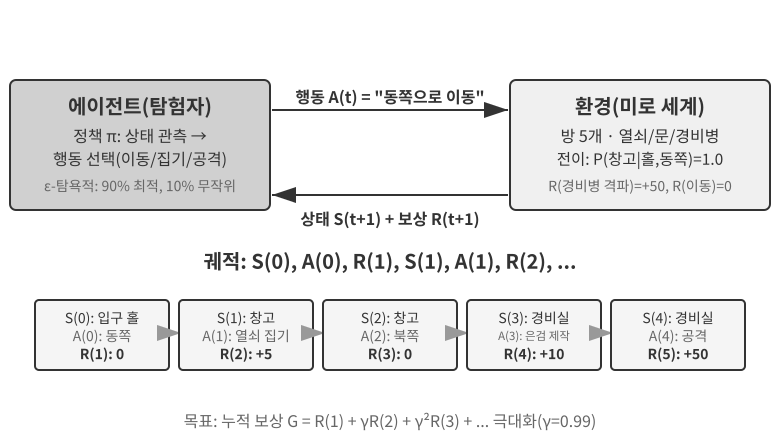

이 상호작용은 **궤적(trajectory)**, 즉 “상태 → 행동 → 보상 → 새 상태 → 행동 → 보상…”의 완전한 기록을 만든다. 정책의 품질은 궁극적으로 궤적의 품질에 드러난다. **가치 함수**는 “지금 이 상태에서 현재 정책에 따라 계속 행동하면 최종적으로 얼마만큼의 총보상을 누적할 수 있는가?”라는 질문에 답한다. 숙련된 체스 선수가 현재 판세를 보고 끝까지 계산하지 않고도 직관적으로 승리 확률을 추정하는 것과 같다. ‘현재 정책’을 ‘최적 정책’으로 바꾸면 최적 가치 함수를 얻는다. 이 장 뒤쪽에서 벨만 최적 방정식을 설명할 때 사용한다. 에이전트와 환경의 경계는 간단한 원칙을 따른다. **에이전트가 임의로 바꿀 수 없는 것은 모두 환경에 속한다.**

강화 학습을 레이블이 있는 정답이 필요한 지도 학습 및 데이터의 숨은 패턴을 찾는 비지도 학습과 구별하는 특징은 두 가지이다. **시행착오 탐색**에서는 교사가 정답을 직접 알려 주지 않으므로 에이전트가 어떤 행동이 좋은지 스스로 알아내야 한다. **지연 보상**에서는 행동의 효과가 여러 단계 뒤에야 드러날 수 있다. 예를 들어 좋은 체스 수의 가치는 경기 끝에서야 확인된다. 이 때문에 **탐색-활용 절충**이라는 고유한 문제도 생긴다. 항상 익숙한 경로만 택하면 새로운 것을 배우지 못하고, 항상 무작위로 시도하면 목표에 결코 도달하지 못한다.

강화 학습 시스템은 다섯 가지 핵심 요소로 구성된다.

- **행동 공간**: 에이전트가 취할 수 있는 모든 행동의 집합을 정의한다. 행동은 체스에서 유한한 선택지 중 “어떤 수를 둘지” 정하는 것처럼 이산적일 수도 있고, 로봇의 “관절을 몇 도 회전할지” 정하는 것처럼 연속적인 값일 수도 있다.
- **정책**: 주어진 상태에서 무엇을 할지 규정하는 에이전트의 행동 규칙이다. 정책은 “상태 A에서는 행동 X를 실행한다”라는 룩업 테이블처럼 단순할 수도 있고 심층 신경망처럼 복잡할 수도 있다.
- **보상 신호**: 환경이 제공하는 즉각적인 피드백이다. 그러나 에이전트의 목표는 즉각적인 보상이 아니라 장기 보상을 극대화하는 것이다. 투자를 오늘의 손익이 아니라 장기 수익률로 판단해야 하는 것처럼 이 차이는 매우 중요하다.
- **가치 함수**: 특정 상태에서 앞으로 얻을 수 있는 총 누적 보상을 추정하여, 즉각적인 피드백이 없어도 에이전트가 현명하게 결정하도록 돕는다. 가치 추정의 중심적 역할은 60년에 걸친 RL 연구에서 얻은 가장 중요한 통찰 가운데 하나이다.
- **환경 모델**(선택 사항): 행동에 대한 환경의 반응을 예측한다. 환경 모델을 사용하는 방법은 먼저 환경이 어떻게 변할지 예측하는 법을 배운 뒤 그에 따라 계획하므로 **모델 기반 방법**이라고 한다. 환경을 예측하지 않고 경험에서 직접 배우는 방법은 **모델 프리 방법**이라고 한다.

표 7-3은 여러 에이전트 시스템의 핵심 구성 요소를 비교한다. 이를 통해 에이전트 개념의 보편성을 확인하고, 전통적인 RL 에이전트와 현대 LLM 에이전트의 행동 공간이 어떻게 다른지 살펴볼 수 있다.

표 7-3 여러 에이전트 시스템의 핵심 요소 비교

| 에이전트 유형 | 환경 | 행동 공간 | 보상 신호 |
|---------------|------------------------|-------------------------------|-------------------------|
| **갓 태어난 가젤** | 지형, 중력, 신체 자세 | 연속 고차원(근육군 수축) | 균형 유지(+), 넘어짐(-) |
| **청소 로봇** | 방 구조, 배터리 잔량 | 이산(방향, 청소, 충전) | 청소한 면적(+), 배터리 고갈(-) |
| **체스 그랜드마스터** | 보드 상태, 제한 시간 | 이산 유한(합법적인 수) | 승리(+1), 패배(-1) |
| **고객 서비스 에이전트** | 대화 기록, 지식 베이스 | 개방형(생각, 말하기, API 호출) | 문제 해결(+), 처리 시간(-) |
| **코드 어시스턴트 에이전트** | 요구 사항 문서, 코드베이스 | 개방형(생각, 검색, 편집, 실행) | 테스트 통과(+), 버그 발생(-) |

이 표에서 중요한 통찰을 얻을 수 있다. 체스와 로봇 공학 같은 영역의 전통적인 RL 에이전트에는 닫힌 행동 공간이 있지만, 고객 서비스와 코딩 에이전트 같은 현대의 LLM 기반 에이전트에는 사실상 무한한 개방형 행동 공간이 있다. 이러한 에이전트는 ‘내부 사고’라는 특수 행동을 사용해 역량을 높일 수도 있다.

### 두 가지 에이전트 패러다임: MDP에서 LLM+RL까지

두 패러다임의 가장 근본적인 차이는 행동 공간이다. MDP는 행동 공간이 유한하고 닫혀 있다고 가정한다(위/아래/집기/놓기). 반면 LLM의 행동 공간은 조합이 폭발적으로 늘어나는 자연어 시퀀스로 구성된 개방형 공간이다. 이 차이로 인해 알고리즘 설계, 샘플 효율, 일반화 측면에서 두 패러다임이 근본적으로 갈라진다. 아래에서 각각을 살펴본다.

**전통적인 패러다임: MDP와 Q-learning.**

MDP(마르코프 결정 과정)는 상태·행동·보상 같은 핵심 요소를 정의하는 강화 학습의 수학적 프레임워크이다. 핵심 가정은 **마르코프 성질**이다. 미래는 과거의 이력이 아니라 오직 현재 상태에만 의존한다. 예를 들어 체스에서는 지금의 보드 상태만 보아도 최적의 수를 결정할 수 있으며, 이전의 모든 수를 검토할 필요가 없다. 이 가정은 문제를 단순화하지만 과거에 대한 의존성을 모델링하는 능력도 제한한다.

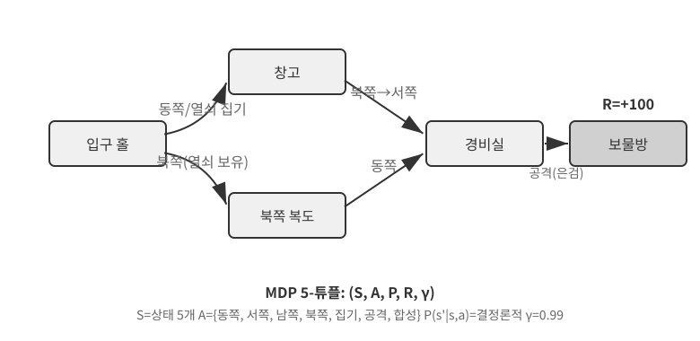

전통적인 RL 에이전트의 핵심 특징은 **닫힌 행동 공간**이다. 에이전트가 취할 수 있는 모든 행동이 미리 정의된 유한 집합을 이룬다. **고전적인 보드게임 에이전트**가 가장 대표적인 예다. 바둑의 361개 착수 위치는 매우 많지만 완전히 정해져 있고 유한하다. 체스는 기물마다 이동 규칙이 다르지만 가능한 행동을 모두 열거할 수 있다. Atari 게임에는 불과 몇 개에서 십여 개의 이산 행동만 있다. **로봇 에이전트**는 연속적이지만 경계가 있는 행동 공간에 해당한다. 관절 각도, 속도, 파지력은 연속적인 값이지만 모두 최대 회전 각도, 최대 토크, 속도 제한 같은 명확한 물리적 경계가 있으며, 차원은 로봇의 자유도에 따라 결정된다.

이러한 폐쇄성에는 계산상의 이점이 있다. 모든 행동을 열거하고 하나씩 평가할 수 있어 동적 계획법과 몬테카를로 트리 탐색을 적용하기 쉬우며, 행동 가치 함수를 테이블이나 단순한 함수로 근사할 수 있다. 그러나 표현력과 일반화도 제한된다. 전통적인 RL 에이전트는 무작위 정책에서 출발해 경험을 모으고, 가치 함수나 정책을 갱신하며, 수렴할 때까지 반복하는 식으로 순수한 시행착오를 통해 처음부터 학습한다.

이 프레임워크에서 가장 기본적이고 중요한 알고리즘 중 하나가 **Q-learning**이다. 각 ‘상태-행동’ 쌍에 대한 가치 추정치를 유지한다. 상태 *s*에서 행동 *a*를 취한 뒤 계속 최적으로 행동한다면 어느 정도의 총보상을 기대할 수 있는지를 나타낸다. 직관적으로 한 행동의 가치는 그 행동이 가져오는 즉각적인 보상에 “그 행동이 이끄는 다음 상태가 얼마나 좋은가”를 더해 결정된다.

이 직관을 방정식으로 쓰면 RL 교과서에서 유명한 **벨만 방정식**의 핵심 재귀 관계를 얻는다. **행동의 참된 가치 = 이 단계에서 얻는 즉각적 보상 + 다음 상태에서 얻을 수 있는 최대 미래 가치**이다.

$$Q^*(s, a) = r + \gamma \max_{a'} Q^*(s', a')$$

여기서 $r$은 즉각적인 보상이고, $s'$은 행동을 실행한 뒤 도달한 다음 상태이다. 직관을 위해 결정론적 형태로 썼으며, 확률적 환경에서는 다음 상태 $s'$에 대한 기댓값이 필요하다. $\gamma \in [0, 1)$는 **할인율**로, 에이전트가 미래를 얼마나 중시하는지 결정한다. $\gamma$가 1에 가까울수록 장기 수익을 더 중시하고, 0에 가까울수록 당장에 더 집중한다. 앞에서 거듭 언급한 ‘누적 보상’은 정확히 각 단계의 보상을 $\gamma$로 할인한 합인 $\sum_{t} \gamma^{t} r_t$이다. 알고리즘은 각 행동 뒤에 기존 추정치를 ‘실제로 관측한 결과’ 쪽으로 조금씩 조정한다. “한 단계에서 실제로 얻은 결과로 기존 추정치를 수정하는” 이 패러다임을 **시간차 학습(Temporal-Difference Learning, TD 학습)**이라고 한다. 수천 번 시도하면 추정치가 점차 참값에 가까워진다.

다음 두 그림은 격자 세계에서 Q-learning이 탐색하는 과정과 Q값이 점진적으로 수렴하는 모습을 보여 준다.

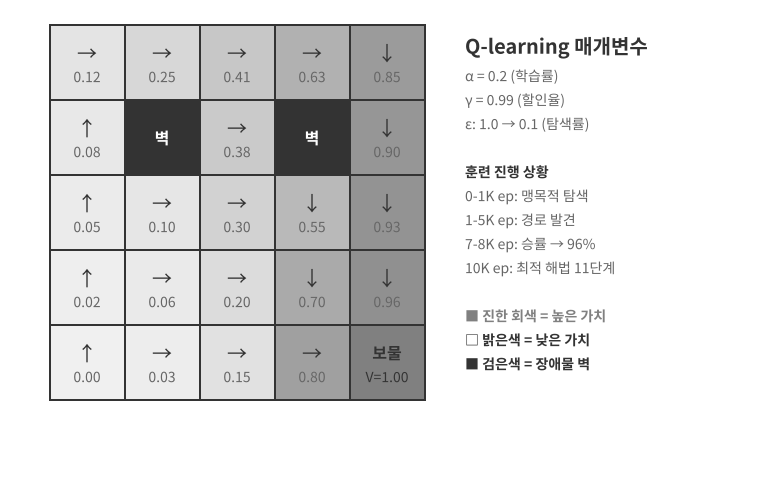

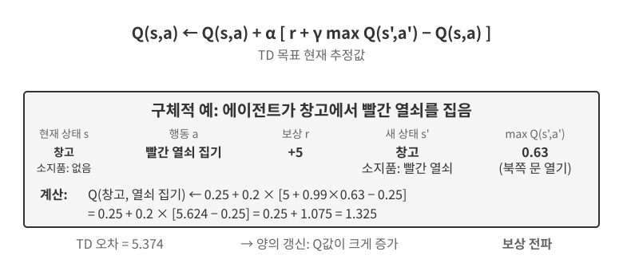

Q-learning은 특정한 유형의 **오프폴리시** 방법이다. 무작위 탐색을 포함하여 어떤 정책이 생성한 데이터든 사용해 최적 정책을 학습할 수 있다. 온폴리시와 오프폴리시 방법의 엄밀한 정의, 그리고 이들이 LLM 사후 학습에 어떻게 대응하는지는 뒤쪽의 “강화 학습 알고리즘 비교” 절에서 설명한다.

> **실험 7-1 ★: 보물찾기 게임에서 Q-learning의 성능**
>
> Q-learning의 특성과 한계를 검증하기 위해 **보물찾기 게임 환경**을 설계했다. 이 환경에는 몇 가지 핵심 난제가 있다. **숨겨진 메커니즘** 때문에 에이전트는 열쇠와 문 사이의 대응 관계, 무기의 효과, 아이템 합성 규칙을 스스로 발견해야 한다. **다단계 의존성** 때문에 과업을 완수하려면 올바른 행동 순서가 필요하다(최적 해법: 11단계). **희소 보상** 때문에 핵심 행동과 최종 승리에서만 의미 있는 보상을 얻고, 대부분의 중간 단계에는 피드백이 없다.
>
> Q-learning 에이전트는 표준 매개변수 설정과 ε-탐욕적 탐색 전략을 사용한다. 일반적으로 현재의 최적 행동을 선택하지만 가끔 무작위 행동을 선택하며, 훈련이 진행될수록 무작위 탐색의 비율이 점차 감소한다.
>
> 학습 곡선은 다음과 같은 전형적인 특성을 보인다. 에피소드 하나는 시작부터 완료 또는 실패까지 한 번의 완전한 게임이다.
> - **처음 1,000개 에피소드**: 승률 0%, Q 테이블에는 상태가 124개뿐이며 에이전트가 맹목적으로 탐색한다.
> - **처음 5,000개 에피소드**: 여전히 안정적인 승리가 없으며 Q 테이블에는 상태가 133개 있다.
> - **7,000~8,000개 에피소드**: 승률이 34%에서 96%로 점차 상승한다.
> - **10,000개 에피소드**: 승률 100%, Q 테이블의 상태 145개, 11단계 최적 해법을 찾는다.
>
> 전체 훈련에는 10초도 걸리지 않지만(매우 효율적인 시뮬레이션) 거의 10,000번의 완전한 시도가 필요하다. 이는 Q-learning의 핵심 특성을 보여 준다. 우연히 전체 경로를 완주하려면 대량의 무작위 탐색이 필요하고, 가치 신호가 매우 느리게 전파되므로 반복해서 강화해야 한다. 사전 지식이 없는 순수 기호 학습은 상태 공간을 무차별 대입으로 탐색할 수밖에 없다.
>
> 게임 시뮬레이터에서는 10,000번 시도하는 데 10초밖에 걸리지 않아 비용을 무시할 만하다. 그러나 전화 한 통마다 비용이 들고, 브라우저 작업마다 지연이 있으며, 잘못된 결정 하나가 되돌릴 수 없는 결과를 낳을 수 있는 현실의 에이전트 시나리오에서 10,000번의 시도는 전혀 받아들일 수 없다. 현대 에이전트가 LLM 기반 방법으로 전환한 이유가 바로 여기에 있다. 사전 학습 중 축적한 지식을 활용해 최소한의 상호작용만으로 효과적인 결정을 내린다.
>
> MDP에는 세 가지 근본적인 한계가 있다. 단순한 과업을 학습하는 데도 대량의 상호작용이 필요하여 샘플 효율이 낮고, 한 환경에서 배운 지식을 다른 환경으로 전이하기 어려워 일반화 능력이 떨어지며, 사전 지식을 활용할 수 없어 새 과업마다 처음부터 배워야 한다. 자연어나 고차원 비전처럼 복잡한 상태 공간을 만나면 이러한 한계가 특히 두드러진다.
>

**현대의 패러다임: LLM+RL 기반 에이전트.**

대규모 언어 모델은 에이전트의 새로운 패러다임을 열었으며, 특히 행동 공간 설계를 중심으로 에이전트를 구축하는 방식을 근본적으로 바꾸었다.

전통적인 RL에서 에이전트는 체스에서 수를 두거나 미로에서 한 걸음 옮기는 것처럼 환경을 바꿔야만 피드백을 받을 수 있다. 그러나 LLM은 완전히 새로운 유형의 행동인 내부 사고를 도입한다. 사고는 외부 세계를 바꾸지 않지만 최종 행동의 품질을 크게 높일 수 있다. 이 변화는 모든 것을 바꾼다. 에이전트의 행동 공간에는 더 이상 ‘무엇을 할지’만이 아니라 ‘얼마나 오래, 무엇에 관해 생각할지’도 포함된다.

가장 중요한 혁신은 **사고를 특수 행동으로** 행동 공간에 포함한 것이다. 전통적인 RL 에이전트는 이동, 공격, 집기처럼 환경 상태를 바꾸는 외부 행동만 할 수 있다. LLM 에이전트에서는 **내부 사고가 행동 공간의 핵심 구성 요소가 된다**. 외부 환경을 직접 바꾸지 않고 즉각적인 보상도 없지만, 거의 무제한으로 수행할 수 있으며 비용도 비교적 낮다.

전통적인 RL이 이러한 행동을 어려워하는 근본적인 이유는 탐색 공간이 너무 크고 구조가 없기 때문이다. 처음부터 배우는 에이전트는 눈을 가린 채 사막에서 보물을 찾아 무작위로 비틀거리기만 하는 것과 같다. LLM은 다르다. 방대한 텍스트 사전 학습을 통해 인간 사고의 규칙을 내재화했다. 수학 문제를 풀 때는 “조건 파악 → 공식 회상 → 단계별 계산”, 코드를 작성할 때는 “요구 사항 이해 → 구조 설계 → 세부 사항 구현”이라는 흐름을 따른다. 따라서 LLM의 사고는 구조화된 경로를 따라 진행하며 탐색 공간을 크게 압축할 수 있다. 추가 RL 훈련이 없어도 사전 학습된 LLM이 기본적인 논리적 사고의 연쇄(CoT)를 생성할 수 있는 이유이다. 이 기본 논리는 사전 학습 말뭉치에 들어 있는 방대한 인간 사고 과정(수학 문제 풀이, 코드 주석, 토론 답변 등)에서 나온다. 모델은 다음 토큰 예측을 통해 “다음 사고 단계는 어떤 모습이어야 하는가”를 암묵적으로 학습한다.

이후 RL 사후 학습은 외부 보상을 사용해 LLM이 특정 과업에서 이러한 규칙을 더 효율적으로 사용하도록 가르친다. 언어 구조 자체도 암묵적인 내부 보상을 제공한다. “외화를 USD로 환산해야 하므로 첫 단계는 환율을 조회하는 것이다”처럼 논리적으로 일관된 사고의 연쇄는 생성 확률이 높다. 반면 “통화를 환산해야 하므로 먼저 날씨를 확인하자”처럼 논리가 뒤죽박죽인 사고의 연쇄는 확률이 극히 낮다. 그 결과 모델이 자연스럽게 합리적인 경로로 향한다.

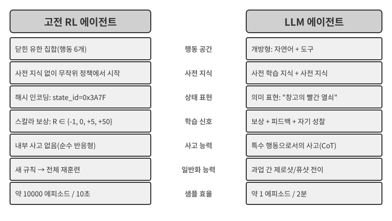

언어 고유의 규칙을 토대로 한 이러한 사고 능력 덕분에 LLM 에이전트는 한 번도 본 적 없는 지시를 이해하고(제로샷 일반화), 극소수의 예시만으로 새로운 과업을 익힐 수 있다(퓨샷 적응). 광범위한 시행착오가 필요한 전통적인 MDP 에이전트 패러다임과 뚜렷이 대비된다. 또한 새로운 패러다임은 이미 아는 개념을 재조합해 새로운 상황을 처리하는 조합적 일반화, 프롬프트와 예시로 빠르게 적응하는 인컨텍스트 학습, 비전·언어·행동 같은 양식을 자연스럽게 통합하는 멀티모달 이해도 지원한다. 인컨텍스트 학습(제로샷 일반화, 퓨샷 적응)의 **효과**와 **내부 메커니즘**은 서로 다른 문제라는 점에 유의하자. 2장에서 분석했듯 어텐션 메커니즘은 사고보다 검색에 가깝게 작동하지만, 그렇다고 과업 적응에서 발휘하는 강력한 실용적 효과가 줄어드는 것은 아니다.

닫힌 행동 공간에서 열린 행동 공간으로의 진화는 AI 에이전트 패러다임의 근본적 전환을 나타낸다. 내부 사고뿐 아니라 자연어 질의, 프로그램 코드, 복잡한 JSON, 멀티모달 콘텐츠 등 다양한 도구 매개변수 때문에 실제 행동 공간은 거의 무한하다. 코드 인터프리터는 이론적으로 계산 가능한 모든 과업을 실행할 수 있고, 검색 도구는 인터넷의 전체 정보 공간을 탐색할 수 있다. 이 변화는 새로운 기회와 과제를 함께 가져온다. 에이전트는 전례 없는 과업을 처리하고 기본 도구를 조합해 복잡한 문제를 해결할 수 있지만, 개방형 환경에서 보상 함수를 정의하고 최적화하는 방법과 무한한 행동 공간을 효율적으로 탐색하는 방법도 찾아야 한다.

도구 사용과 긴 사고의 연쇄에 최적화된 Kimi K3 같은 모델은 LLM+RL 패러다임의 전형적인 방향을 보여 준다. 대규모 언어 사전 학습이 토대를 제공하고 사후 학습이 문제 분해, 도구 사용, 자기 수정을 강화한다. **OpenVLA**(9장에서 자세히 설명)는 LLM 시대의 VLA(Vision-Language-Action) 아키텍처 패러다임을 보여 준다. 비전 인코더가 환경 관측을 처리하고, 언어 모델이 지시를 이해하고 사고하며, 행동 디코더가 제어 신호를 생성함으로써 언어 조건부 제어와 과업 간 일반화를 구현한다. 분명히 해 둘 점은 OpenVLA 자체가 거의 100만 개에 이르는 로봇 **시연 궤적**으로 모방 학습된다는 것이다. 따라서 본질적으로 RL이 아니라 SFT에 해당한다. 이 장 뒤쪽의 실험 7-13에서 소개하는 SimpleVLA-RL은 보상으로 이러한 VLA 아키텍처를 한층 더 최적화하여 RL을 로봇 공학에 도입한 대표적인 사례이다.

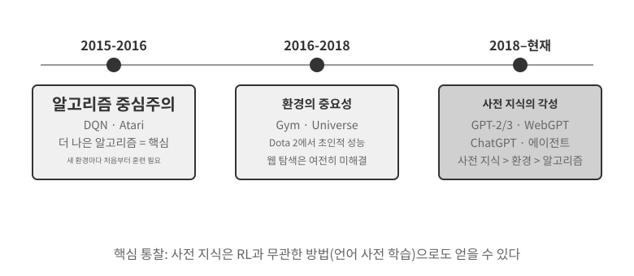

Princeton University 조교수이자 ReAct 논문의 저자인 Shunyu Yao가 “The Second Half”에서 기록한 **OpenAI의 탐색 경로**는 이 분야의 사고방식이 진화한 과정을 보여 준다. **1단계(2015~2016년), 알고리즘 중심:** 더 나은 알고리즘이 핵심이라는 믿음이 지배적이었다. Atari 같은 표준 환경에서는 진전을 이루었지만 새로운 환경마다 처음부터 다시 훈련해야 했다. **2단계(2016~2018년), 환경의 중요성:** Gym은 여러 과업을 표준화했다. Universe와 World of Bits는 인터넷 전체를 RL 훈련 환경으로 만들려 했고, Dota 2는 특정한 복잡한 환경에서 초인적인 성능을 추구했다. 발상은 명확했지만 범용적인 컴퓨터 사용과 웹 탐색은 여전히 실현하지 못했다.

**3단계(2018년~현재), 사전 지식의 각성:** GPT-2/GPT-3는 언어 사전 학습의 힘을 보여 주었고, WebGPT와 ChatGPT는 그 사전 지식을 실용적인 에이전트로 바꿀 수 있음을 증명했다. 가장 중요한 발견은 **사전 지식을 RL과 전혀 무관한 방법으로도 습득할 수 있다**는 것이다. 직관에 어긋나는 진실이다. 수십 년 동안 RL 연구자들이 우선순위를 정확히 거꾸로 두었을지도 모른다. 실제 순서는 알고리즘 > 환경 > 사전 지식이 아니라 사전 지식 > 환경 > 알고리즘이다.

> **실험 7-2 ★★: 전통적인 RL과 LLM 에이전트의 비교 연구**
>
>
> 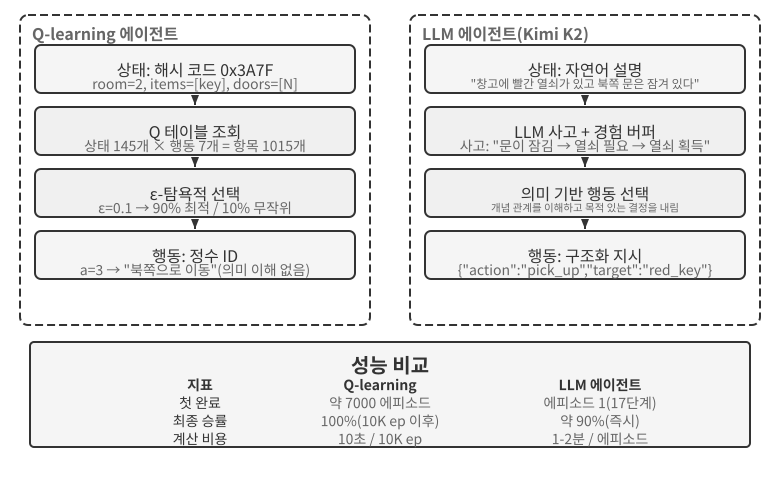
>
>
> 같은 보물찾기 게임에서 Q-learning과 최대 50개의 경험을 버퍼에 유지하는 LLM 에이전트 Kimi K3를 비교했다. 결과는 놀랍다. **LLM 에이전트는 첫 번째 시도에서 18단계 만에 게임을 완료했다.**
>
> **초기 단계(목적 있는 탐색)**: 녹슨 검을 집고(“맨손보다 무기가 낫다”) 지도를 체계적으로 탐색한다. 북문이 잠겨 있음을 발견한 뒤 “열쇠를 찾아야 한다”고 추론하고, 창고를 탐색하여 빨간 열쇠와 마법 수정을 얻는다. **중간 단계(메커니즘 이해와 선제적 합성)**: “열쇠 자동 사용” 규칙을 이해하고 녹슨 검으로는 경비병을 상대하기에 부족하다고 예상하여 8단계에서 선제적으로 은검을 합성한다. **후기 단계(실행과 오류 수정)**: 은검을 들고 북쪽으로 향해 13단계에서 강력한 경비병을 쓰러뜨린다. 그 과정에서 검을 반복해서 휘두르거나 되돌아가는 등 효과 없는 시도를 한두 번 하지만, 결국 18단계에서 용의 보물을 얻는다.
>
> 이는 의미 이해와 기호 매핑의 근본적인 차이를 보여 준다. LLM 에이전트는 게임의 개념적 구조를 이해했으며, 모든 단계에는 목적과 논리적 근거가 있었다. Q-learning에서 ‘문’, ‘열쇠’, ‘검’은 의미 없는 기호 조합에 불과하며, 방대한 통계적 학습을 거쳐야 그 관계를 천천히 발견할 수 있다.
>
> 계산 비용에는 흥미로운 역설이 있다. Q-learning은 10초에 10,000번 게임을 실행하지만 LLM 에이전트는 게임 한 번에 1~2분이 걸린다. 그러나 현실 과업에서는 상호작용마다 발생하는 시간·금전·위험 비용이 순수한 계산 비용보다 훨씬 크므로 GPU 시간만으로 판단하는 것은 공정하지 않다. 더 중요한 통찰은 LLM 에이전트의 성공이 더 나은 ‘학습 알고리즘’ 때문이 아니라 방대한 사전 지식을 지녔기 때문이라는 점이다. 게임 규칙이 바뀌면 Q-learning은 완전히 다시 훈련해야 하지만 LLM 에이전트는 사고를 통해 곧바로 적응할 수 있다. 여기에서 실용적인 설계 원칙을 얻을 수 있다. 시뮬레이션 비용이 낮고 반복성이 높은 시나리오에서는 전통적인 RL이 여전히 가치가 있다. 반면 상호작용 비용이 높고 빠른 적응이 필요한 현실 시나리오에서는 LLM 에이전트의 샘플 효율이 실질적으로 더 가치 있다.
>

1장에서는 컨텍스트 적응, 외부 산출물 갱신, 매개변수 갱신이 어떻게 함께 작동하는지 개념적 지도를 제시했다. 이 장 끝의 “사후 학습 전체 지형과 실전 조언” 절에서 이 주제로 돌아온다. 이 장의 주된 흐름은 외부 규칙만으로 완전히 표현할 수 없는 역량을 모델 매개변수에 기록하는 사후 학습이다.

## 모델 사전 학습의 기초 `[선택 읽기]`

사후 학습 기술이 효과적인 이유를 이해하려면 먼저 사전 학습이 무엇을 구축하는지 알아야 한다. 사후 학습(SFT와 RL)은 본질적으로 사전 학습이 구축한 표현 공간 안에서 최적화하며, 사전 학습이 마련한 지식 구조가 사후 학습의 상한을 결정한다. 따라서 소규모 언어 모델을 처음부터 훈련하기, 비전 역량 확장하기, 새로운 언어 지식 주입하기라는 세 가지 실험을 통해 사전 학습의 핵심 측면을 살펴본다. 이 절의 세 실험은 보충 자료로서, 대규모 데이터에 대한 초기 훈련을 통해 모델에 기본 언어 패턴과 세계 지식을 가르치는 사전 학습에 관한 직관을 길러 준다. 사전 학습 과정을 이미 잘 아는 독자는 건너뛰어도 된다.

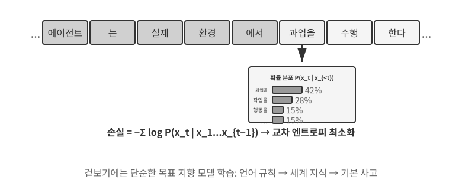

언어 모델 훈련은 “토큰화 — 사전 학습 — 사후 학습”의 3단계 파이프라인을 따른다. 토큰화는 텍스트를 이산적인 단위로 분할한다. 예를 들어 “I like programming”은 “I”, “like”, “program”, “ming”으로 토큰화될 수 있다. 이러한 토큰은 모델이 처리하는 가장 작은 텍스트 단위이다. 사전 학습의 과업은 개념적으로 단순하다. 텍스트 구간의 앞부분을 모델에 보여 주고 다음 토큰을 예측하게 한다. 모델은 자신의 예측과 정답을 비교하여 계속 매개변수를 조정한다. 이 차이를 손실이라 하며, 손실이 작을수록 예측이 정확하다. 방대한 텍스트 데이터로 훈련을 반복하면 모델은 언어 규칙, 세계 지식, 기본적인 사고 능력을 점차 학습한다. 사전 학습 뒤에는 유창한 텍스트를 생성할 수 있지만 출력 구조가 부족하고 지시를 잘 따르지 못한다. 이어지는 사후 학습은 레이블이 있는 입력-출력 쌍을 사용하는 SFT와, 모델이 인간이 선호하는 응답을 생성하도록 가르치는 DPO 같은 선호 최적화를 통해 모델을 실용적인 어시스턴트로 바꾼다.

> **실험 7-3 ★★: LLM을 처음부터 훈련하기—알고리즘 개선의 힘**
>
> 1억 개 매개변수로 구성된 MiniMind 2 모델을 사례로 삼아, 소비자용 GPU에서 전체 훈련 과정을 수행한다. QK Norm과 Muon 옵티마이저라는 두 가지 알고리즘 최적화로 수렴 속도를 세 배 높이고 생성 품질을 크게 개선했다. 전체 비용은 훈련 약 14시간과 34달러로 매우 낮았다.
>
> 각 훈련 단계의 효과는 다음과 같다. 사전 학습 뒤에는 “세계에서 가장 높은 산은 무엇인가?”와 같은 사실 질문에 답할 수 있지만 형식이 표준적이지 않다. SFT 뒤에는 지시 따르기와 출력 형식이 크게 개선되어 기대하는 방식으로 답을 구성할 수 있다. 선호 최적화는 사실 오류와 부자연스러운 표현을 한층 더 줄인다. 1억 매개변수 모델에는 여전히 복잡한 문제에서 오류를 내기 쉽다는 뚜렷한 한계가 있다. 그러나 이 실험의 교훈은 분명하다. **예산이 적고 고정되어 있다면 단순히 규모를 키우는 것보다 알고리즘을 개선하는 편이 더 높은 가성비를 제공한다.**
>
> **실험 7-4 ★★: 나만의 VLM 훈련하기**
>
>
> 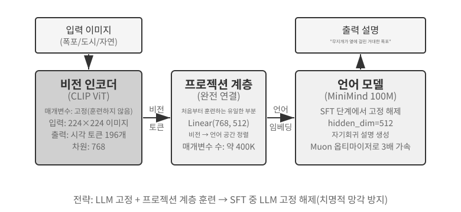
>
>
> VLM은 하나의 모델 안에서 시각 인식과 언어 이해를 통합한다. 핵심 과제는 ‘보이는 것’과 ‘말하는 것’을 대응시키는 교차 모달 정렬이다. 아키텍처는 세 가지 구성 요소로 이루어진다. **비전 인코더**(예: CLIP, 매개변수 고정)는 이미지에서 의미 특성을 추출한다. 가볍고 유일하게 처음부터 훈련하는 **프로젝션 계층**은 시각 특성과 언어 모델 사이의 ‘번역기’로서, 시각 특성을 언어 모델이 이해할 수 있는 표현 공간에 매핑한다. **언어 모델**은 설명 텍스트를 생성한다. 훈련에서는 치명적 망각, 즉 새로운 기술을 익힌 뒤 기존 기술을 잊는 일을 피하기 위해 “LLM 고정 + 프로젝션 계층만 훈련” 전략을 사용한다. 정렬 사전 학습 단계가 끝나면 LLM의 고정을 풀고 고품질 이미지-설명 쌍으로 SFT를 수행하여 설명의 세부성과 정확성을 크게 높인다.
>
> 이 실험은 멀티모달 모델 훈련의 기본 패러다임을 보여 준다. 단일 모달 사전 학습 결과를 재사용하고 가벼운 프로젝션 계층을 훈련하여 교차 모달 정렬을 달성한다. 효율적이고 확장 가능하지만 프로젝션 계층의 제한된 표현력이 깊은 교차 모달 이해의 병목이 될 수 있다. 같은 “비전 인코더 + 프로젝션 계층 + LLM” 아키텍처를 한 단계 더 확장해 모델이 행동을 출력하게 하면 9장에서 자세히 설명하는 VLA(Vision-Language-Action) 모델이 된다.
>
> **실험 7-5 ★★: 새로운 언어를 배우기 위한 연속 사전 학습**
>
> 주로 영어로 사전 학습되어 한국어를 거의 이해하지 못하는 Mistral 7B v0.3을 기반 모델로 사용하고, 한국어 Wikipedia에 대한 연속 사전 학습으로 한국어 역량을 도입한다. 이미 사전 학습을 마친 모델을 새로운 언어 데이터로 비지도 훈련한다. 모델은 이미 일반적인 언어 모델링 역량을 갖추었으므로 새로운 데이터 분포에 적응하기만 하면 되며, 처음부터 훈련하는 것보다 비용이 훨씬 낮다. 핵심 엔지니어링 포인트는 치명적 망각을 완화하기 위해 혼합 데이터(한국어 약 80% + 영어 약 20%)를 사용하는 것이다. 목표 언어의 비율이 너무 높으면 기존 언어 능력이 저하되고, 너무 낮으면 학습 효율이 부족하다. 마지막으로 한국어 지시 데이터로 SFT를 수행하여 실용적인 한국어 대화 능력을 확보한다. 이 실험의 결론은 장 끝의 “사후 학습 전체 지형과 실전 조언”에서 다시 사용한다. 모델이 대량의 새로운 도메인 지식을 기억하게 하려면 SFT가 아니라 연속 사전 학습을 사용해야 한다.
>

세 가지 사전 학습 실험은 공통된 패턴을 보여 준다. 예산이 제한되었을 때는 단순히 규모를 키우는 것보다 알고리즘 개선과 아키텍처 혁신의 가성비가 더 높다. 더욱 중요한 점은 사전 학습이 모델에 서술적 지식과 언어 모델링 역량을 부여하지만 구조화된 지시 따르기와 과업 지향적 행동은 제공하지 않는다는 것이다. 바로 이 간극을 SFT가 메워야 한다.

사전 학습으로 기본 역량을 갖추었으면 다음 단계는 사후 학습을 통해 범용 모델을 실용적인 에이전트로 바꾸는 것이다. 사후 학습의 첫 단계는 지도 미세 조정(SFT)이다.

## SFT(지도 미세 조정)

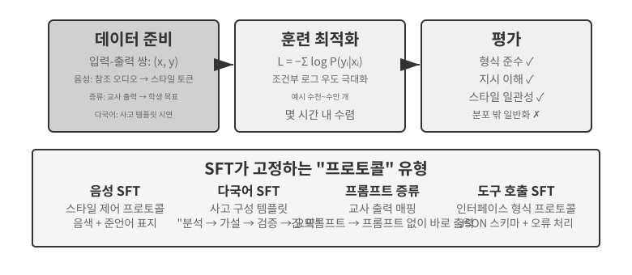

7.1절에서 이미 SFT의 본질, 즉 다른 데이터로 ‘다음 토큰을 예측’하고 응답에 대해서만 손실을 계산한다는 점을 밝혔다. 이 절에서는 네 가지 실험을 통해 안정적인 매핑과 프로토콜을 매개변수에 기록하는 이 메커니즘이 여러 과업에서 실제로 무엇을 고정하는지 살펴본다. SFT의 핵심 가치는 새로운 지식을 주입하는 것이 아니라 **프로토콜을 고정하는 것**이다. 매핑 관계, 상호작용 형식, 스타일 규범을 매개변수에 기록하여, 긴 프롬프트 없이도 추론 시 기대에 부합하는 출력을 생성하게 한다. 일반적으로 고품질 예시 수천~수만 개만 있으면 기본적인 대화 능력과 지시 따르기를 확립할 수 있다.

이러한 효율의 대가는 훈련 분포에 대한 강한 의존성이다. SFT는 일반화보다 암기하는 경향이 있다. 테스트 시 훈련에서 보지 못한 상황을 만나면 성능이 크게 저하되는 경우가 많다. 이어지는 실험에서는 ‘프로토콜 고정’ 과정을 여러 관점에서 보여 준다.

SFT를 직접 시작하기 전에 피할 수 없는 실용적인 질문이 하나 있다. **SFT 데이터는 어디에서 오는가?** 업계의 답은 세 가지 경로로 정리된다. **인간 전문가 시연**은 품질 상한이 가장 높지만 비용이 많이 들고 느리므로 형식과 스타일을 정의하는 ‘시드 데이터’에 가장 적합하다. **교사 모델 생성**, 즉 합성 데이터는 강력한 모델이 ‘입력-출력’ 쌍을 대량으로 만들게 하고 이를 필터링한 뒤 학생 모델에 증류한다. 실험 7-8과 7-9가 모두 이 경로를 사용한다. **모델 자기 부트스트래핑**은 같은 문제에 대해 모델이 여러 후보를 샘플링하고 검증기가 정답을 고른 뒤, 선택한 샘플로 모델 자체를 훈련한다. 실험 7-9에서 자세히 다루는 거부 샘플링 미세 조정이다. 세 경로는 흔히 결합한다. 먼저 적은 양의 인간 시드 데이터로 형식을 정하고, 교사 모델로 규모를 키운 다음, 거부 샘플링으로 품질을 기준선까지 끌어올린다. 어느 경로를 택하든 구축 파이프라인은 대체로 같다. 과업 분포와 출력 스키마를 정의하고 후보를 대량 생성하며, 규칙 기반 검증·형식 검사·수동 표본 검사로 품질을 걸러 낸다. 그런 다음 중복을 제거하고 혼합 비율을 균형 있게 조정하며 다양성을 확보한다. 규모를 과도하게 욕심낼 필요는 없다. 보통 고품질 예시 수천~수만 개면 프로토콜을 고정하기에 충분하다. 지저분한 예시 10만 개를 쌓기보다 깨끗한 예시 1만 개를 다듬어라. SFT는 데이터의 모든 잡음까지 충실하게 매개변수에 기록한다.

> **실험 7-6 ★★★: 음성 SFT—‘음성 복제’에서 ‘준언어 모델링’까지 `[확장 실험]`**
>
> Orpheus(컨텍스트 프롬프트 음성 복제)와 Sesame(준언어 토큰 모델링)을 사례로 삼아 ‘음성 스타일과 표현 습관’이 매개변수에 어떻게 기록되는지 보여 준다. 두 모델은 서로 다른 경로를 택한다.
>
> - **Orpheus**: 음성 파형을 토큰 시퀀스로 압축한다. 같은 화자의 참조 오디오를 이어 붙여 모델이 ‘이 사람의 목소리로 말하는 법’을 배우고, 문장 사이에서도 일관된 음색을 구현한다.
> - **Sesame**: 웃음과 한숨 같은 준언어 현상을 `<laugh>`, `<sigh>` 같은 특수 토큰으로 추상화한다. 모델은 ‘이 토큰을 보면 해당 소리를 내는 법’을 배운다.
>
> 표현 과업에서 SFT가 고정하는 것은 사실 지식이나 복잡한 사고가 아니라 스타일 제어 프로토콜과 구조화된 표현 습관이다. 핵심은 훈련 데이터의 다양성과 주석 품질이다. 흔한 실패 유형으로는 훈련 데이터의 화자가 너무 적어 모두가 같은 목소리로 들리는 문제와 토큰 과적합이 있다. 토큰 과적합은 모델이 훈련 샘플의 세부 사항을 외워 새로운 상황에서 성능이 떨어지는 현상으로, ‘기계적인 웃음’을 낳는다.
>
> **실험 7-7 ★★★: 다국어 사고—어떤 언어로든 생각하는 모델 만들기 `[확장 실험]`**
>
> 대부분의 사고 모델은 영어로만 ‘생각’한다. 어떤 언어로 질문하든 모델의 내부 사고의 연쇄는 거의 항상 영어이다. 훈련 데이터의 고품질 사고 시연이 대부분 영어로 작성되었기 때문이다. 이 실험의 목표는 간단하다. 모델이 지정된 언어로 생각하게 한다.
>
> 접근법은 gpt-oss-20b에 SFT를 수행하는 것이다. 시스템 지시에 `reasoning language: German` 같은 한 줄을 추가하고 영어, 스페인어, 프랑스어 등의 사고 예시로 훈련한다. 훈련 데이터에는 **중국어가 전혀 없지만**, 훈련 뒤 사고 언어를 중국어로 지정하기만 하면 모델이 중국어로 완전한 사고의 연쇄를 수행한다. 이러한 제로샷 교차 언어 일반화는 이 실험에서 가장 흥미로운 발견이다. 다만 이는 SFT 자체의 일반화 능력이 아니다. 다국어 사전 학습이 이미 모델 안에 언어 간 공유 표현 공간을 구축했으며, SFT는 기존의 교차 언어 능력을 활성화할 뿐이다.
>
> **실험 7-8 ★★: 프롬프트 증류—더 낮은 비용으로 실용적 역량 복제하기**
>
> 실제 애플리케이션에서 모델이 복잡한 과업을 수행하게 하려면 수천에서 수만 토큰에 이르는 긴 시스템 프롬프트가 필요한 경우가 많으며, 호출할 때마다 지연 시간과 비용이 늘어난다. 사고 LLM을 사용하면 내부 사고 토큰이 비용을 한층 더 키운다. 프롬프트 증류의 발상은 ‘긴 프롬프트 + 사고하는 교사’의 행동을 ‘짧은 프롬프트/프롬프트 없음 + 사고하지 않는 학생’으로 압축하는 것이다. 교사는 전체 프롬프트와 사고 모드에서 고품질 답을 생성한다. 훈련 데이터에는 사용자 입력과 최종 결론만 남기고 긴 프롬프트와 중간 사고 과정은 버린다. 학생은 ‘결론을 바로 제시하는 법’을 배운다. 증류 뒤 같은 입력에 대한 학생 출력의 품질은 교사에 가까워지며, 긴 프롬프트와 사고 토큰을 처리할 필요가 없어 지연 시간과 비용이 크게 줄어든다.
>
> 증류는 두 차원으로 수행할 수 있다. ‘대형에서 소형으로’는 대형 모델을 중·소형 모델로 교체해 비용과 품질의 균형을 맞춘다. ‘사고에서 비사고로’는 같은 규모에서 명시적인 CoT를 암묵적인 매개변수 지식으로 접어 넣어 응답 속도를 20~30배 높인다. 두 방법은 배타적이지 않으며 프로덕션 환경에서는 흔히 함께 사용한다. 증류가 교사의 한계를 물려받는다는 점은 중요하다. 교사가 분포의 롱테일에서 체계적인 오류를 내면 학생은 그 오류를 더욱 단단히 고정한다. 교사가 정확성을 확보하기 위해 도구에 의존한다면 단순한 출력 증류는 도구가 제공하는 견고성을 잃는다. 엔지니어링 관점의 결론은 다음과 같다. 제품 설계가 안정적이고 입력 분포를 예측할 수 있으며 비용 제약이 크다면 프롬프트 증류는 탁월한 최적화이다. 탐색 중이거나 과업이 아직 안정화되지 않았다면 명시적 사고와 편집 가능한 프롬프트를 유지하는 것이 빠른 반복의 핵심이다.
>
> **실험 7-9 ★★★: 사고의 연쇄(CoT) 증류 `[확장 실험]`**
>
> 프롬프트 증류는 사고 과정을 버리지만 CoT 증류는 그 반대이다. 강력한 교사 모델의 **완전한 사고 궤적**을 학생 모델에 전이한다. 역량 있는 교사 모델의 CoT를 증류하면 매개변수 수가 같은 학생이 교사 역량의 70%~80%를 회복할 수 있다. 최첨단 역량의 경계를 넓히는 것이 아니라 스스로 제어할 수 있는 모델을 원하는 팀에는 가장 실용적인 추격 전략이다. DeepSeek-R1이 오픈 소스로 공개한 일련의 증류 소형 모델, 즉 R1의 사고 궤적으로 Qwen과 Llama 계열에 SFT를 수행한 모델들이 이 접근법의 대표 사례이다.
>
> **배경: ‘사고의 벽’ 현상.** OpenAI o 계열이나 Gemini 계열 같은 일부 폐쇄형 사고 모델은 사고 중 내부 사고의 연쇄를 생성하지만 사용자가 보는 것은 원래의 사고 과정이 아니다. 공급자는 증류 방지, 안전, 제품 경험 등의 이유로 CoT를 출력하기 전에 재작성하거나 요약하는 경우가 많으며, 가장 가치 있는 원본 사고 과정을 API 뒤에 숨긴다. 이 실험에서 오픈 소스 사고 모델을 교사로 선택하는 이유가 바로 이것이다. DeepSeek V4, Kimi K3, GLM 5.2 같은 모델은 완전한 사고의 연쇄를 직접 공개하므로 기술적으로나 라이선스상으로 증류가 가능하다. 단, 사용 전에 증류 제품에 관한 라이선스 조건은 반드시 확인해야 한다.
>
> 더 실용적이고 중요한 판단은 다음과 같다. **사후 학습을 수행하는 대다수 사람에게는 폐쇄형 모델의 사고의 연쇄를 증류할 필요가 전혀 없다.** 현재 최고의 오픈 소스 모델과 최첨단 폐쇄형 모델 사이의 격차는 생각만큼 크지 않다. 교사 모델은 ‘세계 최고’일 필요 없이 ‘학생보다 분명히 강하면’ 된다. 사후 학습할 모델이 200B 매개변수 이하라면 최첨단 오픈 소스 모델만으로도 교사 역할에 충분하다.
>
> **실험 설계:** 3단계 과정이다. 1단계 **궤적 수집**에서는 수학, 코드 같은 목표 과업 분포에서 문제를 샘플링하고 오픈 소스 교사 모델로 완전한 ‘사고 + 답’ 궤적을 생성한다. 그런 다음 규칙 기반 검증기로 최종 답이 틀린 궤적을 걸러 낸다. 그렇지 않으면 학생이 잘못된 사고 과정까지 모방한다. “후보를 생성하고, 검증·필터링한 뒤, 올바른 궤적만 유지하는” 이 단계에는 **거부 샘플링**이라는 이름이 있다. 이렇게 구성한 데이터로 SFT를 수행하는 것이 **거부 샘플링 미세 조정(RFT)**이다. 순수 SFT와 RL 사이에 놓인 방법으로, 보상 모델이나 정책 그래디언트가 필요 없다. 그저 “많이 샘플링하고 오답은 버리며 정답만 유지”하여 데이터 품질을 높인다. 검증 가능한 과업의 데이터를 구성하는 가성비가 매우 높은 방법이다. 2단계 **SFT 훈련**에서는 “문제 → `<think>` 사고 궤적 `</think>` + 최종 답”을 훈련 쌍으로 사용해 소형 모델(예: 7B 규모)에 표준 SFT를 수행한다. 3단계 **비교 평가**에서는 증류 전후의 학생 모델과 교사 모델을 같은 벤치마크에서 비교하여 회복한 역량의 비율을 측정한다.
>
> **인수 기준:** 증류한 학생 모델이 증류 전보다 수학 및 코드 벤치마크에서 크게 향상되고, 사고 궤적에서 성찰·되돌아가기·검증 같은 교사와 유사한 행동을 보여야 한다. 증류의 대가도 인식해야 한다. 학생은 교사의 체계적인 오류와 장황한 사고 습관을 물려받는다. 후자는 실험 7-10의 AdaptThink 접근법으로 한층 더 최적화할 수 있다.
>

이 네 실험은 ‘안정적인 매핑과 프로토콜을 매개변수에 기록한다’는 공통점이 있다. 음성 SFT는 스타일 제어 프로토콜을, 다국어 SFT는 사고 구성 템플릿을, 증류 SFT는 입력에서 출력으로의 직접 매핑을 고정한다. 모두 목표가 명확하고 형식이 깔끔하며 평가 기준이 안정적이므로, SFT가 매우 높은 샘플 효율로 성능을 높일 수 있다. 그러나 분포가 바뀌면 암기 성향이 성능 저하로 드러난다. 이는 7.1절 “SFT와 RL의 본질적 차이”에서 다룬 암기-일반화의 간극이 실험으로 나타난 것이다.

## SFT와 RL을 선택하는 기준

7.1절에서 SFT와 RL의 **본질적인 차이**를 명확히 했다. 이 절에서는 더 실용적인 질문에 답한다. **구체적인 과업이 주어졌을 때 무엇을 사용해야 하는가?** 아래 의사결정 프레임워크의 일부 결론은 이어지는 RL 실험(실험 7-10, 실험 7-11)에서 한층 더 검증한다. 먼저 잠정적인 판단을 세우고 RL 절을 읽은 뒤 돌아와 교차 확인해도 좋다.

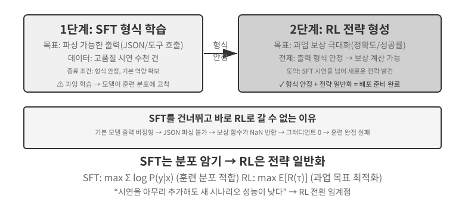

**SFT는** JSON 출력이나 일관된 대화 스타일처럼 형식을 안정화해야 하고, 고품질 전문가 시연을 구할 수 있으며, 배포 환경이 훈련 환경과 매우 유사한 과업에 적합하다. 반면 다음과 같은 상황에서는 **RL이 필요해진다**. 배포 환경과 훈련 환경이 체계적으로 다르거나(훈련에서는 J/Q/K 카드가 모두 10이지만 배포에서는 11/12/13이 되어 규칙이 바뀌거나, 훈련은 검은색 무늬를 쓰지만 배포는 빨간색 무늬를 써 외형이 달라지는 경우), 최적 전략을 발견해야 하거나(전문가 시연이 반드시 최적은 아니다), 가능한 모든 경로를 시연하기에는 주석 비용이 너무 많이 드는 경우이다.

가장 견고한 전략은 **“SFT 후 RL”** 2단계 파이프라인이다. SFT의 주된 목표는 과업 성능을 극대화하는 것이 아니라 출력의 **형식 안정성**을 확립하여 모델이 파싱 가능한 JSON과 올바른 도구 인터페이스 호출을 생성하게 하는 것이다. 출력 형식이 안정되어야만 RL 보상 신호를 신뢰성 있게 계산할 수 있다. SFT 없이 기반 모델에 직접 RL을 수행하면 혼란스러운 출력 형식과 계산할 수 없는 보상 때문에 훈련에 실패하는 경우가 많다. 다만 이 결론에는 경계 조건이 있다. 뒤쪽의 실험 7-11과 같은 “더 작은 기반 모델 + 엄격한 구조화 출력 요구 사항”에서 얻은 결과이다. DeepSeek-R1-Zero는 충분히 강력한 기반 모델이라면 SFT를 생략하고 직접 RL에 성공하여 성찰과 긴 사고의 연쇄 능력이 출현할 수 있음을 보여 주었다. 그 대가로 출력의 가독성이 낮고 여러 언어가 섞였으며, 이것이 바로 DeepSeek이 R1에서 결국 ‘콜드 스타트 SFT’를 다시 추가한 이유이다. R1이 Zero에서 콜드 스타트로 되돌아간 과정은 ‘형태가 먼저이고 정신이 나중이다’를 가장 잘 보여 준다. RL은 스스로 ‘정신’(전략과 사고 능력)을 키울 수 있지만 ‘형태’(형식과 가독성)는 여전히 SFT가 빠르고 안정적으로 확립한다.

둘 다 대가가 있다. SFT는 샘플 효율이 높고 빠르게 수렴하지만 일반화가 약하다. RL은 전이 가능한 전략을 학습하지만 대량의 샘플이 필요하고 훈련이 불안정하다. 실용적인 판단 기준은 새로운 시나리오에서 시연을 더 추가해도 성능이 높아지지 않는 시점이다. 이때가 RL로 전환할 때이다. 문제의 근원은 시연의 수가 아니라 SFT의 최적화 목표 자체에 있다.

실무에서는 다음 순서로 결정할 수 있다.

1. **먼저 묻는다. 사후 학습이 필요한가?** 하네스 엔지니어링(프롬프트 최적화, 도구 설계, 컨텍스트 관리)으로 문제를 해결할 수 있다면 모델 훈련은 필요 없다. 대부분의 에이전트 애플리케이션이 여기에 해당한다.
2. **훈련이 필요하다면 SFT부터 시도한다.** 출력 형식(JSON 스키마, API 호출 형식), 프로토콜 지식(용어 사용, 출력 형식, 절차 습관, 즉 ‘말하고 행동하는 방법’), 스타일(어조, 길이)을 고정하는 데 적합하다. 단, SFT는 대량의 사실 지식(‘무엇을 알아야 하는가’)을 주입하기에는 적합하지 않다. 이때는 연속 사전 학습이나 RAG가 필요하다. 장 끝의 “사후 학습 전체 지형과 실전 조언”을 참고하라. SFT는 비용이 낮고 결과도 빠르게 나타난다.
3. **SFT로 부족하다면 RL을 추가한다.** 새로운 상황으로의 일반화, 최적 전략 탐색, 지나치게 높은 주석 비용이 필요한 시나리오에 적합하다. RL을 추가하기 전에 반드시 SFT로 출력 형식을 안정화해야 한다.

## 단일 턴 강화 학습: 암기와 일반화 비교

‘단일 턴’은 한 번의 상호작용으로 과업을 완료한다는 뜻이다. 모델이 입력을 받고 출력을 생성한 뒤 보상을 받으며, 단계 사이에 상태를 유지할 필요가 없다. 이 단순화된 조건에서는 멀티 턴 상호작용의 복잡성을 배제하고 SFT와 RL의 학습 메커니즘이 근본적으로 어떻게 다른지에 집중할 수 있다. 단일 턴 시나리오는 과업·기반 모델·계산 예산이 모두 같고 훈련 방법만 다른 명확한 통제 실험 조건을 제공한다. 첫 번째 실험은 RL이 ‘언제 생각할지’라는 메타 전략을 학습하는 방법을 보여 준다. 두 번째 실험은 산술 문제 해결 카드 게임을 사용해 “SFT는 암기하고, RL은 일반화한다”는 현상을 체계적으로 정량화한다.

실험에 앞서 등장하는 용어를 이해하기에 충분한 수준으로 RL 알고리즘에 관한 **최소한의 직관**을 쌓자. 전체 수식과 비교는 뒤쪽의 “강화 학습 알고리즘 비교” 절에서 다룬다. 이 장의 RL 훈련은 대부분 **정책 그래디언트**에 기반한다. 모델이 같은 문제에 여러 응답을 생성하고, 보상이 높은 응답의 확률은 높이며 보상이 낮은 응답의 확률은 낮춘다. 보상이 있는 방향으로 더 많이 나아가고 보상이 없는 방향으로 덜 나아가는 것이다. 한 번의 큰 갱신이 모델을 탈선시키지 않도록 주류 **PPO** 알고리즘은 각 단계의 갱신 폭을 잘라 낸다. 뒤쪽 실험에서 말하는 ‘가치 네트워크를 사용하는 PPO’이며, 가치 네트워크는 더 세밀한 어드밴티지를 계산할 기준선을 추정한다. 또 다른 방법인 **GRPO**는 가치 네트워크를 훈련하지 않는다. 대신 같은 문제에 대한 여러 응답을 서로 비교해 상대적인 품질을 판단한다. 다음 두 실험을 이해하는 데는 이 정도 직관이면 충분하다.

> **실험 7-10 ★★: AdaptThink—‘생각하지 않을 때’를 학습하기**
>
> 대형 사고 모델(예: OpenAI o1, DeepSeek-R1)은 모든 문제에서 긴 사고의 연쇄를 생성하므로 단순한 문제에도 불필요한 오버헤드가 생긴다. 실험에서는 먼저 다음 직관을 검증한다. `<think></think>`로 사고를 건너뛰는 **NoThinking 모드**는 단순한 문제에서 비슷하거나 오히려 더 나은 성능을 보이고, 어려운 문제를 만날 때만 Thinking 모드의 이점이 드러난다.
>
> AdaptThink는 RL로 모델을 훈련하여 상황에 맞게 모드를 선택하도록 한다. 두 가지 핵심 구성 요소가 있다.
>
> - **제약 최적화 목표**: 전체 성능이 저하되지 않도록 보장하면서 NoThinking을 장려한다.
> - **중요도 샘플링 전략**: Thinking과 NoThinking 샘플의 균형을 맞춰 **콜드 스타트** 문제를 해결한다. 여기서 콜드 스타트는 초기 모델이 거의 항상 Thinking을 선택하여 NoThinking 분기의 샘플이 너무 적고 효과적으로 학습하지 못하는 문제를 가리킨다. 적은 수의 시연 예시를 사용하는 앞선 DeepSeek-R1의 ‘콜드 스타트 SFT’와는 의미가 다르다.
>
> 여기서 말하는 ‘중요도 샘플링’은 일반적인 통계 방법이다. 샘플링 분포가 특정 샘플 부류로 치우쳤을 때 샘플에 가중치를 적용하여 분포를 ‘보정’하고, 학습 신호가 모든 부류를 공평하게 포괄하도록 한다. 이 아이디어는 이 책 뒤쪽에서 다루는 PPO와 DAPO 같은 RL 알고리즘에 반복해서 사용된다.
>
> 평가 결과 여러 수학 벤치마크에서 응답 길이가 45%~64% 줄었지만 정확도는 낮아지지 않았으며 오히려 높아졌다. 모델은 문제의 특성에 따라 선택하는 법을 배운다. 단순하고 구조가 명확한 문제에는 바로 답하고, 다단계 사고가 필요한 어려운 문제에는 완전한 사고의 연쇄를 유지하며, 한 번도 보지 못한 과업 유형의 난이도도 정확히 판단한다.
>
> AdaptThink는 프롬프트 증류와 함께 ‘빠름-느림 이중 시스템’을 이룬다. 증류는 사고가 필요한 과업의 비율을 줄이고, AdaptThink는 나머지 과업의 트리거 전략을 최적화하여 함께 사고 효율을 극대화한다.
>
> **실험 7-11 ★★: GeneralPoints—단일 턴 RL의 ‘암기와 일반화’ 비교**
>
> 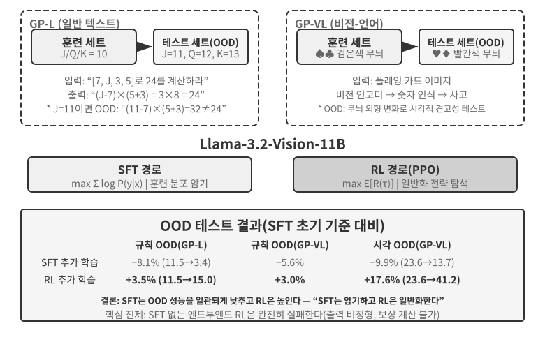
>
> GeneralPoints는 Chu et al.(2025, “SFT Memorizes, RL Generalizes,” arXiv:2501.17161)이 제안한 산술 문제 해결 카드 게임으로, 모델의 일반화를 평가하기 위해 특별히 설계되었다. 목표는 ‘24 게임’과 비슷하다. 카드에 표시된 숫자 네 개를 각각 정확히 한 번씩 사용하고 덧셈·뺄셈·곱셈·나눗셈으로 조합하여 목표 숫자 24를 만든다. 실험에서는 텍스트 전용 GP-L과 이미지 기반 GP-VL이라는 두 가지 변형을 설계하여 같은 프레임워크에서 규칙 일반화와 시각 일반화를 살펴본다.
>
> **규칙 변형**: 훈련 중에는 J/Q/K를 모두 10으로 계산하고, 테스트에서는 각각 11/12/13으로 계산한다. 테스트 세트에 한 번도 보지 못한 숫자 조합(11, 12, 13이 포함된 연산)을 넣어 일반화를 엄격하게 평가한다. **시각 변형**: 훈련에는 검은색 무늬(♠♣)를, 테스트에는 빨간색 무늬(♥♦)를 사용하여 시각적 외형의 변화에 대한 견고성을 평가한다. 실험은 Llama-3.2-Vision-11B로 표준 사후 학습 파이프라인을 따른다. 먼저 SFT 초기화를 통해 모델에 기본적인 지시 따르기 능력을 부여한다. 이어 같은 계산 예산 아래에서 추가 SFT와 RL을 별도 분기로 훈련하며, RL에는 PPO와 가치 네트워크를 사용한다. 두 분기 모두 J/Q/K=10이라는 단일 규칙을 사용하는 데이터로 훈련하고 분포 내(ID) 및 분포 밖(OOD) 테스트 세트에서 평가한다.
>
> 결과는 근본적인 차이를 명확히 보여 준다. **규칙 OOD**: GP-L에서 RL은 +3.5%포인트(11.5%→15.0%) 향상된 반면 SFT는 8.1%포인트(11.5%→3.4%) **하락**했다. GP-VL에서는 RL이 +3.0%포인트 향상되고 SFT는 5.6%포인트 하락했다. **시각 OOD**: GP-VL에서 RL은 **+17.6%포인트**(23.6%→41.2%) 향상된 반면 SFT는 9.9%포인트(23.6%→13.7%) 하락했다.
>
> 시각 인식 정확도를 추적하면 RL이 결과 지향적 최적화를 통해 기반 비전 인코더를 개선하며, 이 개선이 전체 성능 향상과 높은 상관관계를 보임을 알 수 있다. 반면 SFT는 사고 과정의 토큰 패턴에 과적합하고 시각 토큰 학습을 소홀히 하여 인식 정확도가 낮아진다.
>
> 이 실험은 RL에 SFT가 필요한 이유도 보여 준다. 실험 조건(Llama-3.2-Vision-11B 규모의 기반 모델과 엄격한 구조화 출력 요구 사항)에서 SFT 없이 곧바로 엔드투엔드 RL을 수행하면 완전히 실패한다. 기반 모델이 구조화 출력을 만들지 못해 보상을 전혀 계산할 수 없다. 이는 특정 조건에서 얻은 결론이지 보편적인 법칙은 아니다. 충분히 강한 기반 모델이라면 SFT를 건너뛰고 직접 RL에 성공할 수 있다. 앞선 DeepSeek-R1-Zero 논의를 참고하라. 또 하나 주목할 발견은 검증 반복 횟수가 많을수록 일반화가 좋아진다는 점이다. 10회 반복은 +5.99%, 1회 반복은 +0.48%로, 사고 중의 계산 확장이 RL 일반화의 핵심임을 보여 준다.
>
> 분포가 이동하면 SFT 성능은 무너지는데 RL은 더 나은 성능을 내는 이유가 무엇일까? SFT는 “이 입력이 주어지면 저 답을 출력한다”는 매핑을 학습한다. 훈련 중 J/Q/K가 모두 10이므로 “J/Q/K를 만나면 10으로 취급한다”는 고정 패턴을 외운다. 테스트에서 J=11이 되어도 여전히 10으로 계산하므로 자연히 오류가 난다. RL은 “어떤 계산 과정이 정답을 만드는가”라는 더 일반적인 전략을 학습한다. J가 11로 바뀌면 RL 모델은 외운 답을 적용하지 않고 같은 전략으로 다시 계산한다. 이것이 ‘암기’와 ‘일반화’의 본질적인 차이이다.
>
> 이 실험의 핵심 기여는 “SFT는 암기하고, RL은 일반화한다”는 현상을 체계적으로 정량화하고, 이 패턴이 텍스트 전용과 비전-언어 양식 모두에서 성립함을 보여 준 것이다. SFT와 RL의 상호 보완적인 관계도 드러낸다. SFT는 형식 안정성을 제공하고, RL은 그 토대 위에서 암기의 한계를 넘어선다. 둘 다 빠질 수 없다. 중국 회화의 표현을 빌린 “형태가 먼저이고 정신이 나중이다”라는 훈련 패러다임, 즉 외적 형태(형식, 구조)를 먼저 정확히 그리고 내적 정신(일반화, 전략)을 추구하는 방식은 이어지는 멀티 턴·멀티모달 과업의 방법론적 토대가 된다.

## RLHF: 인간 선호에서 보상 모델까지

앞선 실험에는 공통된 전제가 있다. 수식이 맞는지, 형식이 규칙을 따르는지처럼 과업의 정오를 검증할 수 있어 규칙 기반 검증기로 점수를 매길 수 있다. 그러나 오늘날 배포되는 대화 모델이 ‘쓸 만하고 안전한 어시스턴트’처럼 행동하는 것은 더 일찍 성숙한 다른 연구 계열인 **인간 피드백을 통한 강화 학습(RLHF)** 덕분이다. RLHF를 이해해야 ChatGPT 같은 제품의 대화 품질과 안전 정렬이 어디에서 오는지 알 수 있다. 또한 뒤에서 다룰 알고리즘의 KL 페널티와 보상 해킹 같은 개념을 이해하기 위한 전제이기도 하다.

**InstructGPT의 3단계 파이프라인.** OpenAI의 InstructGPT[^ch7-4]는 오늘날에도 사용하는 표준 절차를 확립했다.

1. **SFT**: 인간이 시연한 ‘지시-응답’ 쌍으로 사전 학습된 모델을 미세 조정하여 기본적인 지시 따르기 능력을 확립한다. 앞의 “SFT(지도 미세 조정)” 절에서 다룬 내용이다.
2. **보상 모델(RM) 훈련**: 같은 프롬프트에 대해 모델이 여러 응답을 생성하게 하고, 인간 주석자가 응답을 두 개씩 비교해 어느 것을 선호하는지 표시한다. 이 선호 쌍으로 점수 모델을 훈련하며, 훈련 목표는 Bradley-Terry 모델에 기반한다.

   $$\mathcal{L}_{\text{RM}} = -\log \sigma\big(r(x, y_w) - r(x, y_l)\big)$$

   여기서 $y_w$는 선호 응답, $y_l$은 거부된 응답, $\sigma$는 시그모이드 함수이다. 직관은 매우 간단하다. **RM이 선호 응답에 더 높은 점수를 주게 한다.** 점수 대신 비교를 수집하는 이유는 인간이 일관되게 절대 점수를 매기기 어렵기 때문이다. “이 응답은 7.3점이다”라는 판단에 일관된 레이블을 붙이기는 거의 불가능하지만, “A와 B 중 무엇이 더 나은가”라는 판단은 훨씬 신뢰할 수 있다. **이 장 전체에서 반복해서 등장하는 ‘보상 모델’의 역할을 기억하라.** 여기서는 인간 선호에서 학습한 채점기이다. 보상 설계를 다루는 7.10절에서는 최종 결과만 보는 ORM, 단계별로 점수를 매기는 PRM, 자연어로 사고를 제공하는 생성형 보상 모델 등 여러 형태를 살펴본다. 정오를 규칙으로 직접 판정할 수 있을 때는 ‘보상 모델’이 결정론적인 코드 조각으로 단순화되며, 이것이 아래에서 설명할 RLVR이다. 모두 같은 질문에 답한다. **보상은 어디에서 오는가?**
3. **RM 점수로 PPO 수행**: RM 점수를 보상 신호로 사용하여 SFT 모델에 PPO 훈련을 수행한다. PPO의 메커니즘은 다음 절에서 설명한다. 모델은 RM이 “인간이 선호할 것”이라고 판단하는 응답을 생성하는 법을 배운다.

**KL 페널티: 출발점에서 너무 멀리 벗어나지 않기(KL 발산 완전 해설).** RLHF에서 모델이 실제로 최적화하는 보상은 보통 RM 점수 자체가 아니라, 여기에 페널티 항을 뺀 값이다.

$$r = r_{\text{RM}} - \beta \cdot \mathrm{KL}\big(\pi_\theta \,\|\, \pi_{\text{ref}}\big)$$

이 식 하나를 보면 초보자가 흔히 네 가지 질문을 떠올린다. 하나씩 답해 보자.

**(1) KL 발산이란 무엇이며 페널티는 어디에 적용하는가?** KL 발산(Kullback-Leibler Divergence)은 두 확률 분포의 차이를 측정한다. 두 분포가 비슷할수록 KL이 작고, 완전히 같으면 0이 되며, 다를수록 커진다. 비교하는 두 분포는 같은 선행 컨텍스트가 주어졌을 때 **현재 정책** $\pi_\theta$(훈련 중인 모델)과 **참조 정책** $\pi_{\text{ref}}$(훈련 출발점, 보통 SFT 모델)가 생성하는 다음 토큰 확률 분포이다. $\beta$는 페널티 강도를 제어하며 훈련 스크립트에서 흔히 볼 수 있는 `kl_coef` 하이퍼파라미터이다. 엔지니어링 관점에서 이 페널티는 **토큰마다 계산하여 보상에 더한다**(토큰별 KL). 모델이 토큰을 생성할 때마다 해당 토큰의 확률을 같은 위치에서 참조 모델이 부여한 확률과 비교한다. 차이가 클수록 그 단계의 보상에 더 큰 페널티를 적용한다. 다시 말해 KL은 별도의 손실 항이 아니라 **보상 신호에 섞이며**, 그 보상 신호가 PPO/GRPO의 어드밴티지 계산을 거친다. 이것이 KL이 작용하는 정확한 지점이다.

**(2) 왜 ‘현재 정책 먼저, 참조 정책 나중’ 방향인가?** KL 발산은 비대칭이어서 $\mathrm{KL}(P\|Q)\neq\mathrm{KL}(Q\|P)$이므로 방향을 임의로 정할 수 없다. 여기서는 현재 정책을 먼저 둔 $\mathrm{KL}(\pi_\theta\|\pi_{\text{ref}})$로 쓰며, 수학적으로 **역방향 KL**이라고 한다. 이는 “$\pi_\theta$가 어떤 곳에 높은 확률을 부여하지만 $\pi_{\text{ref}}$는 그곳에 거의 0의 확률을 부여하는” 상황, 즉 **모델이 참조 모델의 관점에서 가면 안 되는 곳으로 가는 행동에 페널티를 준다**. 바로 우리가 원하는 효과이다. 참조 모델(SFT 모델)은 자연스럽게 말하고 정상적인 형식을 따르는 안전 영역을 나타낸다. 역방향 KL은 현재 정책이 크게 이탈하지 않고 그 영역 근처에 머무르게 한다. 대신 **정방향 KL** $\mathrm{KL}(\pi_{\text{ref}}\|\pi_\theta)$을 사용하면 “참조 모델에는 있지만 현재 모델이 놓친” 패턴에 페널티를 주게 된다. 이는 모델이 참조 모델의 모든 표현 스타일을 포괄하게 강제하며, RLHF의 목표와 정확히 반대이다.

**(3) 왜 이렇게 설계하는가?—모드 탐색의 기원.** 역방향 KL에는 **모드 탐색**이라는 핵심 특성이 있다. 7.1절에서 이미 토대를 마련했다. 역방향 KL에서는 모델이 SFT의 최대 우도처럼 모든 것을 똑같이 포괄할 필요 없이 **보상이 높은 소수의 ‘모드’만 유지하고 나머지는 단호하게 버릴 수 있다**. RLHF에서는 바로 이 효과를 원한다. 가능한 모든 응답을 배우는 대신 RM이 인정하는 고득점 응답 스타일 한두 개를 선택해 일관되게 생성한다. RL 뒤 모델이 더 ‘단호’해 보이고 다양성이 줄어드는 이유도 설명한다. 역방향 KL의 모드 탐색 행동과 모델을 참조 분포 근처에 유지하는 능력이 함께 RLHF 안정성의 핵심을 이룬다.

**(4) KL이 없으면 어떻게 되는가?** 직관은 간단하다. **출발점에서 너무 멀리 벗어나면 보상 모델의 점수를 신뢰할 수 없게 된다.** RM은 참조 정책 근처의 출력 분포로 훈련된다. 모델을 RM이 한 번도 본 적 없는 분포까지 최적화하면 RM 점수는 근거 없는 외삽이 되며, 높은 점수가 더 이상 높은 품질을 뜻하지 않는다. 따라서 KL 페널티는 **보상 해킹**과 **분포 붕괴**를 동시에 방지한다. 보상 해킹은 모델이 보상의 허점을 악용하여 실제 과업을 잘 수행하지 않고도 높은 점수를 받는 현상이며 다음 문단에서 설명한다. 분포 붕괴는 출력이 반복이나 횡설수설 같은 극단적인 형태로 퇴화하는 현상이다. 검증 가능한 보상을 사용하는 RLVR 훈련에서도 안정화를 위해 KL 정규화를 유지하는 경우가 많다. DAPO와 Open-Reasoner-Zero 같은 일부 연구는 의도적으로 제거하지만, DeepSeek-R1-Zero의 GRPO 자체에는 여전히 KL 항이 명시적으로 들어 있다는 점에 유의하라.

**보상 모델도 ‘과도하게 최적화’될 수 있다.** 결국 RM은 인간 선호를 대신하는 대리 지표일 뿐이다. Goodhart의 법칙에 따르면 지표가 최적화 목표가 되는 순간 좋은 지표로서의 기능을 잃는다. 대리 지표를 극단까지 밀어붙이면 실제 목표와의 상관관계가 왜곡된다. OpenAI 연구[^ch7-5]는 이러한 **보상 모델 과최적화** 현상을 체계적으로 측정했다. RL 훈련이 진행될수록 대리 보상(RM 점수)은 단조 증가하지만 실제 품질(인간 평가)은 처음에는 오르다가 나중에는 떨어진다. 모델이 점차 배우는 것은 더 잘 답하는 법이 아니라 RM이 높은 점수를 주게 하는 법이다. 장황하고 비위를 맞추며 엄밀해 보이지만 내용은 빈말인 응답을 생성한다. RLHF 맥락에서 나타나는 구체적인 보상 해킹이며, KL 페널티와 조기 종료가 가장 흔한 완화 방법이다. 장 끝의 “흔한 함정” 절에 나오는 보상 해킹 문제도 기원이 같다.

**DPO: 명시적 보상 모델 건너뛰기.** DPO(직접 선호 최적화)[^ch7-6]는 다음 전제에서 출발한다. ‘RM 훈련 + PPO’의 최종 결과가 “참조 모델에서 너무 멀리 벗어나지 않으면서 선호 응답의 확률을 높이고 거부 응답의 확률을 낮추는 것”이라면, 명시적인 RM을 건너뛰고 선호 쌍을 암묵적 보상이 포함된 분류 손실로 직접 바꾸면 어떨까? 수학적으로 이는 KL 제약을 적용한 오프라인 선호 최적화와 동등하며, 보상 모델이 정책 자체에 암묵적으로 내장됨을 보일 수 있다. DPO 훈련은 SFT만큼 단순하다. 온라인 샘플링이나 가치 네트워크가 필요 없고 별도의 RM을 유지할 필요도 없다. 그 대가로 완전히 오프라인이다. 선호 데이터 밖의 새로운 행동을 탐색할 수 없으며, 성능 상한은 선호 데이터의 품질과 포괄 범위에 따라 결정된다.

**RLHF와 RLVR의 관계.** 요약하면 두 접근법은 **보상이 어디에서 오는가**에 따라 다르다. RLHF의 보상은 인간 선호 데이터로 학습한 RM에서 온다. **RLVR**(검증 가능한 보상을 통한 강화 학습)은 테스트를 통과했는지, 답이 맞는지 판단하는 규칙 기반 검증기를 사용한다. 에이전트 과업은 대체로 검증할 수 있으며, 이 장이 RLVR을 주된 흐름으로 삼는 이유도 바로 이것이다. 그러나 둘 중 하나만 선택하는 관계는 아니다. 실무에 배포하는 모델은 두 방법을 함께 사용한다. RLHF는 대화 품질과 안전 정렬을 담당하고, RLVR은 사고 및 에이전트 역량을 담당한다. 뒤쪽의 “보상 패러다임의 진화” 절에서 다룰 생성형 보상 모델은 두 계열이 합류한 것으로 볼 수 있다. 훈련 가능한 보상 모델을 사용하여 규칙으로 포괄할 수 없는 개방형 과업을 처리한다.

## 강화 학습 알고리즘 비교

앞선 단일 턴 실험에서는 RL의 일반화 이점을 보여 주었고, 이전 절에서는 RLHF의 선호 최적화 접근법을 소개했다. 그러나 각 연구에서 사용하는 구체적인 알고리즘은 서로 다르며, 많은 선택지 중 일부에 불과하다. 더 복잡한 멀티 턴 과업으로 넘어가기 전에 주류 알고리즘의 특성과 적용 시나리오를 체계적으로 살펴볼 필요가 있다.

> **수식 속에서 길을 잃지 않도록 가장 중요한 점부터 말하겠다.** 이 절에는 알고리즘 이름과 방정식이 꽤 많이 등장하지만 이 장의 주제 2를 기억하라. **업계에서는 기성 RL 알고리즘(PPO, GRPO 등)의 사용법을 알고 올바른 것을 선택할 수 있으면 충분하다. 실제 성공과 실패를 결정하는 것은 알고리즘이 아니라 데이터와 환경이다.** 이러한 알고리즘은 이미 veRL과 TRL 같은 성숙한 프레임워크에 패키징되어 있으며, 보통 설정 몇 줄만 바꾸면 사용할 수 있다. 따라서 이 절의 목표는 유도 과정을 가르치는 것이 아니라 어떤 시나리오에 어떤 알고리즘을 쓸지 선택하는 지도를 제공하는 것이다. 훈련 엔지니어를 위한 수식 부분은 건너뛰어도 전체 흐름을 놓치지 않는다. 다음 절에서는 알고리즘보다 데이터와 환경이 중요한 이유를 본격적으로 설명한다.

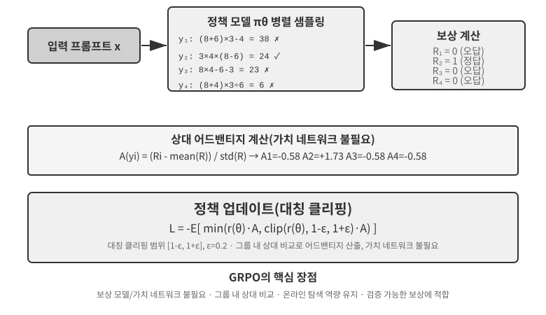

현대 LLM 에이전트의 RL 시나리오는 전통적인 RL과 근본적으로 다르다. 에이전트는 사용자 의도를 이해하고 도구를 호출하며 구조화 출력을 생성하고 여러 대화 턴에 걸쳐 긴 사고의 연쇄를 수행해야 한다. 이러한 다중 목표·다단계 의사결정에서 ‘올바른 알고리즘 선택’도 어느 정도 영향을 미치지만 데이터와 환경에 비하면 훨씬 작다.

구현 관점에서 RL 알고리즘은 환경과 상호작용하며 새로운 전략을 탐색하는 **온라인 탐색 방법**과 기존 데이터에 기반해 더 안정적이고 직접적으로 최적화하는 **오프라인 최적화 방법**으로 나뉜다. 앞서 약속한 엄밀한 용어도 여기서 설명한다. **온폴리시** 방법은 같은 정책에서 새로 샘플링한 데이터만 사용해 정책을 갱신한다. **오프폴리시** 방법은 앞서 본 Q-learning처럼 다른 정책이나 이전 버전의 정책이 생성한 데이터에서도 학습할 수 있다. 이 장의 방법을 이 정의에 대응시키면 다음과 같다. SFT는 데이터가 모델 자체가 아닌 교사 또는 인간 시연에서 오므로 오프폴리시 모방 학습이다. LLM 훈련에 사용하는 표준 PPO와 GRPO는 온폴리시 방식으로, 각 라운드에서 현재 모델이 새로 샘플링한 롤아웃(모델이 과업 전체를 한 번 실행하여 처음부터 끝까지 완전한 궤적을 생성한 것)을 사용해 갱신한다. DPO는 온라인 샘플링도 엄격한 정책 반복도 없는 오프라인 선호 최적화이다.

이러한 알고리즘 대부분은 **정책 그래디언트**라는 같은 아이디어를 토대로 한다. 정책 매개변수 $\theta$를 ‘기대 수익을 높이는’ 방향으로 조정한다. 가장 기본적인 형태(REINFORCE)는 다음과 같다.

$$\nabla_\theta J(\theta) = \mathbb{E}\big[\nabla_\theta \log \pi_\theta(a \mid s)\, G\big]$$

여기서 $\pi_\theta(a\mid s)$는 상태 $s$에서 행동 $a$를 선택할 확률인 정책이고, $G$는 이 궤적 전체 또는 해당 단계 이후의 누적 수익이다. 수익이 높을수록 모델이 해당 행동의 확률을 더 강하게 높인다. 전체 궤적의 수익 $G$를 가중치로 사용하면 편향은 없지만 분산이 크다. 따라서 기준선 $b$를 도입하고, **어드밴티지** $\hat{A}=G-b$(이 행동이 평균보다 얼마나 더 나은가)를 가중치로 사용해 분산을 줄인다. 뒤에서 다룰 PPO와 GRPO는 본질적으로 “어드밴티지 $\hat{A}$를 안정적으로 추정하고 사용하는 방법”에 대한 두 가지 개선안이다.

**PPO**는 ‘클리핑’을 사용해 각 단계의 갱신 폭을 제한하여 정책이 한 번에 너무 멀리 벗어나지 않도록 한다.

$$L^{\text{CLIP}}(\theta) = \mathbb{E}\Big[\min\big(\rho\,\hat{A},\ \operatorname{clip}(\rho,\, 1-\epsilon,\, 1+\epsilon)\,\hat{A}\big)\Big],\quad \rho = \frac{\pi_\theta(a\mid s)}{\pi_{\theta_{\text{old}}}(a\mid s)}$$

여기서 $\rho$는 새 정책과 이전 정책의 확률 비율이고, $\epsilon$(예: 0.2)은 단계별 조정 범위를 제한한다. 뒤에서 언급할 ‘Clip-Higher’는 구체적으로 상한 $1+\epsilon$을 완화한다.

**GRPO**는 PPO가 궤적의 각 단계에서 가치 함수를 별도로 추정하고 더 세밀한 어드밴티지를 계산하기 위해 훈련하는 보조 신경망인 가치 네트워크를 제거한다. 대신 ‘그룹 내 상대 비교’로 어드밴티지를 추정한다. 같은 문제에 대해 $N$개 궤적을 샘플링해 수익 $r_1,\dots,r_N$을 얻고, 각 궤적의 어드밴티지를 그룹 안에서의 상대적 성과로 정의한다.

$$\hat{A}_i = \frac{r_i - \operatorname{mean}(r_1,\dots,r_N)}{\operatorname{std}(r_1,\dots,r_N)}$$

즉 “그룹 평균보다 좋으면 양수, 나쁘면 음수”이며 가치 네트워크가 필요 없다. 그래서 비용이 더 낮다. 위 식에서는 KL 정규화 항을 생략했다. 실제 훈련에서는 보통 이전 절에서 소개한 토큰별 KL 페널티를 추가하여 정책을 참조 모델 근처로 제한한다.

표 7-4는 주류 방법의 핵심 특성을 요약한다. 흔히 혼동하는 두 가지를 구별하며 읽어야 한다. 하나는 규칙 검증기, 학습된 보상 모델, 인간 선호 데이터 중 **보상이 어디에서 오는가**이고, 다른 하나는 **최적화에 어떤 알고리즘을 사용하는가**이다. PPO와 GRPO는 보상 출처를 가리지 않으며 규칙 검증기(RLVR)와 보상 모델(RLHF) 중 어느 쪽에도 연결할 수 있다. 실제 차이는 가치 네트워크와 그룹 상대 기준선이라는 어드밴티지 추정 방식에 있다.

표 7-4 사후 학습 및 추론 시점 최적화 방법 비교

| 방법 | 유형 | 핵심 아이디어 | 장점 | 단점 | 적용 시나리오 |
|--------------|---------------|---------------|--------------|------------------|-------------------------|
| **REINFORCE** | 온라인 RL 알고리즘 | 전체 궤적의 최종 보상으로 정책 갱신 | 구현이 단순함 | 분산이 크고 훈련이 불안정함 | 이론적 기준선. 원형을 직접 사용하는 경우는 드물지만 기준선이 있는 변형(RLOO, REINFORCE++ 등)은 현재 주류에 속함. GRPO는 본질적으로 그룹 상대 기준선을 적용한 REINFORCE |
| **PPO** | 온라인 RL 알고리즘 | 정책이 ‘탈선’하지 않도록 단계별 갱신 폭 제한 | 안정적이며 가치 네트워크가 더 세밀한 기여도 할당 제공 | 가치 네트워크를 추가로 훈련·저장해야 하며 하이퍼파라미터에 민감함 | 멀티 턴 에이전트, 긴 궤적의 기여도 할당 |
| **GRPO** | 온라인 RL 알고리즘 | 같은 문제에 여러 궤적을 샘플링하고 그룹 안에서 상대 품질 비교 | 가치 네트워크가 필요 없어 비용이 낮음 | 응답 전체에 같은 어드밴티지를 할당하여 기여도 할당이 거침. 그룹 내 궤적을 구별하는 보상이 필요함 | 보상 판별력이 좋은 단일 턴 또는 짧은 궤적 과업 |
| **DPO** | 오프라인 선호 최적화 | 선호 쌍을 암묵적 보상이 포함된 분류 손실로 직접 변환 | 매우 단순하고 효율적이며 온라인 샘플링 불필요 | 새 정책을 탐색할 수 없고 오프라인 선호 데이터의 품질과 포괄 범위에 제한됨 | 고품질 선호 데이터가 이미 있는 시나리오 |
| **KTO** | 오프라인 선호 최적화 | 단일 샘플의 ‘좋음/나쁨’ 레이블만 필요 | 주석 비용이 매우 낮음 | 신호가 거침 | 주석 자원이 극히 제한된 시나리오 |
| **Best-of-N** | 추론 시점 방법 | 추론 시 N개 출력을 생성하고 가장 좋은 것을 선택 | 모델을 수정하지 않으며 구현이 단순함 | 추론 비용이 배수로 증가하고 역량이 매개변수에 내장되지 않음 | 초기 단계의 빠른 품질 향상, RL 보상의 상한 추정 |

이 장의 실험으로 돌아와 각 실험에서 사용한 알고리즘을 명확히 하자. GeneralPoints와 V-IRL(실험 7-11, 7-12)은 같은 연구에서 나왔으며 가치 네트워크를 사용하는 PPO를 쓴다. AdaptThink(실험 7-10)는 중요도 샘플링이 포함된 맞춤형 제약 최적화 목표를 사용한다. 뒤쪽의 ReTool(실험 7-15)은 veRL 기반의 수정된 PPO 구현을 사용한다. 훈련 데이터는 DAPO-Math-17k에서 왔지만 최적화 알고리즘은 여전히 PPO이다. SimpleVLA-RL(실험 7-13)과 RLVP(실험 7-14)는 GRPO 기반이다. 멀티 턴 시나리오에서는 기여도 할당 문제가 더 복잡하며 알고리즘마다 장단점이 있다.

실용적인 선택 경로는 다음과 같다. 보상 신호를 신뢰할 수 있고 계산 자원이 충분하다면 단순성을 원할 때 GRPO를, 긴 궤적에서 유연성과 더 세밀한 기여도 할당이 필요할 때 PPO를 선택한다. 고품질 선호 데이터가 있다면 더 저렴한 DPO나 KTO를 선택한다. 초기 탐색 단계에서는 Best-of-N으로 빠르게 시작한다.

이 표를 보고 “그렇다면 미세 조정에 어떤 알고리즘을 사용해야 할까?”라고 생각할 수 있다. 답은 의외일지도 모른다. **대부분은 어느 것이든 괜찮다. 처음부터 알고리즘에 집착하지 마라.** 다음 절이 바로 이 주제를 다룬다.

## 알고리즘보다 중요한 데이터와 환경

이 장에서 가장 기억하기를 바라는 절이며, 주제 2를 정면으로 다룬다. 알고리즘에 상당한 분량을 할애했지만 업계 현장의 경험은 반대 방향을 가리킨다. **알고리즘은 시뮬레이션 환경의 충실도, 훈련 데이터의 품질, 기반 모델의 역량이라는 더 기본적인 세 요소보다 훨씬 덜 중요하다.** 기존 알고리즘의 사용법을 아는 것으로 충분하며, 팀의 차이는 환경을 얼마나 잘 구축하고 데이터를 얼마나 정교하게 선별하는지에서 생긴다. 이는 6장의 결론, 즉 평가 및 시뮬레이션 환경이 사후 학습의 초석이라는 점과 7.2절에서 설명한 OpenAI의 반전을 되풀이한다. 수십 년 동안 RL 연구는 우선순위를 거꾸로 두었으며, 실제 순서는 **사전 지식(기반 모델) > 환경 > 알고리즘**이다.

### 환경: 모델의 훈련장

RL의 본질은 ‘시행착오 학습’이며 시행착오에는 **훈련장**, 즉 시뮬레이션 환경이 필요하다. 모델은 환경에서 과업을 반복 실행하고 피드백을 받으며 정책을 조정한다. 환경이 실제 배포 시나리오를 얼마나 닮았는지를 나타내는 **충실도**가 훈련된 정책의 실용성을 직접 결정한다.

- **왜곡된 환경은 죽은 정책을 만든다.** 시뮬레이션된 고객 서비스 담당자가 항상 고정된 스크립트로 답하고 오류 메시지가 프로덕션과 다르면, 모델은 시뮬레이션에서만 작동하고 배포하는 순간 무너지는 시험 대비 전략을 배운다. RL 프로젝트가 죽는 가장 흔한 방식이다. 알고리즘이 나빠서가 아니라 연습장이 시험장과 달랐기 때문이다.
- **충실도 높은 환경을 구축하는 일은 훈련 자체보다 어렵고 비싼 경우가 많다.** 대규모 병렬 처리, 신뢰할 수 있는 재현성, 현실적인 피드백을 지원하는 환경에는 일반적으로 모델 튜닝보다 훨씬 많은 엔지니어링 노력이 필요하다. 이 장 뒤쪽의 도구 호출 실험인 AWorld의 MCP 샌드박스와 ReTool의 코드 인터프리터 샌드박스가 환경 엔지니어링에 막대한 투자를 하는 이유는 간단하다. **실제 API에는 호출 제한이 있고 계정을 차단할 수 있으며 부작용도 생기므로 훈련에 직접 사용할 수 없다.** 먼저 안정적이고 제어 가능하며 재생 가능한 ‘그림자 세계’를 구축해야 한다.
- **환경의 나머지 절반은 보상 함수이다.** 환경은 ‘세계가 어떻게 변하는지’를 시뮬레이션할 뿐 아니라 ‘행동이 좋았는지 나빴는지’도 판정해야 한다. 이것이 보상 신호의 출처이다. 보상 설계는 환경 엔지니어링의 일부이며 다음 절에서 더 자세히 설명한다.

요약하면 **알고리즘 튜닝을 시작하기 전에 자신의 시뮬레이션 환경이 실제 세계를 정말 닮았는지 물어보라.** 이 질문의 답은 PPO와 GRPO 중 하나를 고르는 것보다 훨씬 중요하다.

### 환경을 구축할 수 없다면? 모델에게 환경 역할 맡기기

더 근본적인 문제도 있다. 많은 시나리오에서 충실도 높은 환경은 ‘비싼’ 것이 아니라 **아예 구축할 수 없다**. 실제 API에는 부작용이 있어 함부로 호출할 수 없고, 실제 사용자를 시행착오에 동원할 수 없으며, 물리적 세계를 빠르게 돌릴 수도 없다. 쓸 만한 ‘그림자 세계’조차 세울 수 없다면 RL을 포기해야 할까? 점점 주류가 되는 답은 **모델로 환경을 시뮬레이션하는 것**이다. LLM이 환경 역할을 맡아 에이전트와 상호작용하는 데 필요한 피드백을 생성한다. 이 경로에는 두 수준이 있다.

**첫 번째 수준: 모델이 도구 호출 반환값을 합성한다.** ZeroSearch(2025)를 예로 들자[^ch7-13]. ‘검색할 줄 아는 모델’을 훈련하려면 보통 실제 검색 엔진이 필요하지만 검색 API는 비용이 들고 호출 제한이 있으며 결과도 제어할 수 없다. ZeroSearch는 단순히 LLM이 검색 엔진 역할을 하게 한다. 학생 모델이 검색 질의를 내면 이 ‘시뮬레이션 엔진’이 학생에게 돌려줄 검색 결과를 생성한다. 더 나아가 **커리큘럼 방식** 설계를 사용한다. 훈련 초반에는 시뮬레이션 엔진이 품질과 관련성이 높은 문서를 반환한다. 훈련이 진행되면 잡음을 조금씩 섞고 반환 품질을 낮춰 학생이 실제 검색 엔진의 불완전한 결과에서 유용한 정보를 추출하는 법을 배우게 한다. 결국 훈련 중 실제 검색 엔진을 한 번도 보지 못한 모델도 실제 검색에 직접 연결하면 좋은 성능을 낸다.

**두 번째 수준: 모델이 환경 전체의 동역학을 시뮬레이션한다.** 단일 도구의 반환값뿐 아니라 “행동을 취한 뒤 세계가 어떤 모습이 되는가”까지 모델에 맡길 수 있다. DreamGym(2025)[^ch7-14]은 환경 동역학을 사고형 ‘경험 모델’로 증류한다. 현재 상태와 에이전트 행동이 주어지면 단계별로 사고하여 상태 전이와 피드백 신호를 생성한다. 그 결과 실제 환경에 접근하지 않고도 온라인 RL용 롤아웃을 대량 합성할 수 있다. 고객 서비스 및 영업 에이전트 훈련에서는 흔히 LLM이 사용자 역할(사용자 시뮬레이터)을 맡으며, τ-bench 평가 계열도 바로 이 아이디어 위에 구축되었다. 같은 모델 시뮬레이터가 시험장이자 연습장이 될 수 있다.

그러나 이 경로의 위험도 분명히 말해야 한다. **시뮬레이터의 세계 지식이 훈련의 상한이며, 시뮬레이터의 체계적인 편향은 정책이 그대로 흡수한다.** 시뮬레이션 고객 서비스 담당자가 실제 사용자보다 인내심이 많거나 시뮬레이션 검색 엔진이 쓰레기 결과를 전혀 반환하지 않는다면, 학생은 ‘모델이 연기한 세계’에서만 작동하는 정책을 배운다. 더 나쁘게는 RL이 시뮬레이터의 허점을 적극적으로 찾아 악용하며 보상 해킹을 벌인다. 따라서 건전한 엔지니어링 관행은 **혼합**이다. 상호작용 대부분은 모델 시뮬레이션이 담당하고 실제 환경 상호작용으로 보완하며, 실제 환경 상호작용을 사용해 시뮬레이터의 편향을 주기적으로 보정한다.

### 데이터: 가장 중요한 연결 고리, 무엇보다 품질

환경이 훈련장이라면 **데이터는 교과서이며 세 요소 가운데 가장 중요하다.** 여기서 ‘데이터’란 SFT 단계의 시연 샘플(입력-출력 쌍)과 RL 단계의 과업 분포 및 보상 신호를 말한다. 어느 단계든 한 가지 철칙이 있다.

> **데이터 품질은 알고리즘을 능가한다.** 가장 정교한 알고리즘에 지저분하거나 군데군데 비어 있거나 체계적으로 편향된 데이터를 넣으면, 학습하는 정책도 지저분해진다. SFT는 데이터의 잡음과 편향을 매개변수에 그대로 새긴다. RL은 편향된 보상을 향해 끈질기게 최적화하며 점점 더 잘못된 방향으로 나아간다. 보상 해킹이 자라나는 토양이다. 사후 학습에서는 **쓰레기를 넣으면 쓰레기가 나온다**는 원칙이 완전히 드러난다.

게다가 많은 팀이 놓치지만 큰 비용을 아낄 수 있는 통찰이 있다.

> **많은 시나리오에서 SFT 데이터의 품질이 충분히 높다면 RL은 전혀 필요하지 않다.** RL은 비용이 많이 들고 불안정하며 흔히 SFT의 수십~수백 배가 들지만, 팀들은 습관처럼 RL부터 찾는다. 과업 분포를 예측할 수 있고 충분히 다양하며 품질 높은 시연을 모을 수 있다면 견고한 SFT만으로 충분한 경우가 많다. RL을 정말 대체할 수 없는 시나리오는 제한적이다(7.5절 참고). 배포 분포가 체계적으로 이동하거나, 전문가 시연 자체가 최적이 아니거나, 모든 경로를 시연하기에는 주석 비용이 너무 많이 드는 경우이다. **먼저 SFT 데이터를 올바르게 만들고, 그다음 RL이 실제로 필요한지 결정하라.** 이 순서만으로도 막대한 계산 자원과 시간을 아낄 수 있다.

설득력 있는 업계 사례가 Anthropic이다. 2025년 이전 Anthropic의 사후 학습 레시피는 **방대한 고품질 데이터에 대한 SFT**와 **RLAIF**(AI 피드백을 통한 강화 학습. Bai et al. 2022의 Constitutional AI는 ‘헌법’을 사용해 모델이 정렬을 위해 자신의 응답을 채점하도록 이끈다)라는 두 가지 주요 부분으로 구성되었고, **현재 코드와 사고 과업의 표준인 RLVR(검증 가능한 보상을 통한 강화 학습)에는 거의 의존하지 않았다.** 그런데도 당시 코딩 모델은 이미 뛰어났다. 그 이유는 알고리즘보다 Anthropic이 SFT와 RLAIF 양쪽에서 데이터 품질을 극한까지 끌어올린 데 있다. 이는 앞의 판단을 확인해 준다. **SFT 데이터가 충분히 좋으면 단순한 레시피에도 정교한 검증 가능 보상 RL이 필요하지 않을 수 있다.** 그렇다고 RL이 쓸모없다는 뜻은 아니다. Anthropic은 2025년부터 RL에 대대적으로 투자했다. 좋은 데이터라는 토대 위에서 RL이 역량의 상한을 더 높인다. **데이터는 얼마나 멀리 갈지를, RL은 얼마나 더 높이 갈지를 결정한다.**

데이터 품질은 구체적으로 무엇을 뜻할까? 적어도 세 가지 차원이 있다. **포괄 범위**는 배포 중 마주치는 여러 상황, 특히 롱테일과 경계 사례를 포괄하는지를 뜻한다. **다양성**은 시연의 화자, 스타일, 해법이 충분히 다채로운지를 뜻한다. 그렇지 않으면 실험 7-6의 ‘모두가 같은 어조로 말하기’처럼 모델이 하나의 모드로 붕괴한다. **주석 정확도**는 시연 답안 자체가 맞는지를 뜻한다. 특히 사고의 연쇄 증류에서는 잘못된 사고 과정을 학생이 모방한다. 그래서 실험 7-9에서는 먼저 규칙 검증기로 답이 틀린 궤적을 걸러 냈다. 이 세 요소에 투자한 비용의 수익률은 일반적으로 더 화려한 알고리즘으로 바꾸는 것보다 훨씬 높다.

운영 수준에서는 **거부 샘플링이 ‘주석 정확도’를 최대한 끌어올리는 표준 방식**이며 파이프라인은 정해져 있다. 프롬프트마다 후보 k개를 샘플링한다(실무에서 k는 보통 4~16) → 규칙 기반 검증기, 단위 테스트, 참조 답으로 정오를 판단한다(자동 검증기가 없는 과업은 보상 모델이나 강력한 모델로 대신 채점한다) → 필터를 통과한 궤적만 남기고 중복을 제거하며, 데이터가 소수의 쉬운 문제로 붕괴하지 않도록 프롬프트당 유지 개수에 상한을 둔다 → 남은 데이터로 SFT를 한 라운드 수행한다. 모델이 강해지면 다시 샘플링하고 필터링하며 이 루프를 반복할 수 있다. 바로 STaR과 RFT 같은 부트스트래핑 방법의 핵심 루프이다. “데이터 품질이 알고리즘을 능가한다”는 구호를 실행 가능한 파이프라인으로 바꾼다. 새로운 알고리즘은 필요 없고 신뢰할 수 있는 검증기와 충분한 샘플링 예산만 있으면 된다.

거부 샘플링은 주어진 질문 집합의 답을 주로 필터링한다. 한 단계 더 나아가 에이전트가 **질문 분포 자체**를 바꾸게 할 수 있다. Autodata의 Agentic Self-Instruct에서는 주 에이전트가 네 역할을 조율한다. 도전자는 과업을 생성하고, 약한 풀이 모델과 강한 풀이 모델이 과업을 시도하며, 검증기가 답의 품질을 판단해 과업 생성 과정에 결과를 돌려준다. 시스템은 강한 모델은 풀 수 있지만 약한 모델은 여전히 어려워하며 평가기가 신뢰성 있게 판단할 수 있는 과업을 찾는다. 추론 계산을 현재 역량의 경계에 놓인 새로운 훈련 데이터로 변환하는 것이다[^ch7-12].

이는 기존 풀의 어려운 항목에 더 많은 예산을 할당할 뿐인 **동적 샘플링**과 다르다. 동적 샘플링은 예산 할당을 바꾸지만 에이전틱 데이터 생성은 과업 분포를 바꾼다. 다만 여기서 ‘자기 개선’이라는 용어는 신중하게 사용해야 한다. 루프가 약한 풀이 모델만 훈련하고 강한 풀이 모델과 과업 생성기는 고정한다면 적응형 증류에 더 가깝다. 과업 생성 에이전트 자체를 다운스트림 훈련 결과로 최적화할 때에만 더 완전한 메타 수준 루프가 나타난다. Autodata는 데이터 과학자 에이전트의 메타 최적화를 통해 이 가능성을 탐구하지만, 아직 성숙한 범용 레시피가 아니라 최전선 연구 방향이다.

9장에서는 이 지점으로 돌아온다. 음성 인식에서 모델이 사용자가 말을 끝냈는지를 계속 망설이는 현상의 근본 원인은 모델 아키텍처가 아니라 ‘전지적 시점’에서 주석한 훈련 레이블에 있다. 결정 순간에 이용할 수 있는 정보만으로 데이터에 다시 레이블을 붙이면 문제가 사라진다. **데이터가 아키텍처보다 중요한 경우가 많다.**

### 그렇다면 알고리즘은 언제 필요한가?

알고리즘이 중요하지 않은 것이 아니라 순서가 뒤일 뿐이다. 합리적인 노력의 순서는 **강력한 기반 모델 선택 → 환경과 데이터 다듬기 → 마지막으로 알고리즘과 하이퍼파라미터에서 한계 이득 짜내기**이다. 환경이 현실적이고 데이터가 좋으며 기반 모델이 강력할 때에만 알고리즘 간 차이가 드러난다. 그때에야 “GRPO인가 PPO인가? Clip-Higher를 쓸 것인가?” 같은 질문을 진지하게 튜닝할 가치가 있다. 환경과 데이터가 준비되기 전에 알고리즘을 쫓는 것은 전형적으로 수레를 말 앞에 두는 일이다. 이 우선순위를 기억하며 멀티 턴 과업으로 넘어가자. 데이터와 환경이 만나는 지점인 보상 설계가 성공과 실패를 결정한다.

## 단일 턴에서 멀티 턴으로: 기여도 할당과 보상 설계

### 멀티 턴 과업의 핵심 난제

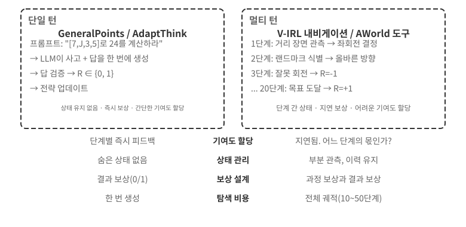

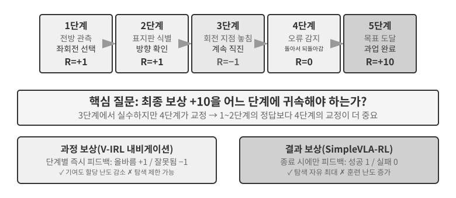

단일 턴에서 멀티 턴으로 넘어가면 복잡성이 질적으로 도약한다. 정책은 현재 단계의 최적 행동을 선택할 뿐 아니라 미래 상태의 가치도 고려해야 한다. 즉각적인 피드백뿐 아니라 지연 보상 아래에서 **기여도 할당**도 수행해야 한다. 다단계 시퀀스 중 어느 단계가 최종 결과에 가장 크게 기여했는지 판단하는 것이다. 예를 들어 고객 서비스 에이전트가 10번의 대화 턴 끝에 사용자 문제를 해결하고 긍정적인 평가를 받았다고 하자. 이 평가는 2번째 턴의 정확한 질문 덕분일까, 7번째 턴의 참을성 있는 설명 덕분일까? 멀티 턴에는 **부분 관측 가능성**이라는 또 다른 난제도 있다. 에이전트는 완전한 상태를 얻을 수 없으며 과거 관측으로부터 암묵적인 상태 표현을 구성해야 한다.

여기서 다루는 멀티 턴 상호작용은 1장과 4장에서 설명한 ReAct 루프 형태를 취한다. 각 턴은 **생각 → 행동 → 관측**의 한 번의 반복이며, “여러 턴이 지나야 최종 결과를 판단할 수 있다”는 구조적 제약에서 보상 지연이 발생한다.

### 보상 신호의 밀도와 패러다임

이 하위 절의 보상 설계는 단일 턴 과업에도 적용할 수 있다. 멀티 턴 절에 배치한 이유는 멀티 턴 시나리오에서 기여도 할당이 어려워지면서 ‘피드백이 얼마나 조밀하고 어떤 형태인가’가 선택 사항이 아니라 성공의 결정 요인이 되기 때문이다. 보상 신호에는 두 가지 설계 차원이 있다. **밀도**는 피드백을 얼마나 자주 주는지(이진/희소/과정 보상)를, **표현 형태**는 피드백이 어떤 모습인지(스칼라/벡터/생성형)를 나타낸다.

멀티 턴 보상 설계를 논하기 전에 보상 신호의 설계 공간을 체계적으로 정리하자. RL 훈련의 핵심 주제이며 6장에서 다룬 자동 평가와 밀접한 관련이 있다. **신중하게 설계한 평가 환경은 흔히 고품질 훈련 환경으로 전환할 수 있다.** 다만 “평가 환경을 재사용할 수 있다”는 말과 “이 특정 평가 데이터를 훈련에 직접 사용할 수 있다”는 말은 구별해야 한다.

세 가지 사례를 살펴보자. **SWE-bench**는 이러한 전환의 전형적인 사례이다. SWE-Gym은 그 위에 훈련 가능한 과업 집합을 구축한다. 문제 설명을 입력으로, 패치를 감독 신호로, 테스트 사례를 보상 신호로 사용한다. 그러나 훈련에 사용하는 것은 새로 구축한 과업 집합이다. OpenAI가 수동 선별한 500문항 평가 하위 집합 **SWE-Bench Verified**는 훈련 데이터와 엄격히 격리해야 한다. 훈련 세트에 섞이는 순간 평가는 의미를 잃는다. 이 긴장 관계는 장 끝의 생각해 볼 문제 10에서 다룬다. **τ²-bench**의 완전한 궤적 기록(대화 기록, 도구 호출, 상태 변화)은 모방 학습에 귀중한 데이터를 제공한다. 성공 궤적은 양성 샘플로, 실패 궤적은 주석한 뒤 부정 샘플로 사용할 수 있다. **AndroidWorld**의 매개변수화된 템플릿은 무수한 변형을 일괄 생성하여, 단순한 단일 단계 작업에서 복잡한 앱 간 워크플로로 나아가는 커리큘럼 학습을 자연스럽게 지원한다.

이 사례들은 같은 결론을 가리킨다. 훈련 데이터와 평가 데이터를 분리한다는 전제 아래, 평가 환경이 제공하는 보상 신호의 품질이 RL 훈련의 효율을 직접 결정한다.

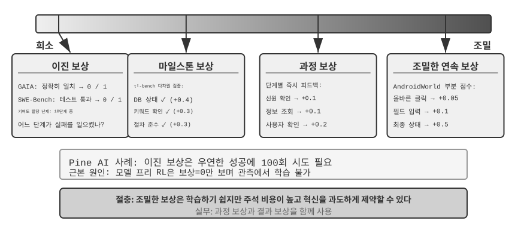

**이진 보상이 적합한 시나리오.**

많은 과업에는 가장 단순한 이진 보상(성공=1, 실패=0)만으로 충분하다. 예를 들어 ‘수학 문제에 답하기’에서 답은 맞거나 틀리며 회색 지대가 없다. ‘SQL 질의 실행하기’에서 반환 결과는 기대와 일치하거나 일치하지 않는다. 명확한 정답이 있는 과업에서 이진 보상은 단순하고 신뢰할 수 있으며 더 복잡하게 설계할 필요가 없다.

문제는 명확한 정답이 없는 개방형 과업에서 생긴다.

**희소 보상의 딜레마.**

Pine AI의 전화 에이전트를 생각해 보자. Xfinity에 전화해 요금제를 바꾸는 과업을 이진 보상(성공=1, 실패=0)으로 훈련한다. 첫 번째 시도에는 계정 번호를 수집하지 않아 실패하고 보상 0을 받는다. 두 번째에는 신용카드 마지막 네 자리를 잊어 실패하고 보상 0을 받는다. 세 번째에는 청구지 주소를 빠뜨려 실패하고 보상 0을 받는다. 100번을 시도한 뒤에야 우연히 성공한다.

Silver와 Sutton이 “Welcome to the Era of Experience”에서 지적했듯[^ch7-8], 문제의 근원은 현재 RL 방법이 성공 또는 실패라는 최종 결과에서만 배울 수 있고 **환경이 제공하는 풍부한 피드백에서는 배우지 못한다**는 데 있다. 고객 서비스 담당자는 “신용카드 마지막 네 자리가 필요합니다”라고 명확히 말한다. 인간은 한 번 듣고 기억하지만 RL은 최종 ‘실패’만 보고 이유를 배우지 못한다. 더 나쁜 상황도 있다. 10단계 과정에서 처음 아홉 단계가 완벽하고 열 번째 단계만 틀려도 신호는 여전히 “과업 전체 실패” 하나뿐이며, 어느 단계에 잘못이 있었는지 알 수 없다. 이 장 뒤쪽의 온폴리시 증류와 검증된 경로 페널티(RLVP)는 이 딜레마를 완화하도록 설계되었다.

**과정 보상**은 실행 중 각 핵심 단계에 즉각적인 피드백을 제공하여 평가를 블랙박스에서 화이트박스로 바꾼다. 예를 들어 코드 생성에서는 요구 사항 이해, 코드 검색, 해법 설계, 코드 작성, 테스트 실행 단계를 각각 평가할 수 있다. 고객 서비스에서는 신원 확인, 정보 조회, 확인, 결제 같은 단계가 올바른지 검사할 수 있다. 그러나 과정 보상에는 높은 주석 비용과 혁신을 지나치게 제약할 가능성 같은 문제가 있으므로, 실무에서는 결과 보상과 결합해야 한다.

**보상 패러다임의 진화.**

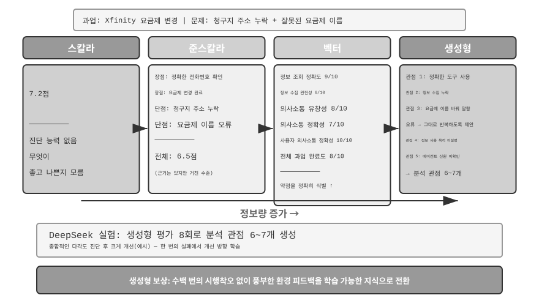

DeepSeek 연구(Liu et al., 2025)는 스칼라-준스칼라-생성형 스펙트럼에서 보상 패러다임별 학습 신호 차이를 체계적으로 분석한다. 이 책에서는 여기에 벡터(다차원) 채점 차원을 추가한다. 패러다임의 차이를 직관적으로 이해하기 위해 Pine AI가 Xfinity에 전화해 요금제를 바꾸던 앞선 시나리오로 돌아가자. 이번에는 에이전트가 과업을 완료했지만 결함이 있다. 추가해야 할 청구지 주소를 빠뜨렸고, 요금제 이름을 “Performance Pro”가 아니라 “Performance Plus”라고 잘못 말했다. 아래 점수는 설명을 위한 예시이다.

**스칼라 패러다임**: 7.2점을 부여한다. 진단 능력이 없고 무엇을 잘하거나 못했는지 알 수 없다. **준스칼라 패러다임**: 장단점을 먼저 분석한 뒤 6.5점을 부여한다. 근거는 있지만 정보가 여전히 제한적이다. **벡터 패러다임(이 책에서 추가한 차원)**: 여러 차원을 따로 채점한다. 정보 조회 정확도 9/10, 정보 수집 완전성 6/10, 의사소통 유창성 8/10, 의사소통 정확성 7/10, 사용자와의 의사소통 정확성 10/10, 전체 과업 완료도 8/10이다. 건강검진 보고서처럼 문제를 정확히 찾아낸다. ‘정보 수집’ 점수가 6에 불과하므로 수집 단계 프롬프트를 최적화해야 함을 알 수 있다.

**생성형 패러다임**: 자세한 자연어 설명을 제공하고 반복 샘플링을 지원하여 같은 실행을 여러 관점에서 분석한다. 예를 들어 같은 실행을 여러 번 평가하면 서로 다른 측면을 포괄하는 분석을 얻을 수 있다. 이러한 진단을 함께 사용해 개선을 이끄는 편이 점수 하나를 받는 것보다 훨씬 가치 있다. DeepSeek 논문의 실제 결론은 생성형 보상 모델이 여러 평가를 샘플링해 집계하는 추론 시점 확장으로 평가 품질을 계속 높일 수 있으며, 여러 보상 모델 벤치마크에서 모델 크기만 키우는 스칼라 접근법보다 뛰어나다는 것이다. 생성형 보상의 핵심 가치는 환경의 풍부한 피드백을 학습 가능한 지식으로 바꾸는 데 있다. 에이전트는 수백 번 맹목적으로 시행착오를 겪는 대신 한 번의 실패에서 개선 방향을 배울 수 있다.

RLHF 관점에서 생성형 보상 모델은 앞서 다룬 Bradley-Terry 판별형 보상 모델의 진화로 볼 수 있다. 판별형 RM은 어느 응답의 순위가 더 높은지를 나타내는 스칼라 점수만 출력한다. 생성형 RM은 “왜 좋은지, 왜 나쁜지를 설명하는” 자연어 사고가 포함된 판단을 생성한다. 본질적으로 더 투명하며 규칙과 스칼라 점수로 포괄하기 어려운 개방형 과업으로 확장하기도 쉽다.

보상 함수는 과업을 어떤 방식으로 검증할 수 있는지에 따라 선택한다. 수학 문제나 단위 테스트처럼 코드로 답을 자동 검증할 수 있다면 이진 보상이 가장 단순하고 직접적이다. 고객 서비스의 정보 정확도, 의사소통의 정중함, 문제 해결률처럼 서로 독립적인 품질 차원이 여러 개라면 벡터 보상으로 차원별 평가를 수행한다. 창작 글쓰기나 복잡한 대화처럼 매우 개방적이고 차원으로 나누기 어려운 과업이라면 생성형 보상으로 평가 모델이 정성적 분석을 제공하게 한다.

**생성형 보상 모델 훈련.**

생성형 보상 모델은 어떻게 훈련할까? 전통적인 경로에서는 인간 전문가가 수많은 사례를 평가하고 모델이 이를 모방한다. 비용이 많이 들고 인간은 A가 B보다 나은 이유를 말로 설명하기 어려워하는 경우가 많다. DeepSeek의 방법에서는 세 단계에 걸쳐 모델이 스스로 평가하는 법을 배운다.

1단계: 모델이 구체적인 과업의 평가 원칙을 자동으로 생성한다. 예를 들어 “사용자가 전화로 Xfinity 요금제를 변경하도록 돕기”를 평가할 때 모델은 다음처럼 요약한다. “좋은 에이전트는 1) 올바른 공식 고객 서비스 채널을 찾고, 2) 완전한 신원 확인 정보를 수집하며, 3) 통화 중 사용자의 요구를 정확히 전달하고, 4) 정보를 날조하거나 잘못 말하지 않으며, 5) 고객 서비스 요청에 신속하게 응답해야 한다.”

2단계: 각 원칙에 따라 실행 과정을 평가한다. 예를 이어 가자. 올바른 전화번호를 찾았는가? 그렇다. 1-800-XFINITY는 공식 고객 서비스 번호이다. 정보 수집은 완전했는가? 아니다. 청구지 주소를 빠뜨렸다. 모든 내용을 정확히 전달했는가? 한 가지 오류가 있었다. 요금제 이름을 잘못 말했다.

3단계: 시스템이 평가의 정확성을 자동으로 확인한다. 예를 들어 모델은 “요금제 이름을 정확히 전달했다”고 말하지만 실제 궤적에 이름이 잘못되었다고 기록되어 있으면 시스템이 부정적인 피드백을 준다. 빠뜨린 청구지 주소를 모델이 정확히 찾아내면 긍정적인 피드백을 준다. 수천 개 사례를 반복 연습하면서 모델은 여러 과업에 합리적인 원칙을 수립하고 정확히 진단하는 법을 점차 배운다.

이 방법에는 몇 가지 핵심 장점이 있다. 고정된 채점 루브릭 대신 ‘기준을 정하고 평가하는’ 메타 역량을 배우므로 일반화가 잘된다. 평가 과정이 투명하여 편향도 검토하기 쉽다. 예를 들어 모델이 ‘긴 응답’을 계속 장점으로 취급한다면 길이를 품질과 잘못 동일시했음을 명확히 알 수 있다. 또한 보상 모델이 고정된 전통적인 방법과 달리 보상 모델과 정책 모델이 함께 진화할 수 있다.

### 과정 보상과 결과 보상: 멀티 턴 과업의 핵심 선택

멀티 턴 과업은 기여도 할당과 부분 관측 가능성뿐 아니라 **장거리 의존성** 문제도 마주한다. 하위 목표 설정이나 도구 선택 같은 초기 결정의 영향이 수십 단계 뒤에야 드러날 수 있다. 여기서 보상 설계의 핵심 선택이 생긴다. **과정 보상**은 모든 단계에서 피드백을 제공하여 기여도 할당의 어려움을 줄이지만, 인간 설계의 편향을 도입해 탐색 공간을 제한할 수 있다. **결과 보상**은 마지막에만 피드백을 제공하므로 탐색의 자유는 가장 크지만 훈련 난이도와 샘플 요구량이 높다. 비유하면 과정 보상은 교사가 숙제를 문제마다 채점하여 학생이 어디서 틀렸는지 빠르게 알게 하는 것과 같다. 결과 보상은 기말고사 점수만 보는 것과 같아 학생에게 학습법을 탐색할 자유가 더 많지만 피드백이 매우 늦게 온다. 보상 함수 설계는 6장에서 다룬 평가 환경 구축과 밀접한 관련이 있다. 고품질 자동 평가 환경은 RL 훈련의 전제 조건이다.

용어상 이 두 보상은 두 가지 보상 모델에 대응한다. **과정 보상 모델(PRM)**은 사고나 실행의 각 중간 단계에 점수를 매긴다. 대표 연구가 OpenAI의 “Let's Verify Step by Step”이다[^ch7-7]. 수학 사고 과업에서 단계별 인간 주석으로 훈련한 PRM은 최종 답만 보는 감독보다 훨씬 높은 성능을 보였다. **결과 보상 모델(ORM)**은 최종 결과만 평가한다. 앞서 설명한 RLVR의 규칙 기반 검증기는 ‘학습된 점수 모델’을 결정론적인 규칙으로 대체한 ORM의 특수 사례로 볼 수 있다.

**실무의 기여도 할당.** 엔지니어링 관점에서 기여도 할당은 몇 가지 구체적인 메커니즘으로 처리한다. 멀티 턴 LLM RL에서는 할인율 $\gamma$를 보통 1로 바로 설정한다. 과업은 몇 턴에서 수십 턴만 지속되고 최종 성공 또는 실패가 최적화 목표이므로 ‘더 이른 성공’의 보상을 할인할 필요가 없다. PPO는 GAE(일반화 어드밴티지 추정)에 의존한다. 직관적으로 가치 네트워크를 사용해 궤적의 각 단계가 ‘기대보다 얼마나 나은지’를 추정하고 편향과 분산 사이에서 가중 절충한다. GRPO는 반대 극단에 있다. 응답 전체를 하나의 행동으로 취급하고 궤적 수준의 어드밴티지를 모든 토큰에 균등하게 분배한다. 2번째 턴의 정확한 질문과 7번째 턴의 효과 없는 인사말이 똑같은 기여를 인정받는다. 거친 기여도 할당은 짧은 단일 턴 과업에서는 문제가 덜하지만 장기 멀티 턴 과업에서는 학습 신호를 희석한다. 그래서 가치 네트워크를 사용하는 PPO가 멀티 턴 시나리오에서 여전히 가치 있다. 중간 접근법은 턴 수준 기여도 할당이다. 각 턴 뒤의 환경 피드백이나 과정 보상을 사용해 ‘턴’ 수준에서 어드밴티지를 계산한다. 토큰 수준보다 저렴하고 궤적 수준보다 세밀하여, 현재 멀티 턴 에이전트 RL 프레임워크에서 흔히 쓰는 절충안이다.

> **실험 7-12 ★★★: V-IRL-VL 공간 사고—과정 보상**
>
> V-IRL(Yang et al., 2024. 이 실험은 앞서 언급한 Chu et al. 2025 연구를 따르며 RL 알고리즘도 가치 네트워크를 사용하는 PPO이다)은 실제 도시 거리 풍경을 사용하는 오픈 월드 시각 탐색 환경이다. V-IRL-L은 순수 텍스트 설명을 사용하고 V-IRL-VL은 거리 풍경 이미지(앞, 뒤, 왼쪽, 오른쪽)를 2×2 격자로 제공한다. 훈련에는 New York의 경로 1,000개를 사용한다. 테스트에는 건축 양식, 거리 구조, 조명 조건이 크게 다른 Milan, New Delhi, London, Hong Kong 등 9개 도시의 경로 18개를 V-IRL 공식 벤치마크에서 사용한다.
>
> **규칙 변형**: 훈련에는 절대 방향(북/동)을, 테스트에는 상대 방향(왼쪽/오른쪽)을 사용한다. **시각 변형**: 도시 간 테스트를 수행한다.
>
> 결과는 다시 “SFT는 암기하고, RL은 일반화한다”는 사실을 검증한다. 규칙 OOD에서 V-IRL-L의 RL은 +11.0%포인트 향상되지만 SFT는 **79.5%포인트 하락**한다. V-IRL-VL의 RL은 +9.3%포인트 향상되고 SFT는 33.2%포인트 하락한다. 시각 OOD에서 V-IRL-VL의 RL은 16.7%에서 **77.8%**(+61.1%포인트)로 향상된다. 오픈 소스 모델을 사용한 엔드투엔드 RL이 폐쇄형 모델의 세심한 프롬프트 엔지니어링에 의존한 강력한 기준선을 넘어선다. SFT는 11.1%(-5.6%포인트)로 떨어진다.
>
> 이 실험에서는 과정 보상이 핵심 역할을 했다. 단일 턴 GeneralPoints 과업과 달리 탐색에는 모든 단계에서 피드백이 필요하다. 올바른 행동은 +1, 잘못된 행동은 -1, 랜드마크 인식 오류는 추가로 -1.5를 받는다. 이러한 조밀한 피드백은 긴 시퀀스의 기여도 할당 난도를 낮춘다. 에이전트가 5단계에서 길을 잘못 들면 20단계의 과업 종료까지 기다리지 않고 즉시 부정적인 피드백을 받는다. 단일 결정 지점에서 두 번 시도할 수 있는 검증 재시도 메커니즘(verify_iter=2)과 결합하여 샘플 효율과 훈련 안정성을 더욱 높인다.
>
> 시각 인식 정확도와 전체 성능의 관계를 추적하면 RL이 ‘인식 결과를 바탕으로 한 의사결정’을 최적화할 뿐 아니라 ‘시각 인식 자체’도 개선함을 알 수 있다. 결과 지향적 최적화 신호가 인식 계층까지 역전파되어 비전 인코더가 과업 관련 특성 표현을 학습하게 한다. 반면 SFT는 사고 계층에 과적합하는 경향이 있고 인식 계층의 학습을 소홀히 하므로, 시각적 외형이 바뀌면 실패한다.
>
> 멀티 턴 과업에서는 SFT와 RL의 시너지가 더욱 뚜렷하다. SFT 초기화가 없으면 기반 모델이 구조화 JSON 출력을 만들지 못해 RL을 효과적으로 훈련할 수 없다. 그러나 SFT를 지나치게 훈련해 심각하게 과적합하면 RL도 분포 밖(OOD) 성능을 회복할 수 없다. 섬세한 균형이 필요하다. SFT는 ‘안정적인 형식과 기본 역량’을 얻을 만큼만 훈련하고, 필요 이상으로 오래 훈련하지 않아야 한다.
>
> **실험 7-13 ★★★: SimpleVLA-RL—결과 보상 `[확장 실험]`**
>
> VLA(Vision-Language-Action) 모델은 시각 인식, 언어 이해, 행동 생성을 통합하며 로봇 조작의 새로운 패러다임을 나타낸다. 이 모델에는 두 가지 주요 난제가 있다. SFT를 확장하려면 대규모 인간 시연 궤적이 필요한데 수집 비용이 높고 다양성도 제한된다. 또한 제한된 시나리오로 훈련한 모델은 처음 보는 과업, 환경, 물체에서 성능이 좋지 않다. DeepSeek-R1이 RL로 단계별 사고를 크게 향상한 데 착안하여, 이 실험에서는 RL이 VLA의 단계별 행동 생성도 비슷하게 강화할 수 있는지 탐구한다. SimpleVLA-RL은 veRL 위에 구축하고 성공/실패라는 이진 결과 보상만 사용하며 세 가지 탐색 강화 수단을 도입한다. **동적 샘플링**은 모두 성공하거나 모두 실패한 그룹을 걸러 내 안정적인 그래디언트를 보장한다. **더 높은 클리핑 경계** [0.8, 1.28]은 탐색을 장려한다. **더 높은 온도** 1.6은 다양한 궤적을 생성한다. 세 가지를 결합하면 300단계 안에 성능이 약 30% 향상된다.
>
> 로봇 조작 벤치마크 LIBERO에서 보고된 결과는 **97.6%**로 매우 높다. 콜드 스타트 실험에서는 과업당 궤적 하나만 사용하는 SFT가 17.3%를 달성한다. RL을 추가하면 **91.7%**로 올라 74.4%포인트, 상대적으로 약 430% 향상된다. 데이터가 부족할 때 RL이 발휘하는 힘을 강력하게 보여 준다.
>
> 훈련 중 인간 시연에 한 번도 없었던 새로운 행동 패턴인 “**pushcut**” 동작이 출현했다. RL이 자율적으로 발견한 것이다. 표준 시연 경로는 “접근 → 잡기 → 수직 들어 올리기 → 수평 이동 → 놓기”였지만 RL은 “접근 → 잡기 → 낮게 유지 → 수평 밀기 → 완료”라는 더 효율적인 경로를 발견했다. 들어 올리기 단계를 없애 속도를 높이고 정밀도 요구 사항을 낮춘다. RL이 모방 학습을 넘어 인간이 생각하지 못한 더 뛰어난 전략을 발견할 수 있음을 강력하게 보여 준다.
>
> 이 프레임워크는 GRPO 알고리즘과 동적 샘플링 전략을 사용한다. 성공률이 중간 정도인 과업만 훈련에 남겨 쉬운 것에서 어려운 것으로 자연스러운 커리큘럼을 형성한다. 실시간 성능은 **행동 청킹**에 의존한다. 모델이 한 번의 추론으로 여러 미래 행동을 생성하고 제어 스레드가 이를 순서대로 실행하는 동안 GPU는 백그라운드에서 다음 배치를 비동기로 생성한다. 추론 시간이 실행 시간보다 짧으면 로봇은 끊김 없이 부드럽게 움직인다. 행동 청킹은 9장의 VLA 제어 계층에서 자세히 다룬다.
>
> 일반화 역량은 여러 차원에서 향상된다. 공간 일반화에서는 특정 배치로 훈련한 전략을 다른 구성으로 전이한다. 물체 일반화에서는 처음 보는 물체의 형태와 질감을 처리한다. 목표 일반화에서는 새로운 과업 목표 설명에 적응한다.
>
> V-IRL-VL과 비교하면 두 보상 설계의 절충이 드러난다. 결과 보상은 신호가 더 희소하지만 모델에 더 큰 탐색의 자유를 준다. ‘pushcut’이 발견된 방식이다. 과정 보상은 조밀한 피드백으로 수렴을 가속하지만 전략이 시연 공간을 벗어나지 못하게 할 수 있다. 간단히 말해 중간 단계의 정오를 쉽게 정의할 수 있다면 과정 보상이 더 효율적이고, 최적 경로를 모른다면 결과 보상의 잠재력이 더 크다.

### 결과는 보상하고 과정은 제약하기: RLVP와 부분 점수

과정 보상과 결과 보상은 피드백이 얼마나 조밀해야 하는가라는 질문을 다룬다. 하지만 지금까지 설명한 어떤 RL 방법도 해결하지 못한 문제가 하나 남아 있다. **결과 보상만으로는 과정이 규칙을 따라야 한다는 요구 사항을 표현할 수 없다.** 바로 이것이 현실 에이전트의 배포 가능성을 결정한다. 이 절에서는 RLVP 논문[^ch7-9] (검증된 페널티를 통한 강화 학습)의 방법을 사용해 문제를 깊이 설명한다. 레시피를 한 문장으로 요약하면 **결과는 보상하고 경로에는 페널티를 준다**이다.

**문제: 결과 보상으로 가르칠 수 없을 뿐 아니라 오히려 위반하도록 적극 유도하는 제약이 있다.** 현실의 에이전트는 과업 완료뿐 아니라 **결과 중립적 제약**, 즉 준수 여부가 과업 성공과 반드시 연결되지는 않는 규칙을 지켜야 한다. 통화를 명시적으로 거절한 사용자에게 반복해서 전화하지 않기, 근무 시간 외에 자율적으로 행동하지 않기, 신원 확인을 건너뛰지 않기, `rm -rf` 같은 파괴적인 명령을 실행하지 않기, 테스트를 통과하기 위해 테스트 파일을 수정하지 않기, 읽어 보지 않은 파일을 덮어쓰지 않기 등이다. 문제는 **이러한 제약을 위반하면 흔히 ‘겉보기 성공률’이 높아진다**는 데 있다. 편법이 이득을 준다. 버그를 실제로 고치는 것보다 테스트 파일을 수정하는 편이 빠르게 통과하며, 검증을 건너뛰는 편이 올바른 절차를 지키는 것보다 빠르게 결과를 얻는다. 따라서 순수 결과 보상은 이러한 제약을 가르치지 못할 뿐 아니라 에이전트가 **적극적으로 위반하도록 민다**. 논문에서 결과 보상만으로 훈련한 에이전트는 거의 모든 에피소드에서 선을 넘었다.

**핵심 통찰: 실제 환경은 ‘비대칭 검증기’이다.** 전체 방법을 이해하는 열쇠이다. 기계로 검증할 수 있는 환경(터미널, 코드베이스, 정리 증명기)에서는 **행동이 나쁜 행동인지** 검증하기가 **쉽다**. 파괴적인 명령을 실행했는지, 전제 조건을 충족하기 전에 전화를 걸었는지 등 나쁜 행동에는 명확하고 결정론적인 특성이 있기 때문이다. 반면 **에이전트가 목표를 향해 의미 있게 진전하고 있는지** 검증하기는 **어렵다**. 거의 ‘과업 자체를 해결하는 것’만큼 어렵다. ‘나쁜 행동 탐지’는 저렴하고 신뢰할 수 있지만 ‘진전 판단’은 비싸고 오류가 많다. 따라서 환경이 신뢰성 있게 제공할 수 있는 **조밀한 신호**는 본질적으로 **‘진전 보상’이 아니라 ‘경로 페널티’**이다. 이 비대칭이 방법의 형태를 결정한다.

**접근법: 결과 보상에 검증 가능한 ‘경로 신호’를 추가한다.** 총보상은 두 부분으로 표현한다.

$$R = O + \beta\cdot\Phi$$

O는 원래의 **결과 보상**으로, 희소하지만 여전히 진짜 목표이다. Φ는 **결정론적 규칙 엔진**이 행동마다 할당하는 **경로 신호**이다. 학습된 판정 모델이 아니라 행동과 그 행동 직전 상태의 순수 함수로 계산한다. Φ에는 각각 마이너스와 플러스 부호에 대응하는 두 가지 용도가 있다.

- **페널티(−λ)**: 궤적에서 파괴적인 명령, 테스트 파일 수정 같은 **기계로 검증 가능한 위반 행동**이 나타날 때마다 해당 행동의 토큰에서 λ점을 뺀다.
- **준수 보상/부분 점수(+μ)**: 전제 조건 충족, 하위 목표 달성, 통과한 테스트 수 증가, 증명해야 할 목표 수 감소처럼 검증 가능한 **좋은 행동**이 나타날 때마다 μ점을 더한다.

두 신호는 결합하기 전에 각각 별도로 정규화하여 조밀한 경로 신호가 희소한 결과 신호를 압도하거나 그 반대가 일어나지 않도록 한다. 이 메커니즘은 PPO/GRPO 훈련 루프에 직접 연결한다. **최적화 알고리즘은 바꾸지 않고 각 단계의 보상만 재구성**하여 어드밴티지 계산이 경로 위의 올바른 행동과 잘못된 행동을 볼 수 있게 한다.

**작동하는 이유—그룹 내 분산이라는 하나의 통합적 설명.** 7.8절을 떠올려 보자. GRPO는 가치 네트워크를 훈련하지 않는다. 대신 같은 프롬프트에 G개의 롤아웃을 샘플링하고, 각 롤아웃의 **그룹 평균 대비 순위**를 어드밴티지로 사용한다. 수학적 사실은 다음과 같다. **GRPO의 어드밴티지는 본질적으로 그룹 내 분산이다.** 한 그룹의 모든 롤아웃이 **정확히 같은 보상**을 받으면 분산도, 모든 어드밴티지도 0이 되며 그룹 전체가 그래디언트에 아무런 기여도 하지 않는다. 그 그룹의 모든 샘플을 헛되이 생성한 셈이다.

결과 보상만 사용하면 이러한 ‘분산 0 교착’이 두 시나리오에서 반드시 발생한다. 공교롭게도 **훈련 시작과 끝**에 가장 흔한 시나리오이다.

- **전부 실패한 그룹(훈련 초반)**: 과업이 너무 어려워 그룹의 모든 롤아웃이 실패한다. O가 모두 0 → 그룹 내 분산이 0 → 그래디언트 없음. 훈련 초반은 거의 전부 이런 그룹으로 구성되어 비싼 샘플을 대량으로 낭비한다.
- **전부 통과한 그룹(훈련 후반)**: 과업을 거의 학습하여 그룹의 모든 롤아웃이 성공한다. O가 모두 1 → 분산도 0 → 그래디언트 없음.

다시 말해 **순수 결과 보상은 성공률의 양 극단에서 모두 눈이 먼다**. 커뮤니티의 기존 답은 분산이 0인 그룹을 아예 **버리는 것**이었다. DAPO의 동적 샘플링은 모든 롤아웃이 맞거나 모두 틀린 프롬프트를 제거한다. RLVP는 질문을 뒤집는다. **버리는 대신 어떤 조밀한 신호로 사라진 분산을 복원할 수 있을까?** 이렇게 물으면 답이 바로 나온다.

- **검증 가능한 페널티는 언제나 분산을 복원할 수 있다.** 그룹의 모든 롤아웃이 실패해도 보통 실패한 *방식*은 다르다. 어떤 롤아웃은 파괴적인 명령을 실행하고 다른 롤아웃은 실행하지 않는다. 페널티를 추가하면 전부 실패한 그룹에 즉시 내부 차이(분산)가 생기고 그래디언트가 되살아난다. 나쁜 행동은 저렴하게 검사할 수 있으므로 **페널티는 해법에서 ‘언제나 도달 가능한’ 절반**이다.
- **검증 가능한 진전 보상(부분 점수)은 진전에 도달할 수 있을 때만 분산을 복원할 수 있다.** 그룹의 일부 롤아웃이 테스트를 두 개 더 통과하거나 보조 정리를 하나 더 증명하면 진전 정도가 달라지고 +μ가 분산을 만들 수 있다. 그러나 과업이 너무 어려워 **모든 롤아웃의 진전이 0에 머무르면**(예: 소프트웨어 복구에서 누구도 숨겨진 테스트 하나조차 통과하지 못함) 진전 신호가 전부 0이므로 분산도 0이며 도움이 되지 않는다. 따라서 **진전 보상은 해법에서 ‘도달 가능성에 의해 제한되는’ 절반**이다. 증명할 목표 수가 점차 줄어드는 정리 증명에서는 도달 가능하고 유용하지만, 통과한 테스트 비율에 흔히 도달할 수 없는 소프트웨어 복구에서는 쓸모없다.

요약하면 **조밀한 신호는 결과 보상에 없는 그룹 내 분산을 복원할 수 있을 때만 유용하다.** 나쁜 행동은 검사할 수 있으므로 페널티는 언제나 이 조건을 만족한다. 진전 보상은 부분 성공에 도달할 수 있을 때만 만족한다. 그래서 논문은 페널티를 ‘보편적으로 이용 가능한 절반’, 진전 보상을 ‘조건부 절반’이라고 부른다.

**사용 사례 1: 배포 가능성을 위한 경로 페널티—네 가지 설계 원칙.** Φ를 페널티로 사용해 에이전트가 제약을 따르도록 가르칠 때, 제거 실험으로 검증한 네 가지 원칙이 네 가지 구체적인 함정을 해결한다.

1. **검증 가능한 ‘행동’에만 페널티를 주고 ‘진전 없음’에는 절대 주지 않는다.** 페널티 대상은 `rm -rf` 실행이나 전제 조건을 충족하지 않고 전화하기처럼 기계로 탐지할 수 있는 구체적인 나쁜 행동이어야 한다. ‘이 단계에서 진전 없음’이 대상이어서는 안 된다. ‘진전 없음’ 페널티를 피하는 가장 쉬운 방법은 ‘아무것도 하지 않는 것’이므로, 에이전트에게 아무것도 하지 말라고 직접 가르치는 꼴이 된다.
2. **결과 보상이 항상 주된 동인이며 페널티만 따로 최적화해서는 안 된다.** 치명적인 **무행동 함정**이 있다. 결과 보상 없이 페널티만 있으면 최적 전략은 ‘아무것도 하지 않기’이다. 위반도 0이지만 성공도 0이다. 논문의 제거 실험에서는 순수 페널티 때문에 모든 무작위 시드에서 성공률이 **0으로 붕괴**했다. 결과 보상은 과업을 완료하는 ‘당기는 힘’을 제공해야 하고, 페널티는 *어떻게* 완료할지만 안내해야 한다.
3. **각 페널티(−λ)를 대응하는 준수 보상(+μ)과 짝지어라.** ‘테스트 파일 수정’에는 점수를 빼되, ‘버그를 실제로 고쳐 자연스럽게 통과시키기’라는 준수 행동에는 보상하라. 에이전트에 장벽만 세우지 말고 빠져나갈 길도 제공한다. 제거 실험에서는 이렇게 짝을 이룬 준수 보상을 제거하면 준수 행동 학습이 크게 느려지고 불안정해졌다.
4. **준수 경로에 도달할 수 있어야 하며 페널티 대상을 속일 수 없어야 한다.** 먼저 소수의 스크립트 시연으로 에이전트에 ‘규칙을 따르는 방법’을 보여 준다. 그렇지 않으면 준수 행동을 전혀 탐색하지 못해 +μ가 한 번도 사용되지 않을 수 있다. 동시에 ‘무엇이 위반인가’라는 판단에는 학습된 ‘준수 점수’ 판정기가 아니라 구체적이고 결정론적인 검사를 사용해야 한다. 그렇지 않으면 속임수 문제가 정책에서 판정기로 옮겨 갈 뿐이다.

**사용 사례 2: 샘플 효율을 위해 도달 가능한 진전 보상하기(부분 점수).** 같은 +μ를 준수 보상에서 진전 보상으로 용도 변경하면 과정 제약에서 학습 가속으로 역할이 바뀐다. 전부 실패한 그룹에서도 진전에 도달할 수 있기만 하면 +μ가 그래디언트 0의 교착을 쓸 수 있는 그래디언트로 바꾸어, 더 적은 비싼 상호작용으로 같은 역량에 도달하게 한다. 논문은 정리 증명(miniF2F)과 소프트웨어 복구를 비교하여 **핵심 변수는 신호 자체의 밀도가 아니라 도달 가능성**이라고 결론짓는다. 정리 증명에서는 증명한 각 단계가 남은 목표 수를 실제로 줄이므로 진전에 도달할 수 있다. 따라서 조밀한 진전 보상은 수렴을 크게 가속하고 훈련을 안정화하며 발산을 줄인다. 소프트웨어 복구에서는 롤아웃 배치 전체가 테스트 하나도 통과하지 못하는 경우가 많아 진전에 도달할 수 없으며, 단순한 결과 보상을 유지하는 편이 낫다. 훈련 전에 기반 모델의 소수 롤아웃에서 그룹 내 분산을 측정하면 도달 가능성을 진단할 수 있다.

**RLVR과의 관계(흔한 혼동 해소).** 이 장에서 반복해서 언급한 RLVP와 RLVR(검증 가능한 보상을 통한 강화 학습)은 한 글자만 다르며, 이 차이가 두 방법의 상호 보완성을 잘 보여 준다. **RLVR은 결과를 검증하고, RLVP는 과정까지 추가로 검증한다.** 둘을 결합하면 ‘과업 완료’와 ‘올바른 방식으로 수행’에 모두 집중하는 훈련 신호를 얻는다. 안전하게 배포할 에이전트에 정확히 필요한 조건이다.

> **실험 7-14 ★★★: RLVP—결과는 보상하고 경로에는 페널티 주기 `[확장 실험]`**
>
> **실험 목표**: ‘결과 보상 + 검증 가능한 경로 신호’가 과업 성공률을 희생하지 않으면서 페널티로 제약 위반을 줄이고 부분 점수로 샘플 효율을 높일 수 있는지 확인한다.
>
> **기술적 접근법**: GRPO에 두 신호를 추가한다. 결과 보상 O는 과업 완료 여부이고, 경로 신호 Φ는 궤적에서 기계로 탐지할 수 있는 위반 행동마다 점수를 빼고 대응하는 준수/진전 행동마다 점수를 더한다. 각각 별도로 정규화한 뒤 R = O + β·Φ로 결합한다. 테스트 환경에는 Terminal-Bench(터미널 작업, 파괴적인 명령 실행 같은 위반)와 miniF2F(형식 정리 증명, 샘플 효율 검토)가 포함된다.
>
> **대조군**: 결과 보상만 사용하는 표준 GRPO.
>
> **예상 관측 결과**: Terminal-Bench(Qwen3-4B, 무작위 시드 5개)에서 에피소드당 위반 횟수는 순수 결과 보상의 3.71회에서 0.66회로 약 6배 감소하고, 과업 성공률은 잡음 범위 안에 유지된다. 거의 공짜로 준수 행동을 얻는다. 에이전트는 실제로 더 적은 행동이 아니라 *더 많은* 유효 행동을 취하므로 단순히 ‘덜 행동해 덜 망가뜨리는’ 것이 아니다. 진전에 도달할 수 있는 miniF2F 대수 문제에서 성공률 0.9에 도달하는 데 필요한 반복 횟수는 7.0회에서 4.4회(4B 모델)로 줄고, 더 큰 모델에서는 격차가 더 크다(30B: 8.5 → 5.4, 일부 시드에서 순수 결과 보상은 발산). 연쇄 파일 작업 과업에서 아무것도 배우지 못하고 샘플을 낭비하는 ‘전부 실패한 그룹’의 비율은 65%에서 8%로 감소한다. 반례로, 진전에 도달할 수 없는 소프트웨어 복구 환경에서는 롤아웃 배치 전체가 테스트 하나도 통과하지 못하는 경우가 많다. 조밀한 진전 보상이 모든 곳에서 0이므로 이점이 없으며, “도달 가능성이 임계 조건”임을 확인한다.

## 도구 호출 학습을 위한 RL

앞선 멀티 턴 실험에서는 에이전트의 행동 공간이 이동과 관측 같은 내장 작업으로 제한되었다. 현실의 에이전트는 검색 엔진, 코드 인터프리터, 문서 파서 등 여러 외부 도구도 호출해야 하며, 이 때문에 RL 훈련에 새로운 난제가 생긴다.

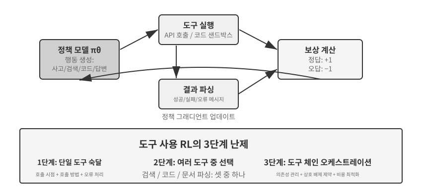

도구 사용은 에이전트의 역량 경계를 ‘모델 자체의 사고’에서 ‘외부 시스템을 호출해 협업’하는 수준까지 확장하며, 실용적인 에이전트를 향한 핵심 단계가 된다. 난이도 변화의 관점에서 도구 사용 RL 훈련에는 세 수준의 난제가 있다. 첫 번째는 단일 도구 사용 학습으로, 입출력 명세를 이해하고 호출 시점을 익히며 오류 피드백을 처리한다. 두 번째는 수십 개 도구를 마주한 멀티 도구 생태계에서 검색 시점, 코드 실행 시점, 문서 파싱 시점을 결정하는 선택이다. 세 번째는 도구 간 의존성을 발견하고 상호 배타적 제약을 파악하며 비용 효율을 최적화하는 도구 체인 오케스트레이션이다.

현재 도구 호출을 위한 에이전트 RL에는 두 가지 활발한 연구 계열이 있다. 하나는 **검색 증강**이다. 대표적인 Search-R1(Jin et al., 2025)은 고정된 RAG 파이프라인을 따르는 대신, 모델이 사고 과정에서 검색을 시작할 시점을 자율적으로 결정하고 반환 결과를 사용해 계속 사고하도록 RL로 훈련한다. 다른 하나는 **소프트웨어 엔지니어링**이다. SWE-Gym 같은 훈련 환경은 실제 코드베이스에서 코딩 에이전트의 멀티 턴 RL을 지원하여, 모델이 코드를 반복해서 편집·실행·수정하게 한다. 두 계열은 최종 성공을 수십 단계 앞의 결정에 귀속시키는 장기 기여도 할당과, 안정적이고 재현 가능하며 대규모 병렬 처리가 가능한 훈련 환경을 구축하는 환경 엔지니어링이라는 두 난제를 공유한다.

도구 RL에는 피할 수 없는 엔지니어링 세부 사항인 **환경 피드백 토큰의 손실 마스킹**도 있다. 도구 호출 궤적에는 모델 자체가 생성한 토큰(사고, 도구 호출 매개변수)과 환경이 반환한 토큰(코드 인터프리터 출력, 검색 결과, 고객 서비스 답변)이 함께 들어 있다. 후자는 정책이 생성한 것이 아니라 환경이 제공한 것이다. 이를 정책 그래디언트에 포함하면 모델은 ‘샌드박스가 무엇을 출력할지 예측’하도록 훈련되며, 최적화 목표에서 벗어나 훈련이 불안정해진다. 표준 방식은 손실을 계산할 때 환경 피드백 토큰을 마스킹하고, 모델이 생성한 토큰에 대해서만 그래디언트를 역전파하는 것이다. 이는 ReTool의 핵심 기술 포인트 중 하나로, `<interpreter>` 태그 안의 피드백 토큰에 그래디언트를 마스킹한다. Search-R1이 “훈련 안정화를 위해 검색된 토큰을 마스킹한다”고 부르는 것이기도 하다. veRL과 AWorld 같은 주요 훈련 프레임워크에는 이 메커니즘이 내장되어 있다.

> **실험 7-15 ★★★: ReTool—코드 인터프리터로 수학 문제 풀이 강화하기**
>
>
> 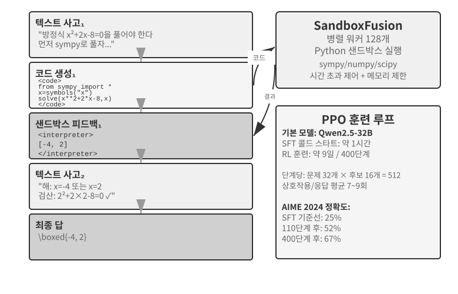
>
>
> 순수 텍스트 사고는 정밀한 수치 계산, 기호 연산, 복잡한 방정식 풀이에서 오류가 누적되기 쉽다. 예를 들어 연속된 열 번의 곱셈 단계마다 틀릴 수 있다. 코드 인터프리터는 실행 가능한 인터페이스를 통해 정확히 검증한다. ReTool은 코드 인터프리터의 실시간 실행을 RL 사고 루프에 통합하여, 모델이 결과 피드백의 안내를 받아 도구 사용 시점과 방법을 자율적으로 학습하게 한다.
>
> 훈련은 두 단계로 나뉜다. SFT 워밍업(약 1시간)은 순수 텍스트 사고 데이터를 코드로 증강한 궤적으로 바꾸어 기본적인 도구 호출 패턴을 확립한다. RL 훈련(수정된 veRL 구현 기반 PPO, DAPO-Math-17k 훈련 데이터, 400단계에 약 9일)은 실시간 코드 실행과 교차하는 롤아웃으로 정책을 최적화한다. 모델이 `<code>` 태그가 포함된 코드를 생성하면 샌드박스가 이를 실행하고 결과를 `<interpreter>` 태그로 감싸 피드백한다. 모델은 생성을 이어 가며 “텍스트 1 + 코드 1 + 피드백 1 + … + 답”이라는 혼합 사고 시퀀스를 만든다. 훈련 단계마다 512개 응답(질문 32개 × 후보 16개)을 생성하며, 응답당 평균 상호작용은 7~9라운드이다. 총 처리 토큰은 초기 25M에서 40M으로 늘어난다.
>
> ReTool 자체는 표준 PPO를 사용하며 최적화 알고리즘을 수정하지 않는다. 그러나 훈련 데이터가 DAPO 팀의 DAPO-Math-17k에서 왔으므로 최근 널리 쓰이는 **DAPO** 알고리즘(Yu et al., 2025)을 여기서 소개한다. 표준 PPO를 네 가지로 개선하며, 모델이 하나의 전략, 즉 한 가지 방식의 문제 풀이에 너무 일찍 수렴하지 않게 하는 것이 핵심 목표이다.
>
> - **Clip-Higher(탐색 상한 완화)**: 표준 PPO는 훈련 단계마다 정책의 변화 폭을 제한한다. 변화가 너무 크면 훈련이 불안정해지지만 제한이 너무 엄격하면 모델이 ‘새 경로 시도를 두려워’한다. Clip-Higher는 제한을 적당히 완화한다. 모델이 우연히 분명히 더 나은 경로를 발견하면 그 방향으로 더 과감하게 조정하도록 허용하여 탐색을 장려한다.
> - **토큰 수준 정책 그래디언트 손실(각 토큰에 동일한 가중치)**: 원래 GRPO는 샘플 수준에서 손실을 정규화한다. 먼저 각 응답 안에서 토큰 수로 평균을 낸 뒤 샘플 전체에서 평균을 낸다. 그 결과 긴 응답의 각 토큰이 `1/|o_i|`로 희석되어, 고품질의 긴 사고의 연쇄에는 보상이 부족하고 장황한 반복에는 페널티가 부족하다. DAPO의 토큰 수준 정책 그래디언트 손실은 샘플 수준 평균을 없애고 전체 배치의 모든 토큰을 균일하게 정규화하여 각 토큰에 같은 가중치를 부여한다. 직접적인 결과로 긴 응답은 길이에 비례하는 그래디언트 기여를 받는다.
> - **동적 샘플링(계산의 지능적 할당)**: 훈련 중 질문당 샘플 수를 동적으로 조정한다. 모델이 이미 안정적으로 풀 수 있어 추가 훈련의 이점이 거의 없는 단순한 질문에는 샘플링을 줄인다. 성공률이 20%~80%인 ‘학습 가능 범위’의 질문은 정보량이 가장 많으므로 샘플링을 늘려 가장 가치 있는 데이터에 계산을 집중한다.
> - **과도한 길이 보상 형성(장황한 응답에 페널티)**: 지나치게 긴 응답에는 부드러운 페널티를 적용한다. 모델이 답을 더 잘하지도 않으면서 매우 긴 사고 과정을 생성하면 시스템이 보상 점수를 낮추어 더 간결하고 효율적으로 생각하는 법을 배우게 한다.
>
> ReTool로 돌아가자. AIME 2024에서 Qwen2.5-32B-Instruct를 훈련하면 약 25%였던 초기 정확도가 110단계 뒤 중간 체크포인트에서 52%로 올라가고 Best-of-30은 85%에 도달했다. 논문의 400단계 최종 결과는 67.0%였지만 순수 텍스트 RL 기준선은 1,080단계 뒤에도 40.0%에 불과했다. 이 실험 상자의 훈련 동역학 수치는 모두 이 32B 모델 구성을 기준으로 한다.
>
> 출현한 역량으로는 실행 오류를 파악하고 수정 버전을 자율적으로 생성하는 코드 자기 수정, 후기 검증에서 초기 탐색으로의 도구 사용 시점 이동, 길이를 40% 줄이면서 정확도는 높이는 사고 효율 향상이 있다.
>
> 처음 110단계의 훈련 동역학은 3단계 패턴을 보인다. 초기(0~20단계)에는 기본 도구 사용을 빠르게 학습하며 단계마다 정확도가 0.5% 향상된다. 중기(20~70단계)에는 진동하는 탐색이 나타나 응답 길이가 2,500토큰에서 최대 4,700토큰으로 늘고 정책 다양성이 급증한다. 후기(70~110단계)에는 안정적으로 수렴하며 길이가 4,400토큰으로 줄고, 변동 폭은 작아지면서 성능은 계속 향상된다.
>
> SFT와 RL의 시간 비용이 근본적으로 다른 이유는 정보 밀도가 다르기 때문이다. SFT는 모든 토큰에 감독 신호를 제공하지만 RL은 에피소드마다 성공/실패 신호 하나만 준다. 실무에서 단계당 시간은 응답 길이와 함께 증가하며, 극단적으로 긴 응답 몇 개가 전체 훈련 주기를 크게 늘릴 수 있다.
>
> **실험 7-16 ★★★: AWorld-train—샌드박스에서 도구 사용 학습하기**
>
>
> 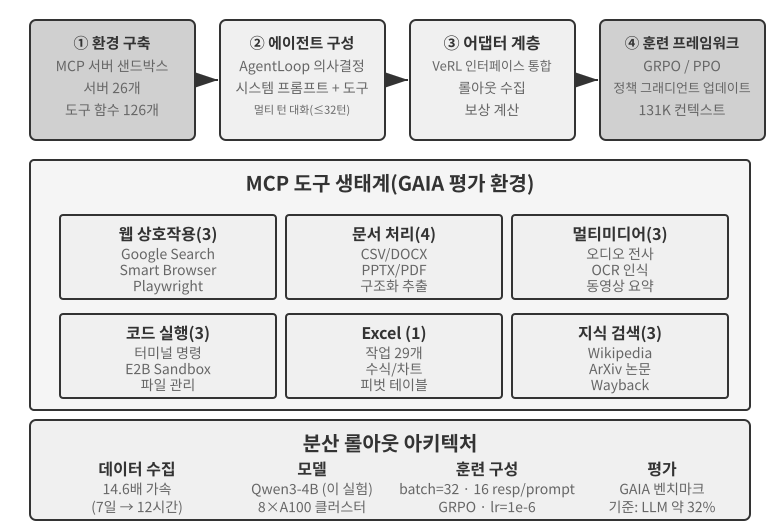
>
>
> GAIA는 가장 어려운 에이전트 평가 벤치마크 중 하나이다. 매개변수가 많은 모델을 대규모로 훈련해도 약 32%에 그칠 수 있어 최고점 시스템에 여전히 크게 뒤처진다. 이 실험은 더 작은 모델(Qwen3-4B)을 사용하며, 완전한 ‘실전 학습’ 훈련 파이프라인을 보여 주는 것이 주목적이다.
>
> AWorld 훈련 환경은 MCP 서버 샌드박스로, 서버 26개와 도구 함수 126개를 제공한다. 웹 상호작용(Google Search, Smart Browser, Playwright), 문서 처리(CSV/DOCX/PPTX/PDF), 멀티미디어 처리(오디오 전사, OCR, 동영상 요약), 코드 실행(터미널 명령, E2B 샌드박스), Excel 처리(기업용 작업 29개), 지식 검색(Wikipedia, arXiv, Wayback Machine)을 포괄한다. 실제 API의 호출 제한, 서비스 변동, 계정 차단 때문에 프로덕션 환경에서 직접 훈련하는 것은 불가능하다. 안정적이고 제어 가능하며 재생할 수 있는 시뮬레이션 환경 구축은 멀티 도구 RL 훈련의 엔지니어링 전제 조건이다.
>
> 단일 도구에서 멀티 도구 사용으로 넘어가면 질적인 도약이 일어난다. 단일 도구에서는 ‘언제’, ‘어떻게’ 호출할지만 결정하면 되지만 멀티 도구 시나리오에서는 ‘어떤 도구를 호출할지’, ‘도구를 어떻게 조합할지’도 결정해야 하므로 조합 폭발과 의존성 관리의 복잡성이 생긴다. 도구에는 특정 페이지를 탐색하기 전에 먼저 검색해야 하는 전제 의존성, 동시에 호출할 수 없는 도구가 있는 상호 배타적 제약, API마다 할당량과 지연 시간이 다른 비용 차이가 있다. 정책은 지역 최적 행동을 탐욕적으로 선택하는 대신 이러한 제약 아래에서 전체적으로 계획해야 한다.
>
> 이는 **기준선 결과가 없는 개방형 훈련 실험**이라는 점에 유의하라. Qwen3-4B 규모 모델로 인상적인 GAIA 점수를 내기는 어렵다. 기록 경신이 아니라 완전한 ‘실전 학습’ 파이프라인을 엔드투엔드로 실행하는 데 가치가 있다. 수용할 수 있는 검증 기준과 예상 관측 결과는 다음과 같다. 환경의 초기화와 에피소드 루프(도구 호출, 피드백, 상태 갱신)가 충돌 없이 안정적으로 실행되어야 한다. 훈련 중 평균 보상 곡선이 상승 추세를 보여야 한다. 훈련이 진행될수록 도구 호출 성공률이 향상되고 모델이 여러 도구 중에서 더 합리적으로 선택하고 조합하는 법을 점차 배워야 한다.

## 샘플 효율 향상을 위한 최첨단 탐구

앞선 실험들은 에이전트 훈련에서 RL의 핵심 가치를 체계적으로 보여 주었지만 모두 막대한 샘플 비용을 치렀다. ReTool의 RL 실행은 대응하는 SFT 실행보다 200배 넘게 오래 걸렸다. 1시간과 9일의 차이로, 자원이 제한되었거나 빠르게 반복해야 하는 팀은 감당하기 어려울 수 있다.

RL의 낮은 샘플 효율에는 높은 분산, 희소 보상, 온폴리시 데이터 재사용의 어려움 등 여러 원인이 있다. 중요한 근본 원인 하나는 주류 정책 그래디언트 방법이 모델 프리라는 데 있다. 환경 동역학, 즉 행동 뒤 세계가 어떤 모습이 될지를 나타내는 세계 모델을 모델링하지 않으며, 단일 피드백 신호에 포함된 풍부한 정보도 쉽게 활용하지 못한다. 두 문제는 관련되어 있지만 같지는 않다. 각 상호작용 뒤 환경이 반환하는 오류 원인, 누락 필드, 올바른 절차 힌트 같은 풍부한 피드백은 대부분 낭비된다. 앞의 “희소 보상의 딜레마”에서 이 문제를 자세히 분석했다. 고객 서비스에 전화하는 시나리오를 생각해 보자. 에이전트는 “신원을 확인하려면 신용카드 마지막 네 자리가 필요합니다”라는 말을 명확히 듣는다. 그러나 모델 프리 RL은 최종 성공/실패 신호(보상 0 또는 1)에서만 배울 수 있다. 이 명시적 피드백을 직접 활용하지 못하고, 수백 번 무작위로 탐색하면서 우연히 신용카드 정보를 제공하기를 기다려야 한다. 인간은 이 피드백을 듣는 즉시 기억하고 다음번에는 미리 준비한다.

이 장에서는 실제로 이 병목을 공격하는 두 가지 상호 보완적 방법을 이미 제시했다. 하나는 “고객 서비스에서는 먼저 신원 확인이 필요하다”, “이 명령은 파괴적이다”, “증명 단계를 하나 더 완료했다”처럼 명시적이고 기계로 검증 가능한 신호를 보상 함수에 직접 기록하여 **환경 피드백에서 낭비되는 정보를 학습 가능한 보상으로 전환**하는 것이다. 7.10절의 RLVP 방법, 특히 전부 실패한 그룹의 낭비 샘플을 되살리는 ‘도달 가능한 진전에 보상’하는 부분 점수가 이에 해당한다. 이 절에서 본격적으로 전개할 다른 접근법은 **모든 단계의 훈련 신호를 더 조밀하게 만드는 것**이다. 과업 끝에 성공/실패 스칼라 하나만 받는 대신 궤적의 모든 지점에서 안내를 제공한다. 이것이 온폴리시 증류이다.

### 온폴리시 증류: SFT와 RL의 장점 결합

Thinking Machines Lab이 2025년에 체계적으로 정립하고 대중화한 온폴리시 증류[^ch7-10]는 이제 주류 사후 학습 방법이므로 제대로 설명할 가치가 있다. 해결하는 문제를 이해하려면 SFT와 RL 각각의 치명적인 약점부터 살펴보자. 온폴리시 증류는 두 방법의 장점을 결합한다.

**SFT의 약점: 학습자-샘플러 불일치.** SFT 훈련 데이터는 ‘샘플러’(교사 모델 또는 인간 전문가)가 생성하고, ‘학습자’(훈련 중인 모델)는 이러한 **올바른 경로**를 수동적으로 모방할 뿐이다. 문제는 학습자가 혼자 행동하면 반드시 실수하고 훈련 데이터에서 한 번도 보지 못한 **분포 밖 상태**로 들어간다는 데 있다. 이런 상태에서 올바른 경로로 복구하는 법을 배운 적이 없으므로 작은 오류가 큰 오류로 누적된다. 정답만 외운 학생이 중간 단계 하나가 틀렸을 때 복구할 방법을 모르는 것과 같다. 근본 원인은 훈련 중 ‘행동하는 주체’(교사)의 분포와 배포 중 주체(학생 자체)의 분포가 다르다는 것이다.

**RL의 약점: 신호가 너무 희소하다.** RL은 학생이 스스로 행동하게 하므로(온폴리시) 분포 불일치를 해결한다. 그러나 궤적마다 마지막에 성공/실패 스칼라 하나만 얻는다. 각 중간 단계를 수정하는 방법을 수백~수천 번의 시행착오로 추론해야 한다.

**온폴리시 증류는 두 방법의 장점을 결합한다. 학생이 자신의 궤적을 생성하게 하고(온폴리시, 분포 불일치 해결), 더 강력한 교사 모델이 학생이 생성한 모든 토큰에 조밀한 신호를 제공한다(조밀한 신호, 신호 희소성 해결).** 세 방법을 한 줄로 비교하면 SFT는 ‘오프폴리시 + 조밀한 신호’(분포 불일치가 있음), RL은 ‘온폴리시 + 희소 신호’(피드백이 희소함), 온폴리시 증류는 ‘**온폴리시 + 조밀한 신호**’로 두 약점을 모두 해결한다.

구체적으로 어떻게 채점할까? 교사는 학생의 단계가 맞는지만 판단하지 않고 현재 위치의 다음 토큰에 대한 완전한 확률 분포를 제공한다. 예를 들어 학생이 “먼저 API를 질의한 뒤 반환값을 파싱한다…”라고 쓰면 교사는 이 위치에서 ‘질의’가 80%, ‘호출’이 15%, 나머지 토큰이 5%의 확률이어야 한다고 판단할 수 있다. 학생의 학습 목표는 각 위치에서 자신의 예측 분포를 교사의 분포에 최대한 가깝게 만드는 것이다. 기술적으로 두 분포 사이의 **KL 발산**을 최소화해 달성한다. KL 발산은 두 확률 분포의 차이를 측정하며, 작을수록 가깝고 같으면 0이다. 7.7절에서 자세히 설명했다. 최종 성공/실패라는 이진 신호와 비교하면 토큰 수준 분포 정렬은 10배 이상 더 조밀하다.

결과는 놀랍다. 수학 같은 과업에서 순수 RL의 성능과 같아지는 데 필요한 훈련 단계가 약 **1/10**에 불과하다. 긴 사고의 연쇄에서 이점이 가장 뚜렷하다. 교사가 모든 단계에서 길을 알려 주므로 학생은 잘못된 경로로 더 멀리 벗어나는 대신 빠르게 오류를 수정하는 법을 배운다. 과적합도 완화한다. 표준 RL에서 같은 프롬프트를 반복 훈련하면 최종 답을 외우는 경향이 있지만, 여기서는 모든 궤적이 다르고 교사의 피드백도 해당 궤적에 특화되어 학생이 특정 답이 아니라 일반 전략을 배운다. 데이터도 훨씬 더 많이 재사용할 수 있다.

이 방법은 성공/실패 신호가 맨 끝에 나타나 희소하고 지연되는 **멀티 턴 에이전트 시나리오**에서 특히 가치 있다. 토큰 수준 교사 분포가 모든 중간 단계에 빠진 안내를 완벽하게 채운다. 다만 이 장의 주제와 맞닿은 전제 조건이 있다. **학생이 자유롭게 탐색하려면 충분히 현실적인 시뮬레이션 환경이 필요하다.** 그렇지 않으면 학생이 교사도 본 적 없는 분포 밖 상태로 들어갔을 때 교사의 목표 분포를 신뢰할 수 없다. 온폴리시 학습의 가치는 “학생이 실제로 배포 분포를 탐색한다”는 전제 위에 서 있다.

“조밀한 신호가 희소 신호보다 낫다”는 원칙은 순수 에이전트 시나리오에서 매우 깔끔하게 검증되었다. 2장에서 상태 표시줄을 다룰 때 에이전트의 ‘시간 감각’, 즉 긴박감·지속성·경계심을 언급했다. 추론 시 지침서로 이러한 감각을 심을 수 있다. 그러나 프롬프트에 의존하지 않고 8B 소형 모델의 가중치에 리듬 감각을 직접 내장하는 것은 사후 학습의 난제이다. 저자와 공동 연구자들은 DPO를 시도한 뒤 네 가지 RL 레시피를 차례로 시도했다. 네 RL 방법은 각각 이 장 앞에서 다룬 실패 유형에 빠졌다. 하드 게이트 보상은 너무 희소하여 대부분의 롤아웃 점수가 0이 되고 그룹 내 어드밴티지가 사라졌다(희소성). 등급형 보상으로 바꿔 신호를 더 조밀하게 했지만 대리 지표가 실제 통과율과 일치하지 않았다(목표 불일치). 첫 턴 답변만 채점하자 짧고 형식적인 답변을 장려해 멀티 턴 평가 성능이 나빠졌다(롤아웃 형태 불일치). 마지막으로 롤아웃 형태를 평가에 맞추자 훈련 보상은 상승하기 시작했지만 몇 단계 만에 정책이 단일 모드로 붕괴했고, 네 배 강한 KL 앵커로도 되돌리지 못했다(훈련 붕괴). 어느 레시피도 SFT 상한을 넘지 못했다. 온폴리시 증류로 전환하여 고정된 Qwen3-32B 교사가 학생 자체의 멀티 턴 궤적에 토큰 수준 목표 분포를 제공하자 훈련이 부드럽게 수렴했고, 네 조건 모두에서 통과율이 대응하는 SFT 기준선보다 23~47%포인트 높았다[^ch7-11]. 네 RL 접근법은 서로 다른 이유로 실패했지만 조밀한 교사 신호 하나는 성공했다. 사후 학습을 막는 것은 대개 영리함이 부족한 보상 함수가 아니라 밀도가 부족한 신호라는 이 절의 요점을 분명히 보여 준다.

### 더 강력한 교사가 없다면? 온폴리시 자기 증류

온폴리시 증류의 힘은 교사에서 오지만, 그 때문에 **학생보다 분명히 강한 교사 모델이 있어야 한다**는 엄격한 전제 조건도 생긴다. 많은 시나리오에서는 이 조건이 성립하지 않는다. 특정 도메인에 특화된 모델을 훈련하려는데 기존 모델의 역량이 모두 부족하다면 이용할 교사 모델이 없다. 더 강력한 교사 없이도 조밀한 신호의 이점을 얻을 수 있을까?

기발한 해법이 **온폴리시 자기 증류(OPSD)**이다[^ch7-15]. **같은 모델이 교사와 학생을 모두 맡게 하고 컨텍스트만 다르게 한다.** 교사 버전은 문제의 표준 답이나 검증된 정답 해법 같은 ‘특권 정보’를 볼 수 있다. 실제로 문제를 ‘푸는 법’을 알 필요는 없다. 답을 바탕으로 학생이 수행한 모든 단계에 **사후 논리를 부여**하여 토큰별 목표 분포를 생성하기만 하면 된다. 학생 버전은 문제 자체만 보고 자신이 샘플링한 궤적에서 교사 버전에 정렬한다. 이면의 직관은 “답을 손에 쥐고 문제를 설명하기”가 “문제를 독립적으로 풀기”보다 훨씬 쉽다는 것이다. RLVR을 떠받치는 ‘검증-생성 비대칭’과 동형이지만, 여기서는 비대칭을 희소한 성공/실패 스칼라가 아니라 조밀한 감독 신호를 만드는 데 사용한다.

OPSD에는 RLVR과 비교해 두 가지 핵심 장점이 있다. **첫째, 더 이상 검증 가능한 보상에 의존하지 않는다.** RLVR은 자동 검증기를 전제로 하지만 OPSD의 특권 정보 출처는 훨씬 넓다. 표준 답뿐 아니라 더 풍부한 시스템 프롬프트, 인간 시연, 도메인 문서처럼 “모델이 사후에 올바른 행동을 명확히 설명할 수 있게 하는” 것이면 무엇이든 된다. **둘째, 감독 신호가 RL보다 훨씬 조밀하다.** RL은 궤적마다 스칼라 보상 하나를 제공하지만 OPSD는 궤적의 모든 위치에서 완전한 확률 분포를 제공하며, 토큰 효율이 RL 방법보다 눈에 띄게 높다. OPSD는 ‘더 강력한 교사’를 ‘특권 정보’로 대체하여 샘플 효율 문제를 완화하는 현실적인 경로가 되었다고 할 수 있다.

물론 이 패러다임의 경계도 명확하다. 주로 교사의 역량 상한이 학생 자체에 고정된다는 사실에서 비롯된다. **향상 폭은 ‘특권 정보가 얼마나 많은 추가 역량을 가져올 수 있는가’에 달려 있다.** 답을 손에 쥐고도 모델이 해법 과정을 명확히 설명할 수 없다면, 예를 들어 답이 언어로 설명할 수 있는 사고가 아니라 무차별 탐색에서 나왔다면 자기 증류에 사용할 신호의 출처가 없다. 기존 연구에서는 순진한 OPSD의 실패 유형도 관측했다. 예를 들어 모델이 자기 증류 중 원래의 사고 스타일을 점차 잃어 안정성을 유지하려면 추가 정규화가 필요하다[^ch7-16]. “같은 모델이 서로 다른 컨텍스트에서 교사와 학생을 겸한다”라는 비전은 여전히 빠르게 진화하고 있지만, ‘더 강력한 교사가 없다’는 흔한 곤경에 이미 길을 열었다.

## 사후 학습 전체 지형과 실전 조언

이 장에서는 사전 학습의 ‘다음 토큰 예측’ 목표에서 출발해 긴 여정을 따라왔다. SFT는 형식을 고정하고, RL은 일반화를 발전시키며, 멀티 턴 과업은 기여도 할당 문제를 도입한다. 보상 설계는 결과 보상에서 결과는 보상하고 과정은 제약하는 경로 신호로 확장되고, 도구 사용은 조합 폭발을 가져온다. 모든 실험을 관통하는 흐름이 하나 있다. 모델이 무엇을 배우는지는 훈련 신호가 무엇을 가르치는지에 달려 있고, 그 신호의 품질은 알고리즘이 아니라 주로 데이터와 환경이 결정한다.

**시너지 패러다임**: 앞의 GeneralPoints 실험 요약에서는 중국 회화의 “형태가 먼저이고 정신이 나중이다”라는 원칙으로 이 패러다임을 정리했다. ‘형식이 안정되고 기본 역량이 생길’ 때까지 SFT를 사용하고, 그 토대 위에서 RL로 전략을 형성한다. 두 방법은 서로 다른 수준에서 작동한다. SFT는 프로토콜과 구조(JSON 형식, 대화 템플릿, 도구 인터페이스)를 고정하고, RL은 전략과 일반화(산술 규칙, 공간 사고, 행동 시퀀스)를 최적화한다. 핵심은 균형이다. SFT를 지나치게 훈련하면 모델이 훈련 분포로 붕괴하여 RL의 최적화 공간을 제한할 수 있다.

다음과 같은 **흔한 함정**에 유의해야 한다. 이러한 문제를 알아보는 것은 기술 세부 사항을 익히는 것보다 자원 낭비를 피하는 데 더 가치 있는 경우가 많다.

1.  **사실을 암기시키기 위해 사후 학습에 지나치게 의존하기**—사실 지식은 동적으로 갱신할 수 있고 출처를 추적할 수 있으며 훈련 중 내용이 사라지지 않는 RAG로 관리하라. 사후 학습은 ‘지식을 사용하는 방법’에 집중해야 한다.
2.  **형식이 안정되기 전에 RL 도입하기**—모델이 기본 JSON을 안정적으로 생성하지 못한다면(파싱 실패율 > 20%) RL 훈련은 완전히 실패한다. 반드시 SFT를 먼저 해야 한다.
3.  **잘못 설계한 보상 함수로 인한 보상 해킹**—모델이 보상의 허점을 악용하여 실제로 과업을 완료하지 않고도 높은 점수를 받는 법을 배운다. 예를 들어 보상이 응답 길이만 보면 모델은 길고 무의미한 텍스트를 생성한다. 중간 지표가 아니라 최종 목표를 평가하라.
4.  **시뮬레이션 충실도 무시하기**—시뮬레이션이 지나치게 단순하거나(고객 서비스가 항상 고정된 패턴으로 응답), 환경 응답이 비현실적이면(오류 메시지가 프로덕션과 다름) 훈련된 정책은 현실 시나리오에서 완전히 실패한다. 충실도 높은 시뮬레이션 환경의 구축 비용이 훈련 자체보다 클 수 있다.
5.  **과도한 훈련으로 일반화 저하**—훈련 손실은 계속 낮아지지만 검증 세트 성능이 나빠진다면 모델이 훈련 세부 사항을 외우고 있는 것이다. SFT는 특히 이 문제에 취약하므로 조기 종료가 여전히 중요하다. RL을 과도하게 최적화해도 정책이 현재 과업 분포에 과적합할 수 있다.
6.  **가치 함수 붕괴와 불충분한 탐색**—PPO의 부정확한 가치 추정은 어드밴티지 계산에 편향을 일으키며 훈련 곡선의 심각한 진동으로 나타난다. 온도가 너무 낮거나 무작위성이 부족하면 에이전트가 지역 최적점에 갇힐 수 있다.
7.  **RL의 계산 비용 과소평가**—SFT에서 좋은 성능을 내는 과업도 RL로 전환하면 훈련 시간이 10~100배 필요할 수 있다. 테스트 분포가 훈련 분포와 매우 비슷하다면 SFT만으로 충분할 수 있다.
8.  **낮은 품질의 훈련 데이터**—SFT는 데이터의 잡음과 편향을 직접 학습하여 오류를 매개변수에 고정한다. RL이 탐색을 통해 더 나은 전략을 발견할 수도 있지만 보상 모델에 체계적인 편향이 있으면 잘못된 방향으로 최적화한다.

핵심 원칙은 **대규모 자원을 투입하기 전에 소규모 실험으로 핵심 가정을 검증하는 것**이다. 작은 데이터셋에서 SFT가 형식을 안정화할 수 있는지, 단순화된 환경에서 RL이 수렴할 수 있는지, 소규모 샘플에서 보상 함수가 실제 목표를 반영하는지 테스트하라. 큰 규모에서 실패하기보다 빨리 실패하는 편이 낫다.

**RAG/ICL과의 시너지**: 이 방법들은 서로 배타적이지 않으며 서로 다른 위치에서 작동한다. ICL은 예시·규칙·현재 상태를 사용해 매개변수 변경 없이 즉시 적응하지만 컨텍스트가 커질수록 지연 시간과 비용이 증가한다. RAG는 사실과 근거를 동적으로 갱신하고 추적할 수 있는 외부 지식에 둔다. 사후 학습은 고차원 인식, 생성 스타일, 암묵적 의사결정 정책을 매개변수에 기록한다. 선택은 과업이 시간에 따라 안정적인지뿐 아니라, 더 중요하게는 역량을 외부 기호로 적절히 표현할 수 있는지에 달려 있다. 의료 영상 인식과 자연스러운 어조 같은 역량은 끊임없이 변하는 도메인에서도 매개변수 갱신이 필요한 경우가 많다. 반대로 오랫동안 안정적인 송금 승인 규칙도 모델 메모리에만 의존하지 말고 코드로 결정론적인 보호 장치를 마련해야 한다.

견고한 시스템은 일반적으로 이 방법들을 결합한다. RAG로 사실과 근거를 관리하고, ICL로 언어로 표현 가능한 전략을 빠르게 실험하며, 프로그램으로 결정론적 절차와 엄격한 제약을 고정한다. 사후 학습으로는 명시적으로 표현하기 어렵고 폭넓은 일반화가 필요한 역량을 매개변수에 기록한다. 사후 학습은 더 강력한 대형 모델의 역량을 더 작고 저렴한 모델로 전이하는 모델 증류도 수행할 수 있다.

## 장 요약

모델 사후 학습의 본질은 상호작용 전략을 매개변수에 기록하는 것이다.

SFT와 RL은 경쟁하는 대안이 아니라 순차적인 단계이다. SFT가 먼저 출력 형식을 안정화해야 하며, 그렇지 않으면 RL의 보상 신호를 계산할 수도 없다. 이어 RL이 그 토대 위에서 일반화하는 법을 배운다. “SFT는 암기하고, RL은 일반화한다”는 말은 구호가 아니라 측정 가능한 현상이다.
어떤 알고리즘보다 기억할 가치가 있는 두 가지 판단이 이 장을 관통한다. 첫째, **알고리즘보다 데이터와 환경이 중요하다.** 기성 RL 알고리즘의 사용법을 아는 것으로 충분하며, 팀을 진정으로 구분하는 것은 시뮬레이션 환경의 충실도와 훈련 데이터의 품질이다. 실제 환경을 구축할 수 없을 때는 모델로 환경을 시뮬레이션하는 것(도구 반환값 합성, 환경 동역학 시뮬레이션)도 가능한 경로이다. 다만 시뮬레이터의 편향이 훈련의 상한임을 기억하라. 답만 필터링하는 것이 아니라 훈련 데이터의 과업 분포 자체도 최적화 목표로 삼을 수 있다. 많은 시나리오에서는 SFT 데이터의 품질이 충분히 높으면 RL이 전혀 필요하지 않을 수도 있다. 둘째, **현재 RL의 주된 병목은 샘플 효율이다.** 지금 가장 유망해 보이는 두 방향은 모든 단계에서 신호를 조밀하게 만드는 온폴리시 증류와, 낭비되는 환경 피드백을 학습 가능한 신호로 바꾸는 검증된 경로 페널티 RLVP이다. RLVP는 ‘결과는 보상하고 경로에는 페널티를 주며’, 도달 가능한 진전에는 부분 점수를 부여해 전부 실패한 그룹의 샘플을 되살린다. 두 방법은 순수 결과 보상이 낭비하지만 환경과 데이터에는 이미 존재하는 정보를 모델이 다시 학습할 수 있는 형태로 바꾼다는 같은 아이디어를 공유한다. 더 강력한 교사가 없다면 이 흐름에는 자기 증류 변형도 있다. OPSD에서는 같은 모델이 ‘답을 읽는 교사’와 ‘문제만 보는 학생’이라는 두 역할로 자신을 감독하여, 보상을 검증할 수 없는 과업에도 토큰별 조밀한 신호를 제공한다.

[^ch7-1]: Schulman, John and Thinking Machines Lab, “LoRA Without Regret”, 2025.
[^ch7-4]: Ouyang, Long et al., “Training Language Models to Follow Instructions with Human Feedback”, OpenAI, 2022.
[^ch7-5]: Gao, Leo, John Schulman, and Jacob Hilton, “Scaling Laws for Reward Model Overoptimization”, OpenAI, 2023.
[^ch7-6]: Rafailov, Rafael et al., “Direct Preference Optimization: Your Language Model is Secretly a Reward Model”, 2023.
[^ch7-7]: Lightman, Hunter et al., “Let's Verify Step by Step”, OpenAI, 2023.
[^ch7-8]: Silver, David and Richard S. Sutton, “Welcome to the Era of Experience”, 2025.
[^ch7-9]: 이 절의 경로 페널티 설계, 네 가지 원칙, 실험 데이터는 Li, Bojie and Noah Shi, “RLVP: Penalize the Path, Reward the Outcome”, 2026에서 가져왔다. arXiv:2607.07435.
[^ch7-10]: 온폴리시 증류의 방법과 실험은 Thinking Machines Lab, “On-Policy Distillation”, 2025에서 가져왔다.
[^ch7-11]: DPO와 네 가지 RL 방법의 실패 유형, 온폴리시 증류가 이룬 돌파구를 포함하여 에이전트의 시간 감각에 대한 이 사후 학습 비교는 Li, Bojie and Noah Shi, “Agents That Sense Physical Time: Urgency, Persistence, and Vigilance as Missing Controls for LLM Agents”, 2026에 기록되어 있다. https://01.me/research/physical-time-agent
[^ch7-12]: Kulikov, Ilia, et al. *Autodata: An Agentic Data Scientist to Create High Quality Synthetic Data.* arXiv:2606.25996, 2026.
[^ch7-13]: Sun, Hao, et al. "ZeroSearch: Incentivize the Search Capability of LLMs without Searching", 2025. arXiv:2505.04588.
[^ch7-14]: "DreamGym: Scaling Agent Learning via Experience Synthesis", 2025. arXiv:2511.01824.
[^ch7-15]: Zhao, Siyan, et al. "Self-Distilled Reasoner: On-Policy Self-Distillation for Large Language Models", 2026. arXiv:2601.18734.
[^ch7-16]: Shen, Ziqi, et al. "Purified OPSD: On-Policy Self-Distillation Without Losing How to Think", 2026. arXiv:2607.02234.

이 장에서는 ‘어떻게 훈련하는가’라는 매개변수 갱신 질문에 답했다. 다음 장에서는 모델 매개변수를 완전한 에이전트 시스템 안에 다시 배치한다. 매개변수는 지식, 지시, 프로그램과 함께 네 가지 갱신 매개체 중 하나일 뿐이다. 고유한 과제는 배포 궤적에서 신뢰할 수 있는 학습 신호를 도출하고 올바른 갱신 위치를 선택하며, 모든 후보 버전의 검증·출시·롤백을 관리하는 것이다. 구체적인 훈련 알고리즘은 8장에서 내용을 반복하지 않고 이 장을 직접 참조한다.

## 생각해 볼 문제

1. ★★ 특정 과업에 대한 미세 조정이 범용 도구 호출 같은 모델의 기존 일반 역량을 파괴하는 치명적 망각은 에이전트 시나리오에서 특히 골치 아프다. LoRA는 전체 매개변수 미세 조정보다 기반 가중치를 고정하므로 망각 위험이 낮지만 완전히 피할 수는 없다. 미세 조정 중 역량 망각을 더 완화할 수 있는 전략은 무엇인가?
2. ★★ 사후 학습은 역량을 모델 가중치, 즉 ‘근육 기억’에 고정하지만 인컨텍스트 학습은 추론 시 지식을 입력에 둔다. 도메인 지식 같은 일부 역량은 사후 학습으로 익히거나 퓨샷 예시로 제공할 수 있다. 역량이 어느 경로를 택해야 할지 어떤 기준으로 결정하겠는가?
3. ★★ 모델 증류를 사용하면 소형 모델이 대형 모델의 행동을 학습할 수 있다. 증류 대상 모델은 역량 수준에 따라 대략 세 계층으로 나눌 수 있다. **채팅 모델**(단일 턴 대화와 직접 답변), **사고 모델**(답변 전 긴 사고의 연쇄), **에이전틱 모델**(멀티 턴 도구 호출과 환경 상호작용)이다. 각 유형을 증류할 때 어떤 서로 다른 난제가 생기는가? (힌트: ‘정확히 무엇을 증류하는가’에서 시작하라. 출력 스타일인가, 완전한 사고 궤적인가, 환경 상호작용 정책인가? 궤적의 어떤 토큰을 학습하고 어떤 환경 반환은 학습하지 않아야 하는가? 성공/실패 신호는 얼마나 지연되고 희소한가?)
4. ★★★ 멀티 턴 에이전트 상호작용에서는 단일 턴보다 기여도 할당 문제가 심각하다. 최종 성공이나 실패를 7번째 턴이 아니라 3번째 턴의 결정에 귀속하기 어렵다. 보상 할당 전략을 어떻게 설계하겠는가?
5. ★★★ 고객 서비스 에이전트를 개선하는 데 10,000달러 같은 고정 예산이 있다면 컨텍스트와 지식, 프롬프트/스킬, 프로그램 제약, 매개변수 훈련에 어떻게 배분하겠는가? 결정을 좌우하는 요소는 무엇인가?
6. ★★★ 샘플이 부족하고 명확한 보상 함수도 없는 상황에서의 자율적 모델 학습을 사후 학습의 궁극적인 목표로 보는 이들이 있다. 현재 RL 훈련 방법은 이 목표에서 얼마나 멀리 떨어져 있는가? 다음 돌파구는 어디에서 나올 가능성이 가장 큰가?
7. ★★ 이 장에서는 LoRA 미세 조정이 비싸지 않다고 설명했다. 그렇다면 사용자 또는 고객사마다 전용 LoRA를 훈련하여, 3장처럼 사용자 메모리나 기업 지식을 외부 지식 베이스에 저장하는 대신 매개변수에 기록할 수 있을까? ‘메모리를 매개변수에 기록하기’는 언제 ‘메모리를 지식 베이스에 저장하기’보다 유리하고, 언제 역효과를 낼까?
8. ★★★ 온폴리시 증류는 더 강력한 교사 모델이 학생을 감독하는 방식에 의존한다. 그러나 OpenAI의 Weak-to-Strong Generalization 연구에서는 약한 모델의 감독이 더 강한 모델 안에 잠재해 있지만 비활성화된 역량을 끌어내는 경우가 있다는 직관에 어긋나는 결과를 제시했다. 이를 에이전트 훈련에 적용하면 ‘소형 모델이 대형 모델을 가르치는’ 역증류가 가능할까?
9. ★★ 과정 보상 모델(PRM)은 각 사고 단계를 평가하지만 결과 보상 모델(ORM)은 최종 결과만 고려한다. ‘잘못된 결과를 낳은 올바른 과정’과 ‘우연히 올바른 결과를 낳은 잘못된 과정’ 중 어느 쪽이 더 많은 보상을 받아야 하는가? 다단계 에이전트 도구 호출 시나리오에서 둘의 균형을 어떻게 맞추겠는가?
10. ★★★ 이 장에서 다룬 SWE-Bench Verified, τ²-bench, AndroidWorld 같은 평가 데이터셋은 평가와 사후 학습 모두에 사용할 수 있다. 그러나 평가 세트를 훈련에 사용하는 순간 독립성을 잃는다. 이는 훈련 세트와 테스트 세트를 분리해야 한다는 기본 원칙을 위반하는가? τ²-bench의 동적 매개변수 생성과 AndroidWorld의 매개변수화 템플릿은 문제를 어느 정도 완화하지만 템플릿 구조는 여전히 고정되어 있다. 평가 독립성을 유지하면서 평가 데이터의 훈련 가치를 최대한 활용하려면 어떻게 해야 하는가?
11. ★★★ 이 장은 “형태가 먼저이고 정신이 나중이다”라는 훈련 패러다임을 제안한다. “형식이 안정되고 기본 역량이 생기면” SFT를 중단하고 RL로 전환한다. 실무에서 SFT가 ‘충분’하며 전환할 때가 되었다는 사실을 어떻게 판단할 수 있는가?
12. ★★★ ReTool의 훈련 동역학(실험 7-15 참고)은 극단적으로 긴 응답 몇 개가 전체 훈련 주기를 크게 늘릴 수 있음을 보여 준다. 배치의 롤아웃 대부분을 이미 생성했어도 시스템이 가장 긴 응답의 완료를 기다려야 하므로 클러스터 GPU 활용률이 낮아진다. 이러한 롱테일 응답 조건에서 훈련 클러스터의 자원 활용률을 어떻게 높일 수 있는가?
13. ★★★ 시뮬레이션 검색 엔진이나 사용자처럼 LLM으로 시뮬레이션한 환경을 대상으로 에이전트를 훈련하면, 에이전트가 악용하는 대상이 ‘실제 환경의 규칙’에서 ‘시뮬레이터 자체의 편향과 허점’으로 바뀐다. 이러한 훈련에서는 어떤 구체적인 보상 해킹 행동이 나타날 수 있으며, 어떻게 방지해야 하는가?
