# 멀티모달과 실시간 상호작용

앞 장에서는 에이전트가 텍스트 기반 세계에서 컨텍스트, 도구, 코드를 통해 디지털 시스템과 상호작용하는 방식을 살펴봤다. 하지만 에이전트의 세계는 텍스트와 API 너머로 확장된다. 음성 명령을 이해하거나, 화면에서 알맞은 버튼을 찾아 클릭하거나, 로봇 팔을 조종해 물체를 집어야 하는 순간 새로운 영역인 **멀티모달 실시간 상호작용**에 들어선다. 순수한 텍스트 입출력에서 **멀티모달 인식과 실시간 응답**으로 전환하는 것은 에이전트를 “대화 상자” 밖으로 이끄는 결정적인 단계다. “멀티모달”은 텍스트 하나가 아니라 텍스트, 음성, 이미지, 동영상, 행동 등 여러 형태의 정보를 동시에 처리한다는 뜻이다.

먼저 이 장의 범위를 정하자. 스크린샷을 살펴보고 차트를 읽거나 PDF를 파싱하는 정적 이미지 및 문서 이해는 앞 장의 에이전트 워크플로에 이미 자연스럽게 포함되었다. 오늘날의 멀티모달 LLM에서 이런 단일 입력 이해 작업은 비교적 성숙했으며 특별한 아키텍처도 필요하지 않다. 이 장에서는 다른 부류의 문제, 즉 **실시간 제약 때문에 멀티모달 문제가 어려워지는** 세 가지 시나리오인 음성 대화, GUI 조작, 로봇 제어를 다룬다. 이 환경에서는 입력이 계속 들어오고 출력은 엄격한 시간 예산을 지켜야 하므로 아키텍처가 근본적으로 달라진다. 집필 시점에도 연속적인 시각 스트림, 즉 동영상을 실시간으로 이해하는 일은 에이전트의 미해결 문제로 남아 있다. 컴퓨터 사용 절에서 프레임별 스크린샷의 한계를 살펴볼 때, 그리고 장 끝의 생각해 볼 문제에서 다시 다룬다. 범위를 하나 더 분명히 하자. 이 책의 프레임워크에서 이미지나 동영상을 만드는 멀티모달 **생성**은 5장의 멀티미디어 생성에서 다룬 것처럼 일반적인 도구 호출일 뿐이다. 에이전트가 외부 도구로 사용하므로 여기서 논의할 실시간 상호작용 문제를 일으키지 않으며, 이 장의 중심 주제에서도 제외한다.

음성 상호작용, 컴퓨터 사용(Computer Use), 로봇 조작은 완전히 다른 세 분야처럼 보이지만, 세 시스템은 놀랄 만큼 비슷한 문제에 부딪힌다. 여러 모달리티를 동시에 처리해야 하고 지연 시간에 극도로 민감하다. 음성 대화에서 2초 넘게 침묵하면 사람은 초조해지고, 로봇 제어에서 밀리초 단위의 지터가 생기면 충돌할 수 있다. 이러한 제약은 세 시나리오를 모두 같은 아키텍처 방향으로 이끈다. 한 단계가 끝나야 다음 단계가 시작되는 공장 조립 라인 같은 **직렬 파이프라인**에서 벗어나, 중간 전달 과정 없이 입력에서 출력으로 곧장 이어지는 통합 **엔드투엔드 모델**로 나아가는 것이다.

이 장은 다음 순서로 전개한다.

1.  먼저 캐스케이드(VAD-ASR-LLM-TTS 파이프라인), 엔드투엔드 옴니모달(여전히 차례를 주고받는 단일 모델인 Omni), 전이중(동시에 듣고 말하는 Moshi와 GPT-Live)이라는 세 가지 음성 아키텍처 패러다임을 분석의 틀로 삼는다. 각 패러다임이 VAD의 개별 발화 차례 가정에서 얼마나 벗어나는지 살펴보며 지연 시간과 절충을 비교한다. 캐스케이드 절에서는 VAD + ASR을 스트리밍 음성 지각으로 대체하는 방법도 논의한다.
2.  다음으로 사고 아키텍처가 “실시간 응답”과 “깊은 사고”의 충돌을 조정하는 방식을 살펴본다. 빠른 사고와 느린 사고를 단순히 병렬화하는 방식부터, 백그라운드 사고 모델이 “전략가” 역할을 하는 분리형 접근법(GPT-Live의 위임, Pine AI 등), “말하면서 사고하는” 단일 모델에 사고를 “내재화”한 Step-Audio R1까지 이어진다.
3.  이어서 더 인간다운 음성 합성이 실행 계층을 최적화하는 방식을 논의한다.
4.  마지막으로 AI가 사람처럼 컴퓨터 화면을 조작하게 하는 컴퓨터 사용과 로봇 조작으로 관점을 넓혀, 같은 지연 시간과 멀티모달 문제가 두 시나리오에서 어떻게 나타나는지 살펴본다.

이 시나리오들을 관통하며 특별히 주목할 이론적 주제가 두 가지 더 있다. 빠른 사고와 느린 사고가 협업하는 **사고 아키텍처**, 그리고 여기서 파생되는 **빠른-느린 인터페이스**, 즉 빠른 모델과 느린 모델이 텍스트 외에 무엇을 주고받을 수 있는지를 다루는 **잠재 공간 브리지(Latent Bridge)**다. 음성의 맥락에서 소개하지만 음성에만 국한된 개념은 아니다. 컴퓨터 사용과 로보틱스 절에서도 느린 전략가에게 언제 자문할지라는 같은 질문을 만나므로 두 주제를 염두에 두자.

## 음성: 가장 자연스러운 인간-기계 인터페이스

음성 에이전트의 아키텍처를 분석하기 전에 한 걸음 물러서서 음성 자체의 가치를 생각해 보자. 사람이 컴퓨터와 상호작용하는 모든 방법 가운데 음성은 대역폭이 가장 높고 가장 자연스럽다. 보통 말하기는 타이핑보다 약 네 배 빠르고 손과 눈을 쓰지 않아도 된다. 그래서 음성은 보조 입력 수단을 넘어 많은 사람의 일상 업무를 위한 주 인터페이스로 자리 잡고 있다. 단어를 하나씩 입력하는 대신 하루 종일 에이전트와 말로 대화하는 것이다.

도구 수준에서 이러한 흐름은 크게 두 종류의 제품을 낳았다. 하나는 Typeless 같은 **음성 받아쓰기 도구**다. 음성을 실시간으로 텍스트로 옮겨 어떤 애플리케이션에든 입력해 주므로 사실상 키보드를 대체한다. 다른 하나는 Pine이나 ChatGPT Voice 같은 **음성 에이전트**다. 사용자가 직접 말하며 함께 일하고, 음성이 입력 수단인 동시에 상호작용 자체가 된다. 두 유형을 가장 잘 보여 주는 고급 활용 사례는 서론에서 언급한 **위스퍼 코딩(whisper coding)**이다. 말로 코딩 또는 연구 에이전트를 지휘하는 방식으로, 개발자가 의도를 말하고 에이전트와 논의하면 에이전트가 코딩과 실험을 수행한다. 이 책의 저자 팀은 십여 편이 넘는 논문을 바로 이 방식으로 완성했다.

시작하기 전에 한 가지 짚고 넘어가자. 아래에서 다룰 음성 아키텍처는 두 방향 모두에 쓰인다. 사용자가 에이전트에게 말하는 방향, 즉 인간-기계 인터페이스로서의 음성과, 에이전트가 사용자를 대신해 외부 세계에 말하는 방향, 예를 들어 협상을 위해 전화를 거는 경우다. 두 방향의 배후에는 같은 실시간 음성 기술이 있다. 먼저 음성 아키텍처의 세 가지 패러다임부터 살펴보자.

## 음성 아키텍처의 세 가지 패러다임

음성 에이전트의 기술적 진화를 이해하는 유용한 틀은 OpenAI가 2026년 GPT-Live를 출시하며 제시한 세 가지 분류다[^ch9-12]. 이는 ChatGPT Voice 자체가 거쳐 온 세 세대의 아키텍처와도 대응한다.

1.  **캐스케이드(Cascaded)**: 자동 음성 인식(ASR, Automatic Speech Recognition), 대규모 언어 모델(LLM), 음성 합성(TTS, Text-to-Speech)이라는 세 모델을 파이프라인으로 연결해 다음 모델로 차례차례 바통을 넘긴다. 초기 ChatGPT Voice가 이 방식이었다. 사람들은 처음으로 프런티어 모델과 “대화”할 수 있었지만 모델 사이에서 정보를 전달할 때 손실이 생겼고, 응답은 느리고 딱딱했다.
2.  **엔드투엔드 옴니모달(Omni)**: 하나의 모델이 직접 “오디오를 듣고, 답을 생각하고, 소리 내어 말하게” 하여 세 단계를 하나로 합친다. 지연 시간이 짧고 운율이나 감정 같은 비텍스트 정보를 보존한다. 하지만 여전히 “차례 주고받기”를 가정한다. 모델은 사용자가 말을 멈출 때까지 기다렸다가 말하며, 발화 차례 전환은 침묵 감지에 의존한다. 잠깐 멈추거나 배경 소음이 들리면 “말을 마쳤다”고 오판해 부적절하게 끼어들 수 있다. ChatGPT의 Advanced Voice Mode가 이 세대에 속한다. OpenAI는 “발화 차례 기반 음성 모델”이라고 부르지만, 업계에서는 Qwen3-Omni처럼 능력에 따라 “Omni” 모델이라고 부르는 경우가 더 많다. 두 이름은 같은 대상을 가리킨다.
3.  **전이중 / 상호작용형(Full-Duplex / Interactive)**: 모델이 동시에 듣고 말하면서 입력과 출력을 병행 처리하고, 초당 여러 번 “말할지, 들을지, 멈출지, 끼어들지, 도구를 호출할지” 결정한다. 이로써 “차례 주고받기” 가정을 완전히 없앤다. 2024년 Kyutai의 Moshi가 연구를 개척했고, 2026년 OpenAI의 GPT-Live가 1억 5천만 명의 사용자 규모로 확장했다.

세 세대를 관통하는 한 가지 흐름은 **VAD(Voice Activity Detection, 음성 활동 감지)가 발화 차례의 시작과 끝을 추측하게 하는 “차례 주고받기” 가정에서 어떻게 벗어나는가**다. 캐스케이드와 Omni 아키텍처는 여전히 VAD로 발화 차례를 나누지만, 전이중 방식만이 차례라는 개념 자체를 완전히 해체한다. 다음 세 절은 이 축을 따라간다. 세 패러다임은 단순히 새 접근법이 옛 접근법을 대체하는 관계가 아니다. 서로 다른 지연 시간과 비용 제약 아래 내리는 설계 선택이며 2026년의 프로덕션 시스템에서 함께 쓰이고 있다.

또한 GPT-Live는 “실시간 상호작용”과 “깊은 사고”를 분리하는 두 번째 구조적 변화를 도입했다. 검색이나 복잡한 사고가 필요한 문제를 만나면 상호작용 모델이 대화를 계속 이어 가는 동안 백그라운드 프런티어 모델(출시 시점에는 GPT-5.5)에 작업을 위임한다. 이러한 “빠른-느린 분업”은 뒤의 “사고 아키텍처의 절충” 절에서 자세히 살펴본다.

[^ch9-12]: OpenAI. *Introducing GPT-Live.* 2026-07-08. https://openai.com/index/introducing-gpt-live/. 이 절의 “Cascaded / Turn-based / Full-Duplex” 세 가지 분류는 이 글이 요약한 ChatGPT Voice의 세 세대 진화에서 가져왔다. 본문의 “End-to-End Omnimodal (Omni)”은 이 글의 “turn-based voice models” 범주에 해당한다.

## 패러다임 1: 캐스케이드 파이프라인

스마트 스피커부터 고객 서비스 로봇까지 상용 음성 비서 대부분은 직렬 파이프라인을 기반으로 한다(그림 9-1). 음성 활동 감지(VAD)가 사용자가 말을 마친 시점을 판단하고 → 자동 음성 인식(ASR)이 오디오를 텍스트로 변환하며 → 대규모 언어 모델(LLM)이 의도를 이해하고 답을 생성하고 → 음성 합성(TTS)이 답을 소리로 읽는다. 계주처럼 각 단계는 앞 단계가 끝나야 시작할 수 있다.

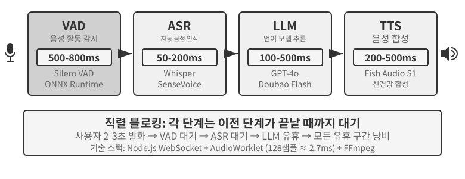

초기 음성 비서가 이 4단계 직렬 파이프라인을 채택한 이유는 단순하다. 하나의 모델이 음성 인식, 언어 이해, 사고, 음성 합성을 동시에 처리할 수 없었기 때문이다. 모듈형 아키텍처에서는 각 구성 요소를 독립적으로 개발하고 최적화할 수 있었다. 그러나 모듈화의 대가는 누적 지연이다. 각 단계가 시작하려면 앞 단계가 끝날 때까지 기다려야 한다.

**VAD**는 파이프라인의 시작에 놓여 오디오 스트림을 계속 감시한다. 핵심 설계 선택은 발화 종료 감지다. 보통 500~800밀리초의 연속 침묵을 임계값으로 사용한다. 사용자가 0.5초 넘게 말을 멈추면 VAD는 발화가 끝났다고 본다. 여기서 첫 번째 지연이 생기고 어려운 절충이 발생한다. 임계값이 너무 짧으면 생각하느라 멈춘 것을 발화 종료로 잘못 판단해 문장을 중간에 끊고, 너무 길면 사용자가 말을 마친 뒤 응답을 받기까지 거의 1초를 기다려야 한다.

**ASR**은 오디오 파형을 텍스트로 변환한다. Whisper나 SenseVoice 같은 소형·중형 모델을 GPU에 배포해 5초 분량의 오디오를 전사하면 보통 50~200밀리초가 걸린다. 더 큰 모델이나 자원이 제한된 배포에서는 200~500밀리초가 걸릴 수 있으며, 실험 9-3의 대조군이 후자에 속한다. 더 중요한 문제도 있다. VAD가 기다리고 ASR이 전사하는 동안 하류의 LLM은 아무 입력도 받지 못한 채 완전히 유휴 상태에 머물러 일찍 사고를 시작할 수 없다.

**LLM** 추론은 최적화를 잘해도 컨텍스트 길이에 따라 첫 토큰 생성 시간(TTFT, Time to First Token)이 100~500밀리초이고, 첫 문장을 끝내는 데 약 100밀리초가 더 필요하다. 사고 기능을 활성화하면 5~10초까지 늘어난다. 전통적인 아키텍처에서는 LLM이 답변 텍스트 전체를 생성할 때까지 TTS를 시작할 수 없다.

**TTS**는 답변 텍스트를 음성으로 변환하며 합성에 보통 200~500밀리초가 걸린다. 각 단계의 지연을 더하면(그림 9-2) VAD 500~800밀리초, ASR 50~200밀리초, LLM 100~500밀리초, TTS 200~500밀리초로 총 약 0.9~2초가 된다. 이마저도 모든 서비스가 유휴 상태이고 대기열이 없는 이상적인 경우다.

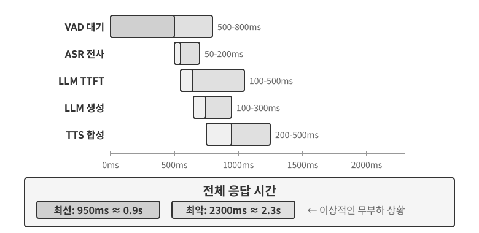

프로덕션 환경에서는 대기열 지연 때문에 상황이 더 나빠진다. 식당과 같다. 주방이 바쁠수록 기다리는 시간이 길어지며, 대기 시간은 선형적으로 늘어나는 것이 아니라 급격히 치솟는다(그림 9-3). 앞에 대기 요청이 없을 때 들어온 요청의 처리 시간은 무대기 지연 또는 유휴 지연이다. 하지만 여러 요청이 한꺼번에 도착하면 늦게 온 요청은 줄을 서야 한다.

직관적으로 사용률이 높을수록 대기 시간은 더 가파르고 비선형적으로 증가한다. 대기행렬 이론은 다음과 같은 근사 관계를 제시한다. 여기서는 직관을 위한 것이므로 엄밀한 유도는 필요 없다. 전체 지연 ≈ 유휴 지연 × 1/(1-사용률). 사용률은 서버가 바쁜 시간의 비율이다. 예를 들어 사용률 50%라면 서버가 절반의 시간에는 요청을 처리하고 나머지 절반에는 유휴 상태라는 뜻이다. 사용률이 50%이면 지연은 두 배가 되고, 80%이면 유휴 지연의 다섯 배가 된다. 서버를 오랫동안 고부하로 운영할 수 없는 이유다.

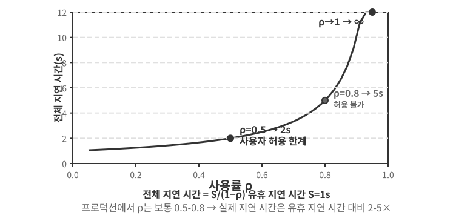

> **실험 9-1 ★: 전통적인 음성 에이전트 구축**
>
> 이 실험에서는 사용자가 마이크를 통해 AI와 음성으로 상호작용할 수 있는 완전한 실시간 음성 대화 시스템을 구축한다. 시스템은 프런트엔드와 백엔드를 분리한 아키텍처를 사용하며 WebSocket으로 실시간 통신한다.
>
> 핵심 과정은 엄격한 직렬 패턴을 따른다. 프런트엔드가 마이크 입력을 캡처해 WebSocket으로 백엔드에 실시간 전송한다. 백엔드는 음성 활동 감지를 위해 Silero VAD 모델을 실행한다. 이 모델은 전통적인 음량 기반 감지 방식보다 정확도가 높고 소음에 강하다. 약 500밀리초의 연속 침묵을 감지하면 후속 처리를 위해 오디오 구간을 추출한다.
>
> ASR, LLM, TTS 단계는 각각 여러 제공자 사이를 유연하게 전환할 수 있어 개발자가 지연 시간, 정확도, 지역별 네트워크 상황에 따라 최적의 조합을 선택할 수 있다.
>
> **실험 9-2 ★: PineClaw Voice API를 이용한 전화 에이전트 구축**
>
> 실험 9-1에서는 브라우저 안에서 동작하는 음성 대화 시스템을 만들었지만, 현실의 에이전트 작업에는 실제 전화 통화가 필요한 경우가 많다. 고객 서비스 센터에 연락해 요금을 협상하거나, 식당을 예약하거나, 주문을 확인하는 작업이 그 예다. 4장에서는 PineClaw의 Channel 메커니즘을 통해 이벤트 기반 아키텍처가 전화 알림의 응답 지연을 몇 분에서 몇 초로 줄이는 방법을 보여 주었다. 이 실험은 음성 통화 자체를 구축하는 데 집중한다. 저자 팀이 개발한 [PineClaw Voice API](https://pineclaw.com/)를 예로 들면, 이러한 프로덕션급 전화 음성 API는 보통 전화 걸기, IVR 탐색, 즉 “문의는 1번, 상담원 연결은 0번” 같은 전화 메뉴, 대화, 전사의 전 과정을 캡슐화한다. 에이전트가 전화번호, 목표, 컨텍스트 정보를 제공하면 음성 에이전트가 전체 통화를 마치고 구조화된 통화 기록을 반환한다.
>
> **실험 목표**: PineClaw Voice를 ReAct 루프의 도구로 통합해 실제 전화 통화로 작업을 완료할 수 있는 에이전트를 구축한다.
>
> **기술적 접근법**: PineClaw Voice Python SDK(`pine-voice`)를 사용해 에이전트에 `make_phone_call` 도구를 제공한다. 에이전트는 “내일 오후 3시에 치과 검진을 예약해 줘” 같은 사용자의 작업 설명을 받고 ReAct 사고를 사용해 (1) 어느 전화번호로 전화할지, (2) 통화의 목표와 핵심 정보가 무엇인지, (3) 통화가 끝난 뒤 결과를 사용자에게 어떻게 보고할지를 결정한다.
>
> 에이전트의 워크플로는 다음과 같다. 사용자가 “병원에 전화해 내일 진료를 예약해 줘”라고 말한다 → 에이전트가 필요한 정보(병원 전화번호, 예약 시각, 환자 이름)를 생각한다 → 정보가 부족하면 사용자에게 명확히 물어본다 → `make_phone_call` 도구를 호출한다 → PineClaw가 전화를 걸고 상대방과 대화해 예약을 마친다 → 에이전트가 통화 요약과 전사문을 받는다 → 사용자에게 결과를 보고한다.
>
> **인수 기준**: 테스트 통화에 성공해야 한다. 먼저 자신의 전화로 걸어 연결 상태를 확인해도 된다. 에이전트는 작업 설명을 바탕으로 통화 매개변수를 자율적으로 결정할 수 있어야 한다. 통화가 끝나면 예약 시각, 확인 번호 같은 핵심 정보를 정확히 추출해 사용자에게 보고해야 한다. API를 직접 사용할 때와 에이전트의 ReAct 루프를 통해 호출할 때의 차이도 비교한다. 후자는 사용자가 전화번호를 제공하지 않으면 검색하는 것처럼 정보가 불완전한 상황을 처리할 수 있다.
>
> 이 실험은 음성 에이전트의 중요한 활용 방향을 보여 준다. **에이전트는 사용자와 음성으로 대화할 뿐 아니라 사용자를 대신해 전화로 외부 세계와 상호작용할 수도 있다.** PineClaw의 음성 에이전트는 한 시간에 이르는 대기, 전화 메뉴 탐색, 복잡한 협상을 처리하도록 특별히 학습되었다. AI가 사용자를 대신해 통신사 고객 서비스 센터에 전화하고 상담원이 연결될 때까지 기다리는 모습을 떠올려 보라. 전통적인 직렬 음성 파이프라인이 어려움을 겪는 바로 그런 시나리오다.

### 캐스케이드 파이프라인의 전체 체인 스트리밍

흔한 오해 하나를 바로잡아야 한다. 앞서 계산한 0.9~2초의 지연은 “각 연결 고리가 끝난 뒤에야 바통을 넘기는” **완전한 직렬** 시나리오를 가정한다. 하지만 2025년의 프로덕션 시스템은 더 이상 이렇게 작동하지 않는다. 주류 접근법은 모듈화를 버리는 것이 아니라 VAD-ASR-LLM-TTS 분업을 유지하면서 각 단계를 **스트리밍**으로 만들어 인접 단계를 시간상 겹치는 것이다.

- **ASR은 들으면서 전사한다**: 스트리밍 인식을 사용해 사용자가 아직 말하는 동안에도 텍스트를 계속 생성한다. VAD가 문장 끝을 판단할 때까지 기다렸다가 전사를 시작하지 않는다.
- **LLM은 문장 단위로 출력한다**: 모델은 생성 과정에서 구두점이나 의미를 기준으로 답을 짧은 문장으로 나눈다. 답 전체를 다 쓸 때까지 기다리지 않고 첫 문장이 만들어지는 즉시 하류로 보낸다.
- **TTS는 문장 수준에서 스트리밍한다**: 첫 번째 짧은 문장이 도착하는 즉시 합성과 재생을 시작하고, 뒤의 문장은 그때그때 생성해 덧붙인다. 사용자가 첫 음절을 듣는 시점을 크게 앞당긴다.

그 결과 ASR, LLM, TTS 세 단계는 더 이상 계주처럼 순차적으로 이어지지 않고, 동시에 가동되는 조립 라인의 세 작업대처럼 움직인다. LiveKit Agents와 Pipecat 같은 오픈 소스 프레임워크뿐 아니라 주류 상용 발신 전화 시스템도 모두 이 접근법을 따른다. 전체 체인을 스트리밍하면 엔드투엔드 지연을 보통 600~800밀리초까지 줄일 수 있어 완전한 직렬 처리의 0.9~2초보다 훨씬 낫다.

하지만 스트리밍은 전사, 사고, 합성처럼 겹칠 수 있는 부분만 줄일 수 있다. 손댈 수 없는 지연 구간이 하나 있다. 바로 **VAD의 침묵 대기와 발화 차례 판단 자체**다. 시스템은 여전히 500~800밀리초의 침묵 임계값으로 사용자가 말을 마쳤는지 추측한다. 이 대기는 응답을 확정하는 전제 조건이므로 단계를 아무리 겹쳐도 사라지지 않는다. 마지막 구간을 줄이려면 “단계 겹치기”에서 맨 앞의 지각 단계로 시선을 옮겨야 한다.

### 스트리밍 음성 지각: VAD + ASR 대체

이 지각 프런트엔드는 두 단계로 이루어진다. VAD는 사용자가 말을 마쳤는지 판단하고, ASR은 오디오를 텍스트로 전사한다. 두 단계가 함께 전체 파이프라인이 언제 시작하며 어떤 입력을 받는지 결정한다. 전통적인 VAD + ASR 캐스케이드에는 세 가지 근본적인 문제가 있다.

1. **지연 누적**: VAD는 미래를 예측할 수 없고 “정말 끝남”과 “생각하느라 잠시 멈춤”을 “기다리는 것”으로만 구별할 수 있으므로, 사용자가 말을 마쳤는지 확인하려면 500~800밀리초의 침묵을 기다려야 한다.
2. **정보 손실**: VAD는 “음성/침묵” 같은 이진 신호만 출력한다. 감정 변화, 말투 변화, 머뭇거리는 쉼, 주변 배경음 등 모든 음향 세부 정보가 사라진다. 복잡한 환경에서는 특히 오류가 잦다. 조금 긴 쉼을 발화 종료로 오인해 문장을 잘라 버릴 수 있고, 배경 소음이 잘못된 시작 신호를 일으켜 아무도 말하지 않는데 시스템이 오디오 처리를 시작할 수 있으며, 사용자의 “응”이 끼어들기인지 맞장구인지 구분하지 못할 수 있다.
3. **정확도 저하**: VAD는 연속 오디오를 독립된 구간으로 자른 뒤 각각 ASR에 보내 인식하므로 컨텍스트의 연속성이 깨진다. 이메일 주소, 브랜드명, 사람 이름 등 컨텍스트가 필요한 고유명사에서 인식 오류가 크게 늘어난다. 예를 들어 사용자가 “john dot smith at gmail dot com”이라고 말했는데 “john”과 “smith”가 서로 다른 구간으로 잘리면 컨텍스트 부족으로 “smith”를 “miss”로 잘못 인식할 수 있다.

**스트리밍 음성 지각 모델**은 근본적인 해법을 제공한다. 먼저 “스트리밍”의 기술적 의미를 분명히 하자. 음성 모델의 스트리밍 가능 여부는 **인코더가 인과적이거나 청크 기반인지**, 즉 이미 도착한 오디오에만 의존하고 전체 녹음이 필요 없는지, 그리고 **디코딩이 점진적인지**, 즉 작은 오디오 청크가 들어올 때마다 부분 결과를 내보내는지에 달려 있다. Whisper가 스트리밍할 수 없는 이유는 원래 자기회귀 방식인 디코딩이 아니라 인코더가 시작 전에 완전한 오디오 구간, 즉 고정된 30초 분량을 필요로 하고 짧으면 패딩하기 때문이다. 스트리밍 인식 자체는 새로운 기술이 아니라는 점도 유의해야 한다. RNN-T와 스트리밍 Conformer로 대표되는 전통적인 스트리밍 ASR은 오래전부터 산업 현장에 대규모로 배포되었다. 휴대전화의 실시간 자막과 키보드 앱의 음성 입력이 바로 이런 모델을 사용하며 LLM과는 무관하다.

이 절에서는 새로운 경로인 **LLM 기반 스트리밍 청각 지각**에 집중한다. 오픈 소스 LLM 백본을 사후 학습해 연속 오디오 스트림에서 곧바로 의미 응답을 생성하게 하여 “인식”과 “이해”를 하나의 모델에 합치는 방식이다. 스트리밍 기술을 새로 발명한 것이 아니라 전통적인 스트리밍 ASR을 업그레이드한 것이다. 점진적 인식 지연은 여전히 한 단계 추론 시간인 수십~수백 밀리초 수준이지만, 모델은 더 이상 VAD가 잘라 낸 고립된 조각을 보지 않는다. 대신 대화 시작부터 현재 순간까지 이어지는 연속 오디오 스트림을 보므로 완전한 컨텍스트를 바탕으로 인컨텍스트 학습을 수행하고, 개인 정보, 전문 용어, 개인별 발음 패턴의 인식 정확도를 크게 높인다.

또 다른 핵심 장점은 이 경로가 LLM의 세계 지식과 상식적 사고 능력을 물려받는다는 것이다. 백본 모델은 방대한 텍스트를 이미 보았다. 예를 들어 모델은 “Apple” 뒤에 “event”가 나오면 과일보다는 회사를 가리킬 가능성이 높다는 사실을 안다. 이러한 지식 강화 덕분에 금액, 지명, 브랜드명 같은 가치 높은 정보의 인식 정확도가 전통적인 ASR을 크게 앞선다. 이 경로에는 이미 배포 가능한 모델이 있다. Fixie의 Ultravox는 오디오를 LLM 백본에 직접 입력하고 텍스트와 의미 토큰을 출력한다. 이 절의 실험에서 사용하는 Qwen2-Audio와 Alibaba의 Qwen2.5-Omni도 이러한 오디오 네이티브 모델 범주에 속한다.

그러나 VAD를 대체하기 위해 반드시 대규모 오디오 LLM을 사용할 필요는 없다. 목표가 첫 번째 문제인 **사용자가 말을 마쳤는지 판단하는 것**뿐이라면 더 가벼운 경로가 있다. 이 “발화 차례 판단”을 인식기 자체에 직접 내장하는 방식이다[^ch9-11]. 소형 오픈 소스 스트리밍 인식 모델에 LoRA 어댑터를 추가해 전사하면서 **의미와 침묵을 함께 고려**하여 문장이 완결된 생각을 표현했는지 판단하게 한다. 전화번호를 읽다가 잠시 쉬는 것처럼 한 발화 안의 쉼이 발화 차례 사이의 간격보다 긴 경우가 많아 침묵 임계값만으로는 양쪽 모두에서 실패할 수밖에 없기 때문이다. 더 흥미로운 발견도 있다. 모델이 발화 차례를 넘겨받을지 계속 망설이는 근본 원인은 보통 아키텍처가 아니라 **사후 정보를 보고 주석을 단 학습 레이블**이다. 주석 작성자가 의사결정 시점 뒤에 등장해 온라인 모델은 절대 볼 수 없는 오디오를 사용한 것이다. 모든 레이블을 의사결정 순간에 이용할 수 있는 정보만으로 다시 작성하면 이러한 가짜 망설임이 사라진다. 이는 7장의 사후 학습에서 내린 판단, 즉 데이터가 아키텍처보다 더 중요한 경우가 많다는 점과 통한다. 이 가벼운 경로에도 프로덕션급 구현이 있다. Deepgram의 Flux와 AssemblyAI의 Universal-Streaming은 음성 에이전트용으로 설계되어 스트리밍 인식 모델 안에 종단점 및 발화 차례 감지를 직접 내장한다. 오픈 소스 진영에서는 LiveKit과 Pipecat이 의미 기반 발화 차례 감지 모델을 제공한다.

[^ch9-11]: 발화 차례 판단을 인식기에 내장하는 방법과 사후 정보 기반 레이블 문제에 관한 분석은 Bojie Li와 Noah Shi의 *The Trade-off Was in the Labels: Causal Supervision for Turn-Aware Streaming ASR.* 2026(출간 예정)에서 확인할 수 있다.

모델은 텍스트뿐 아니라 일련의 **음향 이벤트 특수 표지**도 출력한다. 모델 학습 중에 도입한 전용 토큰으로, 해당 음향 이벤트를 감지하면 자동으로 출력하도록 학습한다. 일반적인 유형은 다음과 같다.

- `<speak_start/end>`: 단순한 침묵 감지가 아니라 의미와 음향을 종합적으로 판단해 발화 시작과 끝을 표시한다.
- `<interrupt>`: 사용자가 정말 끼어들려는지, 단순히 맞장구를 치는지, 배경 소음의 영향인지 구분한다.
- `<emotion:happy/frustrated>`: 감정 표지다.
- `<laugh>` / `<sigh>`: 웃음이나 한숨 같은 준언어적 신호다.
- `<music>` / `<noise>`: 환경음이다.

이 표지들은 텍스트 토큰과 함께 통합 이벤트 스트림을 이루어 사고 계층에 입력된다.

```
입력 오디오: "음, 사실 내 생각에는... 아니 잠깐, 다시 생각해 볼게요."
모델 출력 스트림:
  <speak_start> 음, <emotion:hesitant> 사실 내 생각에는...
  <silence:500ms> 아니 잠깐, <emotion:confident> 다시 생각해 볼게요 <speak_end>
```

모델이 텍스트 전사뿐 아니라 발화 시작과 끝, 감정 변화, 침묵 구간 같은 음성 이벤트 표지도 출력한다는 점에 주목하자. 에이전트 프레임워크는 이 표지를 활용해 더 자연스럽게 상호작용할 수 있다. 예를 들어 사용자가 망설이는 것을 감지하면 먼저 선택지를 제시할 수 있다.

> **실험 9-3 ★: Qwen2-Audio를 이용한 스트리밍 음성 지각 시뮬레이션**
>
> 먼저 실험 설계의 한계를 짚어야 한다. Qwen2-Audio 자체는 전체 구간을 입력받는 비스트리밍 모델이다. 이 실험에서는 **청크 입력으로 스트리밍 처리를 시뮬레이션한다.** 연속 오디오 스트림을 고정 길이의 작은 청크로 잘라 누적된 오디오 컨텍스트와 함께 하나씩 모델에 보낸다. 모델은 텍스트와 웃음, 쉼, 기타 비언어적 신호 같은 음향 이벤트 토큰을 점진적으로 생성하고, 실험에서는 각 청크를 보낸 시점부터 텍스트를 받을 때까지의 지연을 측정한다. 이 접근법에는 중요한 비용이 따른다. Qwen2-Audio의 인코더는 점진적이지 않다. 모델이 새 청크를 처리할 때마다 앞서 누적된 오디오 전체를 처음부터 다시 인코딩해야 한다. 대화가 길어질수록 청크별 인코딩 지연도 늘어난다. 새로 도착한 오디오만 처리하는 점진적 또는 인과적 인코더를 사용하는 “진정한 스트리밍”과 “시뮬레이션 스트리밍”의 본질적인 차이다. 이 설계는 완전한 컨텍스트를 이용하는 연속 지각의 정확도 이점을 보여 주지만, 지연 수치는 청크 크기와 추론 속도만 반영한다. 청크 인코딩을 사용하는 Qwen3-Omni처럼 진정한 스트리밍용으로 설계한 모델의 첫 패킷 지연을 나타내지는 않는다. 관심 있는 독자는 그런 모델로 실험을 반복할 수 있다. 기준선은 전통적인 VAD + Whisper ASR 파이프라인이다. 정상 대화, 쉼이 있는 긴 문장, 배경 소음이 있는 대화라는 세 가지 시나리오를 다룬다.
>
> 결과는 다음과 같다. 청크 시뮬레이션 방식의 점진적 인식 지연은 청크 길이와 하드웨어에 따라 100~200밀리초 수준으로 제어할 수 있다. 반면 전통적인 방식은 VAD의 종료 확인에 600밀리초를 기다리고 Whisper 추론에 이 실험 설정 기준 약 200~500밀리초가 더 걸려 총 800~1100밀리초가 필요하다. 쉼이 있는 시나리오에서 VAD는 첫 번째 긴 쉼을 발화 종료로 잘못 판단해 문장을 두 구간으로 자르고 따로 인식했다. “大概两点左右”(“두 시쯤”)를 “大概零点左右”(“자정쯤”)로 잘못 인식했다. 주변 컨텍스트가 사라지자 발음이 비슷한 两(liǎng, “둘”)를 零(líng, “영”)으로 잘못 들은 것이다. 완전한 컨텍스트를 유지한 청크 방식은 문장 전체를 정확히 인식했다. 배경 소음 시나리오에서 Qwen2-Audio는 `<|noise|>` 토큰으로 소음의 존재를 표시하면서 인식을 중단하지 않는다. 반면 전통적인 VAD는 소음에 잘못 반응해 인식 과정을 너무 일찍 시작했다.

## 패러다임 2: 엔드투엔드 옴니모달 모델(Omni)

캐스케이드 파이프라인 전체를 다시 보자. 지각 프런트엔드를 스트리밍 음성 지각으로 업그레이드해도 듣기, 사고, 말하기를 여전히 이산 인터페이스로 연결한 세 독립 모델에 나눠 맡긴다. 인터페이스를 아무리 넓혀도 전달할 수 있는 것은 소수의 의미 토큰과 가끔 나타나는 음향 표지뿐이다. 화자의 감정, 말투, 억양, 주변의 배경음이나 음악은 전달 과정에서 대부분 사라진다. 세 구간을 따로 학습하고 조정하므로 하나처럼 협력하기도 어렵다. 엔드투엔드 옴니모달 모델(Omni)은 다른 길을 택한다. 하나의 모델이 오디오를 직접 “듣고”, 답을 “생각하고”, “말하여” 세 구간을 하나로 합친다(그림 9-4). 학습 데이터가 충분하면 모델 내부의 잠재 공간이 이러한 준언어적 신호를 생성 측까지 곧바로 전달하므로, 텍스트만으로는 불가능한 방식으로 운율과 감정을 보존하면서 지연도 줄일 수 있다. 절충은 다음과 같다. **캐스케이드 파이프라인**은 모듈이 깔끔하고 구간별 조정이 가능하며 해석 가능성이 높다. **엔드투엔드 모델**은 더 많은 학습 데이터를 요구하고 해석 가능성이 떨어지는 대가로 지연 시간을 줄이고 비텍스트 정보를 충실하게 보존한다.

흔히 간과하는 차원이 하나 있다. 엔드투엔드 모델의 주된 장점은 **지연 시간**이지, **정확도**에서도 반드시 우세한 것은 아니다. 유용한 비교 대상은 같은 모델이 먼저 오디오를 구조화된 텍스트로 전사한 뒤 그 텍스트를 바탕으로 사고하는 **자기 캐스케이드(self-cascade)**다. 자기 캐스케이드와 단일 엔드투엔드 패스 중 어느 쪽이 더 정확한지는 작업에 따라 달라지며 패턴은 분명하다. 답이 주로 “무슨 말을 했는가”라는 의미 내용으로 결정되고 중간 텍스트가 작업 관련 정보를 충분히 전달할 수 있다면, 특히 지각 능력이 약한 모델에서는 자기 캐스케이드가 엔드투엔드와 대등하거나 더 낫다. 답이 말투, 감정, 환경음처럼 텍스트로 표현하기 어려운 비언어적 단서에 달려 있으면 엔드투엔드가 뚜렷이 앞선다. 더 중요한 점은 어느 쪽이 이길지 “엔드투엔드가 더 발전했다”는 말로 뭉뚱그리지 않고 **작업의 성격을 보고 미리 예측할 수 있다**는 것이다. 여기서 설계 원칙이 나온다. 성능을 좌우하는 것은 보통 **병목**인 중간 표현의 존재 여부가 아니라 그 병목이 어떤 정보를 전달하는가다. 단순 전사에 그친 중간 텍스트를 감정, 말하기 속도, 환경음 같은 준언어적 표지가 포함된 구조화된 표현으로 업그레이드하면 엔드투엔드 모델의 정확도 우위가 줄어드는 경우가 많다. 앞의 “스트리밍 음성 지각”에서 지각 계층이 평범한 텍스트만 출력해서는 안 된다고 한 것과 같은 주장이다[^ch9-13].

Omni가 아무리 강력해져도 세 모델을 하나로 합쳤을 뿐, **“차례 주고받기” 가정은 버리지 않았다.** 여전히 VAD로 발언권을 배분해 사용자가 말하는 것을 감지하는 순간 침묵하고, 사용자가 조용해지는 순간 말을 시작한다. 그래서 익숙한 실패가 되풀이된다. 사용자가 숫자를 줄줄이 읽다가 잠깐 멈추면 Omni는 말을 마쳤다고 판단하고 끼어든다. 앞에서 설명한 스트리밍 음성 지각은 발화 차례 판단을 침묵 길이에서 의미 수준으로 끌어올려 이런 오작동을 크게 줄인다. 하지만 여전히 차례 주고받기 프레임워크 안의 국소적인 보완이지, 차례 주고받기 자체의 종말은 아니다. **완전히** 벗어나려면 프레임워크 내부를 보완하는 일을 멈춰야 한다. “누구의 차례인가”를 정하는 단단한 스위치 없이 모델이 동시에 듣고 말하며, 언제 말할지를 스스로 결정하게 해야 한다.

[^ch9-13]: 캐스케이드와 엔드투엔드의 정확도 우위가 언제 뒤집히는지, 그리고 중간 표현이 작업 관련 정보를 충분히 전달할 수 있는지를 비롯한 작업의 성격을 바탕으로 그 방향을 예측하는 방법에 관한 완전한 교차 모달 측정은 Bojie Li와 Noah Shi의 *The Cascade Gap: When and Why Self-Cascades Help Multimodal Agents.* 2026(출간 예정)에서 확인할 수 있다.


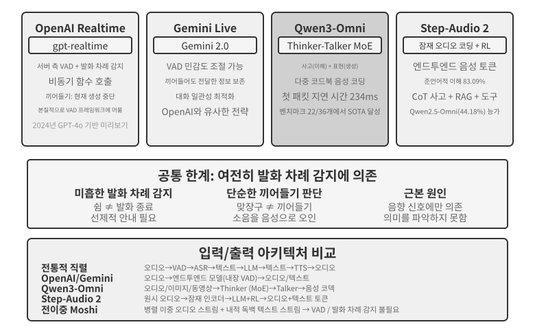


모델 수준에서 **OpenAI Realtime API**는 오디오를 네이티브로 처리하므로 엔드투엔드에 가깝다. 그러나 상호작용 제어 수준에서는 여전히 전통적인 VAD에 의존하므로 완전한 엔드투엔드 시스템으로 가는 중간 단계다. 2024년 미리보기는 처음에 GPT-4o로 구동되었지만, 2025년 API가 정식 출시되면서 GPT-4o의 한 모드가 아니라 실시간 음성에 최적화한 전용 모델인 **gpt-realtime**로 전환했다. API는 기본적으로 서버 측 VAD를 활성화해 사용자가 말하기 시작하고 멈추는 시점을 자동으로 판단한다. 끼어들기도 지원한다. 사용자가 말하기 시작하면 대면 대화에서 끼어드는 말을 들은 사람이 자연스럽게 입을 다물듯 현재 음성 생성을 즉시 중단한다. gpt-realtime은 비동기 함수 호출도 도입해 도구 결과를 기다리는 동안 모델이 계속 말하게 하고, 도구 지연을 대화 속에 숨긴다. 이러한 개선은 경험을 향상하지만 여전히 VAD 프레임워크 안의 최적화다. **Gemini Live API**도 비슷한 접근법을 취한다. VAD 민감도를 조절할 수 있고, 끼어든 뒤에도 이미 전달한 정보를 보존해 대화의 일관성을 유지한다.

**Qwen3-Omni**는 이해·사고를 담당하는 Thinker와 음성 생성을 담당하는 Talker를 두 전문 모듈로 분리하는 아키텍처를 채택해 텍스트, 이미지, 오디오, 동영상의 인식과 생성을 통합한다.

Qwen3-Omni는 높은 능력을 유지하면서 계산 비용을 통제하기 위해 전문가 혼합(MoE, Mixture of Experts) 아키텍처를 채택한다. “필요할 때 전문가 팀을 부르는” 방식으로 생각할 수 있다. 내부에 여러 소형 전문가 네트워크가 있고, 각 추론에서는 현재 작업과 가장 관련 있는 소수만 활성화하며 나머지는 계산에 참여하지 않는다. 예를 들어 음성을 처리할 때는 주로 음성 관련 전문가를, 이미지를 처리할 때는 주로 시각 관련 전문가를 활성화한다. 이 덕분에 모델은 전체 매개변수 수를 매우 크게 유지해 높은 능력을 확보하면서도 토큰당 실제 계산량은 작게 유지할 수 있다. 따라서 추론 처리량이 높아지고 고부하에서 대기열 지연이 줄어든다.

구분해 두어야 할 점이 있다. MoE는 단위 계산 자원으로 처리할 수 있는 요청 수인 처리량을 높인다. 첫 번째 오디오 패킷을 얼마나 빨리 내보낼 수 있는지를 직접 결정하지는 않는다. 첫 패킷 지연은 생성 아키텍처에 달려 있다. Qwen3-Omni의 첫 패킷 지연이 짧은 이유는 Talker 모듈에 있다. 다중 코드북 자기회귀로 오디오 토큰을 점진적으로 생성하고, 인과적 코덱이 토큰을 파형으로 점진적으로 디코딩한다. 사고 모듈이 텍스트를 생성하는 즉시 Talker는 전체 답을 기다리지 않고 음성 스트리밍을 시작할 수 있다. 공식 보고서에 따르면 이론적인 콜드 스타트 첫 패킷 지연은 약 234밀리초다. 19개 언어의 이해와 10개 언어의 생성을 지원하며, 오디오·동영상 벤치마크 36개 중 22개에서 선두를 달린다.

**Step-Audio 2**는 다른 경로를 택한다. 원시 오디오 입력을 직접 처리해 텍스트와 오디오를 모두 출력함으로써 진정한 엔드투엔드 음성 대화를 구현한다. 말한 *내용*인 의미 정보뿐 아니라 말한 *방식*도 인식한다. 화자의 감정이 기쁜지 화났는지, 말하는 속도가 빠른지 머뭇거리는지, 억양이 올라가는지 내려가는지 같은 준언어적 정보와 배경 환경음 및 음악이 여기에 포함된다. 사고와 강화 학습을 통해 표현력 있는 응답을 생성하며 RAG 메커니즘과 외부 도구(웹 검색, 오디오 검색)도 통합한다. Step-Audio 2 논문에 따르면 제안한 준언어 이해용 StepEval-Audio-Paralinguistic 벤치마크에서 Step-Audio 2는 83.09%의 정확도를 달성했다. 같은 시기의 오픈 소스 옴니모달 모델 Qwen2.5-Omni(44.18%)를 크게 앞서고 GPT-4o Audio(43.45%)와 Kimi-Audio(49.64%)도 능가했다.

Step-Audio R1은 Step-Audio 계열의 후속 모델이다. Step-Audio 2의 엔드투엔드 음성 대화 아키텍처를 바탕으로 사고 능력을 오디오 모델에 직접 한층 더 내재화한다. 두 모델은 같은 기술 경로에서 이어지는 점진적 진화를 보여 준다.

## 패러다임 3: 전이중 / 상호작용형 모델

패러다임 2는 세 모델을 하나로 합쳤지만 여전히 사용자 또는 모델 중 하나만 말하고 전환 시점을 VAD나 의미로 추측하는 차례 주고받기 가정을 고수했다. 어떤 시나리오에서는 “네 문장 다음에 내 문장”이라는 방식이 아예 성립하지 않는다. 대표적인 예가 **동시통역**이다. 통역사는 문장이 끝날 때까지 기다렸다가 시작하지 않고, 듣는 동시에 문장을 구성해 의미 단위가 대략 완성되는 즉시 옮긴다. 듣기와 번역이 항상 겹친다. **음악에 맞춰 북소리를 치는 리듬 게임**은 더 극단적이다. 귀는 끊임없는 음악 스트림을 따라가고, 손은 매 순간 박자에 맞춰 움직이며, 머리는 다음 박자를 예측해야 한다. 여기에는 “차례”가 없고 끝없이 이어지는 입력 스트림만 있다. 이런 작업은 차례 기반 모델의 근본에 도전한다. 듣기, 사고, 행동이 동시에 일어나야 하지만 차례 기반 모델의 전제는 세 활동을 서로 다른 시간 구간에 배치하는 것이기 때문이다. 전이중 모델은 “VAD 제거” 경로를 논리적 종착점까지 밀어붙인다. 차례 주고받기 가정을 버리고 모델이 **계속해서 동시에 듣고 말하게** 한다.

이 분야를 개척한 연구는 Kyutai의 **Moshi**(2024)다. 사용자의 음성과 모델 자체의 음성이라는 두 오디오 스트림을 병렬로 모델링하고, “내적 독백” 텍스트 스트림을 더해 생성 음성의 언어 품질을 높인다. 항상 듣고 있으므로 말 겹침과 끼어들기가 자연스러운 행동이 되며 명시적인 끼어들기 감지 논리가 필요 없다. 엔드투엔드 지연은 약 200밀리초로 사람 대화의 자연스러운 리듬에 가깝다.

2026년 Mira Murati가 설립한 **Thinking Machines Lab**은 **상호작용 모델(Interaction Model)**이라는 새로운 범주를 미리 공개했다[^ch9-14]. 상호작용성은 모델을 감싸는 VAD 같은 외부 하네스가 아니라 모델 자체에 내장해야 한다고 명시적으로 주장했다. 이들의 표현을 빌리면 “상호작용성이 지능과 함께 확장되려면 모델 자체의 일부가 되어야 한다.” 아키텍처에서는 이를 **마이크로 턴(micro-turn)**으로 구현한다. 발화 차례 전체가 끝날 때까지 기다리지 않고 약 200밀리초 구간 단위로 작동한다. 입력 200밀리초를 계속 처리하고 출력 200밀리초를 생성해 오디오, 동영상, 텍스트 스트림이 서로 교차하며 함께 진행하게 한다. 이 세밀도는 의도적인 절충이다. 침묵, 겹침, 끼어들기를 인위적인 발화 경계에 맞출 필요 없이 모델 컨텍스트의 연속 스트림으로 보존할 만큼 세밀하면서도, 여러 모달리티를 청크 단위로 병렬 처리해 지연을 사람이 실시간으로 느끼는 범위 안에 둘 만큼은 굵다. 상호작용이 모델 안에 있으므로 말하면서 듣고, 보면서 끼어드는 등 이전에는 전문 하네스로 조립해야 했던 행동이 이제 모델의 일 자체가 되고 모델과 함께 강해진다. 첫 모델인 TML-Interaction-Small은 세 스트림을 모두 처음부터 공동 학습했다. 사용자가 버그가 있는 코드를 작성하거나 누군가 화면에 들어오는 것을 알아차리면 요청하지 않아도 먼저 말할 수 있다.

“느린 사고”를 다루는 방식도 대표적이다. 상호작용 모델 자체는 대화를 끊기지 않게 유지하는 일만 맡는다. 깊은 사고나 도구 호출이 필요한 문제를 만나면 백그라운드의 더 강력한 사고 모델에 위임한다. 이때 넘기는 것은 고립된 질의가 아니라 **전체 대화 컨텍스트**다. 백그라운드 모델이 사고하는 동안 결과는 점진적으로 스트리밍되어 돌아온다. 상호작용 모델은 계속 응답하고 후속 질문에 답하며 발언권을 유지하다가 사용자를 방해하지 않는 순간을 골라 결과를 대화에 자연스럽게 엮는다. 이로써 “비사고 모델의 지연 시간”으로 “사고 모델의 계획, 도구, 에이전트 능력”을 제공한다. 공식 보고서에 따르면 매개변수 276B 중 12B를 활성화하는 MoE인 TML-Interaction-Small은 발화 차례 전환 지연을 약 0.40초까지 낮췄다. GPT-realtime-2.0은 약 1.18초다. 또한 시각적 선제성 벤치마크에서 거의 0점에 가까운 경쟁 모델을 크게 앞선다. 집필 시점에는 아직 연구 미리보기 단계다.

[^ch9-14]: Thinking Machines Lab, “Interaction Models: A Scalable Approach to Human-AI Collaboration,” 2026-05. https://thinkingmachines.ai/blog/interaction-models/

같은 해 OpenAI의 **GPT-Live**는 전이중 방식을 프로덕션 규모로 끌어올려 ChatGPT의 새로운 기본 음성 모델로 전 세계에 출시했다. 더 이상 대화를 개별 메시지 차례의 연속으로 취급하지 않고 **입력을 계속 처리하면서 출력을 계속 생성한다.** 따라서 말을 시작할지, 계속 들을지, 멈출지, 끼어들지, 도구를 호출할지를 초당 여러 번 결정할 수 있다. 그 결과 사용자가 생각할 때 끼어들지 않고 조용히 기다리며, “음”, “맞아요” 같은 맞장구로 듣고 있음을 보여 준다. 동시에 듣고 말해야 하는 실시간 번역 같은 작업도 수행할 수 있다.

GPT-Live도 빠른 과정과 느린 과정을 분리하는 같은 경로를 따른다. **“실시간 상호작용”과 “깊은 사고”를 분리**하는 것이다. 검색, 사고, 더 복잡한 에이전트 작업이 필요한 과제를 만나면 상호작용형 GPT-Live가 대화 흐름은 계속 유지하면서 백그라운드의 프런티어 모델(출시 시점에는 GPT-5.5)에 과제를 위임한다. 백그라운드 모델이 결과를 내면 GPT-Live가 대화에 통합한다. GPT-Live-1과 mini 버전은 백그라운드에서 GPT-5.5 Instant를 사용하고, Medium과 High 등급은 사고 기능이 활성화된 GPT-5.5를 호출한다. 사용자는 필요에 따라 “빠름”과 “깊음” 중 하나를 선택할 수 있다. 이러한 “빠른-느린 분업”은 바로 다음 절인 “사고 아키텍처의 절충”에서 확장해 다룰 주제다.

이 장에서 이어 온 “VAD 대체”의 흐름을 되짚어 보자. VAD는 침묵 임계값을 바탕으로 발화 차례 전환 시점을 추측한다. 스트리밍 지각(패러다임 1의 앞 절 “스트리밍 음성 지각” 참조)은 전환 판단을 의미 수준으로 끌어올린다. 전이중 모델은 “전환”이라는 개념 자체를 완전히 해체한다. 항상 듣고 있으므로 “끼어들기”는 더 이상 특별히 처리할 이벤트가 아니며, 발화 중 끼어들기 처리 체인도 아키텍처 차원에서 대부분 사라진다. 집필 시점에서 “VAD 대체” 흐름이 도달한 종착점이다.

## 사고 아키텍처의 절충: 분리에서 통합으로

진정한 과제는 **실시간 응답과 깊은 사고 사이의 긴장**이다. 사용자는 밀리초 단위의 응답을 기대하지만 복잡한 문제에는 수초의 사고 시간이 필요하다. 모델은 어떻게 지연 시간을 낮게 유지하면서 충분히 깊이 사고할 수 있을까? 이 긴장은 엔드투엔드 아키텍처에만 있는 것이 아니며 캐스케이드 파이프라인도 마주한다.

아래의 세 해법은 선형적인 발전 단계를 나타내지 않는다. 서로 다른 제약에 맞춘 설계상의 절충이며 실무에서 함께 쓰인다. 올바른 선택은 애플리케이션의 지연 시간 요구와 필요한 사고의 깊이에 달려 있다. 핵심 차이는 다음과 같다. 해법 1과 2는 동시에 실행되는 빠른 모델과 느린 모델이라는 두 독립 모델에 작업을 나눈다. 엔드투엔드 아키텍처가 필요 없으며 캐스케이드 파이프라인 위에 얹을 수도 있다. 해법 3만이 사고를 엔드투엔드 모델 안에 진정으로 내재화한다.

2026년에는 “빠른-느린 분리” 경로가 프런티어 음성 제품의 주류 선택이 되면서 고유한 이름도 얻었다. Thinking Machines Lab은 실시간 상호작용 모델과 비동기 백그라운드 사고 모델을 결합한 이 방식을 “상호작용 모델”이라고 부른다. xAI Grok Voice의 “Think Fast”, Pine AI의 음성 에이전트, 앞 절에서 살펴본 GPT-Live의 “위임”은 모두 “포그라운드의 빠른 모델이 대화를 유지하고 백그라운드의 느린 모델이 깊이 사고하는” 같은 경로를 따른다. “하나의 전능한 모델을 학습”하는 대신 분리하는 데는 실용적인 이유가 있다. 프런티어 사고 모델은 몇 달마다 새로 발전하지만 실시간 상호작용 능력에는 전문 데이터와 학습 목표가 필요하다. 둘을 같은 모델에 넣으면 계속 움직이는 표적을 쫓아야 하고, 가장 가치 있는 사고 능력을 희석할 가능성도 있다[^ch9-8]. 반대로 가장 강력한 사고 모델은 백그라운드에 온전히 유지하고 포그라운드에는 가벼운 상호작용 모델만 학습하면 언제나 현재 가장 강력한 “두뇌”를 사용할 수 있다. GPT-Live가 “최신 프런티어 모델로 지속 가능하게 교체”할 수 있음을 강조하는 이유가 바로 이것이다. 이제 조정 메커니즘이 점점 강해지는 순서로 세 해법을 살펴보자.

### 해법 1: 빠른 사고는 말채우기, 느린 사고는 답변

빠른 사고와 느린 사고를 병렬로 실행한다(그림 9-5). 빠른 사고는 사람이 먼저 “생각해 볼게요”라고 말하듯 500밀리초 안에 짧은 대기용 답변을 내놓고, 느린 사고는 백그라운드에서 5~10초 동안 사고한 뒤 완전한 답을 전달한다. 느린 사고의 기반 기술은 “테스트 시간 확장(test-time scaling)”이다. 쉽게 말해 답하기 전에 모델이 조금 더 오래 생각하게 하는 것이다. 한 번에 답으로 뛰어들지 않고 사람이 수학 문제를 풀 때처럼 접근법의 윤곽을 잡고, 단계별로 유도하고, 결과를 확인하며 더 많은 계산을 더 나은 답과 맞바꾼다.

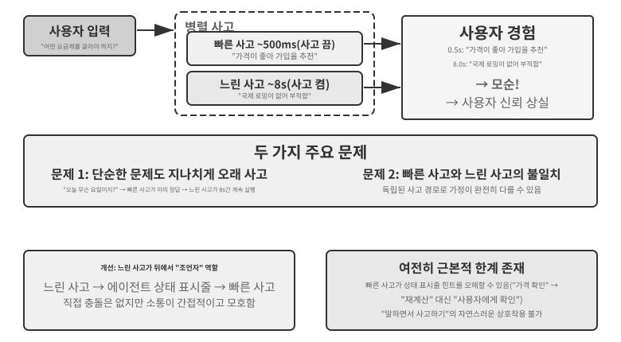

**문제 1: 간단한 질문을 지나치게 오래 생각한다.** 사용자가 “오늘이 무슨 요일인가요?”라고 묻는다. 빠른 사고는 500밀리초 안에 “수요일입니다”라고 정확히 답하지만, 느린 사고는 여전히 10초를 모두 사용해 생각한 뒤 “수요일입니다”를 반복한다. 계산 자원을 낭비할 뿐 아니라 더 심각하게는 대화의 리듬을 깨뜨린다. 사용자는 이미 답을 얻어 다음 주제로 넘어가려는데 반복된 응답이 끼어든다. **문제 2: 빠른 사고와 느린 사고가 일치하지 않는다.** 둘은 독립적으로 병렬 실행된다. 같은 컨텍스트를 보지만 사고 경로가 완전히 달라질 수 있다. 빠른 사고는 한 가지 가정에 근거해 답하고, 느린 사고는 그 가정이 틀렸음을 발견해 정반대 결론에 도달한다. 사용자는 몇 초 만에 시스템이 자기모순에 빠지는 것을 듣고 즉시 신뢰를 잃는다. 근본 원인은 해법 1이 대화를 하나의 일관된 인지 활동이 아니라 두 개의 독립적인 사고 과정으로 쪼개며, 빠른 사고와 느린 사고를 조정할 메커니즘이 없다는 데 있다.

```
<user>이 요금제가 저에게 맞나요?</user>
<!-- 0.5초 뒤 빠른 사고 -->
<assistant (fast thinking)>이 요금제는 매우 저렴하니 가입을 권합니다.</assistant>
<user>좋아요, 그럼...</user>
<!-- 8초 뒤 느린 사고 완료 -->
<assistant (slow thinking)>잠깐만요. 이 요금제에는 고객님께 필요한 국제 로밍 기능이 없어서 적합하지 않을 수 있습니다.</assistant>
<user>(화남) 그래서 가입하라는 건가요, 말라는 건가요?!</user>
```

### 해법 2: 빠른 사고는 상호작용, 느린 사고는 조언

해법 2에서는 느린 사고가 빠른 사고의 출력을 볼 수 있다. 사용자에게 직접 말하는 대신 2장에서 소개한 동적 메타 정보 주입 메커니즘인 에이전트 상태 표시줄을 통해 제안한다. 해법 1과 비교하면 두 가지가 개선된다. 느린 사고는 백그라운드에서 비동기로 실행되어 말이 비는 동안에도 계속 사고한다. 또한 빠른 사고의 출력을 볼 수 있으므로 정면으로 모순되는 대신 무대 뒤의 “전략가” 역할을 한다. 앞서 언급한 GPT-Live의 위임과 Pine AI 음성 에이전트가 해법 2의 프로덕션 사례다. 백그라운드 사고 모델이 간결한 텍스트 채널을 통해 포그라운드 상호작용 모델에 결론을 보내면, 포그라운드 모델이 사용자에게 언제 어떻게 제시할지 결정한다.

하지만 이 해법에도 근본적인 한계가 있다. **빠른 사고가 지침을 따르지 않을 수 있다.** 두 독립적인 사고 과정 사이의 커뮤니케이션은 간접적이고 모호하다. 빠른 사고가 에이전트 상태 표시줄 업데이트를 잘못 읽을 수 있다. “가격을 다시 확인해야 한다”는 말의 의도는 “가격 계산이 잘못되었으니 다시 계산하라”인데 “이 가격을 받아들일 수 있는지 사용자에게 물어보라”는 뜻으로 해석할 수 있다. **중간 사고를 볼 수 없다.** 느린 사고가 10초의 사고 과정에서 가치 있는 중간 결론을 내더라도 빠른 사고는 이를 전혀 볼 수 없고 최종 상태 업데이트만 기다려야 한다. 느린 사고가 끝나기 전에 사용자가 다른 질문을 하거나 끼어들면 빠른 사고는 제한된 자체 이해만으로 답해야 한다. 두 사람이 함께 문제를 풀면서 서로의 연습장은 볼 수 없고 쪽지만 주고받는 것과 같다.

해법 2에는 근본적인 이론 문제도 있다. **“말하면서 사고하기”를 구현할 수 없다.** 사람은 복잡한 문제를 만나면 머릿속에서 완전한 답을 먼저 만든 뒤 한꺼번에 말하지 않는다. “흥미로운 질문이네요... (생각하느라 멈춤) 먼저 고려할 것은... (계속 생각함) 둘째로...”처럼 구간별로 생각하고 말한다. 해법 2에서 빠른 사고는 느린 사고를 기다리는 동안 말채우기 표현만 제공할 수 있으며, 사고 과정을 대화에 자연스럽게 엮을 방법이 없다.

### 해법 3: 사고와 표현의 엔드투엔드 통합(Step-Audio R1 사례)

해법 2는 사용자가 느린 사고를 기다리는 시간을 줄이지만, 아키텍처상 여전히 “먼저 생각하고 나중에 말한다.” 사고와 표현이 별개의 두 과정으로 남아 있어 사람과 같은 “말하면서 사고하기”를 구현할 수 없다. 이 근본적인 한계를 깨려면 사고 능력을 모델에 직접 내재화해야 한다.

Step-Audio R1은 이 방향에서 근본적으로 다른 해법을 제안한다. 사고 능력을 엔드투엔드 오디오 언어 모델에 직접 내재화하고 이중 두뇌 아키텍처로 진정한 “말하면서 사고하기”를 구현한다. 실제로는 서로 다른 문제를 푸는 두 가지 보완 메커니즘으로 구성된다. 먼저 **모달리티 기반 사고 증류(MGRD, Modality-Grounded Reasoning Distillation)**가 텍스트 전사가 아니라 음향 특성을 바탕으로 모델이 실제로 사고하게 하여 “올바르게 사고하기”를 해결한다. 이어 **MPS 이중 두뇌 아키텍처**가 사고와 표현을 병렬로 실행해 지연이 짧은 말하면서 사고하기를 가능하게 하여 “제때 말하기”를 해결한다. 전자는 후자의 전제 조건이다. 사고가 소리에 뿌리를 둘 때만 말하면서 사고하기가 가치 있다. 하나씩 살펴보자.

**텍스트 대리 사고 문제.** 이상적인 음성 모델은 음높이, 리듬, 억양 같은 음향 특성을 직접 분석해 화자의 감정이나 의도를 이해해야 한다. 하지만 실무의 많은 모델은 지름길을 택한다. 기존 오디오 언어 모델에서는 사고의 연쇄가 길어질수록 성능이 나빠지는 직관에 어긋난 현상이 나타난다. Step-Audio R1 팀은 근본 원인을 음향 정보 대신 텍스트 정보를 사용해 분석하는 “텍스트 대리 사고(Textual Surrogate Reasoning)”로 파악했다. 모델이 “사고”할 때 음향 특성을 진정으로 분석하는 대신 텍스트 전사를 바탕으로 의미적 사고를 수행한다는 것이다. 예를 들어 노래의 감정을 판단하라고 하면 “단조 선율과 내려가는 음높이 윤곽이 슬픔을 전달한다”가 아니라 “가사에 슬픔이 언급된다”고 분석한다. 이러한 모달리티 불일치는 학습 데이터에서 비롯된다. 오디오 모델 대부분의 사고의 연쇄(CoT, Chain-of-Thought) 데이터는 텍스트 모델이 생성하므로 자연스럽게 순수 텍스트 사고 패턴을 물려받는다.

**모달리티 기반 사고 증류**(MGRD)는 반복적인 자기 개선으로 이 문제를 해결한다(그림 9-6). 이름은 길지만 핵심 발상은 직관적이다. 실제로 소리를 듣는 사고 과정만 골라 모델을 학습한다. 교정자가 가사를 훑듯 분석하는 것이 아니라 음악 교사처럼 귀로 분석하도록 가르치는 것이다. 세 단계로 진행한다.

1.  현재 모델이 같은 오디오 구간에 대해 여러 사고 과정을 생성하게 한 뒤, 실제로 음향 특성에 기반한 것만 남긴다. 어떻게 구분할까? 사고가 구체적인 소리 매개변수를 언급하는지 확인한다. 예를 들어 화난 목소리 입력에서 텍스트 기반 사고는 “사용자가 ‘너무 나쁘다’ 같은 부정적인 단어를 말했으므로 분노로 판단한다”라고 한다. 텍스트 내용만 분석한 것이다. 음향 특성 기반 사고는 “말하기 속도가 평소보다 40% 빠르고 음량이 훨씬 크며 음높이가 더 날카롭다”라고 한다. 실제로 소리를 “듣는” 것이다. MGRD는 후자를 선택한다.
2.  이러한 고품질 사고 궤적으로 모델을 다시 학습해 “귀로 생각하는” 능력을 강화한다.
3.  모델이 사고 과정을 건너뛰고 답을 곧바로 추측하는 지름길을 택하지 않도록 강화 학습으로 한층 더 최적화한다.

여러 번 반복하면 사고의 토대가 텍스트 추상화에서 음향 분석으로 점차 이동한다. 모델은 “화자가 불행해 보인다”라고 모호하게 말하는 대신 “1.2초 지점에서 음높이 윤곽이 급격히 내려간다”는 데 주목하기 시작한다.

**MPS 이중 두뇌 아키텍처**(Mind-Paced Speaking)는 사고 지연과 음성 출력 사이의 긴장을 해결한다(그림 9-6). 사람 두뇌의 분업에서 영감을 얻었다. 사고와 언어 생성을 담당하는 영역은 분리되어 병렬로 작동할 수 있으므로 앞 문장을 말하면서 다음 문장을 구성할 수 있다. MPS는 두 모델로 이 분업을 모사한다. **구성 두뇌(Formulation Brain)**는 계속 사고하며 사고 구간을 생성한다. **조음 두뇌(Articulation Brain)**는 새 구간을 받을 때마다 이전 사고 구간 및 지금까지 생성한 답과 결합해 음성으로 바꾼다.

둘은 병렬로 실행된다. 조음 두뇌가 말하기 시작하기 전에 구성 두뇌가 사고를 끝낼 필요가 없다. 예를 들어 구성 두뇌는 t=0ms에 사용자의 질문을 분석하기 시작해 t=200ms에 텍스트 토큰열인 첫 번째 사고 구간을 생성한다. 조음 두뇌는 이 구간을 받아 지금까지 생성한 답과 결합하고 t=350ms에 해당 음성 토큰을 생성하기 시작한다. 두 모듈이 병렬 파이프라인으로 작동하므로 사용자는 불과 350밀리초 뒤에 첫 음절을 들을 수 있다.

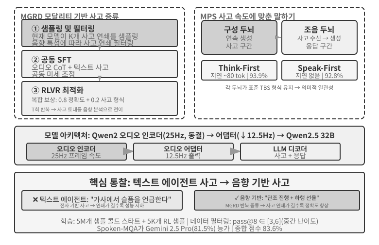

> **실험 9-4 ★★★: Step-Audio R1을 이용한 엔드투엔드 음성 사고**
>
> 이 실험에서는 Step-Audio R1을 사용해 음성 사고 및 대화 작업에서 여러 구성을 비교한다. 모델은 오디오 인코더, 오디오 어댑터, Qwen2.5 32B 디코더로 구성되며 다중 GPU 배포가 필요하다.
>
> 두 가지 작업을 평가한다. **Spoken-MQA**(Spoken Math Questions)는 말로 제시한 문제를 들은 뒤 모델이 다단계 수학 사고를 수행할 수 있는지 검사한다. **URO-Bench**(Chinese Oral Dialogue Benchmark)는 개방형 대화의 품질을 평가한다.
>
> 테스트 구성은 두 차원으로 나뉜다. 첫 번째는 **사고 시점**이다. 지연 제한이 없는 대조 기준선인 완전한 **TBS**(Think-Before-Speak) 구성은 말하기 전에 모든 사고를 생성한다. MPS는 지연을 줄이기 위해 두 가지 “말하면서 사고하기” 변형을 제공한다. **Speak-First**는 spkfirst라고도 하며 말하기와 사고를 동시에 시작해 지연이 없다. **Think-First**는 thkfirst라고도 하며 사고 두뇌가 첫 구간을 생성할 때까지 기다렸다가 말하므로 약 80토큰의 지연이 있다. 두 번째 차원은 **아키텍처**로, MPS의 병렬 이중 두뇌 아키텍처와 전통적인 단일 모델 TBS를 비교한다.
>
> 표 9-1은 여러 사고 시점 및 아키텍처 구성의 수학 정확도와 대화 점수를 비교한다.
>
> 표 9-1 Step-Audio R1 음성 사고 구성 비교
>
> | 구성 | Spoken-MQA | URO-Bench |
> |------|-----------|-----------|
> | 사고 없이 바로 답변(기준선) | 70.6% | 77.4 |
> | MPS Speak-First(지연 없음) | 92.8% | 82.5 |
> | MPS Think-First(약 80토큰 지연) | 93.9% | 84.8 |
> | 완전한 TBS(지연 제한 없음) | 93.0% | — |
>
> 흥미로운 발견은 Speak-First가 사고 작업에 거의 영향을 주지 않는다는 것이다. 92.8%는 완전한 TBS 구성의 93.0%에 가깝다. **사고의 연쇄(CoT, Chain-of-Thought)**의 시작은 보통 문제 내용을 다시 말할 뿐 아직 진정한 사고에 들어가지 않기 때문이다. 따라서 모델이 말하기와 동시에 사고를 시작해도 최종 정확도에는 거의 영향이 없다. Think-First(93.9%)가 지연 제한이 없는 완전한 TBS 구성(93.0%)보다 오히려 조금 높다는 점도 주목할 만하다. 사고를 구간별로 생성해 하나씩 음성으로 바꾸는 과정이 단계별 감독처럼 작용해 성능을 높였을 가능성이 있다. 다만 차이는 오차 범위 안에 있으므로 지나치게 해석해서는 안 된다.
>

해법 3은 사고를 단일 모델에 내재화해 “말하면서 사고하기”를 가장 우아하게 구현한다. 하지만 그 대가는 이 절의 시작에서 말한 “움직이는 표적” 그 자체다. 하나의 모델이 가장 강력한 사고자이면서 실시간 화자여야 하고, 두 능력이 모두 빠르게 발전하므로 통합 경로는 속도를 맞추기 위해 거듭 다시 학습해야 한다. 집필 시점의 업계가 나뉘는 이유다. 최신 두뇌를 마음대로 교체하고 싶은 프런티어 제품(GPT-Live, Grok Voice, Pine AI)은 대부분 해법 2의 분리에 기대를 건다. 해법 3은 궁극적인 자연스러움을 추구하고 전문 학습 비용을 감당할 수 있는 제품에 알맞다. 어느 한쪽이 다른 쪽을 대체하지 않는다. 사고 모델을 교체할 수 있는 능력과 사고·음성의 더 긴밀한 통합 사이의 절충이다.

### 빠른 모델과 느린 모델의 인터페이스: 텍스트 외에 무엇을 전달할 수 있는가

(여러 시나리오를 아우르는 이 논의에서는 잠시 이 장의 중심 주제인 음성을 벗어난다.) 해법 2는 간과하기 쉬운 설계 차원을 드러낸다. 느린 사고가 빠른 사고에 메시지를 전달할 때 상태 표시줄의 제안이라는 **텍스트** 채널을 사용한다. 텍스트는 이해하고 디버그하기 쉽지만 좁은 채널이다. 느린 사고자의 풍부한 중간 상태가 몇 문장으로 압축된다. 그렇다면 빠른 모델과 느린 모델 사이의 인터페이스는 반드시 텍스트여야 할까?

시간에 가장 민감한 환경 중 하나인 실시간 게임에서는 더 직접적인 접근법인 잠재 공간 브리지(Latent Bridge)를 사용할 수 있다[^ch9-8]. 초당 수십 번 행동하는 빠른 반응 담당 소형 모델과 초당 한 번 사고하는 느린 사고 담당 모델을 모두 동결한 뒤, 둘 사이에서 매개변수 수천만 개 규모의 작은 “브리지”만 학습한다. 이 브리지는 느린 모델의 은닉 상태 결론을 소수의 “잠재 토큰”으로 직접 투영해 빠른 모델의 입력에 삽입한다. 멀티모달 모델이 시각 토큰을 삽입하는 것과 비슷하다. 아이디어를 텍스트로 만들었다가 다시 내부 표현으로 바꾸는 왕복 과정을 건너뛴다. 여러 Atari 게임에서 잠재 공간 채널은 전통적인 텍스트 채널보다 훨씬 높은 성능을 보였고, 일부 게임에서는 26~82% 향상되었다. 단계마다 추가되는 시간은 약 5밀리초뿐이어서 실시간 요구를 충족하기에 충분히 빠르다.

같은 연구는 솔직한 경계도 제시한다. **빠른-느린 협업의 효과는 작업의 병목이 “생각해 내지 못함”인지 “제때 반응하지 못함”인지에 달려 있다.** 느린 사고자가 빠른 반응자보다 실제로 뛰어난 경우에만 브리지가 효과를 내며, 게임 전반에서 이 상관관계는 r≈0.9에 이른다. 작업이 순수하게 반응 속도를 겨루는 것이라면 아무리 훌륭한 브리지도 소용없다. 이 판단은 게임 너머에도 적용된다. 이 장 뒤에서 컴퓨터 사용이 마주할 바로 그 질문, 즉 언제 “느린 전략가”를 부를 가치가 있고 언제 지연만 더하는지를 미리 보여 준다.

[^ch9-8]: 동결한 두 모델 사이의 잠재 공간 브리지만 학습하는 방법과 “언제 느린 전략가를 부를 가치가 있는가”에 관한 전체 분석은 Bojie Li와 Noah Shi의 *The Latent Bridge: A Continuous Slow-Fast Channel for Real-Time Game Agents.* arXiv:2606.24470, 2026에서 확인할 수 있다.

엔드투엔드든 모듈형이든 지각 계층과 실행 계층의 품질은 여전히 중요하다. 엔드투엔드 모델은 아키텍처 수준에서 지연 문제를 해결하지만, 정확히 듣고 자연스럽게 말한다는 두 가지 기본 요소는 아키텍처를 바꾼다고 저절로 해결되지 않는다. 정확히 듣기는 패러다임 1의 스트리밍 음성 지각에 해당한다. 이제 자연스럽게 말하기를 담당하는 실행 계층, 즉 더 인간다운 음성 합성으로 넘어가자.

## 더 인간다운 음성 합성

전통적인 TTS의 “완벽함”이 바로 문제다. 멈춤이나 말채우기 표현 없이 흠잡을 데 없이 유창한 음성은 기계가 만들었다는 느낌을 분명히 준다. 사람 말의 “불완전함”인 멈춤, “음”, “어”, “있잖아요” 같은 말채우기 표현, 가끔 생기는 반복은 결함이 아니라 사고 과정의 자연스러운 신호다. 듣는 사람에게 “생각 중입니다” 또는 “완전히 확신하지는 못합니다”라고 알려 준다. 하지만 AI는 답을 소리 내어 말하는 속도보다 빠르게 생성할 수 있고, 출력은 유창하고 완성된 형태로 나온다. 그대로 합성하면 인공적인 느낌이 뚜렷해진다.

**해법**은 어디서 멈추고 어떤 말투를 사용할지 주 LLM이 결정하게 하는 것이다. LLM은 텍스트뿐 아니라 제어 토큰도 출력한다. `[THINKING]`은 1~2초의 생각하는 쉼과 “음...” 같은 말채우기 소리를 나타내고, `[SEARCHING]`은 더 짧은 쉼과 “있잖아요...”, “어떻게 말해야 할까요” 같은 망설임 표현을 나타낸다. `[EMO:happy]`는 말투와 운율을 조절하고, `[SPEED:0.8x]`는 말하기 속도를 제어한다. 복잡한 질문을 푸는 중이라 멈춰야 하는지, 사용자가 초조해하므로 속도를 높여야 하는지, 가벼운 대화이므로 생기 있게 말해야 하는지는 LLM만이 안다.

이 방식에서 TTS는 텍스트 + 제어 토큰을 입력받아 오디오를 출력하는 멀티모달 생성기로 작동한다. 일반 텍스트는 보통 음성으로 합성하고, 제어 토큰에는 해당하는 비언어적 오디오를 생성한다. `[THINKING]`은 길게 늘인 “음...”을, `[SIGH]`는 한숨을, `[LAUGH:small]`은 가벼운 웃음을, `[BREATH]`는 숨을 들이마시는 소리를 생성한다.

구현 경로는 두 가지다. 하나는 제어 토큰을 네이티브로 지원하는 독자적인 TTS를 개발하는 방식이다. 가장 유연하지만 전문 팀이 필요하다. 다른 하나는 음성 복제를 사용한다. 같은 가상 인물에 대해 감정, 속도, 스타일이 서로 다른 수십 개의 참조 클립을 준비하고, ElevenLabs나 Fish Audio 같은 TTS API를 호출할 때 각 제어 토큰 조합과 가장 잘 맞는 클립을 선택한다. 이 접근법은 몇 주 안에 배포할 수 있다.

> **실험 9-5 ★★: Fish Audio 기반 제어 토큰 구동 TTS**
>
> Fish Audio S1의 음성 복제 기능을 사용한다. 같은 음색을 제로샷으로 복제하는 데 3~10초의 참조 오디오만 필요하다. 감정(중립/기쁨/좌절/생각 중) × 속도(보통/빠름/느림) × 스타일(격식/일상)을 포괄하는 약 5초 길이의 참조 오디오 클립 24개로 라이브러리를 구축한다.
>
> LLM 출력 예시: `[EMO:happy][SPEED:fast]Great! Your order has been confirmed.[THINKING]Um, let me check the shipping time...[EMO:neutral][SPEED:normal]It is expected to arrive tomorrow afternoon.`
>
> 실행 계층은 토큰을 파싱해 해당 참조 오디오에 매핑한다. `[EMO:happy][SPEED:fast]`는 “기쁨+빠름+일상” 참조에, `[THINKING]`은 멈춤 리듬과 망설이는 말투가 있는 “생각 중+느림+격식” 참조에, `[EMO:neutral][SPEED:normal]`은 “중립+보통+격식” 참조에 매핑한다. Fish Audio는 참조 클립이 달라도 음색은 일관되게 유지하고 운율과 감정만 바꾼다.
>
> 제어 토큰이 없는 구성(유창하지만 로봇 같고 AI가 생성한 티가 뚜렷함), 단일 참조 클립(자연스럽지만 감정이 단조로움), 다중 참조 라이브러리(정보를 확인할 때는 밝고 빠르며 설명 전에는 자연스럽게 멈추고 전체 전달 방식이 사람 고객 서비스 상담원에 가까움)라는 세 가지 구성을 비교한다.

## 컴퓨터 사용: GUI 자동화 에이전트

이쯤 되면 이 장이 뒤의 두 시나리오보다 음성에 훨씬 많은 분량을 할애했다는 사실을 눈치챘을 것이다. 이는 의도한 구성이다. 실시간 멀티모달 시스템 가운데 음성 기술이 가장 멀리 발전했으므로 가장 좋은 기준점을 제공한다. 직렬 파이프라인의 과도한 지연이라는 최초의 문제에서 출발해 엔드투엔드 모델, 전이중 상호작용, 말하면서 사고하기를 거쳐 오늘날의 비교적 성숙한 설계까지 전체 궤적을 그렸다. 그래서 그 이야기를 온전히 설명했다. 컴퓨터 사용과 로보틱스 절을 읽으면서 이 궤적과 비교해 보자. 각 분야는 어디까지 발전했고 어디에 여전히 막혀 있는가?

세 시나리오는 달라 보이지만 실시간 인식, 저지연 의사결정, 연속 상호작용이라는 같은 핵심 과제를 마주한다. 이제 청각에서 시각 모달리티로 관점을 넓혀 시각적 상호작용인 컴퓨터 사용으로 넘어가자. 에이전트가 음성을 이해할 뿐 아니라 화면을 “보고” 그래픽 인터페이스를 조작할 수도 있다면 어떨까?

GUI 자동화라고도 하는 컴퓨터 사용은 AI가 화면을 관찰하고 마우스와 키보드를 조작해 사람처럼 소프트웨어를 사용하게 한다. 예를 들어 브라우저를 열어 정보를 검색하고, 스프레드시트 애플리케이션에 데이터를 입력하고, 시스템 설정에서 구성을 조정할 수 있다. 핵심은 **인식-사고-행동(Perceive-Think-Act)** 루프다(그림 9-7).

1.  에이전트가 현재 화면의 스크린샷을 찍는다.
2.  멀티모달 모델이 스크린샷과 작업 지침을 받아 사고와 구체적인 행동을 출력한다.
3.  실행 계층이 실제 환경에서 마우스 이동, 클릭, 텍스트 입력 등의 행동을 수행한다.
4.  인터페이스의 응답을 기다렸다가 다시 스크린샷을 찍고 다음 루프 반복으로 들어간다.

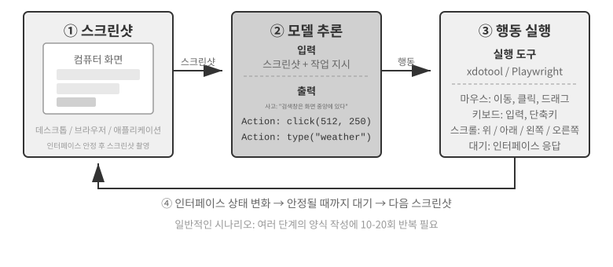

이 루프에는 세 가지 핵심 설계 차원이 있다. 에이전트가 어떤 작업을 수행할 수 있는지를 정하는 **행동 공간**, 스크린샷에서 대상 요소를 찾는 방법인 **시각적 그라운딩**, 스크린샷에서 올바른 행동을 생성하는 방법인 **모델 아키텍처**다.

### 행동 공간 설계

Anthropic은 완전한 상호작용 능력을 구성하는 세 가지 도구 유형을 정의한다(그림 9-8).

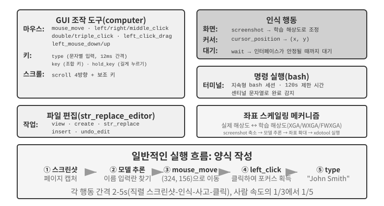

**GUI 조작 도구**(`computer` 도구): 마우스 작업에는 이동(`mouse_move`), 왼쪽/오른쪽/가운데 클릭, 두 번 또는 세 번 클릭, 드래그(`left_click_drag`), 더 정밀한 누르기/떼기 동작(`left_mouse_down`과 `left_mouse_up`)이 있다. 스크롤(`scroll`)은 네 방향을 지원하며 보조 키와 결합할 수 있다. 키보드 작업에는 문자 단위 입력(`type`, 실제 타이핑을 흉내 내기 위해 문자 사이에 12밀리초 간격을 둠), 키 조합(`key`, 예: `Ctrl+C`), 키 누르고 있기(`hold_key`)가 있다. 인식 행동에는 스크린샷 찍기, 커서 위치 가져오기(`cursor_position`), 기다리기(`wait`)가 있다.

**명령 실행 도구**(bash 도구): 제한 시간이 120초인 지속형 bash 터미널 세션을 제공한다. 센티널 문자열로 명령 완료를 감지하고 여러 호출에 걸쳐 환경 상태를 유지한다. 예를 들어 `cd`로 디렉터리를 옮기면 다음 호출도 그 디렉터리에 머문다.

**파일 편집 도구**(`str_replace_editor`): 문자열 일치로 안전하게 편집하고 보기, 생성, 바꾸기, 삽입, 실행 취소 작업을 지원한다. 파일 전체를 덮어쓰는 것보다 정밀하며 관계없는 내용을 실수로 수정할 가능성이 낮다.

> **실험 9-6 ★: Anthropic 컴퓨터 사용 데모 실행**
>
> 컨테이너에는 브라우저, 터미널, 기타 일반 도구가 포함된 완전한 Ubuntu 데스크톱 환경이 있다. 프런트엔드는 작업 지침을 받고, 백엔드는 지침과 스크린샷을 Claude에 보내며, 모델은 마우스 이동, 클릭, 입력 같은 행동을 반환한다. 그런 다음 시스템이 가상 데스크톱에서 해당 행동을 실행한다.
>
> 핵심 관찰 결과는 각 행동 주기에 2~5초가 걸려 시스템이 사람보다 훨씬 느리다는 것이다. 그럼에도 일반적인 작업에서 좋은 계획 능력을 보여 주며 작업을 합리적인 행동 순서로 자율적으로 분해한다.
>

### 시각적 그라운딩

루프를 반복할 때마다 모델은 스크린샷에서 대상 요소를 정확히 찾아야 한다. “검색창은 어디에 있는가?”, “제출 버튼의 좌표는 무엇인가?”가 시각적 그라운딩 문제다. 현재는 **두 가지 주요 접근법**이 있다. 하나는 먼저 인터페이스 요소에 번호를 붙이고 모델은 하나만 선택하게 하여 위치 찾기를 **객관식 문제**로 바꾸는 것이다. 다른 하나는 사람이 하듯 모델이 스크린샷을 “보고” 좌표를 직접 보고하는 **순수 좌표 예측**이다. 객관식 접근법에는 두 가지 구현 방식이 있다. 분할 모델로 이미지의 후보 영역을 나누는 원래의 Set-of-Mark인 **순수 시각 주석**, 그리고 인터페이스 자체 구조를 직접 읽는 DOM/접근성 트리 기반의 **구조화된 요소 인덱싱**이다. 객관식 접근법의 공통 장점은 “스크린샷에서 버튼을 찾아 좌표를 예측하라”는 개방형 문제를 “이미 표시된 요소 가운데 하나를 고르라”는 폐쇄형 문제로 바꾼다는 점이다. 시험에서 빈칸 채우기보다 객관식 문제의 정답을 고르기 쉽듯, 모델은 “화면 왼쪽 위에서 오른쪽으로 약 200픽셀 떨어진 파란색 버튼을 클릭하라” 대신 “클릭 [123]”이라고 말하기만 하면 된다.

**Set-of-Mark: 시각 주석 방식.**

원래의 Set-of-Mark(SoM)는 GPT-4V의 시각적 그라운딩 능력을 끌어내기 위해 Microsoft Research가 2023년에 제안했다. **순수 시각** 방식이다. SAM, SEEM 같은 이미지 분할 모델로 스크린샷의 후보 영역을 자동 분할하고 각 영역 위에 번호 표지를 겹쳐 표시해 모델에 번호가 있는 이미지를 보여 준다. 모델은 번호만 보고하면 되고 시스템이 해당 영역의 중심 좌표로 변환한다. 전체 과정에 DOM이나 내부 인터페이스 구조가 필요 없으므로 분할 모델이 후보 영역을 식별할 수만 있다면 네이티브 데스크톱 소프트웨어와 게임 인터페이스에도 똑같이 적용할 수 있다.

**구조화된 요소 인덱싱: 웹에서 SoM 발상을 구조적으로 구현하는 방법.**

인터페이스 자체가 구조화된 정보를 제공하면 더 정밀하게 주석을 달 수 있다. 현대 웹 페이지는 렌더링 전에 완전한 요소 구조인 DOM 트리와 버튼, 입력 필드, 기타 컨트롤을 식별하는 의미 역할을 정의한다. 접근성 트리도 여러 데스크톱 애플리케이션에 비슷한 정보를 제공한다. 분할 모델에 픽셀만 보고 어느 영역이 버튼인지 추측하게 하는 대신, 시스템이 인터페이스에 클릭 가능한 요소를 직접 질의할 수 있다. `browser-use` 같은 웹 에이전트 시스템이 바로 이 방식을 사용한다. DOM에서 상호작용형 요소를 열거하고 번호를 붙인다. 웹에서 SoM 발상을 구조적으로 구현한 것이다(그림 9-9). 과정은 네 단계다.

1. 브라우저 디버깅 인터페이스인 CDP(Chrome DevTools Protocol)로 페이지의 구조화된 표현(DOM 트리)과 접근성 정보를 가져온다.
2. 버튼, 입력 상자, 링크 등 어떤 요소가 상호작용 가능한지 자동으로 감지한다.
3. 각 상호작용형 요소에 고유 ID를 붙이고 스크린샷에 경계 상자를 그린다.
4. 각 ID에 해당하는 요소를 설명하는 텍스트 목록을 동시에 생성한다.

```
스크린샷: [이미지의 핵심 요소에 [1], [2], [3], [4] 같은 ID가 표시되어 있음]

요소:
[1] <input type="text" placeholder="Search" aria-label="Search" />
[2] <button id="submit-btn" aria-label="Submit form" />
[3] <input type="text" placeholder="Enter your name" value="" />
[4] <a href="/docs" aria-label="Documentation" />
```

모델은 ID만 출력하면 되고 시스템이 해당 요소의 중심을 자동으로 클릭한다. 모든 주석 데이터를 여전히 모델에 보내야 하므로 이 접근법이 토큰을 절약하지는 않는다. 하지만 분할 모델에서 발생할 수 있는 감지 누락과 오탐을 피하면서 정확하고 안정적으로 위치를 찾는다.


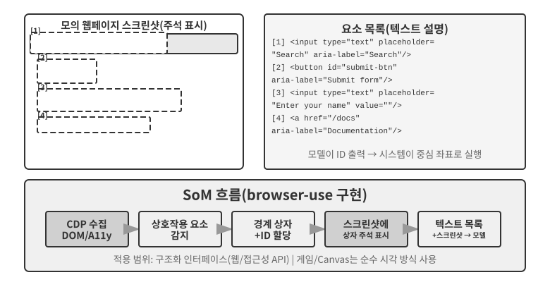

**순수 좌표 예측.**

세 번째 경로는 주석을 건너뛰고 모델에 좌표를 직접 출력하라고 한다. **SeeClick**과 Claude의 컴퓨터 사용 같은 시스템은 GUI 스크린샷과 요소 위치 쌍으로 이루어진 대규모 데이터셋으로 학습한 비전 모델에 의존한다. 이 모델은 사람 사용자처럼 시각적 인식에 의존해 “제출 버튼을 클릭하라” 같은 자연어 설명을 스크린샷의 정확한 좌표에 직접 매핑하는 법을 배운다.

좌표 예측 방식에서 모델의 좌표 이해는 학습에 사용한 해상도에 크게 좌우된다(그림 9-10). Claude는 XGA(1024×768), WXGA(1280×800), FWXGA(1366×768)를 사용해 학습했다. 입력 스크린샷의 해상도가 맞지 않으면 모델의 예측 좌표가 체계적으로 어긋난다. 작은 지도에서 거리를 잰 뒤 큰 지도에 그대로 적용하는 것과 같다. 따라서 도구 계층에 양방향 좌표 스케일링 메커니즘을 구현해야 하며, 이미지가 불균일하게 늘어나 왜곡되고 좌표 판단이 편향되지 않도록 **화면비를 기준으로 대상 해상도를 선택**해야 한다. 예를 들어 실제 화면 해상도가 2560×1440(16:9)이면 Claude가 지원하는 세 선택지 가운데 16:9에 화면비가 가장 가까운 FWXGA(1366×768)가 가장 알맞다. 스크린샷을 1366×768로 비례 축소해 모델에 입력하고, 모델이 클릭 좌표 (683, 384)를 출력하면 실제 좌표 (683×2560/1366, 384×1440/768) ≈ (1280, 720)으로 역매핑한다. 반대로 16:9 이미지를 4:3인 1024×768로 강제로 늘리면 이미지가 가로로 압축되어 모델의 예측 좌표가 체계적으로 어긋난다.


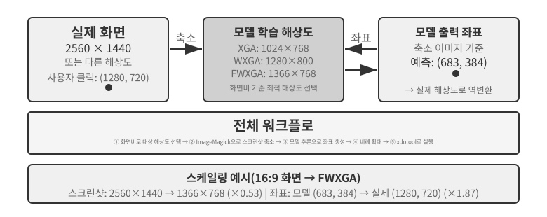


세 경로의 선택은 다음과 같이 요약할 수 있다. **구조화된 정보를 사용할 수 있으면 DOM/접근성 트리 인덱싱을 우선**해 가장 정확하고 안정적으로 위치를 찾는다. **구조화된 정보가 없으면**—Photoshop 같은 네이티브 데스크톱 소프트웨어, Canvas/WebGL로 렌더링한 인터페이스, 게임이 이에 해당한다—**시각 주석(원래의 SoM 경로)이나 좌표 예측을 사용**한다. 시각 주석은 위치 찾기를 객관식 문제로 바꾸므로 전문 학습을 받지 않은 범용 모델에도 더 친화적이다. 좌표 예측은 주석 단계를 없애며 GUI 위치 찾기에 특화해 학습한 모델에는 더 직접적이다. 두 접근법 모두 작은 요소와 빽빽한 인터페이스에서는 여전히 어려움을 겪는다.

> **실험 9-7 ★: browser-use를 이용한 브라우저 작업 자동화**
>
> 브라우저 자동화 프레임워크인 Playwright와 멀티모달 모델을 결합해 자연어 지침으로 구동하는 브라우저 조작을 구현한다. SoM 시각화를 활성화하고 각 의사결정 전에 경계 상자를 표시한 스크린샷을 저장한다.
>
> 테스트 작업은 “Google을 열고 샌프란시스코 날씨를 검색하라”다. 시스템이 시작되면 스크린샷에 Google 검색 페이지가 나타나고, 모든 상호작용형 요소에 빨간색 경계 상자와 ID 번호가 표시된다. 주소 표시줄 `[1]`, 검색창 `[2]`, 검색 버튼 `[3]`, “I'm Feeling Lucky” 버튼 `[4]` 등이 있다 → 모델이 분석한 뒤 검색창인 `[2]`를 클릭한다 → 검색창에 포커스가 생기고 모델이 “오늘 샌프란시스코 날씨”를 입력한다 → 모델이 검색 버튼인 `[3]`을 클릭한다 → 페이지가 검색 결과로 이동하고 다음 스크린샷에서 날씨 카드 안의 요소에 주석이 표시되어 모델이 기온과 날씨 상태 같은 정보를 식별하고 추출할 수 있다. 전체 과정은 5단계이며 약 20초가 걸린다.

### 애니메이션을 보고 소리를 들을 수 있는 컴퓨터 사용 에이전트

지금까지 컴퓨터 사용의 인식은 **화면이 정적이다**라는 암묵적인 가정에 기대었다. 스크린샷을 찍고, 다음 단계를 생각하고, 클릭한 뒤 다음 스크린샷을 찍는다. 실제 화면에서는 동영상이 재생되고 몇 초 만에 사라지는 알림이 번쩍이며 회의 오디오가 흘러나온다. 3~5초마다 한 번만 눈을 뜨고 귀는 아예 없는 에이전트는 두 프레임 사이에서 벌어지는 모든 일에 눈과 귀가 멀어 있다. 화면 녹화 보기, 회의 참여, 음성 안내 따르기, 사라지기 전에 대화 상자 포착하기 등 일상적인 컴퓨터 작업의 전체 범주가 오늘날 컴퓨터 사용 에이전트에는 사실상 금지된 영역이다.

여기서 진정으로 다시 설계해야 할 것은 “행동 인터페이스”가 아니라 “**관측 인터페이스**”다[^ch9-9]. 핵심 발상은 연속적이고 적응적이며 멀티모달인 **관측**과 이산적인 **행동**을 분리하는 것이다. 재학습 없이 환경과 어떤 기성 컴퓨터 사용 모델 사이에도 놓을 수 있는 인식 미들웨어 계층을 만든다. 이를 에이전트-컴퓨터 관측 인터페이스(AOI, Agent–Computer Observation Interface)라고 부를 수 있다. 세 가지 “게이트형” 구성 요소로 이루어진다. 첫째, **프레임 사이의 키프레임 캡처**다. 비용이 매우 낮은 픽셀 게이트로 거의 변하지 않은 프레임을 건너뛰고, 소형 모델로 의미 있는 변화가 생겼는지 판단해 변화가 있을 때만 프레임을 캡처한다. 정적 화면의 비용은 거의 0에 가까워진다. 둘째, **음량 게이트형 음성 전사**다. 소리가 있을 때만 음성 인식을 호출해 처음으로 에이전트에 “귀”를 제공한다. 셋째이자 가장 중요한 요소는 **관측을 지속되는 텍스트 설명으로 변환하는 것**이다. 모델이 캡처한 프레임을 “팝업에 출시일이 4월 28일로 변경되었다고 방금 표시되었습니다”처럼 한 문장으로 설명하게 한다. 그러면 **나중에 원본 이미지를 컨텍스트에서 지워도 이 텍스트는 메모리에 남아** 동적 정보를 텍스트 형태로 이후까지 전달한다.

직관에 어긋나는 발견은 진짜 중요한 것이 프레임 선택이 아니라 선택한 프레임을 지속되는 텍스트로 바꾸는 일이라는 점이다. 텍스트는 LLM 에이전트가 가장 잘 처리하는 모달리티이기 때문이다. 7B 매개변수 모델부터 프런티어급 시스템까지 여덟 모델에서 이 미들웨어는 재학습 없이 17~48%포인트의 향상을 이끌었다. 차이는 음성 작업에서 가장 컸다. 인식 계층을 갖추자 에이전트는 “들을 수 있지만 행동할 수 없었던” 음성 작업을 마침내 완료할 수 있었다. 그렇다고 모든 경우에 맞는 단일 구성은 아니다. 일부 최신 모델에서는 이미지 토큰을 너무 많이 주입하면 사고 공간을 밀어내 성능이 떨어진다. 따라서 모든 구성 요소를 한꺼번에 켜지 말고 **모델별로 선택**해야 한다. Set-of-Mark와 좌표 예측의 절충에서 얻은 것과 같은 교훈이다. 인식 방식에는 만능 해법이 없으며 모델의 성향에 맞게 구성해야 한다.

[^ch9-9]: 게이트형 키프레임, 주문형 전사, 프레임을 지속되는 텍스트로 서술하는 세 구성 요소의 전체 메커니즘과 모델별 제거 실험은 Bojie Li와 Noah Shi의 *Agent-Computer Observation Interfaces Enable Dynamic Computer Use.* arXiv:2606.29472, 2026에서 확인할 수 있다.

### 모바일: 기술보다 어려운 생태계 장벽

컴퓨터 사용은 모바일 기기로도 확장되고 있다. 모바일과 데스크톱 시스템은 기술적으로 차이가 있다. 모바일의 행동 공간은 보통 마우스 좌표와 키보드 입력에 의존하는 대신 Android의 `AccessibilityService` 같은 시스템 접근성 서비스 API로 인터페이스 요소를 읽고 클릭하거나 텍스트를 입력한다. 상호작용도 마우스 포인터에서 터치 제스처로 바뀌어 좌표의 의미가 달라진다. 같은 `(x, y)` 위치가 탭, 길게 누르기, 스와이프 시작점을 뜻할 수 있으므로 행동에 제스처 유형도 지정해야 한다. 6장에서 소개한 AndroidWorld 같은 모바일 벤치마크는 이 행동 공간에서 에이전트가 실제 애플리케이션의 작업을 완료하는 능력을 평가한다.

하지만 모바일 컴퓨터 사용을 진정으로 가로막는 것은 이런 기술적 차이가 아니라 생태계 장벽인 경우가 많다. 일부 휴대전화 제조사는 AI 비서를 소비자용 휴대전화에 통합해 WeChat, Taobao, Alipay 같은 일상 앱을 자동으로 조작하게 하려 했지만 곧 플랫폼 제한에 부딪혔다.

이는 컴퓨터 사용의 고유한 과제인 **생태계 장벽**을 드러낸다. 이러한 제한의 근본 원인은 비즈니스 모델의 충돌이다. 전통적인 인터넷 애플리케이션의 핵심 수익화 논리는 **트래픽과 관심**이다. 사용자는 피드를 스크롤하며 광고를 보고, 상품을 검색할 때 추천 알고리즘의 안내를 받으며, 페이지를 둘러보다 충동구매를 한다. 에이전트가 사용자를 대신해 조작하면 이 수익화 사슬을 완전히 우회한다. AI는 광고를 무시하고 충동구매를 하지 않으며 곧장 목표로 향해 작업을 마치고 떠난다. 광고와 트래픽으로 생존하는 플랫폼에는 에이전트의 모든 조작이 비즈니스 모델의 토대를 침식한다.

따라서 컴퓨터 사용은 CAPTCHA 같은 기술적 대응뿐 아니라 **구조적 이해관계 충돌**에도 직면한다. 이 충돌은 단기간에 해결하기 어렵고, 순수한 기술 문제보다 소비자 도입에 더 큰 장애물이 된다.

### 실시간 성능: 해결되지 않은 핵심 과제

6장에서 평가 방법론과 함께 소개한 **OSWorld**는 실제 Ubuntu/Windows/macOS 환경에서 여러 애플리케이션에 걸친 작업을 완료하는 에이전트의 능력을 검사하는 널리 쓰이는 컴퓨터 사용 벤치마크다. 초기 범용 모델은 이 벤치마크에서 약 20%의 성공률에 그쳤다. 이후 전문 모델과 더 강력한 범용 모델이 성공률을 계속 높였고, 집필 시점에는 점차 사람 수준의 성능에 가까워지고 있다. 하지만 성공률은 결승점과 거리가 멀다. 진짜 병목은 “정확히 할 수 있는가?”에서 “빠르게 할 수 있는가?”로 이동했다.

**OSWorld-Human** 효율성 연구는 냉정한 결과를 보여 준다. 작업이 결국 성공하더라도 에이전트는 사람보다 훨씬 많은 단계가 필요하며, 작업이 진행될수록 단계별 추론 지연도 계속 늘어난다. 컨텍스트가 길수록 모델의 결정이 느려져 후반 단계는 초반보다 훨씬 오래 걸리는 경우가 많다. 사람에게 수십 초면 되는 문서 서식 조정에 에이전트는 몇 분이 걸릴 수 있다. **사람 수준의 정확도가 곧 실용성은 아니며, 진정한 병목은 효율성이다.**

근본 원인은 음성 시나리오와 닮았다. 직렬 “스크린샷-사고-클릭” 루프에서는 모든 단계를 극한까지 최적화해도 단계별로 누적되는 지연이 여전히 감당하기 어렵다. 더 깊은 문제는 오늘날의 컴퓨터 사용이 전혀 앞을 내다보며 사고하지 못한다는 것이다. 에이전트가 현재 행동을 실행하면서 다음 행동을 예측할 수 있다면, 예를 들어 페이지가 아직 로딩되는 동안 다음에 어디를 클릭할지 계산할 수 있다면 사고와 실행을 겹쳐 전체 지연을 크게 줄일 수 있다. 이는 이 장 앞부분의 말하면서 사고하기, 그리고 4장의 “연속 사고” 비동기 에이전트와 같은 요구를 조작하면서 사고하기로 바꾼 것이다.

음성 분야와 달리 컴퓨터 사용 자체의 실시간 성능, 즉 “스크린샷-사고-클릭” 루프의 속도를 높이는 체계적인 해법은 아직 없다. 프레임별 스크린샷으로 이루어진 이산 루프에 여전히 갇혀 있다. 하지만 이 장에서 반복해서 등장한 빠른-느린 분리를 활용하는 우회책은 이미 효과가 입증되었다. 느린 컴퓨터 사용 에이전트를 빠르게 만들기 어렵다면 **사용자가 기다리지 않게 하라.** 음성용 빠른 모델과 컴퓨터 조작용 느린 모델을 동시에 사용한다[^ch9-10]. 빠른 모델은 실시간 음성 대화를 처리하고 최첨단 VLM은 브라우저를 단계별로 조작한다. 둘은 최소한의 “단순 텍스트 계약”만으로 소통한다. 느린 에이전트는 행동할 때마다 “양식을 작성 중이며 생년월일이 더 필요함” 같은 갱신형 상태 요약을 업데이트한다. 빠른 에이전트는 이를 바탕으로 사용자에게 실시간으로 답하고, 사용자가 말로 제공한 새 정보를 느린 에이전트에 전달한다. 중요한 점은 **상태 요약에서 완료를 확인하기 전까지 빠른 에이전트가 절대로 “완료했다”고 말해서는 안 된다**는 것이다. “전화로 대화하면서 컴퓨터가 스스로 조작하게 하는” 시나리오다. 실험에서 이러한 분리는 작업 성공률을 떨어뜨리지 않으면서, 조작과 말하기를 동시에 수행하는 단일 모델보다 음성 응답을 약 15배 빠르게 했다. 지연 시간 중앙값은 각각 0.58초와 8.64초였다. 빠른 모델과 느린 모델 사이의 텍스트 채널을 제거하면 성공률은 0으로 무너진다. 사용자가 말로 알려 준 핵심 정보가 더 이상 브라우저에 도달하지 못하기 때문이다. 이는 앞서 살펴본 잠재 공간 브리지와 음성 시나리오의 말하면서 사고하기와 같은 발상이다. 한 구성 요소가 본질적으로 느리다면 빠른 구성 요소가 사용자의 대기 시간을 채우게 한다. 그리고 이 “단순 텍스트 계약”은 근본적으로 2장에서 소개한 에이전트 상태 표시줄 개념이다. 컴퓨터 사용 루프 자체의 속도를 높이는 것이 다음의 중요한 연구 방향일 수 있지만, 빠른-느린 분리 뒤에 느림을 감추는 방법은 이미 실행 가능한 해법이다.

[^ch9-10]: 음성-조작의 빠른-느린 분리와 “단순 텍스트 계약”의 전체 설계는 Bojie Li와 Noah Shi의 *Talking While Acting: Real-Time Voice for Slow Computer-Use Agents.* 2026(출간 예정)에서 확인할 수 있다.

## 로봇 조작: 실시간 제어에서 학습과 일반화까지

> **읽기 안내**: 이 절에서는 로봇 제어를 다룬다. 실험 9-10은 시뮬레이션에서 현실로 전이하는 방법을 보여 준다. **시뮬레이션 학습 부분(3~4단계)은 GPU 서버만으로 완료할 수 있지만**, 실제 환경 배포 단계를 포함한 전체 파이프라인을 엔드투엔드로 재현하려면 SO100 로봇 팔 같은 실제 하드웨어가 필요하다. 지금 로보틱스에 관심이 없다면 이 절을 건너뛰어도 되며 다른 장을 읽는 데 영향을 주지 않는다.

음성 에이전트는 청각 모달리티에서 지연과 싸우고, 컴퓨터 사용은 시각 모달리티에서 지연과 싸운다. 에이전트가 물리적 세계의 로봇을 제어해야 하면 지연과 멀티모달 문제는 더욱 혹독해진다. 행동에는 되돌릴 수 없는 결과가 따르며 한 번의 충돌로 물체나 로봇 자체가 손상될 수 있다. 이 절에서는 먼저 로봇이 2계층 아키텍처와 행동 청킹으로 실시간 제어 문제를 다루는 방법을 보여 준다. 이어 오늘날 로봇이 마주한 더 어려운 문제인 학습과 일반화, 즉 데이터를 어디서 얻고 모델을 작업과 플랫폼 사이에서 어떻게 전이하는지 살펴본다.

### 병목은 하드웨어가 아니라 알고리즘이다

로봇은 왜 개방형 범용 환경에 널리 도입되지 못했을까? 병목은 하드웨어일까, 알고리즘일까? XLeRobot 프로젝트는 설득력 있는 반례를 제시한다. 사람이 VR 헤드셋으로 원격 제어하면 가격이 1,000달러 미만인 양팔 바퀴형 로봇도 이미 다양한 가사 작업을 원활히 수행할 수 있다. Unitree 로봇도 사람이 조작하면 정교한 로봇 손이 필요한 더 복잡한 가사 작업을 처리할 수 있다. 원격 조작 지연은 약 100~200밀리초로 물리적 상호작용에 필요한 응답 시간에 가깝다. 오늘날의 저비용 플랫폼도 센서 해상도, 액추에이터 정밀도, 로봇이 초당 행동 명령을 업데이트하는 횟수인 제어 주파수가 이미 실용적인 작업에 충분하다. 제어 주파수가 낮으면 움직임이 덜 부드럽고 지터나 목표 궤적 이탈이 늘어난다.

이 주장에는 명확한 경계가 필요하다. 원격 조작 사례는 기존의 저비용 하드웨어를 인간 지능과 결합하면 **주로 시각 피드백에 의존하는 가사 조작 작업**에 충분하다는 것만 보여 준다. 하드웨어가 모든 면에서 충분하다는 뜻은 아니다. 촉각 감지 기능의 부재와 정교한 로봇 손의 비용 및 신뢰성은 여전히 잘 알려진 한계다. 정밀한 힘 제어와 촉각 피드백에 크게 의존하는 작업에서는 실제로 하드웨어가 병목일 수 있다. 따라서 “하드웨어가 병목이 아니다”라는 말은 이 절에서 다루는 작업 유형에만 적용된다.

이러한 작업에서 진정한 격차는 알고리즘 계층에 있으며, 다음 두 하위 절에서 자세히 설명한다.

> **실험 9-8 ★: XLeRobot 원격 조작 체험**
>
> XLeRobot은 키보드, Xbox 컨트롤러, Nintendo Switch Joy-Con, VR 헤드셋 등 여러 원격 조작 방식을 지원한다. 로봇을 직접 제어해 물체를 집어 옮기거나 표면을 닦게 하고 응답 지연, 동작 정밀도, 작업 완료 품질을 관찰한다. 이 체험을 통해 하드웨어의 능력을 직관적으로 이해할 수 있다. 사람이 제어하면 로봇은 예상보다 훨씬 다양한 작업을 수행할 수 있으며, 현재 병목이 하드웨어보다 알고리즘에 있음을 시사한다.[^ch9-1]
>
> [^ch9-1]: XLeRobot, “Teleop Documentation.” https://xlerobot.readthedocs.io/en/latest/software/getting_started/XLeRobot_teleop.html

### 2계층 아키텍처: 계획과 제어의 분리

로봇이 복잡한 가사 작업을 완료하려면 서로 다른 두 시간 척도에서 의사결정해야 한다. 첫 번째 계층은 더 느린 **장기 계획**이다. “주방을 청소하라” 같은 고수준 지침을 조리대 치우기, 식기세척기에 그릇 넣기, 표면 닦기 같은 일련의 하위 목표로 분해한다. 환경의 의미를 이해하고, 작업 간 의존성을 파악하고, 다단계 행동 순서를 계획해야 한다. 사람이 시작하기 전에 “무엇을 먼저 하고 다음에는 무엇을 할지” 생각하는 것과 비슷하다. 두 번째 계층은 더 빠른 **VLA 제어**(Vision-Language-Action 모델)다. “싱크대로 이동”, “행주 집기”, “조리대 닦기” 같은 구체적인 작업을 각각 실행한다. 현재의 시각 입력과 언어 지침을 바탕으로 제어 신호를 계속 출력해 로봇의 움직임을 부드럽고 일관되게 유지한다.

이 2계층 아키텍처는 책임을 효과적으로 분리한다. 장기 계획은 “무엇을 할지”를, VLA 제어는 “어떻게 할지”를 담당한다. 느린 고수준 의사결정과 빠른 저수준 실행의 결합은 앞서 음성에서 설명한 빠른-느린 아키텍처와 매우 비슷하다. 둘 다 복잡한 사고와 실시간 응답을 서로 다른 모듈에 맡긴다. 다만 계획/제어 분리는 해법 3의 MPS 구성 두뇌와 조음 두뇌 사이의 사고/표현 분리가 아니라 느린 깊은 사고와 빠른 실시간 응답에 대응한다. MPS는 사고와 말하기를 분리하고, 로보틱스 아키텍처는 전역 계획과 실시간 실행을 분리한다. 따라서 두 아키텍처는 서로 다른 차원에서 작업을 나눈다.

실시간 제약이 사라진 것은 아니다. VLA 제어 계층으로 내려갔으며, 여기서는 **행동 청킹(Action Chunking)**으로 제약을 완화한다. 아래의 “VLA 제어” 하위 절에서 자세히 설명한다. 모델은 한 번의 추론으로 짧은 미래 행동 순서를 생성하고 제어 스레드는 이를 높은 주파수로 재생해 추론 지연을 전체 순서의 실행에 걸쳐 분산한다. 여기에는 부드러움과 반응성 사이의 피할 수 없는 절충이 생긴다. 청크가 길면 더 많은 행동에 지연을 분산해 움직임이 부드러워지지만, 그동안 모델은 새 시각 입력을 받지 못한다. 따라서 물체가 이동하거나 손이 길을 막는 것 같은 갑작스러운 변화에는 더 느리게 반응한다. 2계층 아키텍처는 이 긴장을 없애지 않고 위치만 옮긴다.

이제 이 장의 초점이 바뀐다. 로보틱스에서는 2계층 분리와 행동 청킹으로 실시간 긴장을 일부 완화한 반면, 충분한 시범 데이터를 얻고 모델을 작업과 플랫폼 전반에 일반화하는 방법인 **학습과 일반화**가 핵심 관심사가 되었다. 다음 하위 절에서는 6장의 시뮬레이션 환경과 7장의 강화 학습이라는 주제를 물리적 세계로 확장한다.

이 새로운 과제는 주로 VLA 제어 계층의 몫이다. VLA를 “VLM + 행동 출력”으로 생각하면 된다. 이미지와 텍스트를 모두 이해하는 대규모 모델인 **VLM**(Vision-Language Model)은 인식과 사고를 담당하지만 VLA는 행동까지 해야 하며, 진정한 어려움은 행동에 있다. 오늘날 VLA 제어 계층은 주로 사람의 대규모 시범 모음에서 관측과 행동의 매핑을 학습하는 모방 학습, 즉 **행동 복제**로 학습한다. OpenVLA, RT-2, π₀가 모두 이 범주에 속한다. 최근에는 강화 학습이 보완 기술로 등장했다. RL로 학습한 VLA는 개별 작업에서 좋은 성능을 낼 수 있지만 일반화 성능은 떨어지는 경우가 많다. 예를 들어 7장의 SimpleVLA-RL은 LIBERO의 단일 작업에서 뛰어난 결과를 보고하지만 모든 작업에 제로샷으로 일반화하는 통합 모델이 아니라 작업별로 따로 학습한다. 작업마다 한 번씩 학습하는 이 패턴에서는 새 작업이 생길 때마다 데이터를 새로 수집하고 재학습해야 한다.

다음 두 절에서는 장기 계획과 VLA 제어를 위한 구체적인 기술 해법을 각각 자세히 살펴본다.

### 장기 계획: VLM에서 전문 체화 사고 모델까지

범용 VLM도 이미 상당한 체화 사고 능력을 갖추고 있다. Google DeepMind의 **Gemini Robotics-ER 1.5**는 물리적 세계에서 물체의 위치, 움직임, 인과관계를 이해하는 체화 사고(Embodied Reasoning)에 특화해 최적화되었다. Point-Bench, RefSpatial, RoboSpatial, BLINK 등 학술 벤치마크 15개에서 평균 62.8%를 달성해 GPT-4o(60.6%)와 Gemini 2.5 Pro(59.3%)를 앞섰다. 주요 장점은 고급 공간 이해와 물체 위치 찾기, “이 컵을 밀면 어떻게 되는가” 같은 행동 결과를 예측하는 시간적 사고, 고수준 지침을 작은 단계로 분해하는 작업 순서화, 사고 메커니즘과 도구 호출의 네이티브 지원이다.[^ch9-2]

[^ch9-2]: Google DeepMind, “Gemini Robotics-ER 1.5.” https://deepmind.google/models/gemini-robotics/gemini-robotics-er/

> **실험 9-9 ★★: Gemini Robotics-ER 1.5를 이용한 XLeRobot 자율 주행**
>
> Gemini Robotics-ER 1.5를 장기 계획 모델로 삼아 RoboCrew 라이브러리를 사용하고 카메라 이미지 위에 각도 눈금 주석을 겹쳐 표시한다. 시스템은 전진, 좌회전, 우회전이라는 간단한 도구 세 개만 제공한다. “주방을 찾아 그곳으로 이동하라”는 작업을 받으면 모델은 0.5~1Hz로 의사결정한다. 복도, 문, 가구 같은 시각적 특징을 식별하고 주방이 왼쪽에 있을 수 있다고 판단해 그쪽으로 회전한 뒤, 앞쪽의 냉장고를 보고 계속 전진한다. 깨우기 단어로 새 작업을 시작하는 음성 제어 기능도 추가할 수 있다. 이 실험은 장기 계획에서 VLM의 한계를 보여 준다. 공간적 사고와 작업 분해 능력은 이미 강하지만 복잡한 환경에서의 견고성과 여러 사고 단계에 걸친 일관성은 여전히 개선해야 한다.[^ch9-3]
>
> [^ch9-3]: XLeRobot, “LLM Agent Control.” https://xlerobot.readthedocs.io/en/latest/software/getting_started/LLM_agent.html

### VLA 제어: 시범 데이터에서 교차 체화 일반화까지

2계층 아키텍처의 실행 계층에서 대표적인 세 모델인 RT-2, OpenVLA, π₀는 모두 카메라 이미지와 언어 지침을 바탕으로 로봇 행동을 실시간 출력하는 VLA 제어에 집중한다(그림 9-11). 행동 표현에는 이산 행동 토큰과 연속 궤적 생성이라는 서로 다른 두 접근법을 사용한다.


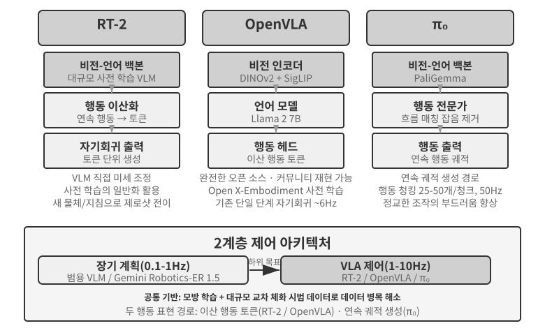


**RT-2와 OpenVLA: 이산 행동 토큰 경로.**

**RT-2**가 이 경로를 개척했다. 대규모 비전-언어 모델을 직접 미세 조정하고 로봇의 연속 행동을 토큰으로 이산화해 텍스트를 생성하듯 하나씩 자기회귀 방식으로 출력한다. 사전 학습 모델의 일반화 능력을 활용해 새 물체와 지침으로의 제로샷 전이를 개선한다. **OpenVLA**는 RT-2의 행동 표현 방식을 따라 언어 모델과 비전 인코더를 하나의 아키텍처로 통합한다. 이미지와 텍스트 지침을 입력받아 행동 토큰을 출력한다. 학습은 두 단계로 이루어진다. 먼저 20개가 넘는 로봇 플랫폼의 현실 조작 시범을 포괄하는 대규모 교차 플랫폼 데이터셋 Open X-Embodiment로 사전 학습해 일반적인 조작 지식을 익힌다. “집기”와 “놓기” 같은 행동 패턴은 서로 다른 로봇에도 공통적이다. 그런 다음 특정 플랫폼의 소량 데이터로 미세 조정한다. 행동 표현이 비슷하므로 여기서 강조할 실질적인 차이는 개방성과 엔지니어링 선택에 있다. RT-2와 학습 데이터는 Google 내부에 있지만 OpenVLA는 완전한 오픈 소스다. 오픈 소스 백본 모델인 Llama 2와 비전 인코더를 공개 데이터셋과 결합해 더 넓은 커뮤니티가 OpenVLA 스택을 재현하고 확장할 수 있다.

**행동 청킹: VLA 영역의 범용 주파수 보상 기법.**

대형 모델의 추론은 느리기 때문에 VLA의 추론 주파수는 전통적인 로봇 제어기의 동작 주파수보다 훨씬 낮다. 전통적인 제어는 보통 50~1000Hz로 실행되지만 VLA 추론은 약 1~10Hz에 그쳐 주파수 차이가 1~3자릿수(약 10~1000배)에 이를 수 있다. 원래의 OpenVLA가 이 문제를 잘 보여 준다. 단일 단계 자기회귀 예측을 사용해 약 6Hz로 추론할 때마다 행동 하나만 출력하며, 뚝뚝 끊기는 움직임은 가장 많이 비판받은 단점 중 하나다. **행동 청킹**은 이 격차를 메우는 일반 기법이다. ACT(Zhao et al., 2023)가 처음 제안했고 이후 π₀, OpenVLA-OFT 등이 채택했다. 모델이 추론할 때마다 행동 하나가 아니라 짧은 미래 행동 순서를 생성한다. 예를 들어 일반적인 π₀ 구성에서는 50Hz 제어 주파수로 25~50개 행동이 담긴 0.5~1초짜리 청크를 생성한다. 제어 스레드가 이 행동을 높은 주파수로 차례차례 실행하는 동안 모델은 백그라운드에서 다음 묶음을 비동기로 생성한다. 현재 행동 묶음의 실행이 끝나기 전에 추론만 마치면 로봇은 연속적이고 부드럽게 움직일 수 있다. 콘텐츠를 미리 불러오는 동영상 버퍼링이 재생 끊김을 막는 것과 비슷하다.

**π₀: 연속 궤적 생성 경로.**

행동 표현의 진정한 경계는 RT-2와 OpenVLA 사이가 아니라 **이산 토큰과 연속 궤적 생성** 사이에 있다. **π₀**는 후자의 경로를 따른다. 이산 행동 토큰을 하나씩 예측하는 대신 확산 모델과 관련된 연속 생성 방식인 흐름 매칭을 사용한다. 무작위 잡음에서 시작해 반복적으로 “잡음을 제거”하여 부드럽고 연속적인 행동 궤적으로 만든다. 이 표현은 행동 청킹과 자연스럽게 결합하며 정밀하고 유연한 움직임이 필요한 정교한 조작 작업에서 더 나은 성능을 낸다. 비유하자면 이산 토큰 접근법은 메뉴에서 “왼쪽으로 5도”, “앞으로 3cm” 같은 명령을 하나씩 고르는 것과 같다. 연속 궤적 생성은 화가가 곡선 전체의 윤곽을 그린 뒤 획마다 다듬는 것에 더 가깝다.

### Sim2Real 전이: 시뮬레이션과 현실의 격차

6장의 시뮬레이션 절에서 시뮬레이션-현실 격차가 생기는 이유와 도메인 무작위화로 대응하는 방법을 이미 설명했으므로 여기서는 반복하지 않는다. 요약하면 시뮬레이션은 현실의 물리, 시각, 하드웨어를 완벽하게 재현할 수 없다. 따라서 학습할 때 이러한 매개변수를 넓은 범위에서 무작위화해 정책이 변화에 견고한 표현을 배우도록 강제한다(그림 9-12). 이제 이 원칙을 실제 로봇 팔에 적용하는 방법을 살펴보자.

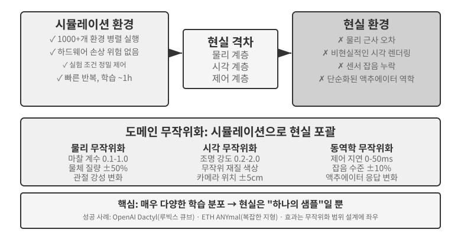

이 접근법은 몇 가지 주목할 만한 성공을 거두었다. OpenAI의 Dactyl 프로젝트는 손 안에서 정육면체의 방향을 바꾸는 데 성공했고, 후속 연구에서는 자동 도메인 무작위화(ADR, Automatic Domain Randomization)를 사용해 한 손으로 루빅스 큐브를 맞췄다. ETH Zurich의 4족 보행 로봇 ANYmal은 눈과 자갈 같은 까다로운 야외 지형에서도 견고하게 이동하는 모습을 보여 주었다.

이 장에서는 도메인 무작위화를 실제 로봇에 적용할 때 건너뛸 수 없는 두 가지 엔지니어링 단계를 더한다. 첫째는 **무작위화 범위 보정**이다. 감으로 범위를 정해서는 안 된다. 너무 좁으면 현실의 변화를 놓치고, 너무 넓으면 학습이 어려워져 “모든 것을 다루지만 어느 것에도 능숙하지 않은” 차선의 정책이 나온다. 실무에서는 먼저 현실 데이터로 마찰 계수, 모터 응답 지연 같은 핵심 매개변수의 분포를 **측정하고 보정**한 뒤 그 범위 안에서 샘플링한다. 시뮬레이션에서 학습한 정책을 실제 로봇에 적용했을 때 성능이 눈에 띄게 떨어지면 시뮬레이션-현실 격차가 허용할 만한 수준으로 수렴할 때까지 범위를 단계적으로 넓힌다. 둘째는 **시각적 정렬**이다. 시뮬레이션과 현실 사이에서 카메라 자세를 정밀하게 보정하고(환경 정렬), 실제 배경 이미지를 시뮬레이션 렌더링에 무작위로 합성해(그린스크린 배경 교체) 시뮬레이션이 실제 로봇이 보는 장면과 최대한 비슷하게 만든다. 실험 9-10에서 두 단계를 모두 보여 준다.

> **실험 9-10 ★★★: 제로샷 RGB Sim2Real 로봇 집기**
>
> LeRobot + ManiSkill 시뮬레이터를 사용해 깊이 센서나 힘 센서에 의존하지 않고 RGB 카메라 이미지만으로 학습한 뒤, 추가 조정 없이 제로샷으로 실제 SO100 로봇 팔에 직접 배포한다. 과정은 다섯 단계다.
>
> 1. **환경 정렬**: 시뮬레이션과 현실 환경의 카메라 위치를 조정하고 두 이미지가 정렬되었는지 시각적 중첩으로 확인한다.
> 2. **배경 교체(그린스크린)**: 실제 환경에서 촬영한 배경 이미지를 무작위로 잘라 시뮬레이션 렌더링 위에 겹쳐 시뮬레이션 배경을 현실에 가깝게 만든다.
> 3. **도메인 무작위화**: 로봇 색상, 물체 질감, 조명 조건, 카메라 시야각 같은 매개변수를 무작위화한다.
> 4. **RL 학습**: 대규모 병렬 시뮬레이션 환경에서 PPO 알고리즘으로 시뮬레이션 성공률이 90%를 넘을 때까지 학습한다.
> 5. **현실 배포**: 실제 로봇에서 집기 작업을 제로샷으로 성공시킨다.
>
> 핵심 성공 요인은 정밀한 환경 정렬, 시각 도메인 무작위화, 물리 매개변수 무작위화이며 세 가지 모두 반드시 필요하다. 한계도 있다. 실제 물체의 모양, 크기, 재질이 학습 분포를 벗어나면 성공률이 크게 떨어진다.[^ch9-6]
>
> [^ch9-6]: LeRobot, “Sim2Real Tutorial”. https://github.com/StoneT2000/lerobot-sim2real/blob/main/docs/zero_shot_rgb_sim2real.md
>
>
> 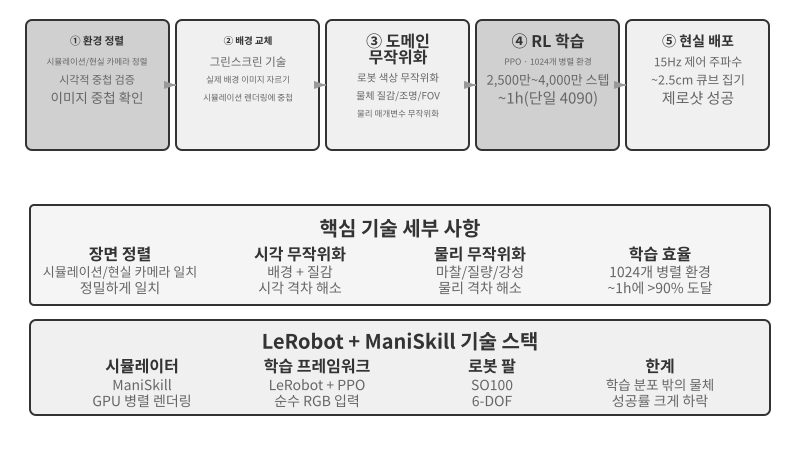
>

## 장 요약

겉으로 보면 세 시나리오는 더 다르기 어려울 만큼 서로 다르지만, 지연과 멀티모달이라는 두 장애물은 모두를 따라다닌다. 음성 에이전트는 직렬 파이프라인에서 엔드투엔드 및 전이중 시스템으로, 분리된 빠른 사고와 느린 사고에서 말하면서 사고하기로 발전했다. 컴퓨터 사용은 이제 OSWorld 같은 벤치마크에서 사람의 정확도에 가까워졌지만 사람보다 훨씬 많은 단계가 필요하고, 작업이 진행될수록 각 단계에 더 오래 걸린다. 아직 체계적인 해법이 없는 효율성 격차다. 시각적 안내를 받아 조작 작업을 수행하는 로봇의 병목은 하드웨어에서 여러 작업에 일반화하는 VLA 제어 계층의 능력으로 이동했다. 다만 촉각 감지와 정교한 로봇 손은 아직 해결되지 않은 하드웨어 한계로 남아 있다. 다음 장에서는 다른 차원의 과제인 여러 에이전트 사이의 협업으로 넘어간다.

## 생각해 볼 문제

1. ★★ 음성 에이전트의 엔드투엔드 모델은 ASR-LLM-TTS를 하나의 모델로 합쳐 지연을 줄이는 대신 모듈성을 잃는다. 엔드투엔드 모델이 음성 인식 같은 특정 단계에서 오류를 내면 직렬 파이프라인보다 디버그하고 고치기가 훨씬 어렵다. 엔드투엔드 음성 에이전트의 관측 가능성 시스템을 어떻게 설계하겠는가?
2. ★ Step-Audio R1은 MPS 이중 두뇌 아키텍처로 “말하면서 사고하기”를 구현한다. 하지만 사람은 “말하면서 사고할” 때 충분히 생각하기 전에 말을 꺼내거나, 스스로 정정하거나, 말채우기 표현을 쓰는 경우가 많다. 에이전트의 “말하면서 사고하기”도 이러한 인간의 특성을 모방해야 하는가?
3. ★★ SoM(Set-of-Mark)과 구조화된 변형인 DOM 요소 인덱싱은 컴퓨터 사용의 시각적 위치 찾기를 개방형 좌표 예측에서 폐쇄 집합 ID 선택으로 바꾼다. 하지만 분할 모델이나 DOM을 사용해 UI 요소를 먼저 감지하고 표시해야 한다. 인터페이스에 비표준 컨트롤이나 동적으로 변하는 요소가 있으면 주석이 불완전하거나 부정확할 수 있다. 이런 경우 좌표 예측으로 되돌아가야 하는가?
4. ★★ XLeRobot 같은 1,000달러 수준의 로봇 플랫폼은 원격 조작 데이터 수집 비용을 낮춘다. 하지만 원격 조작 데이터의 품질은 조작자의 숙련도에 크게 좌우된다. 미숙한 조작자의 저품질 데이터가 VLA 모델 학습에 어떤 영향을 미칠까? 데이터 수집 단계에서 저품질 데이터를 어떻게 자동으로 걸러 낼 수 있는가?
5. ★★★ 이 장에서는 음성, 컴퓨터 사용, 로보틱스라는 세 가지 상호작용 모달리티를 다뤘다. 이들을 관통하는 공통 흐름은 직렬 파이프라인에서 엔드투엔드 모델로의 진화다. 이 추세가 계속된다면 5년 뒤 에이전트의 상호작용 계층은 어떤 모습일까?
6. ★★★ 현재의 컴퓨터 사용은 각 관측이 정적인 프레임인 이산적인 “스크린샷 → 행동 → 스크린샷” 루프로 작동한다. 하지만 사람이 화면을 인식하는 과정은 연속적이다. 애니메이션이 재생되는 모습을 보고, 로딩 진행 상황을 관찰하고, 동영상 내용을 이해한다. 따라서 오늘날의 컴퓨터 사용은 시간적 시각 이해가 필요한 작업을 처리할 수 없다. 연속 시각 스트림의 이해를 지원하려면 인식 계층을 어떻게 다시 설계해야 하는가?
7. ★★ DOM/접근성 트리 요소 인덱싱은 표준 웹 애플리케이션에서 잘 작동한다. 하지만 Canvas/WebGL 렌더링과 크로스 플랫폼 사용자 정의 그리기 컨트롤처럼 접근 가능한 구조화 정보를 제공하지 않아 시각 주석이나 좌표 예측에만 의존하는 소프트웨어 인터페이스가 늘고 있다. 컴퓨터 사용은 순수 시각 접근법에 집중해야 할까, 아니면 구조화 경로와 시각 경로를 모두 유지해야 할까? 두 경로를 모두 유지하는 데 따르는 비용과 이점은 무엇인가?
8. ★★ VLA 모델은 행동 청킹을 사용해 추론 지연을 실행 시간 속에 숨긴다. 본문에서 언급했듯 π₀의 일반적인 구성은 50Hz로 미래 행동 25~50개를 생성한다. 하지만 실행 중 환경이 갑자기 바뀌면, 예를 들어 물체가 이동하면 미리 생성한 행동 순서가 무효가 된다. 행동 청킹의 효율성 이점과 환경 변화에 대한 반응성 요구 사이에서 어떻게 균형을 잡을 수 있는가?
9. ★★★ 이 장의 세 시나리오인 음성, 컴퓨터 사용, 로보틱스는 모두 “인식-사고-행동” 루프의 지연 문제를 마주하며 빠른 사고와 느린 사고를 병렬화하는 방향으로 발전하고 있다. 음성에서는 “잘못 말한 뒤 정정하기”, 컴퓨터 사용에서는 “먼저 클릭한 뒤 보기”, 로보틱스에서는 “먼저 한 걸음 내디딘 뒤 보기”로 나타난다. 빠른 사고에 기반한 이러한 행동이 되돌릴 수 없는 결과로 이어지지 않도록 어떻게 보장할 수 있는가?
