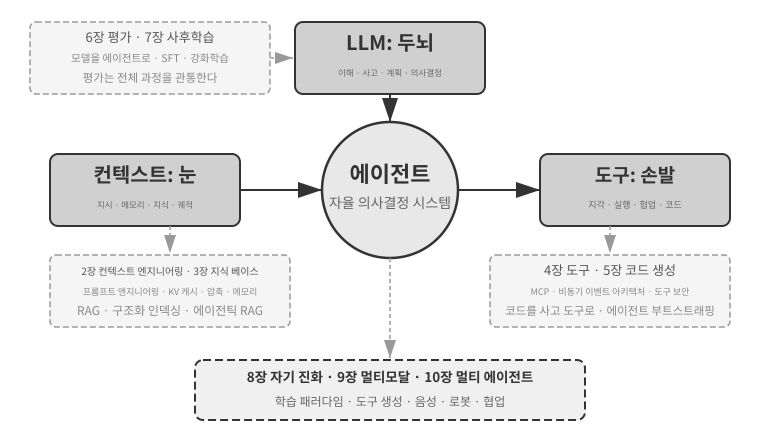
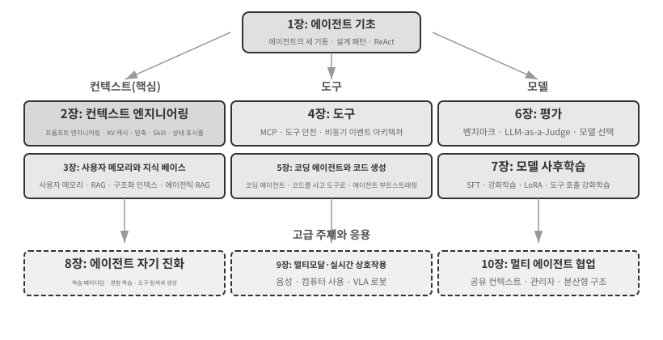

# 들어가며 {.unnumbered}

2025년 8월부터 10월까지 중국의 기술 출판사 투링(Turing)이 운영한 ‘AI 에이전트 부트캠프’에서 기술 강의 시리즈를 진행했다. 목표는 단순했다. AI 에이전트 설계를 직관 중심에서 원칙 중심으로 바꾸는 것, 즉 데모를 실행하는 데 그치지 않고 에이전트가 *왜* 그렇게 설계되었는지, 각 아키텍처 결정 뒤에 어떤 상충 관계가 있는지 이해하는 것이었다. 이 책은 그 강의의 노트와 실험을 정리하고 확장한 결과물이다.

첫 구상부터 완성된 원고까지, 이 책 자체도 **위스퍼 코딩(whisper coding, 받아쓰기 기반 협업)**이라고 부를 만한 방식으로 만들었다. 받아쓰기에 사용한 도구는 우리가 직접 만든 음성 에이전트 Pine이었다. 강의를 준비할 때마다 대략적인 개요를 말로 들려주고, Pine이 주제를 조사해 초안을 구성하도록 했다. 강의가 끝난 뒤에는 부트캠프 수강생의 피드백을 Pine과 공유하고 여러 차례 토론하고 다듬었다. 그렇게 한 번씩 반복할 때마다 강의 노트는 지금 여러분이 읽는 책으로 자라났다. 그 과정에서 키보드로 입력한 일은 거의 없었다. 생각을 소리 내어 말했을 뿐이다. 말하기는 타이핑보다 대역폭이 훨씬 높다(보통 말하는 속도는 타이핑 속도의 약 네 배다). 덕분에 ‘받아쓰기—조사—토론—수정’ 순환을 빠르게 돌릴 수 있었다. 어떤 의미에서 이 책은 에이전트에 관한 책인 동시에, 에이전트의 도움으로 만든 작품이기도 하다.

2025년 초 DeepSeek R1이 공개된 뒤 AI 분야는 순수한 파운데이션 모델 단계, 즉 범용 대규모 언어 모델 백본을 개발하는 단계를 넘어 엔지니어링 배포의 심층부로 들어섰다. 모델 계층의 발전은 두 방향에서 뚜렷하다. 첫째, 에이전트형 강화 학습(Agentic Reinforcement Learning)을 통해 도구 호출 능력이 모델 매개변수에 학습되면서 코딩, 수학, 컴퓨터 사용 같은 영역에서 범용 능력을 갖추게 되었다. 둘째, 모델의 반복 개선 속도가 계속 빨라지고 있다. GPT-5.2에서 GPT-5.5로, Claude Opus 4.5에서 4.8로 도약하는 데 불과 반년밖에 걸리지 않았다. 제품 계층에서는 Manus, Claude Code, OpenClaw 같은 범용 에이전트가 인간과 컴퓨터의 상호작용 방식을 새롭게 정의하며 ‘코드 생성 + 파일 시스템’이라는 아키텍처 패러다임을 주류로 끌어올렸다.

약 1년 전 강의에서 정리했던 에이전트 아키텍처 원칙을 다시 살펴보니 반갑고도 놀라운 사실을 발견했다. **이 원칙들은 낡지 않았을 뿐 아니라 오히려 더 표준적인 원칙으로 자리 잡았다.** 그 뒤 Skill, 하네스(harness), 루프 엔지니어링 같은 새로운 용어가 에이전트 업계를 휩쓸었지만 실제 순서는 반대다. Anthropic 같은 회사가 이런 개념을 발명하고 업계가 뒤따른 것이 아니다. 이미 수많은 에이전트가 같은 일을 하고 있었고, Anthropic은 그 실천을 추려 이름 붙인 설계 원칙으로 정리했다. 실천이 먼저고 이름은 나중이다.

이 원칙에 대한 확신은 현실 세계의 장시간·고위험 업무에 에이전트를 투입하면서 생겼다. Pine AI의 수석 과학자로서 나는 팀과 함께 Pine을 만들었다. 내가 아는 한 Pine은 실제 사람과 자율적으로 상호작용하며, 돈이 걸린 민감하고 복잡한 장시간 업무를 사람의 개입 없이 안정적으로 처리할 수 있는 최초의 범용 에이전트다. 사용자를 대신해 통신사에 전화하여 요금을 협상하고, 판매자에게 환불을 요청하거나 불만을 제기하며, 구독을 해지한다. 이런 업무에서는 수십 차례 협상이 오가는 일이 흔하고, 단 한 번의 실수도 실제 금전 손실로 이어진다. 이처럼 신뢰성을 엄격하게 요구하는 환경이 이 책에서 되풀이해 설명할 아키텍처 원칙을 하나씩 벼려 냈다. 다음은 그 실천에서 나온 사례다.

- Skill이 유행어가 되기 훨씬 전부터 우리는 동적 프롬프트 로딩으로 끝없이 커지는 프롬프트를 제어했고, 명령줄 실행 도구로 끝없이 늘어나는 도구 목록을 제어했으며, 시스템 상태 표시줄을 통해 에이전트가 실행 환경과 사용자의 시간, 자신의 작업 상태를 인식하도록 했다.
- 하네스가 유행어가 되기 훨씬 전부터 우리는 Claude Code와 비슷한 방법으로 불안정한 도구 호출, 환각, 위험한 작업, 권한을 벗어난 작업, 무시된 지시를 처리했다.
- 루프 엔지니어링이 유행어가 되기 훨씬 전부터 우리는 이 책에서 ‘제안자-검토자 방식’이라 부르는 방법을 사용해 모델이 너무 일찍 작업 완료를 선언하지 못하도록 했다.

이 가운데 어느 것도 우리만의 발명은 아니다. 내가 아는 한 주요 모델·에이전트 기업 대부분이 비슷한 방법을 독자적으로 찾아냈다. 그래서 나는 2025년 8월 투링에서 ‘AI 에이전트 부트캠프’를 시작했고, 2024년부터 2026년까지 중국과학원대학에서 실습 중심 AI 에이전트 강의를 꾸준히 진행했다. 또한 이 책을 비공개로 두고 인세를 받는 대신 오픈 소스로 공개하기로 했다. 이 지식이 더 많은 실무자에게 닿기를 바라기 때문이다.

**실천이 먼저고 이름은 나중이다.** 이 순서는 기업의 에이전트 개발에 매우 실용적인 교훈을 준다. **에이전트 관련 유행어가 뜬 뒤에야 실천하기 시작한다면 이미 한 걸음 늦은 것이다.** 어떤 용어가 유행할 즈음이면 선도 기업은 대개 그 용어가 가리키는 문제를 이미 풀어 본 뒤다. 그렇다면 이름이 생기기 전에 무엇을 해야 할지 어떻게 알 수 있을까? 나는 두 가지가 핵심이라고 생각한다.

**첫째, 에이전트의 능력 한계를 극한까지 밀어붙이는 실제 비즈니스를 운영하고 거기서 진짜 피드백을 계속 얻어야 한다.** Pine을 예로 들어 보자. 업무 하나가 몇 시간, 때로는 몇 주 동안 이어지고 여러 이해관계자와 반복해서 소통해야 하는 경우가 흔하다. 몇 시간 동안 전화하고, 컴퓨터로 여러 페이지의 복잡한 양식을 작성하고, 이메일을 몇 차례 주고받는다. 그 모든 과정에서 숫자 하나도 틀려서는 안 되며, 사용자의 이익을 지키도록 매번 신중하게 대화해야 한다. 이 정도로 복잡한 상황에 깊이 들어가야만 모델이 혼자서는 아직 못 하지만 비즈니스에는 꼭 필요한 일을 보완하는 하네스를 실천 속에서 자연스럽게 만들게 된다. 반대로 비즈니스가 능력 한계를 거의 시험하지 않고 모델을 조금 업그레이드하는 것만으로 충분하다면, 이런 아키텍처 원칙을 갈고닦을 이유가 생기지 않는다.

**둘째, 평가(Evaluation) 메커니즘을 구축해야 한다.** 이 책은 같은 요점을 거듭 강조한다. 평가 없이는 발전도 없다. 평가가 있어야 어떤 변경이 정말 더 나은지, 단지 운이 좋았던 것인지 구분할 수 있고, 에이전트의 개선 방향도 직감에 의존하지 않게 된다. 우리가 주장하는 바의 본질은 과학적 방법으로 엔지니어링하고 에이전트를 만드는 것이며, 평가는 그 방법의 토대다. 6장에서 이를 자세히 다룬다.

기반 모델이 아무리 발전하고 제품 형태가 아무리 달라져도 성공한 에이전트 시스템 대부분은 같은 아키텍처 패턴을 따른다. 우연이 아니다. **좋은 설계 원칙은 모델의 반복 개선 주기보다 오래 살아남아야 한다.** 특정 모델의 사용법이 아니라 지능형 시스템이 세계와 상호작용하는 근본 패턴을 설명하기 때문이다.

튜링상 수상자이자 강화 학습의 아버지인 리처드 서튼은 우주의 진화가 먼지, 별, 생명, 에이전트(원래 표현은 ‘설계된 존재’)라는 네 단계를 거쳤다고 말한 적이 있다. 생물학적 진화는 맹목적이다. 무작위 돌연변이와 자연선택으로 진행된다. 생물 대부분은 자신의 작동 원리를 이해하지 못하며, 스스로 생명을 설계하거나 다시 만들 수도 없다. 그러나 에이전트는 우주 진화의 역사에서 완전히 새로운 존재다. 코드를 생성함으로써 스스로를 부트스트랩하고 진화시킬 수 있다. 다른 프로그래머를 작성하고, 그 프로그래머가 다시 다음 프로그래머를 작성하는 프로그래머와 같다. 즉 에이전트는 자신의 작동 메커니즘을 이해하고, 목표가 주어지면 완전히 새로운 에이전트를 만들 수 있으며, 심지어 자기 자신도 개선할 수 있다. 이 책의 사명은 여러분이 이러한 창조의 원리를 이해하고 익히도록 돕는 것이다.

이 책의 핵심 공식은 단 한 문장이다. **에이전트 = LLM + 컨텍스트 + 도구**. 셋 모두 반드시 필요하다.

더 직관적으로 표현하면 **두뇌 + 눈 + 손발**이다. 두뇌(LLM)는 사고와 의사결정을 담당하고, 눈(컨텍스트)은 에이전트가 어떤 정보를 볼 수 있는지 결정하며, 손발(도구)은 에이전트가 무엇을 할 수 있는지 결정한다. 엄밀히 말해 ‘눈’은 대략적인 비유다. 컨텍스트에는 환경 정보와 대화 기록뿐 아니라 도구 정의도 포함되므로 에이전트가 ‘보는’ 정보에는 ‘어떤 손발을 사용할 수 있는가’도 들어간다. 이 비유의 목적은 핵심 직관, 즉 컨텍스트가 모델이 인지할 수 있는 모든 정보라는 점을 전달하는 데 있다.

강화 학습에 익숙한 독자라면 이 세 요소를 강화 학습의 형식 언어에 대응시킬 수도 있다. 구체적으로 LLM은 정책(Policy), 컨텍스트는 관찰 공간(Observation Space), 도구는 행동 공간(Action Space)에 대응한다. 세 표현은 추상화 수준만 다를 뿐 같은 대상을 가리킨다.

## 책의 구성 {.unnumbered}

이 책은 네 단계에 걸쳐 구성된 열 개 장으로 이루어진다(그림 0-2). 1장은 에이전트의 기초 프레임워크를 세운다. 2장부터 5장까지는 컨텍스트, 지식, 도구, 코드 생성을 차례로 살펴보며 에이전트를 만드는 방법을 다룬다. 6장부터 8장까지는 측정 시스템과 모델 사후 학습에서 시작해 운영 경험에 기반한 지속적 진화까지, 에이전트를 평가하고 꾸준히 개선하는 방법을 다룬다. 9장과 10장은 범위를 멀티모달 상호작용과 멀티 에이전트 협업으로 넓힌다.

- **1장(에이전트 기초)**은 실제 에이전트 제품 몇 가지를 살펴보며 에이전트에 대한 직관을 쌓는 데서 시작한다. 이어 에이전트의 핵심 공식을 깊이 탐구한다. 구현 계층의 ‘LLM + 컨텍스트 + 도구’에서 직관 계층의 ‘두뇌 + 눈 + 손발’을 거쳐 학술 계층의 ‘정책, 관찰 공간, 행동 공간’까지 살펴본다. 실험을 통해 ‘사고 → 행동 → 관찰’을 반복하는 ReAct 루프의 작동 방식을 해부하고, 작업 내부의 컨텍스트 적응, 작업 간 외부 산출물 갱신, 학습 주기의 매개변수 갱신을 구분한다. 마지막으로 워크플로부터 자율 에이전트까지 다양한 오케스트레이션 설계 패턴을 설명하여 뒤에 이어질 장을 위한 통합 개념 프레임워크를 세운다.
- **2장(컨텍스트 엔지니어링)**은 이 책에서 가장 중요한 장으로, 에이전트의 ‘눈’인 컨텍스트를 체계적으로 설명한다. API 메시지 구조와 에이전트의 핵심 루프에서 출발해 ‘컨텍스트는 메시지 목록’이라는 토대를 세운 뒤, LLM 추론 중 과거 계산 결과를 재사용하는 KV 캐시의 기반 원리를 살펴본다. 이어 프로세스 중심 설계, 도구 설명, 비즈니스 규칙 개선을 포함한 프롬프트 엔지니어링, 프롬프트 인젝션 공격과 방어, Agent Skills의 온디맨드 로딩 메커니즘, 에이전트 상태 표시줄 기술, 컨텍스트 압축 전략을 다룬다. 각 용어의 완전한 정의는 본문에 처음 등장할 때 제시한다.
- **3장(사용자 메모리와 지식 베이스)**은 컨텍스트 관리를 세션을 넘나드는 지속적 지식 시스템으로 확장한다. 이를 통해 에이전트는 현재 대화를 기억할 뿐 아니라 여러 대화에 걸쳐 지식을 축적하고 검색할 수 있다. 사용자 메모리를 위한 네 가지 점진적 전략, 모델이 답을 생성하기 전에 관련 문서를 검색하는 RAG(Retrieval-Augmented Generation)의 전체 기술 스택, 서로 다른 텍스트 검색 방식과 순위 최적화, 멀티모달 정보 추출, 더 발전된 지식 구성 방식, 그리고 에이전트가 언제 무엇을 검색할지 자율적으로 결정하는 에이전틱 RAG(Agentic RAG)를 다룬다.
- **4장(도구)**은 에이전트와 외부 세계를 잇는 다리를 살펴본다. 도구는 에이전트의 ‘손발’로서 웹 검색, API 호출, 데이터베이스 조작 등을 가능하게 한다. MCP 도구 상호운용성 표준과 인식, 실행, 협업, 이벤트 트리거, 사용자 소통이라는 다섯 가지 도구 범주의 설계 원칙을 소개하며, 특히 실행 도구의 보안 메커니즘과 이벤트 기반 비동기 에이전트 아키텍처를 강조한다.
- **5장(코딩 에이전트와 코드 생성)**은 코딩 에이전트와 파일 시스템의 결합이 모든 범용 에이전트의 핵심 기술 기반이라고 주장한다. OpenClaw 아키텍처를 중심축으로 삼아 코딩 에이전트의 워크플로와 구현 기술을 분석하고, 프로그래밍을 넘어선 코드 생성의 폭넓은 가치를 보여 준다. 사고 보조와 지식 베이스 구축에서 새로운 도구의 동적 생성과 에이전트 부트스트래핑까지 다룬다.
- **6장(에이전트 평가)**은 과학적 평가 방법론을 세운다. 도구 호출과 인간-컴퓨터 상호작용이라는 두 가지 핵심 평가 환경 패러다임, 그리고 장 마지막에서 별도로 다루는 시뮬레이션 환경을 설명한다. 이어 데이터셋 설계 원칙, LLM-as-a-Judge 자동 평가, 평가 기반 모델 선택, 평가 결과를 시스템 개선으로 전환하는 완전한 폐쇄 루프를 다룬다.
- **7장(모델 사후 학습)**은 두 가지 사후 학습 기법을 깊이 살펴본다. 레이블이 있는 데이터로 모델이 예시를 따르도록 가르치는 SFT(Supervised Fine-Tuning, 지도 미세 조정)와, 시행착오 및 보상 피드백을 통해 모델이 자율적으로 개선되도록 하는 RL(Reinforcement Learning, 강화 학습)이다. ‘SFT는 암기하고 RL은 일반화한다’와 ‘알고리즘보다 데이터와 환경이 더 중요하다’라는 중심 논지를 바탕으로 사전 학습/SFT/RL의 전체 지형, 고전 강화 학습 이론, 이진 보상과 과정 보상에서 ‘결과는 보상하고 과정은 제약하는’ 검증 경로 페널티까지의 보상 신호 설계, 단일 턴과 다중 턴 강화 학습 알고리즘, 샘플 효율 최적화 같은 최전선 주제를 다룬다.
- **8장(에이전트의 지속적 진화)**은 에이전트의 운영 경험을 다음 버전의 능력으로 전환하는 방법을 연구한다. 먼저 환경 결과, 과정 규칙, LLM 루브릭으로 이루어진 학습 신호를 정립한다. 다음으로 지식 문서, 프롬프트와 Skill, 프로그램과 하네스, 모델 매개변수라는 네 가지 갱신 매체를 비교한다. 마지막으로 후보 버전 검증, 카나리 출시, 롤백, 장기적 통합을 논의한다.
- **9장(멀티모달리티와 실시간 상호작용)**은 에이전트가 텍스트 세계를 벗어나 물리 세계로 나아갈 미래를 내다본다. 직렬 파이프라인에서 엔드투엔드 모델까지의 음성 에이전트, 에이전트가 사람처럼 그래픽 인터페이스를 조작하게 하는 컴퓨터 사용, VLA(Vision-Language-Action) 모델 제어와 Sim2Real 전이를 포함한 로봇 조작을 다룬다. 이를 통해 멀티모달리티와 실시간 작동이 가져오는 공통 아키텍처 과제를 밝힌다.
- **10장(멀티 에이전트 협업)**은 AI 에이전트 시스템의 궁극적 형태, 즉 여러 에이전트가 일을 나누고 협업하는 방법을 다룬다. ‘공유/독립 컨텍스트 × 동료/관리자/분산형 구조’라는 멀티 에이전트 협업 분류 프레임워크를 체계적으로 제시하고, 번역 에이전트와 전화·컴퓨터 에이전트 사례로 협업 아키텍처 설계를 보여 주며, 에이전트 사회와 에이전트 경제라는 최전선 방향을 살펴본다.

## 이 책을 읽는 방법 {.unnumbered}

각 장은 비교적 독립적이므로 필요에 맞게 읽는 경로를 선택할 수 있다.

- **에이전트 개발자라면** 1장부터 8장까지 순서대로 읽기를 권한다. 앞의 다섯 장은 구축 방법을 제시하고, 6장은 평가의 토대를 세우며, 7장은 모델을 학습하는 방법을 설명하고, 8장은 매개변수와 다른 갱신 매체를 완전한 지속적 진화 루프로 통합한다. 9장과 10장은 멀티모달 상호작용과 멀티 에이전트 협업에 관한 필요에 따라 선택해서 읽을 수 있다.
- **시간이 부족하다면** 전체 그림을 보여 주는 1장과 가장 중요한 기술인 컨텍스트 엔지니어링을 다루는 2장을 우선 읽기 바란다. 2장의 KV 캐시 기반 원리는 기술적인 내용이 많다. 처음 읽을 때는 작동 원리를 건너뛰고 도입부에 제시한 세 가지 핵심 결론만 기억해도 이후 내용을 이해하는 데 문제가 없다.
- **모델 학습이 주된 관심사라면** 7장(모델 사후 학습)으로 바로 가도 좋다. 6장의 평가 방법은 학습의 전제 조건이므로 1장과 2장으로 전체 그림을 파악한 뒤 6장과 7장을 함께 읽기 바란다.

각 장에는 **실험**과 **생각해 볼 문제**가 많이 들어 있으며 ‘실험 X-Y’ 형식으로 번호를 붙였다(X는 장 번호, Y는 장 안에서의 순서다). 실험과 생각해 볼 문제의 제목에는 난이도를 나타내는 별점이 있다. ★는 모든 독자에게 적합한 입문 수준, ★★는 어느 정도 엔지니어링 실습이 필요한 중간 수준, ★★★는 보통 개방형 문제나 복잡한 시스템 설계를 포함하는 고급 도전 과제다. 대부분의 실험에는 실행 가능한 전체 코드가 있으며 부속 오픈 소스 저장소에 정리되어 있다.

> **부속 코드 저장소**: [https://github.com/karais89/ai-agent-book](https://github.com/karais89/ai-agent-book)

저장소의 프로젝트 이름은 책의 실험과 일대일로 대응하며, 각 프로젝트에는 완전한 실행 방법과 의존성 설정이 들어 있다. 이 실험을 직접 실행해 보기를 강력히 권한다. AI 에이전트는 실습이 매우 중요한 분야이며, 많은 설계 직관은 디버깅하는 과정에서만 형성되기 때문이다.

**용어에 관하여**: 이 책에서는 일상적으로 혼용되는 두 용어를 신중하게 구분한다. **사고(Reasoning)**는 사고 모델, 사고의 연쇄, 사고 토큰처럼 모델이 단계별로 생각하는 과정을 뜻한다. **추론(Inference)**은 추론 비용, 추론 스택, 추론 시간 스케일링처럼 배포 시점에 모델이 수행하는 순전파 계산을 뜻한다. 두 개념을 구분하기 위해 한국어판에서는 각각 ‘사고’와 ‘추론’으로 옮겼다. 10장의 번역 사례 연구에서도 이 규칙을 다시 언급한다. 그 밖의 핵심 용어는 본문에 처음 등장할 때 정의한다.

## 사전 지식 {.unnumbered}

이 책은 어느 정도 기술 배경이 있는 독자를 대상으로 하지만 특정 분야의 전문가일 필요는 없다. 자신의 준비 상태를 판단할 수 있도록 사전 지식을 ‘필수’와 ‘권장’ 두 단계로 나누었다.

**필수: 책 전체를 읽기 위한 토대**

- **Python 프로그래밍**: 책의 실험은 거의 모두 Python을 기반으로 한다. Python의 기본 문법, 자주 쓰는 자료구조, 패키지 관리(pip) 같은 기초 개념에 익숙해야 한다. 능숙할 필요는 없지만 중간 정도 복잡도의 Python 코드를 읽고 수정할 수 있어야 한다.
- **LLM 사용 경험**: ChatGPT, Claude 또는 비슷한 제품을 사용해 보았고 ‘프롬프트 → 모델 응답’이라는 기본 상호작용 패턴을 이해해야 한다.
- **AI 보조 프로그래밍 도구**: Claude Code, Codex, Cursor, TRAE 같은 AI 보조 프로그래밍 도구를 하나 이상 설치하고 익숙하게 사용하기 바란다. 한편으로 이런 도구는 많은 코드 작성과 디버깅이 필요한 실험의 속도를 크게 높여 준다. 다른 한편으로 이런 도구 자체가 성숙한 코딩 에이전트다. 사용 과정에서 이 책이 반복해 다루는 핵심 메커니즘, 즉 ReAct 루프, 도구 호출, 컨텍스트 관리를 직접 경험하게 된다. 이러한 경험은 에이전트 설계 원칙을 이해하는 데 매우 중요하다.
- **일반적인 소프트웨어 엔지니어링 지식**: 명령줄 조작, Git 버전 관리, JSON 데이터 형식, REST API 같은 기본 개념에 익숙해야 한다. 이는 실험을 실행하고 에이전트의 도구 호출 메커니즘을 이해하기 위한 토대다.

**권장: 특정 장을 더 잘 이해하기 위한 지식**

- **머신러닝 기초**(7장): 학습과 추론의 차이, 손실 함수, 경사하강법, 과적합 같은 기본 개념을 이해하면 모델 사후 학습을 파악하는 데 도움이 된다.
- **수학 기초**(2–3장, 7장): 선형대수에 대한 직관적 이해, 예를 들어 벡터가 방향과 크기를 나타낼 수 있고 행렬로 일괄 연산을 수행할 수 있다는 정도의 지식은 임베딩과 어텐션 메커니즘을 이해하는 데 도움이 된다. 확률과 통계의 기초 지식은 평가 지표와 강화 학습의 기대 보상을 이해하는 데 유용하다. 이 책의 수학은 복잡한 유도를 다루지 않으며 직관적 설명에 초점을 맞춘다.
- **웹 개발 기초**(4장, 9장): HTTP, WebSocket, 프런트엔드/백엔드 분리 아키텍처 같은 개념을 이해하면 이벤트 기반 비동기 에이전트 아키텍처와 음성 에이전트의 실시간 통신 실험을 파악하는 데 도움이 된다.
- **Transformer 아키텍처에 대한 기본 이해**(2장, 7장): Transformer는 현재 대규모 언어 모델 거의 모두의 기반 아키텍처다. 대규모 모델의 기초 지식을 체계적으로 쌓고 싶은 독자라면 중국어로 출간된 *Illustrating Large Models*(《图解大模型》, 투링 출판)을 참고할 수 있다. Transformer 아키텍처, 사전 학습, 미세 조정 같은 핵심 개념을 직관적인 그림으로 설명하므로 이 책의 에이전트 엔지니어링 관점을 보완해 준다.

이 사전 지식 가운데 일부가 부족하더라도 걱정하지 않아도 된다. 이 책의 핵심 가치는 특정 알고리즘이나 기술이 아니라 **아키텍처 설계 원칙과 엔지니어링 방법론**에 있다. 사후 학습을 다루는 7장을 제외하면 필요한 수학과 머신러닝 지식이 매우 적으므로 출발점으로 삼기에 충분하다.

에이전트 기술은 여전히 빠르게 진화하고 있지만 **좋은 아키텍처 설계 원칙은 시간을 견디는 힘이 있다.** 설계 뒤에 있는 ‘왜’를 익히면 기술의 파도가 몰려와도 분명한 판단력을 유지할 수 있다. 이 책이 여러분의 AI 에이전트 개발 여정에서 믿을 만한 길잡이가 되기를 바란다.

## 감사의 말 {.unnumbered}

원고를 세심하게 편집하고 투링 ‘AI 에이전트 부트캠프’ 과정을 준비해 준 투링의 편집자 멍거와 류메이잉에게 감사드린다. 중국과학원대학에서 실습 중심 AI 에이전트 강의를 개설해 준 류쥔밍 교수에게도 감사드린다. 투링 ‘AI 에이전트 부트캠프’와 중국과학원대학 AI 에이전트 강의의 모든 수강생에게 특별한 감사를 전한다. 강의를 통해 여러분에게서 귀중한 피드백과 조언을 많이 얻었고, 나 역시 이 개념들을 더 선명하게 이해할 수 있었다.

Pine AI의 모든 동료에게 감사드린다. Pine AI라는 훌륭한 제품과 그 제품이 가져온 수많은 도전이 없었다면 에이전트 분야를 이토록 깊이 이해하고 실천하지 못했을 것이다. 동료들은 끊임없는 의견 교환을 통해 귀중한 통찰을 많이 보태 주었다.

AI 업계의 많은 친구에게도 감사드린다. 일일이 이름을 밝히지는 않겠지만, 여러 토론에서 내 견해에 솔직한 피드백을 주고 많은 오판을 바로잡아 주었으며 모델과 에이전트에 대한 이해를 한 단계 높여 주었다.

무엇보다 가족, 특히 아내 멍자잉에게 감사한다. 책을 쓰는 내내 나를 지지하고 많은 소중한 조언을 해 주었다.
